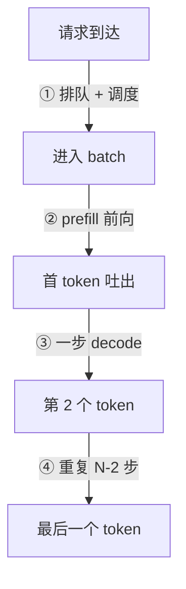

# 推理服务指标

> 🔴 重点考点:本篇直接对应真实面经高频问法,文末「面试考点串联」给出问法对照。

一句话:LLM 推理服务的性能不能用一个数字概括——**用户体验看延迟(TTFT / TPOT),老板看吞吐(token/s),而这两者天生对着干**;这篇就是把这几个指标的定义、耗时构成、相互取舍讲清楚,好让你在压测报告和线上告警里看懂每个数字在说什么。

## 一、三个延迟指标:先把定义钉死

LLM 的生成是**逐 token 吐出**的,所以它跟普通 HTTP 服务不一样:用户不是等整个响应完成才有感知,而是**第一个字出来得快不快、后面的字流得顺不顺**。这就分裂出了两个独立的延迟指标。

| 指标 | 全称 | 定义 | 测的是什么体验 | 典型 SLO 量级 |
|---|---|---|---|---|
| **TTFT** | Time To First Token | 请求**到达服务端**到**吐出第一个 token** 的时间 | 「点了发送之后,多久开始有反应」 | 对话类 < 1 s;RAG 长 prompt 放宽到 2–3 s |
| **ITL** | Inter-Token Latency | **相邻两个输出 token 之间的间隔**,每生成一个就产生一个测量值 | 「流式输出卡不卡顿」 | 看 P99,50–100 ms 以内基本无感 |
| **TPOT** | Time Per Output Token | 除首 token 外的**平均每 token 时间** | 「整体读起来有多快」 | 对齐人类阅读速度,< 50 ms 就比读得快 |
| **E2E Latency** | 端到端延迟 | 请求到达 → 最后一个 token 返回 | 非流式接口的唯一体感 | 由前三者推出 |

### 一条请求的时间线

对着这条线读定义就不会记混:**TTFT = ① + ②**;**ITL = ③ 和 ④ 里每一次的实测值**(共 N−1 个);**TPOT = 这 N−1 个 ITL 的平均**;**E2E = 全程**。

### ITL 和 TPOT 到底什么关系

这是面试最爱追的一句。答案是:**ITL 是分布,TPOT 是这个分布的汇总统计**——TPOT ≈ 所有 ITL 的均值。

$$
\text{TPOT} = \frac{\text{E2E} - \text{TTFT}}{N_{\text{out}} - 1} = \operatorname{mean}(\text{ITL}_1, \text{ITL}_2, \dots, \text{ITL}_{N_{\text{out}}-1})
$$

这个式子在说:把首 token 之后的总时间除以剩下的 token 数,就是平均每个 token 花的时间;分母减 1 是因为第一个 token 已经算进 TTFT 了,不能重复计。

那什么时候该用哪个?

- **看整体体验、做容量规划、算 E2E** → 用 **TPOT**。它是一个数,能直接进公式、能横向比较不同模型和配置
- **排查抖动、定位卡顿** → 必须看 **ITL 的 P99**。均值会骗人:一条请求 200 个 token,199 个间隔都是 20 ms,有一个卡了 2 秒(被抢占重算了),TPOT 只从 20 ms 涨到 30 ms 看着还行,但用户实实在在看到输出**停顿了两秒**

一句话记法:**TPOT 告诉你"平均多快",ITL 的尾部告诉你"会不会卡"**。线上告警两个都要有。

### 一个必须知道的口径坑

不同工具对这几个词的定义**不完全一致**,对齐指标前一定要先问清楚:

- **NVIDIA GenAI-Perf** 把 ITL 直接定义为「相邻 token 的**平均**间隔」,并明说它等同于 TPOT、且分母减 1 排除首 token——在它的语境里 ITL 就是个平均数,不是分布
- **vLLM** 的 Prometheus 指标里两个都有:一个是逐次间隔的直方图(inter-token latency),一个是每请求 TPOT 的直方图——这正好对应上面「分布 vs 汇总」的分工
- Sarathi-Serve 那篇论文用的是第三个词 **TBT**(Time Between Tokens),指的还是同一件事

所以面试被问「ITL 和 TPOT 有什么区别」,标准答法是:**概念上 ITL 是逐次测量、TPOT 是它的均值;但工程上有些工具把 ITL 直接当成均值用,看报告前先确认口径**。这句话说出来比背定义更能体现你真跑过压测。

## 二、TTFT 的时间都花在哪

面经原题:「TTFT 在 server 端耗时主要体现在哪些地方?」按请求经过的顺序拆:

| 环节 | 在干什么 | 量级 / 主导条件 |
|---|---|---|
| **排队等待** | 请求在 waiting 队列里等着被调度进某一步的 batch | **高并发下的绝对大头**,可以吃掉 TTFT 的绝大部分 |
| 准入与调度 | 检查 KV cache 块够不够、和别的请求拼 batch | 本身 < 1 ms;但 KV cache 不够时会退化成「等别人跑完释放」 |
| tokenize | 文本 → token id | 毫秒级;超长 prompt + 慢分词器可到几十 ms,且跑在 CPU 上会和请求处理抢资源 |
| **prefill 前向** | 整个 prompt 过一遍模型,建好 KV cache | 计算量随 prompt 长度增长(attention 那部分是平方项),**计算受限**,是空载时 TTFT 的主体 |
| 首 token 采样 + 后处理 | logits → 采样出 token → detokenize → SSE 推给客户端 | 毫秒级;跨可用区的网络 RTT 可能反而是这里的大头 |

### 为什么说高并发下 TTFT 由排队而非计算主导

因为 **GPU 一步能处理的 token 数有硬上限**(受显存里 KV cache 块数、单步 token 预算约束)。到达率一旦逼近服务率,排队论那套就生效了:队长会**非线性地发散**,而等待时间 ≈ 队长 × 单步耗时。

结果就是那条经典曲线:**随着并发上升,prefill 本身的耗时几乎不变,但 TTFT 的 P99 在接近饱和点时突然翘起来**。这也是为什么调优 TTFT 的手段往往不是「让 prefill 算得更快」,而是「让请求少排队」——加实例、限流、优先级调度、或者干脆把 prefill 拆出去独立扩缩容(见 PD分离 篇)。

**面试直答**:「空载时 TTFT ≈ prefill 计算时间,和 prompt 长度强相关;高负载时 TTFT ≈ 排队时间,和队列深度强相关。看到 TTFT 涨了,第一件事是看队列长度而不是看 kernel。」

## 三、TPOT 的时间都花在哪

decode 阶段每一步只为 batch 里每个请求生成 **1 个 token**,但要把**整个模型的权重从显存里读一遍**。算术强度极低,所以 decode 是典型的**访存受限**(判别方法见 Roofline与Bound分析 篇)。拆开看:

- **权重读取(主导项)**:每步都要搬一遍全部权重。关键性质是——这份开销由 batch 里所有请求**共同摊薄**,batch 越大越划算
- **KV cache 读取**:正比于 batch 内**已生成的总长度**,**摊薄不了**,而且随着对话变长线性增长。这就是长上下文场景里 TPOT 会「越生成越慢」的原因
- **采样**:top-k / top-p 要在十万量级的词表上做排序和归一化,单独看是个小 kernel,但在 batch 小、模型小的时候占比会变得可见
- **与同批请求共享算力的等待**:同一步里所有请求一起前进,**单步时间由整个 batch 决定**。一条超长 prompt 的 prefill 混进这一步,所有人的 ITL 一起抖——这是 ITL P99 毛刺最常见的来源(怎么切分见 连续批处理 篇)
- **每步的框架开销**:调度、组 batch、kernel 启动。小模型上这部分能占大头,CUDA Graph 就是专门用来消掉它的

### batch 越大,单步越慢,但吞吐更高

这条要理解成:权重读取被摊薄了,所以 batch 从 1 涨到 32,单步时间只涨一点点,而每步产出的 token 数涨了 32 倍。

$$
\text{输出吞吐}(B) \approx \frac{B}{\text{TPOT}(B)}
$$

含义是:输出 token/s 等于并发请求数除以单步耗时。在访存受限区,TPOT(B) 增长很慢,所以吞吐几乎线性上升;等 batch 大到算力饱和(或 KV cache 装不下更多请求),TPOT(B) 转为线性增长,吞吐就压平了——**这就是"加 batch 免费提吞吐"的免费额度用完的位置**。

## 四、吞吐指标:三个数,别混着报

| 指标 | 怎么算 | 什么时候用 |
|---|---|---|
| **请求吞吐(RPS / QPS)** | 完成的请求数 / 时间 | 做容量规划、和上游流量对齐 |
| **输出 token 吞吐** | 生成的 token 数 / 时间 | 衡量 decode 效率,和用户实际感受最相关 |
| **总 token 吞吐** | (prompt token + 输出 token) / 时间 | 衡量硬件整体利用率、算成本 |

**必须区分含不含 prompt**:一个 4000 token 输入、100 token 输出的 RAG 请求,总 token 吞吐会是输出 token 吞吐的 41 倍。只报「我们做到了 5000 token/s」而不说输入输出长度,这个数字**没有任何可比性**——这也是面试时可以反问对方的点。

### goodput:为什么裸吞吐会骗人

裸吞吐的问题在于:**它把超时的请求也算成了产出**。一个服务可以靠疯狂堆 batch 把总 token/s 拉到很高,同时让一半用户的 TTFT 超过 5 秒——这些用户早就关掉页面了,但吞吐报表上依然很好看。

**goodput** 就是为了堵这个漏洞:**只统计同时满足所有 SLO 的那部分请求的吞吐**。

$$
\text{goodput} = \frac{\#\{\text{请求} \mid \text{TTFT} \le T_1 \ \wedge\ \text{TPOT} \le T_2\}}{\text{总时间}}
$$

意思是:分子只数那些「首 token 够快**并且**后续吐字够顺」的请求,不达标的一律记 0 分。DistServe 那篇论文就是用 goodput 作为核心优化目标,来论证 PD 分离的收益的。

**为什么它更有意义**:它把「延迟约束」直接编码进了吞吐指标里,于是「吞吐 vs 延迟」这个二维取舍塌缩成了**一个可以直接最大化的数**。调参时你不用再纠结「TPOT 涨 10 ms 换 20% 吞吐值不值」——看 goodput 涨没涨就行。

## 五、端到端延迟公式

$$
\text{E2E} \approx \text{TTFT} + \text{TPOT} \times (\text{输出长度} - 1)
$$

人话:总时间 = 等到第一个字的时间 + 剩下每个字的平均时间 × 剩下的字数。减 1 同样是因为首 token 已经计入 TTFT。

**适用条件要说清楚**,这是追问点:

1. **TPOT 在整条请求生命周期内近似稳定**——负载平稳、batch 组成不剧烈变化。如果中途来了一波流量、或者请求被抢占过,实际 E2E 会明显大于公式值
2. **它是期望值,不是上界**。想估 P99 E2E,不能拿 P99 TTFT 加 P99 TPOT(那会严重高估),得直接测 E2E 的 P99
3. **输出长度是关键变量**。同一个服务,输出 100 token 和输出 2000 token 的 E2E 差 20 倍,所以压测必须固定输出长度分布才能对比

反过来用,这个公式就是容量规划的入口:**给定 SLO 的 E2E 上限和典型输出长度,能反推出 TPOT 必须做到多少**。

## 六、吞吐与延迟的取舍:所有调参的核心曲线

把第三节和第四节合起来,就是这条必须刻在脑子里的关系:

| batch 变大 | 吞吐 | TTFT | TPOT / ITL | 显存 |
|---|---|---|---|---|
| 常见趋势 | 饱和前可能上升(权重读取被摊薄) | 取决于排队、prefill 工作量与调度 | 单步工作量增加,延迟可能变差 | KV cache 占用通常上升 |
| 到极限后 | 压平 | 反转上升(KV 装不下,开始等) | 快速恶化 | OOM 或触发抢占 |

TTFT 与 TPOT 对 batch 的反应**不保证方向相反**:多收请求可能减少排队,也可能让 prefill 或混合批次更重。先固定输入/输出长度与到达负载,逐档增加并发或批处理预算,记录吞吐及 TTFT、TPOT 的分位数;选择满足延迟目标的最高有效吞吐,不能只追 token/s 峰值。**chunked prefill** 用较小的 prefill 块减轻对 decode 的干扰,**PD 分离**则把两个阶段放到不同实例;具体机制与代价见 连续批处理 篇和 PD分离 篇。

## 七、压测怎么做才不骗自己

### 标准流程

1. **warmup**:先打几十到上百条请求跑热。冷启动时的权重加载、CUDA Graph 捕获、编译缓存、显存池首次分配都会污染前几条数据
2. **固定输入/输出长度分布**:输入按线上真实分布采样(或至少覆盖短/中/长三档),输出用 `ignore_eos` + 固定 `max_tokens` 锁死——否则不同轮次生成长度不同,数字根本不可比
3. **并发梯度扫描**:并发数取 1, 2, 4, 8, 16, 32, 64… 每档跑够时长,画出「并发 → 吞吐 / TTFT / TPOT」三条曲线。**拐点就是你的容量上限**
4. **报 P50 / P90 / P99,不报均值**:延迟分布是重尾的,均值几乎必然低于你的实际体感
5. **同时记录服务端指标**:队列长度、KV cache 使用率、抢占次数。光看客户端数字定位不了原因

### 常见坑

| 坑 | 后果 | 怎么避 |
|---|---|---|
| 只看平均延迟 | 长尾被彻底掩盖,线上炸了才发现 | 强制看 P99;ITL 也要看 P99 |
| 测试输入长度和线上不符 | 用 128 token 压测、线上是 2000 token 的 RAG prompt,TTFT 差一个数量级 | 用线上采样的真实 prompt 长度分布 |
| 没 warmup | 前几条把 P99 拉爆 | 丢弃 warmup 段的数据 |
| 客户端成为瓶颈 | 测出来的 ITL 其实是客户端的调度延迟 | 多进程/异步压测,先确认客户端 CPU 没打满 |
| 闭环压测(固定并发) | 请求做完才发下一条,**永远压不出排队爆炸** | 想找过载点必须用开环(固定到达率)压测 |
| 输出长度没锁死 | 每轮生成长度不同,吞吐数字随机浮动 | `ignore_eos` + 固定 max_tokens |

## 八、容量规划:由 SLO 反推实例数

顺序是**反着推**的,四步:

1. **定 SLO**:比如 TTFT P99 ≤ 1 s、TPOT P99 ≤ 50 ms、典型输出 300 token → 由 E2E 公式得 E2E ≈ 1 + 0.05 × 299 ≈ 16 s
2. **压测出单实例的达标并发**:做并发扫描,找出**仍然满足上面两条 SLO** 的最大并发数(注意是 goodput 意义下的达标,不是吞吐峰值——**吞吐峰值那个点通常已经违反 SLO 了**)
3. **由目标 QPS 算所需并发**,用 Little's Law:

$$
\text{系统内平均并发数} = \text{到达率}\ \lambda \times \text{平均驻留时间}\ \text{E2E}
$$

意思是:如果每秒来 10 条请求、每条平均在系统里待 16 秒,那么任意时刻系统里平均有 160 条请求同时在跑。这 160 就是你必须撑住的并发。

4. **算实例数**:实例数 = ⌈所需并发 / 单实例达标并发⌉,再乘一个余量系数(留给流量尖峰、滚动升级、故障摘除,通常 1.3–1.5 倍)。

**最容易答错的地方**:第 2 步如果用「吞吐最高的并发」当单实例容量,算出来的集群一定不够——因为那个点的 TPOT 早就超了 SLO。**容量规划要用 goodput 的拐点,不是 throughput 的峰值。**

## 九、面试考点串联

| 高频问法 | 本文哪一节 |
|---|---|
| TTFT 是什么?TPOT 是什么?ITL 是什么? 真题来源:[B002-Q012](../../../docs/references/面经原题.md#b002-g01-q012)、[B002-Q095](../../../docs/references/面经原题.md#b002-g01-q095) | 一(定义表) |
| TPOT 和 ITL 的关系是什么? | 一(ITL 是分布、TPOT 是它的均值;看抖动用 ITL P99) |
| TTFT 在 server 端耗时主要体现在哪些地方? | 二(五个环节;高并发下排队主导) |
| TPOT 耗时主要体现在哪? | 三(权重读取 + KV 读取 + 采样 + 同批等待) |
| 端到端延迟怎么估? | 五(公式 + 三条适用条件) |
| 有哪些吞吐指标?goodput 是什么、为什么更有意义? | 四 |
| 吞吐和延迟怎么取舍?batch 调大有什么影响?（平台整理题追问 P002-Q009） 真题来源:[B002-Q021](../../../docs/references/面经原题.md#b002-g01-q021)、[B002-Q035](../../../docs/references/面经原题.md#b002-g01-q035) | 三(摊薄)、六、吞吐与延迟的取舍:所有调参的核心曲线 |
| 推理服务怎么压测?要注意什么? | 七(流程 + 六个坑) |
| 给定 SLO 怎么估需要几张卡? | 八(Little's Law + goodput 拐点) |
| 为什么 decode 是访存受限的? | 三(权重读取主导);定量判别见 Roofline与Bound分析 篇 |

> 本表混有面经原题、自拟题与平台整理题 P002-Q009 的追问;平台题不因此视为面经。

延伸阅读顺序:本篇(先会看指标)→ 连续批处理(调度怎么影响这些指标)→ PD分离(把 TTFT 和 TPOT 解耦)→ Roofline与Bound分析(为什么 prefill 计算受限、decode 访存受限)。

## 相关文献

- vLLM Metrics 设计文档(TTFT / inter-token latency / TPOT / 队列时间的官方指标定义)— https://docs.vllm.ai/en/stable/design/metrics/
- NVIDIA GenAI-Perf(Triton 侧的 LLM 压测工具,含 TTFT / ITL 口径说明)— https://docs.nvidia.com/deeplearning/triton-inference-server/user-guide/docs/perf_analyzer/genai-perf/README.html
- NVIDIA NIM LLM Benchmarking · Metrics(TTFT 含排队与网络、e2e = TTFT + 生成时间的明确定义)— https://docs.nvidia.com/nim/benchmarking/llm/latest/metrics.html
- DistServe: Disaggregating Prefill and Decoding for Goodput-optimized Large Language Model Serving(goodput 作为优化目标)— [arXiv:2401.09670](https://arxiv.org/abs/2401.09670)
- Taming Throughput-Latency Tradeoff in LLM Inference with Sarathi-Serve(吞吐-延迟取舍与 chunked prefill)— [arXiv:2403.02310](https://arxiv.org/abs/2403.02310)
