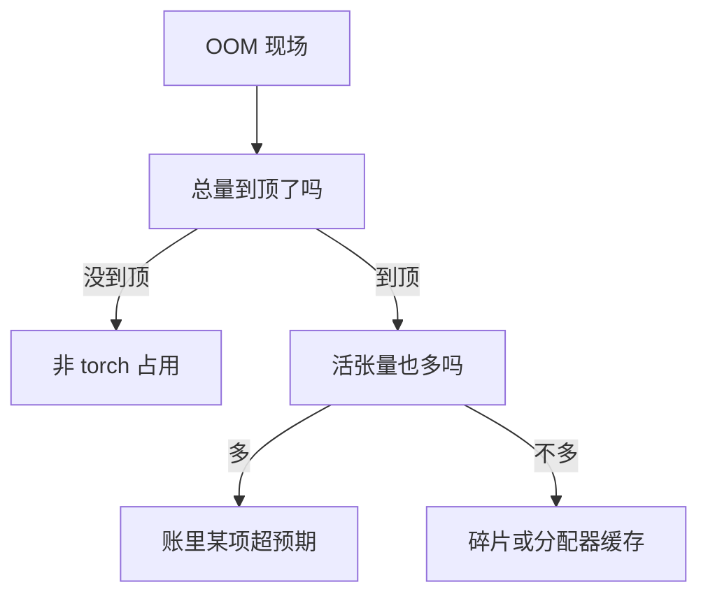

# 显存管理与 OOM

> 🔴 重点考点:本篇直接对应真实面经高频问法,文末「面试考点串联」给出问法对照。

一句话:显存不是一个数,而是**一本账**——OOM 极少是"卡太小",通常是"某一项比你以为的胖",或者"还剩几个 G 却凑不出一整块"。本篇把训练侧与推理侧的账各列一遍,讲清让账对不上的两个元凶(PyTorch 缓存分配器、碎片),再给排查顺序和「手段 → 省哪一项 → 代价」的对照表。

## 一、先分清 OOM 的四种病

报错那一行长得都一样,但病因只有四类,**修法完全不同**:

| 病因 | 现象 | 该动的手 |
|---|---|---|
| **总量真不够** | 权重都装不下,或刚开跑就爆 | 切分、量化、换卡 |
| **某一项估错** | 跑一阵才爆,峰值集中在某个模块 | 找出那一项,单独治它 |
| **碎片** | 剩几个 G,却申请不到一块 1 G 的张量 | 改分配顺序、开可扩展段 |
| **非 PyTorch 占用** | `nvidia-smi` 满了,PyTorch 说自己没用多少 | 查通信库、第三方 kernel、别的进程 |

判别只要两个数:分配器**向 CUDA 要到手的总量**(reserved)与**当前活着的张量之和**(allocated)。



这张图就是本篇的骨架:**先把账列清(二、三节),再看分配器与碎片(四、五节),最后才动配置(八节)。** 顺序反过来就是碰运气。

## 二、训练侧的账:七项,只有一项随负载长

设参数量 $\Psi$,采用 16 位参数与梯度、独立 FP32 主权重及两份 FP32 Adam 状态,未分片、未卸载。以下 GB 按十进制计算:

| 项 | 怎么估 | 随什么长 | 7B 量级参考 |
|---|---|---|---|
| 参数(bf16) | $2\Psi$ | 模型 | 14 GB |
| 梯度(bf16) | $2\Psi$ | 模型 | 14 GB |
| 优化器状态(fp32 主权重 + 一阶 + 二阶动量) | $12\Psi$ | 模型 | 84 GB |
| **激活** | 见下式 | **微批 × 序列长度** | 17–97 GiB |
| 临时 buffer | 按最大的那个算子 workspace 算 | 算子实现 | 几百 MB |
| 通信 buffer | 每个通信域一份收发区 | 并行度、消息大小 | 几百 MB 起 |
| 分配器缓存与碎片 | 需结合块分布判断,不能只用 reserved − allocated | 分配与释放顺序 | 视负载而定 |

前三项合起来 $16\Psi$ 字节,是训练账里最好算的一块;它们怎么被切到多卡上、通信量涨多少,见 ZeRO 篇,本篇只把它当账上的一行。

### 激活:唯一随负载膨胀的那一项

Megatron 团队给出的每层激活量(16 bit 存储,dropout mask 按 1 字节算):

$$
M_{\text{激活}} \;\approx\; L \cdot s\,b\,h\left(34 + 5\,\frac{a\,s}{h}\right)
$$

$L$ 层数、$s$ 序列长度、$b$ 微批大小、$h$ 隐藏维、$a$ 注意力头数。括号里的 34 是每个 token 每层要留着等反向用的那堆中间结果;后一项 $5as/h$ 来自 $s \times s$ 的注意力分数矩阵——**它对序列长度是平方的**,长序列下会把整条账吃光。

代入 7B 级配置($L{=}32$、$h{=}4096$、$a{=}32$、$s{=}4096$、$b{=}1$):括号里是 $34 + 160 = 194$,每层约 3.0 GiB,**32 层合计约 97 GiB**——和三大件是同一个量级,而且这还只是**一个**微批。

但要注意口径:这条公式来自 FlashAttention 普及之前,$5as/h$ 那 160 正是那张不落显存就不存在的分数矩阵。避免保存该矩阵的算法能去掉这类平方存储项。仅把公式中的平方项移除,可得约 17 GiB 的线性部分参考值,但这不等于任何 FlashAttention 实现的实际占用,其保存张量、dropout 与重算安排仍需核实(机制见 FlashAttention 篇)。所以看到"激活占多少"的数字,先问一句用的哪套 attention。

三条直接结论:

1. **三大件按模型固定**,算一次就不用再管;省它靠切分与 offload
2. **激活是随微批和序列长度变化的主要项**,临时张量、logits 与通信缓冲也可能随形状变化,要据实测峰值选手段(重算、沿序列切分)
3. **训练账里没有 KV cache 这一行**——K/V 可能作为反向所需激活保存或重算,但不作为自回归生成的跨步缓存保留。这是训练与推理两本账最大的结构差别

### 全参改成 LoRA,哪些账会消失

按本节精度假设,冻结基座 $P_f$ 个参数、LoRA 可训练部分 $P_t$ 个参数,模型状态约 $2P_f+16P_t$ 字节。假设冻结 7B、可训练 10M,约 14.16 GB;对照全参 7B 的 112 GB,省掉的主要是冻结部分的梯度和优化器相关状态。反向仍要穿过基座,激活不会按可训练参数比例缩小。具体低秩与量化方案见 LoRA 篇。

$16P$ 不是所有训练的常数。梯度改成 FP32 会改变账本,纯 FP32 训练则没有另加主权重的必要。激活重算适合激活占大头的情况;需要完整参数更新但状态放不下时比较分片或卸载,需要参数高效适应时评估 LoRA,不能只比显存不测质量和耗时。

## 三、推理侧的账:KV 是残差项

| 项 | 怎么估 | 随什么长 | 特点 |
|---|---|---|---|
| 权重 | 参数量 × 每参数字节 | 模型、量化位宽 | 常驻,一条直线 |
| **KV cache** | 每 token 字节 × 并发 × 上下文 | **并发 × 上下文** | 唯一线性膨胀项 |
| 激活峰值 | 单步最大的那几个中间张量 | batch、chunk 大小 | 用完即还,但峰值要留住 |
| CUDA Graph 图池 | 档位数 × 每档中间张量 | 捕获档位配置 | 常驻,**不可回收** |
| 分配器缓存 + 碎片 | reserved − allocated | 分配历史 | 名义可回收,实际常还不掉 |
| CUDA context + 非 torch | 经验值 | 进程数、通信库 | 几百 MB 量级 |

每 token 的 KV 字节怎么算、GQA 怎么把分母砍小,见 KVCache 篇,这里直接用结论;图池为什么必须独立于常规池,见 CudaGraph 篇。

关键在于这几项**不是并列关系**。推理引擎启动时先跑一遍 dummy 前向量出激活峰值,再把水位线以下剩的**全部**划给 KV:

$$
M_{\text{KV}} \;=\; M_{\text{总显存}} \times u \;-\; M_{\text{权重}} \;-\; M_{\text{非 torch}} \;-\; M_{\text{激活峰值}} \;-\; M_{\text{图池}}
$$

$u$ 就是 `gpu_memory_utilization` 这类水位线(常见 0.9)。这个式子只说一件事:**KV cache 是个残差项**。前面任何一项估多一点,KV 的额度就少一点,能开的并发和上下文直接跟着掉——vLLM 的启动日志正是按这个顺序逐项打印的。

两条推论后面反复要用:**"decode 到一半 OOM"往往不是 decode 变胖了,是别人先胖了**(第六节);水位线 $u$ 留出的那 10% 是给"估不准的部分"的**安全余量**,不是浪费(第八节)。

## 四、缓存分配器:三个口径为什么对不上

### 为什么 PyTorch 要自己管

`cudaMalloc` / `cudaFree` 都很贵,更要命的是 `cudaFree` 会引入**设备同步**,打断"CPU 跑在 GPU 前面"的异步流水(见 CUDA流与异步执行 篇)。所以 PyTorch 自己接管:向 CUDA 大块大块地要,内部切给张量;张量析构时**只还进自己的空闲链表,不还给 CUDA**,目标是跑几步后进入稳态——**再也不调 `cudaMalloc`**。代价是账面上多了两层:

| 口径 | 怎么看 | 含什么 |
|---|---|---|
| **allocated** | `torch.cuda.memory_allocated()` | 当前活着的张量之和(每笔按 512 B 向上取整) |
| **reserved** | `torch.cuda.memory_reserved()` | 分配器从 CUDA 要来的全部段,**含其中的空闲块** |
| 进程占用 | `nvidia-smi` | reserved + CUDA context + 通信库 / 第三方 kernel 的分配 |

于是那个高频问法有了确切答案:**`nvidia-smi` 比 `memory_allocated()` 大出来的部分 = (分配器缓存 + 碎片) + (CUDA context + 非 PyTorch 分配)**。官方文档的说法很直白:分配器手里没用上的显存,在 `nvidia-smi` 里照样显示成已占用。

### 分池与分块

- 所有请求先**向上取整到 512 B 的倍数**
- 以 **1 MiB 为界分两个池**:小于走小块池,不小于走大块池,**两池互不相通**
- 向 CUDA 要新段时按档要:小于 1 MiB 要 2 MiB;1–10 MiB 要 20 MiB;大于 10 MiB 向上取整到 2 MiB 的倍数
- 取块用 best fit(最小的够用块),多出来的部分**切分**成小块留用;释放时与**相邻**空闲块合并

最后半句是第五节所有麻烦的根源:**合并只能发生在同一个段内部。**

### `empty_cache()` 为什么通常没用,甚至有害

四条,答全了就够:

1. **它只能还掉整段全空的段。** OOM 现场恰恰是"空闲块被活张量钉在段里",那种段一格都还不了
2. **分配器在抛 OOM 之前已经自动做过等价动作了**:先把所有空闲块 `cudaFree` 掉、重试一次 `cudaMalloc`,还不行才报错。所以手动调它救不了已经发生的 OOM
3. **它把稳态砸了**。还回去的下次还得重新要,而 `cudaFree` 自带同步,吞吐直接掉
4. 它真正的用途只有一个:**把显存让给同进程里的别人**(另一个框架、另一个引擎),不是给自己腾地方

## 五、碎片:剩着几个 G,却申请不到一块

### 段边界是根因

每次向 CUDA 要显存都返回一个**独立的段**,段与段之间的空闲块**永远合并不了**。这不是 bug,是 API 的形状决定的。PyTorch 官方讲这件事用的例子最清楚:

先申请 8 个 16 MiB 的张量 → 分配器要来 8 个独立段,各装一个;全部释放后,8 个段里各躺着一块 16 MiB 空闲块,**加起来 128 MiB,但没有任何一块装得下 32 MiB**。此时再要 4 个 32 MiB,只能重新 `cudaMalloc`,那 128 MiB 白占。

把顺序倒过来:先要 4 个 32 MiB、释放,再要 16 MiB 的——每个大段里切两块就够了。**同一份负载,只是顺序不同,reserved 差一倍。**

这就是"明明还剩几个 G 却 OOM"的确切机制:**剩的是总量,要的是一整块连续**。所以"大小不一的张量反复申请释放"最伤——每种尺寸都在制造自己那一档的空洞,而空洞跨不过段边界。变长输入、变长 chunk、变长 batch 都属于这一类。

### 可扩展段的思路(讲原理,不背配置项)

CUDA 的虚拟内存 API 把两件事拆开:**预留虚拟地址空间**(便宜,不占显存)和**提交物理页**(真花钱)。可扩展段的做法是:一个池只预留一整段巨大的连续**虚拟**地址,物理页按需往里 map(大块按 20 MiB 一页)。于是段边界消失,**相邻空闲块可以合并**,上面那个"先小后大"的例子直接被治好。

边界也要说清,否则就成了万能药:

- 中间夹着**长寿命**张量时,它把切分钉住,空闲块照样跨不过去——可扩展段治的是"段边界",治不了"活张量挡路"
- 小块池 / 大块池仍以 1 MiB 分界,跨界依然不共享
- 它走 VMM 路径,与部分依赖自定义分配器的通信库注册流程、跨进程共享路径不兼容

同一条思路的学术版是 GMLake:用虚拟地址把非连续的物理块"缝"成一整块交给上层,在 A100 上平均省下约 9 GB 显存、碎片率降约 15%。

### 推理侧:KV 那一项的碎片已经单独解决了

分页把 KV cache 切成**固定大小**的块,块一样大就不存在"洞太小塞不进去",外部碎片由构造消失(见 PagedAttention 篇)。**所以推理引擎里的碎片主要不在 KV 上,而在激活和临时 buffer 上**——这条容易答反。

## 六、decode 阶段什么场景会 OOM

总纲两句:**decode 的显存占用是单调上升的**,每步给每条序列 append 一个 token,只涨不跌,所以准入时不爆不代表 500 步后不爆;而 KV 在账里是**残差项**,任何别的项多吃一口,都表现成"decode 到一半 OOM"。

| 场景 | 机制 | 典型触发 |
|---|---|---|
| **长上下文 × 高并发** | KV 正比于「并发 × 上下文」,而调度器是按**当前**长度准入的,后面几百步的增量没被算进准入判断 | 长文档问答、长历史多轮 |
| **batch 里混进超长序列** | 单条 128K 请求抵几十条短请求;更隐蔽的是 attention 的元数据(块表、长度向量)与临时 buffer 按 batch 里**最长那条**开,一条长的把整批峰值抬上去 | 混合长度流量、无长度分桶 |
| **前缀缓存占住不放** | 被活跃请求引用的共享块引用计数不为 0,**不可回收**;没人引用的历史块虽可淘汰,但淘汰前一直算已占用,可用块数看起来就是少(见 RadixAttention 篇) | 命中率高、缓存池设得大 |
| **CUDA Graph 图池抢显存** | 图里 kernel 用的是捕获时的**绝对地址**,必须跨重放一直有效,不能还给常规池;而 KV 是残差项,图池吃一块 KV 就少一块(见 CudaGraph 篇) | 捕获档位多、最大档位大 |
| **投机解码多一份 draft** | draft 的权重与 KV 是额外常驻项;更容易漏的是**一次验证要吃 $k+1$ 个位置**,激活峰值按「并发 × $(k{+}1)$」行算而不是并发行(见 投机解码 篇) | 猜测步数调大 |
| **量化的元数据与临时区** | per-token 动态量化的 scale 每步现算、要落一份;反量化若没和后续算子融合,还多出一份高精度中间张量。单看都不大,但全在 KV 的残差额度里扣(见 KVCache量化 篇) | 同时开多种量化 |
| **激活与 buffer 的碎片** | KV 那一项已被分页治好,剩下的碎片都长在变长激活和临时 buffer 上(第五节) | 变长 chunk、变长 batch |

分离部署下 decode 侧还多两条(接收 buffer 常驻、为在途 KV 预留的块),见 PD分离 篇;调度器怎么准入与抢占见 连续批处理 篇。

## 七、排查:先看账,再动手

训练侧先定位 OOM 发生在加载、前向、反向还是首次优化器更新,检查目标序列长度、微批以及各阶段峰值;优化器状态可能到首次更新才分配。对比 allocated、reserved 和设备总占用,必要时抓快照。推理侧再按下面的预算分解检查。

**第一刀:读预算分解。** 引擎启动日志里那行「总显存 × 水位线 = 额度,减去权重、非 torch、激活峰值,余下给 KV」就是账本身。先确认给 KV 的余额是多少、和你要的并发对不对得上。**对不上就是估算问题,根本不是碎片问题**,后两刀可以不用了。

**第二刀:看分配器统计。** `reserved − allocated` 差值大,只说明分配器手里压着一堆空闲块,这一个数**分不开"缓存"和"碎片"**;真正能分开的是另外两个——被切分出来又还不回去的空闲字节(`inactive_split_bytes`)是**碎片的直接指标**,而 `cudaMalloc` 的重试次数(`num_alloc_retries`)**不为 0 就说明分配器没进稳态**。

**第三刀:抓显存快照。** 统计只给总数,快照给的是"谁在占、从哪申请的":

```python
# 开录:每次分配都带上调用栈
torch.cuda.memory._record_memory_history(max_entries=100_000)

run_one_step()                    # 跑到能复现峰值或 OOM 的那一步

torch.cuda.memory._dump_snapshot("snap.pickle")          # 落盘
torch.cuda.memory._record_memory_history(enabled=None)   # 关录
```

落盘的文件拖进官方的 memory_viz 页面(纯前端,不上传数据),看两个视图:

- **活跃内存时间线**:每条色带是一个活着的张量,点上去出调用栈。**只看峰值那一列**,按栈归因到模块——哪一项估错了一眼就出来
- **分配器状态历史**:每个段被切成了什么样、OOM 那一刻卡在哪一格。段里空洞又多又碎 = 碎片;段整齐但就是不够 = 真不够

一句话记法:**统计告诉你"是哪一类病",快照告诉你"是哪一行代码"。** 时间维度上的性能归因是另一套工具,见 性能分析与Profiling 篇。

## 八、手段 → 省哪一项 → 代价

| 手段 | 省的是哪一项 | 代价 |
|---|---|---|
| **重算(activation checkpointing)** | 激活 | 反向时重做一次前向。原始论文用 $O(\sqrt{n})$ 显存换约 +30% 时间;只重算 attention 里那几个"又便宜又占地"的算子(选择性重算),可把激活降约 5×、重算开销砍掉九成以上 |
| **offload 到 CPU / NVMe** | 优化器状态、梯度、参数 | PCIe 比 HBM 慢两个数量级,藏不住就是 GPU 等货(见 ZeRO 篇) |
| **切分(ZeRO / TP / PP / EP)** | 三大件、权重 | 通信量上升且落在关键路径上(见 ZeRO 篇、并行策略 篇) |
| **分页** | KV 的内部与外部碎片 | kernel 多一层查表(见 PagedAttention 篇) |
| **量化(权重 / KV)** | 权重、KV cache | 精度损失 + 反量化开销(见 量化 篇、KVCache量化 篇) |
| **限并发 / 限最大序列长** | KV 的**上界** | 把 OOM 换成排队:吞吐或可服务长度下降,但至少可预测 |
| **调水位线** `gpu_memory_utilization` | 给 KV 的额度 | **调高**吃掉安全余量,任何一项估算偏差都变成 OOM;**调低**则 KV 变小、抢占变频繁,吞吐塌 |
| **减少图档位 / 多图共池** | CUDA Graph 图池 | launch 开销回来一点(见 CudaGraph 篇) |
| **开可扩展段** | 碎片 | 部分 VMM / 跨进程共享路径不兼容;长寿命张量夹住时无效(第五节) |
| `empty_cache()` | 几乎什么都不省 | 砸掉稳态、引入同步;OOM 前分配器已自动做过等价动作 |

选择顺序按第一节的四种病走:**总量不够就切分和量化;某项估错就单独治那一项;碎片就改分配顺序或开可扩展段;非 torch 占用就去查通信库和别的进程。** 越过诊断直接调水位线,是最常见也最没用的一步。

## 面试考点串联

| 高频问法 | 本文哪一节 |
|---|---|
| decode阶段一般在哪些场景下会oom? | 六(七类场景,每类给机制) |
| 训练或 LoRA 微调需要多少显存,哪些项不能靠参数量直接算?(平台 P002-Q072/Q107/Q238) | 二(三大件 + 激活公式;激活最容易漏,还要问用没用 FlashAttention) |
| 推理时显存都花在哪儿?KV cache 能分到多少是谁定的? | 三(六项账 + KV 是残差项) |
| `nvidia-smi` 看到的显存比 `torch.cuda.memory_allocated()` 大一大截,中间那些是什么?怎么判断是缓存还是碎片? | 四(三个口径)+ 七(被切分块与重试次数) |
| 为什么 PyTorch 要自己做一层缓存分配器,不直接用 `cudaMalloc`? | 四(cudaFree 带同步,会打断异步流水) |
| `empty_cache()` 该不该调?为什么大多数时候没用? | 四(只还整段全空的段;OOM 前分配器已自动做过) |
| 显存明明还剩好几个 G,为什么还会 OOM?能怎么缓解? | 五(段边界合不了 + 可扩展段的思路与边界) |
| 分配顺序也会影响显存占用吗? | 五(先小后大 vs 先大后小,reserved 差一倍) |
| OOM 了你从哪儿开始查?第一步看什么?(平台 P002-Q238) | 七(三刀:预算分解 → 分配器统计 → 显存快照) |
| 重算、LoRA、分片或卸载怎样选,各省哪项、付出什么代价?(平台 P002-Q072/Q107/Q238) | 八(手段 → 省哪一项 → 代价) |
| `gpu_memory_utilization` 这类水位线调高调低分别有什么影响? | 三 + 八(调高吃安全余量,调低换成抢占) |

> 本表混有面经原题、平台整理题与自拟题;平台 P002 来源不因此视为面经;自拟题按写作契约第九节的出题标准补出。

延伸阅读顺序:KVCache(KV 那一项怎么算)→ PagedAttention(它的碎片怎么被消灭)→ 本篇(整本账与排查)→ CudaGraph(图池怎么进账)→ ZeRO(训练侧三大件怎么切)。

## 相关文献

- Training Deep Nets with Sublinear Memory Cost(重算换显存的奠基工作,$O(\sqrt{n})$ 与约 30% 额外时间)— [arXiv:1604.06174](https://arxiv.org/abs/1604.06174)
- Reducing Activation Recomputation in Large Transformer Models(每层激活量公式 $sbh(34+5as/h)$、选择性重算)— [arXiv:2205.05198](https://arxiv.org/abs/2205.05198)
- Efficient Memory Management for Large Language Model Serving with PagedAttention(分页消灭 KV 外部碎片)— [arXiv:2309.06180](https://arxiv.org/abs/2309.06180)
- GMLake: Efficient and Transparent GPU Memory Defragmentation with Virtual Memory Stitching(虚拟地址缝合,ASPLOS'24)— [arXiv:2401.08156](https://arxiv.org/abs/2401.08156)
- PyTorch 文档 — CUDA semantics · Memory management(allocated / reserved 口径、`empty_cache()`、分配器配置项)— https://docs.pytorch.org/docs/stable/notes/cuda.html
- PyTorch 文档 — Understanding CUDA Memory Usage(`_record_memory_history` / `_dump_snapshot` 与两个视图)— https://docs.pytorch.org/docs/stable/torch_cuda_memory.html;可视化页面(纯前端,不上传数据)https://pytorch.org/memory_viz
- A guide to PyTorch's CUDA Caching Allocator(分池阈值、切分与合并、OOM 重试路径的出处)— https://zdevito.github.io/2022/08/04/cuda-caching-allocator.html
- PyTorch DevLog — When does fragmentation occur in the CUDA caching allocator?(先小后大 / 先大后小的例子与可扩展段的边界)— https://docs.pytorch.org/devlogs/eager/2026-06-01-cuda-caching-allocator/
- vLLM 文档 — Optimization and Tuning / Conserving Memory(水位线、KV 额度、抢占与图池的口径)— https://docs.vllm.ai/en/stable/configuration/optimization/
