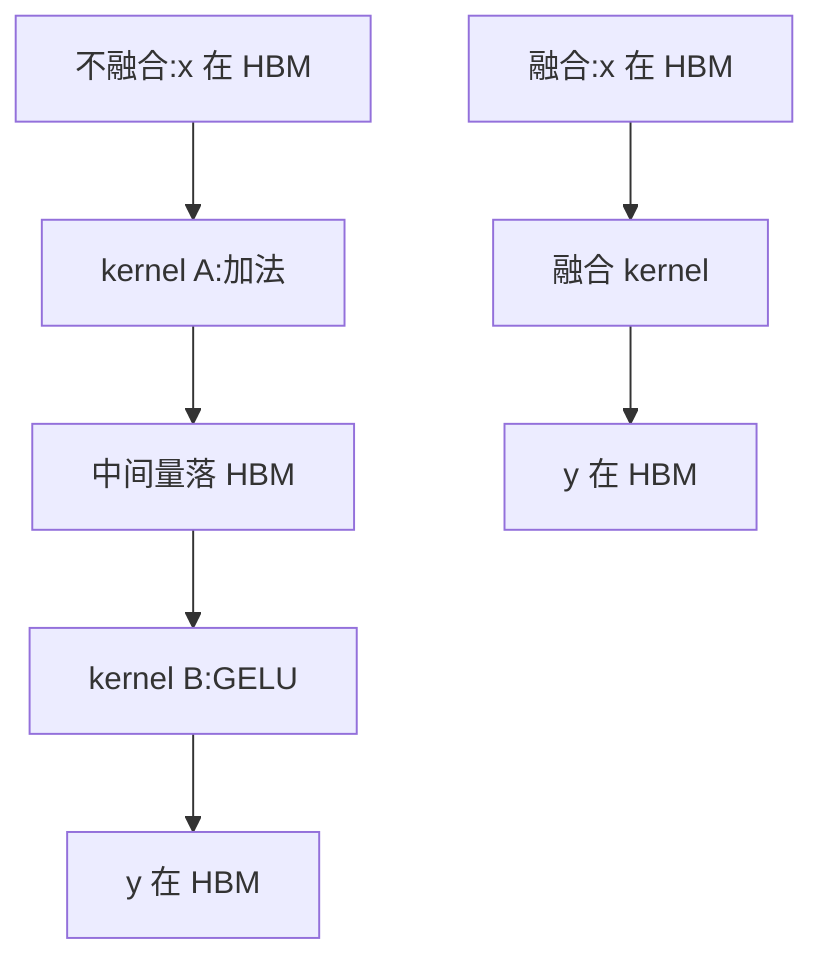

# 算子融合

一句话:把连续的几个小算子合并成**一个 kernel**,让中间结果不再往显存里跑一趟——它**不减少任何一次乘法,只减少搬运**,所以它是访存受限算子的头号提速手段,对计算受限的算子几乎没用。

## 一、收益只有一条:少落一次显存

### 不融合时,中间结果的命运

看最简单的例子:`y = GELU(x + b)`。PyTorch eager 模式下这是两个 kernel:

1. **kernel A**:从 HBM 读 `x`,算加法,把中间量 `t` **写回 HBM**
2. **kernel B**:从 HBM **再读一遍 `t`**,算 GELU,把 `y` 写回 HBM

问题出在第 1 步的结尾和第 2 步的开头:`t` 明明刚才还在寄存器里,却被原样送回显存,过几微秒又原样搬回来。**从 HBM 读一个数要 400–600 个周期,而一次浮点乘加只要几个周期**(见 GPU架构与执行模型 篇),这一写一读的时间,够把 GELU 算上几百遍。

融合就是把两步塞进同一个 kernel:`t` 全程待在**寄存器**里,从来没有离开过 SM。



### 次要好处:少一次 kernel launch

每启动一个 kernel,CPU 侧要走一遍驱动的提交路径,GPU 侧要做参数拷贝与调度,固定开销在**几微秒量级**。对一个跑 700 µs 的大 GEMM,这点开销可以忽略;但 decode 阶段的逐元素小算子本身可能只跑 5–10 µs,**启动开销和执行时间同一个量级**,此时"把 10 个小 kernel 并成 1 个"就是直接省掉 9 份固定开销。

> 如果目的**只是**消除启动开销而不打算改访存,CUDA Graph 是更省事的手段——把一串 kernel 录成图一次性重放。它不改变访存量,和融合是互补关系,见 CudaGraph 篇。

### 差别只在"中间量存在哪"

```python
# 不融合:t 走了一趟 HBM
t = x + b        # kernel A:读 x、读 b,写 t
y = gelu(t)      # kernel B:读 t,写 y   ← 这一写一读是纯浪费

# 融合(Triton 风格伪代码,示意用,非逐字可跑)
@triton.jit
def add_gelu(X, B, Y, N, BLOCK: tl.constexpr):
    off = tl.program_id(0) * BLOCK + tl.arange(0, BLOCK)
    m = off < N
    x = tl.load(X + off, mask=m)                        # 唯一一次 HBM 读
    t = x + tl.load(B + off, mask=m)                    # t 是寄存器变量,不落盘
    y = t * 0.5 * (1.0 + tl.math.erf(t * 0.70710678))   # 直接接着算,数据没动过
    tl.store(Y + off, y, mask=m)                        # 唯一一次 HBM 写
```

**计算量一字未减**(还是一次加法加一次 GELU),访存量从 4 份张量降到 2 份。这就是算子融合的全部。

## 二、算一笔账:到底省多少字节

设一批 $T = 4096$ 个 token、隐藏维 $d = 4096$、fp16(2 字节),那么一个 $T \times d$ 张量的大小是 $4096 \times 4096 \times 2 = 32$ MiB。下面两个账本都按这个规模算。

### 账本一:两个 elementwise 串联

| 方案 | HBM 读 | HBM 写 | 小计 |
|---|---|---|---|
| 不融合 · kernel A | x 32 MiB | t 32 MiB | 64 MiB |
| 不融合 · kernel B | t 32 MiB | y 32 MiB | 64 MiB |
| **不融合合计** | | | **128 MiB** |
| **融合后** | x 32 MiB | y 32 MiB | **64 MiB** |

(bias 只有 8 KiB,忽略。)按 A100 实测有效带宽约 1.5 TB/s(标称 2.0 TB/s)折算:**90 µs → 45 µs,直接砍半**。

### 账本二:x → LayerNorm → Linear

权重 $W$ 是 $d \times d$ 的 fp16,同样 32 MiB。把 LayerNorm 作为 GEMM 的 prologue 融进去:

| 方案 | kernel | HBM 读 | HBM 写 | 小计 |
|---|---|---|---|---|
| 不融合 | LayerNorm | x 32 | n 32 | 64 MiB |
| 不融合 | GEMM | n 32 + W 32 | o 32 | 96 MiB |
| | **合计** | | | **160 MiB** |
| 融合 | 一个 kernel | x 32 + W 32 | o 32 | **96 MiB** |

省 64 MiB(40%),约 45 µs。但这里要说句实话:这个 GEMM 自己要算 $2Td^2 \approx 137$ GFLOP,A100 上 fp16 Tensor Core 按实测 200 TFLOPS 量级算需要约 700 µs,**45 µs 只占 6%**。

结论要记牢:**融合的绝对收益是固定的(等于被消掉的中间张量流量),它占比多大,取决于旁边那个算子有多重**。同一条链在 decode 阶段($T = 1$)更极端——x 只剩 8 KiB,而 W 还是 32 MiB,LN 融不融合根本看不出来;真正值得在 decode 融的是**不带权重的那些逐元素长链**(残差、norm、激活、RoPE),它们是纯访存。

### 一般规律

$$
\text{融合省下的流量} \;=\; \sum_{\text{被消掉的中间张量}} 2 \times \text{sizeof}(\text{tensor})
$$

写一次加读一次,所以是 2 倍。所有算账都从这句话开始:**先数清有几个中间张量能被消掉,再乘它的字节数,再乘 2**。

### 为什么访存受限的算子收益最大

算术强度(arithmetic intensity)= 计算量 ÷ 访存量。融合让分子不变、分母变小,**算术强度必然上升**,在 roofline 图上这个点向右移:

- 原来在**斜坡上**(访存受限)→ 右移就是性能上升,省多少字节就快多少
- 原来已在**平台上**(计算受限)→ 右移毫无意义,时间由算力决定

bound 怎么判定、roofline 怎么画,见 Roofline与Bound分析 篇。这里只需记住结论:**LLM 里除了大 GEMM 和 prefill 阶段的 attention,绝大多数算子都是访存受限的**,这就是融合值钱的原因。

## 三、三种融合形态

### 垂直融合(生产者—消费者)

沿数据流方向,把"上一个算子的输出正好是下一个算子的输入"的链条并成一个 kernel。`Linear → bias → GELU`、`add → RMSNorm`、`RoPE → reshape` 都属于这一类。收益最直接:**每消掉一个中间张量,就省 2 倍它的字节数**。

### 水平融合(互不依赖的兄弟算子)

把**彼此没有依赖**的多个小算子塞进同一个 kernel(不同 block 干不同的活)。它们之间没有生产消费关系,所以**消不掉任何中间张量**——收益全部来自两处:少了 N−1 次 kernel launch;以及 GPU 被填得更满(单个小算子可能只用得上几十个 block,而 A100 有 108 个 SM,大部分车间在空转)。典型场景是优化器更新:几百个参数张量各做一次 AdamW,合成一个多张量 kernel。

### epilogue fusion(挂在 GEMM 尾巴上)

特指把 GEMM **后面**的逐元素操作接到 GEMM kernel 的尾部:GEMM 算完一个输出 tile,结果还躺在寄存器/shared memory 里,**顺手加 bias、过激活、加残差,再一次性写回 HBM**。对称地还有 prologue fusion(把 GEMM 前面的反量化、归一化并进去,账本二就是)。这一类特别划算:GEMM 的输出 tile 本来就必须在片上组装完才能写出去,尾巴上挂几个逐元素操作等于白送——复用的是**已经在寄存器里的数据**,没有任何额外访存,只多几条算术指令。CUTLASS / cuBLASLt 提供的正是这种带 epilogue 的 GEMM。

| | 消中间张量 | 省 launch | 主要收益来源 |
|---|---|---|---|
| 垂直融合 | ✅ | ✅ | 访存量下降 |
| 水平融合 | ❌ | ✅ | 启动开销 + SM 填充率 |
| epilogue fusion | ✅ | ✅ | 复用已在寄存器里的输出 tile |

## 四、什么能融,什么不能

### elementwise:最好融的一类

逐元素算子的每个输出只依赖对应位置的输入,线程之间零通信。任意长的 elementwise 链都能无脑融进一个 kernel,中间量全在寄存器。**这是编译器自动融合的主战场。**

### reduction:能融,但要小心

sum / mean / max / softmax / LayerNorm 这类要跨元素求和,单个线程看不到全部数据,必须**跨线程通信**(warp shuffle + shared memory 归约);而且经典写法是**两趟**——第一趟求统计量(和、平方和、最大值),第二趟才能归一化。两条现实的处理办法:

1. **把归约限制在一行之内**:让一个 block 负责一行(d = 4096 的 fp16 一行只有 8 KiB),整行装进 shared memory,读一次 HBM 就能跑完两趟。本质是把"两趟 HBM"换成"一趟 HBM + 两趟片上"
2. **用在线(单趟)算法**:Welford 一趟求均值方差、online softmax 边扫边修正归一化因子。FlashAttention 用的就是后者

一个必须分清的边界:**reduction 和它前面的 elementwise 能融**(读进来顺手算);**两个独立的全局 reduction 串起来通常不能融**——第二个要等第一个的全局结果,而 GPU 上 **block 之间没有便宜的同步手段,kernel 边界才是全局屏障**。

### 三类不该硬融的情况

| 情况 | 为什么 | 例子 |
|---|---|---|
| 需要**全局同步** | block 之间不能互相等待,只有 kernel 结束才是全局屏障 | 两次跨整个张量的归约串联 |
| **形状/并行度对不上** | 融了就得共用一套 tile 划分和 grid,总有一方被迫用糟糕的配置 | 逐元素算子接一个转置或 gather |
| 中间结果**还要被别处用** | 它无论如何都得落盘,融了也省不掉那次写 | 残差主干 `h = x + f(x)` 的 `h`,既喂下一层 norm 又要留给下一个残差 |

第三条最容易被忽略:**融合省的是"写完又读回"里的那一读,前提是这个中间量除了下游那个算子没有第二个消费者**。训练时还要多想一层——反向传播需要的激活值不能因为融合就丢掉,要么存下来,要么在反向里重算。这正是很多融合算子选择"重算"的原因:用一点算力换掉一大笔访存。

## 五、LLM 里的四个经典案例

### 1. FlashAttention:融合做到极致

标准注意力是 `QK^T → scale/mask → softmax → PV` 四步,中间的注意力矩阵是 $L \times L$ 的:序列 8K 时单头就是 $8192^2 \times 2\text{B} = 128$ MiB,还要**写一遍、读两遍**(softmax 前后)。这才是长序列 attention 慢的真凶。

FlashAttention 把四步融进**一个 kernel**:分块加载 Q/K/V 到 shared memory,用 online softmax 边算边修正归一化因子,**$L \times L$ 的注意力矩阵从来没有整体存在过**,中间量从 $O(L^2)$ 降到 $O(L)$。完整推导见 FlashAttention 篇。

### 2. 残差 + RMSNorm

`h = x + attn_out; y = RMSNorm(h)` 是每层要做两次的固定搭配。不融合是 5 份张量流量(加法 2 读 1 写,norm 1 读 1 写);融合后一次读入两个输入,在寄存器里相加、顺便累计平方和、归一化写出 y,但 **h 本身仍要写回**(它是残差主干,下游还要用),所以是 4 份——只省 20%。省得不多,但**次数极多**:按前面的规模,一层两次、32 层就是 64 次,一次前向省下约 2 GiB 流量、约 1.4 ms。这就是它值得做的理由。

### 3. SwiGLU

`SwiGLU(x) = SiLU(x W_gate) ⊙ (x W_up)`,再过 `W_down`。两个投影各产出一个 $T \times d_{ff}$ 的大张量($d_{ff}$ 通常是 $d$ 的 2.7–4 倍),逐元素相乘后才降回去。不融合要落两个中间张量再读回相乘;融合的做法是把两个投影拼成一个 GEMM,再**在 epilogue 里劈开、过 SiLU、逐元素相乘**,中间量只在寄存器里出现。

对 Llama 3 8B($d=4096$、$d_{ff}=14336$),$T = 4096$ 时一个中间张量就是 112 MiB,消掉它们的读写就是几百 MiB 的流量。

### 4. 交叉熵 + log_softmax:省的是"巨大"级别的中间量

这是收益最夸张的一个。词表 $V$ 现在动辄 128K,logits 是 $T \times V$:$T = 4096$、fp32 时是 $4096 \times 128256 \times 4\text{B} \approx 2$ GiB。`log_softmax` 再产出一个同样大的张量,反向还要一个梯度张量——**光是算 loss 这一小步就能吃掉 6 GiB**,经常是训练 OOM 的直接原因。

融合的做法:把 `logits = h W_out → log_softmax → NLL` 串成一个 kernel,并且**沿 token 维分块**——一次只物化几百行 logits,算完这一块的 loss 和梯度就丢掉,峰值中间量从 GiB 级降到几十 MiB。Liger-Kernel 的 FusedLinearCrossEntropy 就是干这个的;论文自报整套融合 kernel 在 Llama 3-8B 训练上提升约 20% 吞吐、降低约 60% 显存(作者自报数据,未见第三方复现)。

## 六、怎么落地:四条路

| 途径 | 怎么用 | 适合什么 |
|---|---|---|
| **torch.compile** | 加一行装饰器,Inductor 自动把 pointwise 链聚成 Triton kernel | 通用、零成本,覆盖大部分逐元素与简单归约融合 |
| **Triton** | 用 Python 写 kernel,自己控制 tile 与 load/store | 编译器融不出来的定制模式(分块交叉熵、特殊 mask) |
| **手写 CUDA / CUTLASS** | 直接写,或用 CUTLASS 的 epilogue 模板挂到 GEMM 尾部 | 极致性能、需要精细控制 Tensor Core 的场景 |
| **现成融合算子库** | flash-attn、Apex / TransformerEngine 的 FusedLayerNorm、Liger-Kernel、xformers | 直接换掉标准模块,一行代码不写 kernel |

**默认从 torch.compile 起步**:它能自动识别 pointwise 链和简单归约,聚成 Triton kernel;融不动的地方(有全局同步、动态形状、图被打断)再手写。抓图与代码生成的机制见 TorchCompile 篇。一条经验:**先用 profiler 看 kernel 时间线**,挑出那些"占时间但 FLOPs 很少"的小 kernel,它们才是融合的目标;对着大 GEMM 硬融是白费力气。

## 七、代价:融合不是免费的

| 代价 | 机制 | 后果 |
|---|---|---|
| **寄存器压力** | 中间量留在寄存器,每线程寄存器数上升 | 驻留 warp 变少 → occupancy 下降 → 延迟掩盖变差;严重时寄存器溢出到 local memory(其实就是显存),得不偿失 |
| **shared memory 压力** | 融合后要在片上缓更多 tile | 每 SM 能放的 block 变少,同样压 occupancy |
| **tile 尺寸被迫妥协** | 一个 kernel 要同时满足两个算子的划分需求 | 可能两边都拿不到最优配置 |
| **组合爆炸** | 每种算子组合都要一个 kernel | 手写路线维护成本高,换个激活函数就要重写 |
| **灵活性下降** | 融合 kernel 是黑盒 | 改结构、加 hook、取中间量调试都变难 |

所以**融合过头是真的会变慢**:把 5 个算子硬塞进一个 kernel,寄存器爆掉、occupancy 从 50% 掉到 12%,省下的那点访存换不回延迟掩盖能力的损失。判断标准还是那句老话——**先量,再融**;融完对着 profiler 看 kernel 时间和实际 occupancy 有没有真的变好。occupancy 与寄存器的跷跷板关系见 GPU架构与执行模型 篇。

## 八、面试考点串联

| 高频问法 | 本文哪一节 |
|---|---|
| 算子融合的好处是什么? | 一(少落一次显存,次要是少一次 kernel launch) |
| 融合减少计算量吗? | 一、二(不减,只减访存;算术强度上升) |
| 为什么对访存受限的算子收益最大? | 二(roofline 斜坡;bound 判定见 Roofline与Bound分析 篇) |
| 融合分哪几类? | 三(垂直 / 水平 / epilogue) |
| 什么能融、什么不能融? | 四(elementwise 最好融;全局同步、形状不匹配、中间量他用不能融) |
| 带 reduction 的算子怎么融? | 四(整行进 shared memory,或用 online 单趟算法) |
| 举一个 LLM 里的融合例子 | 五(FlashAttention / add+RMSNorm / SwiGLU / 融合交叉熵) |
| 给个具体数字:能省多少? | 二(两个访存账本) |
| 怎么落地?torch.compile 能做到什么程度? | 六(细节见 TorchCompile 篇) |
| 融合有什么代价?为什么有时融了反而变慢? | 七(寄存器 / occupancy / tile 妥协) |

延伸阅读顺序:GPU架构与执行模型 → Roofline与Bound分析 → 本篇 → TorchCompile / FlashAttention。

## 相关文献

- FlashAttention: Fast and Memory-Efficient Exact Attention with IO-Awareness — [arXiv:2205.14135](https://arxiv.org/abs/2205.14135)
- TVM: An Automated End-to-End Optimizing Compiler for Deep Learning(编译器视角的融合分类:injective / reduction / complex-out-fusable / opaque)— [arXiv:1802.04799](https://arxiv.org/abs/1802.04799)
- Liger Kernel: Efficient Triton Kernels for LLM Training(融合交叉熵、RMSNorm、SwiGLU)— [arXiv:2410.10989](https://arxiv.org/abs/2410.10989)
- PyTorch torch.compiler 官方文档 — https://docs.pytorch.org/docs/stable/torch.compiler.html
- Triton 官方文档 — https://triton-lang.org/main/index.html
- NVIDIA CUTLASS(GEMM 的 epilogue 融合)— https://github.com/NVIDIA/cutlass
- NVIDIA CUDA C++ Best Practices Guide(kernel 启动开销与占用率)— https://docs.nvidia.com/cuda/cuda-c-best-practices-guide/
