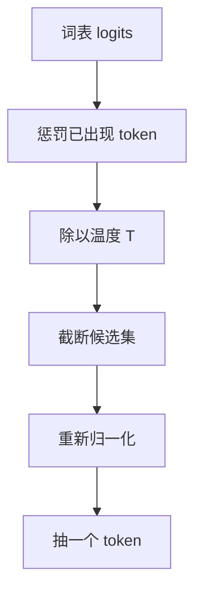

# 解码策略

一句话:模型每走一步只吐出**词表上的一个概率分布**,解码策略就是**把这个分布变成一个具体 token** 的那套规则——它不改模型的任何一个参数,却能让同一个模型从复读机变成能写东西的人。

## 一、所有方法都在做同两件事

一步 decode 的产物是一个长度等于词表大小的 logits 向量(现在普遍是 128K–256K 维)。从这里到"下一个 token",中间只有两个动作:**先改这个分布,再从改完的分布里挑一个**。所有解码策略的差别,都只在"改哪里"和"怎么挑"。

| 方法 | 它动了分布的哪里 | 最后怎么挑 |
|---|---|---|
| 贪心 | 不动 | 取最大的那个 |
| 束搜索 | 不动(改的是"挑"的目标:整句累积分数) | 同时搜 $k$ 条路 |
| 温度 | 改**尖锐程度**,不改名次 | 随机抽 |
| top-k / top-p / min-p | **砍尾巴**:一部分 token 概率清零后重新归一化 | 随机抽 |
| 重复惩罚 | 只压**已经出现过**的那些 token | 随机抽 |
| 约束解码 | 把**不合语法**的 token 打到 $-\infty$ | 随机抽或取最大 |

这张表就是本篇的骨架:第二节讲"不动分布"的两个,三到六节讲四种"动分布"的手法,第七节讲掩码,第八节把它们串成一条流水线。

一条常被拿来对照的边界:温度、截断、惩罚、掩码全都在**改分布**;而**投机解码不改分布**——它逐 token 的输出分布与直接用大模型采样严格一致,买到的只有速度,见 投机解码 篇。所以"投机解码算不算一种解码策略"这个问法,标准答案是:它和这里所有方法不在一个层面上。

## 二、不掷骰子的两个:贪心与束搜索

### 贪心:每步取概率最高的 token

每步直接取当前分布的最大值:

$$
w_t = \arg\max_{w} P(w \mid w_{<t})
$$

意思很朴素:模型觉得哪个词最像,就选哪个,不留悬念。

它的病叫**重复退化**,而且成因是个自我强化的循环:某个短语一旦被生成出来,它就进入了上下文;而模型见过的模式会被上下文抬高概率,于是它更容易再次被选中,选中之后概率又被抬得更高。滚几圈就出不来了,典型症状是"我不知道我不知道我不知道……"。开放式生成里这不是偶发,是常态——**只顾眼前一步的最优,是走不出局部死胡同的**。

顺便钉死一个误会:贪心里没有随机数,但**贪心 ≠ 结果可复现**,原因在第九节。

### 束搜索:同时押 k 条路

不再只走一条路,而是维护 $k$ 条累积对数概率最高的前缀,每步把每条各自展开、再全局保留得分最高的 $k$ 条:

$$
\text{score}(w_{1:t}) = \sum_{i=1}^{t} \log P(w_i \mid w_{<i})
$$

意思是:比的不是"这一步哪个词最像",而是"整句话到目前为止有多像"。

这里有个必须知道的坑:每多生成一个 token 就多加一个负数,所以累积分**天生偏爱短句**,不加处理的束搜索会抢着结束。修法是除以长度的某个幂 $L^\alpha$ 做归一化,也就是各家翻译系统里那个必调的 `length_penalty`。

**为什么开放式生成基本不用它了**:因为**高概率 ≠ 好文本**。文本退化那篇论文把人类真实文本逐 token 在模型下的概率画成曲线,它高低起伏——人经常说出模型觉得不太可能的词;而束搜索的输出曲线平滑地贴着高位走。一味追求最大似然,得到的是保守、绕圈、模板化的文本。**最像模型的文本,不是最像人的文本**,这就是随机方法存在的全部理由。

束搜索还要维护多条候选路径,增加前向计算与 KV cache 开销。缓存可能共享前缀,候选也可能并行计算,所以束宽为 $k$ 不等于实际耗时必定是贪心的 $k$ 倍。

翻译、摘要等输入约束较强的任务,可以比较束搜索和其他策略的实际效果;开放式创作通常更需要多样性。这里没有“束搜索质量必定更好”的保证:序列概率、正确性、流畅性是不同评价维度。重复限制可减少复读,长度归一化缓解短句偏好,改用采样增加多样性,三者解决的问题不同。

## 三、温度:唯一一个只调尖锐度、不淘汰候选的旋钮

softmax 之前把每个 logit 除以 $T$:

$$
P(w_i) = \frac{\exp(z_i / T)}{\sum_j \exp(z_j / T)}
$$

$T$ 就是一个"贫富差距"旋钮:$T$ 小,原本领先的 token 差距被放大,概率质量往榜首堆;$T$ 大,差距被压扁,人人有份。

- $T \to 0$:有限 logits 中最大值唯一时,概率集中到它,极限相当于贪心;若有并列最大值,则在它们之间平分
- $T = 1$:模型的原始分布
- $T \to \infty$:截断前在未被掩码屏蔽、logit 有限的候选上趋于均匀;概率更分散不保证文本更流畅

一条关键性质:$T > 0$ 时温度**不改变 token 之间的名次**($z_i > z_j$ 就一定 $p_i > p_j$)。它只调尖锐度,**一个候选都没淘汰**——尾巴上那些不着调的 token 一个不少,只是概率被压小了。所以温度与截断的作用不同,可以配合使用,但并非必须同时开启。

**为什么各家 chat 模型的推荐温度普遍低于 1.0**:对齐训练会把概率质量压向少数"高分回答",模型的校准随之变差。GPT-4 技术报告的 Figure 8 就是这条证据——预训练模型的置信度紧贴对角线,后训练之后明显偏离,原文的措辞是后训练显著损害了校准。后果是同样写 $T=1$,对齐后的模型分布本来就更尖,再按原分布采样,行为已经不等价于预训练模型了。

反过来,长思考链的推理模型对重复退化格外敏感,官方推荐往往**不是 0**:DeepSeek-R1 的模型卡明确建议温度取 0.5–0.7(推荐 0.6),给的理由就是防止"无尽重复或语无伦次"。

## 四、截断三兄弟:top-k、top-p、min-p

先说为什么必须截断。词表十几万,尾部每个 token 的概率单看都是 $10^{-5}$ 量级,但**加起来的总质量并不小**。一条 500 token 的回复要抽 500 次,只要有一次抽中不着调的词,后面就顺着它一路跑偏——自回归是误差放大器。所以随机解码的全部技术含量在于:**先把尾巴剪掉,再掷骰子**。

### top-k:固定名额

只留概率最高的 $k$ 个,其余清零后重新归一化。问题在于 $k$ 是死的,而分布形状每一步都在剧烈变化:

- **强约束处**(比如 "Barack" 后面几乎必然是 "Obama"):真正合理的只有一两个,$k=50$ 硬塞进四十几个坏候选
- **开放处**(一段故事的开头):几百个词都说得通,$k=50$ 又错杀一大片

像招聘不看来了什么人,一律录取前 50 名。**分布越尖锐,top-k 越危险;分布越平坦,top-k 越浪费。**

### top-p / nucleus:凑够质量就收摊

改成按概率从高到低累加,取累积质量刚够到 $p$ 的最小集合:

$$
V_p = \min \Bigl\{ V' \subseteq V \;:\; \sum_{w \in V'} P(w) \ge p \Bigr\}
$$

意思是:名额不固定,**凑够 $p$ 的选票就收摊**。分布尖锐时"核"里可能只剩一两个词,平坦时能容纳几百个——正好补上 top-k 的死板,它也因此当了很多年的默认策略。

它的失效模式在高温:温度把尾巴抬起来之后,凑满同一个 $p$ 需要的 token 数会暴涨。极端一点看,分布接近均匀时,要凑满 0.95 的质量就得放进接近 95% 的词表,截断形同虚设。这就是"温度一开大 top-p 就压不住"的机制。

### min-p:以榜首为锚

门槛不再是累积质量,而是**相对当前最高概率的一个比例**:

$$
P(w) \ge p_{\text{min}} \cdot p_{\max}
$$

人话:至少得有榜首若干个百分点的人气才配上场。模型笃定时 $p_{\max}$ 高、门槛水涨船高,候选自动收紧;模型犹豫时门槛跟着降,候选自然放宽——**门槛跟着模型的信心走,而不是跟着一个固定的质量指标走**。

它抗高温的原因可以直接算出来。把条件写回 logit 尺度,两边同除 $\exp(z_{\max}/T)$ 后取对数:

$$
z_i - z_{\max} \ \ge\ T \cdot \ln p_{\text{min}}
$$

意思是:min-p 实际上是在 logit 上划一条"离榜首多远"的线,而这条线的宽度只随 $T$ **线性**放宽。对比 top-p 在高温下候选集的爆炸式膨胀,这就是 min-p 论文(ICLR 2025)报告"温度拉到 2–3 仍能同时保住创造性与连贯性"的机制解释。

| | top-k | top-p | min-p |
|---|---|---|---|
| 门槛是什么 | 固定名额 | 累积概率质量 | 榜首概率的固定比例 |
| 候选集随分布形状 | 不变 | 自适应 | 自适应 |
| 分布尖锐时 | ❌ 放进大量坏候选 | ✅ 只留一两个 | ✅ 门槛跟着抬高 |
| 分布平坦时 | ❌ 错杀合理候选 | ✅ 自动放宽 | ✅ 自动放宽 |
| 高温下 | 名额封死,不受影响 | ❌ 候选集爆炸 | ✅ 只随 $T$ 线性放宽 |
| 与温度的先后顺序 | 无影响 | **有影响** | **有影响** |

一句话记忆:**top-k 固定名额,top-p 凑满选票,min-p 锚定榜首。**

同一家族还有两个偶尔冒出来的名字,知道它们在干什么就够:**typical sampling** 按"这个 token 的信息量是否接近整个分布的熵"来筛,出发点是人类语言的均匀信息密度;**contrastive decoding** 换的是打分函数,用一大一小两个模型的对数概率之差打分,把"小模型也会犯的毛病"减掉——它限定候选范围用的 plausibility 约束,写出来正好就是 min-p 那个形式。两者都不是当前主流。

## 五、顺序:先截断还是先升温,结果不一样

同一组参数在两个引擎里跑出不同风格,十有八九是**采样链的顺序不同**。谁受影响、谁不受,可以从上一节的性质直接推出来:

- **温度不改名次** → 无论温度放在 top-k 前还是后,选出来的都是同一批 $k$ 个 token。**top-k 与温度的先后无关。**
- **top-p / min-p 的门槛都定义在概率值上** → 温度改了概率值,候选集就跟着变:
  - **先温度、后截断**:高温把尾巴抬起来,top-p 为了凑满 $p$ 必须纳入大量低质 token,截断被架空
  - **先截断、后温度**:候选集是在**模型原始的、没被加热的分布**上选出来的,高温只在这个安全集合内部重新分配概率,尾巴永远进不来

两种顺序都自洽,但**语义完全不同**:前者是"温度决定敢不敢冒险,截断在冒险之后收口",后者是"截断先划定安全区,温度只决定在安全区里多随性"。这就是"参数照抄过来了,效果对不上"最常见的原因。

具体到实现:HF transformers 与 vLLM 的链大致是 **惩罚 → 温度 → top-k → top-p → min-p → 采样**;llama.cpp 的默认链则把温度放在整串截断**之后**(略去几个默认关闭的项,大致是 惩罚 → top-k → typical-p → top-p → min-p → 温度 → 采样)。两边的顺序都可配置,默认值也随版本变——别背,用时去查当版文档,但**必须知道"这件事会变"**。

截断项之间同样有顺序问题:top-k 和 top-p 一起开时,是先取前 $k$ 再在里面凑 $p$,还是两个条件同时判?这是个真实的可配置项,FlashInfer 的采样接口就把它做成了 `filter_apply_order`(`top_k_first` 或 `joint`)。

## 六、重复惩罚家族:三种算法,量纲不通用

模型开始复读,第一反应通常是加惩罚。三种常见算法,关键是记住**它们的算法不同、量纲不同,参数不能互相照搬**:

| 名字 | 怎么改 logit | 对出现 3 次的 token | 出处 |
|---|---|---|---|
| repetition penalty | 乘除式:$z>0$ 时除以 $\theta$、$z\le 0$ 时乘以 $\theta$($\theta>1$) | 与出现 1 次一样 | CTRL 的 penalized sampling |
| presence penalty | 减法式:出现过就固定扣一个常数 | 与出现 1 次一样 | OpenAI API 风格 |
| frequency penalty | 减法式:按出现次数线性扣 | 扣三倍 | OpenAI API 风格 |

一句话分工:**presence 管"要不要换个话题",frequency 管"同一个词别说太多遍"**。repetition penalty 是乘除式的老前辈,它有个自身的毛病:缩放效果和 logit 的正负号挂钩,同一个 $\theta$ 对正 logit 和负 logit 的压制强度并不一致。另外 HF 的实现会把 prompt 里出现过的 token 也算进惩罚集合,和只惩罚已生成部分的原始定义略有出入。

副作用必须记牢:**惩罚是无差别的,它分不清"病态复读"和"正常复用"**。代码里反复出现的变量名与关键字、JSON 里重复的键名、必要的专有名词、中文里"的/是/了"这类功能词,统统被一起压。开大之后的典型症状是变量名越写越歪、格式逐渐崩坏、句子为了避重复而开始说怪话。

所以实践上:**代码与结构化输出场景一般关掉或调到极小**,宁可用低温防重复;真要治长文复读,更常见的做法是禁止 n-gram 重复(已出现过的 n 元组不许再出现),它至少还认得"重复的是什么"。

## 七、约束解码:机制就是在 logits 上打掩码

输出必须是合法 JSON、必须匹配某个正则、必须符合某个语法时,靠提示词"请只输出 JSON"是没有硬保证的。约束解码给的是硬保证,机制只有一句话:**把不合法的 token 掩掉**。

把约束编译成一台状态机,生成到第 $t$ 步时,状态机知道"当前状态下哪些 token 合法",其余全部把 logit 置成 $-\infty$;过一遍 softmax 它们的概率就是 0,后面无论怎么截断、怎么抽都不可能被选中。所以它并不是独立于采样的另一套东西,只是采样链上多插的一个处理器,和惩罚、截断同类。

两条代价:一是每步都得知道"当前状态的合法集合",朴素做法要逐个 token 去试,所以工程上会预先把「状态 → 合法 token 位图」索引好(Outlines 那篇论文的主要贡献就是这个索引);二是**格式合法不等于内容正确**——掩码会把模型推到它本来不想走的分支上,约束越强,内容质量越可能受损。压缩状态机、跳跃解码这类工程实现**及其现状**(有的已从运行时移除)见 SGLang 篇。

## 八、一步解码的流水线,以及它在引擎里怎么跑

约束解码的掩码就插在 B 与 D 之间的任意位置;每生成一个 token 把这条链重走一遍。三件值得记住的事:

**单路径采样和贪心都需要模型前向,采样额外处理词表分布。** 在访存受限的小批量 decode 中,前向常是主要开销,采样占比还取决于词表大小、候选筛选算法与硬件,不能认定总是可以忽略。Bound 的判断见 Roofline与Bound分析 篇。

KV cache 复用历史 token 的 K/V 来减少前向重复计算,机制见 KVCache 篇。它不是缓存下一步的概率分布:上下文改变后,新的 logits 和采样分布仍要重算。

**但它也不是完全免费。** 词表已经涨到 128K–256K 量级,朴素的 top-p 实现要对整个词表排序,大 batch 下这一步的占比不可忽略。所以引擎里的采样是融合 kernel:FlashInfer 用一套**免排序**的拒绝采样(Dual Pivot Rejection Sampling)直接抽,自报采样时间下降 50% 以上。kernel 侧怎么融、怎么打满带宽,见 访存与算子优化 篇。

**批量执行的关键是"每行参数都不一样"。** 同一个 batch 里几十条请求各有各的温度、top-p、惩罚,引擎的做法是把每条请求的采样参数打包成 GPU 上的**逐行张量**,一个 kernel 一次处理整批,而不是在 CPU 上 for 循环逐条走分支。这同时也是 CUDA Graph 的硬要求——参数和 shape 每步固定不变才录得下来(见 CudaGraph 篇)。这条链对首 token 与后续 token 延迟的影响怎么量化,见 推理服务指标 篇。

## 九、和推理系统的联动:temperature=0 也不保证可复现

这是最容易被反将一军的一问。贪心里确实没有随机数,但因果链在别处:**连续批处理让你这条请求每一步所在的 batch 组成都在变 → GEMM 形状变 → kernel 选择变 → 归约顺序变 → 浮点加法不满足结合律 → logits 末位有差 → 当 top-1 和 top-2 咬得极近时 argmax 翻面 → 后面整段文本分岔**。所以"同一个 prompt、同一张卡、temperature=0,两次结果不同"是正常现象而非 bug。完整因果链、实测数据与几种代价不同的规避手段,见 连续批处理 篇。

场景配方(只给方向,具体数值随模型和引擎默认值不同,别当通用配方抄):

| 场景 | 大致怎么配 | 为什么 |
|---|---|---|
| 代码 / 数学 / 事实问答 | 可从贪心或低温开始,用目标任务评测比较 | 确定性不保证正确性;代码还需测试,重复惩罚可能伤变量名 |
| Agent / 工具调用 | 低温 + 约束解码 | 参数错一个字调用就失败,格式要硬保证 |
| 创意写作 / 闲聊 | 中温 + top-p;想更放开就换 min-p 配更高温 | 在多样性和连贯之间找平衡 |
| 推理模型长思考链 | 按具体模型建议选温度,观察重复与正确率 | 避免把某个模型的推荐值当作通用规则 |
| RL rollout(反例) | 高温 + 宽松截断 | 组内多样性就是优势信号的来源,低温同质化等于自制零梯度组,见 GRPO 篇 |
| 评测 / 回归复现 | 固定策略,还要固定 batch 形状 | 只固定随机种子不够,原因见本节开头 |

## 面试考点串联

| 问法 | 本文哪一节 | 来源 |
|---|---|---|
| 贪心、束搜索、Top-k、Top-p 与温度怎么工作?质量、多样性、流畅性与开销怎么比较和选型? | 一、所有方法都在做同两件事;二、不掷骰子的两个:贪心与束搜索;三、温度:唯一一个只调尖锐度、不淘汰候选的旋钮;四、截断三兄弟:top-k、top-p、min-p;八、一步解码的流水线,以及它在引擎里怎么跑;九、和推理系统的联动:temperature=0 也不保证可复现 | P001-Q01、P002-Q001 |
| 温度趋近 0 或无穷大时会怎样? | 三、温度:唯一一个只调尖锐度、不淘汰候选的旋钮 | P001-Q01、P002-Q001 追问 |
| 为什么束搜索在开放式生成中可能退化?怎么改进? | 二、不掷骰子的两个:贪心与束搜索 | P001-Q01、P002-Q001 追问 |
| KV cache 怎么帮助采样提速,能复用上一轮概率吗? | 八、一步解码的流水线,以及它在引擎里怎么跑 | P001-Q01、P002-Q001 追问 |
| min-p 的门槛怎么定? | 四、截断三兄弟:top-k、top-p、min-p | 自拟 |
| 温度和 top-p 谁先谁后,结果会不一样吗? | 五、顺序:先截断还是先升温,结果不一样 | 自拟 |
| 模型开始复读有哪些手段?惩罚开大了有什么副作用? | 六、重复惩罚家族:三种算法,量纲不通用 | 自拟 |
| temperature 设成 0,是不是就能保证每次输出一样? | 九、和推理系统的联动:temperature=0 也不保证可复现 | 自拟 |

> 本表含平台整理题与自拟题,非面经原题。P001-Q01 的原稿与老师答案见 docs/references/写作参考索引.md。

延伸阅读顺序:本篇 → 投机解码 → 连续批处理 → 推理服务指标。

## 相关文献

- The Curious Case of Neural Text Degeneration(top-p / nucleus sampling 提出,附文本退化分析)— [arXiv:1904.09751](https://arxiv.org/abs/1904.09751)
- Hierarchical Neural Story Generation(top-k 采样最常被引的出处,ACL 2018)— [arXiv:1805.04833](https://arxiv.org/abs/1805.04833)
- Turning Up the Heat: Min-p Sampling for Creative and Coherent LLM Outputs(min-p,ICLR 2025)— [arXiv:2407.01082](https://arxiv.org/abs/2407.01082)
- Locally Typical Sampling(typical sampling,TACL 2022)— [arXiv:2202.00666](https://arxiv.org/abs/2202.00666)
- Contrastive Decoding: Open-ended Text Generation as Optimization — [arXiv:2210.15097](https://arxiv.org/abs/2210.15097)
- CTRL: A Conditional Transformer Language Model for Controllable Generation(penalized sampling,即 repetition penalty 的出处)— [arXiv:1909.05858](https://arxiv.org/abs/1909.05858)
- Efficient Guided Generation for Large Language Models(约束解码的状态机索引,Outlines)— [arXiv:2307.09702](https://arxiv.org/abs/2307.09702)
- A Thorough Examination of Decoding Methods in the Era of LLMs(各解码方法在 LLM 上的系统评测)— [arXiv:2402.06925](https://arxiv.org/abs/2402.06925)
- GPT-4 Technical Report(Figure 8:后训练显著损害校准)— [arXiv:2303.08774](https://arxiv.org/abs/2303.08774)
- DeepSeek-R1 模型卡(推荐温度 0.5–0.7,防止无尽重复)— https://huggingface.co/deepseek-ai/DeepSeek-R1
- Sorting-Free GPU Kernels for LLM Sampling(FlashInfer 的免排序采样 kernel)— https://flashinfer.ai/2025/03/10/sampling.html
- vLLM RFC:Reimplement and separate beam search on top of vLLM core(束搜索移出核心的理由)— https://github.com/vllm-project/vllm/issues/8306
- llama.cpp server 文档(`samplers` 字段:默认采样链顺序)— https://github.com/ggml-org/llama.cpp/blob/master/tools/server/README.md

- 生成策略说明 — [Hugging Face 官方文档](https://huggingface.co/docs/transformers/main/en/generation_strategies)
