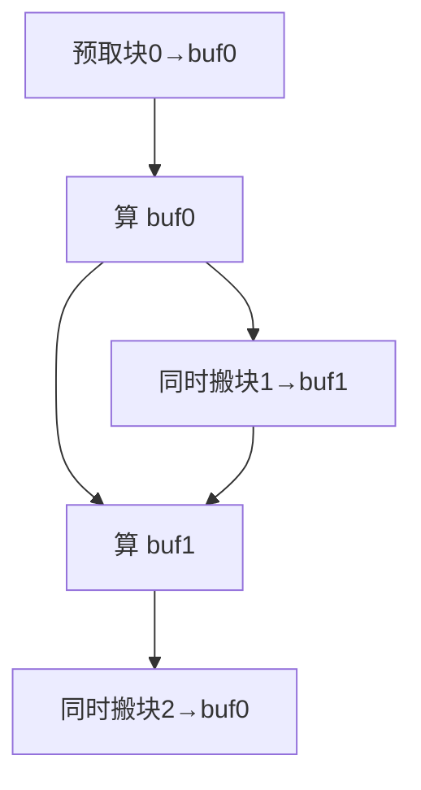

# 访存与算子优化

> 🔴 重点考点:本篇是当前复习重点,文末「面试考点串联」给出问法对照。

一句话:这是一份写 CUDA kernel 时的**优化技巧清单**——每一条的目的都只有一个,**让计算单元少等数据**;而每一条都要付出资源代价,所以真正的手艺是知道什么时候该收手。

前置知识(本篇不重复讲):内存层级表、warp 与 SIMT、occupancy 的定义与计算式,见「GPU架构与执行模型」篇。判断一个算子到底是访存受限还是计算受限、优化上限在哪,见「Roofline与Bound分析」篇——**优化前先做 bound 判断,否则你可能在优化一个根本不是瓶颈的东西**。

## 一、先把清单摆出来

所有技巧都可以放进同一个框架看:**要么减少搬运的字节数,要么让搬运和计算重叠,要么减少指令浪费**。下表汇总一次,后面各节逐条讲**为什么有效**。

| 技巧 | 解决什么 | 代价 / 副作用 |
|---|---|---|
| block/thread 切块 + grid-stride loop | 让线程和数据的映射天然连续,kernel 与规模解耦 | 块大小选错直接压低 occupancy |
| shared memory tiling | 数据复用:把"多次慢访问"变成"一次慢访问 + 多次快访问" | 吃 shared 配额,块内需要同步 |
| 合并访存(coalescing) | 打满 HBM 带宽,不浪费已搬来的字节 | 有时要改数据布局(如 NCHW→NHWC) |
| 消除 bank conflict | 避免 shared 访问被串行化最多 32 倍 | padding 浪费少量 shared;索引变复杂 |
| ping-pong 双缓冲 | 把搬数延迟藏进计算里 | shared 用量翻倍,寄存器压力上升 |
| warp reduce(shuffle 指令) | 归约免走 shared、免 `__syncthreads()` | 只在 warp 内有效,跨 warp 还要第二级 |
| 循环展开(unroll) | 减少循环开销、提高指令级并行 | 寄存器用量上升,指令 cache 压力 |
| 减少 warp 内分支 | 避免两条分支串行相加 | 有时要重排数据,或拆成两个 kernel |
| 重计算(checkpointing) | 用算力换显存 | 多跑一次前向,训练时间约 +30% |

## 二、切块:block 和 thread 怎么定

### block 大小:先看约束,再看经验值

三条硬约束决定了可选范围(以 A100 / 计算能力 8.0 为例):

- **必须是 32 的整数倍**。warp 是 32 线程的调度单位,block 开 100 个线程会被凑成 4 个 warp(128 线程),最后一个 warp 里 28 条通道全程空转——白白浪费 21% 的执行槽
- **一个 SM 最多驻留 32 个 block、64 个 warp**。所以 block 只有 32 线程时,32 个 block 也才 32 个 warp,occupancy 卡死在 50% 上不去。**这是"块开太小"的第一个代价**
- **一个 block 最多 1024 线程**,且必须整个装进一个 SM

经验值 **128 或 256**,原因是它们同时满足:是 32 的倍数;2048(每 SM 最大线程数)能被整除,不会在最后一批留下余数;数量适中,块内同步 `__syncthreads()` 的等待代价还不大(线程越多,同步时最慢的那个线程拖累的人越多)。

### 怎么映射到数据

原则一句话:**让 `threadIdx.x` 走在数据最内层的连续维度上**。因为 `threadIdx.x` 相邻的线程属于同一个 warp,只有它们读到相邻地址,才能触发合并访存(下一节)。矩阵按行主序存储时,就该让 x 方向对应列号、y 方向对应行号,而不是反过来。

### grid-stride loop:让 kernel 和数据规模脱钩

朴素写法是"一个线程处理一个元素",grid 大小必须随 n 变。grid-stride loop 改成"一个线程处理一串元素":

```cuda
__global__ void add(int n, const float* a, const float* b, float* c) {
    int idx    = blockIdx.x * blockDim.x + threadIdx.x;
    int stride = gridDim.x * blockDim.x;     // 步长 = 整个 grid 的线程总数
    for (int i = idx; i < n; i += stride)    // 每个线程处理多个元素
        c[i] = a[i] + b[i];
}
```

它为什么值得用:

1. **grid 大小可以固定成"刚好填满 GPU"**(如 SM 数 × 每 SM 能驻留的 block 数),不随 n 抖动,启动开销和尾部效应都稳定
2. **访存仍然连续**——步长是线程总数,同一个 warp 在每一轮里读的还是相邻的 32 个元素
3. 线程复用带来的循环体外初始化(比如累加器、常量)只做一次

## 三、shared memory:所有 tiling 的本质

shared memory 是唯一由你手工管理、且比 HBM 快一个数量级的存储。**所有分块(tiling)优化说到底都是同一句话:把一块数据从 HBM 搬进片上,让 block 内的线程反复用它。**

为什么这能提速:一个 $T \times T$ 的块被载入一次后,块内每个元素平均可以被复用 $T$ 次,于是 HBM 的读取量大致按 $1/T$ 下降。原本"取一次数够算一百多次"的浪费,就被复用摊掉了。

标准写法永远是三段式:**协同载入 → `__syncthreads()` → 计算**。同步不能省,因为载入是所有线程分工完成的,你读的那个格子可能是别的线程刚写进去的,不同步就会读到脏数据。另外 shared memory 和 L1 共用同一块物理 SRAM,每 SM 上限约 164 KB,**你用掉的每一 KB 都在挤压能同时驻留的 block 数**——这条线索会在第八节和分块大小接上。GEMM 里"全局分块 → block 分块 → warp 分块 → 寄存器分块"的多级切法,以及具体 tune 哪些参数,见「GEMM优化」篇。

## 四、合并访存:别浪费已经搬来的字节

### 机制

GPU 访问显存的最小粒度不是一个 float,而是**扇区/缓存行**:一次 DRAM 事务搬 32 字节,一条 L1 缓存行 128 字节。硬件会把同一个 warp 的 32 次访存请求**合并**成尽可能少的宽事务。

- 理想情况:32 个线程读连续的 32 个 float = 128 字节,正好 4 个扇区,**搬来的每个字节都被用上**
- 跨步 2 访问:同样只用到 128 字节,却横跨 256 字节 = 8 个扇区,**一半的带宽白扔**
- 完全散乱:32 个线程落进 32 个互不相同的 32 字节扇区,硬件被迫发 32 次事务,搬来 1024 字节只用了 128 字节,**带宽利用率掉到 1/8**(若还跨了缓存行边界会更差)

$$
\text{带宽利用率} = \frac{\text{真正用到的字节数}}{\text{硬件实际搬运的字节数}}
$$

这个比值就是合并访存的全部意义:**分母由硬件的搬运粒度决定,你只能通过改访问模式去缩小它**。访存受限的算子里,这个比值几乎直接等于性能比值。

```cuda
// 好:同 warp 的 threadIdx.x 连续 ⇒ 地址连续,一次 warp 访存 = 128 B
float good = A[row * N + threadIdx.x];
// 坏:相邻线程隔了 N 个元素 ⇒ 32 个线程落进 32 个不同扇区
float bad  = A[threadIdx.x * N + col];
```

### 三个配套手段

- **对齐**:起始地址最好按 128 字节对齐。`cudaMalloc` 返回的指针天然对齐,但你自己在里面做偏移(比如给每行加 padding)时容易破坏它,反而让一次 warp 访存跨了两条缓存行
- **向量化访存**:把 4 个 float 打包成 `float4` 一次读(128 位加载指令),访存指令数降到 1/4,发出的事务更宽更少。代价是要求 16 字节对齐,元素数得是 4 的倍数
- **改布局**:卷积里 NCHW 换成 NHWC,就是为了让"沿通道方向"的访问从跨步变连续

如果无论如何都躲不开跨步访问(比如矩阵转置),标准套路是:**用连续的方式读进 shared memory,在 shared 里做跨步访问**——shared 没有缓存行的约束,只有下面这个约束。

## 五、bank conflict:shared memory 的唯一性能陷阱

### 机制

shared memory 被切成 **32 个 bank**,每个 bank 宽 4 字节,按地址交错编排:

$$
\text{bank 编号} = \left(\frac{\text{字节地址}}{4}\right) \bmod 32
$$

也就是相邻的 float 落在相邻的 bank 上。32 个 bank 每周期各能服务一次访问,所以**一个 warp 的 32 个线程如果各占一个不同的 bank,一个周期全部搞定**。

出问题的只有一种情况:**同一个 warp 内,多个线程访问同一个 bank 的不同地址**——硬件只能排队,一个一个来。N 个线程撞在同一 bank 上,这次访存就慢 N 倍,最坏 32 倍。一个重要的例外:**多个线程读的如果是同一个地址,不算冲突**,硬件会广播,一次搞定,所以"所有线程读同一个权重"完全安全。

### 经典解法:padding

```cuda
__shared__ float tile[32][32];  // 坏:列访问 tile[i][tx] ⇒ bank=(i*32+tx)%32=tx,32 路冲突
__shared__ float tile[32][33];  // 好:行长 33 ⇒ bank=(i*33+tx)%32=(i+tx)%32,32 个线程各占一 bank
```

原理就是**让行长和 bank 数互质**:行长 32 时,同一列的元素地址正好差 32 的整数倍,全部映射到同一个 bank;行长改成 33,每往下走一行 bank 编号就错开 1,32 行刚好铺满 32 个 bank。代价只是每行多浪费 4 字节(32 行共 128 字节),换来 32 倍的访问速度,极其划算。

### 另一条路:改访问步长 / swizzle

padding 会打乱地址对齐,对需要 128 位向量化读写 shared 的高性能 kernel 不友好。这时用 **swizzle**:不加 padding,而是把列号按行号做一次异或置换(如 `col ^ row`),让每一行的元素在 bank 上"轮转"错开。这是 CUTLASS 这类库里 shared memory 布局的标准做法——**同样是错开 bank,但不浪费一个字节,也不破坏对齐**。

## 六、ping-pong 双缓冲:把访存延迟藏进计算

朴素的 tiling 循环是串行的:搬第 k 块 → 同步 → 算第 k 块 → 搬第 k+1 块 → … 搬数的几百个周期里,计算单元完全闲着。

双缓冲开两块 shared 缓冲区轮流用:**一块正在被计算,另一块同时在被填充**。



```cuda
load_tile(buf[0], /*k=*/0);                       // 循环外先预取第 0 块(伪代码)
for (int k = 0; k < K_TILES; ++k) {
    if (k + 1 < K_TILES)
        load_tile_async(buf[(k + 1) & 1], k + 1); // 发起下一块搬运,立刻返回不阻塞
    wait_and_sync(buf[k & 1]);                    // 只等当前这块到位
    compute(buf[k & 1]);                          // 算的同时,下一块还在后台搬
}
```

它为什么有效:GPU 掩盖延迟本来靠"warp 多"(见 GPU架构与执行模型 篇),但当每个线程占的资源很多、驻留 warp 很少时(高性能 GEMM 就是这样),这条路走不通。双缓冲提供的是**同一个线程内部的重叠**——访存指令发出后不立刻等结果,先去做计算,等真正要用数据时它已经到了。这叫指令级的延迟隐藏,不依赖 occupancy。Ampere 之后有 `cp.async`(异步拷贝),数据可以从 HBM **直接进 shared 不过寄存器**,收益更明显;Hopper 进一步用 TMA 做批量异步搬运。

代价很直接:**shared 用量翻倍**。原本能开 8 个 block 的 SM 现在只能开 4 个,occupancy 减半。所以双缓冲只在"算得足够重、能把访存完全盖住"的算子上划算。

## 七、warp 内的三招:reduce、unroll、少分支

### warp reduce:用 shuffle 指令做归约

求和、求最大值这类归约,朴素写法是在 shared memory 里做树形折半:写 shared → 同步 → 读 shared → 加 → 再同步…… 每一轮都有一次 `__syncthreads()`,而同步意味着整个 block 都要等最慢的线程。

warp 内可以完全绕开它,因为 32 个线程本来就是锁步的:

```cuda
__inline__ __device__ float warpReduceSum(float v) {
    #pragma unroll
    for (int off = 16; off > 0; off >>= 1)
        v += __shfl_down_sync(0xffffffff, v, off);  // 直接读 lane+off 的寄存器
    return v;   // 结果落在 lane 0
}
```

`__shfl_down_sync` 让一个线程**直接读到同 warp 另一个线程的寄存器**,数据根本不落 shared。省掉的是:5 轮 shared 读写、5 次 block 级同步、以及那块 shared 空间本身(空间省下来又能提 occupancy)。

标准的 block 级归约是两级:**每个 warp 先内部 shuffle 归约 → 各 warp 的 lane 0 把结果写进 shared(只需 32 个 float)→ 第一个 warp 再 shuffle 归约一次**。注意 Volta 之后必须用带 `_sync` 后缀的版本并传 mask(通常 `0xffffffff` 表示全 warp 参与):Volta 引入独立线程调度后 warp 内不再自动收敛,老的 `__shfl_down` 会读到未定义的值。

### 循环展开

`#pragma unroll` 把循环体复制多份,收益有三层:

1. **省掉循环开销**——每轮的比较、自增、跳转指令没了。循环体越短,这部分占比越高
2. **提高指令级并行(ILP)**——展开后相邻几轮的计算互不依赖,可以同时在流水线里跑,不必等上一轮的结果。这对访存指令尤其重要:能一口气发出多条 load,让它们的延迟互相重叠
3. **给编译器更多空间**——展开后地址计算变成常量偏移可以提前算好,累加器能一直待在寄存器里,还能把多次访存合并成向量化访存

代价是**寄存器用量上升**:同时活着的中间变量变多了。展开过头会导致寄存器溢出到 local memory(其实在显存里),那就得不偿失。所以循环次数在编译期已知的小循环才值得全展开。

### 减少分支

关键**不是**不能写 if,而是别让 if 在一个 warp 内部劈叉——同 warp 走不同分支时两条路径串行执行,时间相加。细节和改写手法见「GPU架构与执行模型」篇的 warp divergence 一节。

## 八、跷跷板:分块开大开小、shared 占多占少

这是面试里最容易问出深浅的一题,答案不是"越大越好"或"越小越好",而是**两个方向都有明确代价**。

| | 分块开大 / shared 占用多 | 分块开小 / shared 占用少 |
|---|---|---|
| 数据复用 | 好,每个元素被用更多次 | 差,同一份数据要反复从 HBM 读 |
| HBM 访存量 | 少 | 多 |
| 寄存器 / shared 占用 | 高 | 低 |
| 驻留 warp 数(occupancy) | **低** | **高** |
| 延迟掩盖能力 | 弱,一停就没人补位 | 强,总有别的 warp 顶上 |
| 尾部效应 | 明显,块少了不够填满所有 SM | 轻微 |
| 典型风险 | 寄存器溢出到 local memory,反而暴慢 | 访存量爆炸,带宽打满但算力闲置 |

把机制串起来说:每 SM 的寄存器堆是 65536 个 32 位寄存器,要让 2048 个线程全驻留,**每线程平均只能用 32 个寄存器**;shared 也是同理,每 SM 约 164 KB,一个 block 用 48 KB 就只能同时驻留 3 个 block。**分块开大 = 每个线程扛更多数据 = 寄存器和 shared 都吃得更多 = 能同时驻留的 warp 变少 = 一个 warp 卡在等数据时没人补位。**

所以正确的答法是:**先看算子是哪种 bound**(见 Roofline与Bound分析 篇)。

- **访存受限**的算子(elementwise、LayerNorm、attention 的 decode 阶段):瓶颈是带宽,要的是"很多 warp 同时排队取数把带宽打满",所以倾向**小块、高 occupancy**
- **计算受限**的算子(大 GEMM、prefill 阶段):瓶颈是算力,要的是"每个线程在片上复用足够多数据、别让 Tensor Core 停",这时 50% 甚至 30% 的 occupancy 反而更快,因为双缓冲已经在指令级把延迟藏住了

实际操作上不靠脑补:用 occupancy 计算器算资源上限,再用 profiler 看真实的 occupancy、带宽利用率和 stall 原因,方法见「性能分析与Profiling」篇。

另外两条相邻的思路各用一句话带过:**减少 kernel 数量本身就是访存优化**——逐元素算子串起来时中间结果每次都要写回显存再读回,融合成一个 kernel 后留在寄存器里,访存量砍掉大半,详见「算子融合」篇;**重计算(activation checkpointing)则是反向的权衡**——前向只留少数几层激活,反向时重算一遍,把 n 层网络的激活显存从 $O(n)$ 压到 $O(\sqrt{n})$,代价是原论文报告的约 30% 额外训练时间。

## 九、面试考点串联

| 高频问法 | 本文哪一节 |
| --- | --- |
| block 和 thread 怎么切?block 开多大合适? | 二(32 倍数、128/256 的三条理由) |
| 什么是 grid-stride loop,好处是什么? | 二 |
| shared memory 怎么用?为什么快? | 三 |
| 什么是合并访存?不合并会怎样? | 四(带宽利用率掉到 1/8) |
| 什么是 bank conflict?怎么解决? | 五(padding `[32][33]` 与 swizzle) |
| ping-pong 双缓冲是什么?为什么能提速? | 六 |
| warp reduce 怎么写?比 shared 归约好在哪? | 七(`__shfl_down_sync`) |
| 循环展开为什么能加速?有什么代价? | 七(三层收益 + 寄存器压力) |
| 为什么要减少分支? | 七(细节在 GPU架构与执行模型 篇) |
| 分块大了/小了、shared 占用多了/少了有什么影响? | 八(跷跷板表 + bound 分类作答) |
| kernel 优化的一般流程? | 一(先 bound 判断)→ 四 → 三 → 六 → 八 |

延伸阅读顺序:GPU架构与执行模型(地基)→ Roofline与Bound分析(定位瓶颈)→ **本篇**(通用手段)→ 算子融合 / GEMM优化(综合案例)。

## 相关文献

- CUDA C++ Best Practices Guide(合并访存、shared memory、occupancy 章节)— https://docs.nvidia.com/cuda/cuda-c-best-practices-guide/
- CUDA C++ Programming Guide(shared memory bank、warp shuffle、异步拷贝)— https://docs.nvidia.com/cuda/cuda-c-programming-guide/
- How to Access Global Memory Efficiently in CUDA C/C++ Kernels — https://developer.nvidia.com/blog/how-access-global-memory-efficiently-cuda-c-kernels/
- Using Shared Memory in CUDA C/C++(bank conflict 与转置案例)— https://developer.nvidia.com/blog/using-shared-memory-cuda-cc/
- Using CUDA Warp-Level Primitives — https://developer.nvidia.com/blog/using-cuda-warp-level-primitives/
- CUDA Pro Tip: Write Flexible Kernels with Grid-Stride Loops — https://developer.nvidia.com/blog/cuda-pro-tip-write-flexible-kernels-grid-stride-loops/
- Training Deep Nets with Sublinear Memory Cost(重计算)— [arXiv:1604.06174](https://arxiv.org/abs/1604.06174)
- CUTLASS(shared memory swizzle 与多级分块的工业实现)— https://github.com/NVIDIA/cutlass
