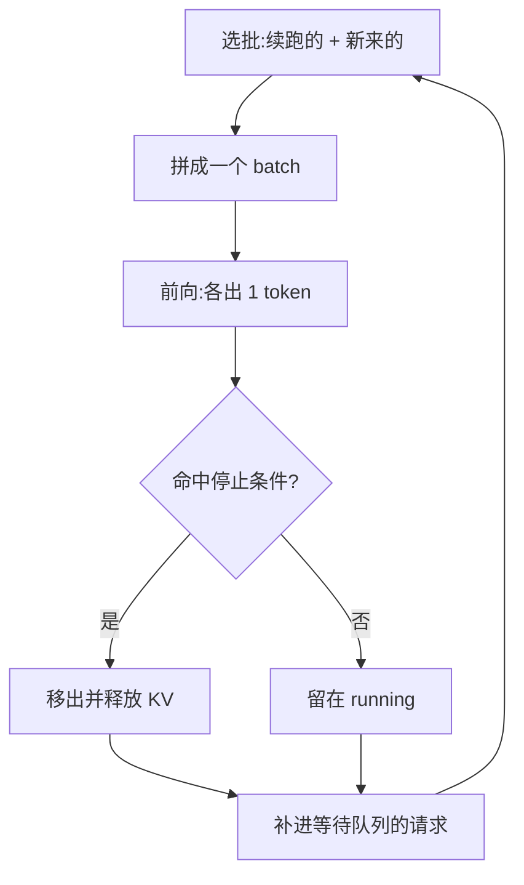

# 连续批处理与调度

> 🔴 重点考点:本篇直接对应真实面经高频问法,文末「面试考点串联」给出问法对照。

一句话:连续批处理把 LLM 服务的**调度粒度从"一整个请求"细化到"一个 decode step"**——每走一步就踢掉已完成的、补进新来的,让 GPU 不再为等最慢那条请求而空转;代价是每一步的 batch 组成都在变,这会连带出一个很多人栽跟头的副作用:**同一条输入,两次跑出来的结果可能不一样**。

## 一、静态批的问题:整批一起进、一起出

**静态批(static batching)**:把 N 条请求凑成一批,一起 prefill、一起 decode,**直到全批都生成完**才统一返回、统一释放坑位。HF `generate` 套个循环就是这个模式。

它有三个致命问题:

**1. 短请求被长请求绑架。** 一批里 A 生成 20 个 token 就 EOS 了,B 要生成 2000 个。从第 21 步开始,A 就在"陪跑"——它仍占着 batch 的一行、占着 KV cache、每步照样参与 GEMM,只是算出来的结果被丢弃。**B 不结束,A 就不能返回**,A 的用户白等 1980 步。

**2. GPU 有效算力随时间坍塌。** 批内活着的请求数从 N 一路掉到 1。decode 阶段的 GEMM 形状是 $[B, H] \times [H, H']$,$B$ 就是当前还活着的请求数。B 从 32 掉到 4 时,权重照样要从 HBM 完整读一遍(decode 是访存受限的),于是**摊到每个 token 上的成本涨了 8 倍**。输出长度是长尾分布,平均有效占用常常只有 30–50%。矩阵形状的细节见 Prefill与Decode的矩阵形状 篇。

**3. 新请求进不来。** 批一旦发车,后到的请求必须等整批跑完才能被调度,这段纯排队时间直接打进 TTFT。

一句话总结病根:**LLM 的每条请求生命周期长度能差几十上百倍,而静态批要求它们同生共死。**

## 二、连续批处理:迭代级调度

核心一句话:**调度决策从"每个请求做一次"变成"每个 iteration 做一次"**(iteration-level scheduling,思想出自 Orca,OSDI'22)。

每个 decode step 结束后,引擎做三件事:

1. 检查每条请求是否命中停止条件(EOS / max_tokens / stop string),命中的**立刻**移出 batch、返回结果、释放它的 KV cache 块
2. 看还剩多少坑位——受两个预算卡着:并发请求数上限,以及**空闲 KV cache 块数**
3. 从等待队列拉新请求补进来,下一步一起前向

> **类比**:静态批是包车——人凑齐才发车,最后一位乘客下车前谁也走不了;连续批是地铁——每一站都能上下客,车一直在跑。

**为什么"随时增删一行"是可行的?** 因为 KV cache 按请求分页存放、不要求连在一起(见 PagedAttention 篇),attention kernel 直接吃变长序列入参、不需要把整批 pad 成等长(见 FlashAttention 篇)。所以增删一条请求只是改一份元数据(块表 + 序列长度数组),**不搬数据、不重新 padding**。这是连续批处理能落地的前提——三者是配套的,单拎调度器出来做不到。

但只在 decode 侧"随时上下客"还不够:新请求进来第一步是 prefill,而 prefill 和 decode 的计算画像完全相反,这就引出第四节。

## 三、三种批处理方式对比

| | 静态批 static | 动态批 dynamic | 连续批 continuous |
|---|---|---|---|
| 调度粒度 | 请求级,发车后不动 | 请求级,发车前等一小段窗口凑批 | **迭代级(每个 decode step)** |
| 新请求何时能进 | 整批跑完 | 下一个窗口 | **下一步** |
| 完成的请求何时释放 | 整批跑完 | 整批跑完 | **立刻** |
| 额外延迟 | 无窗口,但尾部大量空转 | 人为等待 1–50 ms(可调) | 无额外等待 |
| GPU 利用率 | 随请求陆续完成而坍塌 | 同静态批,只是批更满 | 全程接近满 |
| 实现复杂度 | 最低 | 低,是通用推理服务器的标配能力 | 高:要分页 KV + 变长 kernel 配合 |
| 适用场景 | 离线批量打分、评测跑分(输出等长、不看延迟) | **输出长度固定或相近**的模型:分类、embedding、rerank、ASR | **自回归 LLM 在线服务** |

三条常被追问的区分:

- **动态批不等于连续批。** dynamic batching(Triton Inference Server 的 dynamic_batching、TorchServe 的 batch delay)解决的是"请求零散到达、批凑不满"——在入口攒一个几毫秒的小窗口,把窗口内的请求拼成一批送进去。**但一旦发车,它依然是静态批**:整批同进同出。
- **所以动态批对 LLM 生成不够用。** LLM 的痛点不是"批不满",而是"批内各请求的生命周期长度差几十倍"。动态批只把批填满了,没解决同生共死。反过来,对"一次前向出结果"的 embedding/分类模型,动态批就够了,上连续批毫无意义(根本没有多步迭代)。
- **两者可以叠加。** 实际引擎在入口也会做很轻的攒批(把同一时刻到达的几条一起入队),但主力永远是迭代级调度。

## 四、chunked prefill:别让长 prefill 卡住 decode

先记住两个阶段的资源画像截然相反:**prefill 是计算受限**(一次并行算几千 token,GEMM 的 M 维很大,Tensor Core 能打满);**decode 是访存受限**(每条只算 1 个 token,时间几乎全花在把权重从 HBM 读出来)。

问题:一条 32K token 的 prompt 做 prefill,可能要几百毫秒。传统调度器把这次 prefill 当成不可打断的整体,**这几百毫秒里 batch 中所有正在 decode 的请求全部停住**。用户侧的现象是输出流一顿一顿,ITL 出现尖刺。

**chunked prefill**(出自 SARATHI,arXiv:2308.16369)的做法:

1. 把长 prefill 沿序列维**切成固定大小的块**(如每块 512 / 2048 token),一步只算一块
2. 一步内剩下的 token 预算用来**捎带(piggyback)其他请求的 decode**——同一个 batch 里既有"某条请求的第 k 块 prefill",也有几十条请求的单 token decode
3. 每步的总 token 数被一个统一预算卡住,于是**每步耗时变得均匀**,不再有几百毫秒的 stall

为什么混着跑反而更划算:prefill 块吃算力、decode 吃带宽,**瓶颈资源不同,塞进同一步就能让算力和带宽同时被用起来**——decode 本来就在等内存,顺手把算力借给 prefill 块几乎不额外花时间。SARATHI 报告 LLaMA-13B / A6000 上 decode 吞吐最高 10×、端到端最高 1.33×;后续的 Sarathi-Serve(OSDI'24,arXiv:2403.02310)把它做成"stall-free 调度",Mistral-7B / A100 上服务容量 2.6×。

**取舍必须讲清楚,这是面试的落点**:

| | 不开 chunked prefill | 开 chunked prefill |
|---|---|---|
| 长 prompt 的 TTFT | 更好:一步算完就出首 token | **略差**:切成 k 块要 k 步,中间还穿插别人的 decode |
| 在跑请求的 TPOT / ITL | 差:被长 prefill 打断,尖刺明显 | **好**:每步耗时均匀,没有 stall |
| 每步耗时 | 忽长忽短,SLO 难卡 | 均匀,便于按 SLO 定容量 |
| 块大小怎么调 | — | 块大 → 偏 TTFT;块小 → 偏 TPOT,但块太小会让 prefill 退化成访存受限、白白浪费算力 |

一句话记法:**chunked prefill 是拿一点 TTFT 去换全局 TPOT 的稳定**。如果业务是"长 prompt、短输出、只考核首字延迟",反而应该关掉它。TTFT/TPOT/ITL 的准确定义见 推理服务指标 篇;想彻底摆脱这对矛盾,就把两个阶段拆到不同机器上,见 PD分离 篇。

vLLM V1 里 chunked prefill 默认开启,调度顺序是**先满足已在 running 的请求(decode 与续算的 prefill 块),再用剩余 token 预算从等待队列拉新请求**——保证新来的长 prompt 不会把已经在跑的请求挤停。

## 五、连续批调度为什么会让结果无法固定(重点)

现象:temperature=0、seed 固定、同一份权重、同一张卡,同一个 prompt 请求两次,输出**从某个 token 开始分叉**。

先排除两个常见误解:

- **不是采样随机性**——temperature=0 是贪心解码,argmax 里没有随机数。
- **通常也不是"GPU 并发导致累加乱序"**。Transformer 前向里一般不用浮点 atomicAdd 做归约,所以**固定输入下的单次前向是 run-to-run 确定的**。Thinking Machines 的分析明确指出:罪魁不是并发,而是**批不变性(batch invariance)的缺失**。

真正的因果链是五步:

1. **连续批调度让 batch 组成每步都在变。** 你的请求这一步和 3 条请求同批(GEMM 的 M=4),下一步别人完成了、新请求补进来,变成 M=17。你的输入一个字没改,但**它所在矩阵的形状变了**——而且这个形状取决于"此刻别的用户发了什么",完全在你控制之外。
2. **形状变了 → kernel 选择变了。** cuBLAS/cuBLASLt 按 M/N/K 用启发式(heuristic)挑实现:tile 大小、线程块分工、是否启用 split-K、用哪条 Tensor Core 指令。M=4 和 M=17 大概率落到**两个不同的 kernel**。
3. **kernel 变了 → 归约顺序变了。** 同一行点积,一个 kernel 把 K 维切 4 段分别累加再合并,另一个切 8 段;split-K 更是直接把 K 维拆给多个线程块各算一部分、最后合并部分和。
4. **归约顺序变了 → 浮点结果末位变了。** 因为浮点加法**不满足结合律**:

$$
(a + b) + c \neq a + (b + c)
$$

同一组数换个相加顺序,结果可能差最后一位(1 ulp)。这不是 bug,是 IEEE 754 有限精度下的必然。

5. **末位差异 → argmax 可能翻转。** 绝大多数 step 无所谓;但当 **top-1 与 top-2 的 logits 靠得极近**时,末位扰动足以让排序对调,选出另一个 token。而自回归是**误差放大器**——一步选了不同的 token,后面整段文本彻底分岔。

Thinking Machines 做过一个干净的实验:Qwen3-235B-A22B-Instruct-2507,同一个 prompt、temperature=0、各生成 1000 token、重复采 1000 次,得到 **80 种不同的补全**;第一次分叉出现在**第 103 个 token**。前 102 个 token 完全一致,说明这确实是"罕见但迟早发生"的末位翻转,不是系统性错误。

两个次级来源,面试时可以补充:

- **split-K + 原子加**:部分 GEMM / 反量化 kernel 用 `atomicAdd` 合并部分和,累加顺序取决于线程块被调度的先后,这会造成**真正的 run-to-run 不确定**(batch 不变也可能两次不同)。cuBLAS 提供了原子模式开关来禁用这类实现。
- **张量并行下的通信归约**:TP 切分后每张卡先局部归约,再 all-reduce 跨卡合并,**TP size 不同 → 全局累加顺序不同**。所以换并行配置也会改数值,batch 不变性本身不覆盖这一层。

为什么这件事在 RL 里格外要命:on-policy RL 中 rollout 引擎(推理)与训练引擎算同一份权重的 logprob,两边数值对不上,importance ratio 就带上了虚假偏差,轻则训练不稳、重则奖励崩塌。这正是"训推一致性"问题的数值根源之一。

## 六、怎么规避,代价是什么

按代价从小到大排:

| 手段 | 怎么做 | 代价 |
|---|---|---|
| **padding 到固定档位** | 把 batch 的 M 维 pad 到 8/16/32/64 这样的少数几档,让 kernel heuristic 只在几种固定形状间选 | pad 出来的行是白算的;档位越少越稳,也越浪费 |
| **锁定确定性 kernel** | 禁用浮点 atomicAdd、禁止降精度归约、固定算法不走 heuristic(PyTorch 侧对应确定性算法开关 + 固定 cuBLAS workspace) | 只治 run-to-run,**治不了 batch 变化**;部分算子退回慢实现 |
| **batch-invariant 归约** | 从 kernel 层面保证**同一行的归约顺序与 batch 大小无关**:固定 split 策略、固定 tile,不随形状改主意。需要 RMSNorm、matmul、attention 三类算子全部改造 | 吞吐明显下降。公开数据:同一实验 vLLM 默认 26 s → 未优化的确定性版 55 s → 换上改进的 attention kernel 后 42 s |
| **固定 batch 形状** | 干脆锁死 batch 不随调度变化 | 等于放弃连续批处理本身,吞吐大跌 |
| **logits 去抖** | 贪心解码时把 logits 量化/截断到较低精度再取 argmax,让末位噪声落进同一个桶 | 治标:仍挡不住真正的平票;且改变了输出的严格语义 |
| **业务侧兜底** | 结果缓存、只承诺"同批次内一致"、或干脆不承诺 bit 级复现 | 不是技术解,但线上服务多数就是这么做的 |

必须记住的一条认知:**确定性和吞吐直接对立**。连续批处理的收益恰恰来自"batch 组成随时在变",而批不变性要求的正是"别变"。所以工程上按场景开关:**线上服务追吞吐、容忍不确定;RL 训练、回归测试、审计复现开确定性模式,吃下几十个百分点的吞吐损失。**

补一句常被忽略的:确定性 ≠ 正确性。两种归约顺序算出来的都"对",误差都在浮点精度内;真正需要 bit 级复现的只有 debug、审计、训推一致这几类场景。

## 七、公平性与长尾:优先级、抢占与重算

迭代级调度带来新的自由度,也带来新的问题:**谁先跑、谁被踢**。

**默认 FCFS。** 先到先服务是最简单的防饿死策略:等待队列按到达时间排,坑位空出来就按序补。vLLM 默认 FCFS,也支持切换到优先级策略(优先级相同再按到达时间打破平局)。

**为什么需要抢占(preemption)。** KV cache 有限,而请求要生成多长事先不知道。一批请求都在生成、KV 越涨越多,可能撑爆显存——这时调度器必须**踢掉某些正在跑的请求**来腾块。踢谁:FCFS 下踢最晚到达的那条(保住老请求已有的进度),优先级模式下踢优先级最低的。

**踢掉之后怎么恢复,两条路**:

| | 换出(swap) | 重算(recompute) |
|---|---|---|
| 做法 | 把它的 KV 块拷到 CPU 内存,恢复时再拷回来 | **直接丢掉 KV**,恢复时把"原 prompt + 已生成的 token"当成新 prompt 重新 prefill |
| 成本 | PCIe 来回搬运,长序列非常贵 | 一次 prefill——而 prefill 是计算密集、并行度高的活 |
| 现状 | 早期实现支持,现在少用 | vLLM V1 只做重算 |

重算胜出的原因:PCIe 带宽(几十 GB/s)比 HBM(TB/s 量级)慢一两个数量级,搬 KV 的时间常常超过重算一遍;而且重算还能顺带命中前缀缓存。

**长尾与饿死的三种典型症状与缓解**:

1. **长请求饿死短请求**:少数超长输出的请求长期占着坑位和 KV,短请求排不进来。缓解:限制单请求最大生成长度、给短请求单独队列或配额、按剩余长度估计做优先级。
2. **抢占抖动(thrashing)**:显存刚刚够,调度器不停地"放进来 → 撑不住 → 踢掉 → 再放进来",系统在反复重算上空转。缓解:准入时检查**整条序列**是否装得下(而不只是第一个 chunk);保留一部分空闲 KV 块作水位线,不把显存用到刚好。
3. **TTFT 尖刺**:大量长 prompt 同时到达吃光 token 预算,后面的短请求首字延迟暴涨。缓解:限制同时在做的长 prefill 条数,让短 prompt 插队。

分页显存本身怎么管(块表、写时复制、前缀共享)不在本篇,见 PagedAttention 篇。

## 八、面试考点串联

| 高频问法 | 本文哪一节 |
|---|---|
| 静态批有什么问题?为什么 LLM 在线服务不能用? | 一 |
| 什么是 continuous batching?和静态批的区别? | 二(迭代级调度)+ 三 |
| 常用的批处理/调度方式有哪些?dynamic batching 和 continuous batching 差在哪? | 三(对比表 + 三条区分) |
| chunked prefill 解决什么问题?有什么代价? | 四(改善 TPOT,略微牺牲 TTFT) |
| 为什么大模型推理每次结果不一样?temperature=0 也不一样? | 五(batch 形状 → kernel 选择 → 归约顺序 → 浮点非结合律 → argmax 翻转) |
| 怎么让推理结果可复现?代价是什么? | 六(padding 档位 / 确定性 kernel / batch 不变归约,均以吞吐换) |
| 请求太多、KV cache 不够了怎么办? | 七(抢占:换出 vs 重算,以及为什么选重算) |
| 怎么防止长请求把短请求饿死? | 七 |
| 连续批处理为什么必须配合 PagedAttention? | 二(变长 KV + 分页是前提,细节见 PagedAttention 篇) |

延伸阅读顺序:本篇 → PagedAttention(坑位从哪来)→ 推理服务指标(TTFT/TPOT 怎么量)→ PD分离(把矛盾拆到两组机器上)。

## 相关文献

- Orca: A Distributed Serving System for Transformer-Based Generative Models(iteration-level scheduling 出处,OSDI'22)— https://www.usenix.org/conference/osdi22/presentation/yu
- Efficient Memory Management for Large Language Model Serving with PagedAttention(vLLM,SOSP'23)— [arXiv:2309.06180](https://arxiv.org/abs/2309.06180)
- SARATHI: Efficient LLM Inference by Piggybacking Decodes with Chunked Prefills — [arXiv:2308.16369](https://arxiv.org/abs/2308.16369)
- Taming Throughput-Latency Tradeoff in LLM Inference with Sarathi-Serve(OSDI'24)— [arXiv:2403.02310](https://arxiv.org/abs/2403.02310)
- Defeating Nondeterminism in LLM Inference(Thinking Machines Lab,批不变性分析与实验数据)— https://thinkingmachines.ai/blog/defeating-nondeterminism-in-llm-inference/
- batch_invariant_ops(配套的批不变 kernel 实现)— https://github.com/thinking-machines-lab/batch_invariant_ops
