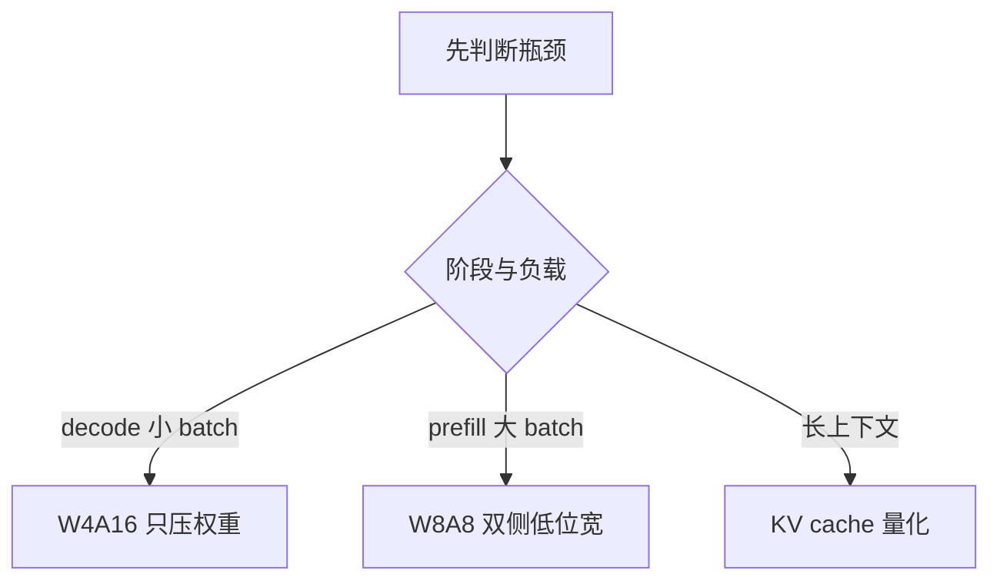

# 量化

> 🔴 重点考点:本篇是当前复习重点,文末「面试考点串联」给出问法对照。

一句话:量化就是**用更少的比特存同一个数**——它一次买到「装得下」和「跑得快」两件事,代价是把精度损失控制在可接受范围内。本篇讲通用原理(公式、粒度与 shape、数据类型、PTQ/QAT、选型);具体算法见 权重与激活量化 篇,KV cache 侧见 KVCache量化 篇。

## 一、为什么量化:显存和带宽两笔账

### 显存账:装得下

一个参数存 bf16 是 2 字节,int4 是 0.5 字节。按 70B 模型算这笔账:

| 权重格式 | 每参数字节 | 70B 权重体积 | 最少几张 80 GB 卡 |
|---|---|---|---|
| bf16 | 2 | 140 GB | 2 |
| int8 | 1 | 70 GB | 1(很紧,KV cache 没地方放) |
| int4 | 0.5 | 约 35 GB | 1(宽松,还能留给 KV cache) |

关键不是「省了百分之几」,而是**跨不跨得过一张卡的容量线**:140 GB 必须两卡起、张量并行,卡间通信、部署成本、延迟全部跟着上去;35 GB 单卡就跑完。这是量化最直接的收益。

### 带宽账:跑得快

decode 阶段每生成一个 token,都要把**全部权重**从显存读进计算单元一遍——权重读进来只用一次,没有复用可言。所以单 token 时间的下界就是一道除法:

$$
t_{\text{token}} \ \gtrsim\ \frac{\text{权重字节数}}{\text{HBM 带宽}}
$$

意思是:decode 快不快,首先取决于「把权重搬一遍要多久」,跟算力几乎无关。代入 70B、带宽 2 TB/s 的卡:bf16 的 140 GB 要 70 ms/token(约 14 token/s),int4 的 35 GB 只要 17.5 ms/token——**权重小 4 倍,理论上限就快约 4 倍**。

两笔账其实是同一件事:位宽降下来,占用和搬运量同时降。所以量化是推理优化的第一杠杆。至于量化之后算子会不会从访存受限迁移到计算受限,见 Roofline与Bound分析 篇第五节(一句话结论:weight-only 才会真迁移,W8A8 是把整条屋顶线一起抬高)。

### 三个量化对象

| 对象 | 特点 | 难度 |
|---|---|---|
| 权重 | 训完就固定,可以离线慢慢优化 | 最好量化 |
| 激活 | 随输入而变,只能在线定 scale 或拿校准集预估;且存在少数幅度极大的离群通道 | 最难,见 权重与激活量化 篇 |
| KV cache | 随 token 数线性增长,长上下文的显存大头 | 收益随序列长度放大,见 KVCache量化 篇 |

## 二、量化公式:scale、zero-point、round 与 clip

量化就是把连续值塞进有限档位——像把连续的身高塞进 S/M/L/XL 尺码表。档位间距叫 **scale**($s$),码表整体的平移量叫 **zero-point**($z$):

$$
q = \mathrm{clamp}\Bigl(\mathrm{round}\bigl(x / s\bigr) + z,\ q_{\min},\ q_{\max}\Bigr), \qquad \hat{x} = s\,(q - z)
$$

左式是量化:先除以档距、四舍五入成整数、加上平移量,最后把超出表示范围的值**截断**到端点;右式是反量化:乘回档距、减去平移量,还原出近似值 $\hat{x}$。注意 $\hat{x} \neq x$,这个差就是量化误差。

误差有两个来源,而且是跷跷板关系:

- **舍入误差**:round 造成的,最大半个档距。$s$ 越小误差越小
- **截断误差**:超出 $[q_{\min}, q_{\max}]$ 的值被拍到端点。$s$ 越小能覆盖的范围越窄,被拍扁的值越多

所以「定 scale」这件事的本质就是在**档位密**和**罩得住**之间选。最简单的做法是 absmax(让最大值刚好落在端点,零截断误差);校准时也常故意收窄范围(如按分位数裁剪),用少数离群点的失真换其余绝大多数值的分辨率。

| | 对称量化 | 非对称量化 |
|---|---|---|
| zero-point | $z = 0$ | $z \neq 0$,把码表平移对准数据实际范围 |
| scale | $s = \max\lvert x \rvert / (2^{b-1}-1)$ | $s = (x_{\max}-x_{\min}) / (2^{b}-1)$ |
| 适合 | 零均值、大致对称的分布(权重) | 单边分布(如 ReLU 后恒非负的激活) |
| 代价 | 小,点积直接算 | 展开后多出交叉项,要额外修正 |

非对称的代价值得展开一句:把 $\hat{x}=s(q-z)$ 代进点积会多出一项与 $z$ 相关的求和,虽然可以离线预计算折成偏置,但 kernel 复杂度确实上升。所以**权重侧偏爱对称,激活侧看分布决定**;而 int4 权重因为只有 16 个档位,分布哪怕轻微偏斜也很吃亏,反而常用非对称。

## 三、粒度全谱:一张码表管多大范围,scale 是什么 shape

粒度决定「多少个数共用一组 $(s, z)$」。类比:全国统一尺码表 vs 每省一张 vs 每 128 人一张——表越细,一个巨人只会毁掉自己那张小表;代价是 scale 本身要占存储、要参与计算。

先把下标写清楚,后面全靠它。一个线性层(权重按 PyTorch 惯例是 $W \in \mathbb{R}^{out \times in}$,激活把 batch 与序列拉平成 $X \in \mathbb{R}^{T \times in}$,$T = B \times S$):

$$
Y_{t,o} \;=\; \sum_{i=1}^{in} X_{t,i}\, W_{o,i}
$$

三个下标各有名字:$t$ 是 token(激活的行)、$o$ 是输出通道(权重的行)、$i$ 是**求和维**(hidden / 输入通道)。记牢 $i$ 是被求和吃掉的那一维——下一节所有结论都从这里推出来。

| 粒度 | 谁用它 | 一组 scale 覆盖什么 | scale 张量 shape | 误差 | 元数据开销 |
|---|---|---|---|---|---|
| per-tensor | 权重 / 激活 | 整个张量 | `[1]` | 最大 | 可忽略 |
| per-channel | **权重**(沿输出通道) | $W$ 的一行 | `[out]`(广播成 `[out, 1]`) | 中 | $out$ 个数 |
| per-group | 权重(沿 $i$ 每 $G$=128 个一组) | $W$ 一行里的一段 | `[out, in/G]` | 小 | int4 标配 |
| per-token | **激活** | $X$ 的一行,即一个 token 的整条隐藏向量 | `[T]`,即 `[B, S, 1]` | 小 | 每步在线算 |
| per-head | KV cache | 一个 head 的 K 或 V | `[B, n_head]` 量级 | 小 | 见 KVCache量化 篇 |

一句话记忆:**权重的 per-channel 是「每个输出神经元一张表」,激活的 per-token 是「每个 token 一张表」——两者都不沿求和维 $i$ 切**。这不是巧合,是下一节那条数学约束逼出来的。

> 🖼️ 占位:同一组张量上画四种粒度的分块着色(per-tensor 整块一色 / per-channel 按行 / per-group 行内每 128 列一段 / per-token 在激活侧按行),每块旁标注 scale 张量的 shape

**per-channel 到底是哪一维**,是最容易答错的一问。答案:$W \in \mathbb{R}^{out \times in}$ 时 scale 是 `[out]`,沿**输出通道**,不是 `[in]`。理由不是习惯,是可提取性:沿 $in$ 切就等于沿求和维切,scale 提不出求和号(见下节)。

元数据开销可以直接算,这是面试里能拿分的细节。int4 + per-group($G$=128)+ fp16 scale:

$$
\text{有效位宽} = 4 + \frac{16}{128} = 4.125\ \text{bit/权重}
$$

即每 128 个 4 bit 权重要多存一个 16 bit 的 scale,摊到每个权重头上是 0.125 bit;非对称再配一个同粒度的 zero-point,合计约 4.25 bit。所以「int4 模型」的实际体积总比「参数量 × 0.5 字节」略大一点,别把这笔账漏了。

## 四、为什么激活只能 per-token / per-tensor(高频)

把量化后的表示代回点积,一切就清楚了。设权重 per-channel(scale 记作 $s^W_o$)、激活 per-token($s^X_t$),先按对称量化略去 zero-point:

$$
Y_{t,o} \;\approx\; s^X_t\, s^W_o \sum_{i} q^X_{t,i}\, q^W_{o,i}
$$

读法:两个 scale 都**与求和下标 $i$ 无关**,于是整个提到求和号外面。求和号里剩下的是纯整数乘加——int8 tensor core 照常跑出一个 int32 累加器,反量化只是在最后给每个输出元素乘上「行 scale × 列 scale」两个数。这就是 W8A8 能真正吃到低位宽算力的原因。

反过来,如果激活做 per-channel(scale 跟着 $i$ 走):

$$
\sum_i s^X_i\, q^X_{t,i}\, W_{o,i} \;\neq\; s^X \sum_i q^X_{t,i}\, W_{o,i}
$$

每一项乘的系数都不一样,$s^X_i$ **卡在求和里出不来**。硬要做,就得在累加过程中逐元素乘 scale,那等于放弃整数 GEMM、退回逐元素运算,量化的算力收益全部蒸发。所以这条结论是硬的:**激活的量化粒度只能沿 token 维切或整张量一把切,不能沿 hidden 维切。**

麻烦恰恰在于:激活里存在少数幅度极大的**离群通道**,而它们正好是沿 hidden 维分布的,按通道切表这条最自然的路被数学堵死了。怎么绕开这条约束,是 LLM.int8()、SmoothQuant、GPTQ、AWQ 这一路算法的主题,见 权重与激活量化 篇,本篇不展开。

per-group 是个折中:它确实沿 $i$ 切,但按每 $G$ 个一段切,于是求和可以拆成分段求和:

$$
\sum_i X_{t,i}\,\hat{W}_{o,i} \;=\; \sum_{g} s^W_{o,g} \sum_{i \in g} X_{t,i}\, q^W_{o,i}
$$

意思是:组内 scale 是常数,可以提到**组内**求和之外;外层再把每组的部分和乘上各自的 scale 累起来。代价是 kernel 必须按组切分累加。这也解释了为什么 per-group 主要用在**权重**上:W4A16 里权重反正要反量化回 fp16 才算,分组几乎免费;而在 W8A8 的整数 GEMM 里,分段部分和会打断 tensor core 的连续累加,实现复杂得多。

## 五、动态量化 vs 静态量化

这组概念说的是**激活的 scale 什么时候确定**(权重的 scale 永远离线算好,不参与这个分类)。

| | 动态量化 | 静态量化 |
|---|---|---|
| scale 何时定 | 推理时按当前这批激活现算(一次 absmax 归约) | 离线用校准集统计好,固定写进模型 |
| 典型粒度 | per-token(天然适配) | per-tensor |
| 精度 | 更高,永远贴合当前输入的分布 | 取决于校准集覆盖得好不好,分布一漂就崩 |
| 开销 | 每层多扫一遍激活求 max,再做一次乘除 | 推理期零额外开销 |
| 适合 | 通用服务、输入分布不可控 | 输入分布稳定、极致压延迟 |

要点在于:动态量化的开销不在算力,而在**又扫了一遍激活**——对本来就访存受限的算子,这一趟归约通常要和前一个算子融合掉才划算。实践中 W8A8 的主流配方是「权重 per-channel 静态 + 激活 per-token 动态」,精度与可实现性兼顾。KV cache 场景下的动态/静态另有讲究(校准集怎么选、CUDA Graph 与并行下怎么取参数),见 KVCache量化 篇。

## 六、PTQ vs QAT

| | PTQ(训练后量化) | QAT(量化感知训练) |
|---|---|---|
| 做法 | 拿训好的模型 + 几百条校准样本,定 scale、做局部修正 | 训练图里插入「伪量化」节点,让模型带着量化误差继续训 |
| 成本 | 几张卡、几小时 | 一整套训练/微调流程 |
| 精度上限 | 4 bit 尚可,2–3 bit 明显掉 | 更高,极低位宽仍有救 |
| 需要什么 | 无标注的校准集 | 训练级的数据与算力 |

QAT 的关键机制是 **STE(straight-through estimator,直通估计器)**。问题出在 round 的导数几乎处处为 0,梯度传不回去;STE 的做法是前向照常取整、反向**假装这一步是恒等函数**,把梯度原样透传:

$$
\frac{\partial \hat{x}}{\partial x} \;:=\; \mathbb{1}\bigl[\, q_{\min} \le x/s + z \le q_{\max} \,\bigr]
$$

读法:在没被截断的区间内,梯度以系数 1 直接穿过量化节点;被 clamp 掉的地方梯度置 0(反正再调也出不了范围)。这是一个明知不严格但极好用的近似——它让「不可导的取整」在反传时变成透明的。

**LLM 时代 PTQ 是绝对主流**,原因很直接:重训一个 70B 的成本是天文数字,而逐层局部优化的 PTQ 已能把 int4 的损失压到可接受。QAT 剩下的场景有两类,近年反而在回暖:

- 端侧极低位宽(2–3 bit),PTQ 救不回来,只能训
- **大模型原生低精度发布**:gpt-oss 把 MoE 权重量化到 MXFP4 并配 QAT 式后训练(MoE 占 90% 以上参数,120B 因此能装进单张 80 GB 卡);Kimi K2 Thinking 对 MoE 权重做 INT4 权重量化的 QAT,直接以 int4 checkpoint 发布。趋势很清楚:**低精度正从「部署后处理」变成「发布格式」**

## 七、数据类型谱系

| 格式 | 位宽 | 符号/指数/尾数 | 最大可表示 | 定位 |
|---|---|---|---|---|
| fp32 | 32 | 1/8/23 | ~3.4e38 | 基准,主权重与优化器状态 |
| fp16 | 16 | 1/5/10 | 65504 | 精度高但范围窄,训练易溢出 |
| bf16 | 16 | 1/8/7 | ~3.4e38 | 与 fp32 同范围,训练默认 |
| fp8 E4M3 | 8 | 1/4/3 | 448 | 精度优先:权重与前向激活 |
| fp8 E5M2 | 8 | 1/5/2 | 57344 | 范围优先:反向梯度 |
| int8 | 8 | 定点 | ±127 | W8A8 主力,整数 tensor core |
| int4 | 4 | 定点 + per-group scale | ±7 | 权重压缩主力 |
| NF4 | 4 | 正态分位数码本 | — | 冻结基座的存储格式 |
| MXFP4 | 4 | E2M1 + 每 32 个元素共享指数 | — | 微缩放块格式 |

浮点与定点的一句话区别:**浮点拿指数位换动态范围,定点把档位均匀铺满**。同样 8 bit,数据分布均匀时 int8 分辨率更高,分布长尾时 fp8 更抗离群——这也是 KV cache 上 fp8 常比 int8 好用的直觉来源(具体选型见 KVCache量化 篇)。

### BF16 与 FP16:同样两字节,不同的范围和精度

BF16 的 8 位指数与 7 位尾数,用较粗的间隔换来接近 FP32 的范围;FP16 用 5 位指数与 10 位尾数,在同一数量级分得更细,最大有限值却只有 65504。以 1 附近为例,相邻数间隔分别为 $2^{-7}$ 和 $2^{-10}$;数值到 100000 时,FP16 可能转成无穷大,BF16 仍可表示有限近似值。因此范围与精度是两项指标。

两者元素存储都是 2 字节,同形状张量的体积相同。实际速度取决于硬件、算子和累加精度;训练总显存还包括高精度状态与激活,不能只按权重格式推断。BF16 范围较宽,通常不需要 FP16 的动态损失缩放,但不会免除所有 NaN 和舍入问题。

FP16 的损失缩放主要防止**小梯度下溢**:反向前放大损失、更新前缩回梯度;检测到非有限值时跳步并降低缩放。它不会扩展 FP16 的表示上限,不能修复前向中已经溢出的激活。此时需要稳定计算或让敏感算子保留更高精度;裁剪也应在取消缩放后执行。FP8 的进一步范围和精度取舍见下一节,不能直接当无损替换。

**E4M3 与 E5M2 的分工**。同样 8 bit,指数位多一位就意味着尾数位少一位,是纯粹的此消彼长。类比相机:E4M3 是「分辨率高、动态范围小」,E5M2 反之。前向的权重与激活分布相对集中,选精度(E4M3,最大 448);梯度跨越好几个数量级、一旦溢出就是 NaN,选范围(E5M2,最大 57344)。这一分工是 FP8 格式论文的核心结论。

**NF4 为什么号称信息论最优**。LLM 权重近似零均值正态分布。均匀量化把档位平摊,可正态分布是中间人多、两头人少,平摊等于把大量档位浪费在几乎没有数的区间。NF4 的 16 个档位取标准正态的**等概率分位数**:人多的段档位密、人少的段疏,每个档位分到的数一样多,码字利用率相同——所谓「对正态数据信息论最优」就是这个意思(前提是数据真的近似正态,这也是它的适用边界)。工程上 NF4 用 blocksize 64,并对 scale 本身再做一次 8 bit 量化(double quantization),把元数据从每参数 0.5 bit 压到约 0.127 bit。NF4 配 LoRA 的联合用法见 LoRA 篇。

> 🖼️ 占位:同一条正态分布密度曲线上叠两套档位刻度——均匀 int4 的等距刻度 vs NF4 的等概率分位数刻度,直观看出档位往哪儿聚

**MXFP4 的微缩放块格式**。OCP 的 MX 标准规定:每 32 个连续元素一块,块内每个数存 4 bit 的 E2M1(1 符号 / 2 指数 / 1 尾数),整块共享一个 8 bit 的 2 的幂次指数(E8M0)。折合 $4 + 8/32 = 4.25$ bit/权重。像一个小组共用一个货币单位,组内只记「几块几」。它比 per-tensor 细得多、又比任意分组规整(块大小固定 32,硬件可以写死),所以新一代加速器能原生支持;NVIDIA 另有 NVFP4(块 16、scale 改用 E4M3)是同一思路的变体。

**int4 为什么是甜点位**。k-bit 推理缩放律那篇的结论:在「总比特预算 vs 零样本精度」这个权衡上,4 bit 几乎普遍最优——同样的显存预算,与其跑小模型的 8 bit 版,不如跑大模型的 4 bit 版。

## 八、FP8 训练:另一条线,别混淆

前面讲的全是**推理量化**(训完再压);FP8 训练是**训练本身**的 GEMM 用 8 bit 算,目标是省训练算力而不是省部署显存,两者别混为一谈。DeepSeek-V3 是首个公开的大规模实践:GEMM 输入用 E4M3,激活按 1×128 tile、权重按 128×128 block 做细粒度 scaling,累加提升到 fp32,主权重与优化器状态保持高精度,embedding、输出头、门控、归一化与 attention 等敏感模块保留高精度。论文报告 FP8 与 BF16 基线的训练损失相对误差小于 0.25%。

## 九、W4A16 / W8A8:记号与选型

W = 权重位宽,A = 激活位宽。W4A16 是「权重按 int4 存、算的时候还是 fp16」,W8A8 是「两边都 8 bit」。选哪个,看瓶颈落在 Roofline 的哪一侧:

| 记号 | 计算怎么走 | 主要收益 | 适合 |
|---|---|---|---|
| W4A16 | kernel 取权重时在线反量化回 fp16,仍走 fp16 tensor core | 权重搬运量降 4 倍,decode 提速上限接近 4 倍 | decode、小 batch、单卡塞下大模型 |
| W8A8 | 权重激活都是 8 bit,直接走 int8 / fp8 tensor core | 峰值算力翻倍(同代 int8 约为 fp16 的 2 倍) | prefill、大 batch、高并发吞吐 |

两条容易被忽略的代价:

1. **W4A16 必须做融合反量化**。如果先把 int4 反量化成 fp16 写回显存、再启动 GEMM,访存量反而上升,量化直接变成负收益(定量见 Roofline与Bound分析 篇)
2. **W8A8 在小 batch 上收益有限**。decode 本来就是访存受限,把峰值算力翻倍派不上用场;它的收益要到计算受限的场景才兑现

## 十、评估的坑:困惑度会骗人

int4 模型的困惑度常常只涨百分之几,看起来近乎无损——但困惑度是**逐 token 平均**指标,它天然掩盖两件事:

- **误差分布不均**:量化误差集中伤害低概率、关键的那些 token。平均值看不出来,可那恰恰是决定答案对错的 token
- **长链累积**:自回归生成里,这一步的偏差会作为下一步的输入继续放大。数学、代码、多步推理这类「错一步全错」的任务,掉点常明显大于困惑度暗示的水平

学术上更靠谱的做法是看**分布距离**而不是聚合精度:即使量化前后总体准确率相同,答案也可能大量「翻面」(原本对的变错、错的变对),这种 flips 用 KL 散度能捕捉到,而准确率捕捉不到。实务上的最低要求就一句:**用你真正要部署的那类任务做评估**,别只报困惑度。

## 十一、面试考点串联

| 高频问法 | 本文哪一节 |
| --- | --- |
| 为什么要量化?收益从哪来? | 一(显存账 + 带宽账,各自的量级) |
| 量化和反量化各是怎么算的?scale 和 zero-point 分别管什么? | 二 |
| 对称量化和非对称量化有什么区别?各用在哪? | 二 |
| per-tensor / per-channel / per-group / per-token 各是什么? | 三(粒度全谱表) |
| 权重是 `[out, in]` 时 per-channel 的 scale 是什么 shape?为什么不是另一维? | 三 + 四 |
| 激活为什么不能做 per-channel 量化? | 四(scale 提不出求和号) |
| int4 模型的实际体积,为什么比「参数量 × 0.5 字节」大? | 三(per-group scale 的开销,4.125 / 4.25 bit) |
| 动态量化和静态量化的区别、各自开销? | 五 |
| PTQ 和 QAT 分别怎么做?STE 是什么? | 六 |
| BF16、FP16 与 FP8 怎样取舍,损失缩放能解决什么? | 七的 BF16/FP16 比较与 E4M3/E5M2,八的 FP8 训练 |
| NF4 为什么号称信息论最优? | 七 |
| MXFP4 的块格式是怎么回事,为什么是 4.25 bit? | 七 |
| W4A16 和 W8A8 怎么选?decode 该用哪个? | 九 |
| 量化后困惑度只掉一点,能说明无损吗? | 十 |

延伸阅读顺序:本篇(通用原理)→ 权重与激活量化(离群值与四个经典算法)→ KVCache量化(KV 侧的实现细节)→ Roofline与Bound分析(量化后的 bound 迁移)。

## 相关文献

- A White Paper on Neural Network Quantization(scale/zero-point、粒度、PTQ 与 QAT 的系统梳理)— [arXiv:2106.08295](https://arxiv.org/abs/2106.08295)
- Quantization and Training of Neural Networks for Efficient Integer-Arithmetic-Only Inference(整数量化方案与 QAT 的奠基工作)— [arXiv:1712.05877](https://arxiv.org/abs/1712.05877)
- Estimating or Propagating Gradients Through Stochastic Neurons for Conditional Computation(STE 直通估计器的出处)— [arXiv:1308.3432](https://arxiv.org/abs/1308.3432)
- FP8 Formats for Deep Learning(E4M3 / E5M2 的定义与分工)— [arXiv:2209.05433](https://arxiv.org/abs/2209.05433)
- QLoRA: Efficient Finetuning of Quantized LLMs(NF4 与 double quantization)— [arXiv:2305.14314](https://arxiv.org/abs/2305.14314)
- Microscaling Data Formats for Deep Learning(MX 系列格式的评估)— [arXiv:2310.10537](https://arxiv.org/abs/2310.10537)
- OCP Microscaling Formats (MX) Specification v1.0(块大小 32、E8M0 共享 scale 的标准原文)— https://www.opencompute.org/documents/ocp-microscaling-formats-mx-v1-0-spec-final-pdf
- The case for 4-bit precision: k-bit Inference Scaling Laws(4 bit 是精度/显存权衡的甜点)— [arXiv:2212.09720](https://arxiv.org/abs/2212.09720)
- Accuracy is Not All You Need(压缩模型的评估:flips 与 KL 散度)— [arXiv:2407.09141](https://arxiv.org/abs/2407.09141)
- DeepSeek-V3 Technical Report(大规模 FP8 混合精度训练)— [arXiv:2412.19437](https://arxiv.org/abs/2412.19437)
- gpt-oss-120b & gpt-oss-20b Model Card(MoE 权重以 MXFP4 发布,约 4.25 bit/参数)— [arXiv:2508.10925](https://arxiv.org/abs/2508.10925)

- [NVIDIA 混合精度训练说明](https://docs.nvidia.com/deeplearning/performance/mixed-precision-training/index.html):FP16 表示范围、损失缩放及高精度累加。
