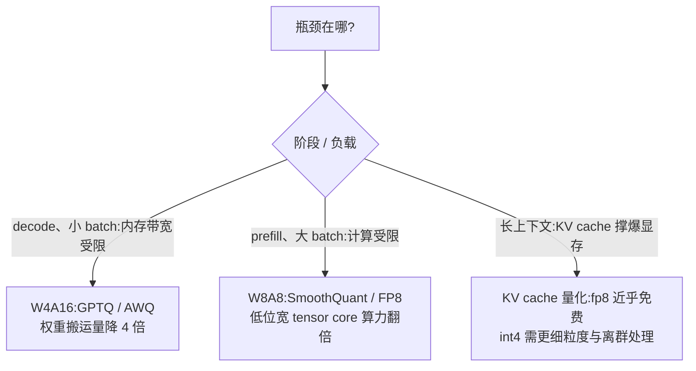

# 量化(GPTQ / AWQ / FP8 / INT4)

> ⚠️ 旧版:本篇写于写作契约确立之前,尚未按新标准审查重写。标准见 docs/05-知识库写作契约.md,样板见「GPU架构与执行模型」。

一句话:**用更少的比特存数字**——参数量化把显存和带宽同时砍下来,代价是对精度损失的精细管理。

为什么显存和带宽是同一件事:70B 模型 bf16 权重要 140 GB,int4 只要约 35 GB,这是「装得下」;而 decode 阶段每生成一个 token 都要把全部权重从显存搬进计算单元一遍,权重小 4 倍就是搬运快约 4 倍,这是「跑得快」。量化同时解决这两个问题,所以它是推理优化的第一杠杆。

## 一、基本概念:把连续值填进有限档位

量化就像把连续的身高值塞进 S/M/L/XL 尺码表:档位间距是 **scale**($s$),码表整体的平移是 **zero-point**($z$):

$$
q = \mathrm{round}\!\left(\frac{x}{s}\right) + z, \qquad \hat{x} = s\,(q - z)
$$

- **对称量化**:$z = 0$,$s = \max|x| / (2^{b-1}-1)$。码表关于 0 对称,适合零均值的权重;
- **非对称量化**:$z \neq 0$,把码表平移对准数据的实际范围(如 ReLU 后恒非负的激活),不浪费负半轴的档位。

### 粒度:一张码表管多大范围

| 粒度 | 含义 | 误差 | 元数据开销 |
| --- | --- | --- | --- |
| per-tensor | 整个矩阵共用一组 $(s, z)$ | 大 | 最小 |
| per-channel | 每行/每列一组 | 中 | 小 |
| per-group | 每 128 个元素一组(int4 标配) | 小 | 每 128 个数存一个 scale |

类比:全国统一尺码表 vs 每省一张 vs 每 128 人一张——表越细,一个巨人只会毁掉自己那张小表。

### 三个量化对象

- **权重**:静态、训完就定,可离线慢慢优化,最好量化;
- **激活**:随输入动态变化,只能在线快速量化(或用校准集离线定 scale),最难;
- **KV cache**:长上下文的显存大头,随 token 数线性增长,量化收益随序列长度放大。

### LLM 量化的拦路虎:激活离群值

Transformer 训到一定规模后,激活矩阵里会出现**固定的少数几个通道**,幅度是其他通道的几十到上百倍(outlier channels)。

> 🖼️ 占位:激活矩阵热力图,大部分区域数值平缓,少数几列呈刺眼的亮色竖条纹(离群通道)

类比:一个班平均身高 1.7 米,混进一个 3 米的巨人。尺码表要罩住巨人,普通人就全挤进一两个档里——分辨率全浪费在没人的区间。更麻烦的是,离群值恰好长在矩阵乘法**求和的那一维**(channel 维)上:这一维的 per-channel scale 无法从点积中提出来,硬件友好的激活量化只能做 per-token 或 per-tensor——巨人躲不掉。这一条是后面所有算法的共同起点。

## 二、数据类型谱系

| 格式 | 位宽 | 结构(符号/指数/尾数) | 一句话定位 |
| --- | --- | --- | --- |
| fp16 | 16 | 1/5/10 | 精度高但范围窄(±65504),训练易溢出 |
| bf16 | 16 | 1/8/7 | 与 fp32 同范围,训练默认 |
| fp8 E4M3 | 8 | 1/4/3 | 精度优先:权重与前向激活 |
| fp8 E5M2 | 8 | 1/5/2 | 范围优先:反向梯度 |
| int8 | 8 | 定点 | W8A8 经典方案,离群值需专门处理 |
| int4 | 4 | 定点 + per-group scale | 权重压缩主力(GPTQ/AWQ) |
| NF4 | 4 | 正态分位数码本 | QLoRA 冻结基座的存储格式(见 LoRA 篇) |
| MXFP4 | 4 | E2M1 + 每 32 元素共享 8 位指数 | 微缩放块格式,Kimi K3 的权重发布格式 |

三个值得单独说的:

- **E4M3 vs E5M2**:同样 8 bit,指数位和尾数位怎么分?类比相机:E4M3 是「分辨率高、动态范围小」,E5M2 反之。前向的权重/激活数值分布相对集中,选精度(E4M3);梯度大小悬殊、动态范围大,选范围(E5M2)。
- **NF4**:LLM 权重近似零均值正态分布。NF4 的 16 个档位不是均匀铺设,而是取标准正态的**等概率分位数**——人多的身高段档位密、人少的段疏,每个档装的数一样多,每个码字的利用率相同。QLoRA 论文称其为对正态数据信息论最优的数据类型。
- **MXFP4**:每 32 个数一小组,共享一个 2 的幂次 scale(8 bit),组内每个数只存 4 bit(E2M1)——像一个小组共用一个货币单位,组内只记「几块几」。折合约 4.25 bit/权重,是 OCP Microscaling 开放标准,新一代加速器原生支持。

## 三、PTQ vs QAT

- **QAT(量化感知训练)**:训练时插入「伪量化」节点(前向模拟取整,反向用直通估计器把梯度透传),让模型学会带着量化误差工作。上限高,但要重新训练;
- **PTQ(训练后量化)**:拿训好的模型 + 几百条校准样本,直接定 scale、做局部优化,几张卡几小时搞定。

LLM 时代 **PTQ 是绝对主流**:重训一个 70B 的成本是天文数字,而 GPTQ/AWQ 这类逐层局部优化已能把 int4 的损失压到可接受;QAT 主要在端侧极低位宽等对精度极端敏感的场景保有价值(近年部分端侧小模型开始官方发布 QAT 版本)。

## 四、经典 PTQ 算法四连(重点)

### LLM.int8():把巨人请出去单算

思路最直白:既然离群通道只占约 0.1%,那就按通道**把它们抽出来走 fp16**,其余 99.9% 走 int8(vector-wise 量化),两路矩阵乘的结果再加回来。

- 优点:首次证明百亿级模型可以 8 bit 近乎无损推理,显存直接减半;
- 缺点:混合精度分解的 kernel 复杂,速度常常不升反降——它解决的是「装得下」,不是「跑得快」。

### SmoothQuant:把担子往权重那头挪

观察:激活难量化(有巨人),权重好量化(分布规整、精度还有富余)。那就做一个**数学等价的难度迁移**——激活按通道除以 $s$,权重按通道乘回 $s$:

$$
Y = XW = \left(X\,\mathrm{diag}(s)^{-1}\right)\left(\mathrm{diag}(s)\,W\right) = \hat{X}\hat{W}
$$

迁移强度由 $\alpha$ 控制(常用 0.5,离群越猛调越大):

$$
s_j = \frac{\max|X_j|^{\alpha}}{\max|W_j|^{\,1-\alpha}}
$$

类比:两人抬担子,一头太沉就往另一头挪几斤——总重不变,但两边都受得住。$s$ 可以离线折进前面的 LayerNorm/线性层参数,推理**零额外开销**;换来权重激活双 int8(W8A8),prefill 直接吃到 int8 tensor core 的算力翻倍。

### GPTQ:切歪的蛋糕,后面的刀补回来

目标是逐层最小化量化前后的**输出**差(而非权重本身的差):

$$
\arg\min_{\hat{W}} \left\| WX - \hat{W}X \right\|_2^2
$$

继承 OBQ(Optimal Brain Quantization)的思想:一次量化一个权重,用二阶信息(Hessian $H = 2XX^{\top}$)衡量每个权重对输出的敏感度;每量化完一个,就把它造成的误差**分摊给还没量化的权重去补偿**:

$$
\delta_F = -\,\frac{w_q - \mathrm{quant}(w_q)}{[H^{-1}]_{qq}}\;[H^{-1}]_{:,q}
$$

类比:切蛋糕,每切一刀量一下切歪了多少,后面的刀调整角度把总误差补回来;Hessian 告诉你哪几刀切歪最伤。GPTQ 对 OBQ 做了三个工程近似把复杂度打下来:所有行按同一列序量化(免去每行独立贪心排序)、128 列一批延迟更新、用 Cholesky 分解稳住数值——从此百亿模型量化到 int4/int3 只需几个 GPU 小时。

### AWQ:保护干活最多的 1%

观察:权重通道的重要性**不看权重自己多大,看对应的激活多大**——激活幅度大的通道被频繁重度使用,保住这约 1% 的「显著通道」,精度就保住大半。直接把这 1% 留成 fp16 效果很好但硬件不友好(混合精度访存),AWQ 改用**等价缩放保护**:显著通道的权重先乘 $s>1$ 再量化(在量化网格中相对误差变小),激活侧除回 $s$ 抵消:

$$
s_j = \left(\overline{|X_j|}\right)^{\alpha}, \qquad \alpha \in [0,1]\ \text{网格搜索,最小化层输出重构误差}
$$

类比:车间里 1% 的老师傅干了大半产量,防护装备优先配给他们。与 GPTQ 的关键差异:**不做误差补偿式的权重更新**(只做可逆缩放,不动权重本身的分布),不依赖任何回归拟合或反传,因此对校准集过拟合的风险更低,在指令模型/多模态模型上泛化更稳。

### 四连对比

| 算法 | 量化对象 | 核心一招 | 典型位宽 | 特点 |
| --- | --- | --- | --- | --- |
| LLM.int8() | 权重+激活 | 离群通道分离走 fp16 | W8A8 混合 | 近乎无损的开山之作,但不加速 |
| SmoothQuant | 权重+激活 | 难度从激活迁移到权重 | W8A8 | 全 int8 GEMM,prefill 提速 |
| GPTQ | 仅权重 | Hessian 误差补偿逐列量化 | W4/W3 | 精度好,略依赖校准集 |
| AWQ | 仅权重 | 激活感知缩放保护显著通道 | W4 | 不扰动权重分布,泛化稳 |

## 五、FP8 训练:另一条线,别混淆

前面全是**推理量化**(训完再压);FP8 训练是**训练本身**用 8 bit 做矩阵乘。DeepSeek-V3 是首个公开的大规模实践:GEMM 输入用 E4M3 配细粒度分块 scaling(激活 1×128、权重 128×128),累加定期提升到 fp32,master 权重与优化器状态保持高精度,最终训练损失曲线与 bf16 基线几乎重合。谱系视角的一句话:bf16 是默认,FP8 自 DeepSeek-V3 起进入训练主流,MXFP4 已经出现在权重发布环节(Kimi K3)。

## 六、实务:记号、选型与生态

### W4A16 / W8A8 记号

W = 权重位宽,A = 激活位宽。选哪个,看瓶颈落在 roofline 的哪一侧:

- **W4A16**:激活不动、计算仍走 bf16,kernel 读入权重时在线反量化。decode 每步都要搬全部权重,搬运量降 4 倍,提速上限接近 4 倍;
- **W8A8**:两边都低位宽,才能用上 int8/fp8 tensor core 的双倍吞吐,适合吃满算力的 prefill 与高并发。

### 方案速查

| 方案 | 记号 | 精度损失 | 主要收益 | 典型场景 |
| --- | --- | --- | --- | --- |
| LLM.int8() | W8A8 混合 | ≈0 | 显存减半 | 历史意义为主 |
| SmoothQuant | W8A8 | 小 | prefill 算力翻倍 | 高吞吐服务 |
| GPTQ int4 | W4A16 | 小 | 显存/带宽 4 倍 | 单卡跑大模型 |
| AWQ int4 | W4A16 | 小且稳 | 同上 | 端侧、指令模型 |
| FP8 | W8A8 | 很小 | 原生 tensor core | Hopper 及之后的服务默认 |

### 生态与格式

- **vLLM / SGLang**:直接加载 HF 上的 GPTQ/AWQ/FP8 checkpoint,配 Marlin 等专用反量化 kernel(引擎本身见 推理引擎对比 篇);
- **llama.cpp**:自成体系的 GGUF 格式(Q4_K_M 等 k-quants,支持 importance matrix 校准),面向 CPU/端侧;
- 同一个模型社区通常几种格式都有人发,选型跟着部署栈走,不跟着论文走。

### 隐性代价:困惑度会骗人

int4 模型的困惑度往往只涨百分之几,看起来无损——但困惑度是**平均**指标:量化误差集中伤害低频、关键 token,并在长序列生成中逐步累积。数学、代码、长链推理这类「错一步全错」的任务,掉点常明显大于困惑度暗示的水平。评估必须补下游任务,尤其是你真正要部署的那类任务。

## 七、面试考点串联

1. 激活离群值为什么让 LLM 量化难?为什么 per-channel 救不了激活?→「一、拦路虎」:离群长在求和维上,scale 提不出点积
2. SmoothQuant 的迁移公式、$\alpha$ 的含义、为什么数学等价 →「四、SmoothQuant」
3. GPTQ 与 AWQ 的思路差异(误差补偿改权重 vs 缩放保护不改权重;对校准集依赖的强弱)→「四」
4. NF4 为什么号称信息论最优 →「二」:权重近正态 + 等概率分位数分箱,每个码字利用率相同
5. E4M3 与 E5M2 各用在哪、为什么 →「二」+「五」:前向要精度、梯度要范围
6. W4A16 为什么能加速 decode →「六」:decode 内存带宽受限,权重搬运量降 4 倍
7. PTQ 为什么在 LLM 时代够用、QAT 什么时候值得 →「三」
8. 权重 / 激活 / KV cache 量化的收益各随什么增长 →「一、三个对象」+「六」

## 相关文献

- LLM.int8()(离群通道混合精度分解)— [arXiv:2208.07339](https://arxiv.org/abs/2208.07339)
- SmoothQuant(激活→权重难度迁移,W8A8)— [arXiv:2211.10438](https://arxiv.org/abs/2211.10438)
- GPTQ(Hessian 误差补偿的逐层 PTQ)— [arXiv:2210.17323](https://arxiv.org/abs/2210.17323)
- AWQ(激活感知权重量化)— [arXiv:2306.00978](https://arxiv.org/abs/2306.00978)
- QLoRA(NF4 数据类型与双重量化)— [arXiv:2305.14314](https://arxiv.org/abs/2305.14314)
- DeepSeek-V3(大规模 FP8 混合精度训练)— [arXiv:2412.19437](https://arxiv.org/abs/2412.19437)
