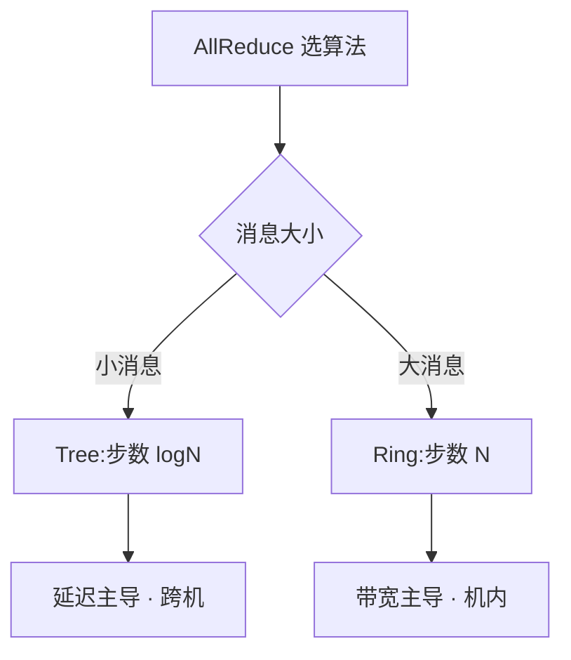

# 集合通信

> 🔴 重点考点:本篇是当前复习重点,文末「面试考点串联」给出问法对照。

一句话:集合通信是**一组 GPU 按约定好的模式一起搬数据**的那几个标准算子——多卡训练里除了算矩阵乘,剩下的时间基本都花在这里。本篇讲算子语义、Ring/Tree 两套算法、通信量怎么估、怎么和计算重叠、以及什么会让它变慢;各并行策略的取舍见 并行策略 篇,链路与组网见 GPU互联与组网 篇,库的实现与调参见 NCCL 篇。

## 一、七个算子:语义、形状,以及那条恒等式

约定:$N$ 张卡(rank 0…N−1),每张卡手上的缓冲区是 $S$ 字节。

| 算子 | 一句人话 | 输入(每卡) | 输出(每卡) |
|---|---|---|---|
| **Broadcast** | root 的一份数据,原样发给所有人 | 只有 root 有 $S$ | 都是 $S$,内容相同 |
| **Reduce** | 所有人的数据按元素相加(或 max/min),结果只给 root | $S$ | 只有 root 得到 $S$ |
| **AllReduce** | 按元素相加,**人人都拿到**结果 | $S$ | $S$,内容相同 |
| **AllGather** | 每人手上一小块,拼成完整一份,**人人一份** | $S/N$ | $S$(拼接,人人相同) |
| **ReduceScatter** | 按元素相加,结果**切成 $N$ 份各拿一份** | $S$ | $S/N$(各不相同) |
| **All2All** | 人人给人人寄一份**不同**的东西,相当于矩阵转置 | $S$(切成 $N$ 段) | $S$(重组后) |
| **P2P(Send/Recv)** | 一对一点对点,不是集合操作,但常和它们混用 | 发端 $S$ | 收端 $S$ |

区分要点只有两条:**名字带 All 的,结果人人都有;带 Scatter/Gather 的,那一侧的形状会被 $N$ 除或乘。** All2All 是唯一一个「每对 rank 之间的数据都不一样」的算子——正因为数据各不相同,它**没法在中间节点做合并**,这是它后面所有麻烦的根源。

### 恒等式:AllReduce = ReduceScatter + AllGather

这一条是本篇后面所有内容的根:

$$
\text{AllReduce}(S) \;\equiv\; \text{ReduceScatter}(S) \;\rightarrow\; \text{AllGather}(S/N)
$$

读法:先把 $S$ 字节的向量按下标切成 $N$ 段,**每张卡只负责把其中一段的 $N$ 份加起来**(ReduceScatter,做完每卡手上有 $S/N$ 的最终结果);再把每卡手上那一段发给所有人拼齐(AllGather)。两步做完,人人拿到完整的规约结果——和直接 AllReduce 完全等价。为什么值得单独立一条:

- **Ring AllReduce 就是这两步各绕环转一圈**(第二节)
- **总线带宽的修正系数 $2(N-1)/N$ 就是这两步各 $(N-1)/N$ 相加**(第四节)
- **ZeRO 省显存靠的就是把它拆开**:既然 ReduceScatter 之后每卡只需要自己那 $1/N$ 段梯度,那优化器状态也只存 $1/N$ 就够了(见 ZeRO 篇)
- **Megatron 的 SP 也靠拆它**:把两步分别放到张量并行区的两侧,总通信量一分不涨(见 并行策略 篇)

## 二、Ring:为什么通信量与卡数几乎无关

### 走法:把数据切成 N 块,绕两圈

$N$ 张卡围成一个环,每张卡**只跟左右两个邻居通信**:同时向右邻发、从左邻收(链路全双工,收发互不挤占)。把每卡的 $S$ 字节切成 $N$ 个大小为 $S/N$ 的分块。

阶段一 ReduceScatter,转 $N-1$ 步,**边传边加**(下标都取模 $N$):

| 步 | 卡 $i$ 发出 | 卡 $i$ 收下并累加到 | 这块此时攒了几份 |
|---|---|---|---|
| 1 | 第 $i$ 块 | 第 $i-1$ 块 | 2 |
| 2 | 第 $i-1$ 块 | 第 $i-2$ 块 | 3 |
| … | … | … | … |
| $N-1$ | 第 $i-N+2$ 块 | 第 $i-N+1$ 块 | $N$(齐了) |

读法:每一步每卡只发一个 $S/N$ 的分块、只收一个分块加到自己身上。转满 $N-1$ 步后,卡 $i$ 手上的第 $i+1$ 块已经累加了全部 $N$ 张卡的贡献,而且**各卡负责的分块正好互不相同**——这就是 ReduceScatter 的输出。

阶段二 AllGather,再转 $N-1$ 步,这次**只覆盖不累加**:每卡把自己那块已完成的结果沿环传下去,$N-1$ 步后每卡集齐全部 $N$ 块。

### 通信量:$2(N-1)/N \times S$ 是怎么来的

两个阶段各 $N-1$ 步,共 $2(N-1)$ 步;每步每卡发出一个 $S/N$ 的分块:

$$
V_{\text{每卡}} \;=\; 2(N-1)\times\frac{S}{N} \;=\; \frac{2(N-1)}{N}\,S
$$

人话:**每张卡一共要往外发大约 2 倍于数据量的字节。** $N$ 从 8 涨到 1024,系数从 1.75 只涨到 1.998——**加卡不会让单卡的发送量变多**,上限死死卡在 $2S$。这就是「与卡数几乎无关」的确切含义:说的是**每卡通信量**,不是总时间。

这也是「带宽最优(bandwidth-optimal)」的意思。下界很好想:ReduceScatter 里每张卡最终只保留 $1/N$ 的结果,剩下 $(N-1)/N$ 的贡献必须发出去;AllGather 里每张卡缺 $(N-1)/N$ 的内容,必须收进来。两段加起来就是 $2(N-1)/N$,**Ring 恰好打到这个下界,一个字节都不浪费**。

### 死穴:延迟项随卡数线性增长

把每步的固定开销(kernel 启动 + 一跳的链路延迟)记作 $\alpha$,单卡出向带宽记作 $B$:

$$
T_{\text{ring}} \;=\; 2(N-1)\left(\alpha + \frac{S}{N B}\right) \;=\; \underbrace{2(N-1)\alpha}_{\text{延迟项}} + \underbrace{\frac{2(N-1)}{N}\cdot\frac{S}{B}}_{\text{带宽项}}
$$

人话:右边第二项(带宽项)随 $N$ 增大趋于常数 $2S/B$,很健康;但**第一项随 $N$ 线性涨**,而且每一步都要重付一次 $\alpha$。1024 张卡就是 2046 步,哪怕每步只有几微秒,光延迟也累到毫秒量级。所以 **Ring 是「大消息、中等规模」的最优解,不是万能解**。

> 🖼️ 占位:4 卡 Ring AllReduce 的分块流转图——上半 ReduceScatter 三步、下半 AllGather 三步,每格标注该卡该分块已累加了几份贡献

## 三、Tree:用 $O(\log N)$ 的步数换延迟

### 一棵树:步数掉到对数,但带宽用不满

把 $N$ 个 rank 组织成一棵二叉树,数据顺着树往上规约(Reduce)、再顺着树往下广播(Broadcast),AllReduce 就是这一上一下:

$$
T_{\text{tree}} \;\approx\; 2\log_2 N\left(\alpha + \frac{S}{B}\right)
$$

人话:步数从 Ring 的 $2(N-1)$ 掉到 $2\log_2 N$——1024 卡时是 20 步对 2046 步,**延迟项差两个数量级**。代价写在括号里:每步传的是**整个 $S$**,不再是 $S/N$,带宽项不被卡数摊薄了。

单棵树的带宽还有个结构性浪费:树里**一半的节点是叶子**,广播时它们只收不发、规约时只发不收,一半的链路方向闲着;而内部节点要同时喂两个孩子,出向带宽被劈成两半。**朴素二叉树的有效带宽大约只有峰值的一半。**

### 双二叉树:把带宽补回来

NCCL 从 2.4 起用的是**双二叉树**(出处是 Sanders/Speck/Träff 2009):构造两棵互补的树,让**每个节点在一棵树里当叶子、在另一棵树里当内部节点**,两棵树各跑一半数据。这样每个节点的收发负载被摊平,**在保住 $\log N$ 步数的同时把带宽利用率补回来**。NVIDIA 报告在 Summit 上用它把 24k GPU 规模的 AllReduce 提速到原来的百倍量级。

所以「Tree 带宽利用率低」这句话要说准确:**是单棵朴素树低,双二叉树已经补回来了**。真正决定选谁的判据是下面这条。

### 选择判据:消息大小

- **小消息**:$S/B$ 小到可以忽略,总时间 ≈ 步数 × $\alpha$ → **步数少的赢,选 Tree**
- **大消息**:$\alpha$ 可以忽略,总时间 ≈ 传输量 / $B$ → **每卡发送量少的赢,选 Ring**

交叉点的具体字节数取决于 $\alpha$、$B$ 和 $N$($N$ 越大、$\alpha$ 越大,交叉点越往右挪,Tree 的适用区间越宽),实际由通信库在初始化时按实测拓扑用代价模型自动选。**面试要答的不是那个数,是「判据是消息大小,机制是延迟项与带宽项谁主导」。**

> 🖼️ 占位:同一张图上画 Ring 与 Tree 的耗时随消息大小变化的两条曲线,横轴对数刻度,标出交叉点与两侧各自主导的项

### 拓扑为什么也跟着分工

只讲形状的匹配关系,具体带宽数字与组网见 GPU互联与组网 篇。**Ring 要的是「每个节点只跟两个邻居说话」**:节点内的全连接互联域天然能连出环,还能同时开多条互不重叠的环把链路一起吃满,所以机内大消息首选 Ring。**树形结构则天然对齐分层链路**:跨机时「机内快、机间慢、还要过交换机」,树可以先在机内规约成一份、再让每机一个代表在机间走树,把慢链路上的流量压到最少——大规模跨机的小消息几乎必然走树。还有第三类做法是把规约直接卸载进交换机(在网聚合),它跳出了「数据只在 GPU 之间流动」的假设,下一节的换算系数对它不成立。

## 四、算法带宽 vs 总线带宽

这两个概念面试爱问,区别其实只有一句:**一个是给你估时间的,一个是给你判断硬件用得好不好的。**

**算法带宽(algbw)= 数据量 / 时间**,这里的「数据量」就是你传进 API 的那个 buffer 大小 $S$。它的用途很直接:拿它去除任何一次同类操作的大小,就得到耗时估计。

但它**没法横向比较**。同样 1 GB 的 buffer:AllReduce 每卡实际要在链路上搬约 2 GB,AllGather 只搬约 1 GB,Broadcast 更少。算法带宽相同,不代表硬件被用得一样好;换个卡数,同一个算子的算法带宽也会变。

**总线带宽(busbw)= 算法带宽 × 修正系数**,系数就是「每字节输入数据在链路上真正跑出多少字节流量」:

$$
\text{busbw} = \text{algbw}\times f,\quad f_{\text{AllReduce}}=\frac{2(N-1)}{N},\quad f_{\text{AllGather}}=f_{\text{ReduceScatter}}=f_{\text{All2All}}=\frac{N-1}{N},\quad f_{\text{Bcast}}=f_{\text{Reduce}}=1
$$

人话:把「用户视角的数据量」换算成「链路上真实的字节数」。换算之后,不同算子、不同卡数的结果才能互相比,也才能**和硬件标称的单向链路带宽放在一起看**。注意 AllReduce 的系数正好是第一节那条恒等式的两段 $(N-1)/N$ 相加,ReduceScatter 和 AllGather 各占一半——这不是巧合。

一个例子:8 卡跑 1 GB 的 AllReduce 花了 100 ms。algbw $= 1/0.1 = 10$ GB/s;busbw $= 10\times\frac{2\times7}{8} = 17.5$ GB/s。要判断硬件有没有跑满,拿 17.5 去和链路标称值比,不是拿 10。两条实用推论:**busbw 明显低于标称** → 链路没打满,往消息太小、通道数不够、rank 与物理拓扑错位这几个方向查(见第七节);**busbw 接近甚至超过标称** → 多半是在网聚合或分层聚合在起作用,「每字节输入产生 $f$ 字节链路流量」这个前提已被打破,不能再当链路利用率读。

## 五、通信量对照:哪个并行用哪个算子

只做「算子 ↔ 通信量」的对照,**各并行是什么、怎么选、怎么摆,一律见 并行策略 篇**。记号:$P$ = 参数(梯度)字节数,$b$/$s$/$h$ = batch/序列长/隐藏维,组内卡数记 $N$。

| 场景 | 用什么算子 | 每卡通信量(单次) | 频率 |
|---|---|---|---|
| DP 梯度同步 | AllReduce | $\frac{2(N-1)}{N}P \approx 2P$ | 每 step 一次 |
| ZeRO-1 / ZeRO-2 | ReduceScatter(梯度)+ AllGather(更新后参数) | 两段各 $\frac{N-1}{N}P$,**合计与 DP 持平** | 每 step 一次 |
| ZeRO-3 / FSDP | 前向 AllGather 参数 + 反向 AllGather 参数 + ReduceScatter 梯度 | 约 $3\times\frac{N-1}{N}P$,即 DP 的 **1.5 倍** | 每层都有 |
| TP 激活同步 | AllReduce | $\frac{2(N-1)}{N}\times(b\,s\,h\times 2\ \text{字节})$ | 每层前向 2 次、反向 2 次 |
| TP + SP | ReduceScatter + AllGather | 拆成两半,**总量与纯 TP 持平** | 同上 |
| PP 段边界 | P2P Send/Recv | 一份 $b\,s\,h$,**不被 $N$ 放大** | 每 micro-batch 过一次界 |
| EP 的 dispatch / combine | All2All ×2 | 约 $\frac{N-1}{N}\times(\text{本地 token 数}\times k\times h\times 2\ \text{字节})$ | 每个 MoE 层,反向再来两次 |
| CP(Ring Attention) | 环形 P2P 传 K/V 分块 | 每步一个 K/V 分块 | 每层 |

两条读表要点:**只有 P2P 不带放大系数**——它压根不是集合操作,一次只在两个 rank 之间传一份,这是 PP 通信最省的根本原因;**ZeRO-1/2 不额外花通信**,因为它做的正是把那条恒等式拆开,而 ZeRO-3 多出来的 0.5 倍买的是「参数也不用整份存」(三个 stage 的细节见 ZeRO 篇)。

### all-to-all 为什么对延迟特别敏感

这是 all-to-all **算子本身**的性质(MoE 里怎么用、dispatch 怎么做、负载不均怎么治,见 MoE并行与DeepEP 篇):

- **流的条数是 $N^2$ 量级**。Ring/Tree 每卡只跟两三个邻居打交道,流量可以顺着拓扑排布;all-to-all 同时有 $N(N-1)$ 条流在网里,**任何一条链路被打爆,整个算子就卡在那里等**
- **消息天生就碎**。每卡发出去的 $S$ 要拆给 $N-1$ 个对端,单条消息只有 $S/N$ 量级——**卡数越多单条消息越小**,越容易掉进「小消息打不满带宽、时间全花在 $\alpha$ 上」的区间
- **没有压缩空间**。AllReduce 可以在中间节点把多份数据加成一份,越往上流量越小;all-to-all 的每份数据都是给特定对端的,**中间节点合并不了**,总量降不下来

## 六、通信与计算 overlap

### 为什么能重叠:不是同一套硬件

跑通信和跑计算的硬件是分开的:数据搬运由链路和 DMA 引擎完成,矩阵乘在 SM 上算,物理上可以同时发生。stream、event、同步点这些基础语义见 CUDA流与异步执行 篇,本节只讲「通信怎么跟计算并起来」。

### 怎么重叠:四个手段

1. **独立 stream**。通信下发到一条专用的通信流,计算留在计算流,用 event 表达真实依赖——千万别用全局 sync 把两条流拉平,那等于把重叠机会清零
2. **梯度分桶(bucket)**。反向传播是**从最后一层往前算**的,最后一层的梯度最先出来,不必等整个反向结束再一次性同步。把参数按反向完成的顺序攒成若干个桶(常见量级几十 MB 一桶),**桶一满就立刻发起这个桶的 AllReduce,反向继续往前算**——这是 PyTorch DDP 的标准做法
3. **prefetch(提前取)**。ZeRO-3 / FSDP 这类「参数用之前才凑齐」的方案里,算第 $k$ 层时就把第 $k+1$ 层参数的 AllGather 发出去,让取参数的通信藏在第 $k$ 层的计算底下
4. **切块流水**。把一对通信-计算依赖切成若干小块,第 $j$ 块通信完就开始算第 $j$ 块;再激进一点是把通信直接融进 GEMM kernel(思路与 算子融合 篇同源,代表工作见文末的 CoCoNet 与 FLUX)

桶大小是个典型的跷跷板:**太小**——消息碎、每次都被 $\alpha$ 和小消息带宽利用率吃掉;**太大**——攒桶期间通信引擎干等,而且最后一个桶来不及藏。桶的划分顺序还必须和反向顺序对齐,因为**桶里只要有一个参数的梯度没算完,整桶就发不出去**。

### 什么时候重叠不了

- **通信在关键路径上**。TP 的激活 AllReduce 是「算完这半、对完账、才能算下一步」,后面的计算严格依赖通信结果,**没有独立的活可以填进去**
- **依赖链锁死**。反向最后发出的那个桶(模型最前面几层的梯度)算完时反向也结束了,它后面没有计算可以掩盖,这一段通信必然裸露在关键路径上
- **压根没有可重叠的计算**。小 batch 的 decode 阶段本身计算量就少,藏无可藏
- 判据一句话:**能藏多少,取决于通信进行期间还剩多少与它无关的计算可做**;理想上限是 $\max(\text{总通信}, \text{总计算})$,和分块传输的上限是同一条

### overlap 不是免费的

1. **通信 kernel 也占 SM**。通信库是用 CUDA kernel 实现的:每条「通道(channel)」对应一个 thread block,而通信 kernel 寄存器用量大、一个 SM 上通常只驻留一个块——**开几条通道就等于几个 SM 被通信占走**,你的 GEMM 只能用剩下的。NCCL 官方文档写得很直白:减少通道数会减少通信用掉的 CUDA block,从而减少对 GPU 算力的影响。所以重叠的真相是「**计算慢一点,换通信被藏起来**」,净收益要实测
2. **争抢显存带宽**。通信 kernel 同样要读写 HBM。对本来就访存受限的算子(判据见 Roofline与Bound分析 篇),重叠之后两边一起变慢

于是就有了那个常见现象:**打开 overlap 之后单步时间没降反升**。这时该调的是通道数、桶大小这类旋钮(具体参数见 NCCL 篇),而不是回头放弃重叠。这也是下一节「和计算抢资源」那条的来源。

## 七、什么会让集合通信变慢

1. **落后者效应(straggler)**。集合通信是同步的:**全组到齐才能开始,最慢的一张卡决定整组的完成时间**。一张卡因为散热降频、ECC 修复、或者被别的进程抢了 SM 而慢 10%,整个通信器就慢 10%,而且这笔账每一步都要重付一次。最难的是它**不报错**——卡还在工作,监控上一切正常。Llama 3 的技术报告点名了这个问题:一张还能跑但变慢的卡会拖慢其余几千张。查法是看各 rank 进入集合通信的时间戳分布:长期落在同一个 rank 上多半是硬件问题,每步换人则更像负载不均
2. **负载不均**。各卡实际算的活不一样多,先算完的在通信里干等。常见来源:PP 各 stage 的层数或算子量不等、MoE 热门专家挤爆(见 MoE并行与DeepEP 篇)、变长序列没做好 packing、causal mask 下按序列切分时靠前的卡天然活少
3. **拓扑不匹配**。rank 的编号顺序和物理链路对不上,本该走机内快链的相邻 rank 被排到了两台机器上,环被迫反复跨机——通信量一点没变,时间翻几倍(见 GPU互联与组网 篇)
4. **小消息太多**。每次通信都要付固定的启动开销,消息小到一定程度链路根本没被打满,时间几乎全花在 $\alpha$ 上。典型症状就是第四节说的 busbw 远低于标称值。对策是**合并**:梯度分桶、把多个小 AllReduce 攒成一个。注意这和「分桶为了 overlap」是同一个旋钮的两个方向——桶大利于打满带宽,桶小利于重叠,只能折中
5. **和计算抢资源**。通信 kernel 占走的 SM 和显存带宽,见上一节的两条代价

## 八、面试考点串联

| 高频问法 | 本文哪一节 |
| --- | --- |
| AllReduce、AllGather、ReduceScatter 各是干什么的?AllReduce 能拆成另外两个吗? | 一(语义表 + 恒等式) |
| Ring AllReduce 是怎么走的?为什么说它的通信量跟卡数几乎无关? | 二(分块绕两圈;$2(N-1)/N \to 2$) |
| 为什么说 Ring 是带宽最优的?加卡之后每张卡要发的量会涨吗? | 二(下界推导:发 $(N-1)/N$ + 收 $(N-1)/N$) |
| 卡特别多的时候 Ring 会有什么问题?怎么办? | 二(延迟项 $2(N-1)\alpha$ 线性涨)+ 三 |
| Ring 和 Tree 怎么选?判据是什么? | 三(消息大小:延迟项 vs 带宽项谁主导) |
| 树形算法的带宽为什么用不满?双二叉树是怎么补回来的? | 三(叶子只收不发;两棵互补树摊平负载) |
| 算法带宽和总线带宽有什么区别?为什么要有总线带宽这个说法? | 四(前者估时间,后者才能横向比、对标称值) |
| 测出来 busbw 只有硬件标称的一半,你会怀疑什么? | 四 + 七(消息太小 / 通道不够 / 拓扑错位) |
| DP 的梯度同步用什么算子?通信量大概多少?ZeRO 会让它变多吗? | 五(≈$2P$;ZeRO-1/2 持平、ZeRO-3 是 1.5 倍) |
| all-to-all 为什么比 AllReduce 难扛?它为什么对延迟更敏感? | 五($N^2$ 条流、消息天生碎、中间节点合并不了) |
| 对应通信算子一般怎么做优化?dp、tp、ep 分别怎么做通信计算 overlap? | 六(硬件分离;独立流 / 分桶 / prefetch / 切块;stream 本身见 CUDA流与异步执行 篇) |
| DDP 的梯度分桶是怎么回事?桶开大开小分别有什么影响? | 六(反向顺序攒桶;大桶打满带宽、小桶利于重叠) |
| 什么情况下通信藏不住? | 六(在关键路径上 / 依赖链锁死 / 没有计算可藏) |
| 开了 overlap 之后反而更慢,可能是什么原因? | 六(通信 kernel 占 SM、抢显存带宽) |
| 训练突然慢了一截,但每张卡看着都正常,你怎么查? | 七(straggler:看各 rank 进入通信的时间戳分布) |
| 通信量不大但通信时间很长,可能是什么问题? | 七(小消息没打满带宽 / 拓扑不匹配) |

延伸阅读顺序:并行策略(各并行是什么、怎么选)→ 本篇(算子与算法)→ GPU互联与组网(链路与拓扑)→ MoE并行与DeepEP(all-to-all 的重灾区)→ NCCL(库的实现与调参)。

## 相关文献

- Bringing HPC Techniques to Deep Learning(Baidu 把 ring allreduce 带进深度学习的原文)— https://andrew.gibiansky.com/blog/machine-learning/baidu-allreduce/
- nccl-tests 性能文档(算法带宽 / 总线带宽的定义与逐算子修正系数)— https://github.com/NVIDIA/nccl-tests/blob/master/doc/PERFORMANCE.md
- Massively Scale Your Deep Learning Training with NCCL 2.4(双二叉树的工程说明与大规模实测)— https://developer.nvidia.com/blog/massively-scale-deep-learning-training-nccl-2-4/
- Two-Tree Algorithms for Full Bandwidth Broadcast, Reduction and Scan(双二叉树的原始论文,Parallel Computing 35(12):581–594, 2009)— https://doi.org/10.1016/j.parco.2009.09.001
- Optimization of Collective Communication Operations in MPICH(按消息大小切换算法的经典依据,IJHPCA 19(1):49–66, 2005)— https://fs.hlrs.de/projects/rabenseifner/publ/HPCA_collectives.pdf
- Demystifying NCCL: An In-depth Analysis of GPU Communication Protocols and Algorithms — [arXiv:2507.04786](https://arxiv.org/abs/2507.04786)
- PyTorch Distributed: Experiences on Accelerating Data Parallel Training(梯度分桶与反向重叠的出处)— [arXiv:2006.15704](https://arxiv.org/abs/2006.15704)
- Horovod: fast and easy distributed deep learning in TensorFlow(ring reduction 在框架侧的落地)— [arXiv:1802.05799](https://arxiv.org/abs/1802.05799)
- Breaking the Computation and Communication Abstraction Barrier in Distributed Machine Learning Workloads(CoCoNet:把通信与计算一起编译优化)— [arXiv:2105.05720](https://arxiv.org/abs/2105.05720)
- FLUX: Fast Software-based Communication Overlap On GPUs Through Kernel Fusion — [arXiv:2406.06858](https://arxiv.org/abs/2406.06858)
- The Llama 3 Herd of Models(万卡规模下 straggler 与通信可观测性的一手记述)— [arXiv:2407.21783](https://arxiv.org/abs/2407.21783)
- NCCL 用户指南 — Environment Variables(通道数与 CUDA block / 算力占用的关系)— https://docs.nvidia.com/deeplearning/nccl/user-guide/docs/env.html
