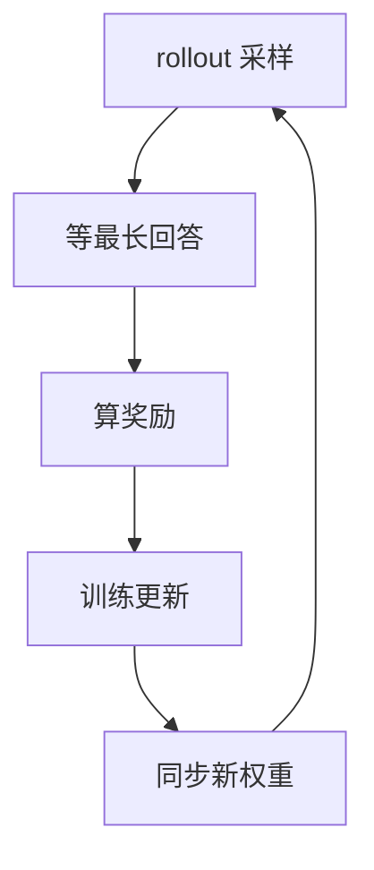

# AReaL

一句话:AReaL 是一套把大模型强化学习的**生成、训练与 Agent 执行解耦**的系统,它用全异步流水线消掉长尾 rollout 造成的等待,再用陈旧度控制和离策修正管住由此引入的学习偏差。

> **对象类型**:动态对象
>
> **动态状态卡**
> - **最近核对**:2026-09-08
> - **核对范围**:`v2.0.0` 是 GitHub 标记的 Latest release(2026-07-01);`main` 是持续演进线,不等于稳定版承诺。
> - **稳定定位**:面向长推理与 Agentic RL 的全异步训练系统;系统层负责让 rollout 与参数更新并行,不代替 PPO / GRPO 等算法。
> - **当前状态**:2.0 已发布训练、推理、Agent、权重更新的微服务边界及 Hermes / SWE 端到端示例;2026 Q2 路线图仍把部分权重传输、可观测性和文档工作列为进行中,选型固定版本时需复验。
> - **一手来源**:[官方仓库](https://github.com/areal-project/AReaL)、[Releases](https://github.com/areal-project/AReaL/releases)、[异步 RL 文档](https://areal-ai.io/AReaL/en/algorithms/async.html)、[Agentic RL 文档](https://areal-ai.io/AReaL/en/tutorial/agentic_rl.html)、[路线图](https://github.com/areal-project/AReaL/blob/main/ROADMAP.md)

本篇只讲稳定问题、架构与取舍。PPO / GRPO 的算法原理见 PPO 篇与 GRPO 篇;多家框架的横向选型见 RL框架对比 篇;源码层组件与调用链不属于本篇。

## 一、它先解决一个“等最慢者”问题

同步 RL 的一轮看起来很干净:采样一批回答,全部生成完再训练,训练完再更新推理引擎。问题是,自回归生成的长度差异可以极大:**整批的完成时间由最长的那条回答决定**。

这不只是 padding 浪费。短回答所在的生成 worker 已经空了,但不能去做下一批;训练 GPU 又必须等整批凑齐。等训练开始后,生成侧反过来停工。长思维链、工具调用和多轮环境都会把这种长尾放大。

加大 batch 只能提高平均吞吐,还可能增加遇到极长样本的概率;只做长度分组能缓解批内差异,但无法消掉“采样期间训练卡必须等”这道阶段栅栏。AReaL 的根本选择是拆掉栅栏。

## 二、全异步主干:两边持续跑

AReaL 把生成和训练放到分离的资源池。生成侧持续产出轨迹,训练侧凑到可用数据就更新,中间由有界的数据流衔接。“全异步”的重点不是多开几个线程,而是**两个资源池不再以每轮为单位相互等待**。

这种分离有三个直接收益:

- **隐藏长尾**:某条轨迹还在跑时,训练侧可以消费已完成的轨迹;快 worker 也可以立即接新任务。
- **分别适配资源**:生成偏爱更大 KV cache 和高并发,训练要容纳梯度与优化器状态;分池后两边可以用不同的并行布局。
- **独立伸缩**:环境或生成变慢时增加 rollout 容量,反向计算变成瓶颈时增加训练容量。

代价也是结构性的:**训练消费到的数据可能由旧版策略生成**。同步系统把成本花在等待上;全异步系统把这笔成本换成了陈旧度、权重传输和流控复杂度。

### 资源比例不能照搬

生成池和训练池的最佳比例取决于回答长度、采样数、模型大小、训练并行度、环境延迟和权重更新成本。生成队列持续增长,说明 rollout 供给跟不上;轨迹越堆越旧,则说明生成过量或训练吞吐不足。应根据实际流量闭环调整,而不是背一个固定分卡比。

## 三、可中断 rollout:收回空泡,但改了数据分布

只把两边并行起来还不够。新权重就绪时,推理侧可能正在生成一条很长的回答。如果必须等它自然结束才更新,最慢轨迹又变成了隐藏的栅栏。

AReaL 论文的做法是**允许打断在途生成,换到新策略后再继续**。这叫可中断或 partial rollout。它让权重更新不必等最长请求,却带来两层离策问题:

| 问题 | 直觉 | 为什么危险 |
| --- | --- | --- |
| **批间陈旧** | 整条轨迹来自几步之前的策略 | 当前策略已移动,旧数据的梯度会越来越偏 |
| **轨迹内混版本** | 一条回答的不同片段由不同版本生成 | 标准 PPO 默认整条样本来自同一个旧策略 |

所以,可中断不是免费的调度优化。它实际上修改了“这条轨迹是怎样采出来的”,损失函数必须知道真正的行为策略,系统也必须保留足够的版本和概率证据。

## 四、陈旧度与离策修正:快与稳的两道闸

### 第一道闸:限制数据能旧到什么程度

陈旧度可以理解为:生成样本的策略版本,落后于当前训练版本多少步。上限为 0 时回到同步、近于 on-policy 的基线;放宽上限能增加重叠,但也会让训练数据与当前策略越离越远。

有限队列和背压很重要。若生成无限快地往队列里塞,训练就会消费越来越旧的轨迹;表面 GPU 利用率很高,实际上学习信号正在变质。**让生成稍微领先是提吞吐,让它无界领先则是失控。**

### 第二道闸:把“谁产生数据”与“更新围绕谁”分开

标准 PPO 在同步情况下可以把旧策略同时当作“行为数据的生成者”和“限制新策略别走太远的中心”,因为两者恰好是同一个版本。异步后这个巧合消失了。

AReaL 用解耦的 PPO 目标区分三个角色:

| 角色 | 负责什么 |
| --- | --- |
| **行为策略** | 真正生成这些 token,可能是多个版本片段的组合 |
| **近端策略** | 作为策略更新的参考中心,承担 PPO 的信任域语义 |
| **当前策略** | 正在学习、即将被更新的模型 |

这种分工能让混合版本轨迹的目标重新定义清楚,但**修正不能消灭任意程度的离策偏差**。重要性比率会高方差,无界陈旧仍可能损害收敛;新算法也可能与该目标不兼容。因此正确策略是“有界陈旧 + 配套修正 + 持续监控”,而不是只打开异步开关。

## 五、AReaL 2.0:从训练库走向服务边界

2026-07-01 发布的 AReaL 2.0 将系统重组为四类独立服务。这不只是拆进程,而是把“谁拥有什么状态、通过什么契约交付”说清楚:

| 服务边界 | 稳定职责 | 不应越界的事 |
| --- | --- | --- |
| **训练服务** | 消费带奖励的轨迹,计算更新并产出新权重 | 不承担业务 Agent 的对话与工具编排 |
| **推理服务** | 为 rollout 提供模型调用,保留训练需要的 token 级证据 | 不决定奖励语义和 Agent 任务成功标准 |
| **Agent 服务** | 管理会话、多轮交互、工具使用及可插拔 Agent 运行时 | 不需要知道训练引擎如何切分参数 |
| **权重更新服务** | 把训练侧新版本安全、可识别地送到推理侧 | 不参与算法上的优势或奖励计算 |

边界拆开后,每一侧可以独立部署和伸缩,也便于把已存在的 Agent 运行时接进来。但分布式失败面也更大:权重版本与轨迹版本必须能对账,重试不能重复计奖励,会话结束、轨迹导出和训练消费之间需要明确语义。

还要区分**已发布架构**与**已验证的生产成熟度**。`v2.0.0` 和官方示例证明这些边界已存在;路线图同时表明若干可观测性、传输和文档项仍在进化。它们不能被一句“2.0 已发布”自动推导为已通过所有生产环境验收。

## 六、Agent 与黑盒应用如何接入

AReaL 支持两种稳定的集成思路:

| 方式 | 适合谁 | 系统必须看到什么 |
| --- | --- | --- |
| **框架内 workflow** | 愿意把采样逻辑交给训练框架并行调度的研究代码 | 每次模型交互、轨迹边界、奖励和可训练 mask |
| **在线代理** | 已有 Agent 运行时、第三方服务或人类反馈链路 | 所有待训练模型调用都经过兼容网关,并有可追踪的会话与奖励 |

“黑盒”指的是:AReaL 不必理解 Agent 内部用了哪种规划循环、记忆库或工具框架;已有应用通常只需要把模型调用指向 OpenAI 兼容的代理接口。代理把模型调用还原成 token 级训练证据,并与会话奖励关联。

但黑盒不等于零契约:

- Agent 如果偷偷绕过代理直连另一个模型,那部分动作就没有可训练的概率证据。
- 系统仍需要知道一个 episode 何时结束、奖励属于哪条轨迹、工具返回是环境 token 还是模型动作。
- 真实工具会产生副作用,必须有隔离环境、权限边界、预算、超时与可重放状态;这些是 AgenticRL 系统安全的前提,不是代理协议自动解决的。
- 在线交互数据可能含敏感信息,必须先做授权、脱敏、保留期限与删除策略,才能把它当作学习基质。

AReaL 2.0 的 Hermes 与 SWE 示例证明了线路可以连通,不能单独证明某个外部 Agent 的奖励定义、安全治理或收敛性已经正确。

## 七、什么时候适合,什么时候不适合

| 场景 | 判断 | 原因 |
| --- | --- | --- |
| 长思维链、长短差极大 | **适合** | 有足够的生成长尾可以被训练重叠隐藏 |
| 多轮工具与异步环境 | **适合** | 不同 episode 耗时悬殊,细粒度轨迹流比整批栅栏更自然 |
| 已有外部 Agent 应用要转在线 RL | **有条件适合** | 兼容代理降低改造量,但仍要补齐奖励、会话与数据治理契约 |
| 生成不是瓶颈、回答都很短 | **通常不划算** | 无事可隐藏,分池反而会造成资源碎片和权重传输开销 |
| GPU 很少,训练与推理无法同时驻留 | **通常不划算** | 全异步要求两边真正并行;小集群可能更适合共卡分时的同步系统 |
| 必须严格 on-policy 复现 | **不应强上异步** | 陈旧度与混版本轨迹改变了数据语义;应先回到零陈旧基线 |
| 新损失或算法未验证异步兼容性 | **先不用全异步** | 系统能跑不代表目标函数在离策数据上仍然正确 |

一个实用决策顺序是:先用同步基线证明奖励和算法能学;再测量 rollout 是否占主要墙钟时间;然后小幅放宽陈旧度;最后才是调资源比例。这样可以把“算法不学”与“系统没喂饱”分开。

## 八、验收不能只看 GPU 利用率

全异步系统容易产生一个假象:GPU 都很忙,所以系统一定更好。真正验收至少要分四层:

| 层 | 要看什么 | 防止什么误判 |
| --- | --- | --- |
| **连通性** | 轨迹、奖励、版本和权重更新能否对账 | “服务都活着”被误当成训练闭环正确 |
| **系统效率** | 生成/训练吞吐、队列深度、两池空闲率、更新时延 | 只看平均 GPU 利用率遮住某个阶段拥堵 |
| **离策风险** | 陈旧度分布、重要性比率、裁剪/拒绝比例、中断与废弃率 | 吞吐上升其实是靠吞入大量失真旧数据 |
| **学习与任务** | 奖励/KL、固定评测集、任务成功率、步数、成本和安全违规 | “每秒训得更多”被误当成“模型学得更好” |

官方 AReaL 论文报告了显著的异步吞吐收益,但这些数字是项目方在特定模型、上下文、集群与基线上的自报结果,不是独立第三方证据,也不能与别家论文的加速比直接横比。对自己的负载,应用同 GPU 预算、同数据、同训练目标的同步基线重做对照。

## 面试考点串联

| 高频问法 | 本文哪一节 |
| --- | --- |
| **补充题**:AReaL 想解决什么问题?同步 RL 为什么会被最长 rollout 拖住? | 一 |
| **补充题**:“全异步”与普通并发有什么不同?它换来了什么、付出了什么? | 二 |
| **补充题**:为什么新权重到了要打断长 rollout?这会改变哪些训练假设? | 三 |
| **补充题**:异步 RL 里的陈旧度是什么?为什么不能无限放宽? | 四(第一道闸) |
| **补充题**:解耦 PPO 为什么要把行为策略和近端策略分开?这就能完全消除离策风险吗? | 四(第二道闸) |
| **补充题**:AReaL 2.0 为什么要拆成四类服务?各自的状态边界是什么? | 五 |
| **补充题**:一个已有黑盒 Agent 怎样接入在线 RL?为什么换了模型网关还不算完成? | 六 |
| **补充题**:什么负载最适合 AReaL?小集群或严格 on-policy 实验为什么可能不划算? | 七 |
| **补充题**:评估全异步 RL 为什么不能只看 GPU 利用率?你会分哪几层验收? | 八 |

> 题库中没有以 `AReaL` 为 topic 第一段的真题,所以上表均为补充题;后续若采到真题,应以真题为主重做覆盖验收。

## 相关文献

- AReaL: A Large-Scale Asynchronous Reinforcement Learning System for Language Reasoning — [arXiv:2505.24298](https://arxiv.org/abs/2505.24298)
- Next-Generation Agentic Reinforcement Learning Systems Enable Self-Evolving Agents(AReaL 2.0 的 Agent 在线 RL 定位) — [arXiv:2607.01120](https://arxiv.org/abs/2607.01120)
- AReaL 官方仓库 — https://github.com/areal-project/AReaL
- AReaL 官方发布页(`v2.0.0` 的微服务范围) — https://github.com/areal-project/AReaL/releases/tag/v2.0.0
- AReaL 异步 RL 官方文档 — https://areal-ai.io/AReaL/en/algorithms/async.html
- AReaL Agentic RL 官方文档 — https://areal-ai.io/AReaL/en/tutorial/agentic_rl.html
- AReaL 2.0 Hermes 在线 RL 示例 — https://github.com/areal-project/AReaL/tree/main/examples/hermes
- AReaL 2.0 SWE RL 示例 — https://github.com/areal-project/AReaL/tree/main/examples/swe
- AReaL 官方路线图(用于区分已发布与进行中能力) — https://github.com/areal-project/AReaL/blob/main/ROADMAP.md
