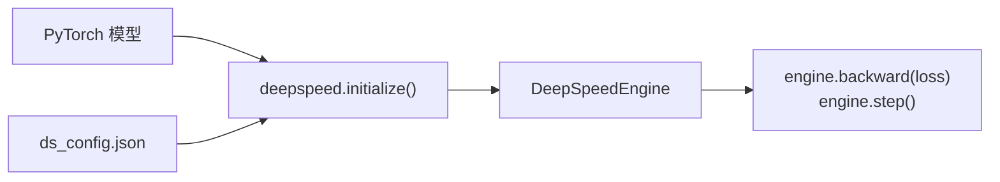

# DeepSpeed

一句话:**微软的大模型训练全家桶**——显存优化、offload、混合精度、流水线并行、MoE 训练一站式打包,核心竞争力不是发明了多少新算法,而是**把 ZeRO 系列论文做成了开箱即用的工程**:训练代码几乎不动,改一份 JSON 配置,单卡放不下的模型就能训起来。类比:PyTorch 给了你发动机,DeepSpeed 是整车厂,底盘、变速箱、涡轮增压都预装好,你只负责在配置单上打勾。

## 一、能力全景

DeepSpeed 的功能像自助餐,按需勾选,大多数能力可以互相叠加:

| 能力 | 解决什么问题 | 一句话说明 |
| --- | --- | --- |
| ZeRO Stage 1/2/3 | 数据并行时每卡都存全套训练状态,太浪费 | 把优化器状态 → 梯度 → 参数逐级切碎、像合租平摊房租一样分摊到各卡;原理详见 ZeRO 篇 |
| ZeRO-Offload | 显存不够,内存来凑 | 优化器状态与参数更新卸到 CPU,单卡也能训 10B 级模型 |
| ZeRO-Infinity | 内存也不够,硬盘来凑 | Stage 3 专属,进一步卸到 NVMe,把"显存墙"推到 TB 级 |
| 混合精度 | 算得快、存得省 | fp16(带 loss scaling)/ bf16(当前默认)/ fp8(需新硬件支持) |
| Activation checkpointing | 激活值吃掉大量显存 | 前向不存、反向重算,用约三分之一的额外前向计算换显存大头 |
| 流水线并行 | 单卡放不下一个完整副本 | `PipelineModule` 把层切段接力,需要改模型代码,实际用得比 ZeRO 少 |
| DeepSpeed-MoE | MoE 模型专家多、单卡装不下 | 专家并行 + 门控与通信优化,早期 MoE 训练的主力方案 |
| DeepSpeed-Inference / FastGen | 推理加速 | 存在但非主流,推理侧生态如今以 vLLM/SGLang 为主,一句带过 |

记忆锚点:**DeepSpeed 的主战场是训练侧显存工程**,ZeRO 数据并行是绝对主力,流水线与推理是配角。

## 二、使用形态:一份 JSON + 一个启动器

DeepSpeed 的哲学是「配置即能力」:能力全写在 `ds_config.json` 里,一段典型配置:

```json
{
  "train_micro_batch_size_per_gpu": 4,
  "gradient_accumulation_steps": 8,
  "bf16": { "enabled": true },
  "zero_optimization": {
    "stage": 2,
    "offload_optimizer": { "device": "cpu", "pin_memory": true }
  },
  "gradient_clipping": 1.0
}
```

逐项拆解:

- **train_micro_batch_size_per_gpu**:每卡一次前反向吃的样本数,显存占用主要由它决定;
- **gradient_accumulation_steps**:攒够几次 micro step 才更新一次参数,用时间换等效大 batch。三者关系 DS 会严格校验,对不上直接报错:

$$
\text{总 batch} = \text{每卡 micro batch} \times \text{梯度累积步数} \times \text{GPU 数}
$$

- **bf16.enabled**:启用 bf16 混合精度;若换 fp16 则多一套 loss scaling 机制,数值上更娇气;
- **zero_optimization.stage**:0=关、1=切优化器状态、2=再切梯度、3=再切参数,数字越大越省显存、通信越多(取舍详见 ZeRO 篇);
- **offload_optimizer.device**:优化器状态搬去 CPU 内存(`"cpu"`)或 NVMe(`"nvme"`),`pin_memory` 用锁页内存加速搬运;
- **gradient_clipping**:全局梯度范数裁剪,防梯度爆炸的保险丝。

启动方式用自带启动器替代 torchrun:

```bash
deepspeed --num_gpus=8 train.py --deepspeed ds_config.json
```

代码侧只有一处结构变化:`deepspeed.initialize` 把模型包成 engine,前反向与更新都改走它:



**与 HuggingFace 的集成**是它普及的最大功臣:

- **Trainer**:`TrainingArguments(deepspeed="ds_config.json")` 一行接入;配置里可写 `"auto"` 的字段(batch size、学习率、精度等)由 Trainer 按命令行参数自动填,避免两处配置打架;
- **Accelerate**:`accelerate config` 向导里选 DeepSpeed 插件,普通训练循环无感切换后端。

## 三、与 FSDP 怎么选

FSDP 是 PyTorch 原生的「ZeRO-3 同款思想」实现,与 DeepSpeed 是最高频的选型对比:

| 维度 | DeepSpeed | FSDP |
| --- | --- | --- |
| 出身 | 微软第三方库 | PyTorch 亲儿子(torch.distributed) |
| 成熟度 | 久经战阵(BLOOM、GLM-130B 等大模型用过) | FSDP2 已成熟,官方长期投入 |
| 易用性 | JSON 全家桶,字段多但文档全 | 纯 PyTorch API,与 torch.compile/DTensor 原生亲和 |
| HF 生态集成 | Trainer/Accelerate 一等公民 | 同为一等公民,新项目示例常以它为默认 |
| Offload 能力 | CPU + NVMe(Infinity),业界最强 | 只有 CPU offload,无 NVMe 级 |
| 调试体验 | 封装深、报错栈长、魔改成本高 | 贴近原生 tensor 语义,单步调试更透明 |

**经验法则**:纯 PyTorch 技术栈、想吃 torch 新特性,优先 FSDP;需要 **Infinity 级 offload(小显存硬训大模型)或 DeepSpeed-MoE 训练**,用 DeepSpeed;两边都被 HF 良好支持,迁移成本主要在配置而非代码。

## 四、与 Megatron 的关系:互补而非竞争

分工很清晰:**Megatron-LM 管「一个模型副本内部怎么切」**——TP 切算子、PP 切层,附送高效 fused kernel;**DeepSpeed 管「众多副本之间怎么省」**——ZeRO-DP 切训练状态。两者拼装成 Megatron-DeepSpeed 的 3D 并行:节点内跑 TP(通信最密,走 NVLink)、跨节点跑 PP、最外层套 ZeRO-DP,BLOOM-176B 就是这套配方训出来的。

一句话记忆:TP/PP 解决「放得下」,ZeRO 解决「放得省」,数据并行解决「训得快」(并行策略的横向细节另见并行策略篇)。

## 五、在 RLHF 生态中的位置

- **DeepSpeed-Chat**:官方 RLHF 方案,SFT → 奖励模型 → PPO 三阶段流水线;亮点是 Hybrid Engine,同一份权重在「训练态」与「生成态」间切换,rollout 走推理优化、更新走 ZeRO。如今活跃度下降,更多是教学与参考价值;
- **OpenRLHF**:当下更常用的组合——**训练侧 DeepSpeed ZeRO + rollout 侧 vLLM**,Ray 负责调度,是「DS 只管训练、生成外包给推理引擎」这一分工的代表;
- **verl**:训练后端反而选 FSDP 或 Megatron,不走 DS——说明 DS 在 RLHF 训练侧并非唯一解(框架横向对照见 RL训练框架篇)。

## 六、实战坑

- **Stage 3 的 checkpoint 是碎片**:每卡只存自己那份参数分片,直接拿去 HF/vLLM 加载会缺斤短两。两条路:训完跑 checkpoint 目录里自带的 `zero_to_fp32.py` 把分片拼回完整权重(像拼拼图);或配置 `stage3_gather_16bit_weights_on_model_save: true` 让保存时自动收拢到 rank 0(模型很大时慢且有 OOM 风险);
- **batch 三件套对不上就崩**:`train_batch_size ≠ micro × accum × world_size` 是新手第一报错;用 HF Trainer 时相关字段写 `"auto"` 最省心;
- **版本矩阵敏感**:DS 的 fused kernel 走 JIT 编译,要求本机 CUDA toolkit 与 torch 的编译版本匹配;DS/torch/transformers 三者升级要小步走,团队实践里锁版本是标配;
- **与 LoRA/量化组合**:LoRA 下可训参数极少,优化器状态本来就小,Stage 2/3 的边际收益主要剩「冻结参数的分片」;QLoRA(bitsandbytes 4bit)与 ZeRO-3 长期不兼容——量化权重没法按 ZeRO-3 的方式切分聚合,经典解法是 QLoRA 配 Stage 2,或改走 FSDP+QLoRA 路线;PEFT + Stage 3 保存时注意只导出 adapter;
- **日志里该盯的指标**:显存(DS 打印的 MA/CA,即 allocated/cached)是否贴近上限;吞吐(samples/s 或 TFLOPS)是否达标;fp16 下的 loss scale——一路下探说明频繁 overflow 跳步、数值不稳(bf16 无此项);外加 grad norm 有没有尖刺。

## 七、面试考点串联

高频问法(与题库联动的切片点):

1. DeepSpeed 是什么、核心卖点 →「一句话 + 能力全景」
2. ZeRO 三个 stage 各切什么、通信代价 → 详见 ZeRO 篇(本篇记住全景表即可)
3. ds_config 关键字段、batch 三件套关系 →「使用形态」
4. DeepSpeed vs FSDP 怎么选、各自强项 →「与 FSDP 怎么选」
5. 3D 并行里 DS 与 Megatron 各贡献什么 →「与 Megatron 的关系」
6. OpenRLHF/verl 等 RLHF 框架的训练后端差异 →「RLHF 生态」
7. Stage 3 checkpoint 为什么不能直接加载、怎么办 →「实战坑」
8. 训练日志怎么发现显存/数值问题 →「实战坑」

## 相关文献

- ZeRO(Stage 1/2/3 显存切分)— [arXiv:1910.02054](https://arxiv.org/abs/1910.02054)
- ZeRO-Offload(优化器卸载到 CPU)— [arXiv:2101.06840](https://arxiv.org/abs/2101.06840)
- ZeRO-Infinity(NVMe 级 offload)— [arXiv:2104.07857](https://arxiv.org/abs/2104.07857)
- DeepSpeed-MoE(MoE 训练与推理)— [arXiv:2201.05596](https://arxiv.org/abs/2201.05596)
- DeepSpeed-Chat(RLHF 三阶段流水线)— [arXiv:2308.01320](https://arxiv.org/abs/2308.01320)
- PyTorch FSDP(选型对照方案)— [arXiv:2304.11277](https://arxiv.org/abs/2304.11277)
- DeepSpeed 官方文档:https://www.deepspeed.ai
