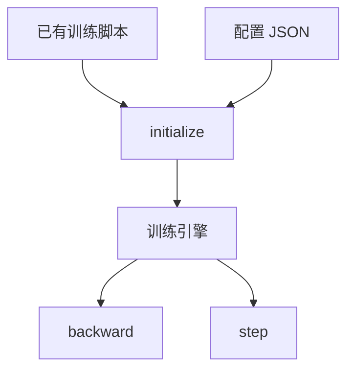

# DeepSpeed

一句话:DeepSpeed 是微软的**训练加速库**——它不替换 PyTorch,而是从外面把你**已有的训练脚本整个包起来**:改三行代码、写一份 JSON,ZeRO 那套显存优化就生效了。本篇讲的是"这是一个什么形状的工程"——它接管了什么、配置文件怎么当用户界面、非侵入的边界在哪;ZeRO 本身的原理见 ZeRO 篇,本篇不重复。

## 一、它是什么:一个把训练脚本包起来的引擎

类比:PyTorch 给你的是一台裸发动机,油路、变速箱得自己接;DeepSpeed 是把发动机连同变速箱、涡轮、油泵封成一个总成塞进车里——**对外只留三个接口,里面怎么转它自己管**。这个"非侵入式接入"是它的产品定位,也是它当年迅速普及的原因:一个团队已经有跑通的训练脚本,不想为了省显存去重写模型,DeepSpeed 让他们**不动模型定义**就能上 ZeRO。落到代码上只有三行:

1. `deepspeed.initialize(model=..., model_parameters=...)` —— 把模型换成一个引擎对象,顺手按配置把优化器、LR 调度器(以及可选的 dataloader)一起造好;
2. `loss.backward()` → `engine.backward(loss)`,`optimizer.step()` → `engine.step()`。

分布式初始化也可交给引擎:尚未初始化时可调用 `deepspeed.init_distributed()`,或让 `initialize` 按配置完成;已有兼容的 PyTorch 进程组也可复用,无需重复初始化。



图读法:两个输入(你的脚本 + 一份配置)进 `initialize`,出来一个引擎;之后所有能力开关都在配置里改,脚本那三行再也不动——**这就是"非侵入"的全部含义**。

### 引擎接管了什么:接管的那部分,你的旧代码必须删

这是接入时最容易翻车的地方。`backward` / `step` 里已经做了下面几件事,脚本里再做一遍就是**做了两遍**:

| 你原来手写的 | 现在归引擎 | 不删会怎样 |
|---|---|---|
| `optimizer.zero_grad()` | 引擎更新完自动清梯度 | 多清一次通常无害,但会掩盖累积逻辑写错 |
| fp16 的 `GradScaler` + 手动缩放 loss | 引擎自带 loss scaling(fp16 才有,bf16 没有) | 两层缩放叠在一起,梯度尺度失控 |
| "攒够 k 步才 step" 的 if 分支 | 按 `gradient_accumulation_steps` 自己判断累积边界,只在边界规约梯度并更新 | 等效 batch 变成配置值的 k 倍,学习率相当于全错 |
| 每步 `scheduler.step()` | 配置里写的调度器,引擎每个训练 step 自动推一次 | LR 双倍速衰减 |

一句话记法:**`engine.step()` 不等于 `optimizer.step()`**,它是"判断是不是累积边界 → 规约梯度 → 更新 → 清梯度 → 推 LR"一整套。所以接完 DeepSpeed 的训练循环里只剩前向、`backward`、`step` 三行,干净得反常——那不是简化过的示例,本来就该这么写。

### 非侵入是分档的:一半能力真零侵入,另一半必须改模型

但别把"非侵入"理解成"什么都不用改"。它的能力按侵入程度分成清清楚楚的两档:

| 档 | 包含哪些能力 | 要动什么 |
|---|---|---|
| **配置即可** | ZeRO 1/2/3 与 offload、混合精度、梯度累积与裁剪、优化器与调度器、日志与 checkpoint、AutoTP | 只改 JSON,模型定义一个字不动 |
| **必须改模型** | 流水线并行、MoE、稀疏注意力 | 模型要重写成框架要求的形状 |

第二档为什么躲不掉:**这几样切的是模型结构本身**。流水线并行得知道"层的顺序"才能按层切段,所以模型要重写成可枚举的层序列;MoE 要把某个 FFN 换成框架提供的 MoE 层,并显式给出专家数 `num_experts` 与专家并行度 `ep_size`;稀疏注意力要整个替换注意力模块。而 ZeRO 只切**存储**、不改计算图(为什么,见 ZeRO 篇),它才能躲在 hook 里悄悄干活。这条分界线也解释了实际使用比例:**绝大多数人只用第一档**——第一档是白拿的,第二档要付出改模型的代价,那还不如去用本来就以模型切分为主业的框架(见 Megatron 篇)。

## 二、配置文件是它的用户界面

设计哲学是"能力全部下沉到配置":一份 `ds_config.json`,启动时用自带启动器带上。

```bash
deepspeed --num_gpus=8 train.py --deepspeed ds_config.json
```

多机时用 hostfile 描述资源(每行 `主机名 slots=8`),`--include` / `--exclude` 可以精确到某台机的某几张卡;不指定 hostfile 就默认找 `/job/hostfile`,再找不到就按本机 GPU 数当单机跑。

### 主要板块:配置项 → 影响什么 → 常见坑

| 板块 | 代表配置项 | 影响什么 | 常见坑 |
|---|---|---|---|
| batch 三件套 | `train_batch_size` / `train_micro_batch_size_per_gpu` / `gradient_accumulation_steps` | 显存占用与等效 batch | 三者与卡数对不上当场报错;只给两项会自动推第三项 |
| ZeRO 档位 | `zero_optimization.stage`(0–3) | 三大件切到什么程度 | 越高越省显存、通信越多(取舍见 ZeRO 篇) |
| offload | `offload_optimizer` / `offload_param` 的 `device`(`cpu` 或 `nvme`)、`pin_memory` | 把状态挪去内存或硬盘 | 优化器 offload 到 CPU 在 Stage 1/2/3 都行,但 `offload_param` 与 NVMe **只有 Stage 3 支持** |
| 混合精度 | `bf16.enabled` / `fp16.enabled` | 计算与存储精度 | fp16 多一套 loss scaling,数值上更娇气 |
| 优化器与调度器 | `optimizer.type` / `scheduler.type` | 用哪个优化器、LR 怎么走 | 代码里传了就以代码为准(见下) |
| 梯度处理 | `gradient_clipping`、`overlap_comm`、`reduce_bucket_size` | 稳定性,以及通信与显存的折中 | bucket 调大通信摊得开,但峰值显存跟着涨 |
| 日志 | `steps_per_print`、`wall_clock_breakdown` | 能看到什么 | 默认**不打**前反向耗时拆解,查性能前先打开 |
| checkpoint | `checkpoint.load_universal`、`stage3_gather_16bit_weights_on_model_save` | 存成什么格式、能不能直接加载 | 见第六节 |

一段够用的起手配置:

```json
{
  "train_micro_batch_size_per_gpu": 4,
  "gradient_accumulation_steps": 8,
  "bf16": { "enabled": true },
  "gradient_clipping": 1.0,
  "zero_optimization": {
    "stage": 2,
    "overlap_comm": true,
    "contiguous_gradients": true,
    "offload_optimizer": { "device": "cpu", "pin_memory": true }
  },
  "steps_per_print": 10
}
```

### batch 三件套:先核对等式

$$
\text{train\_batch\_size} = \text{train\_micro\_batch\_size\_per\_gpu} \times \text{gradient\_accumulation\_steps} \times \text{数据并行度}
$$

意思是:全局 batch = 每卡一次前反向吃几条 × 攒几次才更新 × 数据并行副本数。使用 TP/PP 时,参与同一模型副本计算的卡不能再算一份数据副本。DeepSpeed 启动时**硬校验**这个等式,对不上直接抛异常——新手撞的第一个错基本都是它。省事的写法是只填其中两项、让框架推出第三项;三项都填就必须自洽。

三者的分工别混:**显存主要由 `train_micro_batch_size_per_gpu` 决定**,因为它决定一次前反向要留住多少激活;`gradient_accumulation_steps` 是**拿时间换等效大 batch**,几乎不额外吃显存(完整的显存账见 显存管理与OOM 篇)。

### 配置和代码冲突时以谁为准

这个问题的答案不是"配置优先"一句话,而是分两层:

- **优化器与 LR 调度器:代码优先。** 传给 `initialize` 的实例(或工厂函数)会**覆盖**配置里的 `optimizer` / `scheduler` 段;什么都不传,才去读配置造一个。而**其余一切(batch、ZeRO、精度、裁剪、checkpoint)配置是唯一入口**,代码里根本没地方设,谈不上冲突。
- **接了 HuggingFace Trainer 就多一层。** Trainer 通过 `TrainingArguments(deepspeed=...)` 接入,集成支持的 `"auto"` 字段可按训练参数填写。手动指定同一项时,两处值必须一致;不能依赖某一层覆盖冲突值。先核对最终 batch、精度、学习率与梯度累积配置,再开始训练。哪些字段支持 `"auto"` 取决于所用集成版本,原生 DeepSpeed 配置不能直接照搬这一约定。

## 三、能力全景

按"这条线现在还活着吗"排,比按功能分类有用(配置项名以 0.18 版官方文档为准,随版本演进):

| 能力 | 干什么 | 现状 |
|---|---|---|
| **ZeRO 1/2/3** | 把参数、梯度、优化器状态切碎摊到各卡 | **绝对主力**,框架的核心卖点(原理见 ZeRO 篇) |
| **ZeRO-Offload / Infinity** | 状态与更新下放到 CPU 内存或 NVMe | 活跃;NVMe 这一档至今仍是它独有(判据见 ZeRO 篇) |
| **ZeRO++** | 量化通信 + 节点内二级分片 | 活跃,跨节点场景用(见 ZeRO 篇) |
| 流水线并行 | 按层切段接力 | 存在但要改模型,实际用得远少于 ZeRO;与 Stage 2/3 不兼容(见 ZeRO 篇) |
| MoE 训练 | 专家并行 + 门控与通信优化 | 早期 MoE 训练的主力,现在多被专用实现取代(见 MoE并行与DeepEP 篇) |
| 长序列(Ulysses) | 输入沿序列维切开,进注意力时用 all-to-all 换成按头切 | 活跃(序列并行见 并行策略 篇,算子语义见 集合通信 篇) |
| AutoTP | 按内置规则自动做张量并行 | 较新,只支持 ZeRO 0/1/2 |
| 稀疏注意力 | block-sparse 注意力 kernel | **基本停滞**——文档至今仍写明只能跑在 V100/A100、CUDA 不高于 11.1(思路见 稀疏注意力 篇) |
| DeepSpeed-Inference / FastGen | 推理加速 | 非主流,推理侧生态已由别的引擎主导,一句带过 |
| DeepSpeed-Chat | RLHF 三阶段流水线与 Hybrid Engine | 教学与历史价值为主(流程本身见 RLHF与RM 篇,框架选型见 RL框架对比 篇) |

看这张表要抓的不是功能数量,而是**它的重心从来没变过:训练侧的显存工程**。推理那条线开得早、也认真做过,但没跟上后来的推理引擎;RLHF 那条线开创了"训练态与生成态共享一份权重来回切"的思路,后来者沿用了思路、换掉了实现。

### 按瓶颈选择能力与并行组合

先量出模型状态、激活和临时缓冲的峰值。状态占不下时选择 ZeRO;激活占不下时比较微批与重算;具体账本见 显存管理与OOM 篇。梯度累积把一次更新拆成多次前反向,重算以额外计算换少存激活;混合精度、融合算子与通信重叠能否提速,要看硬件支持和可重叠窗口。

Stage 2 已装得下时先测它,Stage 3 若能换来更合适的微批或更少重算,也可能更快;分片与选档原理见 ZeRO 篇。Megatron 的 TP/PP 与状态分片解决不同层次的问题,组合应按显存峰值、互联和吞吐验证,不是按固定模型大小背配置,见 并行策略 篇。按本地 2026-04 源码快照,DeepSpeed 流水线引擎拒绝 ZeRO-2/3,不能把算法可组合直接当成该引擎可启用。

### 卸载为什么会变慢

原始 ZeRO-Offload 主要把优化器状态与更新移到 CPU;Infinity 在 ZeRO-3 上使用 GPU、CPU、NVMe 多级存储。NVMe 存状态,CPU 做卸载后的优化器更新,需要的参数仍要送回 GPU。按本地 2026-04 源码快照,分块读写可与更新重叠,固定内存和缓冲池会增加主机内存占用。每步搬运量太大、计算窗口太短或链路太慢时,预取不能消除等待。

调优时分别测 GPU 计算、CPU 更新、PCIe 和磁盘耗时,再改变分块、预取或缓冲配置。跨卡带宽不足还会影响取参,但 TP 也需要频繁通信,不能保证换框架必然更快。省显存与提吞吐要分开验收,底层卸载原理见 ZeRO 篇。

## 四、和 Megatron 的关系:一个出切法,一个出省法

Megatron-DeepSpeed 这类组合经常被误解成"两个框架打架",其实是**各出一半**:

| 谁 | 出什么 |
|---|---|
| Megatron-LM | Transformer 实现、张量并行、数据加载 |
| DeepSpeed | ZeRO、流水线并行、其余分布式训练组件 |

最有名的落地是 BLOOM-176B:384 张 A100 80GB,TP=4 × PP=12 × DP=8 恰好乘出 384。TP 来自 Megatron、留在机内,PP 与 ZeRO 来自 DeepSpeed(rank 为什么这么排,见 并行策略 篇)。顺带一个能体现规模的数字:那份带 fp32 优化器状态的完整 checkpoint 约 2.3 TB,单是 bf16 权重就有 329 GB——下一节讲的 checkpoint 麻烦,在这个尺度上不是小事。近几个版本 DeepSpeed 自己也长出了 AutoTP,分工的边界在往中间靠,但这**不是"谁替代谁"**。Megatron 自身的架构见 Megatron 篇,本篇不做优劣对比。

## 五、和 FSDP 的关系:同一个思路的两个实现

FSDP 是 PyTorch 把 ZeRO 思路原生化的产物,**分片档位与 ZeRO 的 Stage 一一对得上**(完整对应表在 ZeRO 篇,这里不重复)。所以选型的问题**不是"哪个省得多"**——同一档省的是同一笔账——而是这三问:

1. **要不要 NVMe 级 offload?** 要,就只能选 DeepSpeed。
2. **想不想留在 PyTorch 原生语义里?** 想(比如要吃编译、要能单步调试),FSDP 更顺;DeepSpeed 封装深、报错栈长。
3. **已有脚本是什么形状?** 已经在 HF Trainer 里,两边都是一行接入;是手写训练循环,DeepSpeed 那三行改动更小。FSDP 自身的架构与配置见 FSDP 篇。

## 六、真实的坑

### checkpoint:存出来的不是你以为的那个格式

**Stage 3 存出来的是分片**,每张卡只写自己那份参数,直接当普通权重加载会缺斤短两。三条出路:

- 保存时目录里会自动生成一个离线转换脚本(`zero_to_fp32.py`),把分片拼回完整 fp32 权重,**不需要 GPU**;代价是要吃**约两倍于最终权重大小的 CPU 内存**,大模型上得先看内存够不够;
- 配 `stage3_gather_16bit_weights_on_model_save: true`,保存时自动收拢成完整 16 bit 权重——省事,但保存那一刻显存峰值会抬高;
- 想**换一套并行度接着训**(比如从 TP=4 换成 TP=8),前两条都不管用,要走 universal checkpoint:先离线转成"通用格式",再在配置里开 `checkpoint.load_universal` 加载。

还有一条更隐蔽的:**保存必须所有 rank 一起调,不能只让 rank 0 调**。因为每张卡都要写自己那份优化器状态和主权重,只让 rank 0 调用会**卡在等其他进程同步上**——现象是训练无声无息挂住、不报错,很难查。

### ZeRO-3 必须在建模型之前就生效

Stage 3 是在**参数被创建的那一刻**就分片的。要是先把完整模型加载到每张卡、之后才配 DeepSpeed,"每卡一份全量参数"这个峰值已经发生过了,**一分显存都没省下**,模型再大点直接就加载不进去。正确顺序是让 ZeRO-3 配置先生效(HF 里表现为先构造 `TrainingArguments` 再加载模型),或者在框架提供的分片初始化上下文里建模型。

### 版本耦合比想象中硬

DeepSpeed 带一批 C++/CUDA 编译算子(CPU Adam、各类融合算子)。**预编译进来的算子在加载时会校验:编译时与运行时的 torch 版本必须 major.minor 一致,CUDA 版本同样要 major.minor 一致**,对不上直接抛异常要求重装;走 JIT 现编的那条路则要求本机 CUDA toolkit 与 torch 的 CUDA 版本对得上。所以升 torch 往往意味着要重装 DeepSpeed——团队实践里锁版本、连镜像一起固化是标配。

### 通信超时先找最早的异常

先收齐各进程日志,找是否有某张卡先 OOM、取数据卡住或提前退出。其他卡随后报通信超时,可能只是等不到它。再检查集合通信的调用顺序、张量形状与全进程保存要求。应用侧无异常后,用最小通信测试核对网卡、链路、驱动与共享内存。只有确认是正常操作过慢,延长超时才有意义。检查顺序参见 [NCCL 官方排障指南](https://docs.nvidia.com/deeplearning/nccl/user-guide/docs/troubleshooting.html)。

### 其余几条

- **流水线并行与 ZeRO-2/3 不兼容**,框架会直接断言拒绝(为什么冲突,见 ZeRO 篇);
- **和 LoRA / 量化组合时收益骤减**:可训参数少了,优化器状态那个大头本就不存在(见 LoRA 篇);QLoRA 那类量化权重与 Stage 3 的分片聚合长期不兼容,常见做法是退回 Stage 2;
- **日志盯四个数**:显存的 allocated / cached 是否贴着上限、吞吐(samples/s 或 TFLOPS)有没有掉、fp16 下的 loss scale 是不是一路下探(下探就是在频繁溢出跳步,bf16 无此项)、grad norm 有没有尖刺。前两个要先打开耗时拆解才看得全;这些机制的具体实现见开源解读模块。

## 面试考点串联

| 高频问法 | 本文哪一节 |
| --- | --- |
| DeepSpeed 接管哪些训练环节,哪些旧代码要删? | 一:接入、梯度累积与引擎更新 |
| 哪些能力只改配置,哪些必须改模型?支持的能力能随意组合吗? | 一的两档表、三的能力全景与并行组合 |
| 配置和代码冲突了怎么办,batch 三项如何对应? | 二:优先级与数据并行副本数 |
| 为什么省显存后训练反而慢了,ZeRO-2/3怎样选? | 三:按瓶颈选择能力与并行组合 |
| Infinity 比普通分片多解决什么,CPU/NVMe 搬运怎样成为瓶颈? | 三:卸载为什么会变慢 |
| DeepSpeed 与 Megatron、FSDP 怎么分工和选型? | 四、五 |
| checkpoint 为什么不能直接加载,为什么所有进程都要保存? | 六:分片保存与转换 |
| 通信超时怎么排查,加大超时有用吗? | 六:通信超时先找最早的异常 |


## 相关文献

- ZeRO 系列论文(ZeRO / Offload / Infinity / ZeRO++)集中列在 ZeRO 篇,本篇不重复
- DeepSpeed-MoE: Advancing Mixture-of-Experts Inference and Training to Power Next-Generation AI Scale — [arXiv:2201.05596](https://arxiv.org/abs/2201.05596)
- DeepSpeed Ulysses: System Optimizations for Enabling Training of Extreme Long Sequence Transformer Models — [arXiv:2309.14509](https://arxiv.org/abs/2309.14509)
- Universal Checkpointing: A Flexible and Efficient Distributed Checkpointing System for Large-Scale DNN Training with Reconfigurable Parallelism — [arXiv:2406.18820](https://arxiv.org/abs/2406.18820)
- DeepSpeed Inference: Enabling Efficient Inference of Transformer Models at Unprecedented Scale — [arXiv:2207.00032](https://arxiv.org/abs/2207.00032)
- DeepSpeed-FastGen: High-throughput Text Generation for LLMs via MII and DeepSpeed-Inference — [arXiv:2401.08671](https://arxiv.org/abs/2401.08671)
- DeepSpeed-Chat: Easy, Fast and Affordable RLHF Training of ChatGPT-like Models at All Scales — [arXiv:2308.01320](https://arxiv.org/abs/2308.01320)
- BLOOM: A 176B-Parameter Open-Access Multilingual Language Model(Megatron-DeepSpeed 的旗舰落地)— [arXiv:2211.05100](https://arxiv.org/abs/2211.05100)
- DeepSpeed 文档 — Getting Started(三处改动、引擎接管清单、hostfile 与启动器)与 Configuration JSON(全部配置项与默认值)— https://www.deepspeed.ai/getting-started/ 、https://www.deepspeed.ai/docs/config-json/
- DeepSpeed 文档 — ZeRO 教程(`zero_to_fp32.py` 与约 2 倍 CPU 内存的口径)与 Universal Checkpointing(换并行度续训的三步流程)— https://www.deepspeed.ai/tutorials/zero/ 、https://www.deepspeed.ai/tutorials/universal-checkpointing/
- HuggingFace Transformers 文档 — DeepSpeed 集成(`"auto"` 字段与共享参数一致性)— https://huggingface.co/docs/transformers/deepspeed
- HuggingFace 博客 — The Technology Behind BLOOM Training(TP=4 × PP=12 × DP=8、2.3 TB checkpoint 的出处)— https://huggingface.co/blog/bloom-megatron-deepspeed

- [ZeRO-Offload 官方教程](https://www.deepspeed.ai/tutorials/zero-offload/)与 [ZeRO-Infinity 论文](https://arxiv.org/abs/2104.07857):CPU 更新、多级存储与卸载边界。
