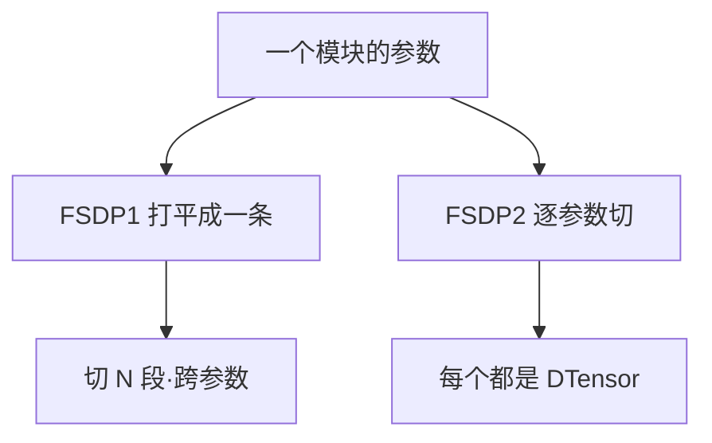

# FSDP

> 🔴 重点考点:本篇是当前复习重点,文末「面试考点串联」给出问法对照。

一句话:FSDP(Fully Sharded Data Parallel)是 **PyTorch 原生的分片数据并行**——把 ZeRO 那套"参数/梯度/优化器状态各存 $1/N$、要用再凑齐"的思路直接做进框架内核,而不是外挂一个库。本篇只讲**架构与用法**:怎么包、包多粗、各档怎么选、和别的并行怎么摆、有哪些坑;**为什么省显存、通信量多少,一律见 ZeRO 篇**。

## 一、它是什么:原生这两个字值多少钱

分片的机制与 ZeRO 完全同源,档位也一一对得上(`FULL_SHARD` ≈ Stage 3、`SHARD_GRAD_OP` ≈ Stage 2、`NO_SHARD` ≈ DDP,详见 ZeRO 篇)。所以 FSDP 的卖点从来不是"更省显存",而是**原生**。这两个字落到实处是三件事:

1. **装了 PyTorch 就有**,不引入第二套训练循环、不写第二份配置文件。DeepSpeed 那套以 JSON 配置为中心的能力体系见 DeepSpeed 篇,本篇不做横向优劣对比;
2. **和框架的其他抽象共用同一套语言**。分片后的参数就是 `DTensor`(带分布式布局信息的张量),于是它和张量并行、分布式 checkpoint、`torch.compile` 说的是同一种话——不需要在两套"什么是被切开的权重"之间做翻译;
3. **和 `nn.Module` 的钩子机制长在一起**。参数的凑齐与释放挂在模块的前向/反向钩子上,用户的建模代码一行不用改。

代价也来自同一处:它只做**数据并行这一维**。TP/PP/EP 要么自己搭、要么交给 Megatron 那类框架(见 Megatron 篇、并行策略 篇)。

## 二、FSDP1 与 FSDP2:分片表示换了根

这是本篇最容易过时、也最该问清楚的一节。**截至本篇核实时(PyTorch 2.13 开发版,2026 年上半年):官方教程已明写「FSDP1 is deprecated」,新代码一律用 FSDP2;`fully_shard` 已从早期的 `_composable` 私有命名空间提升到 `torch.distributed.fsdp` 顶层公开导出。** 这条状态随版本演进,落笔前请以当时的官方文档为准。

两代的差别只有一个根:**一组参数在每张卡上到底长什么样。**



- **FSDP1**:把一组张量**打平、首尾相接、拼成一个大 buffer**,再把这条 buffer 均分成 $N$ 段。切口落在哪儿完全由拼接顺序决定,**跟参数边界毫无关系**——一个权重可能整份在你手上、可能只有半份、也可能一个元素都没有。
- **FSDP2**:每个参数**各切各的**,统一沿第 0 维均分给 $N$ 张卡,每个参数就是一个 `DTensor`。

打平的好处是通信友好(一条连续 buffer 一次发完),坏处是**它把"参数"这个概念在分片态里弄丢了**。下游三处麻烦全从这里长出来:

| 场景 | FSDP1(flat buffer) | FSDP2(逐参数 DTensor) |
|---|---|---|
| **和其他并行组合** | 分片态说不清"哪段属于哪个参数",再往 TP 维切一刀很难对齐 | 参数本身就带布局信息,多维 mesh 上直接叠 |
| **状态字典** | 训练态与 checkpoint 态长得不一样,存分片 checkpoint 也要先通信重排 | `model.state_dict()` 直接返回分片状态字典,**零通信** |
| **冻结部分参数** | 同一条 buffer 里的参数默认必须 `requires_grad` 一致,混着放会直接报错 | 冻结与可训参数可以混在同一个通信组里,不额外占显存 |

顺带记一个量级:FSDP2 的实现约 3k 行,FSDP1 约 14k 行——**大部分复杂度是打平这个决定自己制造出来的**。

### 迁移对照:FSDP1 的旋钮去哪了

| FSDP1 | FSDP2 | 说明 |
|---|---|---|
| `FullyShardedDataParallel(module, ...)` | `fully_shard(module, ...)` | 前者**包一层 wrapper**(参数全名被改写),后者只挂钩子、**全名不变** |
| `auto_wrap_policy=...` | 没有了 | 粒度改由"你在哪些模块上调 `fully_shard`"表达,见第三节 |
| `sharding_strategy=...` | `reshard_after_forward=` + mesh 维数 | 见第四节 |
| `use_orig_params=True/False` | 没有了 | 没有 flat buffer,本来就一直用原始参数 |
| `limit_all_gathers=True` | 没有了 | FSDP2 换了显存管理方式,不再需要卡住 CPU 来压峰值 |
| `sync_module_states=True` | 交给分布式 checkpoint | 从 rank0 广播完整权重的活归 DCP 管,见第六节 |
| `backward_prefetch=...` | `set_modules_to_backward_prefetch(...)` | 反向预取默认就开,这个接口留给要手动排的人 |

## 三、wrap 粒度:使用者最该懂的一件事

### 为什么非要按模块粒度包一层

因为**"包一层"定义的是通信的边界**。每调用一次 `fully_shard`,就圈出一个**通信组**:组里所有参数在前向前用**一次** all-gather 凑齐,反向后用**一次** reduce-scatter 散掉。组怎么划,直接决定两件事——**一次凑多少参数**,以及**通信能不能藏进计算**。

规则只有一条,记住就够:**一次调用收走该模块下还没被更内层调用认领的参数**。所以要**自底向上**包——先逐层包,最后包根模块,根那次就自然只兜住 embedding、输出头这些散在外面的部分。

### 粗和细两端各会怎样

| 粒度 | 一次 all-gather 凑多少 | 显存 | 通信 | 结论 |
|---|---|---|---|---|
| **只包根模块** | **整个模型** | 前向那一刻全模型不分片,等于白切 | 一头一尾两次巨大集合操作,**中间没有任何计算可以重叠** | 几乎永远是错的 |
| **每层包一次**(推荐) | 一层的参数 | 峰值 ≈ 分片态 + 一两层的完整参数 | 每层一次,大小适中,能和相邻层的计算重叠 | 默认做法 |
| **切到每个线性层** | 一个权重 | 更省一点 | 消息碎、次数多,每次都要重付固定启动开销,带宽打不满 | 通常反而更慢 |

第三行的机制不是 FSDP 特有的,是所有集合通信的通病(小消息为什么打不满带宽,见 集合通信 篇);第一行的显存直觉则回到 ZeRO 篇那句话——**参数是"借来的",借的粒度越大,借的那一刻峰值越高**。

### 重叠是怎么发生的

前向靠的是 **CPU 跑在 GPU 前面**:第 $k$ 层还在算的时候,CPU 已经触发了第 $k+1$ 层的钩子,把它的 all-gather 发到一条专用的通信流上。反向则更主动——FSDP2 **默认就显式预取**下一个组的 all-gather,并把 reduce-scatter 放到另一条流上。所以"层粒度"之所以是甜点位,是因为**它恰好给每次通信配了一层计算做掩护**。CPU 侧开销太大导致提前量不够时,可以用 `set_modules_to_forward_prefetch` 把 all-gather 更早发出去。

### 一段最小用法

```python
import torch
from torch.distributed.device_mesh import init_device_mesh
from torch.distributed.fsdp import fully_shard, MixedPrecisionPolicy

mesh = init_device_mesh("cuda", (dp_size,))              # 一维 mesh = 纯分片
mp = MixedPrecisionPolicy(
    param_dtype=torch.bfloat16,                          # 计算与 all-gather 用 bf16
    reduce_dtype=torch.float32,                          # 梯度规约仍走 fp32
)

for layer in model.layers:                               # 先逐层:每层一个通信组
    fully_shard(layer, mesh=mesh, mp_policy=mp)
fully_shard(model, mesh=mesh, mp_policy=mp)              # 最后包根:兜住剩下的参数

optimizer = torch.optim.AdamW(model.parameters(), lr=1e-4)  # 必须在包完之后建
```

最后一行是新手最容易踩的:优化器要拿到的是**已经变成 `DTensor` 的那份参数**,包之前建的优化器握的是旧对象。另外,调用一定要写 `model(x)` 而不是 `model.forward(x)`——钩子挂在前者上,绕过去参数就没被凑齐。

## 四、分片档位:怎么选,混合分片解决什么

四个档位与 ZeRO Stage 的一一对应见 ZeRO 篇,这里只讲**怎么写、怎么选**:

| 档位(FSDP1 名) | 前向后参数还留着吗 | FSDP2 怎么写 | 什么时候选 |
|---|---|---|---|
| `FULL_SHARD` | 不留,反向再凑一次 | `reshard_after_forward=True` + 一维 mesh | 默认档:显存最省 |
| `SHARD_GRAD_OP` | 留着,省掉反向那次 all-gather | `reshard_after_forward=False` + 一维 mesh | 显存有富余,拿它换通信 |
| `NO_SHARD` | 压根不切 | 无直接对应:把分片那一维设成 1(退化成纯复制),或干脆用 DDP | 参数少、算力密的小模块 |
| `HYBRID_SHARD` | 机内不留,机间靠复制 | `reshard_after_forward=True` + **二维 mesh** | 多机、跨机链路差 |

**混合分片(HSDP)解决的是一个纯粹的组网问题。** 全局 `FULL_SHARD` 时,那些又贵又频繁的 all-gather / reduce-scatter 会摊到**所有**卡上,跨机链路被反复穿过。HSDP 的做法是**机内切满、机间只做复制**:昂贵的集合操作被关在 NVLink 域里,跨机每步只剩一次梯度 all-reduce。代价是每台机器都要存一整份分片,显存换带宽。写法上就是把 mesh 从一维换成二维——FSDP2 里 `(dp_replicate, dp_shard)` 两维分别对应"机间复制"和"机内分片"。这个念头和 ZeRO++ 的 hpZ 是同一个,见 ZeRO 篇。

还有一个容易被忽略的**中间档**:`reshard_after_forward` 除了布尔值,还能给一个**整数**——前向后不切回 $N$ 份,只切回到某个更小的规模(比如机内卡数)。于是反向那次 all-gather 只在更小的范围里做,显存比 `True` 多一点、通信比 `False` 省一点。

## 五、和其他并行组合:mesh 是那根接线板

各并行是什么、为什么 TP 不出机、rank 怎么摆,全部见 并行策略 篇。这里只讲 FSDP 怎么接上去。

**接口是 `DeviceMesh`**——把所有卡想象成一个多维网格,每一维起个名字对应一种并行。和 TP 组合的标准写法是:开一个 `("dp", "tp")` 的二维 mesh,先在 `tp` 那一维上做张量并行,再把 `dp` 那一维交给 `fully_shard`。两组进程组就是这么对上的:**同一张卡在 dp 维和 tp 维上各属于一个组,互不干扰**。FSDP2 之所以能干净地做到这点,正是第二节那个根——参数本身带着布局信息,再切一刀是**在已有布局上追加一维**,而不是在一条打平的 buffer 上重新对账。

**和激活重算组合**是另一条常规操作,而且**正交互补**:FSDP 切的是三大件,重算省的是激活,两者省的压根不是同一项(这本账见 显存管理与OOM 篇)。工程上把重算包在 FSDP 的**里面**——即先给层套上重算,再对层调 `fully_shard`,这样重算的重跑前向仍在已凑齐的参数上进行。

**梯度累积**用 `set_requires_gradient_sync(False)` 关掉本步的梯度规约(相当于 FSDP1 的 `no_sync`);HSDP 下还能更细一档:每个微批照常做机内 reduce-scatter、只把跨机 all-reduce 攒到最后一步,对应 `set_requires_all_reduce`。

**和 `torch.compile` 组合**是 FSDP2 的顺路收益(编译本身见 TorchCompile 篇)——FSDP1 时代必须显式打开 `use_orig_params=True` 才能编,FSDP2 没有这个开关,因为它本来就一直用原始参数。

## 六、常见坑

### checkpoint:分片存还是汇总存

这是 FSDP 最高频的工程问题,判据只有一句:**存给自己续训用,就分片存;存给别人加载用,才汇总存。**

| | 分片保存 | 汇总保存 |
|---|---|---|
| 落盘长什么样 | 每卡一份自己那 $1/N$ | 一个完整的单文件权重 |
| 通信 | FSDP2 下**零通信**(训练态就长这样) | 要把每个参数 all-gather 拼回整份 |
| 峰值内存 | 无额外峰值 | 整个模型要在**一个进程**里落地,大模型必须配 CPU offload,且通常只有 rank0 拿到 |
| 换并行度后能读吗 | 能,分布式 checkpoint 会按新布局重切 | 能,但要重走一遍切分 |
| 典型用途 | 训练中途存档、断点续训 | 发布权重、交给推理引擎、上传模型库 |

两条实操:FSDP2 **不直接提供**"给我一份完整 state dict"的接口,汇总要么自己对 `DTensor` 调整份化接口,要么用分布式 checkpoint 那套统一入口(它同时支持 FSDP1 / FSDP2 / DDP,还能一并处理优化器状态);**加载**一份外部的完整权重时,走"rank0 读入、逐张量广播、各卡按自己的布局切"的路径——这就是 FSDP1 里 `sync_module_states` 那件事的新家。

### 冻结参数与 LoRA

LoRA 是什么见 LoRA 篇。这里只说它和 FSDP 打架的地方:**LoRA 的典型形态就是"冻结的底座 + 可训的适配器混在同一个模块里"**,而这正好是 FSDP1 flat buffer 最难受的姿势——同一条 buffer 里的参数默认必须 `requires_grad` 一致,混着放直接报错;绕过去要么打开 `use_orig_params=True`,要么把 wrap 边界画得让冻结与可训参数不同居一组,两条都让人分心。FSDP2 从表示上消掉了这个问题:冻结与非冻结可以同组,且不额外占显存。

还有一条容易漏:存 checkpoint 时通常**只想存适配器**,分布式 checkpoint 提供了"跳过冻结参数"的选项,别把几十 GB 的冻结底座跟着存一遍。另外提醒一句,LoRA 场景下 ZeRO / FSDP 本身的收益就骤减——可训参数极少,优化器状态那个大头本来就不存在(见 ZeRO 篇)。

### 混合精度:它和 autocast 不是一回事

FSDP 的混合精度是**模块级**的,不是算子级的:参数在模块边界上整体转成低精度,组里所有算子都用它算,**低精度的激活直接存下来给反向用**。而 `autocast` 是逐算子按白名单决定精度。差别的实际后果是:FSDP 的做法**转换次数少、激活省一半**,但你失去了"某个算子必须用 fp32"的逐算子控制。

三个字段各管一段,别混:`param_dtype` 决定**计算精度,同时也决定 all-gather 传的是什么精度**(设成 bf16,参数通信量直接减半);`reduce_dtype` 单独决定**梯度规约的精度**,可以做到"bf16 算、fp32 规约",这是长训练里防梯度累加被舍入抹平的常用配置;`output_dtype` 只管前向输出的转换,用来把不同精度策略的模块拼在一起。还有一条值得记的性质:**FSDP 不需要为优化器额外留一份高精度参数**——分片态的那份本来就还是原始精度,低精度只活在"凑齐的那一份"上。

### 历史包袱:`use_orig_params` 这类开关

`use_orig_params` 是 FSDP1 用来**部分弥补** flat buffer 缺陷的补丁,默认关着。打开后 `named_parameters()` 返回的是原始参数而不是内部的打平参数,于是优化器能按参数分组设不同超参、`torch.compile` 也能编。但它治标不治本:**分片态仍然是一维的**,一个参数在某张卡上可能有全部、部分、或者一个元素都没有的数据(没有时是个 size-0 的空张量),所以任何"我来读一下这张卡上这个权重的分片"的代码都靠不住。FSDP2 把这个开关连同 `limit_all_gathers` 一起删掉了——**它们都是同一个设计决定的赔偿金**。看到老代码里这两个参数,就知道那是 FSDP1 时代的写法。

### 其他两条

**别对着 `model.forward()` 调**,钩子挂在 `__call__` 上;确实要暴露别的前向入口(比如只跑一个子模块),用 `register_fsdp_forward_method` 显式注册。**根模块默认不在前向后切回去**(`reshard_after_forward` 对根默认是 `False`),因为反向一开始立刻就要用它——这是刻意的默认值,不是 bug。

至于每个钩子内部怎么排流、显存怎么复用,**具体实现见开源解读模块**。

## 面试考点串联

| 高频问法 | 本文哪一节 |
| --- | --- |
| FSDP 的 wrap 粒度该怎么定?包得太粗、太细分别会怎样? | 三(通信组边界;两端各自的失效方式) |
| FSDP2 相比 FSDP1 到底换了什么?这个改动为什么会连带影响状态字典和冻结参数? | 二(flat buffer → 逐参数 DTensor,三处下游麻烦) |
| FSDP 存 checkpoint,分片保存和汇总保存怎么选?各自代价是什么? | 六(自己续训 vs 给别人用) |
| 用 FSDP 跑 LoRA,把冻结底座和适配器包进同一层会出什么事? | 六 + 二(`requires_grad` 必须一致的约束) |
| FSDP 和张量并行一起用怎么摆?两组进程是怎么对上的? | 五(二维 mesh,每维一种并行) |
| HYBRID_SHARD 是给什么场景准备的?它拿什么换什么? | 四(贵的集合操作关进机内,显存换带宽) |
| FSDP 的混合精度和 autocast 有什么不一样?为什么还要单独设一个规约精度? | 六(模块级 vs 算子级;bf16 算 fp32 规约) |
| FSDP 跑起来了但吞吐上不去,你会先看哪几个地方? | 三(粒度与重叠)+ 五(和别的并行的摆法) |
| 在大规模分布式训练场景中，PyTorch的FSDP与DeepSpeed相比，在哪些方面（如易用性、灵活性、性能、集成复杂度、硬件适配等）更具优势？请结合实际应用场景，系统性地分析两者在框架选型上的关键差异，并说明在何种条件下优先选择FSDP更为合适。 | 一～五（机制与组合）；待补完整横向选型 |


延伸阅读顺序:并行策略(各并行是什么)→ ZeRO(为什么省、通信多少)→ 本篇(PyTorch 侧怎么用)→ DeepSpeed(另一套实现的配置体系)。

## 相关文献

- PyTorch FSDP: Experiences on Scaling Fully Sharded Data Parallel(FSDP 的设计与工程经验,对应 FSDP1)— [arXiv:2304.11277](https://arxiv.org/abs/2304.11277)
- PyTorch 文档 — `torch.distributed.fsdp.fully_shard`(FSDP2 的 API 与「对比 FSDP1」的官方条目)— https://docs.pytorch.org/docs/stable/distributed.fsdp.fully_shard.html
- PyTorch 文档 — FullyShardedDataParallel(FSDP1 的 `ShardingStrategy` / `auto_wrap_policy` / `use_orig_params` 定义)— https://docs.pytorch.org/docs/stable/fsdp.html
- PyTorch 教程 — Getting Started with FSDP2(含「FSDP1 is deprecated」与 FSDP1→FSDP2 迁移指南)— https://docs.pytorch.org/tutorials/intermediate/FSDP_tutorial.html
- FSDP2 RFC · pytorch/pytorch#114299(逐参数分片的设计动机,~3k 行 vs ~14k 行的出处)— https://github.com/pytorch/pytorch/issues/114299
- torchtitan 文档 — FSDP(FSDP1 被移除参数的逐条清单)— https://github.com/pytorch/torchtitan/blob/main/docs/fsdp.md
- PyTorch 文档 — Distributed Checkpoint(分片 / 汇总状态字典、从 rank0 广播加载)— https://docs.pytorch.org/docs/stable/distributed.checkpoint.html
- TorchTitan: One-stop PyTorch native solution for production ready LLM pre-training(FSDP2 在真实预训练栈里的用法参考)— [arXiv:2410.06511](https://arxiv.org/abs/2410.06511)
