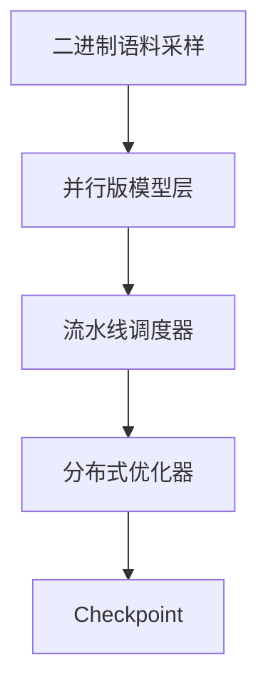

# Megatron

一句话:Megatron 是 NVIDIA 的**大模型训练框架**,更重要的是它顺手成了**一整套被全行业当地基复用的并行实现**——今天大多数"用 Megatron 训"的说法,指的其实是别的框架在调用它的内核库 Megatron-Core。本篇只讲这个工程长什么样、怎么配、有哪些坑;**并行本身的原理(TP 怎么切、PP 的 bubble、SP/CP 是什么、各算子通信多少)一律见 并行策略 篇与 集合通信 篇**,这里一个字都不重讲。

## 一、两个名字:Megatron-LM 与 Megatron-Core

聊 Megatron 第一件要分清的事:**你说的是哪一个**。官方文档把它们摆成"一个库 + 一个参考实现",两者通常一起用:

| | **Megatron-Core** | **Megatron-LM** |
|---|---|---|
| 是什么 | 可被别人 import 的**库**:并行化的 Transformer 组件、流水线调度、分布式优化器、数据集与 checkpoint 工具 | 建在 Core 之上的**完整训练框架**,原生 PyTorch 训练循环 + 一批预置脚本 |
| 给谁用 | 框架开发者:自己写训练循环、自己接数据 | 想直接跑预训练 / 微调的人 |
| 边界 | **不含**训练循环、命令行入口、数据预处理工具 | 端到端:数据准备 → 训练 → 评估 → 导出 |
| 怎么拿 | 单独发包,直接 pip 装 | clone 仓库 |

**为什么这个区分是考点**:Core 被单独抽成库之后,别人就可以只要"并行化的模型与优化器",而**把训练循环换成自己的**。RL 框架要的恰恰是这个——它们的循环里夹着采样、打分、KL 惩罚,和预训练那种规规矩矩的 forward-backward-step 根本不是一个形状。第七节列了谁在复用哪一部分。另一个常被一起提到的名字 **Megatron Bridge**,做的是 Hugging Face 与 Megatron 之间**并行度感知**的双向权重转换与训练配方,不是训练框架内核本身。

## 二、架构分层:一条 step 都经过什么

被问"讲讲 Megatron 的架构"时,按这五层说:

| 层 | 负责什么 | 关键产物 |
|---|---|---|
| **数据与 tokenizer** | 把预处理好的二进制语料按索引随机取样、拼 batch;多数据源按比例混合 | 一条 micro-batch |
| **模型定义** | Transformer 各层的**并行版实现**:列切 / 行切的线性层、按词表切分的 embedding 与交叉熵 | 前向图 |
| **并行状态** | 建各类进程组(TP / PP / DP / CP / EP 各一套),把 rank 映射成一组坐标 | 每张卡"我是谁" |
| **优化器** | 混合精度、梯度裁剪、分布式优化器(即 ZeRO-1) | 参数更新 |
| **训练循环与 checkpoint** | micro-batch 调度(1F1B / interleaved)、日志、存取检查点、容错重启 | 一步 step |



图读法:**中间三层是 Core 的地盘,两头是 Megatron-LM 补的**——这也正是别人复用时的切割线。它留给使用者的口子只有三个:**怎么造模型、怎么造数据集、单步前向怎么算 loss**;训练入口把这三个当回调收进去,其余(初始化进程组、按并行度切模型、调度 micro-batch、更新、存盘、断点续训)全包了。所以"用 Megatron-LM 训一个自定义模型"的标准姿势是:**换这三个回调,不动训练循环**。

## 三、并行怎么配:参数、约束,和框架不替你查的那条

配置入口就是一组 `--*-parallel-size`。**并行度怎么取、为什么这么取,见 并行策略 篇**;这里只讲这个框架里怎么写、它会替你检查什么、不会检查什么。

| 参数 | 配什么 |
|---|---|
| `--tensor-model-parallel-size` | TP 度 |
| `--pipeline-model-parallel-size` | PP 度 |
| `--context-parallel-size` | CP 度 |
| `--expert-model-parallel-size` | EP 度(MoE) |
| `--expert-tensor-parallel-size` | MoE 层单独的 TP 度,默认跟随 TP |
| `--num-layers-per-virtual-pipeline-stage` | interleaved 1F1B 的虚拟 stage 粒度 |
| `--sequence-parallel` | 开 SP,跟随 TP 域 |
| DP 度 | **没有这个参数**,见下 |

### 第一条要记住的:DP 是算出来的,不是配的

框架用 `总卡数 ÷ (TP × PP × CP)` 反推 DP 度,**除不尽就直接启动失败**。所以你能拧的旋钮只有另外三个,DP 是余数——这也解释了那个常见困惑:"我明明没配 DP,它怎么知道 DP=4"。启动时会被硬校验的约束:

| 约束 | 不满足会怎样 |
|---|---|
| 总卡数能被 TP × PP × CP 整除 | 启动即报错 |
| MoE 另有一张网格:ETP × EP × PP 也要整除总卡数 | 启动即报错 |
| 注意力头数能被 TP 整除 | 报错 |
| GQA 的 KV 头组数是 TP 的**整数倍或约数** | 报错;走"约数"那一支意味着同一份 KV 头被复制到多张卡上 |
| 层数能被 PP 整除 | 报错 |
| global batch 能被 micro batch × DP 整除 | 报错;micro-batch 个数 $m$ 也由这个除法定出来 |
| **TP 不出节点** | **框架不检查**——配 TP=16 照样跑得起来,只是慢到不能看(为什么,见 并行策略 篇) |

最后一行最值得记:**它是经验法则,不是框架约束**,没人会拦你。

### rank 怎么摆

进程组的编号顺序默认从内到外是 `tp-cp-ep-dp-pp`:TP 相邻的 rank 挨着放(落进同一台机的 NVLink 域),PP 摆最外层(跨机)。**为什么按这个顺序排,见 并行策略 篇**。

MoE 模型有**两张网格共用同一批卡**:稠密部分按 TP×CP×DP×PP 摆,专家层单独按 ETP×EP×PP×专家DP 摆。这就是"EP 度和 DP 度看起来对不上"的原因——**EP 是从 DP 维里切出来的,不是新加一维**(EP 的通信深水区见 MoE并行与DeepEP 篇)。

## 四、DistributedOptimizer:框架里的那档 ZeRO-1

一个开关:`--use-distributed-optimizer`。它做的事是把优化器状态按 DP 维切开——反向后 reduce-scatter 梯度,各卡只更新自己那 $1/d$ 的参数,再 all-gather 把更新后的 bf16 参数拼回去。**三个 Stage 各切什么、为什么 Stage 1/2 通信量不涨、为什么工程上到这里就停,全部见 ZeRO 篇。**

官方文档给的每参数字节数($d$ 为 DP 度):

| 精度组合 | 不开 | 开 |
|---|---|---|
| bf16 参数 + fp32 梯度 | 18 | $6 + 12/d$ |
| fp16 参数 + fp16 梯度 | 20 | $4 + 16/d$ |
| fp32 参数 + fp32 梯度 | 16 | $8 + 8/d$ |

读表:**不管哪种精度,常驻的那几字节留下,剩下的全被 $d$ 摊薄**;DP 度越大越划算,DP=1 时它等于白开。

配套两个重叠开关:`--overlap-grad-reduce` 把 reduce-scatter 塞进反向,`--overlap-param-gather` 把 all-gather 塞进前向。两条硬性依赖:**后者必须和前者一起开**,且两者都只在分布式优化器(或 FSDP)路径下有效。

和 TP/PP 的关系:它**只动 DP 维**,与 TP/PP 完全正交;TP/PP 已经把参数与梯度摊薄了,再叠它切的正是剩下最重的那坨 fp32 三件套——这也是 3D 并行现场几乎默认开它的原因。框架现在还自带另一条路线 Megatron-FSDP(`--use-megatron-fsdp` 配 `--data-parallel-sharding-strategy`,三档正好对应 ZeRO-1/2/3),那是另一套东西,见 FSDP 篇。

## 五、激活重算:两档,代价差一个数量级

`--recompute-granularity` 只有两个取值。**重算为什么省显存、激活账怎么算,见 显存管理与OOM 篇**;这里只讲怎么配、各档代价:

| 档 | 重算什么 | 代价 | 必须配套 |
|---|---|---|---|
| `full` | 整个 Transformer 层:只留层输入,反向重跑整层 | 省得最狠,**前向基本等于多跑一遍** | `--recompute-method`(`uniform` / `block`)与 `--recompute-num-layers` |
| `selective` | 只重算层内"占地大、算得便宜"的几个子模块,默认只有 core attention | 开销小到常可忽略 | `--recompute-modules` 指定;此时**不能**再给 `--recompute-num-layers`,否则报错 |

`full` 的两个粒度旋钮:`uniform` 把一个 stage 的层均分成若干块、每块只留一个入口;`block` 只对每个 stage 的**前 N 层**重算、其余照存,用来精细贴合显存上限——**显存刚好差一点时把 N 调小,而不是整档换成 full**。

`selective` 一侧的旋钮是 `--recompute-modules`:除默认的 core attention 外,还能点名 layernorm、MoE 的激活函数、整个 MoE 层、共享专家、MLA 的上投影等。**MoE 与 MLA 模型上这个清单比档位本身更有用**——同样是"selective",点中的子模块不同,省下的显存差很远。

## 六、checkpoint 与并行度变换:最真实的那个痛点

问题很具体:**训完 TP=8 的 checkpoint,想换 TP=4 接着训,怎么办?**

先分清两种格式(`--ckpt-format`):

| 格式 | 长什么样 | 换度数 |
|---|---|---|
| `torch`(旧) | 目录名直接编码 rank 坐标,一个 (TP, PP) 坐标一个文件 | **文件布局就是并行度**,只能离线转换 |
| `torch_dist`(现默认) | 按**逻辑张量的分片**存,每 rank 存自己那块;加载时按新布局各取所需 | 权重可以直接换度数加载 |

然后是第二层、也是最容易踩的一层:**权重能换,优化器状态不一定能换。** 分布式优化器的状态默认按它内部的**桶结构**存——好处是存取全并行、不需要任何跨卡通信和中间拷贝,代价是这个布局绑死了内部结构,**只能沿 DP 维重切**。要换 TP/PP 度数还想接着训,得在**存的时候**就选"完全可重切"的格式:它会把各 DP rank 的缓冲区收拢、转写成每个参数一份的常规形状,存盘更慢,但度数随便改。

三条实践结论:

1. **只想拿权重去推理**:分布式格式存,或直接转 HF,优化器状态丢掉即可——最省事
2. **要接着训、还要改度数**:存的时候就得选完全可重切的格式。**这件事没法事后补救**,存成默认格式再想改 TP,只能走离线转换
3. **手上是旧格式**:仓库自带一套"读入端 + 写出端"的转换工具,先在内存里把权重拼成完整的、再按新度数切开写出;和 HF 之间的双向转换如今主要交给 Megatron Bridge。具体实现见开源解读模块

## 七、它为什么被大量复用

| 谁 | 复用的是哪一部分 |
|---|---|
| **verl** | 模型定义(GPT 系模型与层规格)、并行状态、优化器、DDP 包装、分布式 checkpoint;训练循环换成自己的 RL 循环 |
| **slime** | 直接把 Core 当训练后端,自己做与推理引擎的权重同步;仓库里带 HF ↔ 分布式 checkpoint 的双向转换脚本 |
| **ROLL** | 单独封了一层 Core 适配层:初始化、checkpoint、词表并行 / 上下文并行的算子包装 |
| **NeMo / Megatron Bridge** | NVIDIA 自家上层框架,提供训练配方与 HF 桥接 |

一句话概括这条边界:**大家要的是"并行化的模型 + 优化器 + checkpoint",不要它的训练循环**(各家怎么做见 verl 篇、slime 篇、ROLL 篇)。Core 里还有一块专为 RL 做的能力:把训练侧的权重按**另一套并行布局**推给推理侧模型,可以顺带做精度转换——RL 里 rollout 与训练常常并行度不同,这正是刚需,也是"为什么 RL 框架偏偏选它"的额外理由。

## 八、上手门槛与常见坑

### 两道门槛:数据格式与 TE 版本

**数据必须先转成它的格式。** 不能直接喂 HF dataset。标准流程是把语料整理成**每行一条 JSON 的 JSONL**,用仓库自带的预处理脚本 tokenize 成一对二进制文件(数据 + 索引),训练时用文件前缀引用。好处是随机访问快、能按比例混合多个数据源;代价是**每换一次 tokenizer 就要重跑一遍预处理**,大语料上这是以小时计的成本(数据侧的完整流程见 数据工程 篇)。

**和 Transformer Engine 深度耦合。** `--transformer-impl transformer_engine` 是默认路径:FP8 训练、一批融合 kernel、TP 通信与 GEMM 的重叠都只在这条路上有。代码里有**一百多处按 TE 版本号分支**的判断——这意味着 Megatron 版本和 TE 版本实际是**配对关系**,自己 pip 装很容易撞上"这个特性要 TE ≥ 某版本"。工程上的省事做法是直接用官方容器镜像,里面这套依赖是编好配平的。

### 几个静默行为(不报错,但和你以为的不一样)

- **TP=1 时 `--sequence-parallel` 会被自动关掉**,只打一条 warning(因为开着会改变数值)。"以为开了其实没开"是最常见的配置与实际不符
- 开关之间有隐藏依赖:`--tp-comm-overlap` 必须配 `--sequence-parallel`,`--overlap-param-gather` 必须同时开 `--overlap-grad-reduce`,否则断言失败
- micro-batch 个数 $m$ 是**算出来的**:global batch ÷ (micro batch × DP)。改 DP 度会连带改 $m$,进而改 PP 的 bubble 占比——**调并行度时一定要回头看 global batch**
- 参数名随版本迁移过好几轮(老的重算相关开关已改名并废弃),抄网上的旧脚本很容易撞到已下线的参数。**本篇的参数名与默认值以仓库当前一线版本为准,随版本演进,用之前先核对**

把上面这些凑成一个最小启动骨架:

```bash
torchrun --nproc_per_node=8 --nnodes=8 <预训练入口脚本> \
  --tensor-model-parallel-size 8 \
  --pipeline-model-parallel-size 2 \
  --sequence-parallel \
  --use-distributed-optimizer \
  --overlap-grad-reduce --overlap-param-gather \
  --recompute-granularity selective \
  --transformer-impl transformer_engine \
  --ckpt-format torch_dist \
  --micro-batch-size 1 --global-batch-size 256 \
  --seq-length 8192 --bf16 \
  --data-path <预处理输出前缀> --save <目录> --load <目录>
```

这条命令里 DP 度是 $64 / (8 \times 2) = 4$、$m = 256 / (1 \times 4) = 64$,两个数都没出现在命令行上——**这就是这一章最该带走的直觉:Megatron 的并行配置是一组约束,不是一组独立旋钮。**

## 面试考点串联

| 高频问法 | 本文哪一节 |
| --- | --- |
| Megatron-LM 和 Megatron-Core 有什么区别?为什么别的框架都在复用 Core? | 一 + 七(库 vs 参考实现;要模型与优化器、不要训练循环) |
| Megatron 的架构大概分几层?你要接一个自定义模型,得改哪儿? | 二(五层;只换模型/数据集/前向三个回调) |
| 并行度怎么配?DP 要自己设吗?一组配置合不合法,框架会检查哪些、哪条它不管? | 三(DP 由 总卡数 ÷ TP×PP×CP 反推;整除/头数/层数/global batch 全查,TP 不出节点不查) |
| MoE 模型的 EP 度和 DP 度为什么对不上? | 三(专家层是第二张 rank 网格,EP 从 DP 维切出来) |
| DistributedOptimizer 是什么?怎么开?和 TP/PP 冲突吗? | 四(ZeRO-1;只动 DP 维,与 TP/PP 正交) |
| 激活重算有哪几档?各自代价是什么?怎么精细控制? | 五(full / selective;`block` 调前 N 层) |
| 训完想换 TP 度数,checkpoint 怎么办? | 六(权重靠分布式格式;优化器状态默认只能沿 DP 重切) |
| 上手 Megatron 第一个坎通常是什么? | 八(数据要先转成二进制格式 + TE 版本配对) |


延伸阅读顺序:并行策略(原理与取舍)→ 本篇(框架怎么配)→ ZeRO(分布式优化器那一档)→ 显存管理与OOM(重算与显存账)→ verl / slime(谁在复用 Core)。

## 相关文献

- Megatron-LM: Training Multi-Billion Parameter Language Models Using Model Parallelism — [arXiv:1909.08053](https://arxiv.org/abs/1909.08053)
- Efficient Large-Scale Language Model Training on GPU Clusters Using Megatron-LM(3D 并行与 interleaved 调度,SC'21)— [arXiv:2104.04473](https://arxiv.org/abs/2104.04473)
- Reducing Activation Recomputation in Large Transformer Models(SP 与选择性重算的出处)— [arXiv:2205.05198](https://arxiv.org/abs/2205.05198)
- ZeRO: Memory Optimizations Toward Training Trillion Parameter Models(分布式优化器所依据的论文)— [arXiv:1910.02054](https://arxiv.org/abs/1910.02054)
- Megatron Core 开发者指南(并行策略、数据准备、特性文档)— https://docs.nvidia.com/megatron-core/developer-guide/latest/index.html
- Megatron Core 文档 — Distributed Optimizer(每参数字节数表与更新流程)— https://docs.nvidia.com/megatron-core/developer-guide/latest/user-guide/features/dist_optimizer.html
- Megatron-LM 代码仓(启动参数、示例脚本与版本说明的一手来源)— https://github.com/NVIDIA/Megatron-LM
- Megatron Bridge(Hugging Face ↔ Megatron 的并行度感知双向转换)— https://github.com/NVIDIA-NeMo/Megatron-Bridge
- Transformer Engine(FP8 与融合 kernel,Megatron 的默认实现后端)— https://github.com/NVIDIA/TransformerEngine
