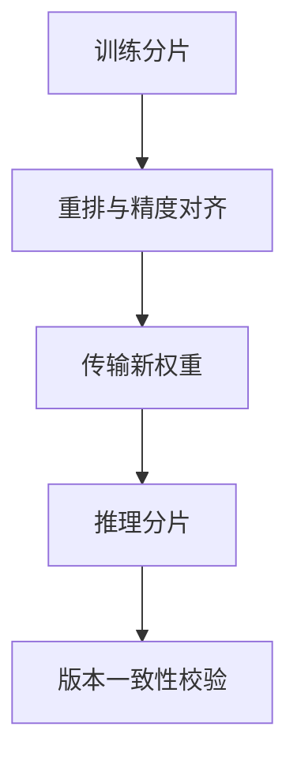

# Miles

一句话:Miles 是从 slime 分化而来、与 slime 共同演进的大模型后训练框架,以 SGLang 负责 rollout、Megatron-LM 承担大规模训练,另提供 FSDP2 路线降低新模型接入成本;它要解决的不只是“跑得快”,而是超大模型、MoE 和多轮 Agent RL 在长时间运行中的一致性、恢复性与可观测性。

> **对象类型**:动态对象
>
> **动态状态卡**
> - **最近核对**:2026-09-08
> - **核对范围**:GitHub Releases 的最新且首个版本化发布为 `v0.1.0`(2026-08-18);官方文档与 README 跟随活跃演进的 main,不保证当日 main 能力全部属于该稳定版。
> - **稳定定位**:SGLang + Megatron-LM 是大模型与复杂并行的主路线;FSDP2 是保留 HuggingFace 原生实现的快速接入/数值对照路线,不是大规模主路线的等价替代。
> - **当前状态**:官方称已支持同步/全异步 RL、LLM/VLM、LoRA、低精度、NVIDIA 与 AMD GPU;但完整能力受模型、后端、精度、并行方式与硬件组合限制,选型必须以官方已验证 recipe 为起点。
> - **一手来源**:[官方仓库](https://github.com/radixark/miles)、[`v0.1.0` Release](https://github.com/radixark/miles/releases/tag/v0.1.0)、[官方文档](https://miles.radixark.com/docs)、[官方 v0.1 技术博客](https://www.lmsys.org/blog/2026-08-18-miles-v0-1)。

## 一、从 slime 到 Miles:继承的是骨架,分化的是目标

Miles 的 README 明确说它 **fork 自 slime,并与 slime 共同演进**。因此两者不是完全无关的竞品,而是同一设计家族的两个动态分支。

共同骨架可以压缩成一个环:

**继承的核心**是让成熟引擎做擅长的事:SGLang 生成,Megatron-LM 训练,中间层处理数据、调度和权重更新。这一点的详细背景见 slime 篇。

**分化的核心**是 Miles 更明确地把“生产级长跑”当成产品边界:

| 维度 | slime 的稳定题眼 | Miles 目前的重心 |
| --- | --- | --- |
| 核心组合 | SGLang + Megatron 的 native 连接 | 保留该主路线,增加 FSDP2 后端 |
| 扩展目标 | 低抽象、透传上游能力 | 再加上清晰接口、端到端 recipe 和可运维性 |
| 主要压力 | 生成长尾、资源放置、权重同步 | 再往前推到超大 MoE、低精度、故障恢复和多硬件 |
| 正确性 | 训推 logprob 对齐与运行验证 | 进一步强调 token、MoE 路由和精度语义对齐 |

所以不要用“Miles 就是改名 slime”或“Miles 已完全替代 slime”下结论。正确说法是: **两者共用设计血缘,但 Miles 已将生产稳定性、多后端和超大模型端到端验证作为自己的显性主线。**

## 二、主干为什么仍是 SGLang + Megatron

### SGLang 固定 rollout 侧,是用深度换广度

Miles 的两种训练后端都对接 SGLang。这是一个有意的收窄:

- **收益**:可直接利用高吞吐生成、前缀缓存、多轮服务与 MoE 推理能力,也容易对权重更新和路由记录做深度联动;
- **代价**:你得接受 SGLang 的部署、升级和硬件适配边界,不能把 Miles 当成任意推理引擎都可无缝替换的通用壳。

### Megatron 是规模化主路线

官方文档的选型结论很明确:**100B+ MoE、跨机架训练,或必须依赖张量/流水线/上下文/专家并行才能装下的任务,选 Megatron。**

因为大模型的难题不只是“参数分片”,还包括层内矩阵、层之间、长序列和 MoE 专家的不同切分维度。Megatron 能把这些维度组合起来;代价是模型结构描述、checkpoint 转换、并行配置与精度 recipe 都更重。并行原理见 并行策略 篇,Megatron 的系统边界见 Megatron 篇。

### FSDP2 为什么仍然有必要

FSDP2 路线不是为了证明 Megatron 多余,而是回答另一个问题:**如果 HuggingFace 已经实现了新模型,能不能先按它原本的实现训起来?**

| 决策点 | Megatron 后端 | FSDP2 后端 |
| --- | --- | --- |
| 模型接入 | 需对齐 Megatron 的结构与权重布局 | 直接沿用 HuggingFace 实现 |
| 可用并行 | 多维模型并行 + 数据并行 | 以数据并行分片/复制为主 |
| 最强用途 | 超大模型、MoE、长序列、跨机架 | 新架构 bring-up、参考数值对照、中小规模 |
| 主要代价 | 转换和配置复杂 | 缺少 TP/PP/CP/EP,规模上限更低 |
| main 文档边界 | 官方 recipe 和最大模型主要所在 | 已支持部分 MoE 适配,但 LoRA 和深度磁盘 offload 等能力仍非对等 |

实务上,FSDP2 常适合先回答“模型和 RL 数值能否跑通”,Megatron 再回答“能否扩到目标规模”。但两者 checkpoint、并行语义不同,不能假设切后端只是换一个开关。FSDP2 的通用机制见 FSDP 篇。

## 三、超大模型的权重更新:搬的不只是字节

一轮 RL 后,训练侧的新策略必须变成生成侧可用的权重。问题在于两边布局不同:训练侧可能按多维并行切分,推理侧按 SGLang 的张量/专家并行布置;低精度时还带量化块和 scale。

因此权重更新有四层问题:

1. **语义**:参数是否对到正确的层、专家和量化 scale;
2. **布局**:训练分片如何重组成推理分片;
3. **传输**:共卡可以就地交接,分池要经过网络,端到端速度受传输拓扑与冗余数据影响;
4. **切换**:一批 rollout 到底对应哪一个权重版本,异步时尤其不能含糊。

Miles 在分池大规模上提供点对点 RDMA 快速路径,让训练 rank 只把目标推理 rank 需要的分片直接写到远端,避免广播多份重复数据。官方 `v0.1.0` Release 报告,在其 1T 参数测试中更新时间从 53.3 s 降至 7.2 s;这是**项目方特定模型、硬件、并行布局和网络下的证据,不是普适性能承诺**。

MoE 更难,因为“某层权重”还拆成多个专家,且训推的专家分组可不同。这使权重同步既是通信问题,也是模型语义问题。只监控“传了多少 GB”不够,还应验证首轮 logprob、权重版本和专家映射是否一致。

## 四、正确性主线:低精度、TITO 与 R3 在补三种缝

### 低精度的风险是“两个策略”

低精度不只是把 BF16 换成 FP8/FP4。RL 中同一策略同时存在于生成引擎和训练引擎,如果前者用低精度 kernel、后者用 BF16 重算,层层积累后 logprob 可能显著偏移;对 MoE,偏移还会翻转 top-k 专家选择。

Miles main 文档的方向是让 checkpoint 转换、训练前向、SGLang rollout 和在线权重导出共享同一精度契约,并保留高精度 master 权重与必要的高精度例外。这是用更复杂的 recipe 换吞吐和显存:

| 路线 | 收益 | 主要风险 |
| --- | --- | --- |
| BF16 训练 + 低精度 rollout | 新模型最容易站起来 | 训推前向不同,要额外看 logprob 偏差 |
| 统一 FP8 | 训推前向更对齐,通信/显存压力更低 | scale、高精度例外和硬件支持必须全链路相同 |
| Blackwell 原生低精度 | 进一步降低计算与存储成本 | main 文档对部分格式仍标 Beta,且硬件绑定更强 |

低精度选型必须同时回答:训练前向、反向、优化器 master、rollout、KV cache 和权重同步各是什么精度;只说“开了 FP8”没有可操作性。量化原理见 权重与激活量化 篇。

### TITO 补的是 token 语义缝

多轮 Agent 中,模型输出会经过消息解析、工具执行、模板渲染和上下文裁剪。如果每轮都把字符串重新 tokenize,训练侧看到的 token 不一定是生成时的 token。那么保存的 logprob、loss mask 乃至专家路由都失去准确上下文。

TITO(Token-In-Token-Out) 的问题解法是:**把推理引擎真正生成的 token ID、logprob 和附加元数据作为轨迹事实,后续回合只对新增消息编码,再拼成连续训练样本。**

代价是会话状态、分支/重试语义和模型模板适配变得更严格。当前 main 文档还明确标注:TITO 会话路径尚不支持图像/视频输入,分支式会话行为也带 Experimental 标记。因此“官方称支持 VLM”不等于“VLM 的每条 TITO 路径都成熟”。

### R3 补的是 MoE 专家路由缝

MoE 路由中的 top-k 是不连续选择:两个专家分数很接近时,很小的精度或 kernel 差异就能让 rollout 选专家 A,训练重算选专家 B。这不只是 logprob 有小误差,而是训练在另一条计算路径上求梯度。

R3(Rollout Routing Replay) 的解法是在 rollout 保留专家选择,训练前向重放同一路由。这把“希望两个引擎恰好做出同一决定”变成“显式传递决定”。

但 R3 不是免费的:

- 每个 token、层和 top-k 都要携带路由信息,长序列大 MoE 的数据量不可忽略;
- rollout 与训练必须对专家编号、层数和 token 位置有一致语义;
- 它修复的是“路由不同”,不会自动修复所有 attention、GEMM、量化和 batch 组织差异。

三者可以这样记:TITO 保证“是哪些 token”,R3 保证“走了哪些专家”,统一低精度契约尽量保证“两边怎么算”。它们是不同层的正确性措施,不能互相替代。

## 五、生产长跑:异步收益与恢复成本同时增长

完全异步让 rollout 和训练在分离 GPU 池上并行:生成侧持续产出,训练侧从有界缓冲中取数据。它能隐藏 Agent 环境、工具调用和长回复的尾延,但会带来三个新账本:

1. **陈旧度**:某条轨迹是用第几版权重生成的,训练时落后了多少;
2. **所有权**:一组 prompt 已离开数据源但尚未被训练接收时,失败后是等待、重放还是提交;
3. **外部副作用**:取消一次 Agent 请求时,沙箱或远程工具是否仍在工作,是否会晚到地返回重复结果。

这些不是简单的“重启进程”能解决的。生产级恢复要记录数据所有权、任务终态、训练接纳与权重版本,才能在不确定的远程结果下判断是否可以重放。Miles 仓库已提供 rollout 引擎健康检查与原地恢复方向;但当日 main 中关于完全异步数据所有权的设计仍有活跃议题与合并工作,因此不应把“官方已有 fault tolerance”扩大成“任意异步失败都可无损恢复”。

共卡与分池是另一组生产取舍:

| 形态 | 收益 | 代价 |
| --- | --- | --- |
| 共卡分时 | GPU 少时利用率高,权重可就地交接 | 训练/推理要反复 sleep、wake 和 offload,不能真正完全异步 |
| 分池并行 | rollout 与训练可重叠,故障域更清楚 | 需更多 GPU,每次权重更新经过网络 |

内存方面,Miles 主路线可把优化器状态放到 CPU,超出主机内存时还可流式放到 NVMe。这能把“装不下”变成“用存储带宽换容量”,但不会让代价消失:要检查 NVMe 带宽、寿命、拓扑一致性、checkpoint 时间与恢复后的重分片限制。显存账本见 显存管理与OOM 篇。

## 六、多硬件与选型边界

官方 main README 列出 NVIDIA H100/H200/B200/B300/GB200/GB300 以及 AMD MI300X/MI325/MI350/MI355X 等支持范围。这说明项目有跨 CUDA/ROCm 的明确方向,但“支持某 GPU”只是入口,不代表所有精度、kernel、模型与权重同步组合都对等。

多硬件验收应按组合而不是按品牌:

- **模型**:稠密还是 MoE,是否有非标准层;
- **后端**:Megatron 还是 FSDP2,所需并行维度是否完整;
- **精度**:格式是否被该 GPU 和训推 kernel 共同支持;
- **部署**:共卡还是分池,网络/RDMA/NVMe 是否符合 recipe 前提;
- **正确性**:token、logprob、MoE 路由、恢复与 checkpoint 是否在目标组合上真正验证。

### 适合的场景

- 已决定用 SGLang,且需要多轮/Agent 生成与训练深度联动;
- 训练 100B+ 或 MoE,需要 Megatron 多维并行、高速权重同步与长跑可观测性;
- 低精度 rollout/训练的偏差、MoE 路由不一致或 Agent token 重编码已成为真实问题;
- 新 HuggingFace 架构需要先用 FSDP2 做快速 bring-up 或数值基线,再决定是否投入 Megatron 规模化。

### 不适合或需谨慎的场景

- 必须随时切换多种推理引擎;因为 Miles 的差异化价值恰恰来自对 SGLang 的深绑定;
- 只有小模型、单机短实验,又不需要 Agent 会话、MoE 路由或生产恢复;此时系统复杂度可能大于收益;
- 想用 FSDP2 又依赖 TP/PP/CP/EP、LoRA 或 Megatron 专属的深度 offload;这是后端边界冲突,不是调个参数能弥补;
- 希望把官方规模/性能数字直接当作自己集群的容量承诺;这些是仓库/厂商证据,仍需在自己的模型、硬件和轨迹分布上复测。

最后的选型口诀是: **先看是否接受 SGLang,再看是否需要 Megatron 的规模,然后核对精度、异步、恢复和硬件组合有没有已验证 recipe。** 框架间的完整横向选型见 RL框架对比 篇。

## 面试考点串联

题库未检索到以 Miles 为 `topic` 第一段的真题,下列均为教学补全。

| 高频问法 | 本文哪一节 |
| --- | --- |
| **补充题**:Miles 和 slime 是什么关系?为什么不能简单说成改名或替代? | 一 |
| **补充题**:Miles 为什么坚持 SGLang + Megatron 主路线?这种收窄有什么代价? | 二 |
| **补充题**:已经有 Megatron 了,为什么还要 FSDP2?你会怎么分工? | 二(FSDP2) |
| **补充题**:1T 或大 MoE 每轮更新权重难在哪?为什么不是普通广播就完了? | 三 |
| **补充题**:低精度 RL 为什么比普通低精度训练更容易出正确性问题? | 四(低精度) |
| **补充题**:TITO 和 R3 分别补的是什么缝?它们能互相替代吗? | 四(TITO、R3) |
| **补充题**:全异步为什么提吞吐却让恢复更难?失败后怎么避免丢样本或重复训练? | 五 |
| **补充题**:官方说支持 NVIDIA 和 AMD,为什么还不能直接认定你的 recipe 能跑? | 六 |
| **补充题**:给你一个新 HuggingFace 模型和一个 100B+ MoE,怎么选 FSDP2 还是 Megatron? | 二、六 |

## 相关文献

- Miles 官方仓库(动态 main 状态、定位与支持矩阵) — https://github.com/radixark/miles
- Miles v0.1.0 Release(首个版本化稳定发布与官方自报数据) — https://github.com/radixark/miles/releases/tag/v0.1.0
- Miles 官方文档 — https://miles.radixark.com/docs
- Training Backends(Megatron 与 FSDP2 边界) — https://miles.radixark.com/docs/user-guide/training-backend
- Low Precision RL(训推精度契约与成熟度标记) — https://miles.radixark.com/docs/advanced/low-precision
- Agentic Rollout (TITO)(token 所有权、会话语义与当前限制) — https://miles.radixark.com/docs/user-guide/agentic-rollout
- Rollout Routing Replay (R3)(MoE 专家路由重放) — https://miles.radixark.com/docs/advanced/miles-router
- P2P Weight Transfer(分池权重更新) — https://miles.radixark.com/docs/advanced/p2p-weight-transfer
- Miles v0.1: Production-level Post-training(官方端到端设计与自报规模证据) — https://www.lmsys.org/blog/2026-08-18-miles-v0-1
- No Token Left Behind: Demystifying Token-In-Token-Out in Miles — https://www.lmsys.org/blog/2026-05-13-no-token-left-behind/
- Fully Async RL 官方文档(异步缓冲、陈旧度与评估) — https://miles.radixark.com/docs/user-guide/fully-async
- Fully Async 数据所有权与恢复设计议题(当日 main 的演进边界) — https://github.com/radixark/miles/issues/2254
