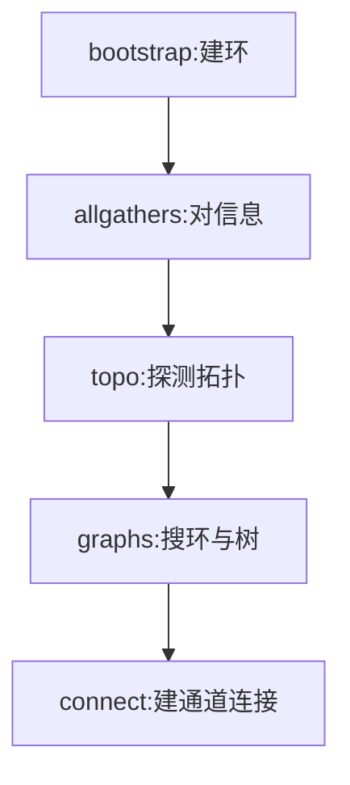

# NCCL

一句话:NCCL 是 NVIDIA 的 GPU 集合通信库,也是 `torch.distributed` 的默认后端——它真正值钱的地方不是"实现了 all-reduce",而是**替你把拓扑探出来、把算法选出来、把并行通道开出来**。本篇只讲这个库怎么用、怎么调、怎么排障;算子语义、Ring/Tree 算法、算法带宽与总线带宽的换算,一律见 集合通信 篇。

## 一、它解决的是"选择"问题,不是"实现"问题

自己按 Ring 的走法写一个 all-reduce 并不难,难的是下面这些**跟机器有关、跟消息大小有关、跟卡数有关**的选择题:这两张卡之间有 NVLink 吗,还是得绕 PCIe?跨机该用哪张网卡?这次的 buffer 是 4 KB 还是 4 GB,该走延迟优先的算法还是带宽优先的?开几条并行通路才既打满链路又不把 SM 全占了?NCCL 的价值就是**把这些选择自动做掉,而且在初始化时一次做完**,运行期只剩查表:

| 你给它 | 它自己决定 |
|---|---|
| 一共几张卡、我是第几张(world size / rank) | 机内哪些卡能直连、跨机走哪张网卡、rank 怎么排成环 |
| 这次通信的 buffer 地址、元素个数、数据类型 | 用 Ring 还是 Tree,用哪种传输协议 |
| 挂在哪条 CUDA stream 上 | 开几条并行通道、每条通道用多大缓冲、用多少线程 |

所以**排障的第一原则是:先看它自己选了什么,再决定要不要覆盖**。绝大多数"通信慢"的工单,最后查出来都是它被迫选了一条差路径(链路退化、网卡选错、拓扑认错),而不是它选错了算法。

一个必须先建立的边界:NCCL 只管"数据怎么在 GPU 之间流动"。哪种并行用哪个算子、通信量多少,见 并行策略 篇;链路本身有多快、机器怎么组网,见 GPU互联与组网 篇;MoE 的 all-to-all 为什么难,见 MoE并行与DeepEP 篇。

## 二、通信器:怎么建立,以及为什么最容易卡在这

### communicator 是什么

**communicator(通信器)是一组 rank 的通信上下文**——它记着这个组里有几个成员、我是第几个、每对成员之间走哪条路、缓冲区在哪。所有集合通信 API(`ncclAllReduce`、`ncclAllGather`、`ncclReduceScatter`、`ncclSend`/`ncclRecv` 等)都要传一个 communicator 和一条 stream 进去。

建立它只需要三样东西:**总共几个 rank、我是第几个 rank、一个所有人都认的唯一 ID**。唯一 ID 由某一个 rank(通常是 rank 0)调 `ncclGetUniqueId` 生成,是一个 128 字节的小结构,里面装着"到哪里找我"的地址信息;它必须**用 NCCL 之外的手段**广播给所有 rank(MPI 广播、文件、环境变量、PyTorch 的 rendezvous 都行)。拿到 ID 之后每个 rank 各自调 `ncclCommInitRank`,握手就在这一步完成。

三种建法,按场景选:

| 建法 | 形态 | 能跨机吗 |
|---|---|---|
| `ncclCommInitAll` | 一个进程管全部卡,不需要外部协调 | ❌ 只能单机 |
| `ncclCommInitRank` | 一个进程(或线程)一张卡,ID 靠外部广播 | ✅ 生产标配 |
| `ncclCommSplit` | 从已有通信器里按 color / key 切出子通信器 | ✅ 建 TP 组、DP 组用它 |

### 初始化都干了些什么



这五段不是我编的分法,而是 `NCCL_DEBUG=INFO` 打出的初始化耗时行本身就按它们分段计时——**init 慢在哪一段,日志直接告诉你**。各段在干什么:bootstrap 用一条普通 TCP 通路把所有 rank 串成环(这条通路只用来交换控制信息,不走数据);allgathers 让每个 rank 把自己的设备信息、本机网卡数这些广而告之;topo 探测本机的 PCIe 树、NVLink 连接和网卡位置;graphs 在探出来的拓扑图上搜环、搜树,顺便定下开几条通道;connect 才真正把每条通道的两端接起来。

### 为什么初始化最容易卡住

三个结构性原因,记住它们就能猜到八成故障:

1. **init 本身是一次隐式的全员同步**。少一个 rank 进来,其余所有 rank 就一起等——这是"卡住但不报错"的根源
2. **它依赖一条 NCCL 管不到的带外通路**。bootstrap 走的是普通 socket,选哪块网卡是猜出来的:先找名字带 `ib` 的,找不到就排除 `docker`、`lo`、虚拟网桥之后随便挑一块。猜错(挑到不可路由的虚拟网卡)就是跨机连不上的头号原因
3. **规模上去后 ID 广播本身会变慢**。大规模作业可以用 `ncclCommInitRankScalable` 一次传多个唯一 ID 来分摊这个开销

## 三、拓扑发现与算法选择:它怎么自己决定

### 探测出来的是一张图

NCCL 会把本机读成一张图:CPU、PCIe 交换机、GPU、网卡都是节点,链路是边;再算出任意两个节点之间的**路径类型**——是 NVLink 直连、同一颗 PCIe 交换机下、要过 CPU 的 root complex,还是跨 socket。路径类型决定了这一对能不能走卡间直连、能不能走 GPUDirect RDMA(带宽层级与这些路径的物理含义见 GPU互联与组网 篇)。怀疑它认错拓扑时,用 `NCCL_TOPO_DUMP_FILE` 把探测结果存成 XML 看一眼;必要时可以用 `NCCL_TOPO_FILE` 喂一份手写的进去(虚拟化环境里探不全时的常规做法)。

### 算法与协议:它比的是估算时间

在这张图上,NCCL 会为每种算法各搜一套通路,然后建一张 **算法 × 协议** 的耗时估算表,**挑估出来最快的那一格**。当前版本的算法有 Tree、Ring、CollNetDirect、CollNetChain、NVLS、NVLSTree、PAT 七种,协议有 LL、LL128、Simple 三种。

- **算法**:Ring 和 Tree 的机制与"按消息大小选"的判据见 集合通信 篇;CollNet 系是把规约卸载进网络设备,NVLS 系是用 NVSwitch 的组播/规约能力,PAT 是给 AllGather / ReduceScatter 的对数步数算法
- **协议**:可以理解成"这一趟数据用什么方式确认收到了"。**LL(low latency)把数据和标志位打包在一起发,收方看到标志位就知道数据到了,省掉一次同步,但有效载荷只占一半**;LL128 是同一思路的宽版本,开销小得多;Simple 靠内存屏障做同步,延迟最高但**带宽利用率最好**。所以粗略规律是:极小消息 LL、中等 LL128、大消息 Simple

### 通道:并行度旋钮,也是抢 SM 的那个旋钮

**一条通道(channel)是一条独立的数据通路**,多条通道同时跑才能把链路吃满。代价在 集合通信 篇已经点过:通信 kernel 是真的 kernel,**一条通道对应 GPU 上一个 thread block**,开几条就有几个 SM 被通信占走。所以通道数是个跷跷板:少了打不满带宽,多了抢走算力。硬上限是 64 条。这也是为什么控制通道数的环境变量新名字叫 `NCCL_MIN_CTAS` / `NCCL_MAX_CTAS`(CTA 就是 thread block)——旧名 `NCCL_MIN_NCHANNELS` / `NCCL_MAX_NCHANNELS` 仍可用,但已标记为不推荐。

### 你怎么覆盖它的决定

`NCCL_ALGO` 和 `NCCL_PROTO` 支持"全局 + 按算子覆盖"的语法,分号分段、逗号分列、`^` 表示排除:

- `NCCL_ALGO="ring;allreduce:tree"` —— 全局用 Ring,但 AllReduce 用 Tree
- `NCCL_PROTO="^LL128"` —— 什么都行,就是别用 LL128

**但这两个变量应该是你的最后一招,不是第一招。** 正确顺序永远是:先开 `NCCL_DEBUG=INFO` 看它选了什么、每条通道走的哪条路,确认"它选错了"之后再去覆盖。直接上手锁死算法,常见结果是把一个拓扑问题掩盖成一个性能问题。

## 四、关键环境变量

| 变量 | 干什么 | 默认 | 什么时候该动 |
|---|---|---|---|
| `NCCL_DEBUG` | 日志级别:`VERSION` / `WARN` / `INFO` / `TRACE` | 不输出 | **出任何问题的第一件事**:开到 `INFO` |
| `NCCL_DEBUG_SUBSYS` | 过滤 INFO 的子系统,`^` 排除 | `INIT,BOOTSTRAP,ENV` | 要看 `GRAPH` / `NET` / `TUNING` 细节时 |
| `NCCL_DEBUG_FILE` | 日志写文件,`%h` 填主机名、`%p` 填 pid | 打到 stdout | 多进程日志搅在一起时 |
| `NCCL_ALGO` / `NCCL_PROTO` | 强制算法 / 协议 | 自动选 | 已确认它选错了之后 |
| `NCCL_P2P_DISABLE` / `NCCL_P2P_LEVEL` | 关掉 / 限制卡间直连的最远距离 | 0 / 自动 | 二分法排查:P2P 是不是元凶 |
| `NCCL_SHM_DISABLE` | 关掉共享内存通路 | 0 | 容器 `/dev/shm` 太小报错时先验证 |
| `NCCL_IB_DISABLE` | 关掉 IB verbs,退回 socket | 0 | 验证"是不是 IB 侧配错了" |
| `NCCL_SOCKET_IFNAME` | bootstrap 走哪块网卡,`^` 排除、`=` 精确匹配 | 自动:先找 `ib*`,否则排除 `docker`/`lo`/虚拟网桥 | **跨机连不上的头号旋钮** |
| `NCCL_IB_HCA` | 用哪几张 IB 网卡,支持 `设备:端口`、`^` 与 `=` | 全部可用的 | 网卡多、要按 rail 绑定时 |
| `NCCL_NET_GDR_LEVEL` | GPUDirect RDMA 允许的网卡–GPU 最远距离 | 自动 | 确认 GDR 是不是被静默关掉了 |
| `NCCL_MIN_CTAS` / `NCCL_MAX_CTAS` | 通道数下限 / 上限(硬上限 64) | 自动 | 通信抢 SM 太狠,或带宽没打满 |
| `NCCL_BUFFSIZE` | 每条通道的收发缓冲大小 | 4 MiB | 基本不用动 |
| `NCCL_IB_TIMEOUT` / `NCCL_IB_RETRY_CNT` | IB 传输超时(约 $4.096\,\mu s \times 2^{\text{值}}$)与重试次数 | 20 / 7 | 大规模网络上偶发重试耗尽报错 |
| `NCCL_TOPO_DUMP_FILE` / `NCCL_TOPO_FILE` | 导出 / 导入拓扑 XML | 不导出 | 怀疑拓扑认错、或虚拟化环境探不全 |

> 上表默认值以 NCCL 2.30 为准,老版本可能不同;`NCCL_MIN_NCHANNELS` / `NCCL_MAX_NCHANNELS` 是 CTAS 那两个的旧名,仍可用但已不推荐。

**这张表最重要的一行是它没写的那行:绝大多数情况下,一个都不该设。** 环境变量是诊断工具和临时绕行手段,把一堆 `NCCL_*` 抄进启动脚本长期带着跑,等于把当时那台机器的故障固化进了配置。

## 五、怎么验证与压测

官方的压测工具是 **nccl-tests**(独立仓库),它按消息大小扫一遍,给出每个尺寸的耗时和两个带宽列:

```bash
# 单机 8 卡:从 8 B 扫到 8 GB,每档翻倍
./build/all_reduce_perf -b 8 -e 8G -f 2 -g 8

# 多机 8×8:一进程一卡,这时 -g 必须是 1
mpirun -np 64 -N 8 ./build/all_reduce_perf -b 8 -e 8G -f 2 -g 1
```

`-b` / `-e` 是起止消息大小,`-f` 是每档的倍数,`-g` 是**每个进程管几张卡**——多进程时写成 8 是新手最常见的错,总 rank 数会变成进程数乘以它。

怎么读结果:**算法带宽(algbw)与总线带宽(busbw)的定义和换算系数见 集合通信 篇**,这里只说读法。三条:

1. **看大消息段的平台值,不要看小消息段**。小消息 busbw 低是物理规律(延迟主导),不是故障
2. **拿平台值去和链路标称比,而且要对齐口径**——NVLink 标称是双向聚合,busbw 是单向口径(口径怎么折算见 GPU互联与组网 篇)
3. **`#wrong` 列非零就不是性能问题了**,那是结果算错了,先查硬件与版本

### "只测出标称的一半",该怀疑什么

| 怀疑 | 怎么确认 |
|---|---|
| 口径搞错了(拿双向标称比单向实测) | 先把标称值折成每卡单向再比 |
| 链路退化:本该 NVLink 的走了 PCIe / 共享内存 | INFO 日志里通道连接那几行走的是哪条路;再对一遍 `nvidia-smi topo -m` |
| GPUDirect RDMA 没生效 | INFO 里连完环那一行会报 GDR 开没开 |
| 通道数不够 | INFO 里有通道数汇总行;把 `NCCL_MIN_CTAS` 抬一档看看有没有变化 |
| rank 编号与物理拓扑错位 | 环被迫反复跨机;绑定关系见 GPU互联与组网 篇 |
| 网卡数或收敛比本来就不够 | 属于组网问题,见 GPU互联与组网 篇 |

## 六、排障清单

本篇最有用的一节。统一前提:**先 `NCCL_DEBUG=INFO`**,不开日志的排查全是猜。

| 症状 | 先查什么 | 常见原因 |
|---|---|---|
| 初始化就卡住,所有 rank 都不动 | 每个 rank 的日志有没有初始化开始/完成两行;缺完成行的是哪些 | 有 rank 压根没进来(启动器的 world size 和实际进程数对不上);各 rank 的集合调用顺序不一致;两个进程抢同一张卡 |
| 卡在 bootstrap 阶段(跨机) | 初始化耗时行里 bootstrap 那一段;日志里 `NCCL_SOCKET_IFNAME` 实际选中了哪块网卡 | 自动选到了 `docker0` / 虚拟网卡 / 不可路由地址;防火墙挡了 bootstrap 端口;主机名解析各机不一致 |
| 跨机连不上,或报 IB 相关错误 | 日志里用的是哪个网络后端;通道连接行走的是 IB 还是 socket | 容器没挂 IB 设备;`NCCL_IB_HCA` 选错;RoCE 下 GID 配错。**二分法**:`NCCL_IB_DISABLE=1` 能通就说明问题在 IB 侧 |
| 容器里报共享内存不足 | `/dev/shm` 的大小 | Docker 默认只给 64 MB,要 `--shm-size`;`NCCL_SHM_DISABLE=1` 可以先验证是不是它 |
| 性能远低于预期 | 每条通道走的是直连、共享内存还是网络;GDR 开没开;通道数 | 链路退化(ACS 没关 / IOMMU / 容器隔离把 P2P 挡了);GDR 失效;rank 与拓扑错位;消息太碎 |
| 跑了几小时才偶发 hang | PyTorch watchdog 报的超时里少了哪个 rank 的哪次集合;`ncclras` 查作业状态 | 各 rank 调用顺序分叉(某个 rank 走了不同分支、或少跑一次);一张卡降频掉队(straggler,见 集合通信 篇);网络瞬断后 IB 重试耗尽 |
| 单线程管多卡时互相等死 | 多 rank 的调用有没有包在 group 里 | 一个线程里给多个 rank 依次下发时,必须包在 `ncclGroupStart` / `ncclGroupEnd` 之间;成对的 `ncclSend` / `ncclRecv` 不包 group 也会互等 |

两个值得单独记的工具:

- **RAS**:NCCL 自带一个后台监控线程(默认开启),在本机监听一个固定端口;随库安装的 `ncclras` 命令行连上去就能查整个作业的健康状态——**hang 住时它是少数还能说话的通道**
- **拓扑对照**:`nvidia-smi topo -m` 打出的矩阵,和 NCCL 日志里每条通道实际走的路径**对着看**,是判断"链路有没有退化"最快的办法

## 七、和 PyTorch 的关系

`torch.distributed` 用 `backend="nccl"` 时,底下就是本篇讲的这个库;每个进程组(process group)对应一个 NCCL 通信器,`new_group` 建子组就是再建一个通信器(或从父通信器切分)。几条必须知道的:

| 事项 | 说明 |
|---|---|
| **一进程一卡** | 官方文档写死了:用 nccl 后端时**每个进程必须独占它用的 GPU**,共享会 deadlock 或直接报 invalid usage |
| **必须先绑卡** | 建通信器前要 `torch.cuda.set_device(local_rank)`。不绑,官方的说法是"会导致意外的 hang";底层原因是通信器要绑定到当前设备,不设就都落到 0 号卡上 |
| **懒初始化** | 默认要等第一次集合通信才真正建通信器,所以初始化的错会晚一步才炸;`init_process_group(device_id=...)` 可以让它立刻建好,报错点前移 |
| **超时** | `init_process_group` 的默认超时:**nccl 后端 10 分钟**,其他后端 30 分钟 |
| **看门狗** | `TORCH_NCCL_ASYNC_ERROR_HANDLING` 默认开着(值 3),超时后拆掉进程而不是让它无限挂着 |
| **查 hang 的两件套** | `TORCH_NCCL_DESYNC_DEBUG=1` 报出各 rank 卡在哪次集合;Flight Recorder(`TORCH_NCCL_TRACE_BUFFER_SIZE`,配合 `TORCH_NCCL_DUMP_ON_TIMEOUT`)记录最近若干次集合操作,dump 出来能看出谁没进来 |

还有一条容易忽略的:通信下发在哪条 stream 上、跟计算怎么重叠,是 PyTorch 侧的事(DDP 的分桶、FSDP 的 prefetch),机制见 集合通信 篇,stream 与 event 的语义见 CUDA流与异步执行 篇。NCCL 内部具体怎么实现本篇讲的这些机制,见开源解读模块。

## 面试考点串联

| 高频问法 | 本文哪一节 |
| --- | --- |
| NCCL 到底替你做了什么?如果自己写一个 all-reduce,会缺哪几块? | 一(拓扑 / 算法 / 通道三件自动决策) |
| 通信器是怎么建起来的?为什么初始化这一步特别容易卡住? | 二(rank + world size + 唯一 ID;隐式全员同步 + 带外通路) |
| 多机训练一启动就卡在初始化,你怎么查? | 二 + 六(看初始化开始/完成行、bootstrap 耗时、选中了哪块网卡) |
| NCCL 怎么决定用哪个算法、开几条通道?你什么时候该去覆盖它的决定? | 三(代价模型比估算时间;先看它选了什么再说) |
| 通道数是干什么用的?开多开少各有什么影响? | 三(一条通道占一个 thread block,少了打不满、多了抢 SM) |
| nccl-tests 测出来只有标称带宽的一半,你会怀疑什么? | 五(口径 / 链路退化 / GDR / 通道数 / 拓扑错位) |
| 训练跑了几小时突然 hang 住,日志什么都没有,你有哪些手段? | 六 + 七(desync debug、Flight Recorder、`ncclras`、straggler) |
| 用 nccl 后端为什么一定要一个进程绑一张卡?不绑会怎样? | 七(独占 GPU 否则 deadlock;不 `set_device` 会 hang) |


延伸阅读顺序:集合通信(算子与算法原理)→ GPU互联与组网(链路与拓扑)→ 本篇(库怎么用、怎么调、怎么排障)→ 性能分析与Profiling(怎么量出通信开销)。

## 相关文献

- NCCL 源码仓库(算法/协议名单、环境变量默认值的一手来源;本篇对照 2.30 版本)— https://github.com/NVIDIA/nccl
- NCCL User Guide — Environment Variables — https://docs.nvidia.com/deeplearning/nccl/user-guide/docs/env.html
- NCCL User Guide — Troubleshooting(初始化 hang、网络接口、共享内存、RAS)— https://docs.nvidia.com/deeplearning/nccl/user-guide/docs/troubleshooting.html
- NCCL User Guide — Creating a Communicator(唯一 ID 与三种建法)— https://docs.nvidia.com/deeplearning/nccl/user-guide/docs/usage/communicators.html
- NCCL User Guide — Point-to-point communication(group 语义与 send/recv 配对)— https://docs.nvidia.com/deeplearning/nccl/user-guide/docs/usage/p2p.html
- nccl-tests(压测工具与命令行参数)— https://github.com/NVIDIA/nccl-tests
- nccl-tests — PERFORMANCE.md(algbw / busbw 的定义与逐算子系数)— https://github.com/NVIDIA/nccl-tests/blob/master/doc/PERFORMANCE.md
- PyTorch 文档 — Distributed communication package(nccl 后端约束、默认超时、`device_id`)— https://docs.pytorch.org/docs/stable/distributed.html
- PyTorch 文档 — TORCH_NCCL 环境变量(watchdog、desync debug、Flight Recorder)— https://docs.pytorch.org/docs/stable/torch_nccl_environment_variables.html
- Doubling all2all Performance with NCCL 2.12(PXN:跨 rail 流量怎么被折回同 rail)— https://developer.nvidia.com/blog/doubling-all2all-performance-with-nvidia-collective-communication-library-2-12/
- Demystifying NCCL: An In-depth Analysis of GPU Communication Protocols and Algorithms(2025;LL / LL128 / Simple 三协议的第三方实测分析)— [arXiv:2507.04786](https://arxiv.org/abs/2507.04786)
