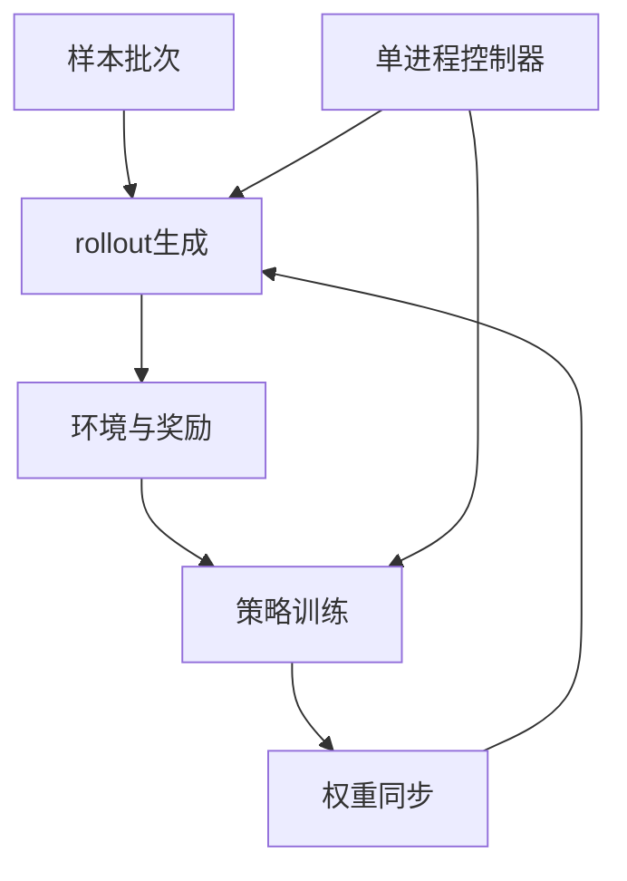

# NeMo-RL

一句话:NeMo-RL 是 NVIDIA 面向大模型后训练的**分布式编排层**——它不试图用一个引擎包办所有计算,而是把训练、rollout 生成、奖励环境和权重同步接成一条能从单卡扩到多机集群的闭环。

> **对象类型**:动态对象
>
> **动态状态卡**
> - **最近核对**:2026-09-08
> - **核对范围**:稳定版以 2026-07-29 发布的 v0.7.0 tag 与 release 容器为准;`main` 与 nightly 文档只用来说明稳定版之后的演进,不反推为 v0.7 保证
> - **稳定定位**:NeMo Framework 下的开源多模态模型后训练库,核心价值是编排不同 RL Actor,而不是另造训练内核或推理引擎
> - **当前状态**:v0.7 已有 DTensor/FSDP2 与 Megatron-Core 双训练后端、多种生成后端、同步与异步 RL、多轮 NeMo Gym 链路,并给出单机、多机 Slurm 与 Kubernetes 路径
> - **一手来源**:官方文档、NVIDIA-NeMo/RL 仓库、v0.7.0 release;功能与性能数字均按 NVIDIA / 仓库自报证据看待

阅读边界:RL 算法公式见 PPO 篇、GRPO 篇与 RLHF与RM 篇;分片和并行原理见 FSDP 篇、Megatron 篇与 并行策略 篇;横向选型见 RL框架对比 篇。本篇只回答 **NeMo-RL 为什么存在、怎样分层、双后端怎么选、适合什么团队**。源码组织、内部函数、内部参数和逐行调度不在本文范围内。

## 一、为什么训练框架之上还需要一层

一次在线后训练至少同时出现四类角色:

- **策略训练**:做前向、反向和优化器更新,追求训练吞吐与显存可承受;
- **rollout 生成**:快速采样回答,追求批处理吞吐与 KV Cache 利用率;
- **奖励或环境**:判题、调用工具、推进游戏或软件环境,常在 CPU 或外部服务上;
- **辅助模型**:PPO 的价值模型、奖励模型、参考模型或蒸馏教师。

这些角色的最佳实现并不相同。训练侧希望按 FSDP2 或多维并行切开参数与状态,生成侧希望把显存留给 KV Cache,环境侧甚至可能依赖另一套 Python 包。**如果只选一个训练引擎,仍然没人负责把角色放到设备上、隔离依赖、按顺序调用、传数据和更新生成权重。** NeMo-RL 补的正是这层。

官方把问题归成四件事:**资源分配、进程隔离、控制协调、数据通信**。它们看起来不像算法,却决定同一段训练逻辑能否从实验脚本长成集群任务。



图里控制器描述“先做什么、数据流向哪里”,各角色内部仍由自己的分布式后端并行执行。**上层集中表达工作流、下层分布式完成重活**,比让每个进程各自维护整条 RL 状态机更容易修改算法与角色组合。

## 二、总体设计:围绕角色建立四层抽象

NeMo-RL 用 Ray 管资源和进程,由一个单进程控制器描述训练闭环。这里的“单进程”只指**控制面只有一份主流程**,不是说计算只用一个进程或一张卡。

| 高层抽象 | 对上层承诺什么 | 为什么要单独成层 |
|---|---|---|
| **训练 / Policy** | 接收批次,算概率与损失,更新参数,存取状态 | 隐藏 DTensor 与 Megatron 的并行布局差异 |
| **Generation** | 接收 token,返回生成 token、长度与概率等统一结果 | rollout 引擎可替换,算法循环不随引擎重写 |
| **Environment** | 接收动作或回答,返回观测、奖励和结束状态 | 数学判题、代码沙箱、工具 Agent 不是同一种环境 |
| **Weight Sync** | 把最新训练权重交给生成侧,并确认版本已更新 | 训推布局、拓扑和传输方式会变化,算法不该知道这些细节 |
| **资源与进程组** | 给角色划 GPU/CPU,支持独占或共卡分时,隔离运行环境 | 防止依赖和全局状态冲突,也让拓扑能独立调整 |
| **数据面** | 在控制器、队列或集合通信之间传批次 | 小规模“经控制器传”与大规模“直接传”需要不同通路 |

这套分层最重要的性质是:**算法依赖能力契约,不依赖具体演员。** 换训练后端时,rollout、环境与训练主流程不必一起改;换环境时,训练后端也不需要理解工具协议。

但抽象不是免费的。多一层就多一层配置、生命周期和故障边界。单机小实验如果只需一次 SFT,直接使用 PyTorch 或 Transformers 通常更短;NeMo-RL 的收益在**多角色在线闭环**开始出现后才明显。

## 三、双训练后端:同一工作流,两种工程甜点位

NeMo-RL 没有强迫所有模型走同一条训练路径,而是保留两套互补后端。

| 维度 | **DTensor / FSDP2 路线** | **Megatron-Core 路线** |
|---|---|---|
| 上层接入 | 通过 NeMo AutoModel 接 Hugging Face 生态 | 通过 NeMo Megatron Bridge 接 Megatron-Core |
| 核心并行 | PyTorch 原生 DTensor、FSDP2,并可组合 TP/CP/SP 等 | Megatron 的 TP/PP/CP/SP/EP 与数据并行分片 |
| 甜点位 | 模型支持面广、PyTorch 心智模型直接、适合快速研究 | 超大模型、MoE、长上下文和多维并行已成为硬需求 |
| 初始权重 | 直接从 Hugging Face checkpoint 初始化 | 先把 Hugging Face 权重转换成 Megatron 布局 |
| 代价 | 极端规模上的模型专门优化与覆盖可能晚于 Megatron 路线 | 依赖、checkpoint 转换和并行配置更重,更绑定 NVIDIA 训练栈 |

### DTensor / FSDP2 为什么适合起步

这条路把每个参数表示为带布局信息的 DTensor,FSDP2 再沿数据并行维切参数、梯度和优化器状态。**它的优势不是“只能跑小模型”,而是先保留 PyTorch 与 Hugging Face 的熟悉接口,再按需要加并行。** 单卡时分布式维度可以退化;多卡时再逐步加入 FSDP2、张量并行或上下文并行。

多机上还可以用混合分片把重的参数 AllGather / 梯度 ReduceScatter 尽量关在节点内,跨节点只复制梯度。机制见 FSDP 篇;对 NeMo-RL 来说,重点是上层闭环不因这次拓扑调整而改写。

### Megatron-Core 为什么仍然不可替代

当模型大到必须同时切张量、流水线、上下文与专家,问题不再是“能不能开 FSDP”,而是**多种并行维怎样协同、怎样让通信与计算重叠**。Megatron-Core 已经把这些能力做成专用训练地基,NeMo-RL 直接复用,不在编排层重造一遍。

Megatron Bridge 负责 Hugging Face 与 Megatron 世界之间的模型配置和权重转换。好处是已有 HF checkpoint 仍能作为统一入口;代价是第一次转换需要共享存储、额外空间和严格匹配的依赖版本。

### 选择口诀

**先用 DTensor 路线验证模型、数据与算法闭环;当模型尺寸、MoE 或长上下文迫使你使用多维并行时,再选择 Megatron 路线。** 这不是性能榜结论,而是复杂度预算:能用更简单的路径解决就不提前承担 Megatron 的配置面;确实需要大规模能力时,也不逆着成熟后端自己拼。

## 四、生成与权重同步:为什么要把“采样”拆出去

训练引擎能做前向,不等于适合 rollout。在线 RL 会生成远多于普通训练评估的 token,所以连续批处理、KV Cache 管理和高吞吐调度会直接决定总训练时间。NeMo-RL 用统一生成接口隔离这件事,稳定版可在 vLLM、SGLang 与 Megatron 原生生成等路径之间选择;具体组合变化快,部署前应重查目标版本的支持矩阵。

统一接口交换的是 **token 与张量化结果**,而不是让训练端和生成端各自再分词一次。因为 tokenizer 版本或模板一旦不一致,同一段文字可能变成不同 token 序列,训练概率就不再对应采样动作。

### 共卡与分卡是两种物理条件

| 拓扑 | 怎么运行 | 优点 | 代价 |
|---|---|---|---|
| **共卡分时** | 训练和生成轮流占同一组 GPU,阶段切换时释放或迁移不用的状态 | 卡少时利用率高,不用永久切两组资源 | 每轮有卸载、唤醒与显存重建开销;不能真正同时跑 |
| **分卡并行** | 训练池与生成池各占一组 GPU | 可流水或异步,长尾 rollout 不必让训练完全停住 | 卡数与网络要求更高,还要处理样本陈旧度 |

### 权重同步为什么值得独立抽象

策略更新后,生成引擎必须尽快拿到新权重。困难不是一条 `copy`:

1. 训练侧可能按 FSDP2 或 Megatron 多维切分,生成侧却按另一套张量并行布局保存;
2. 共卡时可利用进程内或显存共享路径,分卡时要跨进程组做集合通信;
3. 大模型不能总先拼出一份完整权重再复制,否则中间峰值可能直接 OOM;
4. 同步完成还要恢复生成服务,并保证所有生成 worker 看到一致的权重版本。

因此 NeMo-RL 把权重同步从训练接口和生成接口里拆出来:上层只表达“现在刷新策略”,底层再按后端与拓扑选择共享显存、集合通信或 Megatron 原生重分片等路径。**这层解耦让算法代码不用为每一种训推组合写分支**,也是后续做非共卡异步 RL 的前提。

## 五、从一张卡到集群:扩的是资源图,不是算法脚本

官方设计目标是让同一套角色接口从 1 张 GPU 扩到约 1000 张 GPU。这里应理解为**架构目标与 NVIDIA 自报能力**,不是第三方证明任意任务都能线性扩展到千卡。

扩展过程可以按三档理解:

| 规模 | 常见形态 | 先解决什么 |
|---|---|---|
| **单卡 / 单机少卡** | 训练与生成共卡分时,环境主要用 CPU | 先验证数据、奖励和 loss 正确,避免分布式噪声 |
| **单机多卡** | 训练角色内部开 FSDP2 或模型并行,仍可共卡 | 显存峰值、角色切换、批次长度方差 |
| **多机集群** | 训练池与 rollout 池可独立分配,角色各有进程组 | 跨机通信、共享 checkpoint、网络拓扑与故障恢复 |

Ray 的虚拟资源组把物理集群切成角色看到的“逻辑小集群”;同一组 GPU 可以只跑一个角色,也可由多个角色分时共享。控制器负责建立这些组与通信通道,角色内部仍使用 PyTorch 或 Megatron 的分布式机制。

官方给出本地工作站、Slurm 与 Kubernetes 的启动路径。**这说明它覆盖多种部署入口,不等于调度器差异被完全消除。** 真到多机仍要自己保证容器一致、共享存储可见、网卡与 NCCL 配置正确,并为日志、checkpoint 与失败重启设计持久化。

## 六、多轮 Agent 与 NeMo Gym:把环境从训练进程里拔出来

单轮数学题只需“生成一次→判一次”,Agent 训练却是“观察→调用工具→拿结果→继续生成”的多步循环。若把浏览器、代码沙箱、游戏或外部服务硬塞进训练 worker,依赖冲突、超时和状态管理会迅速污染训练进程。

NeMo Gym 的做法是把训练环境做成 **HTTP 服务**。它本身在 CPU 上运行,不持有推理引擎或 GPU 权重;NeMo-RL 把 vLLM 生成侧暴露成 OpenAI 兼容服务,Agent 经由 Gym 请求模型、调用资源,最后把完整轨迹和奖励交回训练闭环。

```text
NeMo-RL 控制器
  ├─ 训练侧：更新策略
  ├─ vLLM：提供模型调用
  └─ NeMo Gym：Agent ↔ 工具/环境
```

这层切分带来三项直接收益:

- **环境与模型解耦**:环境只依赖 HTTP 契约,不用知道训练权重怎样分片;
- **多轮轨迹成为一等数据**:工具结果、下一轮观察和最终奖励能按一次 rollout 收集;
- **权重刷新仍由 NeMo-RL 负责**:Gym 不需要参与训推布局转换。

截至 v0.7,官方文档明确这条 Gym 路径服务于 GRPO 与 on-policy distillation;v0.7 release 还公开了 Nemotron 3 Super 的 RLVR 与 SWE 多步训练配方。**这只能证明官方仓库有可复现配方与供应商使用证据,不能当成所有 Agent 环境都稳定可跑的第三方验收。**

代价也很现实:Gym 与 NeMo-RL 共用 Ray 集群,Python 与 Ray 版本需要对齐;HTTP、工具服务和环境进程又增加了超时、重试、日志体积与安全隔离问题。真正接代码执行或外部工具时,沙箱和权限边界仍需另行设计。

## 七、NVIDIA 全家桶:省集成时间,也增加版本耦合

NeMo-RL 的便利来自一条已经接好的链:

| 环节 | NVIDIA 栈给出的现成路径 | 你承担的耦合 |
|---|---|---|
| 模型接入 | AutoModel 接 HF;Megatron Bridge 做格式转换 | 模型支持速度取决于两层适配是否同步 |
| 大规模训练 | Megatron-Core、Transformer Engine、NCCL | 高性能路径强依赖 NVIDIA GPU、CUDA 与配套版本 |
| rollout | 官方容器集成 vLLM、SGLang 等 | 上游引擎升级可能改变兼容矩阵 |
| Agent 环境 | NeMo Gym 与训练配方接通 | 又多一个服务与依赖生命周期 |
| 部署 | NGC 容器固定 CUDA 和主要组件版本 | 自行混装版本的自由度变小,镜像也更重 |

v0.7 release 容器把 NeMo-RL 0.7.0、NeMo Gym 0.4、AutoModel 0.3、Megatron Bridge 0.5、PyTorch 2.11、vLLM 0.20、SGLang 0.5.12 与 Ray 2.55.1 放在同一镜像里,并以 CUDA 13 为主要支持版本。特别值得注意的是,该 release 表里 Megatron-Core 仍标为通过 Bridge 使用的 `main`。**稳定的是这整个已配平容器组合,不代表其中每个上游依赖都各自钉在长期稳定 tag。**

所以官方容器的真正价值不是“少打几条安装命令”,而是提供一组已经一起测试的依赖解。反过来,如果组织已有自己的 PyTorch、Ray、推理引擎和镜像发布节奏,引入整套 NeMo 栈会把升级与排障边界扩大。

## 八、什么时候适合,什么时候不适合

| 场景 | 判断 | 原因 |
|---|---|---|
| 已经使用 NVIDIA GPU、Megatron / NeMo,要把大模型 RL 做到多机 | **适合** | 训练、生成、权重转换、容器和集群路径已经接好 |
| 先用 HF 模型在少量 GPU 验证,成功后可能扩到 MoE / 长上下文 | **适合** | DTensor 起步、Megatron 扩展,上层闭环可以保持一致 |
| 多轮工具 Agent,需要把环境和训练进程隔离 | **适合** | NeMo Gym 提供 HTTP 环境边界与现成多轮链路 |
| 需要同步 / 异步、共卡 / 分卡之间做系统实验 | **适合但要实测** | 抽象允许换拓扑,但吞吐收益取决于模型、长度分布和网络 |
| 只是单模型 SFT 或离线 DPO,不需要 rollout 与环境 | **通常过重** | 多角色编排的主要收益没有出现 |
| 目标硬件不是 NVIDIA GPU,或必须维持纯上游 PyTorch 的轻依赖 | **不合适** | 高性能路径和官方镜像围绕 CUDA / NVIDIA 栈设计 |
| 团队已经深度绑定另一套调度、训练与推理栈 | **谨慎** | 替换的不只是训练库,还涉及 Ray、权重格式和运行环境 |
| 需要每个新模型在发布当天都自动覆盖所有后端组合 | **不能默认** | DTensor、Megatron 与生成端的模型支持并非天然同步 |

最后的选型顺序应是:**先问是不是在线多角色闭环,再问模型需要哪种训练并行,再决定共卡或分卡,最后才看算法名单。** GRPO、PPO 或某个新变体的“有无”很容易变化;角色编排、双训练后端和 NVIDIA 栈耦合才是 NeMo-RL 更稳定的设计身份。

## 面试考点串联

题库尚无以 NeMo-RL 为第一 topic 的真题,以下均为教学补充问法。

| 高频问法 | 本文哪一节 |
|---|---|
| **补充题**:已经有 FSDP、Megatron 和 vLLM,为什么还需要 NeMo-RL 这一层? | 一(四类角色与四项编排职责) |
| **补充题**:NeMo-RL 的单进程控制器是不是只能用一张卡?计算面怎样扩展? | 二 + 五(控制面一份,角色内部仍分布式) |
| **补充题**:DTensor/FSDP2 与 Megatron-Core 两条训练后端怎么选?为什么不统一成一个? | 三(生态与规模甜点位、复杂度取舍) |
| **补充题**:训练和 rollout 为什么要用不同引擎?权重同步难在哪? | 四(布局、拓扑、显存峰值与一致版本) |
| **补充题**:共卡与分卡分别适合什么资源条件?异步为什么通常要求分卡? | 四(物理拓扑与并发条件) |
| **补充题**:NeMo Gym 在 Agent RL 里负责什么?为什么不让环境直接持有模型? | 六(HTTP 环境、工具循环与权重解耦) |
| **补充题**:NVIDIA 全家桶给 NeMo-RL 带来什么便利,又带来什么锁定? | 七(配平容器与版本耦合) |
| **补充题**:什么项目不该选 NeMo-RL? | 八(离线单角色、非 NVIDIA 硬件、既有异构栈) |

延伸阅读顺序:RL框架对比(先定系统需求)→ 本篇(NeMo-RL 的角色编排与边界)→ FSDP / Megatron(训练后端)→ vLLM / SGLang(rollout 引擎)→ AgenticRL(多轮算法侧问题)。

## 相关文献

- NVIDIA NeMo-RL 官方文档 — https://docs.nvidia.com/nemo/rl/latest/index.html
- NeMo-RL Overview(定位、Ray 资源管理、DTensor 与 Megatron 双路线)— https://docs.nvidia.com/nemo/rl/latest/about/overview.html
- Design and Philosophy(RL Actor、资源/隔离/协调/通信四项职责与单进程控制器)— https://docs.nvidia.com/nemo/rl/latest/design-docs/design-and-philosophy.html
- Training Backends(DTensor/FSDP2 与 Megatron 的选择、HF checkpoint 入口)— https://docs.nvidia.com/nemo/rl/latest/design-docs/training-backends.html
- Generation Interface(统一 token 级生成契约与生成后端)— https://docs.nvidia.com/nemo/rl/latest/design-docs/generation.html
- NeMo Gym Integration(多步、多轮 rollout 的 HTTP 环境架构)— https://docs.nvidia.com/nemo/rl/latest/design-docs/nemo-gym-integration.html
- Set Up Clusters(Slurm 与 Kubernetes 集群路径)— https://docs.nvidia.com/nemo/rl/latest/cluster.html
- NVIDIA-NeMo/RL 官方仓库 — https://github.com/NVIDIA-NeMo/RL
- NeMo-RL v0.7.0 release(稳定版日期、容器依赖、PPO、异步与 Nemotron 3 Super 配方)— https://github.com/NVIDIA-NeMo/RL/releases/tag/v0.7.0
