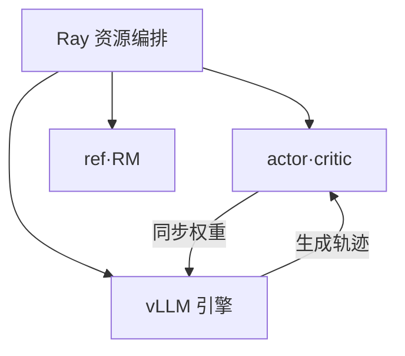

# OpenRLHF

一句话:**把 RLHF 全流程(SFT → 训 RM → RL)打包成开箱即用、可复现的一套开源实现**——Ray 负责把角色摆到卡上,vLLM 负责生成,DeepSpeed 负责训练,把"四个模型 + 两种引擎"这件麻烦事收敛成一条命令行。本篇只讲它的架构与用法,RL 算法本身见 PPO 篇与 GRPO 篇。

## 一、它是什么

2023 年开源,是较早把 RLHF 三阶段做成端到端可跑实现的开源框架之一;项目自述为**第一个建立在 Ray + vLLM 之上的 RLHF 框架**,论文标题直接把定位写成"易用、可扩展、高性能",README 也把可训规模写在 70B 量级。它的取向很明确:**照着示例脚本改参数就能复现一条 RLHF 曲线**,源码短到能当教材读——项目自述被高校 NLP 课程用作 RLHF 教学案例。

技术栈是四件成熟组件的拼装,基本不自造轮子(以本地源码 0.10.3 版核实,**版本口径随发布演进**):

| 组件 | 在这里干什么 | 本地核实的版本口径 |
| --- | --- | --- |
| Ray | 分布式调度:决定哪个角色落在哪张卡 | 2.55 |
| vLLM | rollout 生成引擎(见 vLLM 篇) | 0.19,可选依赖 |
| DeepSpeed | 训练后端,ZeRO-3 为主(见 DeepSpeed 篇) | 0.18 |
| HuggingFace Transformers | 模型加载与保存,直接吃 HF 权重 | 5.5 |

**不自造训练引擎**既是它易用性的根,也是它性能上限的来源——第八节算这笔账。

## 二、题眼:RLHF 训练为什么难做成框架

一次 RL 迭代里塞了两件性格相反的事:**先生成、再训练**。

| | 生成(rollout) | 训练(前向 + 反向) |
| --- | --- | --- |
| 在算什么 | 自回归逐 token 解码 | 一次前向 + 一次反向 |
| 瓶颈在哪 | 访存受限,靠大批量摊薄权重读取 | 算力与显存同时吃紧 |
| 想要的并行 | 权重只按 TP 切,再多开副本(见 并行策略 篇) | ZeRO 把参数/梯度/优化器状态切碎摊开 |
| 想要的显存布局 | 权重占得越少越好,腾出来全给 KV cache | 优化器状态是大头,一点不需要 KV cache |
| 想要的批大小 | 越大越好,长尾请求越多越能填满 | 受显存与梯度噪声约束,不能无限大 |

同一份 actor 权重,两边的**显存布局根本对不上**。而且拿训练引擎做生成慢得离谱(没有 KV cache、没有连续批处理,见 连续批处理 篇),拿推理引擎做训练则根本没有反向。所以框架必须同时养着两套引擎,还得让它们共用一份每轮都在变的权重。

雪上加霜的是**角色多**:PPO 全家桶一次要驻留 actor / critic / reference / reward 四个模型(各自干什么见 PPO 篇),前两个是训练态(参数 + 梯度 + 优化器状态三份开销,见 ZeRO 篇),后两个是推理态、只做前向。四份权重同时压在同一批卡上,谁放哪、谁先算、张量怎么在它们之间流,手写脚本很快失控。

最后再加一条量级:**项目自报 RLHF 训练约 80% 的时间花在采样上**。这解释了为什么整个框架的设计重心压在生成侧——生成慢一倍,整轮就慢接近一倍。

## 三、四模型的资源编排:Ray 在这里解决什么

### Ray 只负责一件事:谁落在哪张卡

Ray 在这里**不是**分布式训练框架(切模型的活是 DeepSpeed 干的),它只做**资源调度与角色放置**:框架先向 Ray 申请一组打包在一起的 GPU 资源(placement group),再把 actor / critic / reference / reward / vLLM 引擎各自作为一组进程放进这些资源槽位。关键技巧是 **Ray 允许申请"一张卡的一小部分"**——同一张物理卡因此能同时挂上多个角色的进程,共卡就是这么落地的。角色之间传张量则是普通的远程调用,整条数据流写在一个中心脚本里(single-controller 风格),改流程不必去改每个进程的通信逻辑。

没有它会怎样:多角色、多机、还要动态共卡的编排,得自己写一套进程拉起 + 设备分配 + 跨角色通信的胶水——这正是早期 RLHF 脚本最容易崩的地方。

### 三种放置形态

| 形态 | 怎么摆 | 代价 | 什么时候用 |
| --- | --- | --- | --- |
| 全分卡 | 每个角色独占自己的卡,vLLM 也独占 | 任一阶段总有卡在闲着 | 卡多、模型大、想避开切换开销 |
| 部分共卡 | actor 与 ref 共卡、critic 与 reward 共卡(`--train.colocate_actor_ref`、`--train.colocate_critic_reward`) | 峰值显存上升 | 中间档,显存还有余量时 |
| 全共卡(Hybrid Engine) | 所有角色连同 vLLM 全部挤在同一批卡上分时轮用(`--train.colocate_all`) | 每轮要在训练态与生成态之间来回 offload | 卡少,且要严格 on-policy |

### 四个模型不一定真要四个

这是本节最实用的一条:**其中三个角色都能被配置掉**,而且是源码里真实的分支,不是纸面选项。

| 想省掉谁 | 怎么省 | 前提 |
| --- | --- | --- |
| reference | `--algo.kl.init_coef 0`,框架干脆不起这个角色 | 不要 KL 锚(RLVR 的常见做法,见 KL散度 篇) |
| critic | 换用免 critic 的优势估计(见第六节) | 该算法本就不需要值函数 |
| reward model | `--reward.remote_url` 走 HTTP 打分,或挂一个自定义打分函数 | 规则可判的任务,或 RM 单独部署 |

三条一起用,常驻的就只剩 **actor 训练进程 + vLLM 引擎**两个,显存账瞬间宽松——这也是当下 RLVR 配方的常态。所以被问"四个模型的显存怎么安排",第一句该答的不是"怎么塞下",而是"**先看能不能不塞**"。

## 四、权重同步:训练侧改完的权重怎么进生成引擎

on-policy 要求每轮 rollout 用最新策略采样,所以**每个 step 结束都要把 actor 权重推给 vLLM**。这不是复制一份文件那么简单:训练侧被 ZeRO-3 切碎摊在所有卡上,推理侧按 vLLM 自己的 TP 布局摆放,两边**分片方式对不上**,同步本质是一次布局转换。

框架给了两条通道,走哪条由部署形态决定:

| 通道 | 什么时候走 | 怎么走 |
| --- | --- | --- |
| NCCL 广播 | 分卡部署,或异步模式 | 训练侧与各 vLLM 进程之间单独建一个通信组,逐个参数广播(见 NCCL 篇) |
| CUDA IPC | 全共卡 + 同步模式 | 两边本就在同一张卡上,直接递显存句柄,字节不用搬 |

两个值得记的工程细节:

- **ZeRO-3 下逐参数 all-gather 再广播**,而不是先把整份权重拼完再发。否则峰值显存等于凭空多出一份全量权重——70B 的 bf16 就是 140 GB,直接爆(见 显存管理与OOM 篇)。
- **共卡时分级唤醒**:vLLM 支持睡眠/唤醒(`--vllm.enable_sleep`),同步权重时**只唤醒权重、先不分配 KV cache**,等真要生成了再把 KV cache 唤起来。两块大显存不在同一时刻共存,峰值就压下去了。训练侧对称地用 `--ds.enable_sleep`,在生成阶段把优化器状态 offload 到 CPU,轮到训练再装回来。

一个已知的坑:同一条 token,vLLM 算出的 logprob 与训练引擎算出的**有数值差异**(kernel 实现与精度路径都不同)。框架为此留了重要性采样修正开关(`--algo.advantage.is_correction_enable`),修正方法本身属于算法范畴,见 GRPO变体 篇。

## 五、一次完整迭代的数据流

同步模式下,一个 step 从头到尾是这六步,**每步一句话**,算法细节全部引到强化学习章:

| 步 | 这一步在做什么 | 谁在算 | 细节归哪篇 |
| --- | --- | --- | --- |
| 1 取 prompt | 从 prompt 数据集取一批,可对每条采多份 | 中心脚本 | — |
| 2 生成 | vLLM 批量解码出回答;唤醒 KV cache,生成完睡下 | vLLM 引擎 | 连续批处理 篇 |
| 3 打分 | reward model 或规则/HTTP 打分器给每条回答一个分 | reward 角色 | RLHF与RM 篇 |
| 4 组装经验 | actor 与 reference 各跑一次前向拿 logprob、critic 拿 value,算出 KL 与优势 | actor / ref / critic | PPO 篇、KL散度 篇 |
| 5 更新 | 用组装好的经验更新 actor(和 critic) | 训练侧 | PPO 篇、GRPO 篇 |
| 6 同步权重 | 把新 actor 权重推给 vLLM,下一轮才是 on-policy | 第四节两条通道 | 本篇第四节 |

框架把 2–3 步统一成一套"token 进、token 出"的执行接口:单轮生成和多轮环境交互走同一条路径,轨迹始终以 token 序列形式流转,不在中途反复解码回文本再编码——**避免文本层的对不齐**(重编码后 token 边界可能变,logprob 就对不上位)。多轮 agent 训练因此和单轮共用同一套 RL 算法实现,详见 AgenticRL 篇。

## 六、它支持的训练范式

去源码核实的当前范式清单(0.10.3,**随版本演进**):

| 类别 | 具体支持 | 怎么开 |
| --- | --- | --- |
| 监督训练 | SFT(支持 packing、多轮 loss、继续预训练模式) | 独立入口 |
| 打分器 | Reward Model 训练 | 独立入口 |
| 偏好优化 | DPO 及其变体(见 DPO 篇) | 独立入口 |
| RL:带 critic | PPO(GAE 优势) | 默认 |
| RL:免 critic | REINFORCE++、REINFORCE++-baseline、GRPO、Dr. GRPO、RLOO | `--algo.advantage.estimator` 切换 |
| 损失变体 | 序列级重要性采样的 GSPO(见 GRPO变体 篇) | `--actor.policy_loss_type` |
| 采样策略 | DAPO 式动态过滤、超长惩罚、截断惩罚 | `--algo.dynamic_filtering_enable` 等 |
| 模态与长上下文 | VLM 的单轮/多轮 RL、RingAttention、LoRA/QLoRA、MoE | 各自开关 |

两条值得注意的**演进事实**(不是我推测,是本地仓库的历史里删掉的):早期版本有 KTO、PRM、知识蒸馏三个独立入口,已被移除;更早还有一个不走 Ray 的单机 PPO 入口,也已删掉——**现在跑 RL 只有 Ray 这一条路**,单机也要先起 Ray 集群再提交任务。所以看老教程时要留意版本。

关键设计是**算法与执行模式正交**:优势估计器换成哪个,和单轮/多轮、同步/异步都不互相绑定,换算法只改一个参数。

## 七、三种执行模式:稳定与吞吐的旋钮

| 模式 | 怎么开 | 特点 | 什么时候用 |
| --- | --- | --- | --- |
| 同步 + 全共卡 | `--train.colocate_all` | 严格 on-policy,每次 rollout 都用最新权重;生成与训练串行 | 复现配方、调算法、要可重复性 |
| 异步 | `--train.async_enable` | 生成与训练并行跑,吞吐最高;队列越长越 off-policy | 配方已验证、只想提吞吐 |
| 异步 + partial rollout | 再加 `--train.partial_rollout_enable` | 生成中途暂停/续跑而不是加锁,同一条轨迹可能跨越两版权重 | 把重叠推到极致,需搭配 IS 修正 |

这三档本质是同一条曲线上的三个点:**越往下,GPU 越不闲着,策略数据也越"陈"**。off-policy 程度上去之后,训练稳定性要靠修正手段兜底,这就是第四节那个修正开关存在的原因。

## 八、定位取舍、上手门槛与常见坑

**它优先保的是易用与可读**:直接吃 HF 权重、训练侧用 DeepSpeed 而不是需要改模型定义的 Megatron 式并行、整条 RL 流程写在一个中心脚本里、所有旋钮都是命令行参数。代价也在同一处——训练侧的并行能力止步于 ZeRO 加上 DeepSpeed 自带的张量并行与 RingAttention,**没有 3D 并行那一档**;权重同步走的是逐参数广播,规模大了这一步的开销会显出来。所以它在中小集群、可复现实验、读源码学 RLHF 这几件事上很顺手,超大规模与极致吞吐不是它的目标。横向选型见 RL框架对比 篇。

上手门槛主要是**分布式部署那一层**,而不是算法:

- **必须先起 Ray 集群再提交任务**,单机也一样;卡的账要自己算清楚。
- **全共卡模式有一条硬等式**:actor 的总卡数必须等于 vLLM 引擎数 × 每引擎的 TP 大小,否则直接断言失败。共卡时 actor 与 reference 的节点数、每节点卡数也必须完全相同。
- **`--vllm.gpu_memory_utilization` 要压低**(示例给到 0.5)。它是 vLLM 吃掉的显存比例,共卡时同一张卡上还要放训练态,按独占推理的习惯设 0.9 必爆。
- **OOM 的处理顺序**:先关掉各类共卡开关,再降批大小,再开梯度检查点——顺序反了会在错误的地方浪费时间。
- **权重同步后端固定选 NCCL**(`--vllm.sync_backend nccl`);遇到 DeepSpeed 设备号对不上,官方给的解法是置上 `RAY_EXPERIMENTAL_NOSET_CUDA_VISIBLE_DEVICES=1`,让 Ray 别去改写可见设备号。
- **调参先动生成侧**:生成占大头,rollout 批大小尽量大、vLLM 的 TP 尽量小(TP 越小通信越少),训练侧再开 packing 与动态批。

源码级实现(角色进程怎么拉起、经验缓冲怎么组织、修正项怎么落到损失里)**见开源解读模块**。

## 面试考点串联

| 高频问法 | 本文哪一节 |
| --- | --- |
| RLHF 一次迭代里生成和训练对资源的诉求正好相反,一个框架要怎么同时伺候两边? | 二(诉求对照表) |
| PPO 全家桶要同时驻留四个模型,显存怎么安排?这四个是不是都非起不可? | 三(三种放置形态 + 三个能省掉的角色) |
| Ray 在这类 RL 框架里到底解决什么问题?不用它会怎样? | 三(资源调度与角色放置) |
| 训练侧更新完权重,怎么送进生成引擎?为什么不能简单拷一份? | 四(布局不同 + 两条通道) |
| 共卡跑的时候,同步权重那一刻是不是显存峰值?框架怎么压? | 四(分级唤醒 + 逐参数广播) |
| 同步、异步、partial rollout 三种模式差在哪?各自换来什么、付出什么? | 七 |
| 这个框架把易用和可读放在第一位,代价是什么? | 八(并行能力与同步开销的上限) |

> 本表按出题标准自拟,非面经原题。

## 相关文献

- OpenRLHF: An Easy-to-use, Scalable and High-performance RLHF Framework — [arXiv:2405.11143](https://arxiv.org/abs/2405.11143)
- REINFORCE++: Stabilizing Critic-Free Policy Optimization with Global Advantage Normalization — [arXiv:2501.03262](https://arxiv.org/abs/2501.03262)
- 代码仓库 — https://github.com/OpenRLHF/OpenRLHF
- 官方文档(含性能调优页)— https://openrlhf.readthedocs.io/en/latest/performance.html
- Accelerating RLHF with vLLM, Best Practice from OpenRLHF(权重同步与 Ray 放置的官方说明)— https://vllm.ai/blog/2025-04-23-openrlhf-vllm
