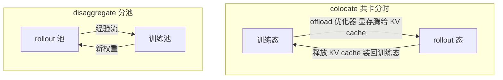
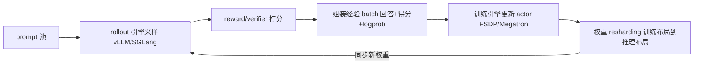

# RL 训练框架(verl / OpenRLHF / TRL)

> ⚠️ 旧版:本篇写于写作契约确立之前,尚未按新标准审查重写。标准见 docs/04-知识库写作契约.md,样板见「GPU架构与执行模型」。

一句话:RLHF/RLVR 训练是「**生成引擎 + 训练引擎**」的双引擎系统——rollout 用推理引擎采样,update 用训练引擎改权重;RL 训练框架的本质不是实现算法(算法本身就几十行),而是管好两个引擎之间的**资源分配、权重同步与数据流**。

类比:一支球队,rollout 是「打比赛攒录像」,训练是「看录像改战术」。框架就是俱乐部经理——排场地(GPU 归谁用)、传录像(数据流)、把新战术下发给每个球员(权重同步)。算法(GRPO/PPO,见 RL 分类下的 GRPO 篇)只是战术手册,经理管的是整个俱乐部的运转。

## 一、为什么这事需要专门的框架

- **两个引擎天生异构**。rollout 追求生成吞吐:KV cache、continuous batching、PagedAttention、CUDA Graph,权重通常只按 TP 切;训练追求装得下、算得动:FSDP/ZeRO 把参数、梯度、优化器状态切碎摊到所有卡,或 Megatron 的 TP×PP×DP 3D 并行。**同一份权重,两边的显存布局完全不同**——拿训练引擎做生成慢得离谱(没有任何推理优化),拿推理引擎做训练则根本不支持反向传播。
- **权重每轮都要搬家**。on-policy 算法要求 rollout 用最新策略采样,所以每轮更新后都要把权重从训练侧同步到推理侧。7B 十几 GB、70B 一百多 GB,同步方案不好,几百轮训练里 GPU 大量时间在等搬运。
- **GPU 怎么分是两难**。分池(一部分卡专职 rollout、一部分专职训练):同步式流程下 rollout 时训练卡闲着、训练时 rollout 卡闲着,利用率难拉满;共卡分时:全员先 rollout 再全员训练,没人闲着,但每次「换场」要 offload/reload 大块状态,切换开销不小。
- **多模型编排**。PPO 全家桶一次拉起 4 个模型:actor(既训又生成)、critic(训)、reference(只 forward)、reward model(只 forward);GRPO 免掉 critic 也还有两三个。谁放哪些卡、谁先算谁后算、张量怎么在它们之间流动,手写分布式脚本很快失控。

早期的 DeepSpeed-Chat 是针对这些问题的第一代方案(训练/推理模式切换的「Hybrid Engine」概念即源于此),但它的生成侧没赶上 vLLM 这一代推理引擎;现代框架的基本盘都是「专业推理引擎 + 专业训练引擎」的组合。

## 二、三个核心概念

### colocate vs disaggregate:场地怎么用

- **colocate(共卡分时)**:所有角色共享同一批 GPU,按阶段轮流用。rollout 阶段把优化器状态、梯度等训练态 offload 到 CPU,显存腾给推理引擎的权重与 KV cache;训练阶段反过来。类比:同一块场地白天比赛、晚上训练,换场要收拾器材。好处是任一时刻没有闲卡,同步式 RL 下利用率最高;代价是每轮两次切换开销,显存峰值要精细管理。
- **disaggregate(分池流水)**:rollout 池与训练池各占各的卡,靠数据流水衔接,两边可以各选各的并行策略甚至机型。类比:比赛场和训练场分开,录像快递过去。好处是没有切换开销、天然支持**异步 RL**(rollout 持续产出、训练异步消费,掩盖长尾生成);代价是同步式流程下两边互相等,气泡大。
- 取舍口诀:**同步 on-policy、卡不多 → colocate;超大规模、异步、生成长尾严重 → 分池**。verl 默认 colocate(也支持灵活放置);OpenRLHF 经典 Ray 部署是分池(vLLM 独立占卡),后来也加了共卡模式。

### single-controller vs multi-controller:谁来指挥

- **multi-controller(SPMD)**:没有中心指挥,每个进程跑同一份脚本、算自己那一份、靠集合通信对齐——torchrun 拉起的普通分布式训练就是这样。类比:每个班组长人手一份相同的施工图,各自开工。高效,但 RL 这种多角色数据流写起来痛苦:加一条数据依赖要改所有进程的通信逻辑。
- **single-controller**:一个中心 driver 脚本描述完整数据流——「rollout → 打分 → 算优势 → 更新」写成几行普通函数调用,张量在角色之间的传递由框架翻译成分布式通信。类比:总导演拿完整剧本指挥全场。灵活,改算法只改一个文件;纯 single-controller 的代价是中心节点的调度与通信压力大。
- **verl/HybridFlow 的答案是混合**:模型与模型之间的数据流用 single-controller 编排(Ray driver),每个模型内部的分布式计算保持 multi-controller 的 SPMD(Megatron/FSDP 原生方式)。论文的说法是 "combines single-controller and multi-controller paradigms in a hybrid manner"——两层各用各的最优解。

### 权重 resharding:家具搬家

- 训练侧 actor 权重按 FSDP 全切分或 Megatron 3D 并行(TP×PP×DP)摆放;推理侧 vLLM/SGLang 通常只按 TP 切(加 DP 复制)。所以权重同步不是「复制一份」,而是**布局转换**:像一套家具从三室一厅搬进大开间,得拆开重新组装。
- naive 做法是先 all-gather 出完整权重再按推理布局切——显存峰值直接爆炸(等于凭空多出一份全量权重)。
- verl 的 **3D-HybridEngine** 专门优化这一步:训练态与推理态共卡时共享同一份权重存储,阶段切换只做必要的重排通信,论文表述为 "zero memory redundancy and significantly reduced communication overhead";OpenRLHF 则在训练进程与 vLLM 进程之间用 NCCL 广播/CUDA IPC 同步参数。
- 顺带一个高频坑:**同一 token,推理引擎与训练引擎算出的 logprob 有数值差异**(kernel 实现、精度、batch 组织都不同)。importance ratio 若直接用推理端 logprob 会引入偏差,严格实现会在训练端重算 old logprob(GRPO 篇的 rollout 细节一节也提到这一点)。

## 三、数据流全景

一轮 RL 训练在系统视角下是这样一个循环:

colocate 模式下,环上的「rollout 引擎」与「训练引擎」其实是同一批 GPU 在两种形态间切换;disaggregate 模式下是两批 GPU 各转各的圈,靠经验队列与权重队列衔接。框架的全部工作,就是让这个环转得快、转得稳。

## 四、三大框架逐个看

### TRL:HuggingFace 全家桶,上手最快

- **定位**:transformers 生态的官方 post-training 库,SFTTrainer / DPOTrainer / GRPOTrainer / PPOTrainer 一套 Trainer 风格 API,几十行代码跑通 GRPO。
- **系统设计**:训练走 accelerate(可挂 DeepSpeed),生成默认用 model.generate(慢),新版本可外接 vLLM 加速 rollout。
- **边界**:单机/小集群、中小模型最舒服;要上 Megatron 级并行、多机大规模 RLVR,不是它的赛道。
- 类比:家用轿车——即买即开,但别拿它拉货。

### OpenRLHF:Ray + vLLM + ZeRO 的经典组合

- **定位**:第一批把「Ray 编排 + vLLM rollout + DeepSpeed ZeRO 训练」打包好的开源 RLHF 框架,PPO 实现干净完整,其调参与实现细节被社区广泛参考。
- **系统设计**:Ray 把 actor/critic/ref/RM 调度到各自的 GPU 组(分池为主,也支持共卡),vLLM 独立占卡做 rollout,训练侧 ZeRO-3,权重经 NCCL/CUDA IPC 同步给 vLLM。
- **算法**:PPO / GRPO / REINFORCE++ / DPO / KTO 等;70B 量级可训。
- 类比:改装皮卡——结构直白、动手空间大,百卡内很能打。

### verl:single-controller 数据流 + 3D-HybridEngine,RLVR 主流

- **定位**:字节跳动开源,HybridFlow 论文的落地;当前大规模 RLVR 社区的主流选择,DAPO 等工作直接以它为基座。
- **编程模型**:single-controller 数据流抽象——driver 脚本里 RL 流程就是几行函数调用,每个角色封装成 WorkerGroup,内部计算仍是 SPMD。
- **3D-HybridEngine**:rollout 与训练共卡分时,自动完成训练布局与推理布局之间的零冗余 resharding。
- **可插拔**:训练后端 FSDP(易用)/ Megatron-LM(超大模型);rollout 引擎 vLLM / SGLang;算法 recipe 覆盖 PPO / GRPO / DAPO / SPIN / SPPO 等。
- **性能**:论文报告对当时各基线 1.53×–20.57× 的吞吐提升。
- 类比:重型工程车——驾照难考一点,但大活只有它能干。

## 五、对比表

| 维度 | TRL | OpenRLHF | verl |
| --- | --- | --- | --- |
| 编排方式 | Trainer + accelerate | Ray 多角色调度 | Ray + single-controller 数据流 |
| 训练后端 | transformers / DeepSpeed | DeepSpeed ZeRO-3 | FSDP / Megatron-LM |
| rollout 引擎 | generate,可接 vLLM | vLLM | vLLM / SGLang |
| GPU 放置 | 共卡为主 | 分池为主,可共卡 | 共卡为主,可灵活放置 |
| 算法覆盖 | SFT/DPO/PPO/GRPO 全家桶 | PPO/GRPO/REINFORCE++ 等 | PPO/GRPO/DAPO 等 recipe 最全 |
| 扩展规模 | 单机—小集群 | 百卡级 | 百卡—千卡级 |
| 上手成本 | 最低 | 中 | 中偏高 |

## 六、选型建议

- **单机实验、教学、小模型对齐** → TRL:生态无缝,试错成本最低。
- **百卡内复现 PPO/GRPO、想读懂每一行** → OpenRLHF:架构直白,源码可当教材。
- **大规模 RLVR、深度定制(改数据流、加角色、换后端)** → verl:系统能力上限最高。
- 一个判断:三者在算法层已高度趋同(都有 GRPO 系配方),**选框架本质是选系统能力**——卡数、模型尺寸、要不要异步,比「哪家算法多一个」重要得多。

## 七、面试考点串联

1. 为什么 rollout 和训练要用两个引擎、不能一个通吃 →「一、双引擎异构」
2. colocate 与 disaggregate 怎么取舍 →「二、colocate vs disaggregate」
3. 权重同步怎么做、为什么不能简单 all-gather →「二、权重 resharding」
4. single-controller 是什么、verl 为什么用混合编程模型 →「二、single vs multi-controller」
5. 为什么 rollout 与训练算出的 logprob 不一致、怎么处理 →「二、resharding 末尾的坑」
6. verl / OpenRLHF / TRL 的架构差异与选型 →「四、五、六」
7. 异步 RL 为什么天然偏好分池 →「二、disaggregate 的好处」

## 相关文献

- HybridFlow(verl 系统论文)— [arXiv:2409.19256](https://arxiv.org/abs/2409.19256)
- OpenRLHF — [arXiv:2405.11143](https://arxiv.org/abs/2405.11143)
- DeepSpeed-Chat(第一代 RLHF 系统,Hybrid Engine 概念起源)— [arXiv:2308.01320](https://arxiv.org/abs/2308.01320)
- TRL 文档:https://huggingface.co/docs/trl
- verl 文档:https://verl.readthedocs.io
