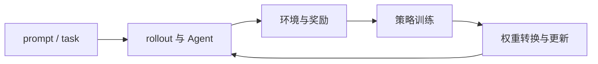

# RL框架对比

一句话:这是一篇**选型与范式篇**——不用功能打勾决定“谁最强”,而是先看七家框架分别想解决什么系统问题,再按资源、模型、rollout 形态和团队能力选路线。

> **篇型**:对比篇
>
> **对象类型**:动态对象
>
> **动态状态卡**
> - 最近核对:2026-09-08
> - 核对范围:verl、slime、ROLL、OpenRLHF、AReaL、Miles、NeMo-RL 的官方稳定版与官方主干文档
> - 稳定定位:比较七家框架的设计问题、控制范式、资源放置和正确性边界
> - 当前状态:各家都在快速增加异步、Agent、多后端与训推一致性能力;本文的支持矩阵是日期化快照,不是永久承诺
> - 一手来源:各项目官方仓库、Releases 与官方文档;性能和规模数字一律视为项目方证据

阅读边界:PPO、GRPO 和离策修正的算法原理见 `03-强化学习`;训练后端见 训练引擎对比 篇;生成后端见 推理引擎对比 篇。本文只讲稳定的架构选择与当前能力边界;源码路径、关键函数、参数默认值和调度分支属于开源解读。

## 一、RL 框架不是另一个训练引擎

LLM 的在线 RL 同时需要生成、环境或奖励、反向训练和权重更新。四类工作的最优形态不同:

- rollout 要把显存留给 KV Cache,并用动态批处理吸收变长序列;
- 训练要容纳参数、梯度、优化器状态和激活,并处理多维并行;
- 环境可能在 CPU、沙箱或外部服务上,延迟和失败模式与 GPU 不同;
- 策略更新后,生成侧必须在可控的时间内切到新权重。

因此,RL 框架的本质是**闭环编排层**:

七家项目真正的差别,不是“能不能写 GRPO loss”,而是这个闭环由谁控制、各角色放在哪里、允许旧多少个版本、出错后哪些状态可以重建。

## 二、六道共同工程题

### 1. 异构引擎怎样接成一条数据流

训练引擎和推理引擎不知道一条轨迹何时应送奖励、何时应算优势、哪个角色应该暂停。框架必须提供控制面,同时不把下层分布式计算重写一遍。

### 2. 角色共卡还是分卡

- **共卡分时**:生成和训练轮流占用同一组 GPU,小集群利用率高,但需要 sleep/wake、卸载和显存峰值管理;
- **分卡并行**:生成池和训练池同时工作,能做流水与异步,但要承担跨池权重传输和资源配比。

真正同时的生成与训练不能共享同一份被双方占满的显存。所以“异步”的支持是否有意义,必须和资源放置一起读。

### 3. 训练权重怎样变成 rollout 权重

训练侧可能按 FSDP2 或 TP×PP×EP 分片,生成侧却用另一套 TP/EP 布局。权重更新同时包含:

1. 训练分片聚合与重排;
2. 名称、形状、精度和量化 scale 对齐;
3. 同机 IPC 或跨池集合/点对点传输;
4. 在显存可承受时分批切换到新版本。

模型支持的瓶颈往往不在算法,而在这层映射是否完整。

### 4. 怎样处理长尾 rollout

同步批次由最慢的轨迹决定何时结束。多轮工具、软件环境和长思维链会让差异更大。常见方法从动态批处理与长度平衡,逐步走向流式交付和 partial rollout。越往后吞吐潜力越大,离策偏差和恢复状态也越复杂。

### 5. 怎样管住版本与训推数值差异

异步会让训练消费旧策略轨迹;partial rollout 还可能让一条轨迹混合多个版本。即使完全同步,训练 kernel 与生成 kernel 也可能产生不同 logprob;MoE 还多一层专家路由差异。成熟设计会同时管理策略版本证据、队列上限、背压、logprob 重算、重要性截断以及 token/路由/精度语义。

### 6. Agent 环境怎样从 demo 变成长跑系统

Agent RL 要维护多轮上下文、工具参数、环境状态、超时、重试和奖励归因。因此选型时应问“环境和轨迹是一等对象吗”,而不是只问“支持多轮吗”。

## 三、四类设计范式

同一项目可横跨多类,下表只标它最有辨识度的起点。

| 范式 | 代表 | 优先问题 | 主要代价 |
|---|---|---|---|
| **通用编排层** | verl、ROLL、NeMo-RL | 把多角色、多后端和资源拓扑变成可组合工作流 | 抽象层、配置面和版本组合更大 |
| **收窄的胶水层** | slime | 深度连接 SGLang + Megatron,减少自建能力 | 换引擎不再是自然路径 |
| **生产化胶水家族** | Miles | 在 slime 血缘上强化大 MoE、低精度、恢复与训推语义对齐 | 能力矩阵快速演进,需从已验证 recipe 出发 |
| **全异步优先** | AReaL | 用解耦服务与有界离策管理消除长尾栅栏 | 系统状态、陈旧度和算法纠偏必须联合设计 |
| **HF + DeepSpeed 集成** | OpenRLHF | 用直接的 HF 模型、DeepSpeed 和 vLLM 完成整套后训练 | 训练与生成主后端选择更集中 |

“胶水层”不是贬义词。它表示框架不再造 Transformer kernel 或生成引擎,而是把创新放在训推交界、数据管理和调度上。区别只在于它是否将上游选择收窄。

## 四、七家框架的稳定题眼

### verl:把 RL 数据流变成可组合工作流

verl 的经典起点是 hybrid-controller:外层单控制器表达采样、打分、优势和更新的数据依赖,角色内部仍由分布式后端并行。它适合需要换算法、换训练/生成后端和换资源布局的通用研发平台。代价是组合面大,不能从总特性表直接外推每种 recipe 都同等成熟。

### slime:主动保持薄,将 SGLang 与 Megatron 粘起来

slime 保留上游引擎的参数和调试方式,用较薄的中间层处理数据、资源放置和权重更新。这使系统研究者更容易追到训推边界,也意味着使用者必须懂两个上游系统。

### ROLL:把角色、环境与资源拓扑放到台前

ROLL 的辨识度在于角色化编排:策略、参考、奖励、价值与 rollout 可被单独放置,环境和多轮信用分配也是核心扩展面。它适合先画角色图和集群拓扑,再把算法映射进去的团队。

### OpenRLHF:从完整后训练流程出发

OpenRLHF 将 Hugging Face 模型、DeepSpeed 训练和 vLLM rollout 组成明确主路,并将单轮和 Agent 执行放到统一流水中。优势是主路集中、容易建立基线;当团队已绑定 Megatron 多维并行或其他生成引擎时,它就不是最短接入路径。

### AReaL:先去掉同步栅栏,再管住离策边界

AReaL 将训练、推理、Agent 和权重更新解耦成服务,让生成与训练持续流动。它的完整价值不在“并发跑两个程序”,而在可中断 rollout、策略版本证据、有界陈旧和离策修正一起设计。

### Miles:将胶水路线推向超大模型的可运维长跑

Miles 与 slime 共有设计血缘,但它将大 MoE、低精度、跨池权重更新、token-in-token-out 和路由重放放在更显性的位置。SGLang + Megatron 是规模化主路,FSDP2 则给出原生 Hugging Face 模型的接入与数值对照路线。

### NeMo-RL:在 NVIDIA 生态内做可组合的角色编排

NeMo-RL 将资源分配、进程隔离、控制协调和数据通信作为独立职责,并同时保留 DTensor/FSDP2 与 Megatron-Core 训练路线。它对已使用 NVIDIA 容器、NeMo 模型和集群基础设施的团队更顺,但组件版本配平和非 NVIDIA 环境需要单独评估。

## 五、当前能力地图

下表只记录截至状态卡日期、官方明确给出的主路。“支持”不代表任意模型×精度×并行×硬件组合都已验证。

| 框架 | 主训练路线 | 主 rollout 路线 | 资源/控制特征 | 异步与 Agent 特征 |
|---|---|---|---|---|
| **verl** | FSDP/FSDP2、Megatron,并有其他演进后端 | vLLM、SGLang,并有其他路线 | 外层单控制、角色内 SPMD;Ray 放置 | 已提供异步训练与 Agent Loop,具体组合要查 recipe |
| **slime** | Megatron | SGLang | 收窄胶水层,上游参数保持可见 | 提供同步/异步和自定义 rollout 扩展点 |
| **ROLL** | Megatron-Core、FSDP2 | vLLM、SGLang | 多角色资源编排;Ray 放置 | 环境注册、多轮与异步是主要扩展面 |
| **OpenRLHF** | DeepSpeed ZeRO 为核心 | vLLM | Ray 角色放置,支持共卡 Hybrid Engine | 已提供同步、异步、partial rollout 与统一 Agent 执行 |
| **AReaL** | 独立训练服务 | SGLang 为默认,vLLM 可选 | 训练、推理、Agent、权重更新微服务解耦 | 全异步、可中断 rollout、在线与黑盒 Agent 接入 |
| **Miles** | Megatron 主路,FSDP2 辅路 | SGLang | 训推分池,关注大规模权重传输和恢复 | 同步/全异步、TITO、MoE 路由重放 |
| **NeMo-RL** | DTensor/FSDP2、Megatron-Core | vLLM、SGLang、Megatron 推理等官方路线 | 单控制器 + 分布式角色;Ray 管资源与隔离 | 同步/异步 RL、NeMo Gym 多轮环境 |

这张表刻意不写“最大模型”或“快多少倍”。各项目的模型、卡型、集群、基线和算法不同,把它们的自报数字并排会制造假精确。

## 六、不要被勾选表骗了

### “支持异步”至少有四个等级

1. 生成 worker 之间异步,但整批仍等齐;
2. 已完成样本先流入训练,但权重更新仍有栅栏;
3. 生成与训练持续并行,数据有版本陈旧;
4. 在途 rollout 可中断/恢复,一条轨迹可能混合版本。

必须继续追问:队列多大、轨迹是否混版本、行为 logprob 由谁记录、旧数据何时丢弃。

### “支持某后端”不等于主路成熟

一个后端能启动,不代表 LoRA、MoE、长序列、FP8、checkpoint 恢复和跨机权重更新都已打通。真正的支持单元是:

> 框架版本 × 模型 × 算法 × 训练后端 × rollout 后端 × 精度 × 并行拓扑 × 硬件

选型应从官方已验证 recipe 往外扩,不应从 README 顶部的总功能列表往内猜。

### “支持 Agent”也有不同语义

最薄的支持是换一个采样函数;更完整的支持还要包含环境状态、多轮上下文、工具错误、轨迹存储、重放和信用分配。如果任务是软件环境或长连接环境,这些才是主选型轴。

## 七、场景选型

| 场景 | 优先试哪类 | 原因 | 验证前不能假设什么 |
|---|---|---|---|
| 快速改 loss、优势或采样逻辑 | slime、OpenRLHF,或 verl 标准 recipe | 主路相对直接,容易建立基线 | 不能只因“代码薄”就假设数值对齐和恢复已成立 |
| 需要经常换训练/生成后端 | verl、NeMo-RL、ROLL | 角色和后端解耦是主设计问题 | 不能假设所有组合拥有同等测试深度 |
| 超大 Dense/MoE,必须用 Megatron 多维并行 | Miles、slime、verl/NeMo-RL 的 Megatron 路线 | 主路能表达 TP/PP/CP/EP 组合 | 要验证模型映射、路由一致性和权重转换 |
| 长尾生成已是主瓶颈 | AReaL,或其他框架的已验证异步路线 | 可以让 rollout 与训练重叠 | 必须同时测陈旧度、离策修正和最终质量 |
| 环境很重、多轮工具与失败状态复杂 | ROLL、NeMo-RL、AReaL,再比 verl/OpenRLHF 的 Agent 路线 | 环境与多轮编排是显式抽象 | 要看轨迹恢复、超时、奖励归因和沙箱边界 |
| 团队已有 DeepSpeed + HF 资产 | OpenRLHF | 主路与现有训练栈距离短 | 不能假设可无成本换成 Megatron 或其他 rollout 引擎 |
| 团队深度使用 NVIDIA/NeMo 生态 | NeMo-RL | 容器、模型、训练后端、环境与集群路线更易配平 | 必须锁定整套组件版本,非 NVIDIA 硬件需另证 |

这些是“优先验证”,不是不用 benchmark 的直接结论。最小高信度证据,应是在目标模型、序列长度和集群上跑出的小规模端到端实验。

## 八、公平验收的四层门槛

### 第一层:连通

验证 prompt 能经生成、奖励、优势、反向和权重更新走完一圈。这只证明闭环连通,不证明会收敛。

### 第二层:正确性

记录 rollout/训练 logprob 差异、策略版本差、轨迹年龄、重要性比、被丢弃样本比率、MoE 路由一致性,以及中断/恢复后的数据去重与权重版本。

### 第三层:流程性能

拆出 rollout 产出率、训练 token 率、权重更新时间、环境延迟、队列深度和每次更新墙钟。异步系统利用率变高,可能只是积压了更旧的数据。

### 第四层:最终质量

在相同数据、奖励、预算和评估下比较学习曲线与最终能力。吞吐较高但质量回退,是系统取舍,不能被“每秒 token 更多”掩盖。

## 九、选型前的十个问题

1. 目标模型能否用 FSDP2 装下,还是必须用 TP/PP/CP/EP?
2. 现有资产更接近 Hugging Face + DeepSpeed,还是 Megatron?
3. GPU 数量是否允许生成与训练分池?
4. rollout 长尾是否已经超过训练成为主瓶颈?
5. 算法能接受多少陈旧和离策程度?
6. 任务是单轮文本,还是需要持久环境的 Agent?
7. 是需要更换后端,还是深度修改一组固定引擎?
8. 训推权重映射、MoE 路由和精度语义谁来维护?
9. 中断后要恢复哪些状态,有没有故障注入证据?
10. 团队愿意长期承担多大的上游版本组合面?

答完前三问,候选集通常就会大幅缩小;后七问决定候选框架是能长期运行,还是只能跑一次 demo。

## 面试考点串联

| 问法 | 本文定位 |
|---|---|
| **补充题**:LLM 的 RL 框架究竟管什么,为什么不是另一个训练引擎? | 一(四角色闭环) |
| **补充题**:共卡与分卡怎样选,为什么这会限制异步? | 二(2) |
| **补充题**:训练侧和 rollout 侧的权重同步难在哪? | 二(3) |
| **补充题**:“支持异步”为什么不是一个布尔值? | 六(四个等级) |
| **补充题**:训推 logprob 和 MoE 路由不一致会怎样影响 RL? | 二(5) |
| **补充题**:slime 为什么可理解为“胶水层”,这是优点还是缺点? | 三 + 四(slime) |
| **补充题**:AReaL 和其他框架的主设计起点有什么不同? | 三 + 四(AReaL) |
| **补充题**:如何把“能跑”、“正确”、“快”和“最终质量”分开验收? | 八 |

> 题库尚无以 `RL框架对比` 为 topic 首段的真题,所以上表全部按补充题管理。

## 相关文献

- verl — https://github.com/volcengine/verl · https://verl.readthedocs.io/
- slime — https://github.com/THUDM/slime
- ROLL — https://github.com/alibaba/ROLL
- OpenRLHF — https://github.com/OpenRLHF/OpenRLHF
- AReaL — https://github.com/areal-project/AReaL · https://areal-ai.io/AReaL/
- Miles — https://github.com/radixark/miles · https://miles.radixark.com/docs
- NeMo-RL — https://github.com/NVIDIA-NeMo/RL · https://docs.nvidia.com/nemo/rl/latest/
- HybridFlow: A Flexible and Efficient RLHF Framework — [arXiv:2409.19256](https://arxiv.org/abs/2409.19256)
- AReaL: A Large-Scale Asynchronous Reinforcement Learning System for Language Reasoning — [arXiv:2505.24298](https://arxiv.org/abs/2505.24298)
- OpenRLHF: An Easy-to-use, Scalable and High-performance RLHF Framework — [arXiv:2405.11143](https://arxiv.org/abs/2405.11143)
- Reinforcement Learning Optimization for Large-Scale Learning(ROLL) — [arXiv:2506.06122](https://arxiv.org/abs/2506.06122)
