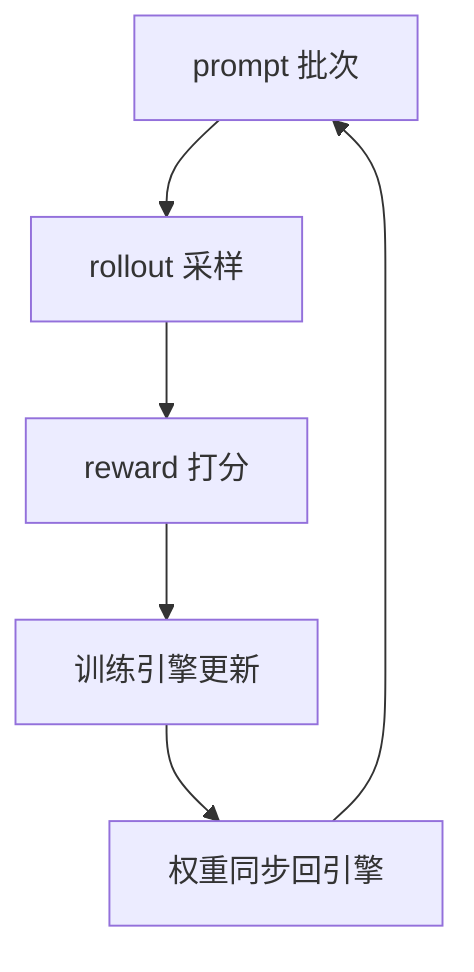

# RL框架对比

一句话:本篇是**选型篇**——不讲任何一家框架的内部架构,只回答三件事:**所有 LLM 的 RL 训练框架都要解决哪一组相同的难题、各家在这几道题上做了什么不同的选择、给你一个具体场景该选谁。**

阅读约定:算法本身(clip 怎么截、优势怎么算、KL 放哪儿)一律不在本篇,见 PPO 篇、GRPO 篇、GRPO变体 篇、RLHF与RM 篇;训练后端与推理引擎各自的架构见 Megatron 篇、FSDP 篇、DeepSpeed 篇、vLLM 篇、SGLang 篇;四家框架各自的架构详情分别见 verl 篇、slime 篇、ROLL 篇、OpenRLHF 篇;源码级实现见开源解读模块。

> **时效**:RL 框架里「谁支持什么」过期得比什么都快。本篇每条断言都对着本地源码快照逐条核实过——verl 与 slime 为 2026-04-29,OpenRLHF 为 2026-04-22,ROLL 为 2026-07-22;**读到这篇时一律以各项目官方文档为准**。核实不到的维度本篇宁可不列,哪些没列、为什么,见第六节末。

## 一、地基:这些框架到底在替你解决什么

RL 训练框架**不负责实现算法**。算法本身很短——clip 一下概率比、组内减个均值,核心几十行就写完了。框架真正干的活是:**把一个推理系统和一个训练系统缝成一个闭环,并让这个闭环转得快、转得稳。**

一轮训练的骨架,四家一模一样:

图上每一条边都是一道工程难题。**面试真正想考的就是这五道题**——它们与你用什么算法无关,换成哪一家框架都躲不掉。把它们讲清楚,后面的选型全是推论。

## 二、五道共同难题

### 难题一:生成侧和训练侧要的东西正好相反

生成追求吞吐:KV cache 占显存大头,靠连续批处理与前缀复用把卡喂满(见 连续批处理 篇、RadixAttention 篇),权重通常只按 TP 切;训练追求装得下:参数、梯度、优化器状态被切碎摊到所有卡(见 ZeRO 篇、并行策略 篇)。

量级感受一下这个矛盾有多硬:7B 模型全参训练态按混合精度算约 16 字节/参数(bf16 参数 + bf16 梯度 + fp32 主副本与 Adam 两个矩),**一百多 GB**;同一个 7B 拿去推理,权重只占 14 GB,剩下的显存全该给 KV cache。**同一份权重,两边的显存布局与用法几乎是对立的。**

反过来硬凑也不行:训练引擎做生成没有任何推理优化,慢得离谱;推理引擎压根不做反向传播。所以「一个引擎通吃」从来不是选项——这是所有 RL 框架的出发点。

### 难题二:多个角色往哪些卡上放

PPO 一次要拉起四个角色:actor(既训又生成)、critic、reference、reward model(见 PPO 篇);GRPO 免掉 critic 也还剩两三个(见 GRPO 篇)。两条路:

- **共卡分时**:所有角色共享同一批卡,按阶段轮流用。好处是任何时刻都没有闲卡;代价是每轮两次「换场」——训练态 offload 出去、推理引擎的权重与 KV cache 释放再重建(引擎侧的 sleep/wake 接口就是为这个准备的,见 推理引擎对比 篇),显存峰值要精细管理(见 显存管理与OOM 篇)。
- **分卡流水**:rollout 池与训练池各占各的卡,两边可以各选各的并行度甚至各用各的机型。好处是没有切换开销;代价是同步式流程下两边互相等,气泡大。

这一步的选择会**连锁决定后面两道题的答案**,原因见第三节。

### 难题三:权重同步——全篇最难的一步

每轮更新完,新权重必须进到 rollout 引擎里,否则采样用的还是旧策略。难点分三层:

**第一层,这不是复制,是布局转换。** 训练侧按 FSDP 全切或 Megatron 的 TP×PP×EP 摆放,推理侧通常只按 TP 切(见 并行策略 篇)。像一套家具从三室一厅搬进大开间,得拆开重装。slime 为此专门做了一层 Megatron 布局到 HuggingFace 布局的转换器,并按模型架构逐个实现——**这层转换器的覆盖面直接决定框架支持哪些模型**,新架构支持慢往往卡在这儿。

**第二层,不能先 all-gather 出完整权重再切。** 那等于凭空多出一份全量权重,显存直接爆。四家的通行解法都是**按张量分桶、一个桶一个桶地传并覆盖**(桶大小是个公开旋钮,slime 默认 512 MB、verl 默认 2048 MB)。

**第三层,走哪条路,取决于上一道题的答案。** 共卡时两边在同一张卡上,可以走 CUDA IPC / 共享内存,把显存指针递过去、零拷贝;分卡时只能走 NCCL 广播(见 NCCL 篇、集合通信 篇)。**这两条路四家都实现了,而且都按「是不是共卡」自动二选一**——这不是撞车,是物理条件只允许这么做。

verl 更进一步,把这一层抽成了一个独立的权重传输组件,底下可挂多种后端(集合通信、点对点、分布式 KV 存储)。原因很实际:**分卡异步场景下 rollout 池会扩缩容,「一次广播给固定一组进程」这个假设本身就不成立了。**

### 难题四:长尾生成把一轮的墙钟时间钉死

一轮 rollout 的耗时由**最长的那条回答**决定。长思维链场景里同一批的最短几百 token、最长几万 token,先跑完的卡就在那儿干等。这是同步式 RL 最大的一块浪费,也是近两年系统论文的主战场:AReaL 报到 2.77× 加速,ROLL Flash 报 RLVR 2.24×、agentic 2.72×——**这三个数字的基线、模型、卡型全不一样,不能横向比较**,它们只共同说明一件事:这块浪费很大。

治法只有一类:**让生成不再等训练**。异步 rollout(生成持续产出,训练消费稍旧的样本)、partial rollout(没生成完的样本存回缓冲区,下一轮接着生成)。代价是引入 off-policy 偏差,要靠重要性采样纠正——正好接上第五道题。

### 难题五:训练端和生成端算出来的概率对不上

同一个 token,推理引擎算出的 logprob 与训练引擎算出的并不相等:attention kernel 实现不同、精度不同、并行切分与规约顺序不同,误差还逐 token 累积。重要性比若直接吃推理端的 logprob,就会引入系统性偏差(重要性比是什么,见 PPO 篇)。

**这条最值得讲的是它的现状变化**:它曾经只是篇末的一个「坑」,现在四家都把它做成了一等公民的开关——都提供截断重要性采样(TIS)这类纠正项,verl 还把两端 logprob 的差直接做成训练面板上的监控量(官方给的经验阈值:均值正常应低于 0.005,高于 0.01 就该怀疑推理侧精度)。默认口径也统一了:**把推理引擎当纯采样器,old logprob 用训练端重算。**

## 三、设计分野:四个真正分出高下的选择

### 谁来指挥:单控制器还是多控制器

- **多控制器(SPMD)**:没有中心,每个进程跑同一份脚本、算自己那份、靠集合通信对齐——torchrun 拉起的普通分布式训练就是这样。像每个班组长人手一份相同的施工图。高效,但 RL 的多角色数据流写起来痛苦:加一条数据依赖要改所有进程。
- **单控制器**:一个中心脚本把「采样 → 打分 → 算优势 → 更新」写成几行普通函数调用,张量在角色之间怎么传由框架翻译成分布式通信。像总导演拿着完整剧本。灵活,代价是中心节点的调度与通信压力。
- **四家最终收敛到了同一种形态**:外层用一个中心脚本描述数据流,每个角色内部仍保持 SPMD。verl 把它叫 hybrid-controller(HybridFlow 论文的主张),ROLL 也明确自称单控制器架构。**所以这一维今天已经不是差异点了**——它在面试里是「你知不知道为什么要这么分层」的题,不是选型题。

### 共卡还是分卡:四家都支持,但默认与成熟度差得远

| 框架 | 怎么共卡 | 怎么分卡 | 默认与成熟度 |
|---|---|---|---|
| verl | 主线 PPO 训练器只走共卡 | 走独立的一步离策 / 全异步训练器 | 主线断言共卡,分卡在实验目录里 |
| slime | 一个开关打开 | 库默认就是分卡 | 库默认分卡,但随库示例脚本绝大多数开着共卡 |
| ROLL | 各角色写同一组卡号 | 各角色写不同卡号 | 同一套配置的两种写法,粒度到单个角色 |
| OpenRLHF | Hybrid Engine 模式 | Ray 把各角色放到各自卡组 | 分卡是基础形态,共卡是一组开关的组合 |

**一条四家一致的硬规律:共卡和异步互斥。** slime 的异步入口直接断言不能共卡,ROLL 在共卡时断言异步比例必须为 0,OpenRLHF 的异步与推理引擎的 sleep 模式不兼容,verl 的一步离策与全异步也都要求给 rollout 单独分配资源。原因很朴素:**异步的前提是生成和训练同时在跑,而共卡的前提是同一时刻只有一边在用显存**——两个前提直接打架。这是本篇最该背走的一句话。

### 后端组合:开放还是收窄

verl 最开放(训练侧除 FSDP/FSDP2/Megatron 外还挂了 torchtitan、veomni、automodel 与昇腾栈;rollout 侧 vLLM/SGLang/TensorRT-LLM),ROLL 次之(训练 Megatron 或 FSDP2,推理 vLLM/SGLang/HF),OpenRLHF 收成一条线(DeepSpeed ZeRO + vLLM),slime 最窄且是有意为之(只接 Megatron 与 SGLang)。

取舍很直白:**后端越多,覆盖的硬件与模型越广,配置面也越大;后端越少,代码越薄、越好读、越好改。** slime 把这条取舍写进了设计目标——不用 trainer 类包装,训练循环直接摊在入口脚本里(百来行),两个后端的参数全部原样透传。这不是「功能少」,是**把复杂度从框架推给上游库和用户**的明确选择。

两个容易搞反的印象,这里点名:**verl 与 ROLL 都不支持 DeepSpeed**(四家里只有 OpenRLHF 用它);**slime 只接 SGLang、OpenRLHF 只接 vLLM**,各只有一个推理后端。

### 扩展点开在哪:决定你能不能不 fork

- **换算法**:四家都做成了一个枚举值(优势估计器 / 策略梯度变体),这一维没有差异。
- **换 rollout 循环**(多轮、工具、环境):slime 开了十几个函数级插桩点,一个参数就能整个换掉采样循环;OpenRLHF 给一个 agent 函数入口;verl 有 Agent Loop 抽象,带内置工具与 MCP;ROLL 走得最远——把环境本身做成一等公民,库里直接注册了一批可跑环境(推箱子、冰湖、网购等)和两套多轮信用分配范式。多轮 RL 的算法侧见 AgenticRL 篇。
- **换资源拓扑**:ROLL 是唯一把「每个角色用哪几号卡」做成一行普通配置的,共卡与分卡因此只是同一套配置的两种写法。

## 四、横向对照表(截至写作时,以各项目官方文档为准)

只列真正影响选型的维度。**打勾表最没用**——本节这张表最能说明原因:异步、多轮、训推纠正三行四家全部打勾,靠它根本选不出来,真正分得开的是下面第五节的场景。

| 维度 | verl | slime | ROLL | OpenRLHF |
|---|---|---|---|---|
| 训练后端 | FSDP/FSDP2、Megatron,另挂多种 | 只有 Megatron | Megatron 或 FSDP2 | 只有 DeepSpeed ZeRO |
| rollout 引擎 | vLLM / SGLang / TensorRT-LLM | 只有 SGLang | vLLM / SGLang / HF | 只有 vLLM |
| 默认放置 | 共卡(主线只支持共卡) | 库默认分卡,示例多开共卡 | 每角色一组卡号,两种写法同源 | 分卡为基础,共卡是开关组合 |
| 异步 | 一步离策 / 全异步,独立训练器 | 独立入口 + 全异步示例 | 一个比例旋钮 | 一个开关 + partial rollout |
| 多轮 / 环境 | Agent Loop + 内置工具、MCP | 十几个函数级插桩点 | 环境注册表 + 两套多轮范式 | agent 函数入口 |
| 训推不一致纠正 | 独立配置项 + 面板监控量 | TIS 及其阈值 | 策略梯度变体之一 | 三种纠正类型可选 |
| 仓库内最大规模证据 | 文档给 671B MoE 的 96–512 卡配置 | 744B MoE / 256 卡脚本 | 320 卡配置 | README 口径 70B+ |

最后一行的口径要说死:**这是「仓库里有没有这个配置或文档」,不是「我实测跑通过」**。四家仓库里都没有可横向比较的 benchmark。

## 五、场景 → 选谁 → 为什么

本篇的核心产出。「首选」是从上面已核实的结构性差异推出来的,**不是性能榜**。

| 场景 | 首选 | 为什么 | 反选谁,为什么 |
|---|---|---|---|
| **快速验证一个算法想法**(改优势、改 loss、改采样) | slime | 训练循环就摊在入口脚本里、没有 trainer 类包着,改哪儿一眼看得见;十几个插桩点意味着大多数想法不用 fork | 别上 verl:后端与配置面最大,读懂配置树的时间可能比想法本身还长 |
| **要跑到很大规模、大 MoE** | verl 或 slime | verl 的多后端与独立权重传输组件本就是为分卡异步扩缩容准备的;slime 仓库里直接有 744B MoE 的 256 卡脚本 | 别上 OpenRLHF:训练侧只有 ZeRO,拿不到 Megatron 的 TP×PP×EP(见 并行策略 篇) |
| **多轮 / agentic / 要跑真实环境** | ROLL,其次 verl | ROLL 把环境做成一等公民,有可直接跑的环境和两套多轮信用分配范式;verl 的 Agent Loop 带工具与 MCP | 别挑只有单轮采样循环的路子——多轮的难点在环境编排,不在算法 |
| **团队只有几十张卡** | OpenRLHF,或 slime 开共卡 | 卡少时唯一正确的姿势是共卡分时,让任何时刻都没有闲卡;OpenRLHF 的 Hybrid Engine 是官方点名的「严格 on-policy」配方,心智负担最小 | 别急着上异步:异步要求分卡,卡本来就不够还切两半,净收益为负 |
| **要深度定制训练侧**(自研并行或自研后端) | verl | 训练后端是可注册的,已经挂了六七种;换后端不用动上层数据流 | 别上 slime:它有意只接 Megatron,自研后端等于逆着它的设计走 |
| **技术栈已经绑死 DeepSpeed** | OpenRLHF | 四家里只有它用 DeepSpeed ZeRO(见 DeepSpeed 篇、ZeRO 篇) | 另外三家都不支持,别指望改个配置就接上 |
| **长尾生成已是主要瓶颈** | 谁都行,但必须先能分卡 | 异步与 partial rollout 四家都有,真正的前提是你得先腾得出两个池子 | 别在共卡配置里找异步开关——它们互斥,不是没做 |

## 六、选型前先问自己这几个问题

按顺序问,**前三问答完通常答案就浮出来了**:

1. **卡有多少?** 几十张 → 共卡分时,异步这一整档直接划掉。几百张以上 → 才轮到讨论分卡与异步。
2. **模型多大、是不是 MoE?** 需要 TP×PP×EP 才装得下 → 训练后端必须是 Megatron 一档,只有 ZeRO 的选项当场淘汰。
3. **rollout 是单轮还是多轮带环境?** 多轮 → 先看环境抽象与扩展点,其余维度全部往后排。
4. **你要改的是算法侧还是系统侧?** 改算法 → 选代码薄、插桩点多的;改系统 → 选后端可注册、抽象分层清楚的。
5. **训练侧技术栈能不能换?** 已经绑死某个后端的,这一条能砍掉一大半候选。
6. **能接受多大的 off-policy 程度?** 要严格 on-policy 就别碰异步;能接受一步离策,长尾那块浪费立刻收回一大半。
7. **谁来长期维护?** 后端越多的框架,上游升级带来的破坏面越大。
8. **最后一问:这些结论还新鲜吗?** 真到选型那天,先把上面那张表按官方文档重过一遍。

一句收尾:**四家在算法层已经高度趋同**(优势估计器都是一个枚举值,新变体都跟得很快,见 GRPO变体 篇),**选框架本质是选系统能力与扩展方式**——卡数、模型尺寸、要不要多轮环境、要不要异步,每一条都比「谁多支持一个算法」重要得多。

### 想比但没比的三个维度

- **吞吐 / MFU 横向对比**:四家仓库里都没有可比口径的 benchmark;各自论文自报的加速比(HybridFlow 1.53×–20.57×、OpenRLHF 1.22×–1.68×、AReaL 2.77×、ROLL Flash 2.24×/2.72×)基线、模型、卡型全不同,**放进同一张表就是误导**。
- **稳定性与容错**:各家 README 都有声称,但仓库里找不到可核实的证据。
- **上手难度**:主观。本篇只用可核实的代理证据(入口脚本的厚薄、配置面大小、后端数量),不直接打分。

## 面试考点串联

| 高频问法 | 本文哪一节 |
| --- | --- |
| LLM 的 RL 训练框架都要解决哪几个共同难题?为什么不能一个引擎通吃? | 一 + 二(难题一) |
| 生成和训练之间的权重同步为什么是个难题?有哪些做法? | 二(难题三:布局转换、分桶传输、IPC 与广播二选一) |
| 一轮 RL 训练的 GPU 主要浪费在哪?怎么治?代价是什么? | 二(难题四)+ 三(异步的前提) |
| 共卡和分卡怎么选?为什么共卡就做不了异步? | 三(放置表 + 那条硬规律) |
| 推理引擎和训练引擎算出的 logprob 对不上,会引发什么?现在通行怎么处理? | 二(难题五)+ 四(纠正那一行) |
| 给你一个只有几十张卡的团队,你会选哪个框架?理由是什么? | 五(第四行)+ 六(前三问) |
| 这几个框架的核心差异到底在哪?你按什么顺序判断? | 三(四个分野)+ 六(问题清单) |

## 相关文献

- HybridFlow: A Flexible and Efficient RLHF Framework(verl 的系统论文,单控制器与多控制器混合、3D-HybridEngine 重排)— [arXiv:2409.19256](https://arxiv.org/abs/2409.19256)
- OpenRLHF: An Easy-to-use, Scalable and High-performance RLHF Framework — [arXiv:2405.11143](https://arxiv.org/abs/2405.11143)
- Reinforcement Learning Optimization for Large-Scale Learning(ROLL 的系统论文,含按角色分配设备的设计)— [arXiv:2506.06122](https://arxiv.org/abs/2506.06122)
- AReaL: A Large-Scale Asynchronous Reinforcement Learning System for Language Reasoning(异步 RL 与陈旧样本处理)— [arXiv:2505.24298](https://arxiv.org/abs/2505.24298)
- Part II: ROLL Flash — Accelerating RLVR and Agentic Training with Asynchrony(异步对长尾的收益)— [arXiv:2510.11345](https://arxiv.org/abs/2510.11345)
- DeepSpeed-Chat: Easy, Fast and Affordable RLHF Training of ChatGPT-like Models at All Scales(第一代把训练与推理优化装进同一个系统)— [arXiv:2308.01320](https://arxiv.org/abs/2308.01320)
- verl 文档 — https://verl.readthedocs.io/
- slime 仓库与文档 — https://github.com/THUDM/slime
- ROLL 仓库与文档 — https://github.com/alibaba/ROLL
- OpenRLHF 仓库与文档 — https://github.com/OpenRLHF/OpenRLHF
