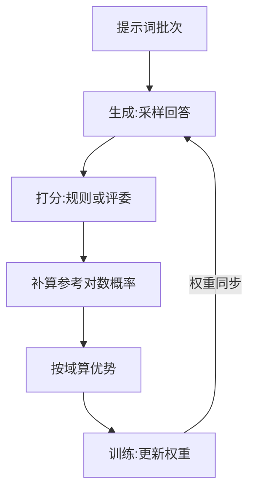

# ROLL

一句话:ROLL 是阿里开源的一套**大模型强化学习训练库**,它把 RL 训练里的每一类活(采样、打分、跑环境、更新权重)都做成一个能单独分配 GPU 的角色,再用**一份资源清单**把这些角色摆到集群上——本篇只讲它的架构与用法,PPO/GRPO 等算法本身见 GRPO 篇与 PPO 篇,几家框架的横向选型见 RL框架对比 篇。

## 一、它是什么、谁做的、想解决什么

- **全称**:Reinforcement Learning Optimization for Large-Scale Learning。阿里巴巴开源,Apache 2.0;仓库署名是淘天 Future Living Lab 与阿里 AI Engine 团队,技术报告见 arXiv:2506.06122(2025 年 6 月)。
- **自我定位**:面向大规模 GPU 资源的 LLM 强化学习库,主打三类场景——人类偏好对齐、复杂推理(RLVR)、**多轮 agentic 交互**。
- **它说自己服务三类人**:要低成本、能容错地把大规模训练跑起来的工程团队;要频繁改训练流程(换奖励、换环境、加角色)的业务开发;要做快速对照实验的算法研究者。这三条诉求解释了它后面几乎所有设计取向:**资源摆放要能随手改、角色要能随手加、一次实验要能原样复现**。

一个容易误会的点:名字里的 "Large-Scale" 指的是**规模化能力**,不是说小集群跑不动——仓库里 0.5B 单机的例子和 200B 级 MoE 的例子是并存的。

## 二、先说共同题眼:生成与训练要的是两种机器

RL 的一轮循环很简单:**先生成、再打分、再更新**。麻烦在于前后两头对硬件的诉求正好相反:

- **生成**追求吞吐:显存主要喂给 KV cache,权重按张量并行切一下就够(并行维度的含义见 并行策略 篇);
- **训练**追求装得下:参数、梯度、优化器状态都要切碎摊开,还得留出激活的位置。

同一份权重,两边的显存布局与资源画像完全不同。由此长出三个所有 RL 框架都躲不掉的问题:

1. **卡怎么分**。共卡分时的话,两种形态要来回搬进搬出;分池的话,同步流程下总有一边在等另一边。
2. **权重每轮都要搬家**。训练侧更新完,生成侧必须拿到新权重,采出来的样本才算贴着当前策略;7B 就是十几 GB,几百轮下来同步方案不好会吃掉大量时间。
3. **生成有长尾**。一个批次里最长的那条回答会把整批人拖住,后面的打分和训练全在干等。

这三问的**答法差异**才是各家框架的分野(见 RL框架对比 篇)。ROLL 的答法可以压成一句:**把"谁在哪几张卡上"变成一行配置,剩下的事框架自己接**。

## 三、架构:一张角色表 + 一份资源清单

ROLL 用 Ray 拉起一个**多角色分布式**系统:driver 端的流水线脚本像写单机代码一样按顺序调各个角色的方法(单控制器风格),每个角色内部则是正常的 SPMD 分布式计算。

### 角色表

| 角色(YAML 顶层键) | 干什么 | 典型后端 | 什么时候必须有 |
| --- | --- | --- | --- |
| `actor_train` | 训练策略模型 | `megatron_train` / `fsdp2_train` | 必有 |
| `actor_infer` | 采样、产 rollout | `vllm` / `sglang` | 必有 |
| `reference` | 算参考策略的对数概率 | 训练后端的推理模式 | 用 KL 约束时(见 KL散度 篇) |
| `critic` | 估状态价值 | 训练后端 | 只有 GAE 类优势估计要 |
| `rewards`(可多个) | 打分:规则判题、代码沙箱执行、LLM 评委等 | GPU 或**纯 CPU** | RLVR 必有 |
| 环境角色 | 跑多轮环境、产轨迹 | 以 CPU 为主 | agentic 才有 |

要点:**只有 `actor_train` 和 `actor_infer` 是骨架,其余角色都是"要才有"**。这也是它敢说"加角色很便宜"的原因——加一个打分角色,就是在 YAML 里多写一段。

### 摆放:`device_mapping` 一行决定共卡还是分池

每个角色写一段 GPU 全局编号列表,框架据此建资源池并绑定进程:

| 写法 | 含义 |
| --- | --- |
| 训练 `list(range(0,8))`、生成 `list(range(0,8))` | **共卡**:同一批卡分时复用 |
| 训练 `list(range(0,16))`、生成 `list(range(16,24))` | **分池**:各占各的卡 |
| 训练 `list(range(0,16))`、生成 `list(range(8,24))` | **部分重叠**,同样合法 |

进程数不用自己填,由 $\text{world\_size} = |\text{device\_mapping}| \div \text{num\_gpus\_per\_worker}$ 算出;训练角色每进程恒占 1 卡,生成角色的每进程卡数按并行度算(vLLM 按 TP×PP 自动推,SGLang 直接指定);纯 CPU 的角色不写 `device_mapping`,直接给 `world_size`。这套"角色 ↔ 资源"的绑定就是它标榜的 **AutoDeviceMapping**。

共卡时靠 **offload / reload 分时复用**:默认每次调用某角色之前,框架先把它的状态搬回显存,算完再搬回内存腾地方;需要连着用时可以显式关掉这次的卸载,避免来回搬。

### 权重同步:分桶流式,不做整模 all-gather

框架维护一个**权重同步组**,把 `actor_train` 设为源、`actor_infer` 设为目标,同步频率由 `model_update_frequency` 控制。两条路径:

- **共卡**:训练进程和推理进程在同一张卡上,直接把显存句柄交过去(CUDA IPC),不走网络;
- **不相交的那部分卡**:临时建一个集合通信组,把权重广播过去。

关键在于**两条路都不是"先凑出整份权重再切"**:权重按 `model_update_buffer_size_mb`(默认 1024 MB)攒一桶发一桶,边发边把训练侧的分片布局翻译成推理引擎认识的命名。所以同步期间的额外显存只多一个桶,而不是多一整份模型。**具体实现见开源解读模块。**

## 四、它复用了哪些现成组件

ROLL 自己不写训练引擎,也不写推理引擎,只写编排层:

| 层 | 接的是谁 | 在配置里怎么选 |
| --- | --- | --- |
| 集群编排 | Ray | 框架内建 |
| 训练后端 | Megatron-Core(经一层适配层,支持 DP/TP/PP/CP/EP 五维)、PyTorch FSDP2 | `strategy_name: megatron_train` / `fsdp2_train` |
| 生成后端 | vLLM、SGLang | `strategy_name: vllm` / `sglang` |
| 打分 | 规则判题、代码沙箱、LLM 评委、远程打分服务 | 各挂一个 `rewards` 角色 |
| 观测 | SwanLab / WandB / TensorBoard,另可开 Ray profiling 出时间线 | `track_with` 等 |

各后端自身的架构见 Megatron / FSDP / vLLM / SGLang 各篇。**一条随版本演进的事实**:技术报告里写的训练后端是 Megatron-Core + DeepSpeed,但当前主干可选的训练策略只有 `megatron_train` 与 `fsdp2_train`——**DeepSpeed 已不在策略列表里**。判断"它支持什么",看当前版本的策略清单比看论文靠谱。

## 五、一次完整迭代的数据流

每步一句话:

1. **取数据**:按各域配比从数据集里取 prompt,多域时由 `domain_interleave_probs` 定比例。
2. **采样**:生成角色按 `num_return_sequences_in_group` 给每条 prompt 采多条回答。
3. **打分**:样本一条一条完成、一条一条送去对应的打分角色,不等整批。
4. **补算概率**:参考模型算参考对数概率;训练模型对同一批数据重算一遍"旧策略"的对数概率(推理引擎和训练引擎的数值本来就对不齐,重算是为了让重要性比值算在同一把尺子上)。
5. **算优势**:按域分组做样本过滤、奖励后处理、摊到 token 级、再算优势;算法细节见 PPO 篇与 GRPO 篇。
6. **更新**:用 GAE 时先更 critic(可设预热步数),再更 actor。
7. **同步权重**:回到第 2 步之前,把新权重推给生成角色。

## 六、特色能力

### rollout 调度做到单条样本

这是它对付长尾的第一招:调度器管理的是**每条 prompt 的生命周期**(发出 → 提交或中止),不是整批的进度条。由此拿到三件事:

- **算完一条就打分**,不等整批凑齐;
- **有空位就补请求**,把生成引擎的并发填满;
- **够数就中止**还在跑的长尾请求,不为最后几条拖一整轮。

还可以多发一些 prompt(`is_use_additional_prompts` 配 `max_additional_running_prompts`),再按组过滤掉没有学习信号的组——**这是有代价的**:多发的部分算力可能白花,过滤太狠还会让有效批量变小。

### 异步训练

`async_generation_ratio` 是总开关:0 表示同步流水,大于 0 表示生成提前跑出多少轮的量供训练消费。两个前提要记住:**训练与生成必须分池**(共卡的话生成侧根本没卡可跑),且 rollout 必须走调度器模式;验证阶段会暂停异步生成,验证完再续。代价是数据变成 off-policy,得配相应的修正手段(算法侧见 GRPO变体 篇)。这条线有独立的系统论文 ROLL Flash(arXiv:2510.11345),两条设计原则是**细粒度并行**与**rollout-训练解耦**,论文自报同等 GPU 预算下 RLVR 最高 2.24×、agentic 最高 2.72×。

### agentic:按环境粒度并行

多轮交互不按批次推进,而是**每个环境实例自己跑自己的循环,环境之间没有同步栅栏**。环境按组配置:`num_env_groups` × `group_size`,同组内环境配置与随机种子相同(组内比较类算法需要这个前提;验证时 `group_size` 设 1,因为温度为 0 时同样的输入只会产出同样的输出)。调度器阻塞到攒够所需轨迹数为止——**同步模式下攒够就停,异步模式下继续往下跑**。环境侧内置了 Sokoban、FrozenLake、WebShop 等,也支持工具调用与沙箱型环境,并对齐了 GEM 的环境定义。多轮 RL 的算法侧见 AgenticRL 篇。

### 多域 RLVR

一次训练可以同时练数学、代码、开放问答:数据侧按 `domain_interleave_probs` 定各域配比,算优势时**按域分组各走各的处理策略**再合并;打分侧按域挂不同角色——数学走规则判题、代码走沙箱执行、开放问答走 LLM 评委。纯 CPU 的打分角色只给 `world_size`,一张 GPU 都不占。

### 复现与训推对齐

- **rollout 可以录下来重放**,把生成阶段的随机性整个摘掉,专门用来验证"改了并行方式或数据打包之后,数值还一不一致"。
- **MoE 训推路由不一致**:同一份权重,推理引擎和训练引擎可能给同一个 token 选出不同的专家,重要性比值会被放大。ROLL 提供 Router Replay——训练侧直接复用生成侧记录下来的专家选择,只用训练侧 logits 重新归一化。**限制要记住**:当前只实现了 SGLang 生成 + Megatron 训练这一条组合,且不能与序列打包同时开(MoE 路由本身见 MoE路由 篇)。
- **长尾造成的 padding 浪费**:动态分桶(按真实 token 数在 DP rank 间配平、长度相近的排一起)与序列打包(序列打包目前只在 Megatron 后端上)。

## 七、上手门槛与已知限制

- **配置系统很严**:YAML 与配置类严格映射,写了没定义过的键会直接报错。好处是不会静默吞掉笔误,坏处是改配置前得先知道键叫什么。
- **依赖组合敏感**:仓库按 torch 版本 × 推理引擎的组合分别给了依赖清单,官方明确推荐用预构建镜像(CUDA 与 ROCm 都有,昇腾 NPU 另有指南)。
- **一条硬约束**:训练侧和生成侧各自占用的 GPU 编号必须是**连续区间**,不能东一张西一张。
- **最常踩的坑是批大小配比不整除**:

$$
\text{rollout\_batch\_size} \times \text{num\_return\_sequences\_in\_group} \;=\; k \times \big(\text{grad\_accum} \times \text{per\_device\_bs} \times \text{DP 数}\big)
$$

意思是:左边是一轮采出来的样本总条数(几条 prompt × 每条采几个回答),右边括号里是训练侧完成一次完整梯度更新要吃掉的条数,$k$ 必须是正整数。对不齐时数据分不进 DP 组,启动即报错。Megatron 后端下的 DP 数 = `actor_train` 的卡数 ÷ TP ÷ PP ÷ CP。

- **checkpoint 格式**:Megatron 后端默认存 Megatron 格式,要交给 HuggingFace 生态用得跑一次转换工具。
- **版本演进快**:FSDP2 后端、Megatron 上的 LoRA、FP8 rollout、部分重叠摆放等都是后加的。任何"ROLL 支持 X"的结论,都要对着你手上那个版本再确认一次。

## 面试考点串联

| 高频问法 | 本文哪一节 |
| --- | --- |
| RL 训练里生成和训练对资源的诉求是反的,ROLL 怎么摆这两拨卡?共卡和分池各自的代价是什么? | 二 + 三(`device_mapping` 表) |
| 每轮训完权重要同步回生成引擎,共卡和分池两种摆法下分别怎么做?为什么不能先凑出整份权重再切? | 三(分桶流式同步) |
| 为什么 rollout 调度要做到单条样本的粒度?批粒度调度浪费在哪? | 六(样本生命周期三件事) |
| 异步训练在 ROLL 里怎么开?它对角色摆放有什么前提?换来什么、赔上什么? | 六 + 三 |
| 多轮 agentic 的 rollout 为什么按环境粒度并行而不是按批次?一个 batch 什么时候才算凑齐? | 六(无栅栏 + 攒够即返) |
| 多域 RLVR 联合训练,数据侧和打分侧分别有什么控制手段? | 六 + 三(角色表) |
| 要给它接一个新任务,你得实现什么?打分该放 GPU 还是 CPU? | 三 + 六 |
| 为什么 rollout 的批大小不能随便设?它得跟训练侧的哪些配置对齐? | 七(整除约束) |

> 本表按出题标准自拟,非面经原题。

## 相关文献

- ROLL 技术报告:Reinforcement Learning Optimization for Large-Scale Learning — [arXiv:2506.06122](https://arxiv.org/abs/2506.06122)
- Part II: ROLL Flash — Accelerating RLVR and Agentic Training with Asynchrony(异步训练的系统论文)— [arXiv:2510.11345](https://arxiv.org/abs/2510.11345)
- RollPacker: Mitigating Long-Tail Rollouts for Fast, Synchronous RL Post-Training(同团队的长尾治理工作)— [arXiv:2509.21009](https://arxiv.org/abs/2509.21009)
- RollArt: Disaggregated Multi-Task Agentic RL Training at Scale(同团队后续的分离式 agentic RL 系统)— [arXiv:2512.22560](https://arxiv.org/abs/2512.22560)
- 代码仓库 — https://github.com/alibaba/ROLL
- 官方文档 — https://alibaba.github.io/ROLL/
