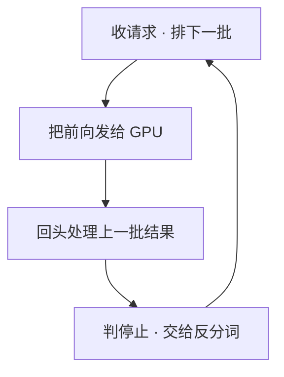

# SGLang

一句话:SGLang 不是"又一个推理引擎",而是**一门写提示词程序的前端语言(SGL)+ 一套为这类程序做过优化的后端运行时(SRT)**——前端让多轮、分支、并行、结构化输出写起来像写普通 Python 函数,后端把这类程序天然重复的前缀自动复用掉。本篇只讲架构与用法,机制原理一律引到 01-原理 章。

## 一、出发点:它一开始盯的不是"单条请求跑多快"

大多数推理引擎的接口假设是"一问一答":你发一段 prompt,它还你一段补全。但真实应用早就不长这样了——一次任务往往是**几十次模型调用串起来的一段程序**:先抽个 JSON,再按抽出来的字段分三路各问一次,汇总后再问一遍,中间还夹着工具调用和多轮历史。SGLang 的论文把这类东西叫 **LM program**(语言模型程序)。

用"一问一答"的接口写 LM program,会同时踩两个坑:**写起来啰嗦**(手动拼字符串、手动开线程、手动重试解析失败的 JSON),以及**跑起来浪费**(几路分支开头一模一样,引擎却当成毫不相关的请求各 prefill 一遍)。SGLang 的回答是把这两件事一起解决,分两层:

| 层 | 全名 | 干什么 | 面向谁 |
|---|---|---|---|
| 前端 | **SGL**(结构化生成语言) | 嵌在 Python 里的一套 DSL:生成、分支并行、控制流、约束输出 | 写应用的人 |
| 后端 | **SRT**(SGLang Runtime) | 真正的推理服务:调度、KV 管理、约束解码、kernel | 部署的人 |

两层是**一起设计的**:前端知道程序结构(哪里 fork、哪几段共享前缀、哪一段必须是 JSON),后端就能把这些信息当成优化线索用起来。但两层也**可以拆开用**——今天绝大多数用户其实只用后端,通过 OpenAI 兼容的 HTTP 接口发请求,前端语言是可选的一层。理解这一点很重要:说"SGLang 是个推理引擎"不算错,只是漏了它的另一半。

## 二、前端 SGL:把提示词程序写成一个 Python 函数

一段完整的例子,展开两条建议再汇总——注意 `fork` 那两行:

```python
@sgl.function
def tip_suggestion(s):
    s += sgl.assistant("两条保持健康的建议:1. 均衡饮食 2. 规律锻炼\n\n")
    forks = s.fork(2)                    # 从当前状态分出两条分支,共享上面这段前缀
    for i, f in enumerate(forks):
        f += sgl.assistant(f"把第 {i+1} 条展开成一段:"
                           + sgl.gen("tip", max_tokens=256))
    s += sgl.assistant("综上两条:" + sgl.gen("summary", max_tokens=512))

states = tip_suggestion.run_batch([{}] * 8)   # 一次跑一批,前端自动并发提交
```

常用原语就这么几个:

| 原语 | 作用 |
|---|---|
| `gen(name, ...)` | 生成一段,结果按名字存进状态,后面 `s["name"]` 取用 |
| `gen(..., choices=[...])` / `select` | 只能从给定选项里选一个,靠打分决定,而不是自由生成再解析 |
| `gen(..., regex=...)` | 约束解码,输出必须匹配这个正则 |
| `fork(n)` | 从当前状态分出 $n$ 条分支,分支之间并发跑 |
| `run_batch(...)` / `stream=True` | 批量跑一组参数 / 流式吐 token |
| `system` / `user` / `assistant` | 角色标记,自动套上模型的对话模板 |

**它为什么比"手写循环调 HTTP"快**,三条,全是结构带来的:

1. **`gen` 是非阻塞的。** 前端执行这个函数时并不真的等模型,而是在记录一张调用图;遇到 `fork` 就把几条分支一起发出去,只有真正读 `s["tip"]` 时才阻塞。并发不用你自己开线程池。
2. **分支天然共享前缀。** `fork` 出来的几条路开头逐 token 相同,后端的前缀缓存整段命中,分支点之前只算一次(为什么能自动认出来,见 RadixAttention 篇)。
3. **结构是写死在程序里的,不是求模型配合。** 哪一段必须是 JSON、哪一段只能三选一,前端直接翻译成后端的约束,省掉"生成完再解析、解析失败再重试"这一整圈。

前端还能换后端:同一个程序可以跑在本地 SRT 上,也可以跑在 OpenAI 之类的远端 API 上,只是后者拿不到前缀复用和约束解码这些依赖本地 logits 的能力。

## 三、后端 SRT:三个进程,一条重叠的调度循环

一个请求从进门到吐出 token 的整套骨架(排队 → prefill → 逐步 decode → 流式返回)与 vLLM 同构,不再写第二遍,见 vLLM 篇。这里只讲 SRT 自己不一样的两处。

### 进程怎么拆

| 进程 | 干什么 | 为什么要单独一个进程 |
|---|---|---|
| 分词管理(与 HTTP 服务同进程) | 收请求、分词、发给调度器;收结果、返回给用户 | 分词与 HTTP 序列化是重 CPU 的纯 Python 活 |
| 调度器(子进程) | 组批、跑前向、管 KV 池与缓存树 | 它是唯一碰 GPU 的,要独占一条解释器线程 |
| 反分词(子进程) | 把 token id 增量拼回文本、处理停止串截断 | 同样是碎而多的纯 CPU 活 |

三者之间走进程间消息队列(ZMQ)通信。**这么拆的唯一理由是 Python 的 GIL**:如果分词、反分词、JSON 序列化和调度循环挤在同一个解释器里,GPU 会因为调度线程抢不到锁而空转——GPU 忙不忙,取决于 CPU 有没有及时把下一批喂上去。

### 重叠调度:让 CPU 的活躲到 GPU 后面

即使拆了进程,调度器自己这条循环里仍然有一串 CPU 活:检查停止条件、更新缓存树、排下一批、准备输入张量。朴素写法是"算完这批 → 处理结果 → 排下一批 → 再算",CPU 那段时间 GPU 就闲着。

SRT 默认打开**重叠调度**(overlap scheduler,官方口径叫零开销批调度器):把前向发射到 GPU 之后**不等它**,转头去处理**上一批**的结果、顺便排好下一批,等下一次循环再收账。CPU 的活整段藏进了 GPU 的前向时间里。



代价是**结果晚一拍才可见**。所以某些必须"上一步结果立刻拿到"的配置(流水线并行、部分投机解码组合)会自动把它关掉,也可以用 `--disable-overlap-schedule` 手动关——排查数值问题时常这么做。

## 四、RadixAttention 在这台引擎里的位置

机制层面的东西——基数树怎么插入分裂、为什么淘汰必须从叶子开始、缓存感知调度的 DFS 依据——全在 RadixAttention 篇,这里一个字都不重讲。本节只回答部署时真正要决定的三件事:**默认开不开、和调度器怎么配合、怎么看它有没有用**。

**默认开。** 跨请求前缀缓存是 SRT 的默认行为,要关得显式 `--disable-radix-cache`。`--page-size` 默认是 1(一页一个 token),所以匹配粒度最细;设成大于 1 时匹配长度要向下取整到页边界,某些 attention 后端会反过来强制要求特定页大小(分页机制本身见 PagedAttention 篇)。

**但"缓存感知调度"默认不开——这条最容易答错。** 前缀缓存开着,不等于调度器会按命中率给等待队列排序。排序策略由 `--schedule-policy` 决定,当前默认是 `fcfs`:

| 策略 | 排序依据 | 什么时候用 |
|---|---|---|
| `fcfs`(当前默认) | 到达时间 | 通用;不花匹配开销,也不会饿死冷门前缀 |
| `lpm` | 与缓存树的匹配前缀长度,越长越靠前 | 前缀高度重复的负载(统一 system prompt、批量同模板) |
| `dfs-weight` | 树的深度优先权重 | 分支式负载,对论文里"最优命中率"的近似 |
| `lof` / `random` / `priority` | 最长输出优先 / 随机 / 显式优先级 | 特定场景 |

两条实现上的兜底值得记住:**等待队列排得太长时(当前实现的阈值是 128 条),`lpm` 会自动退回 `fcfs`**——给每条排队请求都走一趟树匹配再排序,本身就要花时间,队列一长就不划算;**关掉基数树时,缓存感知策略也自动退回 `fcfs`**。默认值随版本演进,上线前拿自己那个版本的 `--help` 核一遍。

**还有一层"同批去重"。** 一批新请求彼此共享同一段前缀、而这段前缀还不在缓存里时,把它们同时放进去等于把同一段 prefill 算好几遍。调度器的做法是先只放一条进去,让它把这段前缀写进树,剩下的下一轮整段命中——用一点点排队延迟换掉重复计算。

**淘汰与分层。** `--radix-eviction-policy` 除 `lru` 外还提供 `lfu`、`slru`、`priority`;`--enable-hierarchical-cache` 把缓存下沉到主机内存乃至外部存储,显存装不下的前缀先落到 CPU 侧,命中时再拉回来。这两块变动频繁,具体实现见开源解读模块。

**怎么观测。** 开 `--enable-metrics` 后,Prometheus 里有前缀缓存命中率 `sglang:cache_hit_rate`,口径是"命中的 token 数 ÷(命中 + 实算的 prompt token 数)";`--enable-cache-report` 还能在每条 OpenAI 格式响应里带上这条请求命中了多少 token。**调优只盯这一个数**:命中率上不去,缓存就是在白占显存(为什么会亏,见 RadixAttention 篇)。

**再往上一层是集群。** 单机的树只认自己这台机器算过什么,多实例部署时如果负载均衡随机派发,同一个 system prompt 会被分散到各台机器上,每台各存一份、命中率被摊薄。SGLang 自带的路由网关默认就是缓存感知策略:为每个 worker 维护一棵近似前缀树,按最长匹配挑机器;匹配率低于阈值或各机负载失衡时,再退回按负载挑。**"把相同前缀的请求粘到同一台机器上"是多机部署里最容易漏掉的一步。**

## 五、结构化输出:掩码打在 logits 上,状态机决定谁能活

约束解码的通用机制(把非法 token 的 logit 置成 $-\infty$,再照常采样)见 解码策略 篇,采样方法本身也在那篇。这里讲 SGLang 这一侧的四件事。

**接口。** 一条请求可以带 `json_schema`、`regex`、`ebnf` 三者之一,外加专门服务工具调用的 structural tag;前端语言里对应 `gen(..., regex=...)` 与 `choices=`。三选一,不能叠加。

**后端可换。** `--grammar-backend` 在 `xgrammar`(默认)、`outlines`、`llguidance` 之间选,`none` 彻底关掉。默认项 xgrammar 的思路是把词表按"合法性与上下文无关 / 相关"分成两类预处理好:绝大多数 token 属于前者,每步查表即可,只有少数需要现场判断——省的就是"每步为整个几十万词表重算一遍掩码"这笔钱。

**编译不挡调度。** 一个 schema 要先编译成状态机,复杂 schema 这一步能到几十毫秒,放在调度循环里会直接卡住整台机器。SRT 把编译扔到后台线程池,请求先在一个单独的语法队列里等着,编译好了才进正式等待队列;同一个 schema 只编译一次,之后走缓存。这就解释了一个常见现象:**同一个 schema 的第一条请求明显慢,后面都快**。

**版本敏感,这条重点。** SGLang 2024 年初的招牌是**压缩有限状态机 + jump-forward 解码**:把状态机里"只有一条出边"的路径(JSON 里 `{"name": "` 这种模板字符)压成一整段,直接当 prefill 填进去,不再一个个 token 地采样,当年博客报告最高降 2× 延迟、提 2.5× 吞吐。**但这条路径已在 2025 年 3 月从运行时移除**——语法后端里还留着相关接口,调度循环不再调用它。所以面试里说"SGLang 的结构化输出靠 jump-forward"已经过时:**当前版本走的是掩码这条主线,加速主要来自语法后端本身的词表预处理和掩码 kernel**。这类"论文和博客写了、代码里已经删了"的落差在 SGLang 上尤其多,答之前值得先确认版本。

## 六、调度与批处理:它自己的几个选择

连续批处理与 chunked prefill 的原理见 连续批处理 篇。SRT 的调度循环有三点自己的做法:

**一、prefill 优先。** 每一轮先试着从等待队列组一个 prefill 批;组得出来,这一步就跑 prefill,decode 让路;组不出来才跑 decode 批。好处是新请求的首字延迟不会被一大批正在 decode 的老请求拖住;代价是长 prefill 会给在跑的请求带来 ITL 抖动——这正是 chunked prefill 要压的东西(指标定义见 推理服务指标 篇)。

**二、prefill 和 decode 默认不混批。** 要把"某条请求的一块 prefill"和"几十条请求的单 token decode"塞进同一次前向,得开 `--enable-mixed-chunk`。这是个必须压测的开关:混批能让算力和带宽同时被用起来,但会让每步形状更复杂,某些 attention 后端与投机解码配置下并不支持。

**三、块大小与显存比例都按卡自动定档。** `--chunked-prefill-size` 不给就按显存容量挑:35 GB 以下的卡取 2048,40 GB 级取 4096,80–140 GB 级取 8192,再往上取 16384,给 `-1` 则关掉分块。`--cuda-graph-max-bs` 同理分档。`--mem-fraction-static`(权重 + KV 池占总显存的比例)是最后算出来的:先按前两者估出激活与 CUDA Graph 缓冲要留多少,剩下的才归静态池。**所以这三个参数是联动的,单独拧一个容易 OOM。**

**抢占。** KV 不够时调度器会把正在 decode 的请求踢出去(日志里叫 retract),释放它的 KV,恢复时重新 prefill——选重算而不是换出到 CPU,理由见 连续批处理 篇。好在被踢请求的前缀多半还在缓存树里,重算能命中一大截。日志里 retract 频繁出现,说明并发水位定高了:`--schedule-conservativeness` 调大会让准入更保守,踢得少但并发也低。

## 七、常用配置项速查

| 参数 | 影响什么 | 调大 / 开启 | 调小 / 关闭 |
|---|---|---|---|
| `--mem-fraction-static` | 权重 + KV 池占显存的比例 | KV 池更大 → 并发上限高、抢占少 | 激活与图缓冲余量足、不易 OOM,但并发上限低 |
| `--chunked-prefill-size` | 每步最多算多少 prefill token | 长 prompt 的 TTFT 更好 | 在跑请求的 ITL 更平稳;太小会让 prefill 退化成访存受限 |
| `--max-running-requests` | 同时在跑的请求数上限 | 吞吐高,单请求 TPOT 变差 | 时延稳,GPU 可能吃不饱 |
| `--schedule-policy` | 等待队列怎么排序 | `lpm` 提命中率,冷门前缀可能挨饿 | `fcfs` 公平、零匹配开销 |
| `--schedule-conservativeness` | 准入的保守程度 | 抢占变少,并发下降 | 并发高,但可能反复 retract 空转 |
| `--page-size` | 一页多少 token | 页表更小、部分 kernel 更快 | 默认 1,前缀匹配粒度最细 |
| `--disable-radix-cache` | 前缀缓存总开关 | 关掉后显存全给运行中的请求 | 默认开;高复用负载别关 |
| `--kv-cache-dtype` | KV 存什么精度 | `fp8_e4m3` 等约省一半 KV,换更高并发 | 默认 `auto` 跟随模型精度 |
| `--enable-torch-compile` | 是否编译模型 | 小批量下能提速,启动明显变慢 | 默认关,官方标注为实验特性 |
| `--enable-hierarchical-cache` | 缓存是否下沉到主机内存 | 可缓存的前缀量大增,多一层搬运 | 只用显存,简单但容量小 |

KV 量化的机制见 KVCache量化 篇,CUDA Graph 与编译见 CudaGraph 篇、TorchCompile 篇,`--tp-size` / `--dp-size` / `--ep-size` 见 并行策略 篇,`--speculative-algorithm` 见 投机解码 篇,`--disaggregation-mode` 见 PD分离 篇。

## 八、它擅长什么

一句话:**前缀高度重复、或者输出结构强的负载**。

| 负载 | 为什么合适 |
|---|---|
| 统一长 system prompt / few-shot 模板的高并发服务 | 前缀缓存默认开,命中一次白赚整段 prefill |
| 结构化输出:JSON 抽取、工具调用、评测打分 | 语法后端与编译缓存是一等公民,不是外挂 |
| agent 类多轮调用:上一轮的输出就是下一轮的输入 | 生成结果也留在缓存树里,每轮省掉整段历史的重算 |
| 分支式推理:自一致性、树搜索、多路探索 | 前端 `fork` 出的分支共享前缀,分支点之前只算一次 |
| RL 的 rollout 后端 | 多个后训练框架把它当采样引擎(见 verl 篇、slime 篇、ROLL 篇) |

反过来,每条 prompt 都独一无二、又不要结构化输出的负载,上面这些优势一条都用不上,选型得按别的维度比——横向对比与选型见 推理引擎对比 篇。最后提醒一句:**它演进极快,接口与默认值变动频繁**,本篇里调度策略的默认值、jump-forward 的移除都是例子,任何"我记得 SGLang 是这样"的说法,上线前都该拿自己那个版本核一遍。

## 面试考点串联

| 高频问法 | 本文哪一节 |
| --- | --- |
| SGLang 和一般的推理引擎不一样在哪?那套前端语言除了写着顺手,对性能有帮助吗? | 一 + 二 |
| 它的后端为什么要把分词、调度、反分词拆成三个进程?合成一个会怎样? | 三(GIL 抢锁,GPU 空转) |
| 什么叫重叠调度?它让什么和什么重叠了?什么情况下必须关掉? | 三 |
| RadixAttention 在 SGLang 里默认是开的吗?想再把命中率提一截你会动哪个参数,副作用是什么? | 四(默认开;`lpm` 换来饥饿) |
| 上线之后怎么判断前缀缓存到底有没有用?多机部署时它为什么会失效? | 四(命中率指标 + 网关的缓存感知路由) |
| SGLang 的结构化输出是怎么做的?你说的 jump-forward 现在还在不在? | 五(掩码主线;该能力已移除) |
| 它的调度器每一步是先跑 prefill 还是先跑 decode?这么定的代价是什么? | 六(prefill 优先;ITL 抖动) |
| 日志里请求一直在被 retract,你会怎么定位、动哪几个参数? | 六 + 七 |


延伸阅读顺序:RadixAttention(招牌机制)→ 本篇(它在引擎里怎么用)→ vLLM(请求全流程的骨架)→ 推理引擎对比(选型)。

## 相关文献

- SGLang: Efficient Execution of Structured Language Model Programs(前端语言 + RadixAttention + 压缩 FSM 的原始论文,NeurIPS 2024)— [arXiv:2312.07104](https://arxiv.org/abs/2312.07104)
- XGrammar: Flexible and Efficient Structured Generation Engine for Large Language Models(默认语法后端,词表分成上下文无关/相关两类)— [arXiv:2411.15100](https://arxiv.org/abs/2411.15100)
- Efficient Guided Generation for Large Language Models(Outlines 后端的 FSM 方法)— [arXiv:2307.09702](https://arxiv.org/abs/2307.09702)
- Fast JSON Decoding for Local LLMs with Compressed Finite State Machine(jump-forward 解码的原始博客;该能力已于 2025 年 3 月从运行时移除)— https://lmsys.org/blog/2024-02-05-compressed-fsm/
- Fast and Expressive LLM Inference with RadixAttention and SGLang(前缀复用的通俗版说明)— https://lmsys.org/blog/2024-01-17-sglang/
- SGLang v0.4: Zero-Overhead Batch Scheduler, Cache-Aware Load Balancer, Faster Structured Outputs — https://lmsys.org/blog/2024-12-04-sglang-v0-4/
- SGLang 官方文档(服务器参数、结构化输出、分层缓存与路由网关的当前口径)— https://docs.sglang.io/
- SGLang 源码仓 — https://github.com/sgl-project/sglang
