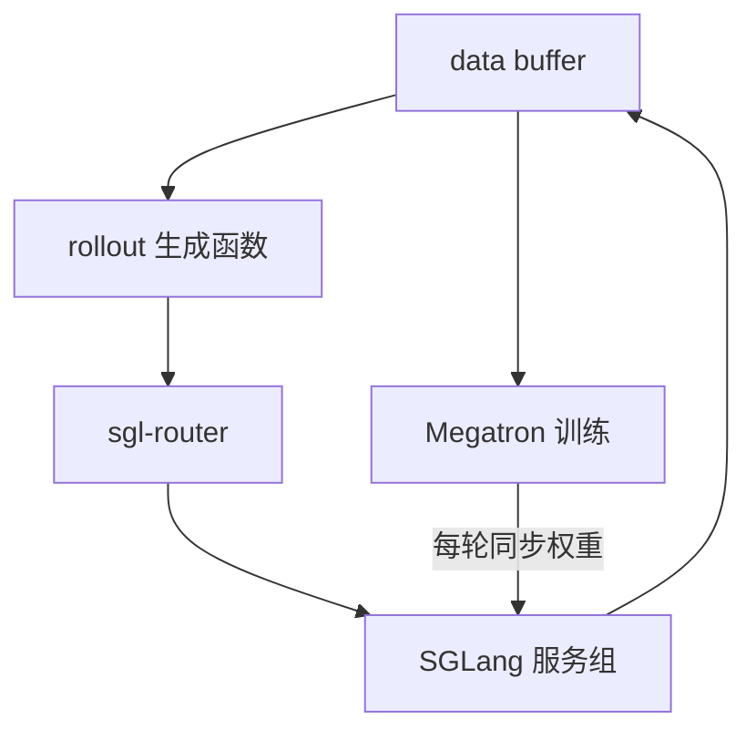

# slime

一句话:slime 是 THUDM 开源的 LLM 后训练框架,把 **Megatron 当训练引擎、SGLang 当生成引擎**焊在一起,自己只负责分卡、传数据、同步权重三件事;它最鲜明的主张是**不给这两个引擎套抽象层,而是把它们的参数原样透传出来**。

## 一、它是什么、谁做的、想解决什么

**出身**:GitHub 组织 THUDM 开源,也就是 GLM 系列背后的团队(模型发布在 z.ai)。README 自述 GLM 4.5 / 4.6 / 4.7 / 5 一路下来都是用它训的,另外支持 Qwen3 系列、DeepSeek V3 系列、Llama 3——**这份清单随版本一直在长**,以仓库当前的 README 为准。它**没有论文**,官方引用格式就是引 GitHub 仓库本身,所以关于它的一切事实只能以仓库与官方文档为准。

**自述的两大能力**(README 原话的意思):

1. **高性能训练**——通过连接 Megatron 与 SGLang,支持训推一体 / 训推分离、同步 / 异步等各种模式;
2. **灵活的数据生成**——通过自定义数据生成接口 + server based engine,支持任意的数据生成流程。

**它想解决的痛点是什么?** 官方博客的说法很直白:社区里流行"一个任务一个框架"——纯数学一个、多轮工具调用一个、异步一个、agent 一个,fork 来 fork 去,漏挑一个 patch 就训崩。slime 认为这源于**框架非要规定用户怎么写推理逻辑**。它的解法是把复杂度从框架推回给两侧:

- **推理逻辑推给用户**:所有 SGLang 服务由 sgl-router 统一管理,只暴露一个 HTTP 端点,用户注入自己的生成函数、爱怎么调怎么调。因为端点是 OpenAI 兼容的,**已有的 agent 环境不用改一行就能接进训练**,训练与部署的一致性也保住了;
- **性能推给上游**:参数透传到 SGLang 与 Megatron。SGLang 上游合一个优化,slime 这边加个参数就能用,不需要跟着改抽象层。官方把这条叫"**持续地快**"——快不难,难的是半年后还快。

代价也在这里:**它把自己绑死在 SGLang + Megatron 上**(本地快照里训练后端只有 megatron 一个选项)。这是主动选择——只对一个生成引擎负责,才能把 SGLang 的特性用满,而不是被迫抽象成几个引擎的最小公倍数。与 verl / OpenRLHF / ROLL 的横向对比归 RL框架对比 篇,本篇只讲它自己。

## 二、先讲共同题眼:一次迭代里,两个引擎为什么打架

这不是 slime 独有的问题,是**所有 RLHF / RLVR 框架的同一道题**,先讲清楚它,再看 slime 怎么答。

一次迭代 = **生成(rollout)** + **训练(反向)**,两边对资源的诉求正好相反:

| | 生成侧 | 训练侧 |
| --- | --- | --- |
| 显存花在哪 | 权重(可低精度)+ **KV cache 越大越好** | bf16 权重 + fp32 梯度 + fp32 master + Adam 一二阶动量 |
| 每参数字节数 | fp8 约 1 B | **约 18 B** |
| 并行怎么切 | 主要 TP(+ DP 复制) | TP × PP × EP × CP 全套 |
| 怕什么 | KV cache 不够导致请求被踢出重排队 | 装不下、算不动 |

由此长出三个必答的工程问题:

1. **卡怎么分**——共卡分时还是分池流水?共卡没有闲卡但要来回切换,分池没有切换但同步式下互相等;
2. **权重怎么搬**——on-policy 要求用最新策略采样,所以**每轮都得把权重从训练布局重排成推理布局**,几十上百 GB;
3. **谁在拖后腿**——这是 slime 讲得最尖锐的一条:传统训练提速靠加卡,但**推理延迟加卡降不下来**,再多 GPU 也得等最长那条样本解码完。原话是"我们希望 scale inference compute,但是我们无法 scale inference latency"。**单条数据的解码速度决定了 RL 训练速度的上限。**

第三条决定了 slime 后面所有优化的方向:先抬高上限(让最长样本解得更快),再压低成本(让同样的卡能跑更多实验)。

## 三、角色编排:三个模块,一个开关切换放置

官方架构只有三个模块,记住这张表基本就答得上"它怎么编排":

| 模块 | 里面是什么 | 职责 |
| --- | --- | --- |
| **training** | Megatron | 从 data buffer 取训练数据,训完把参数同步给 rollout |
| **rollout** | SGLang server 组 + sgl-router | 生成数据(含 reward / verifier 结果),写回 data buffer |
| **data buffer** | 桥梁模块 | 管 prompt 初始化、自定义数据、以及"生成到一半的样本"的暂存 |

**放置只是一个开关。** 默认按 `--actor-num-nodes × --actor-num-gpus-per-node` 给训练分卡、按 `--rollout-num-gpus` 给推理分卡,即**训推分离**;加一个 `--colocate` 就变成**训推一体**(此时忽略 `--rollout-num-gpus`,两边卡数相等)。每个推理引擎多少卡由 `--rollout-num-gpus-per-engine` 定,它基本等同于 SGLang 的 `tp_size`;不开 DP attention 时,server 个数 = `rollout-num-gpus / rollout-num-gpus-per-engine`,全部注册到 router 上做负载均衡。

**多角色**:GRPO 类算法只有 actor(算法本身见 GRPO 篇);上 PPO 时 critic 是**并列申请 GPU** 的独立角色,用 `--critic-num-nodes` 一组参数单独配,总卡数要按 actor + critic + rollout 三份算(PPO 的 critic 是干什么的见 PPO 篇)。

## 四、复用了哪些现成组件

slime 自己几乎不造轮子,这也是它代码量小的原因:

| 位置 | 用的是谁 | 怎么接 |
| --- | --- | --- |
| 训练后端 | Megatron-LM(见 Megatron 篇) | 直接复用 Megatron 的参数解析与存取 ckpt,参数**原样传** |
| 生成后端 | SGLang(见 SGLang 篇) | 以 **server 模式**拉起,参数加 `--sglang-` 前缀透传 |
| 请求调度 | sgl-router | 参数加 `--router-` 前缀透传;server 启动后自行注册 |
| 资源编排 / 异步 | Ray | 分 placement group,异步靠 `.remote()` 与 `ray.get` 的位置 |
| 权重命名映射 | mbridge | 建立 HuggingFace 与 Megatron 参数名的双向映射 |
| 显存腾挪 | SGLang 社区的 torch_memory_saver | 见第六节 |

于是参数分成三类:**Megatron 参数原样写**(如 `--tensor-model-parallel-size`)、**SGLang 参数加前缀**(`--mem-fraction-static` → `--sglang-mem-fraction-static`)、**slime 自己的参数**。这套"前缀透传"就是它所谓 native 的全部含义——升级上游几乎零改动。并行策略本身(TP/PP/EP/CP 各切什么)见 并行策略 篇。

## 五、权重同步:每轮都要搬一次家

训练侧按 Megatron 的 TP×PP×EP 摆放,推理侧按 SGLang 的 TP 摆放,**同一份权重两边布局不同**,所以同步不是复制、是重排。slime 按部署形态走两条路:

| 部署 | 通道 | 为什么 |
| --- | --- | --- |
| 训推一体(同机、不同进程) | 序列化后经 **CUDA IPC** 句柄交给引擎 | 同机同卡,传句柄就够了,不必真的拷贝数据 |
| 训推分离 | **NCCL 广播**到远端引擎 | 跨进程跨机,走集合通信(见 集合通信 篇) |

两条路都做了**分桶**:参数打包成大块再发,`--update-weight-buffer-size` 默认 512 MB。为什么要分桶?因为按张量一个个发,几千次调用的固定开销会盖过传输本身——MoE 模型参数张量特别碎,这一条尤其明显。

**量级感**:官方 v0.1.0 记录,GLM-4.5 355B-A32B 在训推一体下,bf16 权重同步约 **48 秒**;fp8 blockwise 量化 + 更新约 **100 秒**(该分支当时仍在优化)。另有 `--update-weights-interval` 可以隔几轮才同步一次,拿一点 off-policy 换同步开销。

**一个容易被追问的点**:训练侧会**自己重算一遍 log prob**,而不是直接用推理引擎返回的。因为两个引擎的 kernel、精度、batch 组织都不同,同一 token 的 logprob 有数值差异;推理端的 logprob 只在开 TIS 这类离策略校正时作为额外输入带过去。slime 的 CI 把这件事当硬指标卡:**第一个 rollout 重算的 log prob 必须与 reference model 完全相等,每个 rollout 内第一个训练步的 `ppo_kl` 必须严格为 0**——不等就说明同步或重算链路有 bug。

## 六、显存:把训练态藏起来,给 KV cache 腾地方

这是 slime v0.1.0 讲得最细的一块,也是训推一体最典型的工程题。

**先说为什么值得做。** 只要 KV cache 不溢出,加大推理 batch 几乎不影响训练延迟;一旦溢出,生成到一半的请求会被踢出队列、等别人腾出空间后**重新 prefill**——一条 64k 的回复中途等了别人解 32k,它的实际耗时就相当于解 96k。所以目标很明确:**把 `--sglang-mem-fraction-static` 开大**。而挡在前面的,是训练部分 offload 到 CPU 后的**残留显存**。

**难点在于"残留"很难清干净**:很难捕获训练框架分配的全部 GPU 张量;分布式优化器又把参数重整进连续大 buffer 再切片分发,引用关系一乱就释放不掉;而且每次上游版本更新都得重查一遍。

**slime 的做法**分两步:

1. **接管显存分配**。CUDA 的虚拟内存管理(VMM)API 分配时返回的是映射句柄而不是物理地址,offload 时偷偷把映射对应的物理显存释放掉、要用时再分配,上层完全无感。但如果整套换掉 PyTorch 的缓存分配器,碎片会立刻恶化、训练容易 OOM;因为训练与推理本就在**不同进程**,slime 改用 `LD_PRELOAD` 只把训练进程里 `cudaMalloc` / `cudaFree` 换成 VMM API,**缓存分配器照常工作**。代价:VMM 与 `cudaIpc*` 系列不兼容,所以做训推一体的参数更新或 DeepEP 时要换回原生分配。
2. **处理 NCCL 的 buffer**。每个通信组都占一块不小的 buffer,大 MoE 模型并行维度多,能占到 10 GB 以上,而上一招管不到它。slime 的选择是 offload 时直接 `destroy_process_group` 销毁通信组、load 前重建,给进程组创建加了一层可重建的包装。代价:每轮第一次通信会变慢——拿一点速度换可维护性和显存。

**效果**:Megatron 残留显存从约 **15~18 GB** 降到 **3~5 GB**,MoE 模型的 `mem_fraction` 因此能开到 **0.7~0.8**。再叠加 Megatron 自带的 **CPU Adam** 把优化器状态挪到主机内存,就有了"8 节点训 GLM-4.5 355B-A32B、16 节点训 DeepSeek-R1"的方案。注意 `--offload` 只是 `--offload-train` + `--offload-rollout` 的简写,而 `--colocate` 会自动把它们打开。显存账的通用算法见 显存管理与OOM 篇。

## 七、一次完整迭代的数据流

1. **取 prompt**:data buffer 按 `--rollout-batch-size` 发出一批 prompt,每条要采 `--n-samples-per-prompt` 个回复;
2. **生成**:rollout 函数把请求打给 sgl-router,router 转发给各 SGLang server,异步收集回复;
3. **打分**:内置 rule-based reward(`--rm-type` 支持 math / dapo / deepscaler / 远程 RM 等)或 `--custom-rm-path` 指定的自定义函数给出 reward;
4. **筛选**:开了动态采样时,按 `--dynamic-sampling-filter-path` 逐组过滤(例如丢掉组内 reward 标准差为 0 的组);不够就再过采样一批;
5. **回填 buffer**:留下的样本组进 data buffer;开了 `--partial-rollout` 时,被中途 abort 的半成品也存回去,下一轮接着生成;
6. **组装训练数据**:tokens / response_length / loss_mask / reward 打包;slime 默认做 **data packing(varlen)**,配合 `--use-dynamic-batch-size` 与 `--max-tokens-per-gpu` 把长短不一的样本拼成 token 数相近的 micro-batch;
7. **算 log prob 与优势**:训练侧重算 log prob,按 `--advantage-estimator`(grpo / gspo / reinforce++ / ppo)算优势——**算法本身见 03-强化学习 章各篇,本篇不展开**;
8. **反向更新**:Megatron 走完 `--num-steps-per-rollout` 个训练步;
9. **同步权重**:按第五节的两条通道把新权重推给推理侧,进入下一轮。

第 1 步与第 8 步之间有一条硬约束:

$$
\underbrace{B_{\text{rollout}} \times n_{\text{samples}}}_{\text{一轮生成的样本数}} \;=\; \underbrace{B_{\text{global}} \times S_{\text{per-rollout}}}_{\text{一轮训练消耗的样本数}}
$$

意思是**一轮的产出必须正好等于一轮的消耗**,不能多产也不能多吃;只设了 `--num-steps-per-rollout` 时 `--global-batch-size` 会被自动推出来,两个都设则用这条式子校验。默认 `--num-steps-per-rollout 1`,即严格 on-policy——设成大于 1 就等于让同一批数据被更新多次,策略开始偏离采样时的策略。

## 八、把生成侧做"活":自定义接口与几个 RL 特有的开关

slime 把可定制点全部做成"传一个函数路径"的形式,不用改框架代码。几个高频的:

- `--rollout-function-path` 换掉整个生成流程;`--custom-generate-function-path` 只换单样本的生成逻辑——**多轮、工具调用、agent 环境都靠它**(自己维护对话历史,并保证工具返回的 token 在 loss_mask 里置 0,见 AgenticRL 篇);
- `--custom-rm-path` 换奖励函数,`--custom-loss-function-path` 换损失,`--data-source-path` 换数据源;
- **动态采样 + partial rollout**:过采样后按组筛,被 abort 的半成品下轮续算。这套能成立的前提是 SGLang 有 `/abort_request` 端点——它能立刻中止请求**并把已生成的部分取回来**,这个端点正是 slime 与 AReaL 团队和 SGLang 上游一起加的;
- **异步**:slime 提供同步与异步两个训练入口,异步入口在训练当前批的同时提前发起下一批生成;仓库另给了一个 fully async 的示例,用一个常驻后台 worker 持续产数据,训练只管从队列里捞。注意**异步入口不支持 `--colocate`**——共卡分时和"两边同时干活"天然互斥;
- **抬高推理上限的三招**(对应第二节第 3 条):fp8 量化降访存、DeepEP low-latency 模式压跨机 all-to-all、投机采样。GLM-4.5 355B-A32B 靠这三招把单条数据从 **< 10 token/s 提到 60~70 token/s**。slime 还专门监控 `perf/longest_sample_tokens_per_sec` 这个指标,因为它才是上限。投机采样在 RL 里有个特有的坑:随着训练推进,draft 与 target 的分布越差越远、接受率下降,甚至变成负收益,所以 slime 支持**在线训练 MTP 层**跟着一起更新(原理见 投机解码 篇);
- 其他随版本演进的能力:PD 分离(`--prefill-num-servers`,官方推荐用在多轮/agentic 训练,见 PD分离 篇)、fp8 / INT4 QAT 低精度(见 权重与激活量化 篇)、rollout 心跳容灾(`--use-fault-tolerance`)、MoE 路由重放。

## 九、上手门槛与已知限制

| 事项 | 具体是什么 |
| --- | --- |
| **环境** | 强烈建议用官方 Docker 镜像(基于 SGLang 的 dev 镜像构建),因为仓库可能带着对 SGLang / Megatron 的临时 patch |
| **ckpt 要转换** | Megatron 读不了 HuggingFace 权重,得先转成 `torch_dist` 格式;推荐 `torch_dist` 是因为它支持自动重切分,换并行配置不用重转 |
| **模型参数要手写** | Megatron 不从 ckpt 读结构,层数 / 头数 / RoPE base 这些要在启动脚本里配对 |
| **后端绑定** | 本地快照里 `--train-backend` 只有 megatron 一个选项;原生 PyTorch 后端在路线图上 |
| **共卡才有的能力** | VMM offload 那套优化只在训推一体下可用,训推分离暂不支持 |
| **异步与共卡互斥** | 异步训练入口明确断言不支持 `--colocate` |
| **PPO 的限制** | actor 与 critic 的 Megatron 并行配置当前必须一致;按角色覆盖参数的 YAML 也只支持 PPO |
| **新架构的兜底方案** | Megatron 没适配的新结构(如 Qwen3Next 的 Gated-Delta-Net),slime 走"直接把 HuggingFace 实现包成模块塞进 Megatron 并行流程"的路子;**代价是被替换的那层不支持 TP**(注意力层参数占比小,大 MoE 上影响有限) |
| **调参最容易踩的两个** | `--max-tokens-per-gpu` 设高了就 OOM(保守起点:`rollout_max_response_len / cp_size`);单机 SGLang server 太多会端口冲突,缓解办法是把 tp 开大、减少 server 数 |

## 面试考点串联

| 高频问法 | 本文哪一节 |
| --- | --- |
| slime 说自己是 "SGLang-native",工程上具体指什么?这么绑死一个引擎的代价是什么? | 一、四 |
| RL 一次迭代里生成和训练对资源的要求是反的,slime 是怎么安排这两拨卡的? | 二、三 |
| 训推一体时,训练那十几 GB 残留显存怎么腾给 KV cache?为什么不能简单地把张量搬去 CPU? | 六 |
| 每轮训完权重要同步给推理侧,共卡和分离两种部署下走的通道为什么不一样? | 五 |
| 为什么说"推理延迟没法靠加卡降下来"?这对卡数和 batch 怎么配有什么影响? | 二(第 3 条)、六 |
| 动态采样会中途 abort 掉大量请求,这些算力怎么才能不白烧? | 八(partial rollout + `/abort_request`) |
| 你怎么验证权重同步和 logprob 重算这条链路是对的? | 五(CI 的两条硬指标) |
| 想把它从同步 RL 改成异步,要动什么?有什么限制? | 八、九(异步与共卡互斥) |

跨篇延伸:RL框架对比(横向选型)→ SGLang / Megatron(两个后端各自的架构)→ 并行策略(切法)→ GRPO / PPO(算法);源码级实现见开源解读模块。

## 相关文献

- slime 官方仓库(官方引用方式即引本仓库,无论文)— https://github.com/THUDM/slime
- slime 官方文档 — https://thudm.github.io/slime/
- slime: An SGLang-Native Post-Training Framework for RL Scaling(愿景与架构,LMSYS 博客)— https://www.lmsys.org/blog/2025-07-09-slime/
- v0.1.0 Release Note(显存 offload、参数更新、性能 check list 的一手出处)— https://thudm.github.io/slime/blogs/release_v0.1.0.html
- Efficient RL Training - Optimizing Weight Synchronization in slime(权重同步的逐级优化)— https://hebiao064.github.io/rl-weight-sync
- Unified FP8: Moving Beyond Mixed Precision for Stable and Accelerated MoE RL(slime 文档在 fp8 训练一节引用)— https://lmsys.org/blog/2025-11-25-fp8-rl/
- sgl-router — https://github.com/sgl-project/sglang/tree/main/sgl-router
- torch_memory_saver(VMM offload 的实现载体)— https://github.com/fzyzcjy/torch_memory_saver
- mbridge(HuggingFace ↔ Megatron 权重命名映射)— https://github.com/ISEEKYAN/mbridge
