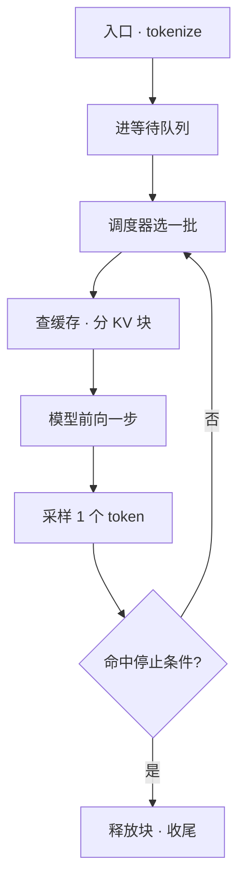

# vLLM

> 🔴 重点考点:本篇直接对应真实面经高频问法,文末「面试考点串联」给出问法对照。

一句话:vLLM 是一台**把「KV cache 怎么放」和「每一步算哪些 token」这两件事做到极致**的 LLM 推理服务器——对外是一个 OpenAI 兼容的 HTTP 服务,对内是「入口进程收发文本 + 引擎进程调度 + 每卡一个 worker 跑前向」的三段流水线。本篇只讲**它的架构分层、一个请求在里面走的完整路径、以及旋钮怎么拧**;PagedAttention、连续批处理、CUDA Graph 这些机制本身各有专篇,一律引出去。

## 一、它的定位:两个能力,一个接口

vLLM 的全部竞争力可以压成两句话:

- **显存侧**:KV cache 按固定大小的块分页存放,不按最大长度预留,还能跨请求共享公共前缀(机制见 PagedAttention 篇);
- **调度侧**:调度粒度细到每一次前向,完成的请求当步移出、等待的请求当步补进(机制见 连续批处理 篇)。

对外它给两个入口:离线批量跑用 Python 的 `LLM` 类,在线服务用 `vllm serve <model>` 起一个 **OpenAI 兼容 server**。后者的意义是前端零改造——把 base_url 指过来就能用原来的 OpenAI SDK,这也是它在生态里铺得最快的原因之一。

需要先划清的边界:**本篇不做 vLLM / SGLang / TensorRT-LLM 的横向对比**,那部分见 推理引擎对比 篇;这里只给它自己的定位(第七节)。

## 二、架构分层:六层各管什么

从 HTTP 请求落地到 attention kernel 读到 KV,中间有六层,职责必须能分清:

| 层 | 谁在做 | 做什么 | 产出 |
| --- | --- | --- | --- |
| 入口层 | API server 进程 | HTTP 收发、参数校验、套 chat template、**tokenize**、多模态数据加载、detokenize、流式回包 | token id 序列 + 采样参数 |
| 引擎核心 | 独立的引擎进程 | 一个忙循环:调度 → 派活给 worker → 收结果 → 判停止 | 每步的增量 token |
| 调度器 | 引擎核心里的组件 | 每一步决定「哪些请求各算多少 token」 | 一张「请求 → token 数」的表 |
| KV 块管理 | 引擎核心里的组件 | 按需取/还物理块、维护块表、维护前缀缓存哈希表 | 每条请求的块表 |
| 模型执行器 | 每卡一个 GPU worker 进程 | 把这一步的 token 拼成扁平输入、跑前向、采样 | 每条请求的新 token |
| attention 后端 | worker 里的可插拔实现 | 吃块表,按分页布局读 KV 算注意力 | attention 输出 |

### V1 的进程模型:为什么要拆进程

早期版本把 HTTP、tokenize、调度全塞在一个 Python 进程里,结果是 **CPU 侧的活和 GPU 侧的活抢同一个解释器**:引擎正要下发下一步,解释器却在给上一步的输出做 detokenize,GPU 空转等 CPU。V1 的解法是按角色拆进程、之间走 ZMQ 消息:

| 进程 | 几个 | 干什么 |
| --- | --- | --- |
| API server | 默认 1(开 DP 时默认等于 DP 数,可用 `--api-server-count` 指定) | HTTP + tokenize/detokenize |
| 引擎核心 | 每个 DP rank 一个 | 调度器 + KV 块管理 |
| GPU worker | 每张卡一个,总数 = DP × PP × TP | 加载权重、跑前向 |
| DP coordinator | 只有 DP > 1 时才有,1 个 | DP rank 间的负载均衡与同步 |

所以 `vllm serve -tp 4` 起的是 **1 + 1 + 4 = 6 个进程**。这个账在容量规划时要会算:CPU 核数不够,API server 进程会成为新瓶颈。

## 三、一个请求的完整生命周期

这是本篇的核心。先看骨架,再逐环拆:

**1. 进门与切词(入口进程)。** HTTP 请求落地,校验参数、按模型的 chat template 拼成一段纯文本、tokenize 成 token id;多模态请求在这里把图片/音频下载并预处理。打包成「token ids + 采样参数」后经 ZMQ 送进引擎核心。**注意 tokenize 发生在入口进程,不在引擎里**——这正是拆进程要换来的重叠。

**2. 入队(引擎核心)。** 引擎为它建一个请求对象,状态置为 waiting,挂进等待队列。默认 **FCFS**(先到先服务),也可以用 `--scheduling-policy priority` 换成优先级排序、同优先级再按到达时间。

**3. 调度:每一步选一批。** 调度器每次前向前跑一遍,受两个预算卡着:一步内总共能算多少 token(`--max-num-batched-tokens`)、同时最多几条请求(`--max-num-seqs`)。顺序是**先扫正在跑的请求**(它们的 decode,以及上一步没算完的 prefill 块),**再拿剩下的预算从等待队列拉新请求**——保证新来的长 prompt 不会把已经在跑的挤停。准入时还会检查**整条输入序列**的 KV 装不装得下,而不是只看第一个 chunk,这是为了防抢占抖动。

这一环最该记住的是 V1 调度器的形状:**它眼里没有「prefill 阶段」和「decode 阶段」之分**。每条请求只有两个数——已经算过多少 token、总共要算多少 token——调度器每步就是给每条请求派一个 token 数,让前者去追后者。派 1 个就是 decode,派 512 个就是一块 chunked prefill,派 1+k 个就是投机解码的验证。**chunked prefill、前缀缓存、投机解码于是不需要各写一套调度分支,全都落在同一张「请求 → token 数」的表里。**

**4. 要块(KV 块管理)。** 拿到这一步要算的 token 数,块管理器先按块哈希去**前缀缓存表**里查:命中的块直接把引用计数加一、写进这条请求的块表,这部分 token 不用再算;剩下的从空闲块队列里取新块。块大小默认 **16 个 token**(`--block-size`)。分页与块表本身见 PagedAttention 篇。

**5. 前向(GPU worker)。** worker 把这一步所有请求的 token 拼成**一条扁平序列**送进模型——同一个 batch 里既有某条长 prompt 的第 k 块 prefill,也有几十条请求的单 token decode。attention 后端按块表读 KV。这一步走 eager 还是重放 CUDA Graph,由一个运行时派发器按**当前 batch 的组成**决定(见第五节)。

**6. 采样。** logits 出来后在 GPU 上批量采样:同一批里每条请求的温度、top-p、惩罚各不相同,做法是把它们打成**逐行张量**、一个 kernel 处理整批,而不是在 CPU 上循环走分支(采样算法本身见 解码策略 篇)。开了结构化输出的请求,合法 token 的 mask 也在这一层打。

**7. 判停止:注意它分两处。** EOS、`stop_token_ids`、`max_tokens`、`max_model_len` 这四类在**引擎核心当场判**,因为只看 token id 就够了;而 **stop string 必须先 detokenize 成文本才判得了**,所以它是在入口进程做增量解码时发现的,发现后再回抛一个 abort 给引擎核心。面试里问「停止检测在哪一层」,答「分两处、按需不需要文本切开」比答一个位置更准。

**8. 流式返回。** 每步产出的增量 token 经 ZMQ 回到入口进程,detokenize 成文本片段,按 SSE 吐给客户端。用户看到的「打字机效果」就是这条回路每步走一趟。

**9. 收尾与释放。** 请求结束,它的块引用计数减一;减到 0 的块回到空闲队列——但**块的哈希仍然留在前缀缓存表里**,直到这一格真的被别人取走才失效。所以刚跑完的请求,它的前缀往往还能被下一个同前缀的请求命中,这是「前缀缓存几乎白送」的实现依据。

**插曲:显存不够时会被踢。** KV 池见底时调度器必须腾块:FCFS 下踢最后到达的那条,把它的块全部释放、已算 token 数清零、塞回等待队列**队头**。恢复时重新 prefill(而且大概率能命中刚才自己留下的前缀缓存)。**V1 只做重算,不做换出到 CPU**——换出要走 PCIe,常常比重算还慢。抢占与饿死的完整讨论见 连续批处理 篇。

## 四、V1 相对早期版本改了什么

V0 已经完全下线,今天装到的就是 V1。这次重构改的不是某个算法,而是**上面那条流水线的组织方式**:

| 维度 | 早期(V0) | V1 现在 |
| --- | --- | --- |
| 进程模型 | HTTP、tokenize、调度挤在一个进程,GIL 争用 | 入口 / 引擎核心 / 每卡 worker 拆进程,ZMQ 互联 |
| 调度器 | prefill 与 decode 两条分支 | 统一 token 预算,**没有阶段之分** |
| chunked prefill | 按模型条件开 | **默认开** |
| 前缀缓存 | 默认关 | **默认开**,块哈希默认 sha256 |
| 抢占 | 换出 / 重算两条路 | **只重算** |
| torch.compile | 可选 | 默认开,且**所有编译在接客前做完**,产物落盘可复用 |
| CUDA Graph | 与编译强耦合,要么整图要么分段 | 与编译**解耦**,运行时按 batch 组成派发 |
| 调度与执行 | 串行:算完这一步才调度下一步 | **异步调度默认开**,下一步的调度与这一步的前向重叠 |

> 上表的默认值随版本演进(本篇按 0.20.x 一线写),线上以启动日志里打印的实际配置为准,不要凭印象。源码级的实现细节见开源解读模块。

## 五、四件看家本领,vLLM 各自是怎么用的

| 能力 | vLLM 的用法 | 原理去哪看 |
| --- | --- | --- |
| **分页 KV** | 启动时把可用显存一次吃成块池,运行期只做「取一格 / 还一格」,不再 malloc;块默认 16 token | PagedAttention 篇 |
| **前缀缓存** | 按块算哈希入表,**只缓存写满的整块**;哈希由「父块哈希 + 本块 token + 额外因子(LoRA id、图片哈希、多租户隔离用的 cache salt)」三段拼成,命中即引用 | PagedAttention 篇;前缀树式做法见 RadixAttention 篇 |
| **连续批处理 + chunked prefill** | 每步一张「请求 → token 数」表,**decode 优先**,剩余预算才给 prefill;放不下的 prefill 自动切块 | 连续批处理 篇 |
| **CUDA Graph + 编译** | 按 batch 分档捕获;默认 `FULL_AND_PIECEWISE`——纯 decode 的整齐 batch 用整图重放,混了 prefill 的 batch 走分段图。`-O0`~`-O3` 一个开关调「启动时间 vs 性能」,`--enforce-eager` 两者全关 | CudaGraph 篇、TorchCompile 篇 |

前缀缓存的哈希为什么必须捎上父块哈希:同样四个 token「the leaves as children」出现在不同的上文之后,KV 是不一样的;把父块哈希拼进去,**一个块的身份才等于「从头到这里的整段前缀」**,复用才不会串味。这也是「只缓存写满的整块」的配套——被共享的块都是不会再被写入的满块,写时复制这件事就由构造消失了。

CUDA Graph 那行的关键词是**解耦**:捕图不再要求必须走分段编译,而是由一个派发器在每步前看一眼 batch 的形状(总 token 数、请求数、各请求的 query 长度是否一致),再决定用整图、分段图还是干脆 eager。好处是各 attention 后端的图友好程度参差不齐时,不必再做「全开或全关」的二选一。

## 六、常用配置项:调什么、影响什么

| 参数(默认值) | 影响什么 | 往两边拧的后果 |
| --- | --- | --- |
| `--gpu-memory-utilization`(0.92) | 这张卡允许 vLLM 占的显存比例。**KV 池是残差项**:先按这个比例圈出总额度,启动时跑一次 profile 量出权重 + 峰值激活 + 非 torch 开销,剩下的全给 KV | 调大:KV 池更大 → 并发上限更高、抢占更少,但离 OOM 更近、和别的进程共卡会打架;调小:安全,但并发直接掉 |
| `--max-num-batched-tokens`(随卡与入口而异,`vllm serve` 在 80 GB 级卡上是 8192) | 一步能算多少 token,也就是 chunked prefill 的块大小上限 | 调大:一步吃下更多 prefill → **TTFT 更好**;调小:decode 更少被 prefill 挤 → **ITL 更稳** |
| `--max-num-seqs`(80 GB 级卡上 1024,否则 256) | 一步最多几条请求,并发上限 | 调大:吞吐天花板高,但 KV 压力大、抢占概率上升;调小:延迟稳、抢占少,吞吐降 |
| `--kv-cache-dtype`(auto) | KV 用什么精度存 | 换 `fp8` 后 KV 字节减半 → 同样显存装下约两倍 KV,decode 的 KV 读取流量也减半;代价是精度损失(见 KVCache量化 篇) |
| `--block-size`(16) | 分配与共享的粒度 | 调大:块表短、kernel 一次能顺着读更长;调小:尾块浪费少、前缀命中粒度细。取舍见 PagedAttention 篇 |
| `--enable-prefix-caching`(开) | 跨请求复用公共前缀的 KV | 多轮对话、长 system prompt、同 prompt 多采样收益最大;`--no-enable-prefix-caching` 关掉,省一点哈希开销 |
| `--max-model-len`(取模型上限) | 单请求上下文上限 | 它同时决定**单请求最坏情况的 KV 占用**,设太大等于给准入检查抬高门槛 |
| `--tensor-parallel-size` / `--pipeline-parallel-size` / `--data-parallel-size` / `--enable-expert-parallel` | 模型怎么切到多卡 | TP 降单请求时延但不出机,PP 只提吞吐,DP 是多副本,EP 给 MoE 用。选型见 并行策略 篇 |
| `--enforce-eager` / `-O0`~`-O3`(默认 `-O2`) | 编译与图捕获的强度 | 关掉:启动快、显存省(图池不占地),但 decode 的 launch 开销回来;开满:启动慢、图池吃显存挤占 KV(见 CudaGraph 篇) |
| `--scheduling-policy`(fcfs) | 谁先跑 | 换 `priority` 可以让高优请求插队,代价是低优请求可能长期排队 |
| `--async-scheduling`(默认开) | 调度是否与前向重叠 | 开着能填掉 GPU 的调度空档;某些投机解码方法下不兼容会自动退回 |

一条排障心法:**线上出现频繁抢占的告警时,四个动作按代价从小到大排**——先调大 `--gpu-memory-utilization`,再调小 `--max-num-seqs` 或 `--max-num-batched-tokens`,再加 TP(权重摊薄,每卡腾出 KV),最后才是加 PP 或加机器。显存总账怎么拆见 显存管理与OOM 篇。

## 七、它擅长什么、不擅长什么

**擅长**:通用在线服务的吞吐(分页 + 连续批处理 + 前缀缓存三件套是原生能力,零配置就默认打开);新模型跟进快;OpenAI 兼容接口让前端零改造;TP/PP/DP/EP 齐全,PD 分离所需的 KV 传输连接器(`--kv-transfer-config`)也有(部署形态见 PD分离 篇),从单卡到多机的路径完整;RL 训练里当采样器是事实标准后端。

**不擅长、或者说要认清代价的**:

- **极致的单请求低延迟**不是它的设计目标。默认配置优化的是「满足 SLO 前提下的有效吞吐」(goodput 的定义见 推理服务指标 篇);要压极限 TTFT,得手动调小并发、放大 token 预算,甚至关掉 chunked prefill;
- **复杂的树状/多轮程序**上,前缀复用只到「哈希块」这一层,不像前缀树那样天然表达「谁是谁的祖先」(见 RadixAttention 篇);
- **冷启动不便宜**:torch.compile 加上分档捕图,首次启动几十秒到几分钟。编译产物有磁盘缓存,同配置第二次起就快得多——弹性扩容的场景要把这层缓存预热好;
- **默认吃满 0.92 的显存**,和别的进程共卡时必须手动降,否则互相踩;
- **同一个 prompt 两次结果可能不一样**,即使 temperature=0。根因是连续批处理让 batch 组成每步都在变(见 连续批处理 篇),不是 vLLM 的 bug,但需要 bit 级复现的场景(RL 训推一致、回归测试)必须提前知道。

## 面试考点串联

| 高频问法 | 本文哪一节 |
| --- | --- |
| 从一个请求过来,到最后吐出 token,把这个请求在 vllm 或者 sglang 里经历了哪些流程大概描述一下 | 三(九环全流程)+ 二(分层) |
| vLLM 分了哪几层?为什么要把入口、引擎、worker 拆成不同进程? | 二(六层表 + GIL 争用) |
| V1 相对早期版本改了什么?调度器为什么不再分 prefill 和 decode? | 四 + 三(只看「已算/待算」两个数) |
| 一个请求的 KV 块什么时候分配?请求结束后块去哪了? | 三(第 4、9 步:命中即引用;释放后哈希仍留在表里) |
| 停止条件是在哪一层判的?stop string 为什么特殊? | 三(第 7 步:EOS 在引擎、stop string 在入口) |
| 显存不够时 vLLM 会怎么办?被踢掉的请求怎么恢复? | 三(抢占插曲:只重算、塞回队头) |
| 前缀缓存是怎么做的?为什么块哈希要带上父块哈希? | 五(三段拼接 + 只缓存满块) |
| `--gpu-memory-utilization` 调大调小会怎样?KV cache 的大小是怎么定出来的? | 六(KV 是残差项:总额度 − 权重 − 峰值激活 − 非 torch) |
| `--max-num-batched-tokens` 调大调小,TTFT 和 ITL 分别往哪走? | 六(调大偏 TTFT,调小偏 ITL) |
| vLLM 默认开了 chunked prefill,什么业务反而该关掉它? | 六 + 七(只考核首字延迟的长 prompt 短输出业务) |
| CUDA Graph 在 vLLM 里是怎么用的?为什么要和编译解耦? | 五(按 batch 分档 + 运行时派发) |
| 线上频繁抢占,你按什么顺序调? | 六(四个动作的代价排序) |
| vLLM 适合什么场景、不适合什么场景? | 七 |

> 本表混有面经原题与自拟题;自拟题按写作契约第九节的出题标准补出。

延伸阅读顺序:本篇 → PagedAttention(显存怎么分页)→ 连续批处理(调度怎么选批)→ CudaGraph 与 TorchCompile(执行层怎么提速)→ 推理引擎对比(和别家怎么选)。

## 相关文献

- Efficient Memory Management for Large Language Model Serving with PagedAttention(vLLM 原始论文,SOSP'23)— [arXiv:2309.06180](https://arxiv.org/abs/2309.06180)
- vLLM V1: A Major Upgrade to vLLM's Core Architecture(V1 重构的设计动机与进程模型)— https://vllm.ai/blog/2025-01-27-v1-alpha-release
- vLLM 官方文档 · Architecture Overview(入口、V1 进程数账、worker 与 model runner 的分层)— https://docs.vllm.ai/en/latest/design/arch_overview.html
- vLLM 官方文档 · Automatic Prefix Caching(块哈希的三段构成、只缓存满块、哈希算法选项)— https://docs.vllm.ai/en/latest/design/prefix_caching.html
- vLLM 官方文档 · CUDA Graphs(cudagraph_mode 的五种取值与运行时派发)— https://docs.vllm.ai/en/latest/design/cuda_graphs.html
- vLLM 官方文档 · Optimization and Tuning(优化等级、抢占的处置顺序、chunked prefill 调参)— https://docs.vllm.ai/en/latest/configuration/optimization.html
- vLLM 官方文档 · torch.compile integration(编译缓存与「接客前编完」的保证)— https://docs.vllm.ai/en/latest/design/torch_compile.html
