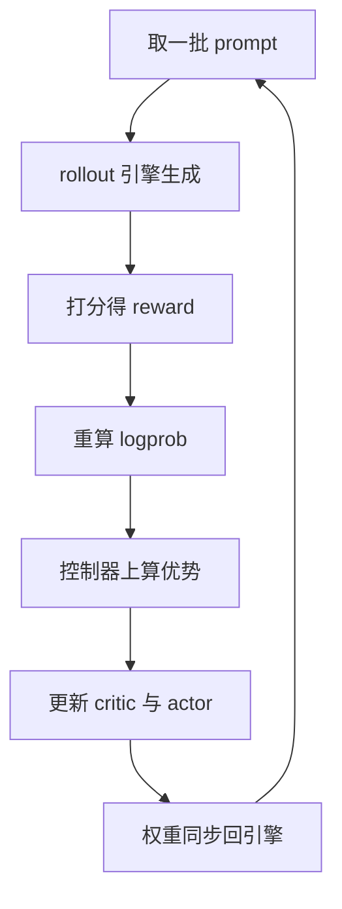

# verl

> 🔴 重点考点:本篇直接对应真实面经高频问法,文末「面试考点串联」给出问法对照。

一句话:verl 是**给 LLM 强化学习训练做编排的框架**——训练引擎和推理引擎它一个都不造,它造的是把这两台性格相反的机器接到同一条数据流上的那套胶水,好让 PPO/GRPO 这类算法用几十行描述出来,再在几百上千张卡上跑起来。它的系统论文叫 HybridFlow。

## 一、先划清定位:它不做什么

verl 由字节跳动 Seed 团队发起、现由 verl 社区维护,是 HybridFlow 论文(EuroSys 2025)的开源实现。看懂它,先看它**把哪些活外包了**:

| 环节 | 自己造轮子吗 | 接的是谁 |
| --- | --- | --- |
| 反向传播、优化器、参数切分 | ❌ | FSDP / FSDP2 / Megatron-LM(见 FSDP 篇、Megatron 篇) |
| 自回归生成、KV cache、连续批处理 | ❌ | vLLM / SGLang / HF 原生 generate(见 vLLM 篇、SGLang 篇、连续批处理 篇) |
| 集群调度、进程拉起与放置 | ❌ | Ray |
| **谁给谁、算什么、放哪张卡、权重怎么搬** | ✅ | 这是它的全部 |

所以评价 verl 不该问"它的 kernel 快不快",该问"它把两台引擎串得顺不顺"。RL 框架演进极快,下文所有"支持什么"的断言以本地源码(0.8 开发版)与官方文档为准,**随版本演进**;与其他 RL 框架的横向对比与选型见 RL框架对比 篇,源码级实现见开源解读模块。

## 二、题眼:一次迭代里住着两个工种

预训练和 SFT 的一次迭代只有一件事——前向、反向、更新。RL 不一样:**得先让模型自己把答案生成出来,才有东西可训**。于是同一次迭代里同时存在生成与训练,而这两件事对硬件的诉求几乎处处相反:

| | 生成(rollout) | 训练(update) |
| --- | --- | --- |
| 在干什么 | 自回归逐 token 吐,主体是 decode | 一次前向 + 一次反向 + 优化器一步 |
| 瓶颈 | 访存受限,靠大批并发把带宽打满 | 计算受限,还得装得下梯度与优化器状态 |
| 显存花在哪 | 权重 + **KV cache**(越大并发越高) | 权重 + 梯度 + 优化器状态 + 激活 |
| 并行怎么切 | 通常只按 TP 切(再加 DP 复制),TP 越小副本越多、吞吐越高 | FSDP 全切分,或 TP×PP×DP 3D 并行(见 并行策略 篇) |
| 批大小怎么定 | 越大越好,被 KV cache 容量卡住 | 被显存与 mini-batch 语义卡住 |
| 一步里的时间占比 | 同步式训练里常是大头(DAPO 32B 复现里约七成) | 剩下的 |

一句话:**同一份权重,在两边的最佳摆法根本不一样**。这条不对付派生出 RL 框架的三道主菜——

1. **卡怎么分**:两个工种共用一批卡分时切换,还是各占各的池子?
2. **权重怎么搬**:训练完的新权重怎么从训练侧布局变成推理侧布局,而且**每步都要来一次**?
3. **算法怎么改**:RL 算法的花样几乎全在数据流上,框架得让人改数据流时不必碰分布式代码。

算法本身(clip 目标、优势估计、KL 惩罚放哪)不在本篇——PPO 见 PPO 篇,GRPO 见 GRPO 篇。本篇只讲这三道主菜。

## 三、HybridFlow:单控制器 + 多控制器的分层

论文的核心观察是:RL 训练是**两层数据流**叠在一起。

- **控制流**:先 rollout、再打分、再算优势、最后更新——这是 RL 算法的逻辑,几十个高层算子,流动的数据量小;
- **计算流**:某个模型内部的前向/反向/优化器怎么在几百张卡上跑——这是分布式训练的逻辑,流动的数据量大。

两条路各有极端做法,代价都很实在:

| 做法 | 怎么写 | 好处 | 代价 |
| --- | --- | --- | --- |
| 纯多控制器(SPMD) | 每个进程跑同一份脚本,靠集合通信对齐 | 通信最少、性能上限最高 | 控制流被摊进每个进程,**换个训练后端或加一条数据依赖就得重写** |
| 纯单控制器 | 一个中心进程发号施令 | 算法逻辑写起来像单机程序 | 大张量都经中心节点中转,规模一上来就堵死 |

verl 的选择是**按层分治**:**控制流交给单控制器**(一个普通的单进程脚本),**计算流保持多控制器**(每个角色内部仍是原生 SPMD,该用 FSDP 用 FSDP,该 3D 并行就 3D 并行)。类比:导演只有一个,拿着完整剧本喊"这场戏谁上";每个剧组内部怎么排练,导演不管。

### 为什么这能让"换算法"只改几十行

因为**算法的差异几乎全落在控制流那一层**:采几个样本、优势怎么估、要不要 critic、KL 放 reward 里还是放 loss 里——都是"谁给谁、算什么"的调整。在 verl 里这一层就是一段普通的顺序代码:

```python
# 示意伪代码(非项目源码):控制流就是单进程里的几行顺序调用
for prompts in dataloader:
    batch  = actor_rollout.generate(prompts)      # 底下是推理引擎的多进程
    batch |= reward.score(batch)                  # 规则 verifier 或 reward 模型
    batch |= actor_rollout.recompute_logprob(batch)
    batch |= ref.logprob(batch)                   # 需要 KL 时才有这行
    batch |= critic.value(batch)                  # 免 critic 的算法直接删掉这行
    batch |= compute_advantage(batch)             # 在控制器本地算,数据量小
    critic.update(batch)
    actor_rollout.update(batch)
```

每个角色的方法上挂一个**"分发/收集模式"的标注**,框架据此自动做三件事:按数据并行度把输入切开、下发给各工作进程、收回来拼好。于是控制器写的是一次函数调用,底下跑的是几百个进程。**代价也明明白白**:控制器与工作进程每交互一次,数据就要来回搬一趟——这是 verl 为灵活性付的钱,论文里也是这么写的。

## 四、角色与资源编排:谁和谁共卡

一次 PPO 训练最多同时有四类角色;RLVR 场景常常只剩两三类:

| 角色 | 干什么 | 训练态还是推理态 | 默认怎么放 |
| --- | --- | --- | --- |
| actor | 被优化的策略模型 | 训练(参数 + 梯度 + 优化器状态) | 占满全部训练卡 |
| rollout | 拿 actor 的权重生成回答 | 推理(权重 + KV cache) | **与 actor 同卡分时** |
| reference | 提供 KL 锚点,只前向 | 推理(只有权重) | 融进 actor 那一组进程 |
| critic | 估值,只有 PPO 系需要 | 训练 | 同上一批卡,可拆到独立池 |
| reward | 打分:规则 verifier 或 reward 模型 | RLVR 里常是 CPU 上的函数;模型 RM 走推理引擎 | 默认同卡,可开独立资源池 |

三条要点:

- **actor 与 rollout 同卡是设计决定,不是巧合**。它们共用同一份权重,放一起才能用卡内/机内的高速链路做权重同步(见下一节);拆成两个池子就得走网络。主干的同步式训练默认打开这个开关(配置里叫 hybrid engine)。
- **共卡就得分时**。rollout 阶段把训练态(优化器状态、梯度乃至参数)offload 到 CPU,显存腾给推理引擎的权重与 KV cache;生成一结束就释放 KV cache、把训练态装回来。这一进一出是共卡方案的固定开销,换来的是任何时刻没有闲卡。
- **要拆也能拆**:reward 模型可以单独占一个资源池;actor/ref 与 critic/RM 各占半边卡的布局官方给了示例。把 rollout 整体拆出去(关掉 hybrid engine)属于异步训练的路子,见第七节。

## 五、权重同步:RL 框架最硬的一块

每更新一次 actor,新权重都得送回生成引擎——on-policy 算法要求采样用的就是最新策略。这件事不简单,有三层原因:

1. **不是复制,是改摆法**。训练侧按 FSDP 全切分或 Megatron 的 TP×PP(×EP)摆放,推理侧通常只按 TP 切再加 DP 复制,两边的分片规则对不上。像一套家具从三室一厅搬进大开间,得拆开重装。
2. **每步都来一次**。7B 十几 GB、MoE 大模型上百 GB,几百上千步累起来,搬运时间直接写进端到端训练时间。
3. **最笨的办法会炸显存**:先 all-gather 出完整权重再切给推理侧,等于凭空多出一整份模型副本——而这时训练态还没腾干净。

verl 把这条路径抽象成一个**统一的权重同步后端**:训练引擎按"一个张量一个张量"的方式吐出完整权重,同步后端把它们攒进固定大小的桶(默认 2 GB 一桶)流式发出,接收侧再通过 CUDA IPC 把桶里的权重交给同机的推理引擎进程。关键是**任何时刻只有一个桶的量占额外显存**,不需要整份副本。

后端按部署形态选(可选项随版本演进):

| 场景 | 走什么通道 | 说明 |
| --- | --- | --- |
| 共卡(默认) | 进程组内 all-gather | 训练与生成本就在同一批卡上,一个字节不出机 |
| 分池、固定集群 | all-gather + 跨组 broadcast(NCCL/HCCL) | 训练组先凑齐,再广播给 rollout 组(算子语义见 集合通信 篇) |
| 分池、rollout 要弹性伸缩 | 点对点 + 环形传递(NIXL / Mooncake 传输引擎) | 拓扑可动态调整,容忍 rollout 节点增减 |

一个量级参考(仓库自带基准,Qwen3-30B-A3B、4×8 张 H100、400 Gbps InfiniBand):跨组同步一次约 7 秒、有效带宽约 8.25 GB/s。**这是纯搬运时间,同步式训练里它整段压在关键路径上**——这正是异步方案的主要动机之一。

论文里这套东西叫 3D-HybridEngine(共卡时训练态与推理态共享同一份权重存储,阶段切换只做必要的重排通信);当前代码里它已被推广成上面这个统一后端,共卡与分池共用一套接口。

## 六、一次完整迭代



每步一句话:

1. **取 prompt**:从数据集取一批题目;组内比较类算法会把每题复制 n 份(配置项就是 `rollout.n`)。
2. **rollout 生成**:交给推理引擎批量生成;多轮与工具调用场景走引擎的异步 server 接口(框架里叫 agent loop),生成结束就让引擎"睡下"、释放 KV cache。
3. **打分**:RLVR 走规则 verifier(判数学答案对不对、代码跑不跑得过),RLHF 走 reward 模型前向(RM 怎么训见 RLHF与RM 篇)。
4. **重算 logprob**:在**训练侧**用同一份权重重算一遍旧策略的 logprob,而不是直接用推理引擎返回的;需要 KL 时再让 reference 前向一次。为什么要重算见第七节。
5. **算优势**:在控制器进程本地算(只是些逐 token 的加减,数据量小);公式见 PPO 篇与 GRPO 篇。
6. **更新**:critic 先更(如果有),再 actor 反向 + 优化器一步。
7. **权重同步**:把新权重推回生成引擎,下一步采的才算"最新策略"。

### 四种 batch 参数不要混算

下面口径以本地 verl 快照 `3c5f6e0`(2026-04-29)为准,版本变化时应先查当前配置定义。设每步取 $B$ 个 prompt,每个 prompt 生成 $n$ 条回答,actor 配置的 PPO mini-batch 为 $M$,数据并行度为 $D$,每卡 micro-batch 为 $m$:

- `data.train_batch_size = B`:一轮先取多少个不同 prompt;
- `actor_rollout_ref.rollout.n = n`:每个 prompt 生成多少条 trajectory,常规路径共得到 $B n$ 条;
- `actor_rollout_ref.actor.ppo_mini_batch_size = M`:代码会按 prompt 口径取一个 mini-batch,实际进入 actor 更新的是 $M n$ 条 trajectory;
- `actor_rollout_ref.actor.ppo_micro_batch_size_per_gpu = m`:每个数据并行 rank 一次处理多少条 trajectory。

固定样本数 micro-batch 时,每个 rank 完成一个 actor mini-batch 需要的梯度累积次数是:

$$
N_{\text{acc}}=\frac{M n}{D m}.
$$

这里不再额外乘 `world_size`:数据并行度已经表示样本如何分卡;TP/PP 是切一份模型,也不能重复当成样本并行。`rollout_batch_size`、`global_batch_size` 和 `micro_batch_size_per_device_for_update` 不是该快照下 PPO 配方的正式用户参数名。动态批处理打开后,真正的 micro-batch 还会按 token 数重排,上式只说明固定样本口径。

## 七、上手门槛与常见坑

### 给推理引擎留多少显存

`rollout.gpu_memory_utilization` 决定推理引擎能占多少显存,官方经验区间是 **0.5–0.7**。开小了 KV cache 装不下几条并发、生成慢;开大了训练态装不回来直接 OOM。有个真实的坑:**这个参数在不同引擎里的定义不一样**——vLLM 新版本按 GPU **总**显存算,SGLang 按**空闲**显存算静态部分,同一个数换个引擎就可能炸。

另一个:**CUDA Graph 捕获的那块显存 offload 不掉**,训练阶段它还占着(CUDA Graph 是什么见 CudaGraph 篇)。要么关掉(`enforce_eager=true`,牺牲一点生成速度),要么用 `cudagraph_capture_sizes` 只捕获几个小批量。

### 长序列

RL 的回答动辄几千上万 token,而且**长度极不均匀**。对应旋钮:打开 `use_dynamic_bsz` 按 token 数而不是样本数组批;`ppo_max_token_len_per_gpu` 官方建议至少给到 prompt+response 上限的 2 倍(示例脚本给到 3 倍);再不够就上梯度检查点、激活 offload,以及 Ulysses 序列并行(切法本身见 并行策略 篇)。显存账怎么算见 显存管理与OOM 篇。

### 生成与训练算出的 logprob 对不上

同一份权重、同一个 token,推理引擎和训练引擎给出的 logprob 会有数值差异——kernel 实现不同、精度不同、批的组织方式不同。差异小时只是噪声;一旦被重要性比放大,轻则梯度有偏,重则训练崩掉。verl 默认走**解耦模式**:在训练侧重算旧策略 logprob 当锚点,而不是直接用推理端返回的那个;也提供把这份差异显式当 off-policy 纠正的开关(重要性采样权重 + 拒绝采样)。**记住"两边本来就算不一样"是问题的根,不是实现 bug。**

### rollout 长尾拖垮利用率

同步式流程下,一步的耗时由**最长的那条回答**决定,而且加卡压不下去。框架侧的解法是把 rollout 拆出去、让生成与训练重叠:训练用上一步生成的样本(one-step-off),或者彻底解耦、用参数新鲜度阈值控制偏差(fully async)。官方在 128 卡 Qwen2.5-7B 上报的加速是 2.35–2.67 倍。**代价是数据不再严格 on-policy**,得靠上面那套 off-policy 纠正兜着;这条路径当前仍标为实验性。思路上与推理侧把两个阶段拆开部署同源,可对照 PD分离 篇。

### 版本耦合

训练侧与生成侧各自绑一堆版本(推理引擎、Megatron、Transformers、CUDA),官方文档会明确写"某功能需要某引擎 ≥ 某版本"。**先按官方镜像跑通再改**,这是最省时间的一条。

## 面试考点串联

| 高频问法 | 本文哪一节 |
| --- | --- |
| RL 训练里生成和训练对资源的诉求为什么冲突?框架怎么调和? | 二 + 四 |
| 什么是单控制器 + 多控制器的混合编程模型?为什么 RL 框架非要分这两层? | 三 |
| 在 verl 上换一个 RL 算法,要改什么、不用改什么?为什么能这么省? | 三(控制流那一层) |
| 生成引擎和训练侧的权重怎么同步?为什么这件事不简单? | 五(改摆法 + 每步一次 + 显存峰值) |
| actor / critic / reference / reward 默认怎么放卡?什么时候该拆池? | 四 |
| rollout、mini-batch、micro-batch 分别数什么,梯度累积次数怎样算?<br>真题来源:[B002-Q009](../../../docs/references/面经原题.md#b002-g01-q009)、[B002-Q044](../../../docs/references/面经原题.md#b002-g01-q044)、[B002-Q045](../../../docs/references/面经原题.md#b002-g01-q045) | 六(四种 batch 参数);平台 P003-Q011 |
| 同一个 token,推理引擎和训练侧算出的 logprob 对不上,有什么后果?怎么处理? | 七 + 六(第 4 步) |
| 同步式 RL 里 rollout 的长尾为什么会拖垮利用率?能怎么办? | 七(最后两小节) |

> 本表混有面经原题、平台整理题与自拟题;平台题不因此视为面经。

## 相关文献

- HybridFlow: A Flexible and Efficient RLHF Framework(verl 的系统论文,EuroSys 2025)— [arXiv:2409.19256](https://arxiv.org/abs/2409.19256)
- DAPO: An Open-Source LLM Reinforcement Learning System at Scale(以 verl 为基座的大规模 RLVR 实践)— [arXiv:2503.14476](https://arxiv.org/abs/2503.14476)
- AReaL: A Large-Scale Asynchronous Reinforcement Learning System for Language Reasoning(异步 RL 系统,verl 异步方案的参考对象)— [arXiv:2505.24298](https://arxiv.org/abs/2505.24298)
- verl 仓库(2026 年初从 volcengine 迁至 verl-project)— https://github.com/verl-project/verl
- verl 文档 — https://verl.readthedocs.io/en/latest/
- HybridFlow 编程指南(两层数据流与设计取舍的官方说明)— https://verl.readthedocs.io/en/latest/hybrid_flow.html
