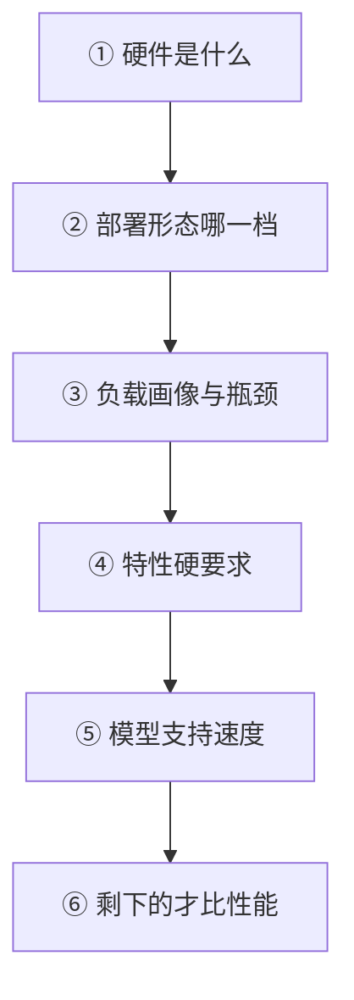

# 推理引擎对比

一句话:这是一篇**选型篇**——不讲任何一项机制的原理(每一项都有自己的专篇),只回答那个没有哪一篇专篇能回答的问题:**主流推理引擎的架构其实早已高度趋同,那么剩下的差异到底落在哪几条线上?给定一种负载,你选谁、依据是什么?**

阅读约定同 推理加速 篇:下文每提到一项技术,只给一句定位加一个篇名,机制细节一律去那一篇看;各引擎自己的内部分层与请求生命周期,见 vLLM 篇与 SGLang 篇。

## 一、先泼一盆冷水:骨架已经趋同

2023 年选引擎是在选**能力**——那时候「支不支持分页 KV」这一问真能把候选名单砍掉一半。现在不是了。下面这几件事,主流引擎**全都有,而且大多默认就开着**:

| 骨架件 | 干什么用 | 现在的状态 | 原理去哪篇看 |
|---|---|---|---|
| 分页 KV | KV 切成定长块散着放,消灭碎片 | 全员标配 | PagedAttention 篇 |
| 连续批处理 | 调度粒度细到一个 decode step | 全员标配 | 连续批处理 篇 |
| chunked prefill | 长 prefill 切块,别卡住 decode | 全员支持,多为默认开 | 连续批处理 篇 |
| CUDA Graph / 编译 | 消掉 CPU 下发开销,按形状分档冻结 | 全员支持,默认开 | CudaGraph 篇 · TorchCompile 篇 |
| 前缀复用 | 相同开头的 KV 只算一次 | 全员支持,主流默认开 | RadixAttention 篇 |
| 低位宽 checkpoint | 直接读 GPTQ / AWQ / FP8 权重 | 全员支持,差别在 kernel(见第三节) | 量化 篇 |

「默认开」这件事从命令行开关的**方向**上就能看出来——要关掉才需要显式写一句:

```bash
# vLLM:前缀缓存默认开,关它才要加参数
vllm serve <model> --no-enable-prefix-caching

# SGLang:基数树缓存与 CUDA Graph 都默认开,分段捕图也已默认开
python -m sglang.launch_server --model-path <model> \
    --disable-radix-cache --disable-cuda-graph
```

趋同到什么程度?社区里那份广为流传的教学复刻(nano-vllm),用**约一千两百行 Python** 就把分页块表、前缀哈希复用、连续批调度、chunked prefill、CUDA Graph 分档捕获整套跑通了。**一千两百行能写完的东西,不可能是选型的分水岭。**

顺带解释一个容易被追问的收敛点:vLLM 与 SGLang 在「编译 + 捕图」上走到了同一个做法——**把模型图切成片段编译,再把捕图边界和图的断裂点对齐**,于是 attention 这类不吃固定形状的算子可以排除在捕获之外,其余部分照样享受重放。这解决的是「编译想要动态形状、CUDA Graph 只吃固定形状」那对矛盾(见 TorchCompile 篇与 CudaGraph 篇)。两家分别把它叫作分段捕图/分段 CUDA Graph,名字不同,思路是一个。

所以第一条纪律:**别再拿「支不支持某某机制」当选型问题**,那等于问一辆车支不支持四个轮子。该问的是下一节这四条。

## 二、真正的分野:四条线

### 线一:前缀复用做到了第几层

数据结构上的差异(块哈希表 vs 基数树)在面试里还值得讲,但在**选型**里已经不是重点——两条路线目标一致、命中效果同量级(对比见 RadixAttention 篇)。真正拉开差距的是**层数与共享范围**:

| 档 | 缓存放在哪 | 能被谁复用 | 什么时候你需要它 |
|---|---|---|---|
| 一层 | 只在显存 | 本实例的后续请求 | 单实例、显存够用 |
| 两层 | 显存 + 主机内存 | 同上,但容量大一个量级 | 长上下文、会话间隔久 |
| 三层 | 再加集群共享存储 | **跨实例** | 多副本集群,同一批文档被反复问 |

SGLang 把分层缓存做进了主干(HiCache,GPU/主机/分布式存储三级,默认关、按需开);vLLM 走的是插件位——用 KV connector 把外部 KV 层(如 LMCache)接进来,同一个位子也顺带接了 PD 分离的传输后端。**选型含义:如果你是多实例集群,第一个该问的不是「有没有前缀缓存」,而是「跨实例能不能共享」。**

还有一类跳出前缀限制的路子:复用**非前缀**片段(RAG 场景里被检索到的那几段文档,位置每次都不同)。代价是要额外处理位置编码、并接受拼接处的精度损失,不是前缀缓存顺手能做的事(见文末 CacheBlend)。

### 线二:结构化输出的支持深度

「能不能输出合法 JSON」现在是全员及格线,都能挂 xgrammar、llguidance 这类语法后端(约束解码的机制见 解码策略 篇)。深度差在两处:**能不能和别的特性共存**(投机解码、reasoning 模型的思考段、工具调用解析器),以及**语法编译的开销进不进关键路径**。SGLang 另有前端 DSL,把「生成—分支—拼接」的流程程序化(见 SGLang 篇)。

这一线上有个很实在的坑:**接口本身在动**。vLLM 在 0.12 把 `guided_json` / `guided_regex` 这一组字段收敛成统一的 `structured_outputs`,老教程照抄会直接报错。选型时把这类变动记进「跟版本的成本」那一栏。

### 线三:硬件绑定程度——「支持」是个含糊词

把「支持」拆成三档才有意义:**在主干里 / 在独立插件仓里 / 不支持**。截至写作时的大致格局:

- **vLLM 主干**:NVIDIA CUDA、AMD ROCm、Intel XPU,加上 x86 / ARM / Apple silicon / IBM Z 的 CPU 后端;Gaudi、TPU 迁到了各自独立的插件仓
- **SGLang**:在此之外还有 Ascend NPU、TPU、Apple Metal、摩尔线程、Jetson 等平台的独立文档
- **TensorRT-LLM**:绑死 NVIDIA,换来的是自家栈上最激进的 FP8 / FP4 支持
- **llama.cpp**:反过来,把 CPU 与 Apple Metal 当一等公民

但 **「支持」不等于「一样快」**:同一份 AWQ checkpoint,在 NVIDIA 上走专用反量化 kernel,换到 AMD 上就退回通用 Triton 路径。这是第三节要展开的重点。

### 线四:部署形态

| 档 | 形态 | 代表 | 代价 |
|---|---|---|---|
| 库 | pip 装完就是服务 | vLLM / SGLang | 无 |
| 单机二进制 | 一个可执行文件 + 一个权重文件 | llama.cpp | 功能面窄 |
| 编译型栈 | 要为模型和形状做一次构建 | TensorRT 传统路线 | 上线周期变长,换模型要重来 |
| 集群件 | PD 分离、多实例路由、KV 存储 | 两家都有配套 | 新的失败模式与一整组新参数 |

两点提醒。其一,**TensorRT-LLM 近年已把 PyTorch 后端作为主推路径**,「必须提前编译 engine」不再是它的唯一形态——这条变化很大,以官方文档为准。其二,**PD 分离不是「支持/不支持」的问题**:vLLM 把它抽象成 KV connector(可挂 NIXL、Mooncake、LMCache、P2P NCCL 等),SGLang 在启动参数上直接给实例指定 prefill / decode 角色、传输走 Mooncake 或 NIXL。真正决定成败的是**传输后端能不能对上你机房的网络**,以及有没有配套的路由与容错件(机制见 PD分离 篇)。

## 三、量化生态:三层别混为一谈

「这个引擎支持 AWQ 吗」这句话之所以没有确定答案,是因为它把三层混成了一句:

| 层 | 是什么 | 例子 | 谁负责 |
|---|---|---|---|
| 算法 | 怎么把权重压到低位宽还不掉点 | GPTQ、AWQ、SmoothQuant | 离线量化工具;原理见 权重与激活量化 篇 |
| checkpoint 格式 | 压完的权重与 scale 按什么布局存盘 | GPTQ / AWQ / compressed-tensors / GGUF | 量化工具产出,引擎只管读 |
| 运行时 kernel | 谁把低位宽权重**边解压边算**得够快 | Marlin、Machete、Triton 通用路径 | 引擎自己——**选型差异全在这一层** |

### Marlin 这类专用 kernel 在修什么

W4A16 的实际算法是「读 4 bit 权重 → 反量化回 16 bit → 做 GEMM」。小 batch 时它稳赚:decode 访存受限,少读四分之三的字节就是白赚(见 Roofline与Bound分析 篇)。但 batch 一大,这个矩阵乘从访存受限滑向计算受限,**反量化那一步的额外开销就开始吃掉收益**,朴素实现在 batch 十几的时候加速比已经掉回接近 1——而这恰好是服务端最常见的区间。

Marlin 就是专门修这一段的混合精度 GEMM kernel,论文的主张是在 batch 16–32 这个区间里仍然保住接近 **4×** 的量化加速。

它的边界正好是「支持 ≠ 一等公民」的最佳例证:截至写作时,vLLM 的 Marlin 路径覆盖 GPTQ / AWQ / FP8 / FP4 四类格式,但要求 **SM 7.5(Turing)及以上,且只在 CUDA 上有**,AMD、Intel、CPU 一概走别的路;SGLang 侧的 `awq_marlin` / `gptq_marlin` 同样标注为 CUDA-only,在 AMD 上 AWQ 退回 Triton 反量化。Hopper 世代另有 Machete 一支。

### FP8:同一份 checkpoint,两张卡两个命运

这条最值得记,因为它是纯硬件的坎:**原生 FP8 的 W8A8 要 Ada / Hopper 及以后的卡**。同一份 FP8 checkpoint 丢到 Turing / Ampere 上,引擎不会报错,而是退化成 weight-only 的 W8A16——**显存照省,算力那一半的收益没有了**。所以「我们上了 FP8,吞吐怎么没涨」这类现场问题,第一个该确认的不是配置,是卡。位宽本身的取舍见 量化 篇,KV cache 那一侧见 KVCache量化 篇。

### GGUF 与 k-quants:那是端侧的格式

llama.cpp 的 GGUF 走的是另一条思路:**一个超块 256 个权重,内部再切成 32 个一组的子块,连 scale 本身都被量化**(Q4_K 的子块 scale 压到 6 bit)。这么绕是因为端侧只有一张消费级卡、甚至只有 CPU,位宽必须压到底,而位宽越低,越需要细粒度的 scale 把局部动态范围保住——细粒度的代价就是 scale 太多、只好把 scale 也压一遍。文件名里的 `_S / _M / _L` 不是块结构不同,而是**不同张量用不同配方的配比**,`Q4_K_M` 是最常见的折中档。

服务端引擎大多也能读 GGUF,但通常明确标注为实验性、未优化(vLLM 文档就这么写,并且只支持单文件 GGUF)。**结论很干脆:GGUF 是端侧格式,别拿它当服务端方案;服务端要低位宽,走 GPTQ/AWQ + Marlin 那条线。**

## 四、决策表:场景 → 选谁 → 依据

这是本篇的核心产出。**第三列比第二列重要**——面试官要的是依据,不是名字。

| 场景 | 倾向 | 依据(真正在起作用的那一条) |
|---|---|---|
| **agent / 多轮对话,前缀复用率高** | SGLang,或 vLLM 挂外部 KV 层 | 收益几乎全在命中率上;要比的是缓存**层数**与跨实例共享,不是有没有前缀缓存 |
| **极致单请求延迟(低并发,SLO 卡 TPOT)** | TensorRT-LLM;或 vLLM / SGLang 调到低并发档 | 低并发下瓶颈是每步的下发与访存:全图捕获 + 权重量化 + 加 TP 度;**水平扩展救不了单请求延迟**(见 推理加速 篇) |
| **超大规模离线批量** | vLLM 或 SGLang,谁先支持你的模型选谁 | 没人在屏幕前等,只看总吞吐:并发与 KV 池拉满即可,前面那些降延迟的手段全不重要 |
| **端侧 / 单机消费级卡** | llama.cpp(GGUF) | 目标不是吞吐,是「跑得起来」:k-quants 的极低位宽 + CPU/Metal 一等公民 |
| **要跑在非 NVIDIA 硬件上** | 先按硬件筛,再按模型筛 | 把「支持」拆三问:在主干还是插件仓?你要的量化格式在这平台有没有专用 kernel?你要的模型在这平台跑过没有 |
| **要做 PD 分离** | vLLM(connector 生态)或 SGLang(内置角色) | 决定成败的是传输后端与机房网络对不对得上、有没有路由与容错件,而不是「支不支持」 |
| **RL 训练的 rollout 后端** | vLLM 或 SGLang | 这里要的是另一组东西:sleep/wake 腾显存、权重热更新、训推数值一致——编排见 RL框架对比 篇 |

## 五、选型前先问自己七个问题

顺序很重要:前面每一问都是硬约束,答完会把后面的选项砍掉一大半。



1. **硬件是什么?** 硬约束,先筛完再谈别的
2. **部署形态能接受哪一档?** 单实例够,还是必须上 PD 分离与多实例路由
3. **负载画像是什么、瓶颈在 TTFT 还是 TPOT?** prompt 多长、输出多长、前缀重复率多少、并发多少——这四个数不知道,后面全是猜(口径见 推理服务指标 篇)。瓶颈在 TTFT 就去看前缀复用与 prefill 侧,在 TPOT 就去看量化与并行
4. **要不要结构化输出?要到哪一档?** JSON schema 够,还是要和投机解码、思考段共存
5. **模型有多新?** 追新模型时,主线支持速度直接决定上线时间——这一条常常盖过所有性能差异
6. **团队能不能接受追主线版本?** 这些项目迭代极快、接口会变(第二节那个 `guided_json` 就是现成的例子)。锁版本要接受错过优化,跟主线要接受定期修集成
7. **最后才比性能。** 因为前六问都是硬约束,而性能差异往往一轮调参就能追平一半——**拿基准分数开场的选型讨论,基本都跑偏了**

## 六、特性对比表(注意时效)

> **时效声明**:下表基于写作时各项目仓库与官方文档的快照。**这类信息半年就会过时,选型时一律以官方文档为准。** 只列真正影响选型的维度,不做百科式罗列。

| 维度 | vLLM | SGLang | TensorRT-LLM | llama.cpp |
|---|---|---|---|---|
| 前缀复用 | 块哈希,默认开;分层靠 KV connector 接外部 | 基数树,默认开;三级 HiCache 在主干 | 支持,配置较繁琐 | 有,面向单机 |
| 结构化输出 | xgrammar / llguidance,统一在 `structured_outputs` 下 | xgrammar / outlines / llguidance 可选,另有前端 DSL | 相对弱 | GBNF 语法 |
| 低位宽 kernel | Marlin(GPTQ/AWQ/FP8/FP4,CUDA、SM≥7.5)、Machete | Marlin 系(CUDA-only)+ 各平台后端 | NVIDIA 自家栈,FP8/FP4 最激进 | k-quants,CPU/Metal 优先 |
| 非 NVIDIA | ROCm / XPU / CPU 在主干,Gaudi、TPU 在插件仓 | 另有 Ascend、TPU、Metal、摩尔线程等 | ❌ 绑 NVIDIA | CPU / Metal 一等公民 |
| PD 分离 | KV connector(NIXL / Mooncake / LMCache / P2P NCCL 等) | 启动参数直接指定角色,传输走 Mooncake / NIXL | 有,随 NVIDIA 栈 | ❌ |
| 部署形态 | pip 装完就是服务 | 同左 | 主推 PyTorch 后端,传统 engine 构建路线仍在 | 单二进制 |

源码级的实现路径(某个 connector 具体怎么搬 KV、某个 kernel 怎么排布权重)不在本篇范围,见开源解读模块。

## 面试考点串联

| 高频问法 | 本文哪一节 |
| --- | --- |
| 现在还有必要问「这个引擎支不支持分页 KV」吗?你会拿什么问题代替它? | 一(骨架已趋同)+ 二(四条分野) |
| 给你一个 agent 类负载:system prompt 三千 token、几十轮工具调用、并发不高,你怎么选引擎?依据是什么? | 四(第 1 行)+ 二(线一:分层与跨实例) |
| 同一份 FP8 checkpoint,在 A100 和 H100 上跑,你预期有什么差别?为什么? | 三(退化成 weight-only W8A16) |
| 团队要上非 NVIDIA 的卡,选型时你会先确认哪几件事?「支持」这两个字要拆成什么? | 二(线三:主干/插件仓/不支持)+ 三(Marlin 的平台边界) |
| 什么情况下你会选 llama.cpp / GGUF?什么情况下绝不选?为什么? | 三(k-quants 面向端侧)+ 四(端侧那一行) |
| 你们要做 PD 分离,选引擎时看什么?为什么它不是「支持/不支持」这么简单? | 二(线四:部署形态)+ 四(PD 那一行) |
| 面试官问「你们为什么没上 TensorRT-LLM」,你怎么答? | 二(线三 + 线四:硬件绑定与部署形态的代价) |
| 引擎选型时你会问自己哪些问题?先问哪一个?性能排第几? | 五(七问漏斗;性能排最后的理由) |


延伸阅读顺序:推理服务指标(先会看数)→ 推理加速(会排优化顺序)→ 本篇(会选引擎)→ vLLM / SGLang 各篇(会用具体那一个)。

## 相关文献

- Efficient Memory Management for Large Language Model Serving with PagedAttention(vLLM 原始出处)— [arXiv:2309.06180](https://arxiv.org/abs/2309.06180)
- SGLang: Efficient Execution of Structured Language Model Programs(RadixAttention 与前端 DSL)— [arXiv:2312.07104](https://arxiv.org/abs/2312.07104)
- MARLIN: Mixed-Precision Auto-Regressive Parallel Inference on Large Language Models(中等 batch 下保住量化加速的 GEMM kernel)— [arXiv:2408.11743](https://arxiv.org/abs/2408.11743)
- XGrammar: Flexible and Efficient Structured Generation Engine for Large Language Models(两家共用的语法后端之一)— [arXiv:2411.15100](https://arxiv.org/abs/2411.15100)
- Mooncake: A KVCache-centric Disaggregated Architecture for LLM Serving(PD 分离与 KV 传输后端)— [arXiv:2407.00079](https://arxiv.org/abs/2407.00079)
- CacheBlend: Fast Large Language Model Serving for RAG with Cached Knowledge Fusion(非前缀片段复用,与前缀缓存形成对照)— [arXiv:2405.16444](https://arxiv.org/abs/2405.16444)
- vLLM 文档 — 量化支持矩阵与结构化输出后端(本篇「谁支持什么」的当前口径)— https://docs.vllm.ai/
- SGLang 文档 — 量化平台兼容表、PD 分离、HiCache — https://docs.sglang.io/
- TensorRT-LLM 文档(PyTorch 后端与部署形态的当前口径)— https://nvidia.github.io/TensorRT-LLM/
- llama.cpp(GGUF 与 k-quants 的一手定义)— https://github.com/ggml-org/llama.cpp
