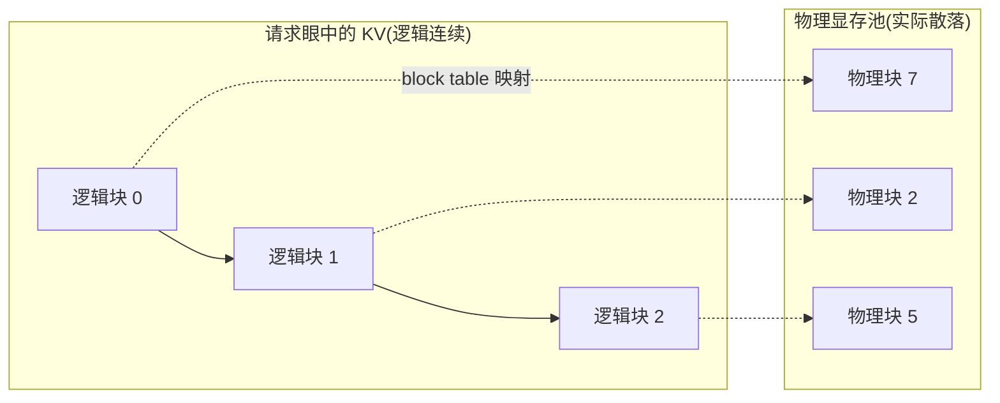
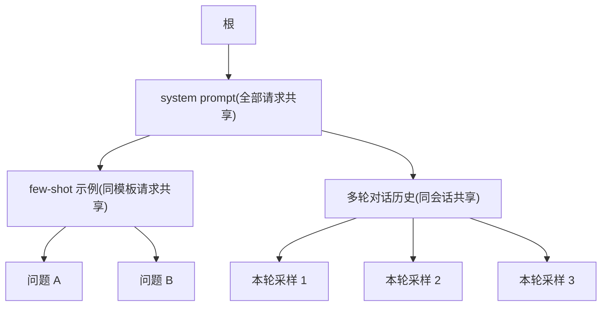
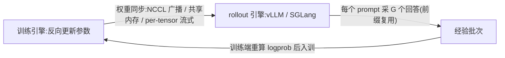

# Rollout 引擎(vLLM / SGLang)

一句话:**面向 LLM 的高吞吐推理引擎**——在线服务里它是 serving 后端,RL 训练里它承担采样(rollout)这一步。高吞吐的命门只有两个:**KV cache 显存怎么管、batch 怎么调度**,vLLM 与 SGLang 的全部核心设计都围绕这两件事展开。

## 一、背景:为什么不用 HuggingFace generate

先复习 KV cache:decode 阶段每生成一个新 token 都要对历史所有 token 做 attention,于是把历史 K/V 存下来避免重算。它像一张越写越厚的草稿纸,是推理显存的大头:

$$
\text{KV 显存} \approx 2 \times n_{\text{layer}} \times n_{\text{kv}} \times d_{\text{head}} \times l_{\text{seq}} \times B \times \text{bytes}
$$

其中 2 是 K、V 各存一份,$n_{\text{layer}}$ 层数、$n_{\text{kv}}$ KV 头数、$d_{\text{head}}$ 每头维度、$l_{\text{seq}}$ 序列长度、$B$ 并发数、bytes 每元素字节数(fp16 为 2)。量级感受:7B 模型(32 层、32 头、head_dim 128、fp16)每 token 约 0.5 MB,一条 2000 token 的序列约 1 GB——并发几十条请求时,KV cache 轻松超过权重本身。

`model.generate()` 是教学级实现,拿来做大规模采样有三宗罪:

- **静态 batch**:一批请求绑死一起跑,短序列生成完也得干等最长那条结束才一起返回,GPU 大量时间在"陪跑"。像旅游包车——先逛完的人也得坐在车上等全员集合;
- **KV cache 按 max_len 预分配**:每条请求按"可能的最大长度"一次性划走一整块连续显存,实际往往只写了开头一小段(内部碎片),请求之间还留下对不齐的缝隙(外部碎片)。有效利用率常常只有 20–40%;
- **无前缀共享**:两条请求哪怕 prompt 一模一样,KV 也各算各存,prefill 白白重复。

推理引擎就是针对这三宗罪的系统级重写。

## 二、vLLM:PagedAttention + continuous batching

### PagedAttention:给 KV cache 装上虚拟内存

把 KV cache 切成固定大小的 block(如 16 token 一块),按需分配、用完回收;逻辑上连续、物理上任意散落,中间靠 block table(页表)做映射——**完全对标操作系统的虚拟内存分页**。

类比:老办法像婚宴订席——按"最多可能来的人数"一口气订死一整排桌子,实际只来三成人,空桌也不许别人坐;分页像自助餐拼桌——来一拨客人开一小桌,吃完立刻翻台给下一拨。

收益:

- **碎片基本消灭**:内部碎片只剩每条序列最后一个没写满的 block;block 等大、任何空位都能补,外部碎片为零。显存利用率从 20–40% 拉到 **90%+**,同样的卡塞下几倍并发,吞吐随之数倍提升;
- **copy-on-write 共享**:block 带引用计数,beam search、同 prompt 并行采样(n > 1)可物理共享同一份前缀 KV;谁要往共享 block 里写新内容,先复制出私有副本再写——与操作系统 fork 的 COW 同一招。

### continuous batching:迭代级调度

思想源自 Orca(OSDI'22):调度粒度从"整个请求"细化到"单个 decode step"。每走一步,完成的请求立刻移出,腾出的坑位立刻从等待队列拉新请求补上,GPU 始终满载。类比:静态 batch 是包车,continuous batching 是地铁——每一站都能上下客,车不空跑。

### prefix caching:跨请求复用前缀

相同前缀(典型如同一段 system prompt)的 KV 算过一次就留在显存池里,后续请求按 block 哈希匹配直接命中,prefill 只算增量部分。vLLM 里叫 automatic prefix caching。

## 三、SGLang:RadixAttention + 结构化输出

### RadixAttention:把前缀复用做成一等公民

vLLM 的 prefix caching 是"顺手复用",SGLang 用一棵**基数树(radix tree)**统一管理全部请求的 KV 前缀:树的边是 token 片段,节点对应已缓存的 KV;新请求进来沿树匹配最长公共前缀,命中部分零计算;显存吃紧时按 LRU 从叶子往上驱逐。

类比:基数树像文件系统的目录树——`/home/user/a.txt` 和 `/home/user/b.txt` 共享 `/home/user` 这段路径,只存一份;所有请求的"公共开头"在树上天然只算一次、存一份。

三类负载天然受益:**多轮对话**(历史轮次是持续加长的公共前缀)、**few-shot 模板**(大段共享示例 + 小段不同问题)、**同 prompt 多采样**(RL rollout 的标准姿势,见第五节)。

### 结构化输出与前端 DSL

- **约束解码**:把 JSON schema / 正则编译成有限状态机(FSM),每个 decode step 只放行合法 token,输出必然合法;SGLang 的**压缩 FSM** 进一步把确定性片段(固定键名、引号、括号)一步跳过多个 token,而不是一步一个;
- **前端 DSL**:用 Python 程序化描述"生成—分支—拼接"的复杂流程(如先并行生成多段再汇总),运行时自动做 KV 复用与并行调度。

## 四、对比:vLLM vs SGLang vs TensorRT-LLM

| 维度 | vLLM | SGLang | TensorRT-LLM |
| --- | --- | --- | --- |
| 核心机制 | PagedAttention + continuous batching | RadixAttention 树状 KV 复用 + 压缩 FSM | 手写 kernel、编译期图优化 |
| 吞吐 | 高 | 高;前缀密集负载下常更优 | NVIDIA 卡上极致,fp8 支持最好 |
| 前缀复用 | block 哈希 prefix caching | 基数树自动匹配,更系统 | 支持 KV 复用,配置较繁琐 |
| 结构化输出 | 集成第三方(outlines / xgrammar) | 原生强项 | 较弱 |
| 易用性 | pip 即用,事实标准 | 接近 vLLM,另有 DSL | 需按模型编译 engine,门槛高 |
| 生态 | 新模型支持最快,RL 框架默认后端 | RL 社区上升期(verl、slime 支持) | 绑 NVIDIA 栈,延迟敏感的生产场景 |

## 五、RL 场景专属细节(与 GRPO 篇呼应)

RL 训练里引擎不再是独立在线服务,而是训练循环的内环组件:rollout 采一批 → 训练更新 → 权重同步回引擎,循环往复(HybridFlow / verl 这类框架专门编排这条数据流)。知识库 GRPO 篇「rollout 细节」一节点到的坑,这里从引擎侧展开:

- **同 prompt 采 G 个回答**:GRPO 每题采 4–16 个回答,整个 prompt 是完全相同的前缀——前缀复用让这部分 prefill 从算 G 次变成算 1 次,prompt 越长(长 few-shot、带工具说明的 agent prompt)收益越大。这是 RL 场景选引擎时把前缀复用能力放在高权重的直接原因;
- **权重同步**:训练端每更新一轮,新参数要"热更"进引擎。分离部署(训练、推理各占一批卡)走 **NCCL broadcast**;colocate(同一批卡分时复用)可走**共享内存 / CUDA IPC** 原地覆盖;超大模型常用 **per-tensor 流式更新**——一个张量一个张量地传输并覆盖,避免同时驻留两份全量权重;
- **logprob 数值不一致**:同一个 token,引擎算出的 logprob 与训练框架算出的并不相等——attention kernel 实现不同、精度不同(bf16 / fp8 KV cache)、并行切分与规约顺序不同,误差还会逐 token 累积。重要性比 ratio 若直接用引擎的 logprob,会引入系统性偏差;**严格实现把引擎当纯采样器,logprob 用训练端前向重算**;
- **colocate 显存腾挪**:训练态(优化器状态大)与采样态(KV cache 大)在同一批卡上错峰用显存。引擎为此提供 **sleep / wake** 一类接口:训练阶段把引擎权重与 KV cache 释放或 offload 到 CPU(sleep),轮到 rollout 再恢复(wake)。类比合租共用一张书桌:轮到谁用,另一人先把东西收进抽屉;
- **采样参数透传**:训练框架把 temperature / top-p 透传给引擎,而这组参数直接决定**组内多样性**——GRPO 的优势信号全靠组内 reward 差异,温度太低组内同质化,等于自制零梯度组。rollout 常用温度 ~1.0、top-p 0.95–1.0,与评测时的保守参数是两套配置,别混用;
- **长尾拖批**:一轮 rollout 的墙钟时间由最长的那条回答决定,长思维链场景尤甚;进阶方案是异步 rollout / partial rollout,用稍旧的权重继续采样来掩盖训练空泡。

## 六、关键指标

- **吞吐(tokens/s)**:单位时间生成的 token 总数,离线 rollout 的头号指标;
- **TTFT**(Time To First Token,首 token 延迟):约等于排队 + prefill 时间;前缀命中直接把它打下来;
- **TPOT**(Time Per Output Token):首 token 之后平均每个 token 的间隔,决定"打字机"体验;
- **goodput**:满足 SLO(如 TTFT < 1 s 且 TPOT < 50 ms)前提下的有效吞吐。只堆并发能刷高 tokens/s,但人人都变慢——goodput 才是在线服务的真实产能。

类比:tokens/s 是餐厅每小时出菜总数,TTFT 是第一道菜多久上桌,TPOT 是之后的上菜间隔,goodput 是"没吃出差评的订单数"。在线服务四者都要看;离线 rollout 没有人在屏幕前等,**只在乎总吞吐**,所以会把并发与 KV 池拉满。

## 七、面试考点串联

1. vLLM 为什么比 HF generate 快 →「一 + 二」:碎片(PagedAttention)与调度(continuous batching)两板斧
2. PagedAttention 与操作系统分页怎么对应、COW 何时触发 →「二」
3. continuous batching 与静态 batch 的区别、思想出处 Orca →「二」
4. RadixAttention 和 prefix caching 什么关系 →「三」:顺手的 block 哈希复用 vs 基数树一等公民
5. 怎么保证模型输出一定是合法 JSON →「三」:FSM 约束解码与压缩 FSM
6. RL 训练里权重怎么同步进引擎、colocate 怎么腾显存 →「五」
7. 为什么严格实现要用训练端重算 logprob →「五」
8. TTFT / TPOT / goodput 各刻画什么、在线与离线各看哪个 →「六」

## 相关文献

- vLLM / PagedAttention(Efficient Memory Management for LLM Serving with PagedAttention)— [arXiv:2309.06180](https://arxiv.org/abs/2309.06180)
- SGLang / RadixAttention(Efficient Execution of Structured Language Model Programs)— [arXiv:2312.07104](https://arxiv.org/abs/2312.07104)
- Orca: A Distributed Serving System for Transformer-Based Generative Models(continuous batching 思想来源,OSDI'22)— https://www.usenix.org/conference/osdi22/presentation/yu
- HybridFlow(verl,RL 训练如何编排 rollout 引擎)— [arXiv:2409.19256](https://arxiv.org/abs/2409.19256)
