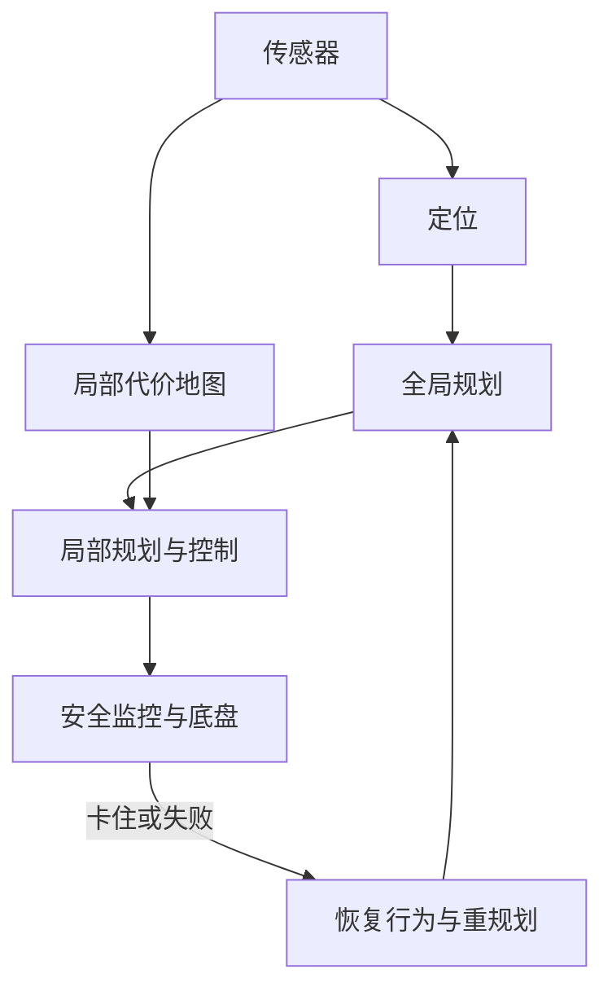

# 机器人系统

一句话:这篇讲移动机器人"怎么安全地从 A 走到 B"的那套传统骨架——传感器怎么选、怎么对齐再融合成一张能规划的地图、全局规划与局部避障怎么闭环、地图和眼前看到的打架时谁说了算、急停为什么必须独立于主算法。它不是大模型,但服务机器人与具身方向的面试几乎必问。A*/Dijkstra/RRT/DWA/TEB 这些算法本身只讲它们在闭环里站哪个位置、什么时候选谁,推导见题库 手撕代码 分类的对应题。

## 一、先立住:没有一种传感器能扛下全部场景

> **类比**:传感器像人的感官——眼睛看得远、认得出是什么,但黑暗和逆光下会瞎;手能摸到玻璃,但只能摸到眼前。避障不是挑"最好的那个感官",而是让它们**互相补盲区**。

**核心结论:避障系统一律是"一个主传感器负责建图、定位与规划 + 一层便宜、简单、近距的安全冗余负责兜底"。** 因为每种传感器的失效条件都是物理决定的,靠算法修不掉:激光测不到玻璃,是因为光直接穿过去了;深度相机在阳光下失效,是因为它自己打出去的红外纹路被太阳光淹没了;超声波测不准斜面,是因为声波被镜面反射到别处去了。

| 传感器 | 擅长 | 物理上的硬伤 | 典型量级 |
|---|---|---|---|
| 2D 激光雷达 | 稳定测距、几何轮廓;建图与定位的主力 | **只扫一个平面**:桌面、悬空物、比扫描面低的东西全看不见;玻璃、镜面、黑色吸光面回波弱 | 消费级三角测距款约 12 m、5–10 Hz;安全级 ToF 款保护区约 9 m |
| 3D 激光雷达 | 立体轮廓,悬空与低矮障碍都能看到 | 贵、点云量大、近处有盲区 | 数十米 |
| 单目 / 双目相机 | 认出"是人、是门、是台阶",语义与运动线索 | 单目没有可靠的绝对深度;逆光、夜间、无纹理墙面失效 | 分辨率高,但深度靠算 |
| 深度相机(结构光 / 主动双目 / ToF) | 近中距室内深度,便宜,能看低矮障碍 | 阳光下红外被淹没;透明、反光、黑色表面出现深度空洞 | 主动双目款理想工作区约 0.3–3 m,视场约 87°×58° |
| 超声波 | 便宜;**能测到玻璃**(声波不透玻璃) | 波束宽约 30°,只知"有东西"不知在哪;斜面反射丢失;多颗一起用会串扰;软材质吸声 | 2 cm–4 m |
| 红外 / ToF 点测距、防跌落 | 近距点测距;向下看台阶和边缘 | 受表面颜色、反射率、环境光影响 | 几厘米到 1–2 m |
| 碰撞条 / 保险杠 | 最后一道:碰上了必停 | 只有接触才触发,必须在几厘米压缩行程内刹住 | 接触式 |

### 选型依据:六个问题

1. **量程与视场**:机器人跑多快、要提前多远看见?最小量程由制动距离反推(第四节的公式),视场决定转弯时会不会"扭头就瞎"。
2. **光照**:室内还是室外,有没有阳光直射、夜间作业。这一条直接淘汰或保留深度相机与普通相机。
3. **材质**:场地里有没有玻璃幕墙、镜面、黑色家具、网状货架。有玻璃就必须补超声或碰撞条,因为激光会穿过去。
4. **障碍的高度分布**:2D 激光只看一个平面,桌面和悬空物要靠深度相机或 3D 激光,台阶和下沉边缘要靠向下的防跌落传感器。
5. **成本与算力**:每加一路传感器,就多一路数据量和处理时间(第八节)。
6. **安全等级**:能进急停回路的只能是有功能安全认证的传感器(如 ISO 13849 PL d / IEC 61508 SIL 2 的安全激光),消费级传感器只能进主感知链路。

一个室内服务机器人的典型组合:2D 激光(主,建图定位规划)+ 1–2 个前向深度相机(补低矮与悬空)+ 若干超声(补玻璃)+ 向下红外(防跌落)+ 碰撞条(兜底)。**"主 + 冗余"不是堆料,是让每一种失效条件都至少有另一种传感器不共享它。**

## 二、融合之前:标定、时间同步、统一坐标系

**核心结论:所谓"融合冲突",十有八九不是算法问题,是标定、时间戳或坐标变换出了错;所以排查顺序永远是"先查对齐,再谈融合"。** 因为一切融合算法的前提是"所有输入都在描述同一时刻、同一坐标系下的同一个世界"——这个前提一破,再好的滤波器也只是在认真地平均两个错误。三个前置条件:

| 条件 | 是什么 | 错了会怎样 | 一个量级 |
|---|---|---|---|
| 内参标定 | 传感器自己的模型:相机焦距与畸变、雷达的角度偏置 | 像素到方向的映射错,深度整体偏 | 畸变不校,画面边缘可差好几个像素 |
| 外参标定 | 传感器之间、传感器到机器人本体的相对位姿(平移 + 旋转) | 同一障碍在两个传感器里落在两个位置,而且**总往同一个方向偏** | 旋转差 1°,5 m 外就是约 8.7 cm |
| 时间同步 | 所有数据打同一时钟的时间戳,最好硬件触发 | 机器人在动,两帧不同时刻的数据被当成同一时刻比较 | 1 m/s 走,100 ms 时间差 = 10 cm 位置错;转弯时更糟 |

外参和时间差的症状不一样,这是排查时最有用的线索:**外参错是静止时也偏、方向固定;时间差是静止时不偏、越快越偏。**

坐标系通常分三层:`map`(全局固定,由定位给出)、`odom`(里程计,连续但会慢慢漂)、`base_link`(机器人本体)。定位模块只负责发布 `map → odom` 这一段修正量,里程计负责 `odom → base_link`。为什么要分两层:因为里程计平滑、不跳变,适合局部控制;定位会跳,但长期不漂,适合全局规划。融合前每帧观测都要按**它那一刻**的机器人位姿变换到统一坐标系,而不是按现在的位姿——旋转激光转一圈要 100–180 ms,机器人在动,同一帧里的点其实是不同时刻打出去的,这一步叫运动畸变补偿。

### 中间表示:占据栅格与代价地图

- **占据栅格**(Elfes 1989):把世界切成格子(常见 5 cm),每格存"被占据的概率",初始 0.5 表示未知;每来一次观测,用传感器模型做贝叶斯更新——被击中的格子概率上调,光线穿过的格子下调。这是 SLAM 输出的地图形式,回答的是"这里有没有东西"。
- **代价地图(costmap)**:给规划器用的,每格是一个"走这里多贵"的整数,不再是概率。Nav2 的取值:254 致命(障碍本身)、253 内切(机器人中心到了这格就一定碰)、0 自由、255 未知。它回答的是"能不能走、多不情愿走"。

代价地图是**分层**叠出来的(Lu 等 2014 提出的分层代价地图,Nav2 沿用):

| 层 | 数据来源 | 做什么 |
|---|---|---|
| 静态层 | 建好的地图 | 墙、固定家具 |
| 障碍层 / 体素层 | 激光、点云 | 击中的格子标记为障碍,从传感器到击中点之间的格子**沿射线清除**(raycasting);体素层是 3D 版,能表达桌面下方是空的 |
| 距离传感器层 | 超声 / 红外 | 用概率模型把宽波束读数写进去 |
| 膨胀层 | 上面各层的结果 | 从障碍向外按指数衰减铺代价 |

膨胀层的代价随距离衰减:

$$
\text{cost}(d) = 252 \cdot \exp\!\big(-k\,(d - r_{\text{inscribed}})\big)
$$

$d$ 是格子到最近障碍的距离,$r_{\text{inscribed}}$ 是机器人的内切半径,$k$ 是衰减系数;内切半径以内不走公式,直接给 253(必碰)。意思是**离障碍越远越便宜,$k$ 越大衰减越快、机器人越敢贴墙走**。Nav2 默认 $k = 3.0$、膨胀半径 0.7 m。为什么要膨胀:把机器人尺寸"搬进地图",规划器就能把机器人当质点,不用每扩展一个节点都做一次碰撞检测;代价是膨胀半径开太大,窄门会被判成不可通行。

## 三、融合算法怎么选:先看数据长什么样

**核心结论:连续状态 + 写得出噪声模型 → 卡尔曼滤波;几个离散判断各带不确定性 → D-S 证据理论;两者都够不上、或算力紧 → 置信度加权与规则。选哪个由数据表示决定,不由"哪个更高级"决定。**

| 方法 | 输入长什么样 | 输出 | 优点 | 代价与坑 |
|---|---|---|---|---|
| 卡尔曼滤波(KF / EKF) | 连续量:位置、速度;每路传感器给测量值 + 噪声方差 | 状态估计 + 协方差 | 递推、便宜、自带不确定性;目标跟踪与定位的标配 | 要线性或高斯近似;噪声方差填错会"自信地错";表达不了"我不知道" |
| D-S 证据理论 | 离散假设集,如 {占据, 空闲, 未知};每路传感器给一组"信任质量" | 合成后的信任 + **冲突度** | 能显式表示"未知"和"证据打架";适合栅格级的占据判断 | 假设一多组合爆炸;冲突很大时归一化会放大残余的小证据 |
| 置信度加权 / 规则 | 各传感器自报一个置信度 | 加权距离或投票 | 最简单、可解释、算力最小 | 权重靠经验;时效性要单独管 |

**卡尔曼滤波在干什么**:先按运动模型**预测**一步(状态和它的不确定性一起往前推),再用测量**修正**;修正的幅度由"预测有多不确定 ÷(预测不确定性 + 测量噪声)"决定——谁更不确定就多信另一方。多传感器时,每路测量按自己的噪声方差依次修正:激光方差小就修正得多,视觉深度方差大就修正得少。这就是"按可靠度融合"的严格版,前提是你真的能给出每路传感器的噪声方差。

**D-S 证据理论算例**:激光说这一格 {占据} 0.7、{未知} 0.3;相机说 {空闲} 0.6、{未知} 0.4。用 Dempster 合成规则:

- 冲突 $K = 0.7 \times 0.6 = 0.42$(一个说占、一个说空的那部分)
- 占据 $= 0.7 \times 0.4 / (1 - K) \approx 0.48$;空闲 $= 0.6 \times 0.3 / 0.58 \approx 0.31$;未知 $= 0.3 \times 0.4 / 0.58 \approx 0.21$

$K = 0.42$ 本身就是最有用的输出:冲突这么大,别急着信那个 0.48,先回第二节查时间戳和外参。这是它比"加权平均"多出来的东西——加权平均永远给你一个数,不会告诉你"两个输入根本不该被平均"。

### 激光和视觉距离不一致时怎么办

按顺序,而不是一上来就调权重:

1. **时间戳**:两帧相差超过一个控制周期?用较新的那帧;把旧帧按当时位姿变换到当前时刻再比。
2. **外参**:偏差是不是总在同一方向、静止时也偏?那是标定,不是融合。
3. **物理可能性**:那里是玻璃?激光穿透了,信视觉与超声。强光?深度相机失效,信激光。人?激光只看到两条腿,视觉的框更完整。按**各自在当前场景下的可靠度**加权,而不是固定权重。
4. **安全边界**:在制动距离内还是无法确认,取更近的那个距离。宁可多停一次,不能少停一次。

## 四、安全层:急停必须留给最简单可靠的链路

**核心结论:主感知-规划链路可以复杂、可以慢、可以偶尔错;急停链路必须简单到"看到东西就停",并且与主算法不共享任何故障点。** 因为主链路的每一环——检测模型、代价地图、规划器、进程调度——都可能延迟或崩溃,安全层若依赖它们,主链路一崩就同时失去避障和急停。安全区划多大,由制动距离决定:

$$
d_{\text{stop}} = v \cdot t_{\text{latency}} + \frac{v^2}{2a}
$$

第一项是从"看到"到"开始减速"之间跑过的距离(传感器响应 + 处理 + 控制周期 + 执行器响应),第二项是减速段本身。1 m/s、总延迟 0.3 s、减速度 1 m/s²:$0.3 + 0.5 = 0.8$ m。安全传感器的量程、停止区的大小,都是按这个反推再留余量;安全级激光自己的响应时间约 90–115 ms,就是延迟项里的一块。速度翻倍,第二项翻四倍——这就是为什么人群密集区必须限速,而不是"看得更远"。

### 三层安全

| 层 | 谁做 | 做什么 |
|---|---|---|
| 算法层 | 局部规划器 | 在代价地图里绕开、减速;允许复杂 |
| 独立安全监控 | 独立进程或独立控制器 | **直接看原始传感器点,不经过代价地图与规划器**;划减速区、停止区 |
| 硬件层 | 安全激光的安全输出、碰撞条、安全继电器 | 硬线切电机,软件全挂也能停 |

Nav2 的真实做法是第二层的样板:Collision Monitor 是一个独立于规划与控制的节点,直接消费激光、点云、超声等原始数据,作为速度命令的"过滤器"接在控制器输出与底盘之间;区域可配四种模型——stop(区内点数超过阈值就停)、slowdown(按比例减速)、limit(限制最大线速度与角速度)、approach(按当前速度估算碰撞时间,保证始终至少留 t 秒)——多个区同时触发时取最激进的那个。它的设计意图就是"绕过代价地图和轨迹规划器,在急停这一级兜底"。为什么急停不能放进局部规划器里做:规划器一个周期 50 ms,遇到点云暴增可能跑到 200 ms;它的输入是膨胀后的代价地图,一格 5 cm 的量化和一次错误的射线清除都能让障碍"消失"一帧。急停链路要的是**确定性延迟 + 原始数据 + 无状态**,这三条规划器一条也给不了。

## 五、只靠地图为什么不够,只靠反应式又为什么不行

**核心结论:地图负责"总体怎么到",实时感知负责"眼前能不能走";全局路径只能当大方向的建议,不能当可执行轨迹。** 因为地图是过去某一刻的快照,而机器人要在现在的世界里走。

| 基于地图的局限 | 表现 | 根源 |
|---|---|---|
| SLAM 漂移 | 走一圈回来,新旧墙对不上 | 里程计误差累积,回环没闭上 |
| 地图陈旧 | 门关了、货架挪了、临时封路 | 地图不会自己更新 |
| 动态残影 | 走过的人在地图上留下一道"墙" | 动态物体被当静态标记进去 |
| 定位误差 | 路径本身对,但机器人以为自己在别处 | 长走廊特征少、对称环境、人群把激光挡住 |

**纯反应式**(只看当前传感器、不用地图,如单独跑 DWA 或势场法)的优点:不依赖地图与定位,对突发障碍响应最快,算力小,实现简单。缺点全来自"没有全局目标":U 形障碍里进退两难(局部最优),狭窄通道两侧斥力对称而来回震荡,绕远路,死胡同要走进去才知道。

结合方式:全局层给一条参考路径,局部层只在机器人周围几米的窗口里做反应式避障,并把"贴近全局路径"作为轨迹评分项之一——DWB 里的 PathAlign / PathDist、MPPI 里的 PathAlignCritic / PathFollowCritic 就是这一项。全局路径从"必须照走的线"降级为"打分时的偏好",局部层才既有方向感又能绕开眼前的人。

## 六、闭环架构:全局给方向,局部管眼前

| 环节 | 输入 | 输出 | Nav2 默认量级 |
|---|---|---|---|
| 定位 | 地图 + 激光 + 里程计 | `map → odom` 修正 | AMCL(粒子滤波),或 SLAM 边建边定位 |
| 全局规划 | 静态层 + 障碍层 + 膨胀层 | 当前位姿到目标的路径 | 全局代价地图 1 Hz 更新;默认行为树每 1 s 重规划一次;NavFn(Dijkstra / A*)或 Smac(Hybrid-A*) |
| 局部代价地图 | 实时传感器 | 以机器人为中心的**滚动窗口** | 3 m × 3 m、5 cm 栅格、5 Hz,挂在 `odom` 系 |
| 局部规划 / 控制 | 全局路径 + 局部代价地图 + 当前速度 | 速度指令 | 20 Hz;DWB、TEB、MPPI、RPP 任选一个插件 |
| 安全与执行 | 原始传感器 + 速度指令 | 过滤后的速度 | Collision Monitor + 底盘驱动 |

为什么局部代价地图挂 `odom` 不挂 `map`:定位一跳,`map` 系下所有障碍跟着跳,局部规划器会看到障碍"瞬移";`odom` 连续,局部避障只需要"这几秒内相对我没漂"。

### 规划器与控制器在闭环里的位置

| 算法 | 在哪一层 | 什么时候选它 |
|---|---|---|
| Dijkstra / A* | 全局 | 2D 栅格、机器人近似质点;A* 靠启发式少扩展节点,大地图先想它 |
| Hybrid-A* / 状态格 | 全局 | 车型或阿克曼底盘,路径必须满足最小转弯半径 |
| RRT 家族 | 全局 | 高维配置空间(机械臂)、非完整约束;地面机器人的 2D 栅格上通常不必 |
| DWA / DWB | 局部 | 算力紧、控制周期固定;采样 $(v,\omega)$ 前推短轨迹打分,计算量可控 |
| TEB | 局部 | 愿意付优化开销换平滑与时间最优;对初值和参数更敏感 |
| MPPI | 局部 | 采样式 MPC,Nav2 自带示例配置是 2000 条轨迹 × 56 步 × 50 ms,普通 CPU 上 50 Hz 以上 |

### 局部失败之后:恢复行为与全局重规划

Nav2 默认行为树的真实做法,分两级:

1. **上下文恢复**:规划器失败 → 先清空全局代价地图再规划一次;控制器失败 → 先清空局部代价地图再跟随一次。因为最常见的失败原因就是残影把路堵死了。
2. **系统级恢复**:上面不行,就轮询四个动作——清两张代价地图 → 原地旋转 1.57 rad → 等待 5 s → 后退 0.30 m(0.15 m/s);每做完一个就重新导航一次,整个任务最多重试 6 次。旋转、后退这些动作本身也在局部代价地图上做碰撞检查(等待除外)。

顺序的道理是**先便宜后昂贵、先信息后动作**:清地图解决"残影堵路",旋转解决"出路在视场外",等待解决"人群暂时堵住",后退解决"贴太近出不来"。

### 局部最优与震荡怎么和全局层交互

- **检测**:进度检查器——一段时间内位移小于阈值就算卡住;震荡——速度方向反复翻转,DWB 有专门的 Oscillation 评分项惩罚它。
- **交互**:卡住时把当前局部障碍写回全局代价地图,触发全局重规划,让全局层换一条**拓扑不同**的路;TEB 的做法更进一步,同时维护多条不同拓扑的候选轨迹并选最优。局部层永远解决不了"绕左边还是绕右边"这种拓扑选择,这必须交给有全局视野的那一层。
- **参数侧**:局部窗口太小看不出 U 形;路径贴合权重太低会离全局路径乱跑,太高又不敢绕人。

## 七、地图与实时感知冲突时谁说了算

**核心结论:没有"永远信谁";按"时效 → 遮挡 → 标定 → 置信度 → 安全边界"五步裁决,最后一步永远保守。** 因为地图和传感器各有一种系统性错误——地图会陈旧,传感器会看不见——裁决要先问"这一方有没有资格发言"。

| 情形 | 裁决 |
|---|---|
| 地图说空、传感器说有 | 信传感器(陈旧是地图的常态):写入障碍层,触发全局重规划;但只当作当前观测,**不改静态地图**,否则一个路过的人就永久改了地图 |
| 地图说有、传感器说空 | 先问传感器能不能看见那里:激光看不到玻璃和桌面,被遮挡时"没看到"不等于"没有"。能看见且多帧确认为空 → 沿射线清除;看不见 → 保留地图障碍 |
| 两路传感器互相矛盾 | 第三节的四步;制动距离内取近值 |
| 障碍走了,地图上还留着 | 动态残影:障碍层靠射线清除,时空体素层按时间衰减;Nav2 默认标记距离 2.5 m、清除距离 3.0 m——**清除距离必须大于标记距离**,否则远处标上的障碍永远清不掉 |

## 八、算力受限时怎么分预算

**核心结论:预算按"失效后果"分——安全链路永远满额,控制回路其次,建图与全局规划最后;省算力的办法是少算、小算、增量算。** 因为控制周期一拖长,第四节公式里的延迟项就变大,安全距离跟着变大,机器人只能开得更慢。所以建图、全局规划、局部控制三者的分法是:局部控制回路必须守住固定周期(如 20 Hz),这是不可谈判的;全局规划改成事件触发(新目标、卡住、路径失效)而不是固定高频;建图可以低频、离线,甚至只跑定位不建图。

| 手段 | 做法 | 省在哪 |
|---|---|---|
| 降频、减采样 | 非关键传感器降到 2–5 Hz,全局规划 1 Hz 够用;DWA 采样数、MPPI 的 batch 减半 | 线性省,代价是轨迹质量 |
| ROI | 只处理行进方向前方扇区、一定高度带内的点 | 点云处理量砍掉大半 |
| 分层地图 + 滚动窗口 | 全局用粗栅格(10–20 cm)或拓扑图;局部只维护机器人周围 3–5 m 的 5 cm 细栅格 | 全局搜索节点数随分辨率平方下降;局部内存与更新量固定,与场景大小无关 |
| 增量更新 | 只更新变化的格子;D* Lite / LPA* 复用上一次搜索 | 不必每帧全图重算 |
| 复用检测结果 | 一次检测同时喂跟踪、避障、语义地图 | 检测模型只跑一次 |

## 九、怎么量化融合方案相对单一方法的收益

**核心结论:没有通用数字,只有统一场景下的对照实验;指标要同时看"到没到、撞没撞、绕没绕、慢没慢、贵不贵"五组。** 因为成功率取决于场景障碍密度,时延取决于硬件,安全距离取决于速度与制动性能——换一台机器、换一层楼,数字全变。

| 指标 | 衡量什么 | 单一方法常见的失分 |
|---|---|---|
| 成功到达率 | 任务完成 | 纯反应式在死胡同、U 形场景显著下降 |
| 碰撞次数、急停次数 | 安全 | 只有激光时撞玻璃和桌面;急停次数多说明主链路没接住 |
| 最小安全距离分布 | 保守程度 | 看 P5 而不是均值,均值会掩盖尾部 |
| 路径效率 | 实际路程 ÷ 最短路程,完成时间 | 融合后保守过头会绕远 |
| P95 规划时延、控制周期抖动 | 实时性 | 多一路传感器,尾延迟先炸 |
| CPU、内存、功耗 | 资源 | 决定能不能上目标硬件 |

统一场景怎么做:同一批地图、同一批脚本化障碍(静态、突现、行人轨迹回放)、同一目标序列,每种配置跑够次数,报均值加分位数;真机之前先仿真,但要把**传感器噪声模型**放进仿真——否则仿真里的激光永远看得见玻璃,融合永远显得没必要。

## 十、VLA 兴起之后,传统定位、规划与安全控制还剩什么

VLA(视觉-语言-动作模型,如 RT-2、OpenVLA)把图像和指令直接映射成动作,端到端训练;它怎么训、世界模型怎么给它当模拟器,见 世界模型范式 篇 与 动作条件与交互 篇,本篇只答"传统那套还有什么用"。

1. **可验证**:A* 的最优性、膨胀层的碰撞保证、制动距离都能证明或测量;端到端策略只能统计,而"99% 不撞"对安全认证毫无意义。
2. **可解释、可定点修**:撞了能定位到哪一层出错——标定、地图、规划还是控制——改一个参数就能修;端到端策略只能重训,还不保证修好。
3. **安全兜底**:功能安全认证只认确定性链路。现实架构是"端到端策略给建议、传统安全层有否决权",第四节的独立安全层反而更重要了。
4. **数据效率与分工**:导航 50 m 到另一个房间是几何问题,地图 + 规划零样本解决,端到端要海量演示且长程泛化仍弱;所以趋势是 VLA 负责语义与操作决策("去把门口的包裹拿过来"),传统栈负责几何与安全(怎么走过去、不撞人)。学习型局部策略(RL 训出来的避障)在闭环里也是同样地位,基础见 强化学习基础 篇。

## 十一、面试考点串联

| 高频问法 | 本文哪一节 |
|---|---|
| 设计服务机器人的避障算法时,应如何选择和组合不同类型的传感器?常用传感器在避障系统中的功能、优缺点、适用场景及选型依据是什么?多传感器融合的必要性与实现思路? | 一(选型表与六个问题)、二(前置条件与代价地图)、三(算法选择) |
| 激光雷达和摄像头在某个区域同时检测到障碍物但距离不一致,融合系统如何处理这种冲突? | 三(四步顺序)、二(先查时间差与外参) |
| 在算力受限的嵌入式平台上,如何优化多传感器融合的计算开销?计算资源受限时,怎样分配建图、全局规划和局部控制预算? | 八 |
| 能否举例说明一种具体的融合算法(如卡尔曼滤波或基于 D-S 证据理论的融合)? | 三(KF 一句话 + D-S 算例) |
| 基于地图的机器人导航有哪些局限?为什么工程上通常将先验地图的全局路径规划与实时传感器的局部避障结合?闭环架构、冲突处理、鲁棒性与资源权衡怎么说? | 五(局限)、六(闭环)、七(冲突)、八(资源) |
| 不使用全局地图的纯反应式避障有哪些优缺点,怎样与地图方法结合? | 五 |
| 地图出现未记录障碍时,系统如何决定相信实时感知? | 七 |
| 局部避障陷入局部最优或震荡时,怎样与全局层交互? | 六(恢复行为、卡住检测与拓扑重规划) |
| VLA 兴起后,传统定位、规划和安全控制还有什么价值? | 十 |
| 如何用统一场景量化融合方案相对单一方法的收益? | 九 |
| 补充题:急停为什么不能直接放进局部规划器里做?独立安全层和主链路的边界在哪? | 四 |
| 补充题:代价地图和占据栅格有什么区别?膨胀层是干什么的,膨胀半径开大开小分别有什么影响? | 二(中间表示) |
| 补充题:局部代价地图为什么挂在 odom 系而不是 map 系?定位跳变时会发生什么? | 六 |

## 相关文献

- The Dynamic Window Approach to Collision Avoidance(Fox, Burgard, Thrun 1997,IEEE Robotics & Automation Magazine;DWA 原文)— https://doi.org/10.1109/100.580977
- Integrated online trajectory planning and optimization in distinctive topologies(Rösmann, Hoffmann, Bertram 2017,Robotics and Autonomous Systems;TEB 的期刊版)— https://doi.org/10.1016/j.robot.2016.11.007 ;ROS 实现 teb_local_planner — https://github.com/rst-tu-dortmund/teb_local_planner
- Layered Costmaps for Context-Sensitive Navigation(Lu, Hershberger, Smart,IROS 2014;分层代价地图的出处)— https://doi.org/10.1109/IROS.2014.6942636
- Using occupancy grids for mobile robot perception and navigation(Elfes 1989,IEEE Computer;占据栅格的出处)— https://doi.org/10.1109/2.30720
- Probabilistic Robotics(Thrun, Burgard, Fox 2005,MIT Press;贝叶斯滤波、KF、粒子滤波定位、占据栅格建图)— https://mitpress.mit.edu/9780262201629/probabilistic-robotics/
- A New Approach to Linear Filtering and Prediction Problems(Kalman 1960)— https://doi.org/10.1115/1.3662552
- A Mathematical Theory of Evidence(Shafer 1976,Princeton University Press;D-S 证据理论)— https://press.princeton.edu/books/paperback/9780691100425/a-mathematical-theory-of-evidence
- The Marathon 2: A Navigation System(Nav2 的系统论文)— [arXiv:2003.00368](https://arxiv.org/abs/2003.00368)
- Nav2 文档:插件列表(各代价地图层、控制器、规划器、恢复行为)— https://docs.nav2.org/rolling/configuration_and_development/navigation_plugins/
- Nav2 源码:默认参数 `nav2_params.yaml`、Collision Monitor README、默认行为树 `navigate_to_pose_w_replanning_and_recovery.xml`、膨胀层代价公式 — https://github.com/ros-navigation/navigation2
- RT-2: Vision-Language-Action Models Transfer Web Knowledge to Robotic Control — [arXiv:2307.15818](https://arxiv.org/abs/2307.15818)
- OpenVLA: An Open-Source Vision-Language-Action Model — [arXiv:2406.09246](https://arxiv.org/abs/2406.09246)
