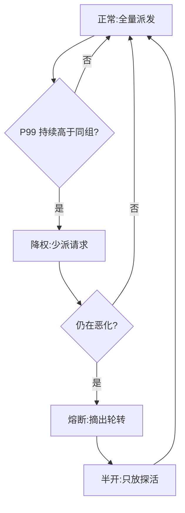

# 负载均衡

一句话:这篇回答的是「**一条请求该送到哪个实例、一份任务该交给哪个节点**」——难点不在"怎么分得平均",而在**先把"负载"这两个字量化对**:同一个接口,输入 200 token 和 20000 token 对系统的压力差两个数量级,按请求数轮询等于闭着眼睛分。至于一台实例把请求收进去之后怎么排队、怎么组批、怎么抢占,那是 连续批处理 篇的事,本篇不重复。

## 一、纲:负载不是请求数,是一个成本向量

**这一条立不住,后面所有策略都是空的。** 传统 Web 服务按请求数轮询大体够用,因为每条请求的成本差不了几倍;LLM 服务不成立——一条请求要花多少资源由四个量共同决定,而它们彼此不能互相代替:

| 要估的量 | 它决定什么 | 怎么估 | 不确定性在哪 |
|---|---|---|---|
| **输入 token 数** | prefill 的计算量 | 请求到达、分词完就精确知道 | 基本能估准,是最可靠的一维 |
| **输出 token 数** | decode 要走多少步,也就是这条请求占坑多久 | 只有 `max_tokens` 这个上界,真实值事前不可知 | **最大的不确定性来源** |
| **KV cache 显存占用** | 这台机器还能不能再收一条 | 正比于(输入 + 已生成)长度 | 随时间线性长,是个移动目标 |
| **设备能力** | 同样的活在这台机器上要多久 | **实测吞吐**,不能拿 SKU 名字或标称 TFLOPS 替代 | 共卡、降频、邻居干扰都会让标称值失真 |

把前两项合起来,一条请求的成本大致是:

$$
\text{cost} \;\approx\; a \cdot L_{\text{in}} \;+\; b \cdot L_{\text{out}}, \qquad \text{KV 峰值} \;\propto\; L_{\text{in}} + L_{\text{out}}
$$

人话:**前一项是"进门时一次性付的钱"(prefill),后一项是"住店期间按步付的钱"(decode)**。$a$、$b$ 由模型与硬件定;$L_{\text{in}}$ 进门就知道,$L_{\text{out}}$ 只有上界,而且这个式子还偏乐观——prefill 里 attention 那一段随长度是平方项,长 prompt 的真实成本比线性式更陡。所以调度器**手里永远只有半个成本**:必须按最坏情况留余量,又不能按最坏情况定容量,否则机器一半时间是空的。第四节的准入规则全从这句话推出来。这不是 LLM 独有的病,只是被放大了:Google SRE 手册讲数据中心负载均衡时把轮询失效的原因列成四条,**前两条正好是本篇的纲**——请求成本差异巨大(书里给的量级是"最贵的请求能比最便宜的多吃 1000 倍以上 CPU")、机器本身不等能。LLM 服务把这两条同时推到极端——成本差异来自 token 长度,机器差异来自异构卡与共卡邻居。

## 二、分发策略:从轮询到成本感知

| 策略 | 怎么选 | 什么时候够用 | 什么时候翻车 |
|---|---|---|---|
| 轮询 / 随机 | 完全不看后端状态 | 成本齐整、机器同构 | 成本一出长尾就崩:短请求排在长请求后面干等 |
| **最少活跃请求** | 挑当前在跑请求数最少的 | 成本差异不大时接近最优 | **把"条数"当"负载"**:一条 32K prompt 和一条 200 token 记成一样重 |
| **加权(按实测能力)** | 权重来自压测出的实际吞吐 | **异构集群的正解** | 权重是静态的,跟不上运行时抖动 |
| **成本感知 / token 预算** | 按估算 token 数与各机剩余 KV 余量分 | LLM 服务的正解 | 依赖输出长度估计,估歪了照样堆到一台上 |

### 为什么"总是挑最闲的那台"反而会翻车

这条最反直觉。The Tail at Scale 给了三个理由:**探测结果一拿到就过期了**(负载在探测与真正发请求之间已经变了)、**服务时间本来就估不准**,以及最要命的——**所有客户端会同时看中同一台"最闲的"机器,把它一起打爆**,下一轮再一起涌向另一台。这就是羊群效应,线上表现为负载在几台机器之间来回振荡。

标准解法是 **P2C(power of two choices,二选一)**:随机抽两台,只在这两台里挑活跃请求更少的。它把"全局最优"降级成"局部比较",却几乎拿到了全扫描的效果,而且天然没有羊群——两台是随机抽的,不同客户端抽到的组合不一样。Envoy 的 least request 负载均衡器默认就是这个模式(候选数默认 2)。权重不等时它换成动态加权轮询,有效权重按

$$
w_i^{\text{eff}} = \frac{w_i}{(1 + \text{active}_i)^{\beta}}
$$

计算。人话:**分子的静态权重表示"这台机器本来多能扛",分母的活跃请求数表示"它现在多忙"**;$\beta$ 越大越激进地躲开正忙的机器,$\beta = 0$ 就退化回纯加权轮询。

### LLM 特有的一维:缓存亲和和负载均衡是对着干的

多实例部署时如果按负载随机派发,同一个 system prompt 会被分散到每台机器上各算一遍、各存一份,前缀缓存命中率被摊薄。所以 LLM 网关会做**缓存亲和路由**:按请求前缀与各 worker 已有前缀的最长匹配挑机器,匹配率低于阈值、或各机负载明显失衡时再退回按负载挑(SGLang 的路由网关就是这个策略)。**这两个目标天生打架,面试时必须把取舍说出来**:纯亲和会把热点 prompt 全粘到一台上,那台先过载;纯负载均衡等于放弃缓存复用——所以实现里一定有一个"失衡阈值"当闸门。前缀缓存本身的机制见 RadixAttention 篇。

## 三、同一套机器,三种完全不同的调度目标

| | 在线推理 | 训练 | 通用高并发服务 |
|---|---|---|---|
| 优化目标 | **SLO 达标率**,尾延迟优先 | **每步墙钟时间**,最慢的 rank 说了算 | 吞吐 + 公平性 |
| 负载的单位 | token 与 KV 余量 | 一个 step 的数据分片 | QPS 与连接数 |
| 慢节点怎么办 | 摘出轮转,流量派给别人 | **不能简单摘**:同步边界要求所有 rank 到齐 | 摘出或降权(前提是无状态) |
| 过载了怎么办 | 拒绝新请求,保住在跑的 | 没有"拒绝"这一说,只能减小 batch 或改配置重启 | 限流 + 降级 + 排队 |
| 最常被忽略的 | 排队时间才是 P99 的大头 | 数据加载和通信也会当 straggler | 重试放大 |

**训练那一栏是重点**,因为它和另外两栏的直觉完全相反:数据并行每一步末尾有一次集合通信,**所有 rank 必须都到齐才能继续**,于是一个慢 20% 的节点会让整个作业慢 20%,而不是让 1/N 的流量变慢。摘掉它也不行——摘掉就少一个 rank,要么改并行配置重启,要么让别人替它算。所以训练侧的"负载均衡"实际是两件事:**事前按实测能力分不等量的数据分片**(异构卡尤其需要),**事后要么等、要么重调度**。并行切分与集合通信本身见 并行策略 篇和 集合通信 篇。

## 四、容量与准入:batch 上限和队列上限怎么定

真题追问的原话是"动态批处理中 batch size 上限怎么设,既不 OOM 又保 SLA"。**这是个准入问题,不是调度机制问题**——批怎么组、怎么一步步推进见 连续批处理 篇,显存那笔账怎么算见 显存管理与OOM 篇。站在负载均衡的位置只需要回答四件事:

1. **上限由最坏情况的显存算出来,不是一个常数。** 可用于 KV 的显存 = 总显存 − 权重 − 激活与工作区 − 安全余量,再除以"单条请求把 `max_tokens` 用满时的 KV 占用",得到并发条数的硬上限。**"batch 设成 32"这种答案是错的**:它随模型层数、KV 头维度、量化位宽、卡型全部变,脱离硬件与模型给数字等于没答。
2. **必须留水位线,不能用到刚好。** 显存用到 100% 的系统会陷入"收进来 → 撑不住 → 踢出去 → 再收进来"的抖动,吞吐反而下降。
3. **按输入长度分档。** 长 prompt 和短 prompt 混在一个队列里,长的会把短的首字延迟拖爆;分几档、各给配额是最省事的一招。
4. **超了就拒绝,不要排队到超时。** 一条已经注定超 SLO 的请求继续排队,只是在浪费本可以服务别人的资源。SRE 手册讲级联故障时给的两个手段值得记:队列纪律从 FIFO 换成 **LIFO 或 CoDel**(先服务刚到的,因为排了 10 秒那位用户多半已经刷新走了),以及**把截止时间沿调用链一路传下去**,过期请求在任何一层都能直接丢掉。另外,把 prefill 和 decode 拆到不同实例、各自按各自的瓶颈扩缩容,是绕开这套取舍的另一条路,见 PD分离 篇。

## 五、异构与共卡:按能力加权,按型号分池

两代卡的显存、带宽、算力不是同一个倍数关系,**只能按实测吞吐加权**:同一个模型、同一份输入长度分布,每种型号各压一遍,拿到"每秒能扛多少 token",权重就是这组实测值的比例。拿 SKU 名字或标称算力推权重一定偏,因为实际吞吐还受显存容量(能开多大并发)和互联带宽制约。

### 追问:异构环境下的显存碎片怎么处理

先把话说清:**碎片本身是单机分配器层面的问题**(成因、段边界、分配器行为见 显存管理与OOM 篇),异构在这里加的是**第二层麻烦**——不同型号可用显存不同,同一份"最大并发数"配置在 A 卡上宽松、在 B 卡上刚好压线,于是 B 卡先碎、先 OOM。负载均衡这一层能做的是三条,共同点都是"别让能力不同的机器共享同一套假设":

| 手段 | 做什么 | 为什么有效 |
|---|---|---|
| **按型号分池** | 每种卡型一个独立池,各自压测各自的并发上限与块大小 | 一套配置只服务一种硬件,不再"按最弱的配、浪费最强的" |
| **同型号成组** | 一个并行组内不混型号 | 组内要同步,混型号等于把整组拉到最慢那张卡的速度 |
| **各池独立队列** | 不同型号不共享一个等待队列 | 共享队列会让请求随机落到能力不同的机器上,长请求撞上弱卡就是一次尾延迟事故 |

### 共卡:先问隔离,再问可抢占点和恢复成本

训练和在线推理挤同一张卡,是"利用率好看"与"延迟稳定"之间最典型的冲突:训练长时间满负荷占用,推理要的是随时能插进去。三个必须评估的点:

- **隔离**:MIG 这类硬件分区提供更强的算力与显存隔离,MPS 这类共享上下文提供的是并发而非强隔离。**具体能力和粒度取决于 GPU 代际、驱动与部署栈**——面试时讲清"取决于什么"比背参数安全。
- **可抢占点**:训练能在哪些位置被打断?优化器 step 之间可以,一次集合通信中间不行。**没有干净的可抢占点,抢占就等于杀作业**。
- **恢复成本**:被抢占后从最近的 checkpoint 恢复要多久?这个数字直接决定"值不值得抢"。

顺带点破一个高频混淆:**MoE 的专家负载不均和本篇的请求级分发不是一回事**——那是同一次前向内部、token 在专家之间分布不均,发生在模型里面;本篇讲的是请求在实例之间怎么分,发生在模型外面。机制见 MoE并行与DeepEP 篇。

## 六、慢节点:怎么检测,怎么熔断

先说清为什么值得单独花力气。The Tail at Scale 里那个数字必须记住:**单台机器 P99 延迟是 1 秒(100 次里慢 1 次),一个请求要扇出到 100 台机器收齐结果,就有 63% 的用户请求超过 1 秒**——因为 $1 - 0.99^{100} \approx 0.63$。规模越大,罕见的抖动越会变成常态,这就是"慢节点必须被主动处理、不能靠平均值掩盖"的根据。

**检测要三条一起用,少一条就会误杀:**

1. **看分位数,不看均值。** 慢节点的典型表现是"大部分请求正常、少数极慢",均值会被彻底稀释。
2. **和同组横比,不看绝对阈值。** 绝对阈值在流量高峰会全员报警。正确姿势是"这台的 P99 是同组中位数的多少倍"——**全局变慢时大家一起慢,比值不变,不会误判**。
3. **连续多个窗口确认。** 单窗口尖刺可能只是一次 GC、一次冷启动;要求连续 N 个窗口都超标再动手,是最便宜的防误杀手段。

### 熔断与恢复:降权 → 摘除 → 半开 → 渐进回流

关键是**别一步跳到"摘除"**:先降权少派一点,给它自愈的机会,确认无效再摘;恢复同样不能一次把流量全放回去,**半开状态只放少量探活流量**,连续成功才逐步加权回满。The Tail at Scale 里的"延迟留观"是同一思路的精细版:被留观的机器不接真实请求,但照样收一份影子请求(结果丢弃),延迟恢复了就放回集群。更主动的一手是**对冲请求**——超过该类请求的 P95 延迟仍没返回,就往第二台机器补发一份,谁先回用谁;论文里的实测是 BigTable 上读 1000 个 key、分布在 100 台机器上,延迟 10 ms 后发对冲,P99.9 从 1800 ms 降到 74 ms,代价只有 2% 的额外请求量。**但它有硬边界:写请求和有副作用的请求不能对冲**,重复执行会产生第二次副作用。

### 训练侧的慢节点,规则完全不一样

在线服务可以"摘掉不用",训练不行:**同步边界要求所有 rank 都参与这一步的集合通信,少一个就卡死**。所以只有三条路,按代价排:

| 做法 | 什么时候用 | 代价 |
|---|---|---|
| **等** | 抖动是暂时的(邻居干扰、一次慢 IO) | 整个作业按最慢的走 |
| **减它的活** | 稳定偏慢但没坏(异构卡、降频) | 要支持不等量数据分片,还会改变各 rank 的有效 batch 组成 |
| **踢掉重调度** | 确实故障 | 从 checkpoint 恢复,损失是上次存盘以来的全部计算 |

选哪条取决于**慢在哪一段**:计算慢(卡本身)、通信慢(网络或某条链路)、还是数据加载慢(存储或 dataloader)。把每步耗时拆成这三段,是训练侧排查的第一个动作。

## 七、四种保护手段:各治各的病,不能混谈

面试最常见的失分是把这四个词当成一组近义词。**它们解决的是四个不同的问题,代价也完全不同:**

| 手段 | 解决什么 | 代价 / 风险 |
|---|---|---|
| **缓存** | 消掉**重复计算**——同样的输入不算第二遍 | 一致性:缓存里的可能是旧值;还会引入穿透、击穿、雪崩三类新故障 |
| **异步队列** | **削峰**与解耦——把瞬时尖峰摊到时间轴上 | 延迟变长,语义从"同步返回"变成"最终完成";队列自己成了新的故障点 |
| **限流** | **保护自己不被打垮**——超出容量的宁可拒绝 | 拒的是真实用户;阈值定低了浪费容量,定高了形同虚设 |
| **降级 / 熔断** | 让**局部故障不扩散**——下游挂了别把自己的线程池耗光 | 降级路径平时不跑,**从来不用的代码路径往往是坏的**;熔断误判会摘掉好节点 |

### 追问:缓存和数据库不一致怎么办

第一句话必须是:**先让业务定"能容忍多久的不一致"**。没有这个数,后面所有方案都无从选起——秒级容忍和强一致是两套成本完全不同的系统。定完之后按下面四条走:

- **更新缓存 vs 失效缓存,优先失效。** "写库 + 删缓存"比"写库 + 写缓存"稳:并发写时两个请求写缓存的先后可能和写库的先后相反,直接留下永久脏数据;而删除是幂等的,最坏结果只是多一次回源。
- **双写窗口必须承认存在。** 无论怎么排列,"写库"和"删缓存"之间总有一个窗口,期间的读会把旧值重新灌回缓存。常见兜底:删除后延迟一小段再删一次;或给缓存配一个短 TTL 当保险,让错误有时间上限。**删缓存失败还要有重试通道**——走消息队列或订阅数据库变更日志异步补偿,别在业务线程里同步死等。
- **真要强一致就别用旁路缓存。** 要么读写都走库,要么用带版本号的条件写让旧值写不进去。**"加个缓存又要强一致"本身就是矛盾需求,面试时点破这一点比给方案更有价值。** 缓存中间件本身的数据结构与访问模式见 缓存系统 篇。

### 追问:异步队列堆积严重怎么快速恢复

按顺序做,顺序错了会越救越糟。**第一步,先止血,不要先定位**:入口限流把生产速率压下来、丢掉可丢的(低优先级、已过期的任务)、能加消费者就先加。为什么止血必须排在定位前面,看排空时间:

$$
T_{\text{drain}} = \frac{Q}{\mu - \lambda}
$$

意思是:积压量除以"消费速率减生产速率"。只要 $\mu \le \lambda$ 就**永远排不空**;而 $\mu$ 只比 $\lambda$ 大一点点时,排空时间会长到不可接受。所以止血阶段的重点是**把分母撑开**,不是慢慢等。

**第二步,定位:是消费变慢,还是生产变多?** 两者处置完全相反,看两条曲线就够——入队速率、单条消费耗时。消费变慢往往是下游依赖劣化,这时候盲目加消费者只会把下游打得更死。

**第三步,警惕重试风暴。** 这是把堆积从"难受"变成"雪崩"的那一步:多层各自重试时,总尝试次数是各层次数的**乘积**;失败请求被反复重投,队列越救越长。三条纪律——**随机化指数退避**(不随机化会让重试波形同步成脉冲)、**每请求限次**、**全局重试预算**。SRE 手册给的具体口径:每请求最多 3 次尝试,客户端把自身重试比例压在 10% 以下,服务端可设"每进程每分钟 60 次重试"这样的总闸。它还有一句很实在的结论:**一旦陷进重试导致的过载,只能大幅削掉前端流量、等重试停下来,后端才可能恢复。**

## 八、真实业务的 QPS 上限和瓶颈怎么测出来

四条就是答案,完整的压测方法论见 推理服务指标 篇:

1. **用真实流量分布压,不要用均匀请求。** 全用 128 token 固定输入压出来的 QPS 和线上没有关系——线上是长尾分布,而成本随长度非线性增长。至少要按线上采样的输入/输出长度分布回放。
2. **逐步加压找拐点,不是一次打满。** 并发按档递增,画出「并发 → 吞吐 / 延迟分位数」的曲线;**吞吐压平、延迟开始翘的那个点才是容量**。一上来就打满只能得到"炸了"这个结论,拿不到拐点位置。
3. **报的是"SLO 达标下的 QPS",不是极限 QPS。** 极限 QPS 那个点的尾延迟通常早就违反 SLO,拿它做容量规划一定不够用。
4. **瓶颈定位靠"加压时哪个指标先饱和"。** GPU 利用率先满 → 算力;显存 / KV 使用率先满 → 容量,先看能不能省 KV;队列长度先涨而 GPU 没打满 → 调度或准入配置的问题;CPU 打满而 GPU 空闲 → 分词、采样后处理或框架开销。主机网络栈调优(队列、缓冲区、epoll、中断亲和性)见 网络性能 篇。

## 面试考点串联

| 高频问法 | 本文哪一节 |
|---|---|
| 大模型训练、推理和高并发服务里,负载均衡策略怎么设计?怎么兼顾利用率、延迟、稳定性和异构硬件? | 一 + 三(先量化负载,再按场景定目标) |
| 为什么不能按请求数均分?负载到底要估哪些量? | 一(四维成本向量) |
| 缓存、异步队列、限流、降级熔断分别解决什么问题?代价是什么? | 七(四者不可互替) |
| 异构 GPU 怎么分配负载?能按卡数均分吗?训练和在线推理共卡又要注意什么? | 五(按实测吞吐加权;隔离、可抢占点、恢复成本) |
| 动态批处理的 batch size 上限怎么定,既不 OOM 又保 SLA? | 四(容量与准入;组批机制见 连续批处理 篇,显存账见 显存管理与OOM 篇) |
| 异构环境下不同 GPU 的显存碎片怎么处理? | 五(分池 / 成组 / 独立队列;碎片成因见 显存管理与OOM 篇) |
| 某个节点变慢了,怎么快速检测并熔断? | 六(分位数 + 同组横比 + 连续窗口;降权→摘除→半开) |
| 训练出现慢节点,能像在线服务那样直接摘掉吗? | 六(不能,同步边界;等 / 减活 / 重调度) |
| 缓存和数据库数据不一致,处理策略是什么? | 七(先定容忍度;失效优于更新;双写窗口) |
| 异步队列堆积严重,怎么快速恢复? | 七(先止血再定位;排空时间;重试风暴) |
| 真实业务的最高 QPS 和瓶颈是怎么测出来的? | 八(SLO 达标下的拐点) |
| 补充题:为什么"总挑最闲的那台"反而把负载打得更不均? | 二(探测过时 + 羊群;P2C 怎么绕开) |
| 补充题:多实例部署时前缀缓存亲和和负载均衡打架,怎么办? | 二(失衡阈值当闸门) |
| 补充题:对冲请求为什么能压住尾延迟?什么请求不能用它? | 六(写请求与有副作用的请求不能对冲) |

## 相关文献

- Site Reliability Engineering · Ch.20 Load Balancing in the Datacenter(请求成本差异、机器不等能、加权轮询与 subsetting)— https://sre.google/sre-book/load-balancing-datacenter/
- Site Reliability Engineering · Ch.21 Handling Overload(客户端自适应限流、请求分级、每请求 3 次与客户端 10% 的重试预算)— https://sre.google/sre-book/handling-overload/
- Site Reliability Engineering · Ch.22 Addressing Cascading Failures(队列纪律 LIFO / CoDel、截止时间传播、重试放大与退避)— https://sre.google/sre-book/addressing-cascading-failures/
- The Tail at Scale(Dean & Barroso,CACM 2013;扇出放大、对冲请求、延迟留观)— https://www.barroso.org/publications/TheTailAtScale.pdf
- Envoy · Supported load balancers(least request 的 P2C 实现与动态加权公式)— https://www.envoyproxy.io/docs/envoy/latest/intro/arch_overview/upstream/load_balancing/load_balancers
- SGLang Model Gateway(LLM 网关的缓存感知路由与失衡阈值)— https://docs.sglang.ai/advanced_features/sgl_model_gateway.html
