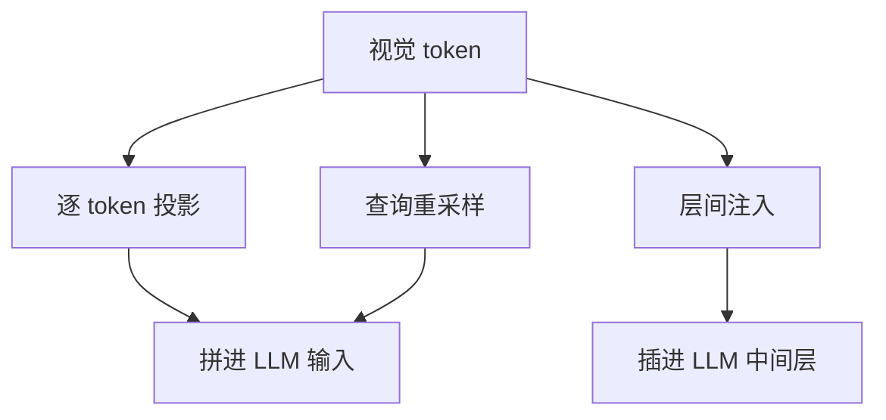

# VLM 结构(连接器与融合位置)

一句话:VLM 的结构问题只有一个——**一个已经训好的语言模型,怎么把图像这种它从没见过的东西读进去**;所有方案的差别都落在三个数上:视觉特征在**哪一层**汇入、汇入**多少个 token**、为此**新增多少参数**。视觉塔本身怎么训(ViT / CLIP / SigLIP 的机制)见 视觉编码器 篇,大图怎么切、怎么支持任意分辨率见 任意分辨率与高分辨率 篇。

## 一、三条接法:视觉信息在哪一层汇入

先划清一条界:**CLIP 不是 VLM**。CLIP 的图像塔和文本塔各自把输入压成一个向量,两边只在**损失函数里**见面,给出的是「这张图和这句话像不像」的一个分数。所以它能把几百万张图预先编码好丢进向量库做近邻检索——因为图侧的计算和文本完全解耦,可以离线算完;但它写不出一句话,因为它的输出端没有解码器,训练时也从来没有过「逐 token 预测下一个词」这个目标。要让模型开口回答,视觉信息必须真的进到一个自回归语言模型的前向计算里去。

进的方式只有三种,区别就在汇入位置:

不管走哪条,连接器都要同时干两件事,后面所有取舍都从这两件事派生:

- **换空间**:把视觉塔的特征映射到 LLM 的词嵌入空间。因为两个模型是各自独立训出来的,同一个位置上的数值代表什么,两边的坐标系完全不通——不换空间,LLM 拿到的就是一串噪声。
- **定预算**:决定送进 LLM 的视觉 token 是几百个还是几十个。因为注意力对序列长度是平方复杂度,而且 KV cache 也按 token 数线性增长,视觉 token 直接吃掉上下文额度和首 token 延迟。

### 逐 token 投影:直译员

最朴素的一条:视觉塔输出的每个 patch 特征各自过一层线性变换(LLaVA-1.5 起改成两层 MLP),映射进词嵌入空间,当成一串「外语词」拼在文本 token 前面。

数字上感受一下量级。LLaVA-1.5 用 CLIP ViT-L/14 的 336px 版本,336/14 = 24,于是一张图变成 $24 \times 24 = 576$ 个视觉 token,不筛选、不压缩、原样进场。而投影层本身极小:按 ViT-L 的 1024 维接 Vicuna-7B 的 4096 维、两层各含偏置估算,参数量约两千万——**相对 7B 主干不到千分之三**。LLaVA-1.5 论文对这个全连接连接器的评价是「出乎意料地强、且省数据」:13B 那档只用 120 万条公开数据、单台 8×A100 一天训完,就在 11 个基准上刷到当时的最好水平。

两个常被追的点:

- **投影本身不做 token 之间的交互,为什么还能保留空间信息?** 因为空间信息不是投影带来的,是视觉塔就已经编好的:每个 patch 特征里已经含了 ViT 的位置嵌入,而且这 576 个 token 是**按栅格顺序排进序列的**。投影只逐个换坐标系、不打乱顺序,所以「谁在左上、谁在右下」这层结构原样传给了 LLM,再由 LLM 自己的自注意力去做 token 间交互。真正丢空间信息的是全局平均池化那种把 576 压成 1 的做法。
- **从线性层改成两层 MLP 说明什么?** 说明这一步不是简单的线性坐标变换,加一层非线性就有可测的收益;但也说明**收益很快见顶**——没人继续堆到六层,因为真正卡住效果的是视觉塔的分辨率和送进去的 token 数,不是投影的表达力。MM1 的大规模消融把这条说得更直白:图像编码器、分辨率和视觉 token 数是关键变量,而连接器的具体设计影响很小。

### 查询重采样:带着固定问题去采访

第二条路是先压缩再送。做法是准备一组**可学习的 query 向量**,让它们通过 cross-attention 去「读」视觉特征,读完只交出固定数量的摘要 token。类比:记者带 32 个固定问题进现场,不管现场多大,回来只交一篇定长的采访稿。

三个代表实现,注意它们不是一回事:

| 实现 | query 数 | 结构 | 输出 token |
|---|---|---|---|
| BLIP-2 的 Q-Former | 32(768 维) | BERT-base 初始化,每隔一个 block 插一层 cross-attention,自身约 1.88 亿参数 | 32 |
| Flamingo 的 Perceiver Resampler | 64 | 轻量重采样器,三档模型共用同一份,论文称其规模相对主干很小 | 64 |
| Qwen-VL 的位置感知适配器 | 256 | **单层** cross-attention,随机初始化,并把二维绝对位置编码加进 query-key | 256 |

**Qwen-VL 用的不是 Q-Former**,这是面试里常见的口误。它只有一层 cross-attention,而且专门补了二维位置编码,理由就是压缩会把位置细节洗掉——448px 输入下视觉塔出 1024 个特征,压到 256 个,不补位置就没法做文字读取和定位。

BLIP-2 为什么非要 Q-Former:因为它把图像编码器和 LLM **两端都冻住了**,中间必须有一个足够强、能自己训的模块把两边接上,所以 Q-Former 要先做一轮视觉语言表征学习(学会「问对问题」)、再做一轮接 LLM 的生成学习。代价是这个瓶颈是**硬的**:ViT-L/14 的 257×1024 特征被压成 32×768,而论文把这个尺寸落差直接写成了设计意图——落差逼着 query 只挑与文本最相关的信息。于是小字 OCR、密集图表、局部属性这类「不在主语义里」的细节最容易被漏掉。

### 层间注入:同声传译

第三条路更激进:视觉特征**根本不进输入序列**。Flamingo 先用 Perceiver Resampler 压成 64 个 token,再在冻结 LLM 的层与层之间插入新的 gated cross-attention 层,让每一层的文本 hidden state 按需去查视觉特征。翻译不坐会议桌、不占座位,而是在每层楼给你戴一副耳机。

和输入投影的差别就在这里:**投影路线里视觉 token 是序列的一部分,会被后续所有文本 token 通过自注意力看到,也会进 KV cache;层间注入里视觉特征是「挂在模型侧的一本册子」,序列长度一点不涨,但每插一层就多一次注意力计算**(cross-attention 机制本身见 注意力基础 篇)。

门控细节值得记:gate 是 $\tanh(\alpha)$,$\alpha$ 初始化为 0。因为这样训练起点上新层的输出恒为 0,整个模型的行为和纯 LLM 逐位一致,视觉信息随训练被逐渐「拧开阀门」——不这么做,一个随机初始化的新层直接加进残差流会立刻打乱预训练语言能力,训练早期就崩。

代价是参数量,Flamingo 论文自己的配置表最能说明问题:

| 模型 | 冻结 LM | 插入频率 | 新增可训练参数 |
|---|---|---|---|
| Flamingo-3B | 1.4B | 每层 | 1.4B |
| Flamingo-9B | 7B | 每 4 层 | 1.8B |
| Flamingo-80B | Chinchilla 70B | 每 7 层 | 10B |

**新增参数和冻结主干同一个量级**(3B 那档甚至是 1:1),而且随主干规模一起膨胀,所以只能靠降低插入频率来控制——这就是它「要给 LLM 动大手术」的具体含义。对比之下,投影路线的连接器是 2000 万量级,Q-Former 是 1.88 亿量级。

### 账本:那笔省下来的计算,到底省在哪

把三条路放一起,最该记住的是**压缩省的是哪一段**:

| | 逐 token 投影 | 查询重采样 | 层间注入 |
|---|---|---|---|
| 视觉特征汇入位置 | LLM 输入层 | LLM 输入层 | LLM 每隔 N 层 |
| 进 LLM 的视觉 token | 几百到几千 | 固定 32 / 64 / 256 | 0(不进序列) |
| 新增参数量级 | $10^7$ | $10^8$ | $10^9$,随主干膨胀 |
| 主要风险 | 上下文与延迟被视觉 token 吃掉 | 固定容量漏细节 | 改动 LLM,迁移成本高 |

假设一张图在视觉塔出 2048 个特征、Q-Former 只交 32 个,**能说的是送进 LLM 的序列短了 64 倍,不能说端到端快了 64 倍**。因为省掉的只有 LLM 侧那一段:LLM 的 prefill 注意力(平方项)、每层 FFN(线性项)、以及这些 token 占的 KV cache。没省掉的是视觉塔那一遍完整前向(它照样要算 2048 个 token),也没省掉 Q-Former 自己读取全部视觉特征的那次 cross-attention——压缩器本身是新增开销。所以收益的形状是:**首 token 延迟和显存降得很明显,视觉塔那部分固定成本一分不少**。图越大、LLM 越大,压缩越划算;图小、LLM 小,压缩器可能反而是净亏。

视觉 token 预算可以直接算:

$$
N_{\text{vis}} = F \cdot \frac{(S/P)^2}{m^2}
$$

$F$ 是帧数,$S$ 是边长,$P$ 是 patch 大小,$m$ 是相邻 token 的合并倍数。这个式子只说一件事:**token 数对分辨率是平方关系,对帧数是线性关系**。边长翻倍,视觉 token 变四倍;16 帧短视频就是单图的 16 倍。Qwen2-VL 是这里的一个具体读数:ViT 约 6.75 亿参数、patch=14,224×224 出 256 个特征,再用一层 MLP 把相邻 2×2 合成 1 个($m=2$),加上首尾两个视觉边界标记,**进 LLM 时是 66 个 token**。

## 二、横向比较与按任务选型

代表模型放一张表,注意**它们不是一条升级路线**,因为任务接口就不同:

| 模型 | 视觉怎么进语言侧 | 主要训练信号 | 擅长与边界 |
|---|---|---|---|
| CLIP | 不进;两塔在向量空间比相似度 | 双向图文对比(见 对比学习 篇) | 检索、开放词汇分类极省;不能生成回答 |
| Flamingo | Resampler 压 64 → 冻结 LM 层间 gated cross-attn | 图文交错语料上的下一 token 预测 | 图文交错、多图少样本;新增 10B 参数 |
| BLIP-2 | Q-Former 32 query → 冻结 LLM 输入 | 先表征学习,再接 LLM 的生成学习 | 两端全冻,可训练模块最小;压缩瓶颈丢细节 |
| LLaVA | 线性/两层 MLP 逐 token 投影 → LLM 输入 | 特征对齐预训练 + 视觉指令微调 | 结构最简单、最好复现;成本随 token 数涨 |
| Qwen-VL | 单层位置感知 cross-attn 压到 256 → LLM 输入 | 图文预训练、多任务预训练、指令微调三阶段 | 支持定位与文字读取;接口随版本变,以技术报告为准 |

### 为什么后来大多回到了投影路线

这不是「新的就更好」,有对照实验。本节引的两组数字都来自 2024 年的公开工作(Idefics2、NVLM),口径是各自论文里的同配置对照;跨代际的结论请按具体模型的技术报告复核,不要当成永久事实。Idefics2 的架构消融在同一套数据和主干下做了直接对比:

- **主干冻结时,cross-attention 路线更强**(66.7 对 60.3)。因为主干不能动,视觉信息只能靠新增的那批参数来适配,而 cross-attention 路线新增的参数多得多。
- **主干用 LoRA 解冻后,投影路线反超**(69.5 对 67.3),而且是在参数更少的情况下反超。因为一旦主干自己能动,它就能去适应视觉 token,不再需要外挂一大套专用参数(LoRA 机制见 LoRA 篇)。
- 一个必须一起记住的坑:**投影路线直接全量解冻主干会训崩**,论文里出现了训练发散,是靠 LoRA 才稳住的。

把这几条串起来就是那句关键判断:**连接器承担的工作量,和「主干允许被改多少」是此消彼长的**。冻得越死,连接器越要重;主干可训,连接器就可以退化成一层 MLP。当大家普遍接受在指令阶段调 LLM(哪怕只用 LoRA)之后,重连接器的性价比就掉下来了。

### 混合路线:分工而不是二选一

NVLM 把三条路在同一套训练配置下都跑了一遍,结论是各有胜负:

- 训练吞吐 NVLM-X(cross-attention)50.6 样本/秒 > NVLM-H(混合)36.2 > NVLM-D(投影)28.8。因为视觉 token 不进序列,LLM 的有效序列长度短得多。
- 但 OCR 类任务是投影路线赢:NVLM-D 拿到 OCRBench 853,在 TextVQA、DocVQA 上都优于自己的另外两个变体。因为所有 token 在 LLM 里统一走自注意力,文字和图像细节能在同一层做联合推理。
- 混合路线 NVLM-H 的分工很有代表性:**全局缩略图的 token 走自注意力(负责推理),高分辨率切片走 cross-attention(负责细节)**,吞吐比纯投影高、高分辨率能力比纯 cross-attention 强。

这就是「怎么设计混合连接器、值不值」的标准答法:**按信息的用途分流,而不是按结构复杂度加法**——少量、需要参与推理的信息进序列,大量、只需要按需查阅的细节挂到层间。判断值不值要在同一编码器、同一 LLM、同一视觉 token 预算下比任务准确率、首 token 延迟、吞吐和错误类型,不能凭结构更复杂推断更好。Honeybee 是另一个思路的代表:在压缩的同时用带局部性的算子保住邻域结构,专门针对「压缩丢空间」这个病。

### 按任务定预算

- **文档 / 图表 / UI**:怕的是**压缩瓶颈**。小字本来就只占几个 patch,再压一次就没了,所以这类任务偏向不压缩或轻压缩、并把分辨率堆上去(具体切法见 任意分辨率与高分辨率 篇)。
- **视频**:怕的是**token 预算**。按上面的式子,帧数是线性放大器,不压缩根本喂不进去,所以这里反而必须压缩,或者先做关键帧选择。
- **Visual Grounding**:结构上要求两件事——视觉 token 必须**保留空间结构**(所以不能全局池化,压缩时要像 Qwen-VL 那样补二维位置编码),以及坐标要有表达方式(主流做法是把框坐标写成文本 token,训练时喂「图-描述-框」三元组,让定位变成一个普通的生成任务)。
- **短视频三重挤压**(帧数 × 分辨率 × 上下文):这三个量在 $N_{\text{vis}}$ 里是乘起来的,只能取舍。先按任务定帧数——判断「有没有某个物体」少几帧就够,判断「先后顺序」必须覆盖过程;再用剩下的预算换分辨率;最后用合并或重采样把 token 压到上下文装得下。

> 🖼️ 占位:同一张 1024×1024 图在「不压缩 / 2×2 合并 / 32 query 重采样」三种连接器下,进入 LLM 的 token 数与首 token 延迟对比条形图

## 三、编码器 + 适配器 vs 原生早融合

前面三条路有个共同前提:**有一个独立的、预训练好的视觉编码器**。原生多模态路线要拆的就是这个前提。按融合位置排成一条谱系,分野一目了然:

| 融合位置 | 代表 | 视觉侧是什么 |
|---|---|---|
| 只在损失里 | CLIP | 独立视觉塔,永不与文本同层计算 |
| LLM 中间层 | Flamingo | 独立视觉塔 + 重采样器,挂在层间 |
| LLM 输入层 | BLIP-2 / LLaVA / Qwen-VL | 独立视觉塔 + 适配器,产出连续 token |
| 第一层就是同一条序列 | Chameleon / Fuyu | **没有独立视觉塔** |

**本质差异不是「谁更先进」,是视觉表示由谁负责**。编码器 + 适配器路线里,视觉语义是外部模型预先训好的既成事实,主干只负责消费;原生早融合里,视觉表示是主干自己在预训练中学出来的,和文本共用一套参数和一个目标。

两个具体做法:

- **Chameleon**:用一个码本大小 8192 的图像 tokenizer 把 512×512 的图变成 1024 个**离散** token,和文本 token 混排进同一条序列,从头端到端训练(离散化机制见 图像Tokenizer 篇)。代价很实在:它的 tokenizer 重建「含大量文字的图像」有困难,所以 OCR 类任务受限——**离散化是有损的,损在哪由 tokenizer 决定**。
- **Fuyu-8B**:更极端,连 tokenizer 都不要,图像 patch 直接线性投影进 decoder 的第一层,没有视觉编码器,也去掉了图像专用位置嵌入,按栅格顺序当普通 token 喂。好处是天然支持任意分辨率、不需要分高低清两套训练;代价是所有视觉归纳偏置都得靠数据从头学(该模型信息来自 Adept 的公开博客,非同行评审论文,细节以官方说明为准)。

理解与生成要不要共用一套视觉表示,也是这条线上的问题。Janus 的做法是**解耦**:理解走一条视觉编码路径、生成走另一条,但共用同一个 Transformer 主干,理由是同一个编码器同时服务「看懂」和「画出来」会互相打架。至于统一生成该选自回归还是扩散——不必二选一,常见形态是自回归负责规划或产出离散 token、扩散解码器负责最后的像素(采样机制见 Diffusion 篇)。

### 频率对不上与模态竞争

视频帧、音频采样点的原生速率远高于文本 token,不能原样入序列,处理只有两步:**先压,再标顺序**。压的手段就是前面那套(patch 化、相邻合并、关键帧、重采样器、向量量化);标顺序靠位置编码——把位置从「一维序号」升级成带时间/高/宽分量的多维坐标,才能同时表达「第几帧、第几行、第几列」(一维 RoPE 的原理见 RoPE 篇)。

早融合还有一个只有它才有的结构问题:**模态竞争**。不同模态的 token 分布熵不同,共用一套注意力和归一化时,训练中 logits 会失控发散。Chameleon 的解法是结构层面的——给 attention 的 query/key 加 QK-Norm 直接约束进 softmax 前的范数,34B 那档还把归一化位置改成了后置(Norm 位置的取舍见 Norm位置 篇)。数据侧则用采样比例和损失权重控制不平衡,不让高频模态主导梯度;某个模态缺失时,配套的位置标记和边界 token 要能表达「这一段没有」,而不是靠补零糊过去。

## 四、结构上的冻结与分阶段

分阶段训练不是仪式,它是**结构决定的**:连接器是唯一随机初始化的新模块,而视觉塔和 LLM 都是训好的。让一个随机模块和两个成熟模块同时更新,前者输出的噪声会顺着梯度污染后者——所以常见路线是先冻两端只训连接器(学会翻译),再放开做指令微调(SFT 的通用机制见 SFT 篇)。这是降低初期优化难度的手段,不是所有 VLM 必须遵守的固定流程。

**视觉塔冻不冻,判据是能力缺口在哪一层**:

- 冻结省的是视觉塔的梯度和优化器状态(按 Adam 的口径,这两项通常是参数量的几倍显存),也避免视觉特征漂移;
- 但**连接器变不出编码器没编出来的信息**。如果小字在 336px 下本来就糊了,再强的 projector 也恢复不了——这时该动的是分辨率和视觉塔,不是连接器;
- 判据因此是:数据少、视觉特征够用就先冻;领域偏移、分辨率不足、细粒度识别有明确缺口时,再比较部分解冻、LoRA 和全量更新,并用较小的视觉侧学习率和旧视觉任务的回归评估来控制遗忘。**冻结不是永远正确,解冻也不保证涨点。**

**全部模块可训练会出什么问题**:三个模块的成熟度和梯度尺度差着量级,同一个学习率下,新连接器还没学会翻译,已经把视觉塔和 LLM 往坏里带;Idefics2 里投影路线全量解冻直接训练发散,就是这个失败的实例。可用的手段是分阶段、按模块设学习率、用 LoRA 限制主干更新幅度;但**先查数据和梯度,再调参**,不要用「都解冻了」代替训练诊断。

### 结构对数据和评审的硬要求

有几条约束是结构直接推出来的,不是数据洁癖:

- **图文对应必须精确到位置**。视觉 token 是按出现位置插进序列的,一条多图样本里图错位,等于把答案接到了错误的 K/V 上,模型学到的是错的关联。所以低质量图文对的第一优先级是**去掉错配、去掉图里根本看不到的描述、核查 OCR 与坐标标注**;模糊图可以保留用来训练「说明看不清」,但不能配一个笃定的臆测答案。切分训练/验证集要按图像或整段视频这个实体切,否则相邻帧会跨集泄漏。
- **奖励模型的输入端也得有视觉前端**。要判断「图里有没有这个东西」,评审必须看得到图或拿到充分可验证的视觉证据;纯文本 RM 只能评流畅度和格式,拿它做偏好对齐等于在**奖励幻觉**——回答越顺口分越高(RM 的训练机制见 RLHF与RM 篇,多模态 RL 的展开见 多模态RL 篇)。OCR、定位这类有标准答案的任务可以直接用规则打分,不必训 RM。
- **DPO 在 VLM 上省的是一整套带视觉塔的模型副本**。PPO 路线要同时持有策略、参考、奖励、价值四份模型,而在 VLM 里每一份都拖着一个视觉编码器;DPO 不需要显式 RM 和在线采样,显存和链路都短一大截。代价是它受离线偏好数据覆盖范围限制,而且照样要在图文条件下算答案概率,**并不因此解决视觉幻觉**(算法本身见 DPO 篇)。
- **视频后训练要把时间信息带进结构里**:采样时保留时间戳和帧序,位置编码用带时间分量的形式,评估要同时覆盖事件先后、跨帧一致性和整段任务成功率,并记录帧数、时延与成本——因为这三者和准确率是同一个预算里的此消彼长。

## 五、面试考点串联

| 高频问法 | 本文哪一节 |
| --- | --- |
| CLIP、Flamingo、BLIP-2、LLaVA、Qwen-VL 的结构和训练目标差在哪?为什么 CLIP 适合检索却替代不了生成式 VLM? | 一(开头)、二(对比表) |
| LLaVA 式 MLP 和 BLIP-2 的 Q-Former 差在哪?信息流、参数量、视觉细节和推理开销各怎么权衡? | 一(逐 token 投影 / 查询重采样 / 账本) |
| Query 数减少时省掉的是哪一段计算?为什么不是等比例端到端加速? | 一(账本) |
| MLP 不做 token 间交互,为什么还能保留空间信息?从线性层改成两层 MLP 说明了什么取舍? | 一(逐 token 投影) |
| Flamingo 的层间 cross-attention 和 LLaVA 的输入投影差在哪?BLIP-2 为什么非要 Q-Former,它会丢什么? | 一(层间注入 / 查询重采样) |
| Projector 有哪些主流方案?怎么设计 MLP 与查询压缩的混合连接器,复杂度值不值? | 一(三条接法)、二(混合路线) |
| 文档理解和视频理解分别更担心哪种连接器瓶颈?做 Visual Grounding 又要额外给什么表示和信号? | 二(按任务定预算) |
| 短视频同时被帧数、分辨率和上下文预算卡住时怎么选型? | 一(账本公式)、二(按任务定预算) |
| 统一多模态 Transformer 怎么表示、对齐、融合文本图像音频视频?能统一到什么程度? | 三(融合位置谱系) |
| 原生多模态和「编码器 + 适配器」的本质差异是什么?各自边界在哪? | 三 |
| CLIP、Flamingo、Chameleon 的融合位置有何差异?统一生成该选自回归还是扩散? | 三(谱系表、Janus 段) |
| 视频帧率、音频采样和文本 token 频率对不上怎么办?模态缺失或数据不平衡时采样和损失怎么调? | 三(频率与模态竞争) |
| VLM 后训练比纯文本多了哪些难题?视觉编码器该不该参与 SFT/RL,全部解冻会怎样? | 四 |
| 没有人类视觉反馈时奖励怎么设计,评审模型要不要看图?DPO 比 PPO 在 VLM 上省了什么? | 四(结构对数据和评审的硬要求) |
| SFT 阶段的低质量图文对怎么处理?短视频后训练怎么保住时间信息、怎么评? | 四(结构对数据和评审的硬要求) |
| 补充题:同一张图,投影路线和 Q-Former 路线送进 LLM 的 token 数差多少?这个差距体现在推理的哪个阶段? | 一(账本) |
| 补充题:Flamingo 的 gate 为什么初始化成 0?不这么做会怎样? | 一(层间注入) |
| 补充题:主干冻结时 cross-attention 更强、解冻后投影路线反超,这说明连接器在承担什么? | 二(为什么回到投影路线) |
| 补充题:早融合模型为什么要额外加 QK-Norm 这类稳定手段? | 三(模态竞争) |

阅读顺序建议:视觉编码器(眼睛怎么来的)→ 本篇(怎么接上)→ 任意分辨率与高分辨率(怎么喂得更清楚)。

## 相关文献

- Flamingo: a Visual Language Model for Few-Shot Learning — [arXiv:2204.14198](https://arxiv.org/abs/2204.14198)
- BLIP-2: Bootstrapping Language-Image Pre-training with Frozen Image Encoders and Large Language Models — [arXiv:2301.12597](https://arxiv.org/abs/2301.12597)
- Visual Instruction Tuning(LLaVA)— [arXiv:2304.08485](https://arxiv.org/abs/2304.08485)
- Improved Baselines with Visual Instruction Tuning(LLaVA-1.5,MLP projector)— [arXiv:2310.03744](https://arxiv.org/abs/2310.03744)
- Qwen-VL: A Versatile Vision-Language Model for Understanding, Localization, Text Reading, and Beyond — [arXiv:2308.12966](https://arxiv.org/abs/2308.12966)
- Qwen2-VL: Enhancing Vision-Language Model's Perception of the World at Any Resolution — [arXiv:2409.12191](https://arxiv.org/abs/2409.12191)
- What matters when building vision-language models?(Idefics2,架构消融)— [arXiv:2405.02246](https://arxiv.org/abs/2405.02246)
- NVLM: Open Frontier-Class Multimodal LLMs(投影 / cross-attention / 混合的同配置对比)— [arXiv:2409.11402](https://arxiv.org/abs/2409.11402)
- MM1: Methods, Analysis & Insights from Multimodal LLM Pre-training — [arXiv:2403.09611](https://arxiv.org/abs/2403.09611)
- Honeybee: Locality-enhanced Projector for Multimodal LLM — [arXiv:2312.06742](https://arxiv.org/abs/2312.06742)
- Chameleon: Mixed-Modal Early-Fusion Foundation Models — [arXiv:2405.09818](https://arxiv.org/abs/2405.09818)
- Janus: Decoupling Visual Encoding for Unified Multimodal Understanding and Generation — [arXiv:2410.13848](https://arxiv.org/abs/2410.13848)
- Learning Transferable Visual Models From Natural Language Supervision(CLIP)— [arXiv:2103.00020](https://arxiv.org/abs/2103.00020)
- Fuyu-8B: A Multimodal Architecture for AI Agents(Adept 官方博客,非论文)— https://www.adept.ai/blog/fuyu-8b/
