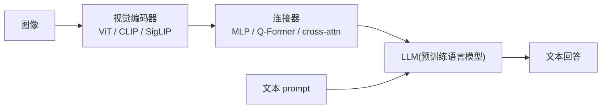
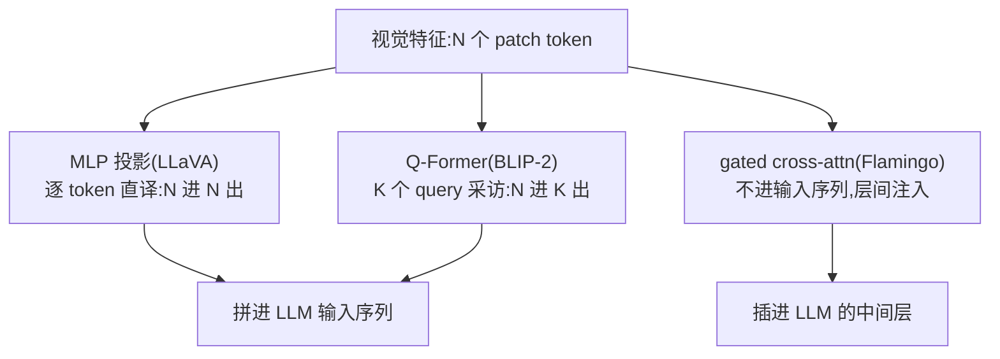

# VLM 结构(ViT / CLIP / 连接器)

> ⚠️ 旧版:本篇写于写作契约确立之前,尚未按新标准审查重写。标准见 docs/05-知识库写作契约.md,样板见「GPU架构与执行模型」。

一句话:**主流 VLM = 视觉编码器 + 连接器 + LLM 的三段式拼接**——眼睛看图、转接头翻译、大脑说话。过去几年的 VLM 架构演化史,基本就是「连接器怎么设计」与「分辨率怎么喂」这两条线的演化史。

## 一、视觉编码器:VLM 的眼睛

### ViT:把图片当句子读

ViT(Vision Transformer)只做一个核心动作:**把图像切成不重叠的小方块(patch),每块当一个「词」**。论文标题就是字面意思——An Image is Worth 16×16 Words:

1. 切 patch:$H \times W$ 的图按 $P \times P$(如 16×16 像素)切成 $N = HW/P^2$ 块,224×224 的图切出 196 块;
2. 每块展平后过一层线性投影变成向量——相当于「词嵌入」;
3. 加上**位置嵌入**(不加的话 Transformer 分不清哪块在左上、哪块在右下),整串送进标准 Transformer 编码器。

类比:把一张海报剪成一沓邮票,按行编号后排队进场。之后的自注意力让每张邮票一步看到所有其他邮票,全局关系直接建模(CNN 得靠层层堆叠慢慢扩大感受野)。

### CLIP:和语言「对过暗号」的眼睛

CLIP 用 4 亿网络图文对做**对比学习**:一个 batch 里 $N$ 张图、$N$ 段文字,图像塔和文本塔各自编码成向量,**正确配对拉近、错误配对推远**——一场 $N \times N$ 的大型连连看。损失是对称的 InfoNCE:

$$
\mathcal{L} = -\frac{1}{2N}\sum_{i=1}^{N}\left[\log\frac{\exp(\langle I_i, T_i\rangle/\tau)}{\sum_{j=1}^{N}\exp(\langle I_i, T_j\rangle/\tau)} + \log\frac{\exp(\langle I_i, T_i\rangle/\tau)}{\sum_{j=1}^{N}\exp(\langle I_j, T_i\rangle/\tau)}\right]
$$

其中 $\langle\cdot,\cdot\rangle$ 是归一化后的余弦相似度,$\tau$ 是可学习温度;两项分别对应「一张图找对文」与「一段文找对图」。

**为什么 CLIP 的视觉塔适合当 VLM 的眼睛**:它的特征在预训练时就被迫与文本对齐在同一空间,天生「会说一点语言」,携带的是语义级信息(这是猫、在沙发上)而非纯像素统计。拿它接 LLM,连接器只需做「方言转换」;换成只学过 ImageNet 分类的编码器,就得从零教它学外语。

SigLIP 的改进一句话:把「全 batch 一起 softmax 排名」换成**每个图文对独立做 sigmoid 二分类**(是/不是一对),损失不再依赖超大 batch 的全局归一化,小 batch 也稳、更好扩展,后来成为新一代 VLM 的常用眼睛。

## 二、连接器三代(重点)

眼睛和大脑说的是两种「语言」:视觉特征空间 vs LLM 词嵌入空间。连接器就是中间的**翻译官**,三代设计对应三种翻译风格。

### 线性投影 / MLP(LLaVA):直译员

最朴素的做法:每个视觉 token 各自过一层线性投影(LLaVA-1.5 起换成两层 MLP),映射进 LLM 词嵌入空间,当成「外语词」直接拼在文本 token 前面。

- 数据流:336px 的 CLIP ViT-L/14 出 576 个视觉 token,不压缩不筛选,原样进场;
- 优点:结构简单,不额外压缩视觉token数量;但维度投影及视觉编码本身仍可能丢信息;
- 缺点:token 数多——吃上下文、拖慢推理,分辨率一高就爆炸。

### Q-Former(BLIP-2):带着问题去采访的记者

一组**可学习的 query 向量**(如 32 个)通过 cross-attention 反复「采访」图像特征,把几百个 patch token 压缩成固定 K 个摘要 token 再交给 LLM。记者带 32 个固定问题进现场,回来只交一篇定长采访稿——不管现场多大,稿子长度不变。

- 优点:压缩比高(数百 → 32),LLM 端负担极小;
- 缺点:**信息瓶颈**——query 数固定,小字 OCR、密集图表这类细粒度信息容易在「采访」中漏掉;
- 额外成本:Q-Former 自身要先经过一轮图文多任务预训练,才能学会「问对问题」。

### Cross-attention 注入(Flamingo):同声传译

视觉特征**根本不进输入序列**:先用 Perceiver Resampler 压成定长,再在冻结 LLM 的层与层之间插入 **gated cross-attention** 层,让文本 hidden state 按需查询视觉特征。翻译不坐会议桌、不占座位,而是通过每层楼的耳机做同声传译。

- 门控细节:gate 用 $\tanh$ 且初始化为 0——训练起点上模型行为与纯 LLM 完全一致,视觉信息随训练逐渐「拧开阀门」,保护语言能力;
- 优点:不占上下文,天然适配图文交错与多图 few-shot;
- 缺点:要给 LLM 动「大手术」,新增参数量大(Flamingo 加了十亿级),训练与迁移成本高。

### 按任务比较连接器

MLP逐token投影,通常容易实现与调试,但不自动保证信息无损;查询压缩减少语言侧长度,也可能漏掉小字、局部位置等细节。cross-attention通过层间注入视觉特征,仍有特征存储与额外注意力计算成本。比较时固定编码器、数据和视觉预算,不能只凭结构复杂度判断哪种效果更好。

| 方案 | 视觉信息如何进入语言模型 | 主要取舍 |
|---|---|---|
| 线性层或MLP | 逐token投影后拼入输入 | 简单,但视觉序列可能很长 |
| 查询压缩 | 提取较少的摘要token后拼入输入 | 语言侧成本低,压缩可能损失细节 |
| cross-attention | 在语言层内查询视觉特征 | 不直接增加文本输入长度,但要付额外融合计算 |

## 三、分辨率策略:从「看不清」到「看多大用多大」

**固定低清的问题**:CLIP 类编码器预训练分辨率固定(224/336px),小字与密集图表直接糊掉——像把 A4 文档缩印成名片再读,OCR、表格、UI 截图全失效。这是早期 VLM 文档任务差的主因。演化两步:

- **AnyRes / 动态切块**(LLaVA-NeXT 等):大图按网格切成若干 tile,每个 tile 各自过一遍 ViT,再补一张全局缩略图保住整体构图,全部 token 拼接进 LLM。像把大地图剪成几页分别扫描再拼——简单有效,但 tile 边界会割裂物体,token 数也随 tile 数暴涨;
- **原生动态分辨率**(Qwen2-VL 的 naive dynamic resolution):不预设输入尺寸,**多大的图就切多少 patch**,产出变长的视觉 token 序列(再用 2×2 相邻 patch 合并压缩 4 倍)。配套 **M-RoPE**:把旋转位置编码拆成时间、高、宽三个分量——图像 patch 用二维网格坐标,视频帧再加时间维,位置从「一串」升级为「一张网格/一摞网格」,天然适配任意宽高比与视频(RoPE 的一维原理见 RoPE 篇)。

> 🖼️ 占位:AnyRes 切块示意——一张大图切成 2×2 个 tile + 1 张全局缩略图,各自过 ViT 后 token 拼接

注意 token 数随分辨率**平方增长**:分辨率翻倍,视觉 token 翻四倍——分辨率策略永远是「看得清」与「token 预算」的拉扯。

## 四、训练配方:两阶段与数据

一种常见路线是先冻结视觉塔与语言模型、只训练新连接器,再进行多模态指令微调;这是降低初期联合优化难度的选择,不是所有VLM必须遵循的固定阶段。通用SFT与偏好优化的分工见 RLHF与RM 篇。

### 视觉塔冻结与解冻

冻结视觉塔能减少其梯度和优化器状态开销,但若原编码器看不清小字或领域特征不足,连接器无法凭空恢复丢失的信息。数据较少、视觉特征已够用时可先冻结;发现明确能力缺口后比较部分解冻、LoRA或全量更新。解冻后应监测旧视觉任务退化,并按模块设置学习率,没有一种范围始终最优。

全部模块可训练也可能过拟合或破坏已有能力。先检查数据与梯度,再比较分阶段更新和不同模块的学习率,不能用“都解冻了”代替训练诊断。

### 图文与视频数据怎样对应

训练样本须保留图像身份、文本顺序以及视频帧的时间信息。清除错配图片、不可验证的描述、错误OCR或坐标;困难但正确的样本不应仅因模型当前答错就删掉。低质量来源可复核修正、降权或剔除,以留出集收益判断。

视频先按任务选择帧:只判断物体可能不需很多帧,判断动作先后则需覆盖过程与顺序。按原视频或会话切分数据集,防止相邻帧落入不同集合;使用音频与ASR时检查时间对齐。分辨率、帧数与视觉token压缩同时影响信息保留、显存和时延,应在相同预算下比较。

### 视觉偏好与评审

只看回答是否流畅不足以评价VLM。若判断图像中的事实,奖励模型或评审系统需要看到图片或充分可靠的视觉证据;仅检查格式的规则可以不看图。OCR、定位等可用可验证目标评分,开放问答可由视觉评审给反馈并人工抽检,监控评审偏差。

DPO可直接利用图文条件下的偏好对,省去显式RM和在线PPO采样环节,但仍受离线覆盖与偏好质量限制,不保证消除幻觉;算法本身见 DPO 篇。评估同时覆盖视觉事实、OCR、空间/时间关系、跨轮一致性和端到端任务成功率,并记录生成成本。

## 五、拼接式 vs 原生多模态

- **拼接式(晚期融合)**:各模态先各自预训练,再拼接对齐。省钱、模块化、能直接复用最强的单模态模型,是绝大多数开源 VLM 的选择;代价是视觉是「后娶进门的」,对齐总有损耗;
- **原生多模态(早期融合)**:从头把图文混在一起训练,甚至共用一套离散 token(Chameleon),或干脆去掉独立视觉编码器、patch 直接进 LLM(Fuyu)。模态更统一、上限更高,但训练成本极高、配方难调;
- **统一生成模型**一句话:理解与生成一体——既能看图说话,又能文生图,自回归侧如 Chameleon/Janus;扩散侧的展开见 Diffusion 篇。

## 六、细节与坑

- **视觉 token 是上下文杀手**:一张高分辨率图动辄上千甚至数千 token,多图对话、长视频轻松吃满上下文预算;2×2 合并、pixel-shuffle、token 剪枝是必答的工程题;
- **图像位置编码**:ViT 的可学习绝对位置嵌入换分辨率要做插值;新模型转向 2D-RoPE / M-RoPE,把「第几个 patch」升级为「第几行第几列」,变分辨率与外推更自然;
- **序列组织**:视觉 token 常用特殊 token 包起来(如 `<|vision_start|> … <|vision_end|>`)标出边界,多图按出现位置交错插入文本;
- **幻觉与视觉接地**:LLM 的语言先验太强,会「按常识补画面」,图里没有的东西说得有鼻子有眼(POPE 专测物体幻觉)。缓解:更高分辨率、grounding 数据(输出坐标框)、偏好对齐惩罚无中生有;
- **评测**一句:综合理解看 MMMU/MMBench,文档细粒度看 DocVQA/OCRBench,幻觉看 POPE。

## 七、面试考点串联

| 问法 | 正文小节 | 来源 |
|---|---|---|
| 视觉编码器、连接器与LLM分别做什么? | 一、视觉编码器;二、连接器三代 | 自拟 |
| MLP、查询压缩和cross-attention各付出什么代价? | 二、连接器三代(重点) | P002-Q081追问 |
| VLM后训练比纯文本多了哪些难题? | 四、训练配方:两阶段与数据 | P002-Q069/Q081/Q248主问 |
| 视觉塔要冻结还是解冻,全部可训练为什么仍可能变差? | 视觉塔冻结与解冻 | P002-Q069/Q081追问 |
| 低质量图文对怎样处理,视频又要多检查什么? | 图文与视频数据怎样对应 | P002-Q248追问 |
| 没有人类视觉反馈时怎么评分,评审一定要看图吗? | 视觉偏好与评审 | P002-Q069/Q081/Q248追问 |
| VLM用DPO省掉什么,为什么不保证更稳定? | 视觉偏好与评审 | P002-Q069追问 |
| 高分辨率怎样支持,视觉token太多怎么办? | 三、分辨率策略;六、细节与坑 | 自拟 |

> 本表含平台整理题P002-Q069/Q081/Q248及自拟题,非面经原题。本轮只补对应来源,全文仍保留旧稿重写任务。

## 相关文献

- ViT(An Image is Worth 16×16 Words)— [arXiv:2010.11929](https://arxiv.org/abs/2010.11929)
- CLIP(图文对比预训练)— [arXiv:2103.00020](https://arxiv.org/abs/2103.00020)
- Flamingo(gated cross-attention 注入)— [arXiv:2204.14198](https://arxiv.org/abs/2204.14198)
- BLIP-2(Q-Former)— [arXiv:2301.12597](https://arxiv.org/abs/2301.12597)
- LLaVA(视觉指令微调,MLP 路线起点)— [arXiv:2304.08485](https://arxiv.org/abs/2304.08485)
- SigLIP(sigmoid 对比损失)— [arXiv:2303.15343](https://arxiv.org/abs/2303.15343)
- Qwen2-VL(原生动态分辨率 + M-RoPE)— [arXiv:2409.12191](https://arxiv.org/abs/2409.12191)
