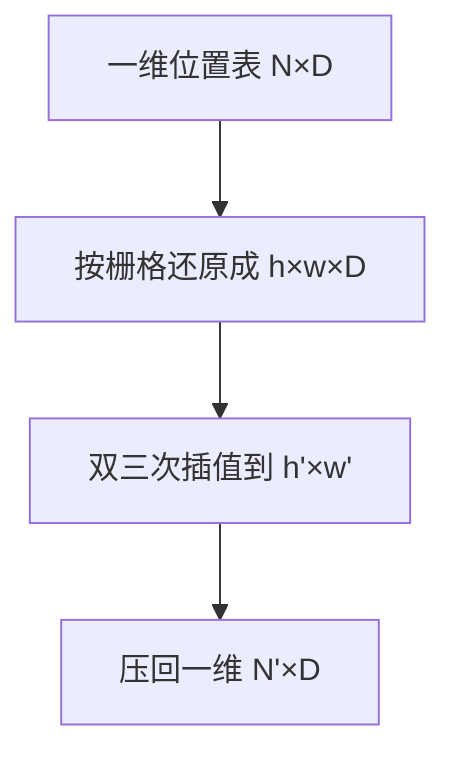
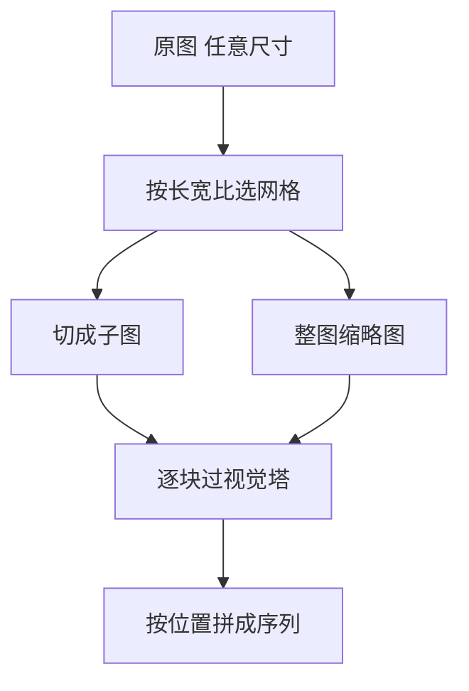

# 任意分辨率与高分辨率

一句话:视觉塔只会吃某个固定尺寸的方图,而真实输入里有 4K 截图、细长的网页长图和 A4 扫描件——本篇讲怎么在不把它们压糊的前提下喂进模型,同时不让视觉 token 把上下文和显存撑爆。视觉塔本身的 ViT/CLIP/SigLIP 机制见 视觉编码器 篇,特征怎么接进 LLM、选哪种连接器见 VLM结构 篇。

## 一、固定分辨率到底卡在哪

先把成本式子摆出来(它的来历见 视觉编码器 篇):

$$
N = \frac{H \times W}{P^2}
$$

意思是视觉 token 数等于图像面积除以 patch 面积。CLIP ViT-L/14 在 336px 下是 $24\times24=576$ 个 token,这就是 LLaVA-1.5 的视觉预算。**边长翻倍,token 变四倍**;而注意力对 token 数是平方的,所以边长翻倍,视觉那段自注意力的计算量变 16 倍。本篇所有取舍都从这条不等式派生。

固定分辨率的毛病不是一个,是四个,病因各不相同:

| 症状 | 病因 | 谁最先垮 |
|---|---|---|
| 形变 | 非方图被强行拉成方形,字被压扁、圆被拉成椭圆 | OCR、图表读数、几何判断 |
| 细节抹平 | 下采样发生在 patch embedding **之前**,信息还没进模型就没了 | 小字、密集表格、远处的小物体 |
| 极端长宽比浪费预算 | 按短边缩放再中心裁,长边直接被切掉;按长边缩放再补边,大半个序列在算灰边 | 网页长图、全景图、条形收据 |
| 尺寸和训练分布不一致 | 位置嵌入条数与 token 数绑死,换尺寸对不上 | 所有任务,直接报错或掉点 |

### 一个可以口算的账

拿 200 DPI 扫的 A4 页面举例,像素约 1653×2339。缩到 336×336 时横向压掉约 4.9 倍、纵向约 7 倍——正文字号本来在原图上高十几个像素,缩完只剩两三个像素高。**这两三个像素连一个 14×14 的 patch 都填不满**,而 patch embedding 那一层线性变换会把整块压成一个向量。这就是"提分辨率"和"换更强连接器"完全不是一回事的原因:信息在进 Transformer 之前就被丢掉了,后面没有任何模块能补回来。

反过来说,一张自然照片里"草地上有只狗"这种判断,336px 完全够用。**分辨率不是越高越好,它是按信息密度花的钱**:文档、图表、UI 截图的信息密度高,自然照片低。

> 🖼️ 占位:同一张含小字的 A4 扫描件在 336px 直接缩放、切片后缩放、原生分辨率三种处理下的局部放大对比

## 二、位置编码怎么跟着分辨率走

这是换分辨率时第一个会报错的地方。ViT 用的是**可学习的一维位置嵌入**:预训练时有多少个 patch 就存多少条向量,224px/patch14 就是 256 条。换成 336px 需要 576 条,那张表根本不够长。

### 插值:把一维表还原成二维网格再拉伸

ViT 论文给的办法是**对预训练位置嵌入做二维插值**,三步:

要点在于**必须先还原成二维再插值**。因为位置嵌入虽然存成一维列表,它编码的却是行列关系;直接在一维序列上拉伸,会把"下一行的第一个"和"上一行的最后一个"当成邻居插到一起,行列结构全乱。实现上还有两个细节:CLS token 那一条不参与插值,要先拆出来、插完再拼回去;插值核常用双三次,因为它比最近邻平滑、比线性保边缘。

插值本身是有代价的:插出来的向量是训练时**没见过**的取值,直接零样本推理通常掉点,常规做法是插完再用目标分辨率的数据微调一轮。

### 插值 vs 外推:为什么几乎没人选外推

| | 插值 | 外推 |
|---|---|---|
| 做什么 | 把已有位置表拉伸到新网格,新位置落在旧位置**之间** | 沿用旧编码规则,直接给出旧表没有的更大坐标 |
| 可学习位置嵌入 | 能做,插值就是唯一手段 | 做不了,没有"规则"可以往外延伸 |
| 正弦 / RoPE 类 | 相当于把频率整体缩放 | 语法上可以,但高频分量落进训练时没出现过的相位区 |
| 表现 | 掉点可控,微调能补回来 | 越远越乱,长边方向先崩 |

一句话:**插值是把已知区间重新采样,外推是往没见过的区域猜**。这和一维 RoPE 那边"内插比外推稳"的结论是同一个道理(一维情形见 RoPE 篇)。DiT 这类在潜空间上做 patch 化的扩散骨干换分辨率时,面对的也是同一个选择——潜图边长一变,token 网格跟着变,固定正弦位置编码要么按新网格重算、要么按比例插值,序列长度同时也变了(骨干结构见 DiT 篇,扩散侧按分辨率调采样步长的做法见 Diffusion 篇)。

### 2D 位置编码:让"第几行第几列"直接进编码

一维序号能凑合,但换分辨率时**同一个序号在不同宽度下代表的列不同**——宽度从 24 变成 48,序号 25 从"第 2 行第 1 列"变成"第 1 行第 25 列"。二维位置编码把这个歧义直接消掉:位置不再是一个标量 $i$,而是一对 $(r, c)$。

做法有三种,按代价排:

- **二维绝对位置嵌入**:行、列各存一张表,相加或拼接。Pix2Struct 就是这么做的,它专门为"输入尺寸不固定"设计,行列表可以独立按需取用。
- **2D-RoPE**:把隐藏维度切成两半,一半按行坐标旋转、一半按列坐标旋转。好处是它天生是相对的,序列变长时不需要新增参数。
- **多维 RoPE**:Qwen2-VL 的 M-RoPE 把位置拆成时间、高、宽三个分量,图像上时间分量恒定,视频上按帧递增——**同一套编码同时表达第几帧、第几行、第几列**。

Qwen-VL 早期版本给了一个更朴素的证据:它的单层 cross-attention 适配器把 1024 个特征压到 256 个,同时**把二维绝对位置编码加进 query-key**,理由就是压缩会把位置细节洗掉,不补位置就做不了文字读取和定位。

## 三、切片路线:把大图拆成视觉塔吃得下的小块

思路很朴素:**视觉塔只认 336 或 448,那就把大图切成若干块 336,一块一块过**。这条路的最大好处是视觉塔一行代码不用改,预训练权重原样复用。

### 为什么一定要配一张全局缩略图

只有子图,模型就是在"隔着纸筒看画":每块子图内部很清楚,但**块与块之间的关系没人负责**。缩略图那一路提供整体布局——这个表格有几列、这段文字在页面的哪个区域、人物和背景的相对位置。这也是它必须和子图一起送、而不是二选一的原因:子图管细节,缩略图管全局,两者的分工在 NVLM 的混合连接器里被写得最直白(**全局缩略图的 token 走自注意力负责推理,高分辨率切片走 cross-attention 负责细节**,见 VLM结构 篇)。

### 子图之间怎么标位置

切完之后,序列里是一长串 patch,模型并不知道第 578 个 token 是"右上角那块的左上角"。三种做法,通常混用:

1. **按行优先展平**,并在每行子图结束处插一个换行标记 token。最省事,LLaVA-NeXT 走这条。
2. **给每块子图加一个坐标标签**,把"第 2 行第 3 块"写成文本 token 或专用 token 拼在该块特征前面。
3. **直接用二维位置编码把全局坐标算进去**,子图内的 patch 拿到的是它在**原图**里的行列,不是块内行列。LLaVA-UHD 把这一层单独抽出来叫 spatial schema。

第 1 种最容易出的坑是:**换行标记一旦漏掉,长宽比信息就完全丢了**——同样 12 块子图,3×4 和 4×3 展平后是同一串 token。

### 重叠切还是不重叠切

不重叠切最省,但**跨切缝的物体和文字会被劈成两半**,每一半单独过视觉塔时上下文都不完整。带重叠的滑窗能缓解,代价是 token 数按重叠率上涨:步长取半个窗口,块数大约翻倍。实践中主流是**不重叠 + 全局缩略图**,靠缩略图和 LLM 侧的自注意力把缝合回来,而不是靠重叠像素;只有 OCR 这类对切缝极敏感的任务才值得付重叠的钱。Monkey 是用滑窗的代表,它把图切成 448×448 的块、**每块配一个独立适配器**,支持到 1344×896。

### token 数怎么爆

这是切片路线唯一真正的代价。把切片数记成 $n$、每块边长 $S$、patch 大小 $P$、相邻 token 的合并倍数 $m$:

$$
N_{\text{total}} = (n + 1)\cdot\frac{(S/P)^2}{m^2}
$$

那个 $+1$ 是全局缩略图。式子只说一件事:**token 数对切片数是线性的,对块内边长是平方的**。几个公开口径:

| 模型 | 切法 | 视觉 token 量级 |
|---|---|---|
| LLaVA-1.5 | 单张 336px,不切 | 576 |
| LLaVA-NeXT | 336px 网格切片 + 缩略图,最多 4 倍像素 | 约 2880(2×2 + 1 块,不合并) |
| Monkey | 448×448 滑窗,最高 1344×896 | 按块数线性增长,每块配独立适配器 |
| InternVL 1.5 | 448×448 动态切片,**1–40 块**,支持到 4K | 随块数线性增长,靠像素重排压缩 |
| InternLM-XComposer2-4KHD | 336px 起,自动配置块数,直到 4K HD | 随分辨率自动伸缩 |

InternVL 1.5 那个 1–40 是本节最值得记的数:**切片数是按输入的长宽比和分辨率动态定的,不是固定网格**。这样 A4 竖版拿到接近 1×N 的切法,宽屏截图拿到 N×1,不浪费预算去算补边。

## 四、原生动态分辨率路线:不切,直接让序列变长

第二条路更彻底:**既然 Transformer 本来就吃变长序列,为什么非要把图凑成固定尺寸?** 按原图长宽比缩到最近的 patch 整数倍,切成 patch,序列多长就是多长。

三个必须一起解决的问题:

- **位置怎么表达**:必须上二维,否则同一个序号在不同宽度下含义不同。Qwen2-VL 配 2D 形式的 M-RoPE 就是为这个。
- **一个 batch 里长度不齐怎么办**:补 padding 会浪费大量算力。NaViT 的答案是 **Patch n' Pack**——像 NLP 里的样本打包一样,把多张不同分辨率的图的 patch 拼进同一条序列,再用注意力掩码禁止跨图注意。这样几乎没有 padding 浪费,而且训练时可以随机丢弃一部分 patch 来进一步省算力。
- **token 数怎么控**:最常见的是**相邻 2×2 合并成 1 个**(有的实现叫 pixel shuffle,把空间维折进通道维再投影),token 数直接降到四分之一。Qwen2-VL 的读数是:224×224 出 256 个特征,2×2 合并后加上首尾两个视觉边界标记,**进 LLM 时是 66 个 token**。

还有一条正交的旋钮:**改 patch 大小,而不是改分辨率**。回到第一节那个式子,$P$ 和 $S$ 是同一个分式的分母和分子,把 patch 从 14 调到 28,token 数同样降到四分之一。FlexiViT 的做法是训练时随机采样 patch 尺寸、并对 patch embedding 的卷积权重做插值,让一份权重在多个 patch 尺寸下都能用——于是"这张图给多少 token"变成了推理时可调的旋钮,而不是训练时写死的常数。

### 长宽比分桶:两条路都要用的工程手段

真实数据的长宽比是连续的,但**每换一个尺寸就要重新编译一遍 kernel、重新分配一次显存,吞吐会被抖动吃掉**。分桶的做法是预先定一组候选长宽比(如 1:1、3:4、4:3、9:16、16:9……),每张图匹配到最近的那个桶,同桶内尺寸完全一致,可以规整地组 batch。

代价是**匹配到桶时仍有一次轻微缩放或裁剪**,极端长宽比(比如 1:20 的长条)会被最近的桶拉偏。所以桶要按业务数据的真实长宽比分布来定,而不是抄一份通用表。Pix2Struct 走的是另一种思路:保持长宽比不变,在**给定的序列长度上限**内把图缩放到能塞下最多 patch 的尺寸——**预算固定,分辨率自适应**。

### 两条路线横向对比

| | 切片(AnyRes / tiling) | 原生动态分辨率 |
|---|---|---|
| 视觉塔要不要改 | 不用改,固定尺寸权重直接复用 | 要改:位置编码换二维、支持变长 |
| 长宽比 | 靠切法逼近,仍有量化误差 | 天然保持,不形变 |
| 切缝问题 | 有,靠缩略图和重叠缓解 | 没有 |
| batch 效率 | 每块尺寸一致,好组 batch | 长度不齐,要打包或分桶 |
| token 数 | 切片数 × 每块 token,容易失控 | 与原图面积成正比,同样要压 |
| 训练成本 | 低,可以在已有模型上加装 | 高,通常要重训视觉塔 |
| 代表 | LLaVA-NeXT、InternVL 1.5、Monkey | NaViT、Qwen2-VL、Pix2Struct |

选型判据其实很干脆:**手上有一个训好的固定分辨率视觉塔、只想加装能力,走切片;从头训或者能付得起重训视觉塔的钱,走原生**。LLaVA-UHD 给了一个中间形态的读数——在 LLaVA-1.5 的 336×336 基础上支持 6 倍大(672×1088)的图,推理计算量只用到原来的 94%,TextVQA 提升 6.4 分,8 卡 A100 训练 23 小时。它说明**切得聪明比切得多更重要**。

## 五、成本账与按任务选路线

### 高分辨率改变的是哪几个瓶颈

| 环节 | 随 token 数 $N$ 怎么涨 | 高分辨率下先卡哪里 |
|---|---|---|
| 视觉塔前向 | 注意力 $N^2$、FFN 线性 | 切片多时这里最先满,而且**这段成本压缩器省不掉** |
| 连接器 | 线性或按 query 数固定 | 一般不是瓶颈 |
| LLM prefill | 注意力 $N^2$、FFN 线性 | 首 token 延迟直接被拉长 |
| KV cache | 线性 | 显存,并且挤占可用上下文长度 |
| 训练侧 | 激活显存线性、序列长度方差变大 | 长度不齐导致的 padding 浪费与负载不均 |

训练侧那一行值得单独说:高分辨率和长视频**不只是变慢,是改变了瓶颈的形状**。样本长度从"基本一致"变成"差十几倍",于是通信量和激活显存都随批次波动,得靠分桶、动态批处理或序列并行把方差压下去;显存峰值也从权重和优化器主导,变成激活主导。

### token 预算怎么省

按代价从低到高:

1. **相邻 token 合并 / 像素重排**:2×2 合并直接砍到四分之一,几乎不掉点,是当前默认动作。
2. **动态定切片数**:简单图少切、密集文档多切,别对所有输入用同一个上限。
3. **查询重采样压到固定条数**:压缩比可以很大,但**固定容量会漏细节**,文档类任务慎用(机制与选型见 VLM结构 篇)。
4. **token 剪枝**:丢掉注意力权重低的 patch,省得多但风险最高——被丢的可能正是那行小字。

### 按任务选

| 任务 | 主要矛盾 | 该怎么做 |
|---|---|---|
| 文档 / 表格 / OCR | 小字在下采样时就没了,且切缝敏感 | 分辨率优先,轻压缩或不压缩,切片必配缩略图与位置标记 |
| UI 截图 / 图表 | 极端长宽比 + 局部密集 | 保长宽比(原生或动态切片),别用中心裁 |
| 自然图像问答 | 信息密度低,高分辨率收益很快见顶 | 336–448 通常够,把预算留给别的 |
| 定位 / 检测框 | 坐标必须能对回原图 | 保住二维位置结构,记录缩放与切片偏移,不能只做全局池化 |
| 视频 | 帧数是线性放大器,和分辨率乘起来 | 先按任务定帧数,再降单帧分辨率,最后靠合并压 token |

文档方向还有一条容易被忽略的补充:光把分辨率堆高只解决"看得见",还得解决"读得对顺序"。mPLUG-DocOwl 1.5 那类工作把版面结构本身当成学习目标(表格的行列归属、标题层级、阅读顺序),**分辨率负责像素,结构学习负责语义组织**,两件事不能互相替代。

最后一条通用判据:**先问这个任务的信息落在哪个尺度上,再决定花多少像素**。分辨率是预算,不是指标——它和帧数、上下文长度在同一个池子里此消彼长。

## 六、面试考点串联

| 高频问法 | 本文哪一节 |
| --- | --- |
| 高分辨率图像和长视频会改变哪些训练瓶颈? | 五(瓶颈表 + 训练侧那段) |
| 提高分辨率后 token 数和显存怎样增长? | 一(平方关系)、五(瓶颈表) |
| 补充题:固定分辨率的 VLM 处理一张 A4 扫描件会出什么问题?为什么换更强的 connector 救不回来? | 一 |
| 补充题:ViT 的位置嵌入条数和 token 数绑死,换分辨率怎么办?具体怎么插? | 二(插值三步) |
| 补充题:位置编码为什么必须先还原成二维再插值?一维直接拉伸会怎样? | 二(插值) |
| 补充题:换分辨率时插值和外推差在哪?为什么大家都选插值? | 二(对比表) |
| 补充题:一维位置编码换成二维,解决的到底是什么问题? | 二(2D 位置编码) |
| 补充题:AnyRes 这类切片方案是怎么做的?为什么一定要额外配一张全局缩略图? | 三 |
| 补充题:切片之后模型怎么知道哪块在左上、哪块在右下?漏了会怎样? | 三(标位置三种做法) |
| 补充题:切片要不要重叠?不重叠有什么风险,为什么主流还是不重叠? | 三(重叠切) |
| 补充题:原生动态分辨率不切片,一个 batch 里序列长度不齐怎么训? | 四(Patch n' Pack) |
| 补充题:长宽比分桶解决什么问题?桶该怎么定? | 四(分桶) |
| 补充题:切片路线和原生动态分辨率怎么选?判据是什么? | 四(对比表) |
| 补充题:视觉 token 太多有哪些压法?哪种最危险? | 五(token 预算) |
| 补充题:文档理解和自然图像问答的分辨率策略为什么不一样? | 一(信息密度)、五(按任务选) |

阅读顺序建议:视觉编码器(眼睛怎么来的)→ VLM结构(怎么接进 LLM)→ 本篇(怎么喂得更清楚)。

## 相关文献

- An Image is Worth 16x16 Words: Transformers for Image Recognition at Scale(ViT,位置嵌入二维插值)— [arXiv:2010.11929](https://arxiv.org/abs/2010.11929)
- Patch n' Pack: NaViT, a Vision Transformer for any Aspect Ratio and Resolution — [arXiv:2307.06304](https://arxiv.org/abs/2307.06304)
- Qwen2-VL: Enhancing Vision-Language Model's Perception of the World at Any Resolution — [arXiv:2409.12191](https://arxiv.org/abs/2409.12191)
- Qwen2.5-VL Technical Report — [arXiv:2502.13923](https://arxiv.org/abs/2502.13923)
- LLaVA-UHD: an LMM Perceiving Any Aspect Ratio and High-Resolution Images — [arXiv:2403.11703](https://arxiv.org/abs/2403.11703)
- How Far Are We to GPT-4V? Closing the Gap to Commercial Multimodal Models with Open-Source Suites(InternVL 1.5,动态高分辨率切片)— [arXiv:2404.16821](https://arxiv.org/abs/2404.16821)
- Monkey: Image Resolution and Text Label Are Important Things for Large Multi-modal Models — [arXiv:2311.06607](https://arxiv.org/abs/2311.06607)
- InternLM-XComposer2-4KHD: A Pioneering Large Vision-Language Model Handling Resolutions from 336 Pixels to 4K HD — [arXiv:2404.06512](https://arxiv.org/abs/2404.06512)
- Pix2Struct: Screenshot Parsing as Pretraining for Visual Language Understanding — [arXiv:2210.03347](https://arxiv.org/abs/2210.03347)
- FlexiViT: One Model for All Patch Sizes — [arXiv:2212.08013](https://arxiv.org/abs/2212.08013)
- mPLUG-DocOwl 1.5: Unified Structure Learning for OCR-free Document Understanding — [arXiv:2403.12895](https://arxiv.org/abs/2403.12895)
- NVLM: Open Frontier-Class Multimodal LLMs(缩略图走自注意力、切片走 cross-attention)— [arXiv:2409.11402](https://arxiv.org/abs/2409.11402)
- Improved Baselines with Visual Instruction Tuning(LLaVA-1.5,336px/576 token 基线)— [arXiv:2310.03744](https://arxiv.org/abs/2310.03744)
- LLaVA-NeXT: Improved reasoning, OCR, and world knowledge(官方博客,非论文)— https://llava-vl.github.io/blog/2024-01-30-llava-next/
