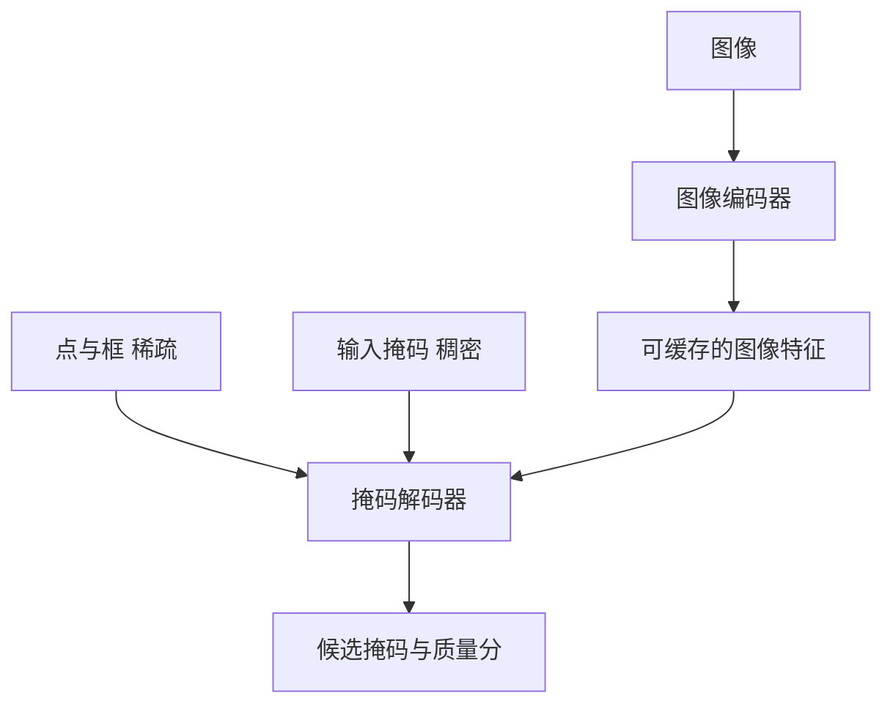

# 视觉分割与SAM

一句话:SAM 做的事,是把"分割"从 **"把图里所有的猫都圈出来"** 改成 **"你指哪,我切哪"** ——任务定义一变,标注、歧义、零样本这三件老大难就全换了打法;而它能做到点一下就出结果,靠的是把一个很重的编码器和一个极轻的解码器拆开,重的那个一张图只跑一次。

本篇讲分割任务本身、SAM 的三段结构与歧义处理、数据引擎,以及它的能力边界。ViT、patch embedding、MAE / CLIP / DINO 这些骨干的预训练机制见 视觉编码器 篇;输入分辨率怎么定、大图怎么切、视觉 token 预算怎么算见 任意分辨率与高分辨率 篇;灰度与降噪这类像素级前处理见 图像预处理 篇。

> 提醒一个重名:02 章 泛化与正则化 篇里的 SAM 是 Sharpness-Aware Minimization,一种优化方法,和本篇的 Segment Anything Model 毫无关系。

## 一、四种"分割"不是一件事

### 三种传统分割任务

| 任务 | 要输出什么 | 同类的两个物体 | 典型代表 |
|---|---|---|---|
| 语义分割 | 每个像素属于哪个**类别** | 合成一片,不区分 | FCN、DeepLab |
| 实例分割 | 每个**物体**一个掩码 + 类别 | 分成两个实例 | Mask R-CNN |
| 全景分割 | 前景物体按实例分,背景按类别分,**每个像素恰好一个标签** | 前景分开,背景合并 | Panoptic FPN |

三者的共同点很关键:**它们都得先有一个封闭的类别表**。类别表里没有"充电线",模型就永远切不出充电线——想要新类别,就得重新标数据、重新训一个头。

### 可提示分割:把类别表整个拿掉

SAM 换的是任务定义:**给一张图和一个提示(点、框、掩码),返回这个提示所指的那块区域**。注意输出里**没有类别**——它只回答"哪些像素属于你指的那个东西",不回答"那是什么"。

这一刀切下去,三件事同时变了:

- **不需要类别表了**,所以也就没有"这个类别没见过"的问题。用户指哪它切哪,充电线和猫对它没有区别;
- **歧义从 bug 变成了任务的一部分**。传统分割里,一个像素的正确标签是唯一的;而"点在衣领上"本来就可能指衣领、指衬衫、指整个人——**这三个答案都对**,所以模型必须被允许同时给出多个;
- **它变得可以大规模预训练**。因为提示可以从任何一个已有掩码上自动生成(在掩码里随机采个点、取它的外接框),所以标注一旦拿到,训练信号是近乎免费的——这条是第四节那台数据引擎能滚起来的前提。

**"可提示"和"零样本"是同一件事的两面**:预训练任务本身就要求模型对任意提示都给出合理掩码,那么面对新领域的新物体,它只是在做同一件事,而不是在做迁移。

## 二、三段结构:不对称设计买来的是交互实时

### 一次重编码,多次轻解码

整个设计的全部意义在一句话里:**贵的那部分和会反复变的那部分,不在同一条路径上**。

| 组件 | 轻重 | 跑几次 | 输入 → 输出 |
|---|---|---|---|
| 图像编码器 | **重**(ViT,论文给了 ViT-B 91M / ViT-L 308M / ViT-H 636M 三档) | **每张图一次** | 图像 → 一张空间特征图 |
| 提示编码器 | 极轻 | 每个提示一次 | 点/框/掩码 → 提示 token 或稠密特征 |
| 掩码解码器 | 极轻(两个 Transformer 块) | 每个提示一次 | 特征 + 提示 → 多个候选掩码 + 各自的质量分 |

**为什么值得这么拆**:标注员在一张图上会点几十下,如果每一下都要重跑 ViT-H,交互就没法用。拆开之后,图像特征算一次就缓存住,后面每个提示只走那两个轻组件——论文的口径是,**在已有图像特征的前提下,提示编码器加掩码解码器在浏览器里用 CPU 约 50 毫秒跑完**,而且这个 50 毫秒是**先定下的设计约束**,不是事后测出来的结果:先要求"点一下不能有卡顿感",再倒推解码器只能做多重。

这也解释了一个容易问倒人的点:**SAM 的"实时"是解码实时,不是端到端实时**。第一次上传图片时那次重编码照样要等,只是它被摊到了后续几十次交互上。

### 稀疏与稠密:为什么不能共用一种表示

提示分两类,**因为它们携带的信息在几何上根本不是一种东西**:

| 提示 | 类型 | 怎么编码 | 为什么必须这么编 |
|---|---|---|---|
| 点 | 稀疏 | 位置编码 **加上**一个可学习的类型嵌入(前景点 / 背景点各一个) | 它只是几个坐标,信息量极小;而"点在这里,但这里**不是**我要的"必须能表达,所以类型嵌入不能省 |
| 框 | 稀疏 | 左上、右下两个角点各按上面那套编,配各自的角点嵌入 | 框等价于两个有角色区分的点,复用同一套机器即可 |
| 掩码 | **稠密** | 过几层卷积下采样成特征图,**逐元素加到图像特征上** | 它本身就是一张和图同构的图,把它压成几个 token 等于把空间信息扔了 |

一句话记法:**稀疏提示是"几个带标签的坐标",作为 token 进注意力;稠密提示是"一张图",直接和图像特征相加。** 硬要统一,要么把掩码压成 token 而丢掉逐像素的形状,要么把一个点铺成整张图去和特征相加——两边都在做无用功。

关于文本提示要说准:原论文确实把文本列进了稀疏提示,做法是训练时用 CLIP 的**图像**嵌入当提示、推理时换成 CLIP 的**文本**嵌入(靠的是 CLIP 两个模态本来就对齐)。但论文自己把这一节写成 proof-of-concept,**官方实现和 demo 都没有放出文本提示**。所以答"SAM 支持文本提示"是不准确的——准确说法是"论文做了概念验证,公开实现里只有点、框、掩码和点阵"。

### 掩码解码器里发生了什么

两个块,每块做三件事:提示 token 之间的自注意力、**提示 token 与图像特征之间的双向交叉注意力**(既让提示去看图,也让图的特征被提示更新)、然后过 MLP。之后把图像特征上采样,再由一个输出 token 经 MLP 变成一个动态的线性分类器,逐像素点乘得到掩码概率图。

"双向"是这里的重点:单向的话,图像特征就是一份和提示无关的死数据;双向之后,**同一张特征图在不同提示下会被读出不同的东西**,这才是"一次编码、多次复用"能成立的原因。

## 三、歧义:一个点到底指什么

### 三个候选,外加一个质量分

用户点在人的衣领上,合理答案至少三个:衣领、衬衫、整个人。SAM 的处理是**一次输出 3 个掩码,并为每个掩码预测一个 IoU 分数**当置信度。

为什么恰好是 3 个?论文的理由很朴素:**现实中的嵌套关系通常不超过三层**(整体 / 部分 / 子部分),3 个够覆盖绝大多数情况。但**这三个输出不是被硬贴上"整体/部分/子部分"标签的固定层级**——它们只是三个并列候选,谁对谁错由质量分和用户的下一个提示决定。把它们说成固定的三级语义,是这道题最常见的错答。

质量分有两个实打实的用途:**排序**(自动模式下按分数挑一个返回)和**过滤**(第四节全自动阶段靠它剔掉垃圾掩码)。

### 训练时怎么让三个头各司其职

关键机制一句话:**三个候选一起算 loss,但只把最小的那个反传回去。**

因为如果强迫单一输出去拟合一个本身就有多个正确答案的提示,梯度会把它推向几个答案的**平均**——衣领和整个人的平均是一块谁也不是的区域,质量反而更差。只反传最小 loss,等于告诉模型"你只要有一个猜对就行",三个头就会自发分工去覆盖不同的粒度。

掩码本身用 focal 加 dice 的复合损失,IoU 预测头用 MSE 单独监督。

## 四、数据引擎:10 亿掩码是怎么滚出来的

分割掩码在互联网上几乎不存在——**没有现成数据**,是 SAM 必须自己造一台数据引擎的根本原因。三个阶段,模型和数据互相喂:

| 阶段 | 谁在标 | 产出 | 这一阶段解决什么 |
|---|---|---|---|
| ① 辅助手工 | 人点,SAM 实时出掩码,人再修 | 12 万张图、**430 万掩码**;期间模型重训 6 次,编码器从 ViT-B 换到 ViT-H | 冷启动:先让模型能用 |
| ② 半自动 | 先自动标出有把握的,**只让人补漏掉的** | 再加 590 万,累计 **1020 万** | 提**多样性**:强迫标注去覆盖模型还不认识的东西 |
| ③ 全自动 | 32×32 的规则点阵当提示,人不参与 | **11 亿掩码 / 1100 万张图**,即 SA-1B | 提**规模**:平均每张图约 100 个掩码 |

三点值得记住:

- **人的角色是逐阶段后撤的**——从"每个都标"到"只补漏",再到完全退出。这是自举能滚起来的关键;
- **第二阶段的目的不是量而是分布**。第一阶段人总会先标显眼的大物体,不专门推一把,长尾永远进不来。所以这一阶段的单掩码标注时间反而回升到 34 秒左右,因为剩下的都是难标的;
- **最终数据集比当时任何分割数据集的掩码数多约 400 倍**。论文还做过一个消融:只用全自动掩码训练,mIoU 大约只低 0.5,所以默认配置就用了这个更简单的方案。

## 五、零样本的真实含义、边界,以及视频与 3D

### 和 CLIP 的零样本根本不是一回事

这两者常被放在一起说,但它们零样本的**是不同的东西**:

| | SAM | CLIP |
|---|---|---|
| 输入 | 图 + 一个空间提示 | 图 + 一组候选文本 |
| 输出 | **一块像素区域**,没有名字 | **一个类别或相似度**,没有位置 |
| 零样本指什么 | 不必为新类别训练专用分割头 | 不必为新类别训练专用分类头 |
| 它答不了什么 | "这是什么" | "它在哪、边界在哪" |

**SAM 是类别无关的**——它切得出那块充电线,但说不出那是充电线。所以实践里最常见的组合就是拿一个开放词表检测器或 VLM 负责"是什么、大概在哪",再把框喂给 SAM 负责"精确边界在哪";两者是互补件,不是竞品(CLIP 的机制见 视觉编码器 篇)。

### 它做不到什么

"Segment Anything"这个名字容易让人高估它。老实说清楚边界,面试里反而加分:

- **细长与低对比结构**容易断:发丝、电线、栅栏、透明与反光物体;
- **边界本身就模糊时**没有正确答案可言:烟、雾、毛发边缘;
- **需要领域知识才能定义的边界**不行:医学影像里哪算病灶、工业质检里哪算缺陷——这类边界不是视觉显著性决定的,而是专业定义决定的,SAM 没有这个先验;
- **它不给语义**,前面已说;
- **换掉图像编码器不是免费的**:特征图尺寸、解码器接口、速度和迁移精度得一起重估,不能只把骨干一换就当作升级。

### 从图像到视频:新增的是状态

逐帧跑一遍 SAM 再把结果拼起来,是最容易想到也最容易错的做法。**因为逐帧之间没有任何联系**,于是:同一个人在第 5 帧和第 6 帧被切成两个互不相干的掩码(身份不一致);物体被遮挡一下再出现,就成了新物体;掩码边缘逐帧抖动。

所以视频分割必须新增**跨帧的状态**,而这正是 SAM 2 的改动核心——它引入**流式记忆**:把过去帧的特征和已经确定的掩码存进一个记忆库,当前帧在做注意力时去读它,于是"这个东西上一帧在哪、长什么样"变成了可用信息。三件事因此成立:身份跟着记忆走而不是每帧重判;遮挡后能靠记忆重新认出来;提示可以在**任意一帧**给出并沿时间传播。论文口径是,SAM 2 在图像分割上比 SAM **更准且快 6 倍**,视频上达到更好精度所需的交互次数少约 3 倍。

3D 是另一回事:那里缺的不是记忆而是**几何一致性**——同一个物体在多个视角下的掩码必须对应到同一块三维结构上,所以要么引入多视角约束,要么把掩码提升到某种三维表示里去(相关表示见 NeRF 篇)。**不要把视频那套时间记忆直接当成 3D 的解法**,两者缺的东西不一样。

## 六、面试考点串联

| 高频问法 | 本文哪一节 |
| --- | --- |
| SAM 怎么工作?图像编码器、提示编码器、掩码解码器各自的输入输出和协作流程是什么?它为什么能支持交互式和零样本分割? | 一、二(三段结构与成本账);零样本的来源见 四、五 |
| 为什么 SAM 适合先缓存图像 embedding、再交互式输入多个提示? | 二(一次重编码多次轻解码;50 毫秒是设计约束) |
| 点、框和掩码分别怎么编码?为什么不能完全共用一种表示? | 二(稀疏与稠密那张表) |
| 为什么要输出多个掩码?预测的质量分数有什么用? | 三(三个候选 + IoU 头;只反传最小 loss) |
| SAM 和 CLIP 都能零样本迁移,它们的任务和输出有什么根本区别? | 五(对照表:一个给区域没有名字,一个给名字没有位置) |
| 从图像扩展到视频分割,需要新增哪些状态和一致性机制? | 五(逐帧为什么不行;流式记忆;3D 缺的是几何不是记忆) |
| 补充题:可提示分割和语义/实例/全景分割的任务定义差在哪?为什么这个改动能带来零样本能力? | 一 |
| 补充题:SAM 的数据引擎为什么必须分三个阶段?第二阶段如果跳过会缺什么? | 四(人逐阶段后撤;跳过就丢长尾分布) |
| 补充题:说 SAM 是"实时"的,准确吗? | 二(解码实时,不是端到端实时) |
| 补充题:SAM 支持文本提示吗? | 二(论文里是 proof-of-concept,公开实现没放出来) |
| 补充题:什么场景下 SAM 会明显退化?为什么医学影像不能直接拿它用? | 五(边界由专业定义而非视觉显著性决定) |

阅读顺序建议:视觉编码器(骨干怎么来的)→ 本篇(怎么用提示切出区域)→ VLM结构(视觉特征怎么接进语言模型)。

## 相关文献

- Segment Anything(SAM,SA-1B 与数据引擎)— [arXiv:2304.02643](https://arxiv.org/abs/2304.02643)
- SAM 2: Segment Anything in Images and Videos(流式记忆与视频扩展)— [arXiv:2408.00714](https://arxiv.org/abs/2408.00714)
- Panoptic Segmentation(全景分割的任务定义出处)— [arXiv:1801.00868](https://arxiv.org/abs/1801.00868)
- Masked Autoencoders Are Scalable Vision Learners(MAE,SAM 图像编码器的预训练方式)— [arXiv:2111.06377](https://arxiv.org/abs/2111.06377)
- Learning Transferable Visual Models From Natural Language Supervision(CLIP,文本提示那条路与零样本对照)— [arXiv:2103.00020](https://arxiv.org/abs/2103.00020)
