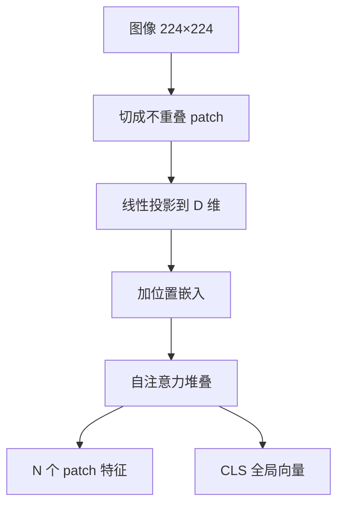

# 视觉编码器

一句话:视觉编码器是多模态模型的**眼睛**,把一张图变成一串带语义的向量——**它没编出来的信息,后面的连接器和语言模型谁也补不回来**。本篇讲这些特征是怎么产生的;特征交出去之后怎么接进 LLM 见 VLM结构 篇,大图怎么切、怎么支持任意分辨率见 任意分辨率与高分辨率 篇。

## 一、ViT:图像怎么变成一串 token

### patch embedding:切块,加一次线性变换

Transformer 只吃序列,图像却是二维网格,所以第一步是**切块**。ViT 把图切成边长 $P$ 的不重叠方块,每块拉平成长度 $3P^2$ 的向量,再过**同一个**线性层映射到模型维度。token 数是:

$$
N = \frac{H \times W}{P^2}
$$

意思是 token 数等于图像面积除以 patch 面积。这个式子后面要反复用:224px 配 patch 16 是 $14\times14=196$ 个 token,配 patch 14 是 $16\times16=256$ 个;分辨率提到 336px、patch 仍是 14,就变成 $24\times24=576$ 个。**边长翻倍,token 数变四倍**,这是后面所有分辨率成本讨论的源头。

实现上不用真的"切了再拉平":一个 kernel 与 stride 都等于 $P$ 的卷积效果完全一样——每次只看一个不重叠小块、权重全图共享。所以 patch embedding 常被叫做"一层步长很大的卷积"。

```python
# patch embedding 的等价写法:kernel = stride = patch,天然不重叠
proj = nn.Conv2d(3, D, kernel_size=P, stride=P)   # 3 通道 → D 维
x = proj(img)                       # (B, D, H/P, W/P):每个位置就是一个 patch
x = x.flatten(2).transpose(1, 2)    # (B, N, D):压成序列交给 Transformer
```



### 位置编码:不加就是一袋无序色块

自注意力对输入顺序是置换不变的——把 token 顺序打乱,每个 token 算出来的结果一模一样。所以**位置信息必须显式加进去**,否则模型看到的只是一袋没有左右上下的色块(注意力本身的机制见 注意力基础 篇)。ViT 用的是**可学习的一维位置嵌入**:给每个位置配一个同维向量,直接加到 patch 特征上。

一维听着别扭(图明明是二维),但 ViT 论文试过二维版本,差别很小——位置嵌入是学出来的,模型自己能从一维序号里恢复行列关系。真正的麻烦在别处:位置嵌入的**条数和 token 数绑死**,换分辨率就对不上,只能对这张表做二维插值(具体做法见 任意分辨率与高分辨率 篇)。

### CLS token 与池化:几百个向量怎么变成一个

编码器出来是 $N$ 个 patch 向量,分类和检索却只要一个向量,得聚合:

| 聚合方式 | 怎么做 | 代价与用处 |
|---|---|---|
| CLS token | 序列头部加一个可学习的额外 token,只取它的输出 | 它靠注意力自己去"问"各个 patch;多算 1 个 token,成本几乎不涨 |
| 平均池化 | 把 $N$ 个 patch 向量取平均 | 不用额外 token,但每块权重相同,小目标会被大片背景稀释 |
| 注意力池化 | 一个 query 通过 cross-attention 加权求和 | 权重按内容自适应,多一层参数 |

第三行不是纸上方案:CLIP 的 ResNet 版本就把全局平均池化换成了单层 QKV 注意力池化(query 由平均池化后的特征给出),SigLIP 2 干脆不设 CLS token,用一个可学习探针做多头注意力池化。方向一致——**把"固定权重求和"换成"按内容决定权重"**。

这里有一个必须分清的点:**做 VLM 的时候通常一个都不用**。分类要一个全局向量,语言模型要的却是空间结构,所以 VLM 一般丢掉 CLS、把 $N$ 个 patch token 原样送下游(送法见 VLM结构 篇)。"CLIP 特征漏掉小物体和空间关系"这句常见批评,批评的其实是**被池化压成一个向量的那种用法**,不是 patch 特征本身。

### patch size 决定特征粒度

- **patch 越小,token 越多、粒度越细**,小字和细纹理才有机会各占一个 token;代价是序列变长,注意力开销按 $N^2$ 涨。
- **patch 越大越省**,但一个 patch 内部的细节在进 Transformer 之前就已经被那一层线性投影压成了一个向量,**这一步丢掉的东西后面任何模块都补不回来**。

所以"提分辨率"和"减 patch size"本质是同一件事(都在把 $N$ 变大),而"看不清小字"要么加分辨率、要么减 patch,**换更强的连接器没用**。

## 二、归纳偏置与数据量门槛

CNN 自带两条结构先验:**局部性**(一个像素先和邻居发生关系)和**平移等变**(同一个核在所有位置共享,物体挪个位置特征跟着挪)。这是人替模型写死的"图像该怎么看"(算子层面的性质见 卷积与池化 篇)。

ViT 把它们几乎全拆了:除了 patch 内那一次线性投影,任何两个 patch 从第一层起就是全连接的,没人告诉它相邻 patch 更相关。ViT 论文的说法是,Transformer 缺少 CNN 固有的那些归纳偏置(如平移等变与局部性),**数据量不够时泛化不好**。

论文比较了三档预训练规模,这张表是本节的核心:

| 预训练数据 | 规模 | 结论 |
|---|---|---|
| ImageNet-1k | 约 130 万张 | ViT **不如**同等规模的 BiT ResNet |
| ImageNet-21k | 约 1400 万张 | 两者大致打平 |
| JFT-300M | 约 3.03 亿张 | ViT 反超;ViT-H/14 迁移到 ImageNet 达 88.55% top-1 |

论文自己的总结是**大规模训练胜过归纳偏置**。道理不难:先验在数据少时替你把答案猜对了,数据多到一定程度它反而成了天花板——模型本可以从数据里学到更好的规则。

但别把门槛记成"ViT 必须要三亿张图"。DeiT 只用 ImageNet-1k,靠强增强加一个蒸馏 token,86M 参数做到 83.1% top-1,单机三天以内训完。**门槛卡的是监督信号总量,不只是图片张数**;换更强的增强、蒸馏或自监督目标,都能把门槛往下压。

## 三、CLIP:拿"图文配不配对"当监督信号

### 训练目标

CLIP 换掉的是**监督形式**:从"这张图属于 1000 类里的哪一类"换成"这张图和这段文字是不是一对"。图像塔和文本塔各自独立编码,投影到同一维度并做 L2 归一化,**两塔在编码过程中不发生任何交互,只在损失函数里见面**。

一个 batch 有 $N$ 对图文,就得到一个 $N\times N$ 相似度矩阵,对角线是正例,其余格子是负例。损失是两个方向交叉熵的平均:

$$
\mathcal{L}=\tfrac{1}{2}\Big[\mathrm{CE}(S,\ \mathrm{diag})+\mathrm{CE}(S^{\top},\ \mathrm{diag})\Big],\qquad S_{ij}=\frac{v_i^{\top}t_j}{\tau}
$$

意思是:第一项要求每张图在这批文字里挑出自己的说明("图找文"),第二项要求每段文字挑出自己的图("文找图"),两个方向都要算,因为检索两头都会用到(温度、负样本与 InfoNCE 的机制见 对比学习 篇)。

数据侧的关键数字:**4 亿对**互联网图文,batch size 32768。batch 大在这里不是调参,是**监督信号本身**——批内其他样本就是负例,batch 翻倍等于每张图要在更多干扰项里认出自己那句话,题变难、信号变密。批内负例还极省:一次前向拿到 $2N$ 个编码,却造出 $N^2$ 个监督格子,不用额外跑负样本。代价有两个:显存(那个 $N\times N$ 矩阵要跨卡拼出来),以及**假负例**——32768 张图里"一只狗在草地上"很可能不止一张,它们被当负例硬推开,这份监督是错的。CLIP 的做法是不处理,靠规模摊薄;真要处理就是难负例与去偏那一套(见 对比学习 篇)。

### zero-shot 分类怎么做

记住它是**把分类改写成检索**,三步:

1. 每个类别名填进模板,例如 `a photo of a {class}`,得到 1000 句话;
2. 文本塔把这 1000 句话编码成 1000 个向量——**这一步和图片无关,离线算一次就能反复用**;
3. 来一张图,图像塔编码成一个向量,和 1000 个文本向量算余弦相似度,取最大的那个类。

所以"零样本"的准确含义是:**没有用目标数据集的类别标注做过任何微调**,不是"这个概念模型从没见过"——4 亿网页图文里大概率早有猫有狗。这个区分在面试里很值钱,答成后者会被追着问。

**prompt 模板为什么影响结果**:因为类别名单独出现时落在文本塔没见过的分布上——训练语料里几乎没有孤零零一个词的"句子",而且 `boxer` 这种词单看有歧义(拳击手还是拳师犬)。模板把它放回自然句子里,还能顺手加领域提示("a satellite photo of a ...")。CLIP 报的量级是:加 `A photo of a {label}.` 这一句模板比裸类别名涨约 1.3 分,再把 80 个不同模板的文本向量集成起来又涨约 3.5 分,**合起来接近 5 分**;最终 ViT-L/14@336px 的 ImageNet 零样本 top-1 是 76.2%,该口径含模板集成。所以报 CLIP 零样本数字时不交代模板,数字是没法复现的。

### 它擅长什么、不擅长什么

| 任务 | 行不行 | 为什么 |
|---|---|---|
| 图文检索 | ✓ | 两塔解耦,几百万张图可以**离线编码进向量库**,线上只算一次文本编码加一次近邻查询 |
| 开放词汇分类 | ✓ | 类别由自然语言给出,加新类只要写一句话,不用重训分类头 |
| 当 VLM 视觉塔 | ✓ | 特征已经和语言语义对齐过,接 LLM 时连接器要跨的距离小得多 |
| 计数、空间关系、属性绑定 | ✗ | 目标只要求"整体像不像",caption 也很少写"三只""在左边";这些信息不进梯度,自然学不到 |
| 小字与密集文本 | ✗ | 224/336px 下一行小字只占一两个 patch,再被池化成一个全局向量 |
| 生成回答 | ✗ | 输出端没有解码器,训练时也没有逐 token 预测的目标 |

**细粒度不够怎么办**,三条按代价从低到高:改用 patch 级 token 而不是池化后的全局向量;把"编码完才见面"换成**后交互**(FILIP 那样让图像 patch 与文本 token 逐对算相似度再聚合),既补细粒度又保住可预计算性;实在不够就换有跨模态注意力的模型,代价是候选不能预计算,检索开销从"一次近邻查询"变成"每个候选过一遍模型"。

CLIP 向量拿去做多模态检索时,编码器侧还有两条硬性质要交代:一是**图文向量并不混在一处**,它们在共享空间里各占一个窄锥,image-image 和 image-text 的相似度不在同一量程,所以别用同一个阈值卡两种检索;二是领域偏移会直接打穿零样本,垂类上必须先建真实图文验证集再谈调优。至于怎么建库、选 ANN、做检索评测,那是 Embedding 篇的事。

> 🖼️ 占位:CLIP 零样本分类三步示意——类别名填模板、文本塔离线编码成向量表、图像向量与向量表算余弦取最大

## 四、SigLIP:全局 softmax 换成逐对 sigmoid

CLIP 的损失有个隐藏耦合:softmax 要在**整行**上归一化,算任何一个格子都得先知道这一行全部 $N$ 个相似度。分布式训练时这意味着每张卡都要 all-gather 全量特征、把 $N\times N$ 矩阵物化出来——**batch size 直接被显存卡住**。

SigLIP 的改动一句话说完:**每一对图文各自做一次二分类**,配对标签为 1、不配对为 0,用 sigmoid 而不是 softmax。

$$
\mathcal{L}=-\frac{1}{N}\sum_{i}\sum_{j}\log \sigma\Big(z_{ij}\big(t\, v_i^{\top}u_j + b\big)\Big), \qquad z_{ij}=+1 \ (i=j),\quad z_{ij}=-1 \ (i\neq j)
$$

意思是:每个格子独立贡献一份二元交叉熵,正例把 $\sigma$ 推向 1、负例推向 0,**分母里再没有别的格子**。$t$ 是可学习温度,$b$ 是可学习偏置。

省下来的是这些:

- **显存从全局 batch 的平方降成单卡 batch 的平方**。因为损失可以分块累加,论文的分块实现让特征在设备间**环状传递**,每一步只物化一个小方块,完全不需要 all-gather。
- **通信形态也变好**。all-gather 是"所有卡等所有卡",256 卡时每张卡要等另外 255 张;环状传递每步只和邻居换一次。
- **小 batch 反而更强**。论文结论是 sigmoid 在小 batch 上显著优于 softmax、大 batch 上打平;他们把 batch 一路推到 100 万,发现**两种损失的收益都在 32k 附近饱和**——"batch 越大越好"到此为止。成本参照:SigLiT 用 4 块 TPUv4 训两天做到 84.5% 的 ImageNet 零样本准确率(该配置锁住了预训练图像塔,不是从零训,比较时要对齐口径)。

一个必记的实现细节:**逐对 sigmoid 会把正负失衡直接暴露出来**。一行 $N$ 个格子只有 1 个正例、$N-1$ 个负例;softmax 天然归一化,感觉不到,而 sigmoid 一上来就被负例主导,前期梯度全花在"把所有分数往下压"。SigLIP 的解法是给 logits 加**一个可学习偏置,初始化成 -10**(温度初始化成 $\log 10$),让模型起点就默认"大部分是负例",省掉那段无谓的优化。论文还做了消融:人为掩掉负例,把正负比从约 1:16000 一路调到接近 1:1.6,结论是**失衡本身并不有害**,有害的只是初始化没对齐。

## 五、不看文字的另一条路:MAE 与 DINO

CLIP/SigLIP 的监督来自图文配对,好处是特征天然带语言语义,坏处是必须有海量 caption,而且 caption 里没写的东西就学不到。纯视觉自监督不要文字,两条主流路线的分歧在于监督信号是**重建像素**,还是**和自己的另一个视图对上**。

**MAE 走重建**:随机遮掉 75% 的 patch,编码器**只处理剩下那 25% 的可见 patch**(mask token 根本不进编码器),再由一个轻量解码器(默认 8 层、512 维,每 token 的 FLOPs 不到 ViT-L 的 10%)补齐位置、回归被遮住的像素。两个常被追问的点:

- **为什么图像要遮掉 75%,而 BERT 只遮 15% 这么少**?因为图像**空间冗余极高**——一个缺口看邻居就能补出来,不需要任何高层理解。遮得少这题就退化成插值;遮到 75% 才逼模型去理解整体。
- **省在哪里**?编码器的序列只剩四分之一,预训练时间降到三分之一甚至更低。省出来的算力换成了规模:ViT-Huge **只用 ImageNet-1k** 就做到 87.8% top-1。

**DINO 走自蒸馏**:学生和教师同架构、不同参数,教师是学生权重的指数滑动平均(动量按余弦从 0.996 升到 1),学生去匹配教师输出的概率分布。两条关键设计:

- **多裁剪**:两个 224px 全局视图加若干 96px 局部视图,**教师只看全局,学生看全部**,于是学生被逼着从局部推断全局,学到的是"这一小块属于哪个东西"。
- **怎么不塌缩**:两个方向相反的力必须配对使用——**centering**(减去教师输出的滑动均值)防止某一维通吃,但它本身会把分布推向均匀;**sharpening**(教师用更低的温度)防止均匀,但它本身会推向单点通吃。两个一起用才稳(不用负样本还能不塌的其他做法见 对比学习 篇)。

DINO 最出名的是那个**涌现性质**:自监督 ViT 的注意力图里直接能读出物体轮廓,而**同样架构的监督式 ViT 就没这么清晰**——论文按注意力图取阈值做分割,DINO 的 Jaccard 相似度接近监督式的两倍。这条支撑了 DINOv2 那类"不靠文字也能出通用视觉特征"的路线,它在分割、深度这类稠密任务上通常强于 CLIP 特征。

三条路线的分工,记这一张就够:

| 监督信号 | 代表 | 特征性质 | 什么时候选它 |
|---|---|---|---|
| 图文配对 | CLIP / SigLIP | 与语言语义对齐,全局判别性强 | 检索、开放词汇分类、当 VLM 视觉塔 |
| 掩码重建 | MAE | 局部结构与几何保留得多,线性可分性弱 | 检测、分割这类还要微调的稠密任务 |
| 自蒸馏 | DINO / DINOv2 | 不靠文字也有强语义,注意力自带分割 | 没有 caption 的领域;稠密预测;冻结特征直接用 |

一句话记法:**重建目标信号密集、不用设计负例,却保留了大量下游用不上的细节;对比目标直接优化相似度结构,却全押在配对怎么造上**。

## 六、骨干横向选型

| 骨干 | 结构核心 | 特征层级 | 强在哪 | 要注意什么 |
|---|---|---|---|---|
| ResNet | 3×3 卷积 + 残差 + 分层下采样 | 天然多尺度 | 算子支持最成熟,小数据也稳 | 全局关系只能靠堆深度慢慢建立 |
| EfficientNet | MBConv,深度/宽度/分辨率复合缩放 | 多尺度 | 同 FLOPs 预算下精度好看 | 低 FLOPs 不等于低延迟,见下 |
| ConvNeXt | 纯卷积,7×7 深度可分 + LayerNorm | 多尺度 | 保留卷积部署路径,精度对标 Swin | 优势随任务与实现变化,不是固定增量 |
| Swin | 窗口注意力 + 移位窗口 + patch merging | 分层 | 高分辨率成本可控,检测分割强 | 窗口划分与内存布局影响实测吞吐 |
| ViT | 全局自注意力,单一尺度 | 无层级 | 结构统一,最适合大规模预训练与图文对齐 | 注意力随 token 数近似平方增长;稠密任务要额外设计 |

**Swin 为什么非要移位窗口**:把注意力限制在不重叠小窗口里,成本从"全图 token 数的平方"降成"窗口内 token 数的平方乘窗口个数",对图像尺寸近似线性。但**只有不重叠窗口,信息永远出不了窗口边界**——窗口 A 和窗口 B 的像素在任何一层都不会互相看见,堆多少层都一样,等于把网络切成了互不通气的格子。移位窗口就是在相邻两层之间把窗口划分整体挪半格,让上一层的边界落进这一层的窗口内部,信息逐层扩散出去。它另外用 patch merging 做下采样(每级把 2×2 邻域合成一个 token),这才有了检测分割需要的多尺度特征。注意"线性"只对注意力那部分成立,不是整网所有计算都只剩线性项;ImageNet-1k 上 Swin 报到 87.3 top-1,COCO 58.7 box AP,ADE20K 53.5 mIoU。

**ConvNeXt 从 Transformer 那边搬了什么**:它的价值在于把"ViT 到底赢在哪"拆开验证。论文按顺序改造 ResNet-50 并逐步报数——只换现代训练配方(AdamW、300 epoch、强增强、随机深度)就从 76.1% 抬到 78.8%;之后依次是阶段计算比例改成 3:3:9:3(79.4%)、4×4 步长 4 的 patchify stem(79.5%)、深度可分卷积(80.5%)、倒置瓶颈(80.6%)、7×7 大核(80.6%)、减少激活函数(81.3%)、减少归一化层(81.4%)、BatchNorm 换 LayerNorm(81.5%)、独立下采样层(82.0%)。最终 ConvNeXt-T 82.1%,Swin-T 81.3%。**结论不是"卷积赢了",而是那几个百分点里训练配方占了一大半**——拿旧配方训的 ResNet 去比新模型,本来就是不公平的对照。

**低 FLOPs 为什么可能不快**:FLOPs 只数乘加,不数**访存**。深度可分卷积、SE 这类算子算术强度很低,时间花在搬数据上,计算单元一直在等显存(为什么绝大多数算子是访存受限的,见 GPU架构与执行模型 篇)。此外还有三层落差:厂商有没有优化好的实现、能不能和邻居算子融合、端侧 NPU 支不支持(不支持就回退 CPU,延迟塌方)。所以选型要在**目标设备上实测**这几项:预处理加视觉塔加连接器的端到端延迟、峰值内存、量化后精度、算子覆盖率、以及目标分辨率下的吞吐,而不是比论文里的 FLOPs 表。

**换骨干为什么要重新对齐**:因为下游拿到的东西全变了——特征维度变了,token 数与排布变了(ViT 是单尺度栅格,Swin 是多尺度金字塔),数值分布变了,连"这一维代表什么"的坐标系都是各自训练时随机定下的。连接器是照着旧编码器的输出分布学出来的一个映射,输入分布一换它就失配,必须重训;只换骨干不重训连接器,语言侧掉点是必然的(连接器怎么设计见 VLM结构 篇)。另外一定要问一句**新骨干做没做过图文对齐预训练**:纯 ImageNet 监督的骨干接 LLM,对齐阶段要补的数据量明显更大,这也是 VLM 视觉塔长期偏爱 CLIP 系与 SigLIP 系的原因。

## 七、面试考点串联

| 高频问法 | 本文哪一节 |
| --- | --- |
| CLIP 怎么用双编码器和对比学习把图文对齐?训练目标是什么,为什么它常被当作多模态系统的基础组件? | 三 |
| 批内负样本有什么好处?假负例会造成什么问题? | 三(训练目标;负样本工程见 对比学习 篇) |
| CLIP 为什么能做零样本分类?prompt 模板为什么会影响结果? | 三(zero-shot) |
| 细粒度图文匹配时全局向量不够用,应该怎么改? | 三(擅长与不擅长) |
| CLIP 和生成式 VLM 的能力边界分别在哪? | 三(能力表);怎么接进 LLM 见 VLM结构 篇 |
| CLIP 向量怎样接入多模态 RAG? | 三(末段:可预计算、模态间隔、领域偏移);建库与检索评测见 Embedding 篇 |
| 除了 ViT 常见的视觉骨干还有哪些?结构、计算特点和适用任务怎么比? | 六(选型表) |
| Swin 为什么需要移位窗口?只用不重叠窗口会有什么问题? | 六 |
| 低 FLOPs 为什么可能在真实设备上并不快? | 六 |
| ConvNeXt 从现代 Transformer 的训练和结构里吸收了哪些设计? | 六(改造清单) |
| 端侧多模态模型选骨干时该测哪些端到端指标? | 六(低 FLOPs 段末) |
| 换了视觉骨干之后,连接器和语言模型为什么可能要重新对齐? | 六(末段) |
| ViT 这类模型怎么完成下采样或聚合? | 一(CLS 与池化)、六(Swin 的 patch merging);池化算子本身见 卷积与池化 篇 |
| 对比学习和生成式自监督(MAE、掩码建模)各自的优劣是什么? | 五(三条路线分工表) |
| 补充题:patch embedding 到底做了什么?为什么说它就是一次步长很大的卷积? | 一 |
| 补充题:位置编码不加会怎样?ViT 用一维位置嵌入不别扭吗? | 一 |
| 补充题:做 VLM 的时候该用 CLS 还是全部 patch token?为什么? | 一(CLS 与池化) |
| 补充题:patch size 砍掉一半会发生什么?看不清小字该先动哪个参数? | 一(特征粒度) |
| 补充题:ViT 缺了 CNN 的哪些归纳偏置?数据少的时候会怎样? | 二 |
| 补充题:SigLIP 把 softmax 换成 sigmoid,到底解决了什么问题? | 四 |
| 补充题:SigLIP 的偏置项为什么要初始化成 -10?不加会怎样? | 四(末段) |
| 补充题:MAE 为什么遮掉 75%,而 BERT 只遮 15%? | 五 |
| 补充题:DINO 不用负样本,靠什么防止塌缩? | 五 |
| 补充题:视觉塔选 CLIP 还是 DINOv2,判据是什么? | 五(分工表) |

阅读顺序建议:本篇(眼睛怎么来的)→ VLM结构(特征怎么接进 LLM)→ 任意分辨率与高分辨率(怎么喂得更清楚)。

## 相关文献

- An Image is Worth 16x16 Words: Transformers for Image Recognition at Scale(ViT)— [arXiv:2010.11929](https://arxiv.org/abs/2010.11929)
- Training data-efficient image transformers & distillation through attention(DeiT)— [arXiv:2012.12877](https://arxiv.org/abs/2012.12877)
- Scaling Vision Transformers(ViT-G/14,ImageNet 90.45%)— [arXiv:2106.04560](https://arxiv.org/abs/2106.04560)
- Learning Transferable Visual Models From Natural Language Supervision(CLIP)— [arXiv:2103.00020](https://arxiv.org/abs/2103.00020)
- Sigmoid Loss for Language Image Pre-Training(SigLIP)— [arXiv:2303.15343](https://arxiv.org/abs/2303.15343)
- SigLIP 2: Multilingual Vision-Language Encoders with Improved Semantic Understanding, Localization, and Dense Features — [arXiv:2502.14786](https://arxiv.org/abs/2502.14786)
- Mind the Gap: Understanding the Modality Gap in Multi-modal Contrastive Representation Learning — [arXiv:2203.02053](https://arxiv.org/abs/2203.02053)
- Masked Autoencoders Are Scalable Vision Learners(MAE)— [arXiv:2111.06377](https://arxiv.org/abs/2111.06377)
- Emerging Properties in Self-Supervised Vision Transformers(DINO)— [arXiv:2104.14294](https://arxiv.org/abs/2104.14294)
- DINOv2: Learning Robust Visual Features without Supervision — [arXiv:2304.07193](https://arxiv.org/abs/2304.07193)
- Deep Residual Learning for Image Recognition(ResNet)— [arXiv:1512.03385](https://arxiv.org/abs/1512.03385)
- EfficientNet: Rethinking Model Scaling for Convolutional Neural Networks — [arXiv:1905.11946](https://arxiv.org/abs/1905.11946)
- Swin Transformer: Hierarchical Vision Transformer using Shifted Windows — [arXiv:2103.14030](https://arxiv.org/abs/2103.14030)
- A ConvNet for the 2020s(ConvNeXt)— [arXiv:2201.03545](https://arxiv.org/abs/2201.03545)
- FILIP: Fine-grained Interactive Language-Image Pre-Training — [arXiv:2111.07783](https://arxiv.org/abs/2111.07783)
