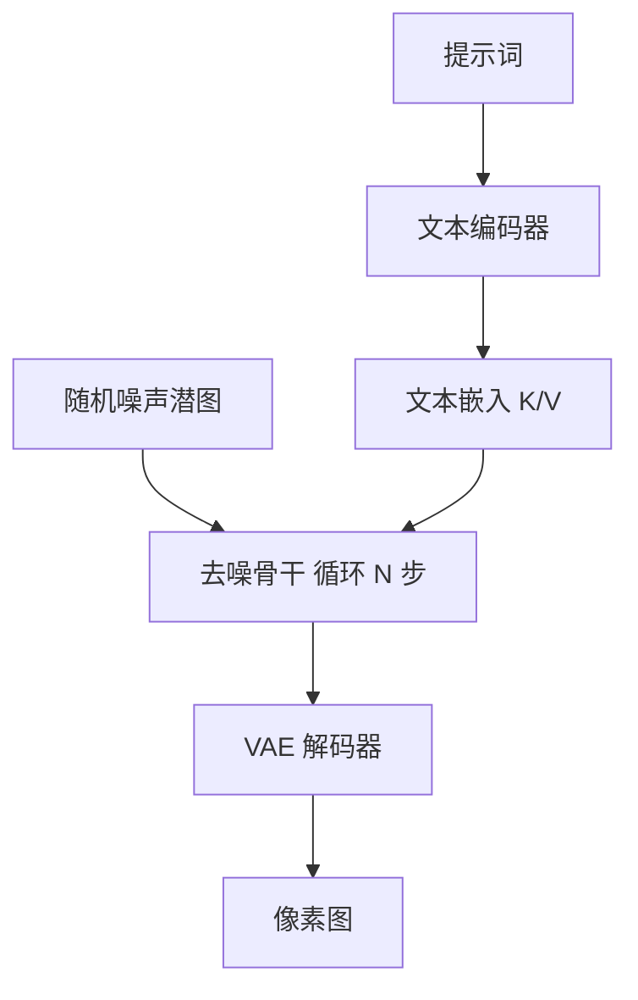

# SD架构

一句话:Stable Diffusion 是**把「文本编码器 + 去噪骨干 + VAE 编解码」三个网络装成一条产品级文生图流水线**的那套工程方案——本篇不讲扩散原理,只讲这三个零件怎么接线、一次出图的算力和显存花在哪、以及 SD 1.x → SDXL → SD3 三代之间到底改了哪几处结构。

零件本身的机制都在别篇:加噪去噪、采样器与 CFG 见 Diffusion 篇,潜空间压缩与重建上限见 VAE 篇,Transformer 骨干与 adaLN 见 DiT 篇,整流流训练目标见 FlowMatching 篇。

## 一、三大件:各管一段,谁都不能少

一次文生图要同时解决三件不相干的事——**读懂人话、在小图上构图、把小图放大成像素**。SD 的做法是一件事配一个网络,各自独立训练、独立替换。

| 部件 | 干什么 | 在推理里跑几次 | 换掉它会怎样 |
|---|---|---|---|
| 文本编码器 | 把提示词变成一串向量,供骨干查阅 | **1 次**(整个生成过程只编码一次) | 直接决定「听不听得懂话」,见第四节 |
| 去噪骨干(U-Net / DiT) | 在潜图上反复擦噪声,决定构图与内容 | **N 步 × 2(开 CFG)** | 决定画面质量与风格,是算力大头 |
| VAE 编解码器 | 像素图 ↔ 潜图之间的翻译 | 解码 1 次(img2img 时还要编码 1 次) | 锁死画质天花板,潜空间一换旧骨干全废 |

三条接线里有两条要说清楚:

- **文本嵌入只算一次,却被反复消费**。它作为 cross-attention 的 K/V 挂在骨干的多个分辨率级上,每一步、每一层都去读同一份嵌入。所以「文本编码贵不贵」这个问题在文生图里几乎不成立——贵的是它被查了多少次,不是它自己算了多久。
- **VAE 编码器在纯文生图里根本不出现**。它只在训练期(造潜图监督)和 img2img / inpainting(把用户给的图搬进潜空间)时才跑。这是很多人会答错的一处。

SD 1.x 这代的具体尺寸:VAE 下采样 8 倍、4 个潜通道,$512\times512\times3$ 的像素图压成 $64\times64\times4$ 的潜图;文本编码器是 CLIP ViT-L/14 的文本塔,输出 77 个 768 维向量;去噪骨干是约 8.6 亿参数的 U-Net。

## 二、开销账本:算力和显存分别花在哪

### 算力:去噪循环吃掉几乎全部

以 SD 1.5、512×512、30 步、CFG 打开为例,数一数网络前向次数:

$$
\text{总前向次数} = \underbrace{1}_{\text{文本编码}} + \underbrace{30 \times 2}_{\text{去噪 × CFG 两支}} + \underbrace{1}_{\text{VAE 解码}} = 62
$$

这行的意思是:60 次去噪前向摊在一张 $64\times64$ 的小潜图上,另外两次分别是一个 77 token 的小 Transformer 和一次全分辨率解码。

这三项的量级差得很远,记住这个排序就够了:**文本编码通常在总时延的百分之一以下;去噪循环占绝大部分;VAE 解码在 512 上是个位数百分比,到 1024 会明显变重**(量级判断,具体比例随硬件、实现和步数变化,验收要自己测)。推论很实用——**优化文生图时延基本等于优化「步数 × 每步开销」这两个因子**,别在文本编码上做文章。具体的加速手段与各自的代价见 Diffusion 篇。

### 显存:权重是底,峰值在解码

fp16 权重的账(按参数量估算,1 个参数 2 字节):

| 部件 | SD 1.5 | SDXL | SD3 Medium |
|---|---|---|---|
| 文本编码器 | CLIP ViT-L,约 1.2 亿 | CLIP ViT-L + OpenCLIP bigG,合计约 8 亿 | 上面两个 + T5-XXL 编码器 4.7B |
| 去噪骨干 | U-Net 8.6 亿 | U-Net 2.6B | MMDiT 2B(论文最大训到 8B) |
| VAE | $f=8$、4 通道,不到 1 亿 | $f=8$、4 通道 | $f=8$、**16 通道** |
| fp16 权重合计 | 约 2 GB | 约 7 GB | 约 15 GB;丢掉 T5 后约 6 GB |

但**显存峰值往往不在骨干,而在最后那次 VAE 解码**。原因很直白:去噪全程在 $128\times128$ 的潜图上跑(SDXL 的 1024 档),而解码器要一路上采样到 $1024\times1024\times3$,中间几层的激活是全分辨率、几十上百通道的张量,一张就能顶掉几个 GB。标准修法是**分块解码**(tiled VAE decode):把潜图切成带重叠的小块逐块解码再拼接,用少量重复计算换掉这个尖峰,代价是块边界可能出现轻微接缝。

另外两条常用的显存手段:**把文本编码器编完就搬到 CPU**(它整个循环里再也用不到),以及顺序加载 refiner 而不是常驻(第三节)。

## 三、代际演进:三代各改了哪几处

先看总表,再逐代说为什么。

| 维度 | SD 1.x | SDXL | SD3 |
|---|---|---|---|
| 原生分辨率 | 512×512 | 1024×1024 | 1024×1024 |
| 去噪骨干 | U-Net,8.6 亿 | U-Net,2.6B(论文称约 3 倍) | MMDiT(双流 Transformer) |
| 文本条件 | CLIP ViT-L 单塔,768 维 | CLIP ViT-L + OpenCLIP bigG,拼成 2048 维 | 上述两塔 + T5-XXL,三路 |
| 全局条件 | 只有时间步 | 时间步 + pooled 文本 + 尺寸 + 裁剪坐标 | 时间步 + pooled 文本 |
| 潜空间 | $f=8$,4 通道 | $f=8$,4 通道 | $f=8$,16 通道 |
| 训练目标 | $\epsilon$-prediction | $\epsilon$-prediction | 整流流(见 FlowMatching 篇) |
| 出图流程 | 单模型 | base + refiner 两段 | 单模型 |

### SDXL:骨干变大只是表象,三个条件改动才是关键

**改动一:第二个文本编码器。** SDXL 同时跑 CLIP ViT-L(768 维)和 OpenCLIP ViT-bigG(1280 维)两个文本塔,把两者的逐 token 输出**沿通道维拼接**成 2048 维送进 cross-attention。论文摘要把参数量增长归因于两件事:更多注意力块,和更大的 cross-attention 上下文维度——**后者正是第二个编码器带来的**。为什么加而不是换:两个塔的训练数据和目标不同,拼起来相当于给骨干两份互补的语义视角,比单纯把一个塔放大更省事。

**改动二:尺寸与裁剪的微条件。** 这是 SDXL 最有面试价值的一处,因为它修的是两个具体的数据病。

- **原图尺寸条件**:高分辨率训练图本来就稀缺。按分辨率门槛硬丢小图,数据量掉一大截;直接把小图放大混进去,模型会学成「模糊是正常的」。SDXL 的解法是把**这张图被 resize 之前的原始宽高**当条件喂进去——模型于是知道「这张糊是因为它本来就小」,推理时你填一个大尺寸,它就往清晰那边生成。
- **裁剪坐标条件**:训练用随机裁剪,数据里于是有大量主体被切掉一角的样本,典型症状是生成的人物没有头顶。把**裁剪框的左上角坐标**也当条件喂进去,模型学会「这张构图偏是因为它被从 $(x,y)$ 处裁过」;推理时填 $(0,0)$,就得到没被裁过的居中构图。

两者都先做傅里叶特征编码,再**加到时间步嵌入上**——也就是说它们走的是全局调制那条通路,不占序列长度、几乎不加算力(那条通路的机制见 DiT 篇)。这一招的通用形态值得记住:**能压成几个标量的条件,一律走时间步那条路,别去挤 cross-attention**。

**改动三:refiner 两阶段。** refiner 是一个**独立的 LDM**,和 base 共享同一个 VAE 潜空间,但只用高质量高分辨率数据训、且只在靠近数据端的低噪声档位上专门训练。base 出潜图之后,refiner 用 SDEdit 式的「先加一点噪声、再去噪」接手一小段,最后才解码。分工是清楚的:base 管构图和语义,refiner 只管纹理和细节。

代价也清楚:显存里要多放一个骨干(或者换进换出),推理多一段步数,而且两个模型的提示词口径必须一致。**时效说明:截至 2026 年 9 月,SDXL 之后的 SD3、Flux 这一代都没有再走 refiner 路线**,改成单模型直接出 1024——多一个模型带来的工程复杂度,不如把这份算力直接给主干。

顺带一条结构细节:SDXL 把最高分辨率那一级的 Transformer 块整个去掉了,把注意力算力挪到更低的分辨率级上。因为注意力是位置数的平方复杂度,在最细的那一级上最贵,而那一级主要干的是纹理活,不太需要全局交互。

### SD3:双流注意力 + 三编码器 + 更厚的潜空间

**MMDiT 的「双流」是什么意思:** 图像 token 和文本 token 各自带**一套独立的 QKV 投影和 FFN 权重**,但拼成一条序列做**同一次注意力**。为什么这么设计——两个模态的特征分布和数值尺度差很远,共享一套权重等于让同一组参数同时迁就两边;分开给权重让各自保留自己的表示,只在注意力那一步互相看。代价是每个 block 有两套投影,参数量接近翻倍。

和前两代的接线差异一句话说清:**SD 1.x/SDXL 是「文本单向喂给图像」(cross-attention 里文本只当 K/V,自己不被更新),MMDiT 是「双向互看」(文本 token 也参与注意力、也被逐层更新)**。骨干侧的机制与 adaLN 细节见 DiT 篇。

**16 通道潜空间:** SD3 把潜通道数从 4 提到 16,重建质量明显改善(具体的 rFID / PSNR 对照见 VAE 篇)。系统层面的两个后果要记住:空间尺寸没变,所以 **DiT 的序列长度不变**,涨的是每个位置的通道数;而潜空间的定义变了,**SD 1.x/SDXL 的骨干权重全部作废**,换 VAE 必须重训骨干。

## 四、文本编码器:决定「听不听话」的那一件

这是 SD 系列迭代最集中的地方,也是最容易被追问的一环。

### CLIP 文本塔的三个先天限制

1. **上下文只有 77 个 token**(含起止符,实际可用 75)。长提示要么被截断,要么被工具切成多个 77 窗口分别编码、再沿序列维拼起来——后者是社区实现的常规做法,但**窗口之间没有注意力**,跨窗口的修饰关系(「左边那个人穿的红色外套」)会断掉。
2. **训练目标是图文对比**。整段文字被压向一个能和整张图对齐的全局向量,「谁在谁左边」「有几个」这类组合与计数信息**从来不是它的优化目标**,自然也就学不牢。这是文生图模型数不清数量、搞错空间关系的根源之一。
3. **取哪一层有讲究**。SD 1.x 取最后一层输出,SD 2.x 和 SDXL 改取**倒数第二层**——因为最后一层已经为对比目标做过特化,倒数第二层保留的词级信息更多。社区工具里那个 clip skip 参数调的就是这件事。

### 为什么要把 T5 加进来

Imagen 给过一个很硬的结论:**把语言模型放大,比把扩散模型放大更能同时改善保真度和图文对齐**。T5 是纯文本模型,训练时从没被图文对比目标「压扁」过,对长句、从句、指代和字符串本身的建模都强得多。

SD3 的三路配置于是长这样:

| 来源 | 走哪条通路 | 负责什么 |
|---|---|---|
| 两个 CLIP 塔的 pooled 向量(768 + 1280 拼成 2048) | 全局调制,和时间步加在一起 | 整体风格与语义基调 |
| 两个 CLIP 塔的逐 token 输出 | 沿序列维进 MMDiT 联合注意力 | 词级语义 |
| T5-XXL 编码器的逐 token 输出 | 同上,和 CLIP token 拼接 | 长提示结构、画面内文字 |

**T5 可以在推理时整个丢掉**,这是一个真实存在的部署开关:省掉 4.7B 参数、约 9 GB 显存。丢掉之后画面并不会变丑,损失主要落在**复杂长提示的遵循度和画面内的文字渲染**上(方向性结论,具体幅度随提示词分布变化,上线前要自己测)。这条很值得记——它说明「文本编码器有多大」换来的不是画得好不好看,而是**画得对不对**。

一句实用推论:**模型「画得挺好看但没照做」,先怀疑文本编码器和 CFG 强度,别一上来就换采样器**。

## 五、分辨率、负面提示与两种常见工程形态

### 长宽比分桶:为什么不能只训正方形

训练要求一个 batch 内的张量同形,而真实数据集里长宽比五花八门。两种偷懒做法都有病:直接 resize 成正方形会**拉伸变形**,center crop 会**砍掉主体**(SDXL 的裁剪条件正是在补这个洞)。

分桶(aspect ratio bucketing)的做法是:预先定义一组长宽比不同、**总像素数大致相同**的桶,每张图分到最接近的那个桶,一个 batch 只从同一个桶里取样。SDXL 在 1024 档上用的桶总像素都在 $1024^2$(约 105 万)附近,例如 1024×1024、1152×896、1344×768。

- **收益**:模型真正学会了在非正方形画布上构图,横图不再把主体挤成方的。
- **代价**:桶之间样本数天然不均,要按桶配采样权重;桶切太细会让长尾桶样本不够。推理时给一个**桶外的怪尺寸**,模型没见过对应的构图先验,容易出双主体或构图崩塌——这就是「换个奇怪分辨率就出双头」的直接原因。

### negative prompt:它其实是 CFG 的一个复用

很多人以为负面提示是某种过滤器,其实它只是**把 CFG 里那条无条件支的输入换掉**:

$$
\hat{\epsilon} = \epsilon_\theta(z_t,\ c_{\text{neg}}) + s\left[\epsilon_\theta(z_t,\ c_{\text{pos}}) - \epsilon_\theta(z_t,\ c_{\text{neg}})\right]
$$

读法:原本方括号里是「有条件相对于空条件的偏移」,现在把空条件换成「不想要的描述」,于是外推方向额外**远离**负面提示所在的位置(CFG 本身的机制与代价见 Diffusion 篇)。三条直接推论:

- **不额外增加计算**。那条无条件支本来就要跑,换个输入而已——负面提示是 CFG 已付账单上的免费搭车。
- **CFG scale 设成 1 时它完全失效**。代进上式,$s=1$ 把方括号整个抵消,只剩条件支,负面提示一个字都不起作用。
- **它是「推开」不是「禁止」**。如果正面提示明确要求了某个东西,把它写进负面提示只会让两个方向对着拉,常见结果是画面崩坏而不是干净地去掉。
- 工程细节:两支的序列长度必须一致,所以负面提示同样被补齐或截断到那 77 个 token 的窗口里。

### img2img:strength 到底在调什么

流程是**编码 → 加噪到某一档 → 只跑尾段去噪 → 解码**。用户拧的 strength 决定的是「加噪加到多深」,也就是**从时间表的哪一档开始跑**,于是实际执行的步数是 `strength × 设定步数`——设 50 步、strength 0.6,真跑的只有 30 步。

两端的行为要能当场答出来:**strength 趋近 0** 时几乎不加噪,输出约等于原图过一遍 VAE(还会带上编解码本身的轻微损失);**strength 等于 1** 时噪声加满,原图信息被彻底抹掉,退化成普通文生图。所以它是一根「保留多少原图」的连续旋钮,不是强度百分比。

### inpainting:mask 通道怎么接进网络

两种做法,差别在「模型知不知道有 mask 这回事」。

| 做法 | 怎么实现 | 问题 |
|---|---|---|
| 采样时贴回(不用改模型) | 每一步把已知区域的潜图,用**原图潜图按当前噪声档加噪的结果**覆盖回去 | 模型全程不知道 mask 存在,只在最后被强行改写;边界容易接不上,大面积重绘时新内容和上下文对不齐 |
| 专用 inpainting 模型 | 骨干第一层卷积的输入通道从 4 扩到 **9 = 4(带噪潜图)+ 1(下采样后的 mask)+ 4(被遮挡图像的潜图)** | 要额外训一版权重;和基础模型不通用 |

第二种的接法有个值得记的细节:**新增那 5 个输入通道的卷积权重零初始化**,原有 4 通道权重直接继承,于是训练第一步的行为和原模型完全一致,再由梯度决定怎么用上 mask。这和 DiT 篇里 adaLN-Zero 的零初始化、ControlNet 的零卷积是**同一招**——让新加的输入从「不产生影响」开始,不破坏已经训好的通路。

ControlNet、LoRA、IP-Adapter 这类外挂控制手段见 条件控制 篇;指令式编辑与 inversion 见 图像编辑 篇;tokenizer 的谱系与选型见 图像Tokenizer 篇;CLIP 编码器本身的结构见 视觉编码器 篇。

## 六、面试考点串联

本篇目前没有 `topic` 指向它的题库真题,下表全部是按正文断言补出的问法。

| 高频问法 | 本文哪一节 |
| --- | --- |
| Stable Diffusion 一次文生图,数据从提示词走到图片经过哪些部件?哪一步最贵?(补充题) | 一、二 |
| 一张 1024 的图跑 SDXL,显存峰值出现在哪一步?怎么压下去?(补充题) | 二 |
| SD 1.x 到 SDXL,结构上最关键的改动是哪几处?为什么要这么改?(补充题) | 三 |
| SDXL 为什么要把「原图尺寸」和「裁剪坐标」当条件喂进去?不给会出什么毛病?(补充题) | 三 |
| refiner 是个什么东西?为什么后面这一代不用了?(补充题) | 三 |
| MMDiT 的「双流」双在哪?和 SD 1.x 那种 cross-attention 接法差在哪?(补充题) | 三 |
| 换了 VAE 为什么骨干权重就作废了?(补充题) | 三;重建上限见 VAE 篇 |
| SD3 为什么要挂三个文本编码器?T5 推理时能丢掉吗,丢了损失什么?(补充题) | 四 |
| 模型画得挺好看但没照提示词做,你先怀疑哪个部件?(补充题) | 四 |
| CLIP 那 77 个 token 不够用怎么办?绕过去之后有什么后遗症?(补充题) | 四 |
| 长宽比分桶训练解决什么问题?不做会怎样?为什么换个怪分辨率容易出双头?(补充题) | 五 |
| negative prompt 是怎么实现的?会额外增加计算吗?什么情况下它完全不起作用?(补充题) | 五 |
| img2img 的 strength 到底在调什么?调到 0 和调到 1 分别会发生什么?(补充题) | 五 |
| 专用 inpainting 模型和「采样时把已知区域贴回去」,差在哪?(补充题) | 五 |

## 相关文献

- High-Resolution Image Synthesis with Latent Diffusion Models(SD 的底座:潜空间扩散)— [arXiv:2112.10752](https://arxiv.org/abs/2112.10752)
- SDXL: Improving Latent Diffusion Models for High-Resolution Image Synthesis(双文本编码器、尺寸与裁剪条件、分桶、refiner)— [arXiv:2307.01952](https://arxiv.org/abs/2307.01952)
- Scaling Rectified Flow Transformers for High-Resolution Image Synthesis(SD3:MMDiT、三文本编码器、16 通道潜空间)— [arXiv:2403.03206](https://arxiv.org/abs/2403.03206)
- Learning Transferable Visual Models From Natural Language Supervision(CLIP:文本塔与 77 token 上下文的来源)— [arXiv:2103.00020](https://arxiv.org/abs/2103.00020)
- Photorealistic Text-to-Image Diffusion Models with Deep Language Understanding(Imagen:放大语言模型比放大扩散模型更有效)— [arXiv:2205.11487](https://arxiv.org/abs/2205.11487)
- SDEdit: Guided Image Synthesis and Editing with Stochastic Differential Equations(refiner 与 img2img 的「加噪再去噪」范式)— [arXiv:2108.01073](https://arxiv.org/abs/2108.01073)
- Scalable Diffusion Models with Transformers(DiT:MMDiT 的骨干来源)— [arXiv:2212.09748](https://arxiv.org/abs/2212.09748)
