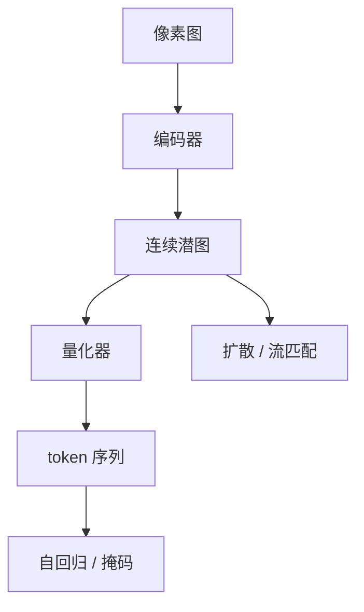

# 图像Tokenizer

一句话:图像 tokenizer 是生成模型的输入层——它把一张图压成模型能吃的表示,压成连续潜图就交给扩散,压成离散 token 就交给自回归或掩码 Transformer;压缩率、词表大小和量化方式怎么配,直接决定下游的序列长度、画质天花板和训练难度。

本篇讲的是**谱系与选型**。向量量化的最近邻查表、straight-through 梯度、承诺损失,以及码本坍塌的成因、诊断与缓解,机制全部归 VAE 篇,这里只在需要时引一句。

## 一、离散还是连续:第一个岔路口

自编码器把 $512\times512\times3$ 的像素压成 $64\times64$ 的潜图之后,路分两条:

- **连续路线**:潜图上每个位置是一个实数向量,不做离散化,直接交给在连续空间上定义的生成模型——扩散和流匹配都属于这一类(过程见 Diffusion 篇与 FlowMatching 篇,骨干见 DiT 篇,整机见 SD架构 篇)。
- **离散路线**:再加一步量化,把每个位置换成词表里的一个整数索引,一张图于是变成一串 token,可以原样喂给「预测下一个 token」的 Transformer。

多走量化这一步图什么?一句话:**图接口**。自回归 Transformer 和掩码建模的目标函数都是有限词表上的分类(K 选 1 的 softmax),它要的是「第 t 个位置是几号 token」这种离散标签;潜图是连续实数向量,交叉熵无从谈起。反过来,扩散的训练目标是在连续空间上回归噪声或速度场,整数索引对它没有意义。**所以离散与连续之争不是画质之争,是下游用什么损失函数倒推上来的**。

| | 连续潜变量 | 离散 token |
|---|---|---|
| 下游损失 | 回归(噪声 / 速度场) | 交叉熵 |
| 典型生成模型 | 扩散、流匹配 | 自回归 LM、掩码建模 |
| 信息损失 | 只有自编码器的压缩损失 | 再叠一层量化误差 |
| 与文本统一 | 难,要另配一套解码路径 | 天然统一,可以共用一个词表 |
| 采样代价 | 几十步全图迭代 | 序列长度次前向(掩码建模可并行) |

这条路的起点是 DALL·E:先用一个离散自编码器把图压成 32×32 的 token,再拿自回归 Transformer 建模「文本 token + 图像 token」这一整条序列。

还有第三条中间路线值得单列:**自回归不一定要量化**。Autoregressive Image Generation without Vector Quantization 用一个很小的扩散头去建模「下一个 token 的分布」,于是 token 可以保持连续,交叉熵换成扩散损失,自回归的顺序结构留着、量化误差没了。这条线正好反证了上表第一行才是真分界:**决定要不要离散化的是损失函数,不是自回归本身**。

## 二、四条量化路线:各自绕开什么

### VQ:显式码本 + 最近邻查表

标准做法:维护一本 $K\times d$ 的码本,编码器输出在里面找最近的一条,索引就是 token(查表、STE、三项损失见 VAE 篇)。**代价是这本码本是学出来的**——它要靠梯度或 EMA 更新,于是有初始化、有漂移、有死码。VQGAN 在此基础上换的是重建目标而不是量化方式:感知损失加 patch 判别器,让同一本码本撑得住更高的空间压缩率。

### RQ:一个位置叠几个码

量化一次之后再量化残差,叠 $D$ 层,各层共享同一本码本。表达力对标 $K^D$ 大小的码本,而码本实际只有 $K$ 那么大。它换的是 **「码本大小」与「序列深度」之间的汇率**:不把 $K$ 撑到指数级,改成在同一个位置上多放几个码。

### FSQ:把码本换成一把标尺

FSQ 把潜向量投影到很少的几维(论文原话是 typically less than 10),每一维各自四舍五入到一小组固定的标量取值上:

$$
\hat{z}_i = \mathrm{round}\Big(\big\lfloor L_i/2 \big\rfloor \cdot \tanh(z_i)\Big), \qquad i = 1,\dots,d
$$

读法:先用 $\tanh$ 把这一维压进有界区间,再按该维允许的级数 $L_i$ 缩放取整,于是这一维只能落在 $L_i$ 个格点上。**码本没有消失,它变成隐式的**——所有维度取值集合的笛卡尔积就是词表,大小 $\prod_i L_i$;比如 6 维、每维 8 级就是 $8^6 = 262144$ 个码。

**FSQ 为什么少死码?** 因为码本不再是学出来的参数,而是坐标轴上钉死的格点。VQ 的死码是一个自我强化的循环:某个码向量初始化时离编码器输出太远,于是从没被选中,于是拿不到梯度,于是永远不动。FSQ 里根本没有「码向量」这个可动的东西,格点始终均匀铺在 $\tanh$ 的值域上,编码器只要把某维输出推到那一格附近,那一格就被用上。所以论文明说 FSQ 不出现 codebook collapse,也不需要承诺损失、码本重置、码分裂、熵惩罚这一整套机械。

**但「不坍塌」不等于「全用上」**:笛卡尔积里那 $\prod_i L_i$ 个组合能不能被访问,取决于编码器输出的联合分布。真实数据只占据潜空间里薄薄一层流形时,大量组合从来不会出现——这不是坍塌,是高维组合空间的常态,所以评估仍然要实测利用率,不能默认满格。

### LFQ:码本嵌入维度直接降到 0

MAGVIT-v2 的 lookup-free quantization 更极端:**把码本的嵌入维度降成零**,$K\times d$ 的码本表被换成一个大小为 $K$ 的整数集合。论文采用的最简版本假设各维独立、且只取二值:

$$
q(z_i) = \mathrm{sign}(z_i), \qquad \text{token 编号} = \sum_{i=1}^{\log_2 K} 2^{\,i-1}\,\mathbf{1}\{z_i > 0\}
$$

读法:编码器只输出 $\log_2 K$ 维,每一维只看正负号,把这串符号当二进制位拼起来就是 token 编号;$K = 2^{18}$ 时特征向量只有 18 维。

**为什么不用查最近邻?** 因为 VQ 的查表是在 $K$ 个 $d$ 维向量里算距离(论文说 $d$ 典型取 256),$K$ 一大就贵得离谱;而 LFQ 把「哪个码最近」**分解成了逐维独立的一次符号判断**——各维互不影响,第 $i$ 位的答案只取决于 $z_i$ 的正负,拼起来自然就是全局最优的那个码,不需要比较任何候选。这是独立分解带来的等价,不是近似。

代价是码本不再有可学的几何结构,所有码等距摊在超立方体的顶点上,于是**利用率要靠一项熵惩罚显式去推**:让单样本的码分布尽量尖锐、整个 batch 的边缘分布尽量均匀。LFQ 的 tokenizer 照常带重建、GAN、感知与承诺损失,只是码本损失不再适用。

### 四条路放一起

| | VQ | RQ | FSQ | LFQ |
|---|---|---|---|---|
| 码本 | 显式、可学 | 显式、可学,跨层共享 | 隐式,各维取值的笛卡尔积 | 隐式,超立方体顶点 |
| 怎么选码 | $K$ 个向量里查最近邻 | 每层各查一次 | 逐维取整 | 逐维取符号 |
| 一个位置几个码 | 1 | $D$ | 1 | 1 |
| 词表大小怎么来 | 直接给 $K$ | 给 $K$,用深度换表达力 | $\prod_i L_i$ | $2^{\text{维数}}$ |
| 额外损失 | 码本项 + 承诺项 | 同 VQ,逐层 | 无 | 熵惩罚 + 承诺项 |
| 典型病 | 死码、利用率失衡 | 深层退化成微调 | 组合空间访问稀疏 | 边缘分布不均 |

一句话记法:**VQ 学码本,RQ 摊码本,FSQ 钉死码本,LFQ 取消码本**。

## 三、码本怎么配:大小、维度、层数

### 先算码率这笔账

一个 tokenizer 交给下游的预算只有两个数:序列多长、每个 token 多少比特。

$$
\text{总比特} = \underbrace{\frac{H}{f}\cdot\frac{W}{f}}_{\text{序列长度}}\ \times\ \underbrace{D}_{\text{每位置码数}}\ \times\ \log_2 K
$$

读法:下采样倍率 $f$ 决定序列有多长,码本大小 $K$ 决定每个 token 携带多少比特,RQ 的层数 $D$ 是在同一个位置上叠比特。**三个旋钮能凑出同样的码率,但对下游完全不等价**:降 $f$ 让 Transformer 的注意力代价按序列平方涨;加大 $K$ 让 softmax 变宽、码本更难训;加深 $D$ 让序列线性变长,而且各层地位并不平等。

| 参数 | 调大得到什么 | 调大的代价 | 判据 |
|---|---|---|---|
| 下采样倍率 $f$ | 序列变短、生成变快 | 重建保真下降,小字与密集纹理最先丢 | 固定码率比 rFID,再看下游 |
| 码本大小 $K$ | 单 token 信息更多、重建更好 | 每个码摊到的样本变少,大码本是坍塌高发区 | 看利用率与使用分布的熵,别只看 $K$ |
| 残差层数 $D$ | 不动 $K$ 和 $f$ 就能提表达力 | 序列成倍变长;深层残差能量小,容易退化成微调 | 逐层残差能量 + 逐层下游收益 |

### 码本维度是最容易被忽略的第四个旋钮

**加大码本的同时必须把码向量的维度调小**。这是 ViT-VQGAN 起的头(768 维投到 32 维甚至 8 维再查表,配 $\ell_2$ 归一化,把最近邻退化成余弦相似度),MAGVIT-v2 把它当成训练大词表的常规技巧,并给了一句关键解释:降维是在**限制单个 token 的表征能力,反过来让模型更容易学会大词表上的分布**。这句话把码本设计和下游可学性直接连上了——**码本维度不是重建的参数,是下游的参数**。

FSQ 和 LFQ 可以看成把这条思路推到极致:FSQ 的每一维只有几个级,LFQ 的每一维只有 1 比特,单个码的几何自由度被压到最小,词表反而敢开得很大。

### 各条路线在码本设计上怎么规避坍塌

坍塌的成因、诊断与缓解手段见 VAE 篇;这里只看**各条 tokenizer 路线是用什么设计把这件事绕开或换掉的**:

| 路线 | 码本设计上怎么处理利用率 | 换来的新问题 |
|---|---|---|
| VQGAN | 不改量化,靠更强的重建目标撑住一本不大的码本;工程上仍要 k-means 初始化与死码重启 | 码本一大就守不住,视觉词表长期停在几千量级 |
| ViT-VQGAN | 低维查表 + $\ell_2$ 归一化,压低单码自由度 | 查表维度成了新超参 |
| RQ-VAE | 共享码本让同一个码在 $D$ 层里都有机会命中,单码利用率更高 | 各层残差分布本就不同,必须逐层统计 |
| FSQ | 格点固定,不存在「学不动的码」 | 笛卡尔积组合的实际访问率仍需实测 |
| LFQ | 熵惩罚显式推平边缘分布 | 惩罚权重是新超参,推太狠会伤害数据本身的长尾 |

**共享码本还是逐层独立?** 取舍很具体:共享省掉了「每层码本各多大」这一串超参搜索,还让每个码有 $D$ 次被选中的机会;但它也让「问题出在哪一层」被总体利用率盖住,**报一个总体活跃码比例等于没查**。逐层独立可以按层裁剪大小,代价是超参数量翻 $D$ 倍,而且深层样本更少、更容易饿死。RQ-VAE 选的是共享,并且仍然保留 EMA 与死码重启——**换了量化结构不等于免掉了码本维护**。

## 四、重建好不等于生成好

这是本篇最该记住的一条。MAGVIT-v2 把它直接写成一个误解:**以为重建变好就等于语言模型生成变好,是一个常见误解**。他们的证据落在词表大小这条轴上——VQ 的词表越大,重建 FID 一路变好;但语言模型的生成 FID 先变好、过了某个点反而变差。论文顺手解释了一个长期让人困惑的现象:**视觉生成用的语言模型词表大多停在 1–8k 这个量级,远小于自然语言二十万级的词表**。LFQ 的卖点也正在这里,论文报告用它扩词表时,重建和生成能一起变好,而这是当时的 VQ 方法做不到的。

为什么会背离?两层原因:

1. **重建只考核解码器,生成还要考核建模难度**。词表变大、单 token 信息变多,重建自然变好;但下游模型要在更宽的分类空间上估分布,同样的数据量摊下来每个 token 见得更少,先验更难学。
2. **潜空间的形状会影响可学性,而重建指标对形状不敏感**。LDM 里有个正好对上的反例:VQ 正则的一阶段模型重建略差,在它的潜空间上训出来的扩散模型采样质量却有时更好(见 VAE 篇)。

所以 tokenizer 的验收必须四层一起报,而且**只有最后一层是结论**:

| 层 | 看什么 | 只看这一层会怎样 |
|---|---|---|
| 码率 | 序列长度 × 每 token 比特,比较前必须先固定 | 码率不固定,任何对比都不成立 |
| 重建 | rFID、PSNR、SSIM、LPIPS | PSNR 偏袒糊的重建,rFID 对结构错位不敏感 |
| 码本统计 | 活跃码比例、使用分布的熵或 perplexity;RQ 逐层报 | 利用率高不代表重建好,更不代表生成好 |
| 下游 | 用这个 tokenizer 训出来的生成模型的最终指标 | 这一层才是验收口径,前三层只是定位手段 |

> 🖼️ 占位:同一张图分别经 VQ / RQ / FSQ / LFQ 量化后的 token 图与重建结果对照,标注各自码率、词表大小与实测利用率

## 五、语义 ID:同一套量化,换一个下游目标

推荐系统里的**语义 ID**是同一套残差量化的另一个用法:把物品的内容 embedding(标题、描述、图片过一个预训练编码器)用 RQ 量化成一小串码字,这串码字本身就当作物品的 ID。TIGER 用它把检索改写成生成——序列到序列模型直接自回归地解码出「用户下一个会交互的物品的语义 ID」,不再做向量近邻检索。

它值得单独讲,是因为**这是离散化的目标被整个换掉的一个例子**。视觉 token 要的是能还原像素,语义 ID 不需要还原任何东西,它要的是**语义相近的物品共享前缀**,于是新物品能借老物品的码字泛化——TIGER 报告的正是对没有交互历史的物品检索效果变好。

| | 视觉 token | 推荐语义 ID |
|---|---|---|
| 离散化图什么 | 压缩像素,供重建与生成 | 给物品一个可生成、可泛化的标识 |
| 有没有解码器 | 有,重建质量是硬约束 | 没有,不需要还原内容 |
| 好的表示长什么样 | 保住纹理、结构、运动 | 语义近的物品码字前缀相同 |
| 主要指标 | rFID / PSNR / LPIPS,加下游生成质量 | 召回、排序指标、目录覆盖、冷启动效果 |
| 特有的坑 | 码本坍塌、重建天花板 | ID 冲突:内容极相似的两个物品撞进同一串码,得额外补一位区分 |

共同点只有量化器本身:两边都可以用 RQ,也都要在「码字够短」和「区分度够高」之间选位置。**但视觉 tokenizer 的调参经验不能直接搬**——利用率在视觉侧是健康度指标,在推荐侧却必须连着目录覆盖率和冲突率一起看:码本用满了但热门品类互相撞 ID,推荐照样垮。

## 六、tokenizer 反过来约束下游生成

tokenizer 一旦定了,下游能选什么范式、要付多少代价也就基本定了:

| tokenizer 形态 | 配套的生成范式 | 被约束住的是什么 |
|---|---|---|
| 单层 VQ,光栅展开 | 逐 token 自回归(VQGAN、LlamaGen) | 采样步数等于序列长度,$f$ 一降就慢一个量级 |
| 单层 VQ + 较大词表 | 掩码并行解码(MaskGIT 这一类) | 步数能压到几十步,但要求同批预测的 token 之间足够独立 |
| RQ,一个位置一叠码 | 要么把 $D$ 层展平成更长序列,要么用一个小头一次预测一叠 | 层间有强依赖,展平顺序不能随便定 |
| 多尺度残差量化 | 下一尺度预测(VAR):先出一整张低分辨率 token 图,再逐级细化 | 自回归的「下一个单位」被 tokenizer 重新定义了 |
| 不量化,连续 token | 自回归 + 扩散损失(MAR) | 省掉量化误差,换来每个 token 都要跑一个小扩散头 |
| 图像与文本共用一个词表 | 早融合的混合模态序列(Chameleon) | 图像 token 与文本 token 抢同一个 softmax 和同一份上下文预算 |

VAR 那一行最说明问题:**它把自回归的「下一个单位」从「下一个位置」改成了「下一个分辨率」,而这件事只有在 tokenizer 本身按尺度做残差量化之后才成立**。所以 tokenizer 不是生成模型的前处理,它定义了生成模型的状态空间。

视频侧还要多一条约束。相邻帧高度冗余,RVQ 的层数与每层码本必须把**空间纹理**和**时间变化**分开看:第一层通常吃掉大部分空间结构,运动细节要到后面几层才轮得到,所以判据是逐层残差能量加逐层下游收益——某一层之后重建和生成都不再改善,那层就只是白白拉长序列。层数与码本大小之间还有个此消彼长:同样的码率预算下,层数多一层就得把每层的 $K$ 压小,而层数越深、深层越容易只在少数码上做微调,所以**先按残差能量定层数,再在固定码率下调每层大小**,比两个一起扫要省得多。MAGVIT-v2 走的是另一条路:图像和视频共用一个词表,靠因果的时序压缩让第一帧能单独当图像编码(时序压缩本身见 视频VAE 篇)。

## 七、面试考点串联

| 高频问法 | 本文哪一节 |
| --- | --- |
| 离散视觉 tokenizer 里 VQ、RQ、FSQ、LFQ 差在哪?怎么选、怎么评估? | 二(四路线对照);三(码本怎么配);四(验收四层) |
| FSQ 为什么通常比显式 VQ 码本更少遇到死码问题? | 二(格点是钉死的,不是学出来的) |
| LFQ 的隐式码本怎么避免显式最近邻查找? | 二(逐维符号判断把查表分解掉了) |
| 视觉 token 与推荐语义 ID 的评价目标有何差异? | 五 |
| 视频生成里 RVQ 的层数和每层码本大小怎么选? | 三(三个参数的判据);六(视频侧逐层残差能量) |
| 各条 tokenizer 路线在码本设计上怎么规避或权衡坍塌? | 三(规避表 + 共享码本取舍);成因、诊断与缓解见 VAE 篇 |
| 码本大小、码本维度和 RQ 层数怎么配? | 三(码率的账 + 维度这个旋钮);死码重启频率见 VAE 篇 |
| VQGAN 与 RQ-VAE 的码本设计差在哪? | 三(规避表);量化机制对照见 VAE 篇 |
| 为什么非得把图像离散化?扩散不是不用 token 吗?(补充题) | 一 |
| 重建 FID 更好的 tokenizer,下游生成一定更好吗?(补充题) | 四 |
| 视觉词表为什么通常只有几千,而不是像文本那样几十万?(补充题) | 四;三 |
| 加大码本时为什么要同时把码向量维度调小?(补充题) | 三 |
| 换一个 tokenizer,下游生成模型要跟着改什么?(补充题) | 六 |

## 相关文献

- Neural Discrete Representation Learning(VQ-VAE:显式码本与最近邻查表)— [arXiv:1711.00937](https://arxiv.org/abs/1711.00937)
- Zero-Shot Text-to-Image Generation(DALL·E:离散自编码器 + 自回归建模图文序列)— [arXiv:2102.12092](https://arxiv.org/abs/2102.12092)
- Taming Transformers for High-Resolution Image Synthesis(VQGAN:用重建目标撑住高压缩率)— [arXiv:2012.09841](https://arxiv.org/abs/2012.09841)
- Vector-quantized Image Modeling with Improved VQGAN(低维查表 + $\ell_2$ 归一化)— [arXiv:2110.04627](https://arxiv.org/abs/2110.04627)
- Autoregressive Image Generation using Residual Quantization(RQ-VAE:共享码本与残差深度)— [arXiv:2203.01941](https://arxiv.org/abs/2203.01941)
- Finite Scalar Quantization: VQ-VAE Made Simple(FSQ:隐式笛卡尔积码本)— [arXiv:2309.15505](https://arxiv.org/abs/2309.15505)
- Language Model Beats Diffusion, Tokenizer is Key to Visual Generation(MAGVIT-v2 与 LFQ)— [arXiv:2310.05737](https://arxiv.org/abs/2310.05737)
- Visual Autoregressive Modeling: Scalable Image Generation via Next-Scale Prediction(VAR:下一尺度预测)— [arXiv:2404.02905](https://arxiv.org/abs/2404.02905)
- Autoregressive Image Generation without Vector Quantization(连续 token + 扩散损失)— [arXiv:2406.11838](https://arxiv.org/abs/2406.11838)
- Autoregressive Model Beats Diffusion: Llama for Scalable Image Generation(LlamaGen)— [arXiv:2406.06525](https://arxiv.org/abs/2406.06525)
- Chameleon: Mixed-Modal Early-Fusion Foundation Models(图文共用词表的早融合序列)— [arXiv:2405.09818](https://arxiv.org/abs/2405.09818)
- Recommender Systems with Generative Retrieval(TIGER:语义 ID 与生成式检索)— [arXiv:2305.05065](https://arxiv.org/abs/2305.05065)
- High-Resolution Image Synthesis with Latent Diffusion Models(KL-reg 与 VQ-reg 的下游对比)— [arXiv:2112.10752](https://arxiv.org/abs/2112.10752)
