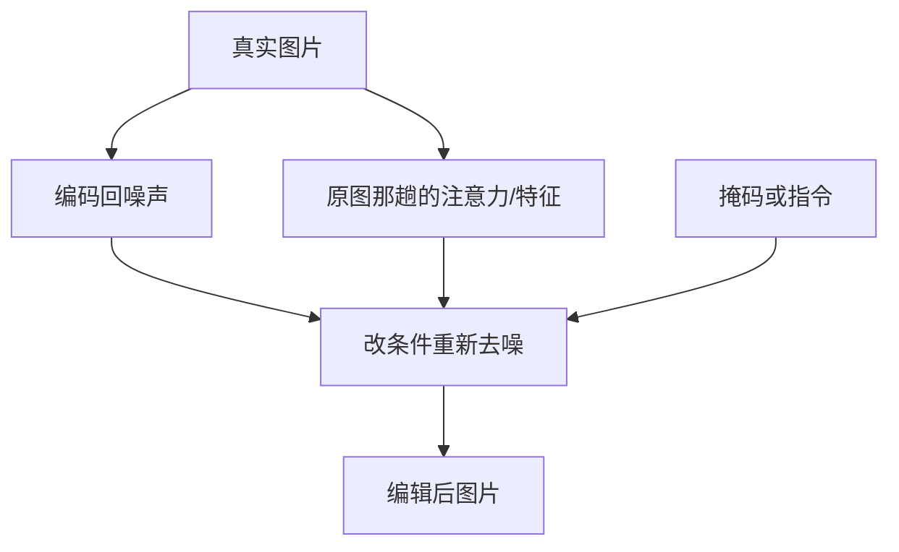

# 图像编辑

一句话:图像编辑是**拿一张已经存在的真实图片去改它**——难点从来不在「改的那一处画得好不好」,而在「没让改的那 95% 像素能不能原样留住」,而扩散模型天生每一步都在重写整张图。

本篇讲怎么给一个只会从零画图的模型硬造出「别动这里」的约束:inversion 把真图搬回噪声、注意力操控定点换内容、指令式编辑把改图变成训练任务、掩码重绘直接圈定范围,以及编辑强度与保真度这根跷跷板怎么评测。DDIM 的确定性采样与 CFG 的机制见 Diffusion 篇;ControlNet / IP-Adapter / LoRA 这类外挂控制手段见 条件控制 篇;img2img 的 strength 与专用重绘模型的通道接法见 SD架构 篇;潜空间往返的重建上限见 VAE 篇。

## 一、编辑和从零生成的根本差别

文生图是**开卷**:整张画布都归你,只要最后的图对得上提示词就算成功。编辑是**闭卷**:图已经给定了,成功要同时满足两件互相打架的事。

1. **改对了**——要求的那处改动确实发生
2. **没改的地方一动不动**——背景、构图、身份、光照都得留住

第二件才是真难点。去噪骨干没有「这块别动」这个概念,它每一步都在往整张潜图上写值;哪怕你只想给猫换个帽子,网络也是把猫、桌子、墙壁全部重画一遍。**所有编辑方法本质上都是在给一个没有约束的生成器外挂一个约束**,区别只在约束从哪来。

| 约束从哪来 | 代表做法 | 靠什么保住原图 | 要不要训 |
|---|---|---|---|
| **起点** | DDIM inversion、SDEdit 式加噪 | 让去噪的起点就是这张图对应的噪声 | 不用 |
| **中间状态** | Prompt-to-Prompt、MasaCtrl、Plug-and-Play | 把原图那次去噪的注意力图/特征搬过来复用 | 不用 |
| **模型本身** | InstructPix2Pix、Emu Edit | 训练时就见过成对的「原图 → 编辑图」 | 要 |
| **空间范围** | 掩码重绘、RePaint | 硬性规定哪些位置不许写 | 视做法 |

这张图里有两条线要分开看:**下面那条(把原图的中间状态喂回去)才是保结构的主力**,上面那条只保证「什么都不改时能复原」。两者常常一起用。

## 二、inversion:把真图搬回噪声这条线

### 为什么需要它

最省事的做法是 SDEdit 式的直接加噪:给原图加到某一档噪声,再去噪回来(那根 strength 旋钮见 SD架构 篇)。它的问题是**只有一根旋钮**——加得浅,改不动;加得深,原图先丢构图后丢语义。没有一个位置能同时做到「大改」和「保结构」。

inversion 想要的是另一件事:找一个特定的 $x_T$,让确定性采样器从它出发**正好走回这张图**。拿到这个起点之后再改提示词重新跑,新轨迹会和原轨迹共享大量结构。

### DDIM inversion 怎么做

DDIM 的更新式没有随机项,可以看成一个常微分方程的离散化;把时间方向反过来跑就是 inversion:

$$
x_{t+1} = \sqrt{\bar{\alpha}_{t+1}}\,\hat{x}_0(x_t) + \sqrt{1-\bar{\alpha}_{t+1}}\,\epsilon_\theta(x_t, t)
$$

人话:每一步用网络在**当前这一档**预测出的噪声,把图往更脏的方向推一格,一格一格推到纯噪声。DDIM 为什么是确定性的、为什么可以跳步,见 Diffusion 篇。

这里藏着一个近似,是后面所有麻烦的源头:严格来说这一步该用 $\epsilon_\theta(x_{t+1}, t+1)$,可 $x_{t+1}$ 正是要求的未知量,于是拿手上的 $\epsilon_\theta(x_t, t)$ 顶替。**只有当相邻两档之间网络预测变化不大时这个替换才成立**,所以 inversion 通常比正常出图用更密的步数(常见实现取 50 步,而出图 20–30 步就够)。步数一少,每步的替换误差就累积成肉眼可见的偏移。

### 为什么 CFG 一开就失准

这是本节最该记牢的一条。CFG 把网络预测换成了一个外推:

$$
\hat{\epsilon} = \epsilon_\theta(x_t,\varnothing) + s\left[\epsilon_\theta(x_t, c) - \epsilon_\theta(x_t,\varnothing)\right]
$$

$s > 1$ 相当于给整个动力系统加了一个大于 1 的增益(CFG 本身的机制与算力代价见 Diffusion 篇)。于是:inversion 那一步的近似误差本来很小,但正向去噪时**每一步都被这个增益放大一次**,几十步连乘下来误差指数级发散。症状很有欺骗性——出来的仍然是一张像模像样的图,但已经不是原来那张了,人脸会变成另一个人。

所以标准做法是矛盾的:**inversion 只能用 $s=1$ 跑(等于不开 CFG),采样却必须开 CFG 才好看**。两条轨迹的动力学根本不是同一个,失配的根子在这里。

三类修法,代价各不相同:

| 思路 | 做法 | 代价 |
|---|---|---|
| 把误差学回来 | Null-text inversion:先用 $s=1$ 存一条无 CFG 的参考轨迹,再逐时间步**只优化那个空文本嵌入**,把开 CFG 的采样轨迹拽回参考轨迹上 | 每张图要跑一轮逐步优化,不是免费的;但模型权重一个字节都不动 |
| 换更准的数值格式 | 把「拿当前档的预测顶替下一档」换成定点迭代或更高阶的反演格式 | 每步多几次网络前向 |
| 干脆绕开 | 把编辑做成条件生成任务(第四节),或只加浅噪声(SDEdit 式) | 前者要训模型,后者改动幅度受限 |

null-text inversion 那一招值得单独想清楚:它优化的是**空文本嵌入**,一个平时没人用的自由变量——它只出现在 CFG 的无条件那一支里,动它不影响条件支要表达的语义,却足够把整条轨迹拉回来。这是很典型的「找一个不承担语义职责的旋钮去吸收误差」。

还有一条实践里最容易踩的坑:**反演得准 ≠ 编得好**。inversion 只保证「不改提示词时能复原原图」;提示词一改,轨迹立刻分岔,结构靠什么留住是另一个问题——那正是下一节的事。

## 三、注意力操控:为什么改注意力就能定点改内容

### 布局信息就藏在交叉注意力图里

去噪骨干的 cross-attention 层里,Q 来自图像的空间位置,K/V 来自文本 token。注意力矩阵第 $(i,j)$ 项就是「第 $i$ 个空间位置有多听第 $j$ 个词的话」。把某个词那一列摊回二维画成热力图,亮的区域基本就是这个词对应的物体所在——**画面的空间布局是显式地写在这张图里的**,而且它在去噪的很早几步就基本定型了。

Prompt-to-Prompt 的核心断言由此而来:两次生成(原提示、改后提示)在同一个随机种子下**共用同一批交叉注意力图**,构图与布局就会保持一致,变的只是被换掉那个词所填充的内容。

| 编辑类型 | 提示词怎么变 | 注意力怎么动 |
|---|---|---|
| 换词 | 「一只猫骑车」→「一只狗骑车」 | 注意力图整批沿用原轮,只有被换的那个词换成新的 K/V |
| 加词 | 「一辆车」→「一辆红色的车」 | 原有词的注意力图沿用,新词那几列自由生长 |
| 调强度 | 想让画面里的雪更多一点 | 只把那个词对应的那一列注意力**乘一个系数** |

三种都不训练、不改权重,只在推理时改一批中间张量,所以成本几乎为零。

**替换只做前若干步,后面放开。** 因为布局早期就锁定、后期主要在长纹理;一路替换到底会把新内容也一起压回原样。于是「替换到第几步」就成了一根改动幅度的旋钮,这和第六节那根是同一根。

### 动 self-attention 是另一条分工

cross-attention 管「哪个词落在哪」,self-attention 管「画面内部互相抄什么」。两者保住的东西不一样:

| 动哪一层 | 保住的是 | 代表做法 |
|---|---|---|
| cross-attention 图 | 语义布局:谁在什么位置 | Prompt-to-Prompt |
| self-attention 的 K/V | 外观与纹理:是不是同一个东西 | MasaCtrl:让编辑分支的 Q 去查**原图分支的 K/V** |
| 骨干空间特征 + 自注意力图 | 整体几何结构 | Plug-and-Play:把原图那趟去噪的特征直接注入编辑分支 |

MasaCtrl 修的是一个很具体的洞:**换姿势这类非刚性编辑,Prompt-to-Prompt 做不好**——因为它强行保住的正是布局,而换姿势恰恰要改布局。把保的东西从「位置」换成「是什么」(Q 用新的、K/V 抄原图的),姿态才放得开。

三条边界,答不上来会被追问穿:

- **要求原图先能被 inversion 回去**,第二节那一层的误差原样传导过来
- **真图没有对应的原提示词**,得先反推一句描述;描述不准,注意力图的语义就没有保证
- **一个词对应画面里多个实例时分不开**,「只改左边那只猫」做不到

## 四、指令式编辑:把编辑变成一次条件生成

前两条路都是推理期技巧:要写提示词、要跑 inversion、要调替换比例。指令式编辑换了个思路——**把编辑本身训成一个条件生成任务**,输入是「原图 + 一句人话指令」,输出是编辑后的图。用户不用写「一只戴帽子的猫」,只说「给它戴顶帽子」。

### 数据是最大的难点

世界上没有现成的大规模「原图 + 指令 + 编辑后图」三元组。InstructPix2Pix 的办法是**用两个已有模型把数据造出来**:

1. 拿一小批人工写的三元组(原描述、指令、改后描述)微调一个语言模型,让它从真实图注批量生成「指令 + 改后描述」
2. 用文生图模型把「原描述」和「改后描述」各画一张。**直接画会得到两张毫不相干的图,所以这一步必须借第三节的注意力共享把两张图的构图钉在一起**——这是全流程最关键的一环
3. 用图文相似度的方向一致性一类指标,把配得不好的对过滤掉

论文自报最终得到 45 万余条训练样本。这条依赖链值得单独记:**指令式编辑的训练数据,是用注意力操控那套技巧造出来的**;推理期的小技巧在这里变成了数据引擎。

### 接法与两个 guidance scale

原图的潜表示按通道拼到带噪潜图上,骨干第一层卷积扩通道、新通道零初始化(通道接法的通用形态见 SD架构 篇)。真正值得追问的是推理:这里有**两个独立的 CFG 尺度**。

$$
\tilde{\epsilon} = \epsilon_\theta(z_t,\varnothing,\varnothing) + s_I\left[\epsilon_\theta(z_t,c_I,\varnothing) - \epsilon_\theta(z_t,\varnothing,\varnothing)\right] + s_T\left[\epsilon_\theta(z_t,c_I,c_T) - \epsilon_\theta(z_t,c_I,\varnothing)\right]
$$

$c_I$ 是原图、$c_T$ 是指令。读法:第二项把结果往「像原图」推,第三项把结果往「照指令做」推,两个尺度各管一头。所以调参症状可以直接对号入座——**改得不够就加 $s_T$,改得太狠、原图面目全非就加 $s_I$**。代价是每步要跑三次网络,比普通 CFG 的两次还多一次;训练时也要按概率分别丢掉图像条件和文本条件,那三支才学得出来。

### 合成数据的先天病

两张训练图是「画」出来的不是「拍」出来的,模型于是继承了生成模型自己的偏好:**它倾向于把整张图重画一遍,而不是精准动一小块**,典型症状是背景色调整体漂移、人脸细节被换掉。后续两条修法:

- **用人工标注的真实编辑数据微调**(MagicBrush 这类小而精、逐条人标的数据集)
- **把编辑当多任务训**:Emu Edit 把编辑和识别、分割这类视觉任务放在一起训练,并给每个任务一个可学习的任务嵌入,让模型先分清「这次是局部替换还是全局换风格」,再决定动多大范围

## 五、掩码式局部重绘与边界融合

用户已经圈出区域时就不必绕注意力,直接规定区域外不许写。三档做法,代价递增:

| 做法 | 怎么做 | 边界质量 | 要不要训 |
|---|---|---|---|
| 采样时贴回 | 每步把区域外的潜图,用原图按当前噪声档加噪的结果覆盖回去 | 最差 | 不用 |
| 反复回跳(RePaint) | 每步之后**重新加一点噪声再去噪**,同一档来回几轮,让新内容有机会「看见」已知区域并向它靠拢 | 明显改善 | 不用,但网络调用次数翻几倍 |
| 专用重绘模型 | 把掩码和被遮图像当条件喂进骨干(通道接法见 SD架构 篇) | 最好 | 要训一版权重 |

### 接缝为什么会露馅:四个成因,修法各不相同

1. **模型压根不知道有掩码**。贴回式做法里网络每一步都在画一整张图,只是画完被改写掉一部分;它从没被告知边界在哪,新旧内容自然对不上。RePaint 的回跳和专用模型修的都是这一条。
2. **潜空间的分辨率不够细**。掩码在像素空间是精确的,下采样 8 倍进潜空间后,一个潜位置对应原图 8×8 一块;解码时一个潜位置的改动还会晕开到周围若干像素。所以**潜空间方法的编辑边界天生是「软」的**,发丝级的精确边缘做不到。
3. **色调与光照不连续**。新内容是模型按自己的先验画的,白平衡、噪点、压缩痕迹未必和原图一致——局部看没毛病,拼起来一眼假。
4. **VAE 往返本身有损**。哪怕一个像素都不打算改,过一遍编解码也会变(上限见 VAE 篇)。

第 4 条对应一个产品里的标配动作:**最后在像素空间用羽化的掩码,把原图的未编辑区域合成回去**,而不是直接拿解码结果交付。分工很清楚——潜空间负责生成,像素空间负责缝合。羽化宽度是实打实的调参项:太窄接缝生硬,太宽会把编辑区域边上的新内容冲淡。

### 掩码从哪来

用户涂、分割模型给、或者让扩散模型自己推。DiffEdit 那一路的做法是**用两句提示词各跑一次去噪,比较两次噪声预测的差异,差异大的地方就是该动的区域**,二值化后当掩码用。它的价值不只是省一次涂抹——**这个掩码是模型自己认为需要改的地方**,和后续去噪天然一致,比人手涂的更贴合模型的实际行为。

> 🖼️ 占位:同一张原图 + 同一句编辑指令,四条路线(SDEdit 加噪 / Prompt-to-Prompt / InstructPix2Pix / 掩码重绘)结果并排对比,标出各自失效的地方

## 六、编辑强度与保真度:一根旋钮和怎么评测它

### 每条路线都有那根旋钮

名字不同、位置不同,调的是同一件事:

| 路线 | 旋钮 | 拧大的后果 |
|---|---|---|
| SDEdit / img2img | 加噪深度 strength(见 SD架构 篇) | 改动更自由,原图先丢构图、再丢语义 |
| Prompt-to-Prompt | 注意力替换覆盖的步数比例 | 比例调低更放得开,但布局跟着一起变 |
| 指令式编辑 | $s_T$ 与 $s_I$ 的相对大小 | $s_T$ 偏大就照做但整张图漂移 |
| 掩码重绘 | 掩码面积与羽化宽度 | 区域大则融合自然,但改动范围失控 |

**这条权衡没有免费午餐**:所有方法都在同一条「改得动 ↔ 保得住」的曲线上取点,曲线形状由方法决定,取哪一点由用户决定。所以判断一个新方法好不好,**看的不是它在某一个点上的分数,而是它整条曲线是不是压在别人上面**——这也是编辑类论文普遍画权衡曲线而不是报单个数字的原因。

### 评测:两个方向都得测,少一个就能被刷分

| 要测什么 | 常用口径 | 单独用它会被怎么刷 |
|---|---|---|
| 改对了没有 | 编辑后图像与**目标描述**的图文相似度 | 把整张图重画成目标描述,分很高但原图没了 |
| 没改的地方动没动 | 掩码外区域的像素级/感知距离,或整图与原图的相似度 | 什么都不改,保真满分但没完成编辑 |
| 改动方向对不对 | 方向一致性:图像的变化向量与文本的变化向量在图文嵌入空间里的夹角 | 比前两个稳,但完全不管画质 |
| 人看着行不行 | 人工评测,或带人工标注的真实编辑基准 | 贵且慢,但目前仍是仲裁 |

三条实践判据:

- **必须成对报**。单报一个方向没有意义,因为两个方向可以互相牺牲来换分;标准做法是固定一边扫另一边,画成曲线。
- **未编辑区域要用掩码框出来单独算**。整图相似度会被编辑区域本身的合理改动拉低,分不清「该动的动了」和「不该动的也动了」。
- **图文相似度类指标看不出画质与接缝**。它对局部融合痕迹几乎不敏感,这就是人工评测和真实标注基准至今替代不掉的原因。

## 七、面试考点串联

本篇目前没有 `topic` 指向它的题库真题,下表全部是按正文断言补出的问法。

| 高频问法 | 本文哪一节 |
| --- | --- |
| 编辑一张真实照片和从零文生图,难点差在哪?(补充题) | 一 |
| DDIM inversion 是怎么把真图变回噪声的?为什么非得是确定性采样器?(补充题) | 二;确定性的由来见 Diffusion 篇 |
| 做 inversion 的时候为什么不能开 CFG?开了会怎样?(补充题) | 二 |
| null-text inversion 到底在优化什么?为什么动那个东西是安全的?(补充题) | 二 |
| Prompt-to-Prompt 为什么改一改交叉注意力图就能定点改内容?(补充题) | 三 |
| 只想给人物换个姿势,Prompt-to-Prompt 为什么反而不好使?换成什么做法?(补充题) | 三 |
| 注意力替换为什么只做前面若干步、后面就放开?(补充题) | 三、六 |
| InstructPix2Pix 的训练数据哪来的?造数据时最关键的一步是什么?(补充题) | 四 |
| 它推理时为什么有两个 guidance scale?改得不够该调哪一个?(补充题) | 四 |
| 拿合成数据训出来的编辑模型有什么先天毛病?怎么补?(补充题) | 四 |
| 局部重绘的接缝为什么容易露馅?你会从哪几处下手?(补充题) | 五 |
| 掩码能不能让模型自己给?怎么给,比人涂的好在哪?(补充题) | 五 |
| 怎么评价一个图像编辑方法的好坏?只报一个指标为什么不行?(补充题) | 六 |

## 相关文献

- Denoising Diffusion Implicit Models(确定性采样,inversion 的地基)— [arXiv:2010.02502](https://arxiv.org/abs/2010.02502)
- SDEdit: Guided Image Synthesis and Editing with Stochastic Differential Equations(加噪再去噪这条最朴素的路线)— [arXiv:2108.01073](https://arxiv.org/abs/2108.01073)
- Prompt-to-Prompt Image Editing with Cross Attention Control — [arXiv:2208.01626](https://arxiv.org/abs/2208.01626)
- Null-text Inversion for Editing Real Images using Guided Diffusion Models(修 CFG 下的 inversion 失配)— [arXiv:2211.09794](https://arxiv.org/abs/2211.09794)
- InstructPix2Pix: Learning to Follow Image Editing Instructions(指令式编辑与合成数据管线)— [arXiv:2211.09800](https://arxiv.org/abs/2211.09800)
- MasaCtrl: Tuning-Free Mutual Self-Attention Control for Consistent Image Synthesis and Editing(非刚性编辑)— [arXiv:2304.08465](https://arxiv.org/abs/2304.08465)
- Plug-and-Play Diffusion Features for Text-Driven Image-to-Image Translation(注入空间特征与自注意力)— [arXiv:2211.12572](https://arxiv.org/abs/2211.12572)
- DiffEdit: Diffusion-based semantic image editing with mask guidance(让模型自己出掩码)— [arXiv:2210.11427](https://arxiv.org/abs/2210.11427)
- RePaint: Inpainting using Denoising Diffusion Probabilistic Models(回跳采样改善边界)— [arXiv:2201.09865](https://arxiv.org/abs/2201.09865)
- Blended Latent Diffusion(潜空间掩码融合)— [arXiv:2206.02779](https://arxiv.org/abs/2206.02779)
- MagicBrush: A Manually Annotated Dataset for Instruction-Guided Image Editing — [arXiv:2306.10012](https://arxiv.org/abs/2306.10012)
- Emu Edit: Precise Image Editing via Recognition and Generation Tasks(多任务 + 任务嵌入)— [arXiv:2311.10089](https://arxiv.org/abs/2311.10089)
