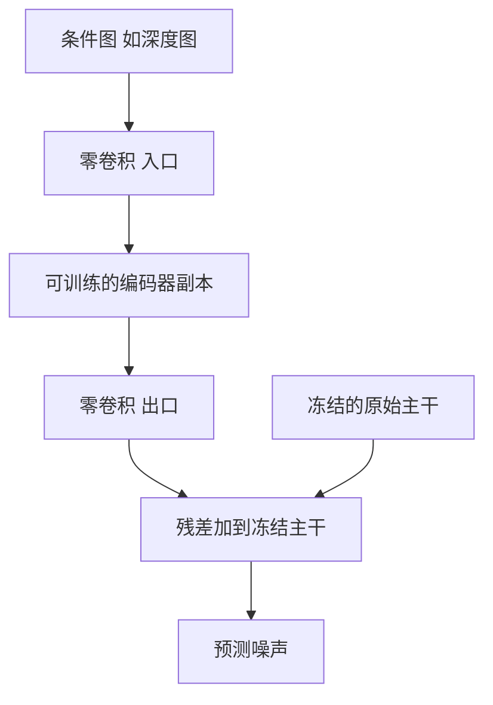

# 条件控制

一句话:条件控制解决的是「模型已经会画了,怎么让它照我说的画」——条件的形态决定它该从哪一层进网络,而不同的进入位置,成本从「几乎白给」到「等于重训一份主干」跨了三个数量级。

本篇只讲**给一个已经训好的生成模型加控制**这件事:按条件形态分类的注入手段全谱系、各自的参数与开销账、多条件怎么配权重、什么时候该改权重而不是加分支。加噪去噪与采样、CFG 的机制与算力翻倍见 Diffusion 篇;adaLN-Zero 在 Transformer 骨干里的具体写法与 DiT 那组对照实验见 DiT 篇;LoRA 的通用机制与 PEFT 选型见 LoRA 篇;inversion 与指令式编辑见 图像编辑 篇。

## 一、条件的形态决定注入位置

面试里这个问题几乎必问,而它有一个非常干净的答法:**先看条件携带的是什么信息,再决定它进哪一层**。三类形态、三种归宿:

| 条件形态 | 例子 | 它到底是什么 | 该进哪儿 |
|---|---|---|---|
| 全局标量/向量 | 时间步、类别标签、美学分、分辨率桶 | 一个向量,和空间位置无关 | 调制归一化层(FiLM / adaLN) |
| 变长序列 | 文本提示、参考图的若干 token | 一串互相有区分的条目,要被逐条查询 | cross-attention,条件作 K/V |
| 空间对齐图 | Canny 边缘、深度图、分割图、人体姿态 | 和输出**逐像素对齐**的一张图 | 独立的空间控制分支 |

为什么不能混用?**全局向量没有空间自由度**——一个 $d$ 维向量最多告诉网络「整体亮一点、整体偏冷调」,没法说「左上角那根线必须在这里」。反过来,**空间图压不进 cross-attention 也不划算**:硬拍平成 token 序列,注意力得自己从零学「第 137 个 token 对应输出的第 137 个位置」这种本该白给的对应关系,既费数据又不稳。

还有两个位置也能塞条件,但代价不同:

- **输入通道拼接**:把条件直接拼在网络输入上。SD 的 inpainting 模型就是这么做的——U-Net 的输入从 4 个潜通道扩到 9 个(4 潜变量 + 1 掩码 + 4 被遮住图像的潜变量)。**好处是条件从第一层就可见,坏处是输入卷积的形状变了,必须重训或微调整个主干**,而且每加一种条件就得再出一份完整模型,不能热插拔。
- **采样阶段引导**:不改网络,只改每一步的更新方向,CFG 是代表。它的机制与「算力直接翻倍」这笔账归 Diffusion 篇,本篇只关心多条件时几个强度旋钮怎么互相分配(第六节)。

一条贯穿全篇的判据:**注入位置越靠近输入、越动主干,控制越强,但可复用性越差**。ControlNet 这一路之所以流行,不是因为它效果一定最好,而是因为它把「强控制」和「主干可复用」这两件本来对立的事同时做到了。

## 二、全局向量类:FiLM、AdaIN 与 adaLN 到底差在哪

这三个名字长得像,面试爱拿它们互相区分。**它们的共同点是同一个动作:让条件去决定特征的逐通道缩放和平移**;区别在于「归一化用谁的统计量」和「缩放平移从哪来」,不能只用「谁生成 $\beta$」一句话打发。

FiLM 是这一族的祖宗,形式最朴素:

$$
h' = \gamma(c) \odot h + \beta(c)
$$

意思是:一个小网络看着条件 $c$ 吐出两组和通道数一样长的系数,把特征图的每个通道各自放大 $\gamma$ 倍、再平移 $\beta$。它本身**不做归一化**,论文里是把它插在残差块的归一化层之后。

AdaIN 来自风格迁移,长得像但来路完全不同:

$$
\mathrm{AdaIN}(x, y) = \sigma(y) \odot \frac{x - \mu(x)}{\sigma(x)} + \mu(y)
$$

读法:先用**内容特征自己的**逐样本逐通道空间统计量把 $x$ 标准化(这就是 instance norm),再把**风格图特征的通道均值和标准差**原样搬过来当新的尺度和偏移。关键在于 $\mu(y)$、$\sigma(y)$ 是**直接算出来的,不是学出来的**——原始 AdaIN 层一个可训练参数都没有。它背后的假设是「风格 = 特征的通道统计量」。

adaLN 则是 FiLM 那套搬到 LayerNorm 上:归一化统计量沿**特征维**在每个 token 内部算,再由条件 MLP 生成 $\gamma$、$\beta$。DiT 在它之上加了零初始化的残差门控 $\alpha$,那部分见 DiT 篇。

| | 归一化用什么统计量 | 缩放平移从哪来 | 作用在什么张量 |
|---|---|---|---|
| FiLM | 自身不归一化,借用前面的 BN | 条件网络学出来 | 卷积特征图,逐通道 |
| AdaIN | 内容特征的逐样本逐通道空间统计量 | 风格特征的通道统计量,直接算 | 卷积特征图,逐通道 |
| adaLN | 每个 token 沿特征维的均值方差 | 条件网络学出来 | token 序列,逐通道 |

这一族的共同优点是**几乎不要钱**:不增加序列长度,注意力矩阵一个元素都不多,算力开销可以忽略。代价在参数上——每层要一个 $d \to 6d$ 的条件 MLP,按层算是 $6d^2$ 量级,和一层注意力的投影矩阵同数量级。所以准确的说法是:**adaLN 省的是算力,不是参数量**。

## 三、序列类:cross-attention 与图像提示

### 文本为什么必须走 cross-attention

文本是变长的,而且**每个位置该看哪个词是不一样的**:画狗的那片像素要去读「金毛」,画背景的要去读「草地」。cross-attention 让图像特征作 Query、文本特征作 Key/Value,天然就是「逐位置各查各的」。压成一个全局向量再走 adaLN,等于把逐词信息求了个平均,复杂提示词直接失效——这也是文生图模型没有一个只靠 adaLN 的原因(注意力机制本身见 注意力基础 篇)。

代价是算力随条件序列长度线性增长,并且要把文本的 K/V 在每一层都算一遍(常见做法是缓存,因为提示词在整个采样过程中不变)。

### 图像提示:IP-Adapter 为什么要单开一路

有一类需求是「照着这张参考图的内容/风格画」。最省事的想法是把 CLIP 抽出的图像特征投影几下,当成额外的 token 拼进文本序列,共用同一套 cross-attention。**这条路效果明显不够**:文本的 K/V 投影是在图文对上训出来的,专门适配文本编码器的特征分布;把图像特征硬塞进去共用同一套投影,细粒度信息会被大量丢掉。

IP-Adapter 的做法是**解耦 cross-attention**——为图像特征新开一套 K/V 投影,单独算一路注意力,结果直接加到文本那一路上:

$$
h_{\text{out}} = \mathrm{Attn}(h,\, E_{\text{txt}}) + \lambda \cdot \mathrm{Attn}(h,\, E_{\text{img}})
$$

读法:两路注意力的 Query 是同一个(都是图像特征),Key/Value 各用各的;$\lambda$ 是把图像提示这一支放大或关小的旋钮,$\lambda = 0$ 就退回纯文生图。**这个式子直接解释了后面第六节的冲突问题**:两路是相加而不是协商,谁的强度大谁的意思就压过对方。

它只训新增的 K/V 投影和一个把 CLIP 图像嵌入映射成少量 token 的小网络,论文自报**约 22M 参数**,基础版把图像嵌入投影成 4 个 token。主干完全冻结,所以同一份 IP-Adapter 权重可以挂到从同一基座微调出来的其他模型上。

## 四、空间对齐类:ControlNet 与轻量分支

### ControlNet 的结构

三件事凑在一起:**锁死原主干**、**复制它的编码侧与中间块作为可训练分支**、**分支的进出口各套一层零初始化卷积**。控制分支和主干一样吃当前的 $x_t$ 和时间步 $t$,所以它每一步都要重新跑一遍。

### 为什么复制分支,而不是直接全量微调主干

这是本篇最高频的追问,四条理由按重要性排:

1. **保住基座**。基座是在十亿量级图文对上训出来的;控制数据通常只有几万到几百万对条件-图像。用小数据去动全量权重,几乎必然把通用能力冲掉(灾难性遗忘),表现为除了听边缘图之外什么都画不好了。ControlNet 论文明确说这套方法在小于 5 万对的数据集上依然稳。
2. **可插拔、可叠加**。主干不动,深度、姿态、边缘各训一份分支,用哪个挂哪个,还能同时挂几个。全量微调出来的是一整份模型,换条件就得换模型,也没法组合。
3. **复制比从零建一个小网络更好使**。控制信号是和图像同分辨率的空间图,从中提特征本来就要一个强视觉编码器。直接复制主干编码器,等于白拿一份在十亿图上预训练过的特征提取器,并且它和主干说的是同一套「特征方言」,加回去时对得上。
4. **训练更便宜**。主干冻结意味着不用为它存梯度和优化器状态。论文自报的口径是:在单张 A100 40G 上,加 ControlNet 训练比不加**每次迭代多约 23% 显存、多约 34% 时间**。

### 零卷积:为什么不会一直卡在零

进出口两层卷积的权重和偏置全部零初始化,所以训练第一步控制分支的输出恒为 0,整个模型的行为**和原来的基座逐比特一致**——不会被随机初始化的分支喷一脸噪声。

常见的追问是「权重是 0,梯度不也是 0 吗,那不就永远动不了?」。答案是不会:对一层线性/卷积 $y = Wx$,权重的梯度是 $\partial L/\partial W \propto x \cdot \partial L / \partial y$,**只要输入 $x$ 非零、上游回传的梯度非零,权重梯度就非零**;真正为零的是传给更前面那一层的输入梯度。所以第一步更新之后 $W$ 就离开了零点,门自己打开。零成为死点的条件是输入也恒为零,这里不成立。

「让新模块从恒等开始」是一类通用手法(adaLN-Zero、LoRA 的 $B$ 矩阵都是同一招),原理那一层见 DiT 篇。ControlNet 论文还记录了一个现象:模型不是逐渐学会听条件的,而是在某一步**突然**开始遵循条件,论文口径是通常不到 1 万个优化步,作者称之为 sudden convergence。

### T2I-Adapter:同样做空间控制,开销差一个量级

T2I-Adapter 用一个小的卷积网络把条件图编成多尺度特征,加进主干编码器,论文自报**约 77M 参数、约 300M 存储**。它和 ControlNet 有一个决定性的结构差异:**它的输入只有条件图,不吃 $x_t$ 也不吃时间步**。

这一条直接决定了推理开销:条件图在整个采样过程中不变,所以 **adapter 的特征算一次就能给所有步复用**;而 ControlNet 每一步都得跟着主干重跑一遍。50 步采样下,前者是 1 次,后者是 50 次。代价是控制精度和强度通常不如 ControlNet——它没有机会根据「当前这一步图脏到什么程度」调整自己的输出。

> 🖼️ 占位:ControlNet 与 T2I-Adapter 的数据流对比示意,突出前者吃 $x_t$ 与 $t$、每步重算,后者只吃条件图、全程算一次

### 各手段的成本账

以 SD 1.5 的 U-Net(约 860M 参数)为基准横向对照:

| 手段 | 新增参数 | 要动主干吗 | 训练数据量级 | 推理额外开销 |
|---|---|---|---|---|
| 输入通道拼接 | 只多几个输入通道 | 要,整份重训或微调 | 与预训练同量级 | 几乎为零 |
| FiLM / adaLN | 每层一个 $d \to 6d$ 的 MLP | 主干原生自带 | 随主干一起训 | 几乎为零,不占序列长度 |
| cross-attention(文本) | 每层一套 K/V/O 投影 | 主干原生自带 | 随主干一起训 | 随条件序列长度线性,K/V 可缓存 |
| IP-Adapter | 约 22M | 不动 | 大规模图文对 | 多一路很短的注意力 |
| T2I-Adapter | 约 77M | 不动 | 远小于预训练 | 条件特征全程只算一次 |
| ControlNet | 主干编码侧的一份完整副本 | 不动 | 5 万到百万级条件对 | 每步多跑一遍编码器 |

## 五、风格与主体:什么时候必须改权重

上面全是「加分支」。还有一档是**改权重**,针对的是另一类需求:让模型画出它**根本没见过**的东西——某个特定的人、某个特定 IP 的画风。

**判据一句话:控制分支只能在基座已有的分布里挑方向,造不出分布外的内容。** 想要的东西基座见过、只是要指定它出现在哪里、长什么姿势,加分支;想要的东西基座压根不认识,那就必须往权重里塞新知识。

| 方法 | 改的是什么 | 需要几张图 | 表达能力 | 典型代价 |
|---|---|---|---|---|
| Textual Inversion | 只学一个新词的嵌入向量(SD 1.x 文本编码器宽 768 维) | 3–5 张 | 最弱,受限于「文本编码器已经能表达什么」 | 权重极小、可随意组合;学不像复杂主体 |
| LoRA | 给注意力等层挂低秩增量,社区常用 rank 4–32,文件几十 MB 量级 | 几十到几千张 | 适中,风格类最常用 | 等效改了主干权重,会和其他控制打架 |
| DreamBooth | 全量微调主干 | 3–5 张 | 最强,能锁住具体主体的身份 | 容易过拟合与语言漂移,论文用类别先验保持损失来压;产出是一整份模型 |

DreamBooth 的核心技巧值得单独记:用一个**罕见 token** 当主体的名字(常见词会被原有语义污染),再配一个类别名(「一只 sks 狗」),同时用模型自己生成的同类图像做先验保持,防止微调后「狗」这个词整体被带偏成你那只狗。

选型的三问,按顺序走:

1. **条件要求像素级对齐吗?** 要 → 空间控制分支;不要 → 往下
2. **要的内容基座认识吗?** 不认识 → 改权重(按上表从轻到重挑);认识 → 往下
3. **条件能压成一个全局向量吗?** 能 → FiLM / adaLN;不能(变长、要逐位置查)→ cross-attention 或图像提示适配器

再加一条否决线:**控制要频繁更换、或者只对少数几张图生效时,一律别微调**——微调产出的是一份权重,换一次条件就要重训一次,而分支类方法换一个文件就行。

## 六、多条件叠加:权重怎么配、会怎么打架

### 叠加是相加,不是投票

多个控制分支挂在同一个主干上时,每条分支在主干第 $\ell$ 层各吐一份残差,乘上自己的强度再一起加回去:

$$
h_\ell \leftarrow h_\ell + \sum_{k=1}^{K} s_k \, c_{k,\ell}
$$

这个式子解释了绝大多数「多条件一开就崩」的现象:**它是叠加而不是协商**。$K$ 条分支各自的 $s_k$ 都按单条件的经验值设成 1,合起来就把主干特征推到了单条件时的 $K$ 倍远,输出直接过饱和出伪影。工程上的第一条经验因此是**总强度守恒**:多条件时把每条的强度按条数压下去,先保住总量,再微调配比。

diffusers 里对应的旋钮是 `controlnet_conditioning_scale`(每条分支的 $s_k$)和 `control_guidance_start` / `control_guidance_end`(这条控制在采样的哪一段生效);IP-Adapter 那一支对应第三节里的 $\lambda$。

### 三类冲突,成因不同

| 冲突类型 | 长什么样 | 成因 | 怎么缓解 |
|---|---|---|---|
| 几何冲突 | 姿态图说手在身前,深度图把手排在身后 | 两张空间图对同一处内容的说法不一致 | 从同一张源图抽全部条件,保证预处理阶段就自洽 |
| 语义冲突 | 文本要红裙子,参考图是蓝外套 | 两路 cross-attention 相加,强度大的压过对方 | 调低 $\lambda$;或用区域掩码把两者分派到不同区域 |
| 分布冲突 | 挂上风格 LoRA 后,ControlNet 的控制明显变松 | 控制分支是对着**原始**主干权重训的,LoRA 改了权重,分支看到的中间特征已经偏了 | 降低 LoRA 权重,或提高控制强度补偿;两者都重时只能重训分支 |

第三类最容易被忽略,也是「为什么我叠了一堆插件就出鬼图」的主因:**每一个改主干权重的东西,都会让所有对着旧权重训出来的分支失准**。这也是第五节里「能加分支就别微调」的另一个理由。

### 强度与质量、多样性的权衡

- **强度太小**:条件被无视,控制形同虚设。
- **强度太大**:输出被条件图的每一处细节绑死,纹理僵硬、同条件换种子出来的图几乎一样(多样性塌掉);更麻烦的是**条件图自身的噪声会被当成必须遵守的结构**——Canny 抽出来的杂边会被老老实实画成真实的线条。
- **条件与文本本身矛盾时**,强度一大就直接出伪影,因为网络被推到两个目标都不满足的中间地带。

时间轴上还有一个便宜的自由度:扩散的前段步数决定构图、后段决定纹理(这条性质见 Diffusion 篇),所以**结构类条件只在前半程开、后半程放手**,通常既保住布局又让细节自然,这是 `control_guidance_end` 存在的意义。风格类条件则相反,一般全程开着。

### 多条件怎么训、怎么评

训练侧有三条路:**各自独立训**(生态主流,可插拔,代价是训练时谁也没见过谁);**联合训练时随机丢弃条件**,让模型见过任意子集,缺条件时不至于失常;**统一多条件模型**,把图像拆解成若干种表示,训练时随机采样子集,天然学会组合。

评测侧的硬要求是**分维度看,别看总分**,至少四条线:

1. **每个条件各自的遵循度**:把生成结果重新过一遍对应的检测器(重抽 Canny 边、重估深度、重检姿态),和输入条件图比对
2. **文本对齐**:控制强了往往是先牺牲提示词
3. **画质**:FID 或人工偏好
4. **多样性**:同一组条件换种子之间的差异,这一项在只看画质时最容易被悄悄吃掉

而且**必须固定采样步数、CFG 强度、随机种子和分辨率再比**——这几项任何一项变了分数就不可比,CFG 强度尤其能单独改变「看起来的质量」。

> 🖼️ 占位:同一组条件下控制强度从 0.2 扫到 1.5 的样例网格,横轴强度、纵轴不同随机种子,展示多样性随强度塌缩

## 七、面试考点串联

| 高频问法 | 本文哪一节 |
| --- | --- |
| 生成模型怎样注入文本、类别、参考图、边缘或姿态等条件?输入拼接、cross-attention、FiLM/adaLN、Adapter/ControlNet 和采样引导的原理、成本与适用场景分别是什么? | 一(形态分类与成本表);二、三、四分述;采样引导那一档见 Diffusion 篇 |
| 为什么 ControlNet 复制控制分支,而不是直接全量微调主干? | 四(四条理由) |
| FiLM、AdaIN 与 AdaLN 的条件分别作用在哪里? | 二(三轴对照表) |
| DiT 里 cross-attention 和 adaLN 各适合什么条件? | 一、二、三(按条件形态选);DiT 那组对照实验见 DiT 篇 |
| 多个条件同时出现冲突时,怎样训练和评估? | 六(三类冲突 + 四条评测线) |
| Classifier-Free Guidance 为什么会增加计算,强度过大有什么现象? | 归 Diffusion 篇第四节;本篇只讲多条件下强度怎么分配(六) |
| ControlNet 的零卷积为什么不会一直卡在零?(补充题) | 四 |
| T2I-Adapter 和 ControlNet 都做空间控制,推理开销为什么差一个量级?(补充题) | 四(吃不吃 $x_t$ 和 $t$) |
| IP-Adapter 为什么要单开一路 cross-attention,而不是把图像特征拼进文本序列?(补充题) | 三 |
| 想让模型画一个它没见过的人,加控制分支够不够?(补充题) | 五(分布内挑方向 vs 塞新知识) |
| Textual Inversion、LoRA、DreamBooth 都能学画风,该怎么选?(补充题) | 五(三档对照表) |
| 控制强度调大调小分别会出什么问题?(补充题) | 六 |
| 同时挂风格 LoRA 和 ControlNet,为什么控制会变松?(补充题) | 六(分布冲突) |
| 多挂几个 ControlNet 就过饱和出伪影,是哪一步的问题?(补充题) | 六(叠加是相加,总强度守恒) |

## 相关文献

- FiLM: Visual Reasoning with a General Conditioning Layer — [arXiv:1709.07871](https://arxiv.org/abs/1709.07871)
- Arbitrary Style Transfer in Real-time with Adaptive Instance Normalization(AdaIN)— [arXiv:1703.06868](https://arxiv.org/abs/1703.06868)
- Adding Conditional Control to Text-to-Image Diffusion Models(ControlNet)— [arXiv:2302.05543](https://arxiv.org/abs/2302.05543)
- T2I-Adapter: Learning Adapters to Dig out More Controllable Ability for Text-to-Image Diffusion Models — [arXiv:2302.08453](https://arxiv.org/abs/2302.08453)
- IP-Adapter: Text Compatible Image Prompt Adapter for Text-to-Image Diffusion Models — [arXiv:2308.06721](https://arxiv.org/abs/2308.06721)
- An Image is Worth One Word: Personalizing Text-to-Image Generation using Textual Inversion — [arXiv:2208.01618](https://arxiv.org/abs/2208.01618)
- DreamBooth: Fine Tuning Text-to-Image Diffusion Models for Subject-Driven Generation — [arXiv:2208.12242](https://arxiv.org/abs/2208.12242)
- LoRA: Low-Rank Adaptation of Large Language Models — [arXiv:2106.09685](https://arxiv.org/abs/2106.09685)
- Scalable Diffusion Models with Transformers(DiT,adaLN-Zero 的来源)— [arXiv:2212.09748](https://arxiv.org/abs/2212.09748)
- High-Resolution Image Synthesis with Latent Diffusion Models(被控制的那个基座)— [arXiv:2112.10752](https://arxiv.org/abs/2112.10752)
