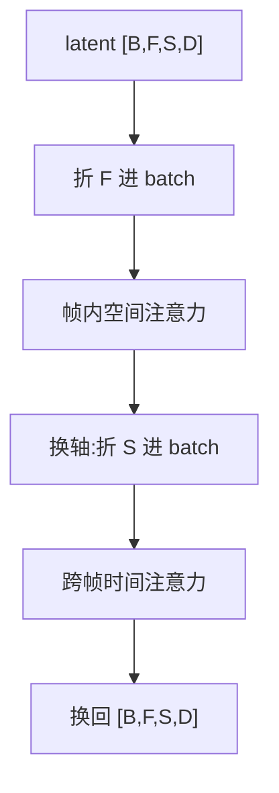

# 时空注意力

一句话:视频比图像多一根时间轴,于是「哪些 token 之间允许直接算注意力」从一个默认答案(全都可以)变成了必须显式做的设计决策——本篇讲这一刀怎么切:完整三维、分解时空、3D 窗口三种切法的形状、代价、表达力损失和实现坑。

注意力与 softmax 本身的机制见 注意力基础 篇;patchify 与 adaLN 见 DiT 篇;视频生成的整体架构、路线选型与加速账本见 视频扩散架构 篇;潜空间的时空压缩率见 视频VAE 篇;长视频的漂移与记忆见 长视频一致性 篇。本篇只管注意力这一层。

## 一、先把形状摆清楚

### 骨干拿到的是什么

经过 VAE 压缩和 patchify 之后,扩散骨干拿到的是一个四维张量:

$$
x \in \mathbb{R}^{B \times F \times S \times D}
$$

$B$ 是 batch,$F$ 是 latent 帧数,$S = H_{\text{lat}} W_{\text{lat}} / p^{2}$ 是每帧的 token 数,$D$ 是隐藏维;整段视频的 token 总数 $N = F \cdot S$。可以把它想成一张 $F \times S$ 的网格:**一行是一帧,一列是一个空间位置在时间上的轨迹。所谓「切注意力」,切的就是这张网格里哪些格子之间允许直接算分数。**

记住一组量级(取 视频扩散架构 篇里 49 帧 480×720 那组形状):$F = 13$、$S = 1350$、$N = 17550$。**这里有一个贯穿全篇的不对称:$F \ll S$,时间轴比空间轴短两个数量级。** 后面所有取舍都是从这条不对称长出来的。

### 三种切法可以写成同一个式子

无论怎么切,每个 query token 都只对一个大小为 $M$ 的集合算注意力,总代价是

$$
\text{FLOPs} \;\propto\; N \cdot M \cdot D
$$

$M$ 就是「一个 token 一步能直接看见多少个 token」,也就是它的**一跳感受野**。切法之间的全部差别就在 $M$ 取什么:

| 切法 | 每个 token 直接看见谁 | $M$ | 代入上面那组形状的注意力量级 |
|---|---|---|---|
| 完整三维(联合时空) | 全部 $N$ 个 | $N = FS$ | $3.1 \times 10^{8}$ |
| 帧内空间注意力 | 同一帧的 $S$ 个 | $S$ | $2.4 \times 10^{7}$ |
| 跨帧时间注意力 | 同一空间位置的 $F$ 个 | $F$ | $2.3 \times 10^{5}$ |
| 分解时空(上面两步都做) | 先同帧、再同位置 | $S + F$ | $2.4 \times 10^{7}$ |
| 3D 窗口(取 $4 \times 8 \times 8$) | 同窗口内的 $fhw$ 个 | $fhw$ | $4.5 \times 10^{6}$ |

> 🖼️ 占位:$F \times S$ 网格上三种切法各自的可见集合示意——完整三维铺满整张网格,分解是「一整行 + 一整列」的十字,3D 窗口是一块小矩形

### 分解到底能省多少,上限在哪

把完整三维和分解相除:

$$
\frac{N^{2}}{F S^{2} + S F^{2}} \;=\; \frac{FS}{F + S}
$$

读法:**省下的倍数是 $F$ 和 $S$ 的调和平均的一半,被短的那一边卡死。** 因为 $F \ll S$,这个值约等于 $F$ 本身——13 个 latent 帧,分解最多省 13 倍(和 视频扩散架构 篇算出来的一致),**把分辨率提到 4K 也不会更省,因为分子分母里的 $S$ 会一起长**。想再往下压,只能靠窗口或稀疏把 $M$ 直接摁小。

反过来说也成立:**帧数越多,分解越划算**——生成 10 秒 241 帧($F \approx 61$)时能省约 58 倍,这也是长视频几乎必然要动注意力结构的原因。

## 二、分解时空:两次小注意力

### 它是靠 reshape 实现的,不是靠 mask

这是本节最该记住的一条,也是最常答错的一条。分解的实现不是「在 $N \times N$ 的分数矩阵上盖一张块对角 mask」,而是**把不参与的那一维折进 batch 轴**:

```python
# x: [B, F, S, D]
B, F, S, D = x.shape
# 空间注意力:把帧折进 batch,每帧内部各做各的全注意力
h = attn_s(x.reshape(B * F, S, D)).reshape(B, F, S, D)
# 时间注意力:把空间位置折进 batch,每个位置沿时间做注意力
h = h.permute(0, 2, 1, 3).reshape(B * S, F, D)      # 换轴,这一步是真搬运
h = attn_t(h).reshape(B, S, F, D).permute(0, 2, 1, 3)
```



**为什么必须是 reshape 而不是 mask?因为 mask 不省算力。** 掩码是在算完 $QK^{\top}$ 之后把非法位置置成 $-\infty$ 再过 softmax(见 注意力基础 篇),那张 $N \times N$ 的分数矩阵该算的一个没少。reshape 则是从形状上就没生成过那些对齐——分数矩阵变成 $B \cdot F$ 个 $S \times S$ 的小块,总元素数直接从 $N^{2}$ 掉到 $FS^{2}$。**mask 只改表达力,reshape 才改复杂度**,除非你的 kernel 支持块稀疏、能真的跳过整块不算。

真正需要 mask 的只有一处:**batch 内帧数或分辨率不齐**,短样本 padding 到最长,这时要一张 padding mask 屏蔽补位 token。

### 两种排布顺序

空间在前还是时间在前,两种排布都有人用(把时空注意力拆成两步这件事本身,在视频理解侧由 TimeSformer 的 divided space-time attention 和 ViViT 的分解自注意力系统研究过)。从可达性上看两种顺序等价,画一下就清楚:

- 先空间后时间:$(t_1, p_1) \to (t_1, p_2) \to (t_2, p_2)$
- 先时间后空间:$(t_1, p_1) \to (t_2, p_1) \to (t_2, p_2)$

**一个「空间 + 时间」子层对,不管什么顺序,都正好够让任意两个 token 走通一条两跳的路。** 差别在别处:先做空间意味着时间注意力吃到的是**已经聚合过帧内上下文的表示**,更容易判断「这一帧整体在往哪动」;先做时间则让空间注意力吃到运动信息。工程上更常见的是空间在前,因为它天然对得上第五节的「从图像模型充气」——原来的空间块原样留着,时间层往后插。

### 表达力损失:跨帧交互只能间接发生

完整三维里,$(t_1, p_1)$ 可以直接对 $(t_2, p_2)$ 打一个注意力权重。分解之后这条边没了,信息必须借道一个中转 token,而中转 token 携带的是**它自己那一行/那一列的混合表示**,不是 $(t_1, p_1)$ 想传的那份内容。这就是 视频扩散架构 篇说的「跨帧交互只能间接发生」的具体含义:

1. **一条边被拆成两次加权的乘积**,注意力权重的表达力从「任意 $N \times N$ 矩阵」降级成「行秩 × 列秩」的组合,能表达的对应关系严格变窄。
2. **时间注意力隐含一个很强的假设:跨帧交互发生在同一空间位置。** 这个假设在镜头静止、物体微动的场景下基本成立;一旦有大幅运动或相机平移,同一个物体在第 $t_1$ 帧和第 $t_2$ 帧落在**不同的空间位置**上,而时间注意力这一支恰恰只连接同位置的 token——它根本看不到那个物体。补救只能靠空间层把信息横向搬过去,多绕一跳、多一次稀释。

所以取舍规律很干脆:**运动幅度越大、相机移动越多,分解的损失越明显**;近年从头训的视频基座(如 CogVideoX)明确选择完整三维注意力,理由就是分解在大运动上兜不住。

## 三、3D 窗口与移位

### 窗口怎么划

把 latent 的 $(F, H, W)$ 切成一个个不重叠的小立方体 $(f, h, w)$,注意力只在立方体内部做。每个 token 的 $M = fhw$,总代价 $N \cdot fhw$,**对 $N$ 是严格线性的**——这是它比分解更能扛长视频的原因。

顺带把三者的关系说穿:**分解就是窗口划得极端的特例**。帧内空间注意力 = 窗口取 $(1, H, W)$,跨帧时间注意力 = 窗口取 $(F, 1, 1)$。分解胜在这两个极端窗口的方向正交、合起来能覆盖整张网格;3D 窗口则是在两个极端之间取一个折中的长方体。

### 不移位就是死结

固定窗口有一个致命问题:**每一层的分块方式一模一样,分属相邻两个窗口的 token 堆多少层都永远看不见对方。** 这不是「感受野长得慢」,是根本不增长——等于把一段视频切成了几段互不相干的小视频,接缝处必然出现块状不连续。

移位窗口(shifted window,Swin 一系的做法)就是为这个而生:**隔一层把整个窗口划分沿三个轴各平移半个窗口** $(\lfloor f/2 \rfloor, \lfloor h/2 \rfloor, \lfloor w/2 \rfloor)$,上一层的窗口边界就落到这一层某个窗口的肚子里,跨界的两个 token 在这一层同框。

### 边界怎么接

移位之后边缘会多出一圈不满的窗口,两种接法:

| 做法 | 怎么处理 | 代价 |
|---|---|---|
| padding + mask | 边缘补齐到整窗,用 mask 屏蔽补位 token | 简单;但窗口数量变多,算力和显存跟着涨 |
| 循环移位 + 掩码 | 移出去的一条从另一端卷回来,窗口数量不变,算完再卷回去 | 算力不变;但一个窗口里会混进空间上不相邻的 token,**必须配 mask 屏蔽这些非法配对** |

第二种是主流,因为它保住了窗口数量。**在视频上用它有一个额外的坑:时间轴循环卷动会把最后一帧和第一帧塞进同一个窗口**,这是彻底的错误配对(视频不是循环的),mask 必须覆盖到时间轴,漏掉就会出现「结尾内容渗回开头」这类怪异现象。

### 感受野要堆多少层

一层不移、一层移,每两层时间维大约扩一个窗口 $f$。要让首尾帧互相看得见,大致需要

$$
L \;\approx\; 2 \cdot \frac{F}{f}
$$

层带窗口的块。$F = 13$、$f = 4$ 时约 7 层——这是个粗略估计,不是严格下界。结论是:**窗口注意力和浅骨干互斥**,层数不够,长程一致性就没有任何架构通路可走。这也解释了为什么窗口更常出现在高分辨率、深骨干的配置里,而不是用来给小模型提速。

> 🖼️ 占位:相邻两层的 3D 窗口划分对比——第 L 层规则分块,第 L+1 层沿三轴各移半窗,标出跨界 token 在新划分里同框

## 四、时间轴的方向:能不能流式出帧

空间注意力永远是双向的(一张图里没有先后),**因果性只加在时间轴上**。答成「整个注意力改成下三角」是常见错答。

| | 双向时间注意力 | 因果时间注意力 |
|---|---|---|
| 掩码 | 无,$F \times F$ 全连接 | $F \times F$ 下三角 |
| 第 $t$ 帧看得到 | 全部帧,包括未来 | 只有 $1..t$ |
| 一致性来源 | 整段联合去噪,首尾帧互相约束,身份一致性接近免费 | 靠模型自己记住历史,误差沿时间累积 |
| 能否流式出帧 | 不能,必须整段算完 | 能,生成一帧吐一帧 |
| 时间维 KV 复用 | 无 | 时间那一支的历史 K/V 可以缓存复用 |
| 典型场景 | 离线出片、固定时长片段 | 交互式生成、无限延长、世界模型 |

**什么时候必须因果?** 只有一个判据:**下一帧的内容取决于一个此刻还不存在的输入**。游戏、数字人、动作条件的世界模型都属于这类——用户的操作还没发生,未来帧在语义上就不能被提前定死(这条线见 视频世界模型 篇)。反过来,离线出一段 5 秒广告片,双向永远更好,因为它白拿了全局约束。

两个必须一起说的追问:

- **因果性要全链路一致才有意义。** 时间注意力改成了下三角,但 VAE 的时间卷积如果是双向的,编码第一个 latent 帧时仍然要看未来的原始帧,流式就在入口断了。这就是视频 VAE 普遍做成**因果**结构的原因,也是帧数常凑成 $4k+1$ 的来源(压缩率与整除关系见 视频VAE 篇、视频扩散架构 篇)。
- **因果不等于自回归。** 因果时间注意力只是限制了可见范围,一段里的所有帧仍然可以在同一次前向里被联合去噪;真正让它变成流式的,是配套让不同帧处在不同噪声档位的训练方式(Diffusion Forcing 一类,路线对比见 视频扩散架构 篇)。

## 五、从图像模型充气:时间层插在哪、怎么初始化

拿一个训好的文生图模型改成视频模型,叫 inflation(充气)。动作只有两步。

**第一步,插层。** 原来每个块是「空间自注意力 → cross-attention → FFN」,在它后面追加一个时间子层。时间子层的形状变换就是第二节那两行 permute + reshape。有的实现除了时间注意力还会插一个 $3 \times 1 \times 1$ 的时间卷积——这和把 $3 \times 3 \times 3$ 三维卷积拆成 $1 \times 3 \times 3$ 空间卷积加 $3 \times 1 \times 1$ 时间卷积是同一个思路(Make-A-Video 的伪三维卷积),**卷积侧的分解和注意力侧的分解是同一件事的两种实现**。

**第二步,零初始化。** 把时间子层**输出投影的权重置零**,配上残差连接,这个子层在训练第 0 步的输出恒为 0,整个网络严格退化成原来的图像模型逐帧跑。

**为什么非零初始化不行?** 因为一个随机初始化的注意力层会往每个 token 的残差流里注入一份与内容无关的噪声,而后面几十层都是按原分布训好的,第一步的 loss 就会炸,预训练画质被打崩,后续要花很多步才爬得回来。零初始化让模型从「一个已知很好的解」出发,把时间建模当作增量学。这一招在别处见过很多次:ControlNet 的零卷积、adaLN-Zero、LoRA 的 $B$ 矩阵,都是同一个家族(见 DiT 篇)。

**训练策略两条**:

- **冻结空间层,只训时间层**——得到的时间层是一个可插拔的「运动模块」,能接到同一基模的不同风格权重上(AnimateDiff 走这条)。代价是空间层从没见过视频,画面细节与运动的配合上限被锁死。
- **全解冻联合微调**——质量更高,但权重会漂离原模型,社区基于原模型的 LoRA、ControlNet 就不再兼容了。

**充气路线的结构性代价**,和第二节的表达力损失是同一件事:空间和时间被人为割在两个子层里,跨帧交互天然是两跳的。所以它适合「给已有图像模型低成本加视频能力」,不适合追求大运动的基座(路线取舍见 视频扩散架构 篇)。

## 六、实现坑与选型

### 理论省 13 倍,实测远达不到

分解的 FLOPs 账很漂亮,兑现率却经常只有理论值的一小半。三个原因,按影响排:

1. **换轴是真搬运。** `x.reshape(B*F, S, D)` 在 $[B, F, S, D]$ 连续布局下只是合并相邻两维,是零成本的 view;但 `permute(0,2,1,3)` 之后再 reshape 必须物化一份连续副本——**整个激活张量被完整读一遍、写一遍**,每层来回两次。这项是纯访存,不产生任何 FLOPs,却要按 $B \cdot N \cdot D$ 的量级吃带宽,乘上几十层非常可观。
2. **时间注意力的形状对 GPU 极不友好。** 它的序列长度只有 $F$(十几),batch 却膨胀到 $B \cdot S$(上千)。每个注意力实例的 $QK^{\top}$ 是一个十几乘十几的小矩阵,算术强度极低,**这一支基本是访存受限的**,FLOPs 省了不代表时间省了(判据见 Roofline与Bound分析 篇)。表里那个 $2.3 \times 10^{5}$ 看着可以忽略,实际墙钟占比远高于它。
3. **kernel 数量翻倍。** 一个大注意力变成两个,归一化、残差、launch 开销都乘二;短序列那一支还很难吃到 FlashAttention 的完整收益(kernel 侧见 FlashAttention 篇)。

结论:**分解在长视频(帧数多、$N$ 大)上收益是实的;在短片段上很可能白折腾**——省下的 FLOPs 抵不掉多出来的搬运。

### 位置编码要跟着切法走

完整三维注意力必须用能同时表达三个轴的位置编码,常见做法是把隐藏维分成三组分别编码 $(t, h, w)$ 的三维 RoPE(机制见 RoPE 篇)。分解反而更简单:空间层只需要 $(h, w)$,时间层只需要 $t$,两边各管各的。窗口注意力则通常用窗口内的相对位置偏置。**切法一改,位置编码必须跟着改**,这是移植时最容易漏的一处。

### 选型表

| 切法 | 复杂度 | 跨帧交互 | 什么时候用 |
|---|---|---|---|
| 完整三维 | $N^{2} = F^{2}S^{2}$ | 一层直达 | 从头训的基座;片段短、运动大、相机会动 |
| 分解时空 | $N(F + S)$ | 一个块内两跳,且假设同位置 | 帧数多、运动温和;从图像模型充气;算力紧 |
| 3D 窗口 + 移位 | $N \cdot fhw$ | 要堆到约 $2F/f$ 层 | 高分辨率长片段、深骨干;局部纹理为主 |
| 因果时间(可叠加在上面任一种) | 时间那一支约减半 | 只看历史 | 流式出帧、交互式、无限延长 |

三条经验:**短片段别急着分解**(收益被搬运吃掉);**运动是分解的敌人**(同位置假设先失效);**窗口必须配移位和足够层数**,否则是把视频切成了几段。更通用的稀疏注意力谱系(静态模式与内容自适应 top-k)见 稀疏注意力 篇,它和这里的时空切法是正交的两个轴。

## 七、面试考点串联

| 高频问法 | 本文哪一节 |
| --- | --- |
| 视频里的注意力有哪几种切法?各自贵在哪?(补充题) | 一(统一算式 + 量级表) |
| 分解时空注意力具体怎么实现的?为什么是 reshape 不是 mask?(补充题) | 二(mask 不省算力) |
| 分解之后跨帧交互是怎么发生的?为什么大幅运动最先坏?(补充题) | 二(两跳 + 同位置假设) |
| 空间注意力和时间注意力,谁先谁后有区别吗?(补充题) | 二(可达性等价,表示内容有别) |
| 分解最多能省多少?把分辨率提上去会更省吗?(补充题) | 一($FS/(F+S)$,被 $F$ 卡死) |
| 3D 窗口怎么划?不移位会怎样?移位后边界怎么接?(补充题) | 三 |
| 窗口注意力要堆多少层才能让首尾帧看见对方?(补充题) | 三(约 $2F/f$ 层) |
| 时间注意力做成因果的会怎样?什么场景下必须因果?(补充题) | 四(判据 + 全链路一致) |
| 时间轴改因果了,空间注意力要不要也改?(补充题) | 四(不改,空间永远双向) |
| 把图像模型充气成视频模型,时间层插在哪、怎么初始化?不零初始化会怎样?(补充题) | 五 |
| 分解理论上省十几倍,为什么实测差很多?(补充题) | 六(换轴搬运 + 短序列访存受限) |
| 换了注意力切法,还有什么必须跟着改?(补充题) | 六(位置编码) |

整体成本账与加速手段清单见 视频扩散架构 篇;这里只回答「注意力这一层怎么切」。

## 相关文献

- Is Space-Time Attention All You Need for Video Understanding?(TimeSformer,divided space-time attention)— [arXiv:2102.05095](https://arxiv.org/abs/2102.05095)
- ViViT: A Video Vision Transformer(分解编码器与分解自注意力的系统对比)— [arXiv:2103.15691](https://arxiv.org/abs/2103.15691)
- Swin Transformer: Hierarchical Vision Transformer using Shifted Windows(移位窗口与循环移位掩码)— [arXiv:2103.14030](https://arxiv.org/abs/2103.14030)
- Video Swin Transformer(3D 窗口与时间轴上的移位)— [arXiv:2106.13230](https://arxiv.org/abs/2106.13230)
- Make-A-Video: Text-to-Video Generation without Text-Video Data(伪三维卷积与时间层)— [arXiv:2209.14792](https://arxiv.org/abs/2209.14792)
- Align your Latents: High-Resolution Video Synthesis with Latent Diffusion Models(图像模型充气路线)— [arXiv:2304.08818](https://arxiv.org/abs/2304.08818)
- AnimateDiff: Animate Your Personalized Text-to-Image Diffusion Models without Specific Tuning(可插拔运动模块)— [arXiv:2307.04725](https://arxiv.org/abs/2307.04725)
- Latte: Latent Diffusion Transformer for Video Generation(潜空间 DiT 里几种时空注意力排布的对比)— [arXiv:2401.03048](https://arxiv.org/abs/2401.03048)
- CogVideoX: Text-to-Video Diffusion Models with An Expert Transformer(选用完整三维注意力的理由)— [arXiv:2408.06072](https://arxiv.org/abs/2408.06072)
- Diffusion Forcing: Next-token Prediction Meets Full-Sequence Diffusion(逐帧不同噪声档位的因果生成)— [arXiv:2407.01392](https://arxiv.org/abs/2407.01392)
