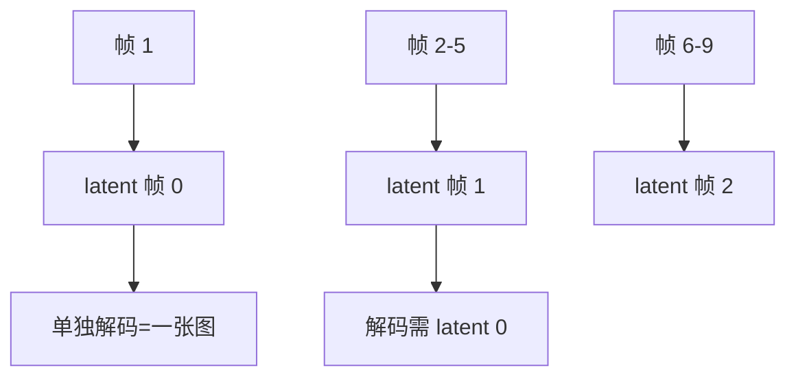

# 视频VAE

一句话:视频 VAE 是视频生成栈脚下那块**带时间维的地板**——它把一段视频压成时空 latent,一头决定骨干要处理多长的序列(所有成本账的分母),另一头钉死了整条链路的画质与运动上限;而它和图像 VAE 的全部差别,都来自「相邻帧长得很像」这一件事。

本篇管**时间维怎么压、压多少、压完怎么解**。ELBO、重参数化、KL、向量量化、STE 与码本坍塌的机制全在 VAE 篇,本篇只用不重讲;离散 tokenizer 的谱系与选型见 图像Tokenizer 篇;视频生成的整体架构、路线之争与推理成本账见 视频扩散架构 篇;注意力怎么切见 时空注意力 篇,长片段的漂移见 长视频一致性 篇。

## 一、为什么不能逐帧套一个图像 VAE

最省事的想法是:拿 SD 那块现成的图像 VAE,把视频当成一叠图,一帧一帧过。这条路能跑通,但两头都亏。

**第一亏是码率白花。** 24 fps 下相邻两帧之间,通常只有很小一块区域真的变了,其余全是重复内容。逐帧编码等于把这份重复内容存了几十遍——用视频编码的话说,这是**全 I 帧编码**,同画质下的码率比带帧间预测的编码高得多。视频 VAE 存在的第一个理由就在这:**时间维是免费的压缩空间**,不用白不用。后面第二节会看到,这一维恰好能补上图像侧「潜通道从 4 涨到 16」丢掉的那部分压缩比。

**第二亏是闪烁,而且这一亏没法靠调参补。** 图像 VAE 的重建误差是输入的一个高频函数:输入挪动半个像素、传感器噪声抖一下,编码器输出就可能落到潜空间里另一侧,解码出来的纹理细节跟着换一副样子。单看任何一帧都挑不出毛病(误差本来就在感知阈值附近),但**把这些帧连起来播放,误差就成了一个在时间上乱跳的信号**——人眼对「同一空间位置上的亮度/颜色随时间抖动」极其敏感,于是静止的墙面开始呼吸、头发丝逐帧改走向、文字边缘一闪一闪。离散化会让这件事更糟:VQ 的输出是查表结果,码字索引一翻就是一次**跳变**,没有中间状态可言。

根因一句话:**逐帧 VAE 的损失函数里没有任何一项管「这一帧和上一帧的误差要不要长得像」**。误差在时间上独立,闪烁就是这个独立性的直接后果。所以视频 VAE 要做的不只是「顺便把时间也压了」,而是**把时间维接进感受野和损失里**,让相邻帧的重建结果彼此负责。

## 二、时间维怎么压:三种做法与形状账

### 三条技术路线

| 做法 | 时间维怎么进来 | 靠什么压时间 | 代价 |
|---|---|---|---|
| **图像 VAE + 时间层**(inflation) | 在原有 2D 块之间插时间卷积或时间注意力,空间权重直接继承 | **基本不压时间**,latent 帧数 = 输入帧数,时间层只负责把误差抹平 | 序列长度一点没省;好处是潜空间和图像模型兼容,能接着用图像权重 |
| **3D 卷积** | 卷积核在 $(t,h,w)$ 三个方向上同时滑 | 时间维放 stride 2 的下采样层,叠 $\log_2 T$ 次得到 $T$ 倍压缩 | 算力和显存随核的时间尺寸线性涨,而且必须从头训 |
| **时空 patchify** | 把 $(t,h,w)$ 的小立方体拍平成一个 token 送 Transformer | patch 的时间边长直接就是压缩率 | 感受野全局、上限高;短视频上样本效率不如卷积 |

第一行值得单独记,因为它是 **「插时序层」路线的一个隐藏代价**:Video LDM 这一代的做法是冻住编码器(保住和图像 LDM 一致的潜空间)、只把解码器在视频数据上微调,时间维一格没压。这也解释了为什么原生时空 DiT 那一代要重训 VAE——不重训就拿不到时间压缩,拿不到时间压缩,序列长度就下不来(两条路线之争见 视频扩散架构 篇)。

### 压缩率是三个旋钮的乘除

$$
\rho \;=\; \frac{3 \cdot T \cdot s^{2}}{C}
$$

读法:分子是「一个 latent 位置覆盖了多少个像素值」——$T$ 帧 × $s\times s$ 个像素 × RGB 三通道;分母 $C$ 是这个位置实际存了几个数。所以**压缩比 = 时间压 × 空间压 × 3 ÷ 潜通道数**,四个量里动一个,其余的就得跟着补。这条式子是后面所有取舍的记账本。

### 形状账:一段 49 帧到底压成多大

以 CogVideoX 一系常见的口径(3D 因果 VAE,**4 倍时间 × 8×8 空间**,16 个潜通道)为例:

| 环节 | 形状 | 元素个数 |
|---|---|---|
| 原始视频 | 49 帧 × 480 × 720 × 3 | $5.08\times10^{7}$ |
| VAE 编码后 | 13 × 60 × 90 × 16 | $1.12\times10^{6}$ |
| 压缩比 | — | **约 45×** |

按公式算是 $3\times4\times64/16 = 48$ 倍,实测 45 倍——差的那 6% 全花在首帧上(第三节讲为什么首帧要单独占一格)。

把它和图像侧并排,结论很尖锐:

| 口径 | 时间压 | 空间压 | 潜通道 | 元素压缩比 |
|---|---|---|---|---|
| SD 1.x 一代图像 VAE | 1 | 8×8 | 4 | 48× |
| SD3 一代图像 VAE | 1 | 8×8 | 16 | **12×** |
| CogVideoX 一系视频 VAE | 4 | 8×8 | 16 | **48×**(不含首帧开销) |
| LTX-Video | 8 | 32×32 | 128(反推) | 论文自报 **1:192** |

**图像侧为了重建质量把潜通道从 4 提到 16,压缩比掉到原来的四分之一;视频侧靠 4 倍时间压缩,正好把这一刀补了回来。** 这就是「时间维是免费压缩空间」的量化版本。最后一行是另一种极端:LTX-Video 报的是 32×32×8 的时空下采样、1:192 压缩,两个数代进上面的公式反推,潜通道数是 $3\times8\times32^{2}/192 = 128$——**压缩率顶到 192 倍时,通道数被迫从 16 一路加到 128**,因为每个 latent 位置要装的信息实在太多了。

## 三、因果视频 VAE:首帧为什么单独占一格

### 因果的意思和它的三个红利

**因果(causal)指的是时间方向上的单向性:第 $t$ 个 latent 帧只允许看第 $t$ 帧及更早的输入帧,不许看未来。** 实现上就一件事——3D 卷积在时间维**只往左边补 padding**(通常复制首帧),空间维照旧对称补。就这一处改动,换来三个红利:

- **图生视频**。首帧不与任何其他帧混合,所以它的 latent 就是一张干干净净的图像编码。I2V 时把用户给的那张图过编码器,得到的 latent 可以直接放进序列第 0 格当条件(接口写法见 视频扩散架构 篇)。非因果 VAE 做不到:它的第 0 个 latent 帧里混了后面几帧的信息,而那几帧还不存在。
- **图像与视频共用一套 tokenizer / 潜空间**。单张图 = 长度 1 的视频,编码结果就是一个 latent 帧,于是图像数据和视频数据可以进同一个模型联合训练。MAGVIT-v2 就是靠这条让图像和视频共用一个词表。
- **流式编解码**。因果意味着算第 $t$ 块时不需要等后面的数据,可以边收边出;解码同理(第六节讲这对显存意味着什么)。

### 那个整除关系是怎么来的

$$
F_{\text{lat}} \;=\; \frac{F-1}{T} + 1
$$

读法:第一帧**不参与时间下采样**——它要是被下采样,就必须和后面几帧一起卷,那就看到未来了,因果性当场破掉。所以它单独占一个 latent 帧;剩下的 $F-1$ 帧才按每 $T$ 帧压 1 帧走。式子要成立,$F-1$ 必须被 $T$ 整除,于是 $T=4$ 时合法帧数是 $4k+1$:**49、81、129 这些数不是玄学,是被这条整除关系卡出来的**。

图里最右两个节点是重点:**latent 0 可以脱离整段独立解码,而 latent 1 之后的每一块解码时都要用到前面的时间上下文**——这正是流式解码要缓存什么的答案。

代价也要说清:因果把时间感受野砍掉一半,同样的核尺寸下,一个 latent 帧能参考的输入帧变少,**纯重建指标通常略逊于双向的同尺寸模型**。这笔账几乎所有视频基座都认了,因为上面三个红利里随便哪一个都比那点重建指标值钱——这也是一个典型的「不该只看 VAE 自身指标」的例子。

## 四、压缩率的天花板:为什么不能往上顶

「压得越狠序列越短、生成越便宜」是对的,但这条曲线有三个刹车,而且它们是从不同方向踩的。

### 刹车一:运动被平均成拖影

$$
d \;=\; \frac{v \cdot T}{\text{fps}}
$$

读法:$v$ 是物体在画面上的速度(像素/秒),$T$ 是时间压缩率,所以 $d$ 是**同一组 latent 所覆盖的那几帧里,物体总共挪了多少像素**。拿它去比空间压缩率 $s$:$d \ll s$ 时这段运动在潜空间里几乎没动位置,解码器有把握复原;$d$ 一旦超过 $s$,同一个潜位置在这几帧里装的是几份不同内容,而**重建损失的最优解是把这几份平均**——出来就是拖影和运动模糊。这和 VAE 篇讲的「MSE 生成糊」是同一条原因,只不过发生在时间轴上。

这不是一条硬阈值(解码器有跨位置的感受野,能靠上下文补一部分),但 **$d/s$ 这个比值就是拖影风险的正确排序量**:把 $T$ 从 4 提到 8,风险直接翻倍。它还解释了一个很实用的现象——**同一个 VAE,慢镜头和访谈画面能扛住更高的时间压缩率,体育、爆炸、快速摇镜扛不住**,所以压缩率必须按目标内容分布定,不能只看数据集平均指标。

### 刹车二:重建上限就是生成上限

解码器还原不出来的东西,上面的扩散模型再强也补不回来——这条在 VAE 篇已经讲过,**视频侧只是把受害者名单加长了**:图像侧是小字、密集纹理、远景人脸;视频侧再加上高速运动的边缘、细长物体(栏杆、发丝、雨丝)的跨帧位置。排查生成质量的第一步永远是**把真视频过一遍编码再解码**,重建就已经糊/闪的,别再去调采样器和提示词。

### 刹车三:省下来的序列长度会被下游吃回去

这条最容易被漏掉。压缩率提高一倍,序列短一半、注意力便宜四倍,但**每个 latent 承载的信息翻倍,潜空间的分布变得更复杂、更难拟合**。结果常常是:VAE 的 rFID 只掉了一点点,下游生成模型却要更大的容量或更多的训练步才能追平原来的质量,省下的算力又还回去了。

所以判据必须是端到端的:**固定总算力预算,比最终生成质量,而不是比 VAE 的重建指标**。VAE 篇里 LDM 的那个观察在视频侧同样成立——重建更好的一阶段模型,下游生成未必更好。顺带一条工程结论:**换 VAE = 潜空间的定义变了 = 下游扩散权重全部作废**,必须重训,所以压缩率是项目开工前就得定死的参数,不是后期能调的旋钮。

## 五、训练目标与时间一致性:判别器必须看时间维

### 四项损失各管什么

视频 VAE 的损失和生产级图像自编码器同构,只是每一项都要长出时间维:

| 项 | 管什么 | 去掉它会怎样 |
|---|---|---|
| 像素重建(L1 / L2) | 整体结构与色彩对齐 | 训不起来;但单靠它出的重建必然糊(原因见 VAE 篇) |
| KL 正则 **或** VQ 量化项 | 约束潜空间的尺度/离散化(机制全在 VAE 篇) | 连续侧数值尺度失控;离散侧没有 token 可给自回归模型 |
| 感知损失(LPIPS 一类) | 把「像不像」从逐像素改成特征级,救回高频纹理 | 纹理被 MSE 平均掉,细节发虚 |
| **时间维对抗损失** | 判别真假的依据里包含运动是否自然 | **每帧都像真图,连起来抖**——闪烁的直接来源 |

### 判别器为什么非看时间维不可

这是本节的核心问法,答案是一句对抗博弈的推理:**2D patch 判别器只看单帧,它对「这一帧和上一帧对不对得上」完全无感**;于是生成器可以采取一个既省力又高分的策略——每帧各自把纹理做得像真的,帧与帧之间怎么跳它无所谓。**这个策略恰好就是闪烁的定义。** 判别器看不见的失败模式,对抗训练就不会去修。

把判别器换成 3D 的(卷积核跨帧,或者干脆在时间维上取 patch),它拿到的输入就是一小段时空立方体,「这段运动像不像真拍的」才第一次进入损失函数。Video LDM 这一代的做法就是**冻住编码器、用一个带时间维的判别器去微调解码器**——目标很明确:潜空间不动(否则图像模型的权重白训了),只让解码器学会输出时间上连贯的像素。

同族的还有一条更轻的手段:**时间正则项**,直接罚相邻帧重建误差的差分,或者用光流把第 $t$ 帧 warp 到 $t+1$ 再比对。它比对抗训练稳,但只能压住高频抖动,压不出「运动看起来对不对」这种高层判断,通常是两者叠用。

### 怎么评:逐帧指标看不出闪烁

和生成侧「逐帧算 FID 交不了差」是同一个道理,重建侧也有一套对应的陷阱:

| 指标 | 看什么 | 盲区 |
|---|---|---|
| 逐帧 PSNR / SSIM | 单帧保真 | 对闪烁**完全无感**;还偏袒糊的重建 |
| 逐帧 LPIPS / rFID | 单帧感知质量 | 同上,每帧都是好图就给高分 |
| rFVD(重建视频对原视频算 FVD) | 整体真实度,含运动 | 依赖动作识别特征网络,不宜单独用 |
| 光流 warping 误差 | 相邻帧一致性,直接量化闪烁 | 光流本身在遮挡和快速运动处不可靠 |

一条必须记住的**验收口径**:**重建指标要分「空间」和「时间」两栏分开报**。只报一栏都能被刷——只报逐帧指标,闪烁的模型照样满分;只报时间一致性,一个把画面糊成一片的解码器时间上最一致。这条和 VAE 篇里「码本利用率要空间与时间分开统计」是同一条纪律的两个面。

> 🖼️ 占位:同一段快速平移镜头,分别用 4× 与 8× 时间压缩的 VAE 重建,截取运动物体边缘的放大对照 + 同一像素列的时间切片图(闪烁在时间切片上表现为横向条纹)

## 六、解码显存墙、分块接缝与离散侧的额外约束

### 显存峰值在解码器,不在 latent

一个常见的错答是「latent 太大放不下」。算一笔:上面那段 49 帧 480p 的 latent 只有 $1.12\times10^{6}$ 个元素,BF16 下 2 MB 出头,**根本不是瓶颈**。瓶颈在解码器——它工作在**像素分辨率**上,而中间特征图带着几十上百个通道。按最后几层 128 通道估:$49\times480\times720\times128 \approx 2.2\times10^{9}$ 个元素,BF16 就是约 **4.3 GB,一层**。一段 720p 的解码峰值常常比整个去噪循环还高,这就是视频 VAE 必须分块解码的原因。

### 两种切法,两种接缝

| 切法 | 怎么做 | 接缝问题 | 能不能做到无缝 |
|---|---|---|---|
| **空间 tile** | 把 latent 按 $H\times W$ 切块,各块带重叠区解码,重叠处加权融合 | 归一化层(GroupNorm 一类)在不同 tile 上统计到的均值方差不同,**块之间出现色差/亮度块** | 不能完全消除,只能靠加大重叠区和统计量对齐缓解 |
| **时间 chunk** | 按 latent 帧切段解码 | 硬切会截断解码器的时间感受野,**块边界上闪一下** | **因果 VAE 可以做到无缝** |

最后一格是因果设计的第四个红利,值得说透:因果解码器算第 $k$ 块时,时间方向的依赖**只指向过去**,所以只要把上一块尾部的中间特征当作 cache 传进来,这一块的时间感受野就没有被截断,结果和整段一次性解码**在数值上等价**。非因果 VAE 做不到——它的每一块都还依赖未来帧,只能靠重叠区硬融,接缝必然留痕。**「因果 = 能流式、能续接、能无缝分块」这三件事是同一个性质的三种说法。**

### 离散侧:RVQ 在视频上要重新算账

如果地板走的是离散路线(视频离散 tokenizer 的谱系与选型见 图像Tokenizer 篇),视频比图像多两条约束,都来自帧间冗余:

- **第一层码本的利用率天然更低**。相邻帧内容高度重复,大量空间位置的编码器输出挤在一起,第一层量化就把绝大部分空间结构吃掉了,**时间变化的能量要到后面几层才轮得到**。所以层数按逐层残差能量定、固定码率下再调每层码本大小(判据见 图像Tokenizer 篇),照搬图像侧的层数配置多半浪费。
- **诊断必须空间与时间分栏**。一个总体码本利用率会同时盖住两种病:空间纹理欠拟合,和时间变化根本没被编码进去(后者的表现正是解码出来运动发死)。这条接的是 VAE 篇的监控口径——**多层要逐层统计,视频要再按空间/时间拆一次**。

顺带一句:**时间下采样做在量化之前还是之后,决定了量化器面对的残差谱**。先压时间再量化,冗余已经被卷积吃掉一部分,码本面对的是「已经去过相关」的信号;反过来则是让码本自己去承担时间去冗余,难得多。这也是主流视频 tokenizer 都把因果 3D 下采样放在量化器前面的原因。

## 七、面试考点串联

| 高频问法 | 本文哪一节 |
| --- | --- |
| 视频为什么不能直接逐帧过图像 VAE?闪烁是从哪来的?(补充题) | 一 |
| 视频 VAE 的时间维具体怎么压?一段 49 帧 480p 压完是多大?(补充题) | 二(三条路线 + 形状账) |
| 因果视频 VAE 是什么意思?为什么视频模型的帧数常是 49、81 这种数?(补充题) | 三(整除关系) |
| 因果性换来了什么?图生视频和流式解码为什么依赖它?(补充题) | 三(三个红利);六(无缝分块) |
| 时间压缩率能不能再往上翻一倍?代价是什么?(补充题) | 四(三个刹车) |
| 压缩率和潜通道数怎么配?只看 VAE 的重建指标够不够?(补充题) | 二(压缩率公式);四(刹车三) |
| 视频 VAE 的判别器为什么要看时间维?只用 2D 判别器会怎样?(补充题) | 五(对抗博弈那一段) |
| 视频 VAE 的重建质量怎么评?逐帧 PSNR 高是不是就没问题?(补充题) | 五(指标表 + 空间/时间分栏) |
| 一段 720p 视频解码时显存峰值在哪?分块解码会带来什么新问题?(补充题) | 六(显存账 + 两种接缝) |
| 视频离散 tokenizer 的 RVQ 层数和码本,比图像侧多考虑什么?(补充题) | 六(离散侧);谱系与选型见 图像Tokenizer 篇 |
| 换一个视频 VAE,下游扩散模型要跟着改什么?(补充题) | 四(刹车三末尾) |

## 相关文献

- Auto-Encoding Variational Bayes(VAE 与重参数化的原始工作)— [arXiv:1312.6114](https://arxiv.org/abs/1312.6114)
- Neural Discrete Representation Learning(VQ-VAE:量化与 STE)— [arXiv:1711.00937](https://arxiv.org/abs/1711.00937)
- Taming Transformers for High-Resolution Image Synthesis(VQGAN:感知损失 + patch 判别器的配方)— [arXiv:2012.09841](https://arxiv.org/abs/2012.09841)
- High-Resolution Image Synthesis with Latent Diffusion Models(潜空间地板与重建瓶颈)— [arXiv:2112.10752](https://arxiv.org/abs/2112.10752)
- VideoGPT: Video Generation using VQ-VAE and Transformers(3D 卷积 + 轴向注意力的视频 VQ-VAE)— [arXiv:2104.10157](https://arxiv.org/abs/2104.10157)
- Phenaki: Variable Length Video Generation From Open Domain Textual Description(时间维用因果注意力,支持变长视频)— [arXiv:2210.02399](https://arxiv.org/abs/2210.02399)
- MAGVIT: Masked Generative Video Transformer(3D 视频 tokenizer)— [arXiv:2212.05199](https://arxiv.org/abs/2212.05199)
- Language Model Beats Diffusion — Tokenizer is Key to Visual Generation(MAGVIT-v2:图像与视频共用一套词表)— [arXiv:2310.05737](https://arxiv.org/abs/2310.05737)
- Align your Latents: High-Resolution Video Synthesis with Latent Diffusion Models(冻编码器、用时间维判别器微调解码器)— [arXiv:2304.08818](https://arxiv.org/abs/2304.08818)
- Stable Video Diffusion: Scaling Latent Video Diffusion Models to Large Datasets — [arXiv:2311.15127](https://arxiv.org/abs/2311.15127)
- CogVideoX: Text-to-Video Diffusion Models with An Expert Transformer(3D 因果 VAE 与 4×8×8 口径)— [arXiv:2408.06072](https://arxiv.org/abs/2408.06072)
- LTX-Video: Realtime Video Latent Diffusion(32×32×8 下采样、1:192 压缩,解码器兼做最后一步去噪)— [arXiv:2501.00103](https://arxiv.org/abs/2501.00103)
- Towards Accurate Generative Models of Video: A New Metric & Challenges(FVD)— [arXiv:1812.01717](https://arxiv.org/abs/1812.01717)
