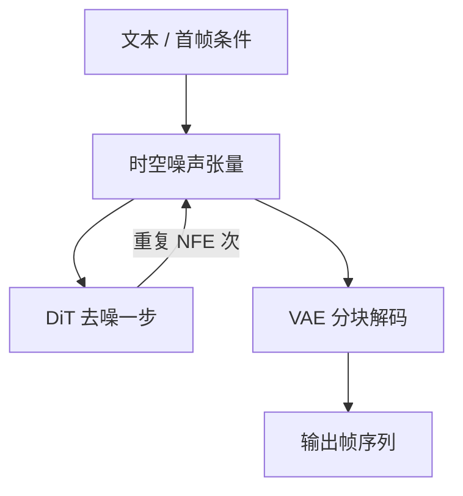

# 视频扩散架构

一句话:视频生成是在图像扩散上**再压一个时间维**——latent 从一张图变成一段时空张量,序列长度直接涨一到两个数量级,于是「时间维怎么进网络」和「怎么把推理成本压回可用区间」成了这个方向的两条主线。

本篇管**整体架构、路线选型和成本账**。加噪去噪与采样器见 Diffusion 篇,Transformer 骨干与 adaLN 见 DiT 篇,潜空间压缩的原理见 VAE 篇,图像侧的系统装配见 SD架构 篇;时空注意力具体怎么切见 时空注意力 篇,视频 VAE 的时序压缩细节见 视频VAE 篇,长视频的漂移与记忆手段见 长视频一致性 篇。

## 一、时间维怎么进网络

### 逐帧生成为什么不行

最朴素的想法是:用文生图模型跑 N 次,拼成视频。结果是**每一帧都好看,连起来全是闪烁**——人物换了张脸、衣服换了颜色、背景物体凭空出现又消失。原因很直接:扩散从随机噪声出发,**相邻帧的初始噪声独立,模型又没有任何机制知道上一帧长什么样**,于是它每次都在「所有符合这段文字的图像」里独立采一个样本。

视频要求的不只是每帧合理,还要求**物体身份、材质、光照、相机运动跨帧连续**——这是一个联合分布,不是 N 个边缘分布的乘积。所以视频模型的核心动作只有一个:**让时间维参与到网络的计算里去**,让第 t 帧的表示能看到别的帧。

### 两条扩展路线

| 路线 | 做法 | 优点 | 代价 |
|---|---|---|---|
| **插时序层**(inflation) | 拿训好的图像模型,在每个空间块后面插入时间注意力/时间卷积层,冻结或微调原权重 | 直接继承图像模型的画质与文本对齐能力,训练便宜;社区生态(LoRA、ControlNet)大部分能复用 | 时间层是后加的,空间与时间的交互被人为割开,大幅运动和相机移动容易糊 |
| **原生时空**(3D patch) | latent 沿时间和空间一起切成时空 patch,拍平成一条序列送进 DiT,注意力天然跨帧 | 空间与时间在同一层里交互,运动建模上限高;骨干代码就是标准 Transformer,直接吃序列侧的全部工程红利 | 序列长、算力贵,几乎必须从头训 |

Video LDM 和 Stable Video Diffusion 走的是第一条(SVD 由图像模型出发,先做图像预训练、再做视频预训练、最后在高质量小数据集上微调);Sora 之后,CogVideoX、HunyuanVideo、Wan 这一批走的是第二条。**截至 2026 年 9 月,新发布的视频基座基本都是原生时空的 DiT**,插时序层这条路主要留在「给已有图像模型加视频能力」这类低成本场景里。

### latent 的时空压缩形状:序列到底有多长

这是所有成本讨论的起点,必须能当场算。以 CogVideoX 这一系常见的口径为例——3D 因果 VAE 做 **4 倍时间 × 8×8 空间**压缩,骨干再按 2×2 做空间 patchify:

| 环节 | 形状 | 说明 |
|---|---|---|
| 原始视频 | 49 帧 × 480 × 720 | 8 fps 约 6 秒 |
| VAE 编码后 | 13 × 60 × 90 × 16 通道 | 因果 VAE:首帧单独成一个 latent 帧,其余每 4 帧压 1 帧 |
| patchify 后 | 13 × 30 × 45 = **17550 token** | 这才是骨干真正要处理的序列长度 |

对照一下图像侧:512×512、8 倍 VAE、patch 2 的 DiT 只有 $32\times32=1024$ 个 token。**同样的骨干,视频的序列长了约 17 倍;而全时空注意力是平方复杂度,那一项贵了约 290 倍。** 这一句就是「视频生成为什么这么贵」的全部答案。

注意两个容易被追问的点:

- **因果 VAE 的时间压缩不是整除**。第一帧不参与时间下采样(否则第一帧要看未来帧,破坏因果性),所以 $F_{\text{lat}} = (F-1)/T + 1$。这也是为什么视频模型的帧数常是 49、81 这种 $4k+1$ 的数——不是玄学,是被 VAE 的时间压缩率整除关系卡出来的。
- **时间压缩率不能随便调大**。压得越狠序列越短、越便宜,但重建上限跟着掉,快速运动会被抹成拖影(这个上限怎么定见 视频VAE 篇)。

### 文生视频与图生视频的接口差异

文生视频(T2V)的条件接口和图像侧基本一样:文本编码器出一串 token,走 cross-attention 或者和视觉 token 拼成联合序列,时间步走 adaLN(两种注入方式的取舍见 DiT 篇)。

图生视频(I2V)不一样,因为它的条件是**和输出逐像素对齐的**,压成一个全局向量会把布局信息丢光。三种接口,常常混用:

1. **通道拼接**:把首帧过 VAE 得到的 latent,沿通道维拼到噪声 latent 上。这要求改骨干的输入投影层通道数,所以 I2V 模型和 T2V 模型的权重通常不通用。
2. **语义条件**:再把首帧的 CLIP 图像嵌入走 cross-attention 送进去,补充「这是什么东西」这类高层语义。SVD 同时用了这两条。
3. **帧级 mask 条件**:把已知帧的干净 latent 直接放进序列,另给一路 0/1 mask 标明哪些帧是给定的。

第三种是现在更通用的写法,因为**一个接口能表达四类任务**:

```python
# x: 噪声 latent [B, F, C, H, W];cond: 已知帧的干净 latent,未知帧填 0
# mask: [B, F, 1, H, W],1 表示这一帧被给定
def build_input(x, cond, mask):
    # 沿通道拼接;骨干输入通道数 = C(噪声) + C(条件) + 1(mask)
    return torch.cat([x, cond * mask, mask], dim=2)

# mask 全 0 → 文生视频;mask[:, 0] = 1 → 图生视频(首帧)
# mask[:, :k] = 1 → 视频续写(第四节的分块生成靠它衔接);mask 首尾为 1 → 插帧
```

还有一类**微条件**值得单独记:SVD 把 `fps_id` 和 `motion_bucket_id` 当作可调参数喂给模型,推理时用来直接控制帧率和运动幅度。这个旋钮和第五节的评测悖论是同一件事的两面——运动幅度是被显式训进模型的一个自由度,不是白捡的。

## 二、三条路线之争:扩散 / 自回归 / GAN

### 机制与代价对照

| 维度 | 扩散 | 自回归 | GAN |
|---|---|---|---|
| 表示 | 连续 latent 时空张量 | 离散 token 序列(需先训视觉 tokenizer) | 连续,生成器一次输出整段 |
| 目标函数 | 去噪回归(有标准答案的监督题) | 下一 token 的交叉熵 | 生成器与判别器对抗 |
| 训练稳定性 | 最稳,几乎没有崩溃模式 | 稳,和语言模型同一套配方 | 最难,模式坍塌与训练发散是常态 |
| 训练并行度 | 高:随机抽噪声档位,全 batch 并行 | 高:teacher forcing 全序列并行 | 中:两个网络交替更新 |
| 推理开销 | NFE 次整段前向,**开销与序列长度成正比** | 逐 token 串行,token 数就是步数 | 单次前向,延迟最低 |
| 时序一致性 | 段内很好(全局注意力一次看完整段);跨段要额外机制 | 天然因果、可无限延长;**误差沿序列累积**,越长越漂 | 短片段可以,长片段历史上没打通 |
| 可控性 | 条件接口成熟(文本、首帧、深度、轨迹) | 与语言模型接口统一,适合交错的多模态条件 | 条件注入较弱 |

**没有通用赢家,排名不能脱离配置。** 同一条路线换个骨干规模、换个 VAE、换套数据,结论就翻转;论文里的横向对比通常也不是等算力对比。

### 为什么现在主流是扩散

三条理由,按重要性排:**训练信号密集且无偏**——扩散每个样本每步都有一个 MSE 标准答案(见 Diffusion 篇),不像 GAN 那样要跟一个同时在变的判别器博弈,而视频数据本来就脏、分布本来就宽,训练稳定性的价值被放大了;**整段并行生成、没有累积误差**——一段 49 帧在同一次前向里被联合去噪,第 1 帧和第 49 帧互相能看见,身份一致性是「免费」的,自回归则要靠模型自己记住 5 秒前的样子;**条件接口现成**——文本、首帧、深度、姿态、相机轨迹全都能塞进同一个去噪骨干。

代价也很集中:**NFE 次全序列前向**,这是第三节整章要处理的问题。

### 自回归没有死,而且在关键场景里更合适

自回归在视频上有两种活法:

- **纯离散**:先用视觉 tokenizer(如 MAGVIT 一系)把视频压成离散 token,再用一个语言模型预测下一个 token,VideoPoet 是代表。好处是文本、图像、视频、音频可以共用一套序列接口;代价是 token 数极大、逐个解码很慢,而且 tokenizer 的重建上限直接锁死画质(离散化路线的取舍见 图像Tokenizer 篇)。
- **自回归外壳 + 扩散内核**:帧与帧之间因果,帧内部用扩散去噪;不同帧还可以处在不同噪声档位,Diffusion Forcing 是这条的代表。这条路吃到了「可无限延长 + 流式出帧」的好处,又保住了扩散的画质。

**什么时候必须走因果路线?** 交互式生成——游戏、世界模型、实时驱动。这类场景要求「用户此刻的动作影响下一帧」,整段联合去噪在语义上就不成立,因为未来帧不能提前定死(这条线见 视频世界模型 篇和 动作条件与交互 篇)。

### GAN 变成了「最后一段」而不是「整条路」

MoCoGAN、StyleGAN-V 那一代把内容和运动分开建模,证明了单次前向出视频是可行的,但没解决长片段和文本可控性。现在 GAN 的位置变了:**对抗损失作为蒸馏的一部分,把多步扩散模型压成 1–4 步的生成器**(ADD 这一类做法)。这样既拿到了 GAN 的单次前向延迟,又不用从零面对对抗训练的不稳定——因为有一个已经训好的扩散老师在兜底。所以「扩散 vs GAN」今天的正确问法不是二选一,而是:**扩散负责训出分布,对抗负责把采样步数压到个位数**。

### 选型:按什么决定

| 场景 | 建议 | 为什么 |
|---|---|---|
| 高画质离线出片(广告、影视预演) | 扩散 DiT,步数给足 | 质量优先,延迟不敏感 |
| 交互式 / 实时(游戏、数字人) | 因果自回归,或蒸馏后的少步扩散 | 必须流式出帧、必须响应动作 |
| 端侧 / 强延迟约束 | 少步蒸馏 + 小模型 | 见第三节的端侧账 |
| 与语言模型统一的多模态系统 | 离散自回归 | 序列接口一致,便于交错条件 |
| 从零起步、算力有限 | 在图像模型上插时序层 | 复用画质,训练成本低一个数量级 |

### Sora 的公开信息到什么程度

必须把话说准,这是这道题的送分点也是失分点:**公开技术报告说清楚的只有两件事**——把压缩后的视频表示成**时空 patch**,以及用**扩散 Transformer** 处理这些 patch;报告还展示了训练算力增加带来的质量提升。

**没有公开的**:层数、隐藏维、注意力的具体布局(全时空还是分解)、VAE 的压缩率、训练数据构成与配方。所以「Sora 用了 XX 注意力」这类说法都是推测,面试时不能当事实讲。顺带一条常被追问的:**不能因为 Sora 用了 Transformer 就断言「Transformer 一定打败 U-Net」**。U-Net 的局部性与多尺度归纳偏置在小数据小算力下仍然占便宜,Transformer 赢在 scaling 可预测和序列抽象可复用(展开见 DiT 篇)。

### 三维表示能提供什么约束

NeRF、3DGS 这类三维表示能提供的是**几何一致性的硬约束**:场景被表示成一个三维结构,不同视角是同一个结构的渲染结果,所以视角切换时物体不会变形、不会闪。典型用法是把三维渲染结果当条件图(深度、法线、粗渲染)喂给扩散模型,或者反过来用生成结果去优化一个三维场景。

**但收益不是白拿的**:三维重建本身要求多视角一致的输入,而这恰恰是生成模型还没做好的事;引入三维表示还会增加一整套优化流程的开销。**是否融合、收益多大,取决于具体方法和数据,不能一般化断言**(表示本身见 NeRF 篇、3DGS 篇,多视角生成见 多视角扩散 篇)。

## 三、推理成本的账本

### 成本公式:三个可以分别砍的旋钮



$$
T_{\text{总}} \;\approx\; \text{NFE} \times \left( a\,N + b\,N^{2} \right), \qquad N \;\propto\; F_{\text{lat}} \times H_{\text{lat}} \times W_{\text{lat}} \big/ p^{2}
$$

读法:$N$ 是骨干序列长度;$aN$ 是逐 token 的部分(QKV 投影、FFN、时间调制),$bN^2$ 是时空注意力;NFE 是网络求值次数,等于**采样步数 × CFG 倍数**(开 CFG 就是 2)。**视频相对图像的成本爆炸,全部来自 $N$ 里多出来的 $F_{\text{lat}}$ 这一项**——它既线性放大第一项,又平方放大第二项。

### 视频比图像难在哪:四个维度

1. **序列长度**:帧数直接乘进 token 数,注意力再平方一次(上一节算过:17 倍序列 → 约 290 倍注意力算力)。
2. **激活显存**:序列长了,每一层的中间激活跟着长,而且扩散骨干每步都要完整跑一遍整段,没有 KV cache 那样的复用。
3. **质量维度变多**:图像只要好看,视频还要跨帧身份一致、运动自然、不闪烁。**这让「降分辨率换速度」这类图像侧的常规操作变得危险**——分辨率降下去,细小物体在潜空间里所剩无几,跨帧一致性首先崩掉。
4. **解码也贵**:VAE decoder 工作在像素分辨率上,一段 720p 视频的解码峰值显存常常比去噪循环还高,必须分块。

### 加速手段:各砍哪一项,牺牲什么

| 手段 | 砍公式里的哪一项 | 牺牲什么 |
|---|---|---|
| 更强的时空 VAE 压缩率 | $N$(线性 + 平方) | 重建上限下降,快速运动出拖影 |
| 加大 patch size | $N$(线性 + 平方) | 空间细节变粗,小物体、文字先坏 |
| 稀疏 / 窗口 / 分解时空注意力 | $bN^{2}$ 项 | 跨帧感受野变窄,大幅运动与长程一致性变差 |
| 少步求解器(DPM-Solver 一类) | NFE | 步数压太狠时误差没机会被后续步修正 |
| 一致性 / 对抗蒸馏到 1–4 步 | NFE | 多样性和细节下降,且要额外一轮训练 |
| 关掉 CFG(蒸馏进模型) | NFE 减半 | 文本贴合度依赖蒸馏质量 |
| 跨步特征缓存(DeepCache、注意力广播一类) | $a N + b N^2$ 的实际执行量 | 依赖相邻步特征变化足够小;运动剧烈的时段直接出错 |
| 关键帧 + 插帧两段式 | 主干只跑少量帧 | 插帧模型决定运动质量,复杂运动会飘 |
| FP8 / BF16、算子融合、编译 | 每步的常数因子 | 收益依赖硬件与形状;低精度误差沿迭代累积 |
| 序列并行多卡切 token | 单卡墙钟时间与显存 | 通信开销,小 batch 下扩展性有限 |

前四行是**结构与采样侧**,砍的是「本来要算多少」;最后两类是**系统侧**,砍的是「同样的计算跑多快」。两者正交,通常叠加使用(系统侧机制见 算子融合 篇、权重与激活量化 篇、并行策略 篇;采样与蒸馏侧见 Diffusion 篇、蒸馏 篇)。

表里第三行值得单独算一笔,因为它是最常被追的取舍:**完整三维注意力让每个 token 一次看到全部时空位置,代价是 $N^{2}$;把它拆成「帧内空间注意力 + 跨帧时间注意力」两步,代价降到 $F\!\cdot\!S^{2} + S\!\cdot\!F^{2}$**($F$ 是 latent 帧数,$S$ 是每帧 token 数,$N=F\cdot S$)。代入上面 49 帧那组形状($F=13$、$S=1350$),$3.1\times10^{8}$ 降到 $2.4\times10^{7}$,**便宜约 13 倍**。买单的是表达力:分解之后跨帧交互只能间接发生——两个不同帧、不同位置的 token 要经过至少两层才能互相影响,大幅运动和相机移动最先出问题。所以取舍规律是**帧数越多、运动越剧烈,分解的损失越明显**;具体怎么切、窗口怎么开见 时空注意力 篇。

### 一个不能照搬的结论

**PagedAttention 那套显存管理,不要直接搬到扩散视频模型上。** 它解决的是自回归解码时**逐 token 增长、长度不可预知**的 KV cache 碎片问题;而扩散骨干每一步都重算整段序列,**没有跨步保留的 KV cache**,张量形状从第一步起就是固定已知的。视频侧真正的显存问题是「单步激活峰值太高」和「解码峰值」,对应的手段是激活检查点、分块解码和序列并行,不是分页 KV(自回归侧的机制见 PagedAttention 篇)。同理,任何未公开模型的内部实现都不能当作事实引用。

### 端侧 10 秒 720p:怎么选

这类题考的是**先定约束、再排手段**,不是背清单。**第一步,把三个数问清楚**:目标帧率(12 fps 还是 24 fps,直接决定帧数是 121 还是 241)、可接受的最长等待(30 秒还是 5 分钟)、质量下限(能不能接受运动幅度小一点)。三个数没定,选型无从谈起。

**第二步,先算够不够得着**。720p、24 fps、10 秒 = 241 帧;按 4×8×8 的 VAE 和 2×2 patch 算,序列长度约 $61 \times 45 \times 80 \approx 2.2\times10^{5}$ token。朴素实现下单头注意力分数矩阵约 $4.8\times10^{10}$ 个元素,BF16 存下来约 96 GB——**所以视频侧不落分数矩阵的注意力实现不是优化项,是前提**(见 FlashAttention 篇);即便不落盘,$O(N^{2})$ 的计算量依然在那里。结论很硬:**端侧不可能一次性生成整段 10 秒**。

**第三步,按这个顺序上手段**:潜空间生成 + 尽量高的时空压缩率(砍 $N$)→ 小模型 + 少步蒸馏(1–4 步)+ 把 CFG 蒸馏进模型(砍 NFE)→ 分块生成,段间用上一段末帧做条件衔接(第四节)→ 设备支持的低精度 + 分块 VAE 解码 + 生成与解码流水化重叠 → 还是放不下就降帧率、降分辨率(720p 换 540p),或者改云端。

**报告口径必须钉死**:任何速度数字都要连同**分辨率、帧数、采样步数、是否开 CFG、模型规模、硬件型号**一起报。只说「快了 3 倍」而不给这六项,等于没说。

## 四、显存墙与分块生成

### 显存花在哪

视频侧的显存构成和图像侧不同——**权重不再是大头,激活才是**。因为序列长了一到两个数量级,而权重没变。三个峰值点:

- **去噪循环中的激活**:每层的 QKV、FFN 中间量都正比于 $N$。手段是激活检查点(用重算换显存)和序列并行。
- **latent 张量本身**:一段 720p 10 秒的 latent 约 $61\times90\times160\times16 \approx 1.4\times10^{7}$ 个元素,BF16 下单份才 28 MB——**它本身根本不是瓶颈**,瓶颈是它在几十层网络里展开出的那些中间量。这一条要说准,答成「latent 太大装不下」是常见的错答。
- **VAE 解码**:decoder 在像素分辨率上工作,中间特征图是 latent 的几十倍大,常常是整条链路的显存峰值。标准做法是**分块解码**——空间上切 tile、时间上切 chunk,带重叠区再融合;代价是 tile 接缝处可能出现轻微色差。

### 分块与滑窗:用什么换什么

单段能生成的长度被显存和注意力算力共同卡死,所以长视频一律要分段。三种形态:

| 形态 | 做法 | 主要问题 |
|---|---|---|
| 顺序分块 | 生成一段,拿末尾若干帧当条件生成下一段 | 误差逐段累积,画面缓慢漂移、色调偏移 |
| 滑动窗口去噪 | 窗口在时间轴上滑动,重叠区的去噪结果加权融合 | 重叠区带来额外算力;窗口外的信息看不见 |
| 队列式 / 对角去噪 | 队列里不同帧处在不同噪声档位,每步推进一帧,出一帧 | 训练时模型没见过「同一段里噪声档位不同」的输入,存在分布错位 |

**远距离依赖的架构层结论**:注意力的感受野被窗口/分段截断之后,超出窗口的历史信息在架构上就看不见了,只能靠条件帧这个窄通道传递。**所以长视频的一致性不是靠把窗口开大解决的**——那条路被平方复杂度堵死了,得靠显式的记忆与关键帧机制(这些内容层手段见 长视频一致性 篇)。

## 五、评测:两个必须一起看的指标

视频评测最核心的认知是:**不能用图像指标替代视频指标**。逐帧算 FID 完全看不出闪烁——每帧都是好图,拼起来是幻灯片,FID 照样很低。主流做法是三层一起看:

| 层次 | 常用手段 | 看什么 |
|---|---|---|
| 分布距离 | FVD(用视频动作识别网络的特征算 Fréchet 距离) | 整体真实度,对单帧画质和运动都敏感 |
| 多维度打分 | VBench 一类分解式评测 | 主体一致性、背景一致性、运动平滑度、动态程度、文本对齐等拆开报 |
| 人工偏好 | 成对比较 | 前两者都无法覆盖的审美与意图贴合 |

**最重要的一条陷阱:时序一致性和运动幅度是此消彼长的。** 一段几乎静止的视频,在「主体一致性」「背景一致性」「运动平滑度」上全都接近满分,因为帧与帧之间根本没变化。这就是为什么分解式评测必须**同时报一个动态程度指标**——只报一致性,等于奖励模型少动;只报动态程度,又会奖励乱动。

两个推论:看榜单要看**一致性与动态程度的组合**,单看任何一项都能被刷;调参时把 `motion_bucket_id` 这类运动旋钮往上调,一致性指标一定会掉,**这不一定是模型退化,可能只是滑到了权衡曲线的另一端**。

FVD 本身也有已知局限:它依赖一个在动作识别数据上训的特征提取网络,对该网络没见过的内容分布不敏感,也会被单帧画质带偏,**不宜作为唯一判据**。

## 六、面试考点串联

| 高频问法 | 本文哪一节 |
| --- | --- |
| 扩散、自回归、GAN 三条视频生成路线在结构、训练、推理和长视频一致性上差在哪?系统怎么选? | 二(对照表 + 选型表) |
| 视频生成的推理加速有哪些手段?结构、采样、系统三层各自的优缺点与适用条件? | 三(成本公式 + 手段表) |
| 视频生成相比图像生成,加速难点具体在哪几个维度? | 三(四个维度) |
| 端侧要跑 10 秒 720p 视频生成,技术选型思路是什么? | 三(端侧三步) |
| 长视频生成怎么处理远距离时序依赖和显存压力? | 四;内容层的记忆与漂移手段见 长视频一致性 篇 |
| 公开信息能说明 Sora 的 Transformer 路线到什么程度? | 二(时空 patch + DiT,其余未公开) |
| 分解时空注意力和完整三维注意力怎么取舍? | 三(手段表后的算力对比);具体切法见 时空注意力 篇 |
| NeRF 或 3DGS 能给视频生成提供什么约束?收益确定吗? | 二(三维表示那一节) |
| 视频质量怎么评?能不能逐帧算 FID 交差? | 五 |
| 为什么不能直接用文生图模型逐帧生成视频?(补充题) | 一 |
| 49 帧 480p 到底是多长的序列?帧数为什么常是 49、81 这种数?(补充题) | 一(形状表 + 因果 VAE 的整除关系) |
| 图生视频的条件是怎么接进网络的?和文生视频差在哪?(补充题) | 一(三种接口 + mask 写法) |
| 插时序层和原生时空 DiT,什么时候选哪个?(补充题) | 一(两条路线表) |
| 扩散视频模型能不能用 PagedAttention 管显存?(补充题) | 三(不能,没有跨步 KV cache) |
| 一段视频生成里显存峰值在哪?怎么压?(补充题) | 四 |
| 一致性指标很高,是不是就说明模型好?(补充题) | 五(静止视频刷分) |

## 相关文献

- Video Diffusion Models — [arXiv:2204.03458](https://arxiv.org/abs/2204.03458)
- Align your Latents: High-Resolution Video Synthesis with Latent Diffusion Models(插时序层路线)— [arXiv:2304.08818](https://arxiv.org/abs/2304.08818)
- Stable Video Diffusion: Scaling Latent Video Diffusion Models to Large Datasets — [arXiv:2311.15127](https://arxiv.org/abs/2311.15127)
- Video generation models as world simulators(Sora 技术报告)— https://openai.com/index/video-generation-models-as-world-simulators/
- CogVideoX: Text-to-Video Diffusion Models with An Expert Transformer(3D 因果 VAE 与时空压缩口径)— [arXiv:2408.06072](https://arxiv.org/abs/2408.06072)
- HunyuanVideo: A Systematic Framework For Large Video Generative Models — [arXiv:2412.03603](https://arxiv.org/abs/2412.03603)
- Wan: Open and Advanced Large-Scale Video Generative Models — [arXiv:2503.20314](https://arxiv.org/abs/2503.20314)
- MAGVIT: Masked Generative Video Transformer(离散视频 tokenizer)— [arXiv:2212.05199](https://arxiv.org/abs/2212.05199)
- VideoPoet: A Large Language Model for Zero-Shot Video Generation — [arXiv:2312.14125](https://arxiv.org/abs/2312.14125)
- Diffusion Forcing: Next-token Prediction Meets Full-Sequence Diffusion — [arXiv:2407.01392](https://arxiv.org/abs/2407.01392)
- MoCoGAN: Decomposing Motion and Content for Video Generation — [arXiv:1707.04993](https://arxiv.org/abs/1707.04993)
- Adversarial Diffusion Distillation(对抗蒸馏到少步)— [arXiv:2311.17042](https://arxiv.org/abs/2311.17042)
- DeepCache: Accelerating Diffusion Models for Free(跨步特征缓存)— [arXiv:2312.00858](https://arxiv.org/abs/2312.00858)
- Towards Accurate Generative Models of Video: A New Metric & Challenges(FVD)— [arXiv:1812.01717](https://arxiv.org/abs/1812.01717)
- VBench: Comprehensive Benchmark Suite for Video Generative Models — [arXiv:2311.17982](https://arxiv.org/abs/2311.17982)
