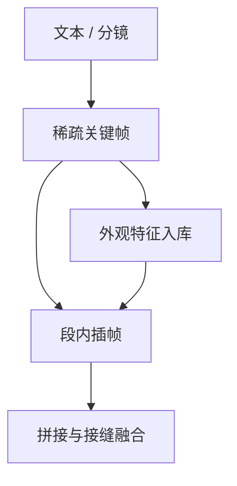

# 长视频一致性

一句话:视频一旦长过模型单次能生成的长度,画质通常不会崩,**崩的是身份、场景和镜头逻辑**——人脸慢慢变了、衣服换了颜色、光线偏了、镜头接不上;这篇讲这几件事各自怎么坏、误差为什么随时长放大,以及内容层能用哪些手段兜住。

本篇只管**内容层**。单段能开多长、分块/滑窗/队列三种形态的显存与算力账归 视频扩散架构 篇,注意力具体怎么切见 时空注意力 篇,latent 的时空压缩见 视频VAE 篇,加噪去噪与 CFG 见 Diffusion 篇。

## 一、「一致性」不是一件事

面试里最容易失分的一句话是「长视频一致性不好」——太笼统,追问一层就答不下去。**一致性至少是四件独立的事:坏法不同、手段不同、指标也不同**。

| 维度 | 要求什么 | 典型坏法 | 什么时候被发现 |
|---|---|---|---|
| **外观与身份** | 同一个人或物跨帧还是同一个 | 脸慢慢变、衣服换色、logo 变形、发型改了 | 把首尾两段拼在一起看 |
| **场景与光照** | 背景陈设、色温、曝光稳定 | 整段偏黄偏绿、墙上多出一扇门、阴影方向翻转 | 段与段的接缝处 |
| **运动连贯** | 位移、速度、遮挡关系符合物理 | 走路脚在滑、手穿过桌子、物体瞬移 | 逐帧看或慢放 |
| **镜头逻辑** | 机位、景别、越轴规则、剪辑节奏 | 同一场戏里人物左右互换、镜头无故推拉 | 多镜头叙事里 |

三条要点:

- **它们不是同一个瓶颈**。外观漂移主要是「历史信息没传到」,运动不连贯主要是「模型对物理建模不够」,镜头逻辑则根本不在单段生成的能力范围内,得靠上层的剧本与分镜。所以「加一个记忆模块」不可能一次修好四件事。
- **越慢的漂移越致命**。相邻两帧差一丁点谁也看不出来,但连续两百帧每帧都差一丁点,末尾和开头已经是两个人了。**人眼对突变敏感、对缓变迟钝,而模型的错误恰好是缓变的**,所以随手抽几帧看看会系统性地低估漂移。
- **短片段的一致性是白捡的**。一段五秒的视频在同一次前向里被联合去噪,首帧和末帧互相看得见,身份一致几乎不用额外做什么。**所有麻烦都从「一次装不下」那一刻开始**——为什么装不下,见 视频扩散架构 篇。

> 🖼️ 占位:同一段长视频的第 1 / 60 / 120 / 240 帧并排,圈出人脸、服装颜色、背景陈设三处缓慢漂移

## 二、漂移:误差为什么随时长放大

### 根子是自回归续写的分布偏移

长视频的主流做法是**续写**:生成一段,拿它末尾若干帧当条件去生成下一段。这本质上是个自回归过程,于是它继承了自回归的老毛病——**暴露偏差**(exposure bias,训练时喂标准答案、推理时喂自己的输出,两者分布对不上)。

训练时条件帧来自**真实视频**(teacher forcing:每一步都拿真值当输入);推理时条件帧来自**模型自己上一段的输出**。后者总带一点瑕疵:轻微模糊、色调偏移、纹理被平滑掉。**模型从来没见过带瑕疵的条件帧,于是把瑕疵当成真实内容忠实地延续下去,下一段瑕疵更重,再当条件**——一路滚下去。

写成一个玩具模型(不是哪篇论文的结论,只是为了把形状说清):

$$
\varepsilon_{k+1} \;=\; \lambda\,\varepsilon_{k} + \delta
\qquad\Longrightarrow\qquad
\varepsilon_{k} \;=\; \lambda^{k}\varepsilon_{0} \;+\; \delta\,\frac{\lambda^{k}-1}{\lambda-1}
$$

读法:$\varepsilon_k$ 是第 $k$ 段相对真实分布的偏离,$\delta$ 是这一段自己新产生的误差,$\lambda$ 是模型对输入偏差的**放大系数**。关键全在 $\lambda$:模型如果能把带瑕疵的条件帧往回拉($\lambda<1$),误差收敛到一个常数水平;只要 $\lambda>1$,**误差就是指数增长而不是线性累加**。

这解释了一个实际现象:**漂移的形状是先看不出来、然后突然雪崩**,而不是匀速变差。推论是评测必须做长度扫描,只测五秒说明不了六十秒(见第五节)。

### 三条互相独立的漂移路径

| 路径 | 机制 | 表现 |
|---|---|---|
| **误差累积** | 上一段的瑕疵被当真实内容延续,逐段放大 | 越来越糊、色调越跑越偏、对比度塌陷 |
| **遗忘** | 条件通道只带最近的少数几帧,更早的信息在架构上就看不见了 | 人物转身走开再回来,已经不是同一件衣服 |
| **条件通道过窄** | 末尾几帧只描述「最后一瞬的像素」,不含身份、场景清单、运动意图 | 被遮挡的物体重新出现时,属性被随机重掷 |

**遗忘和误差累积是两回事,面试里必须分开说**。误差累积是「传过来的东西变质了」,遗忘是「压根没传过来」。前者靠让模型见过带瑕疵的条件来治(本节末),后者靠加宽记忆通道来治(第三节),手段完全不同。

### 为什么不能靠把窗口开大解决

这是和 视频扩散架构 篇的交接点。那边给的是**架构层结论**:全时空注意力是平方复杂度,窗口开大到能覆盖一分钟,算力和显存直接爆炸,所以窗口必然有限,超出窗口的历史只能走条件帧这条窄通道。

内容层顺着这条结论有两个推论:

1. **既然通道窄,就得挑着传**。把末尾那几帧像素原样传过去是最低效的用法——那几帧里绝大部分是冗余背景,而真正要守的「这个人长什么样」只需要几百维。第三节的手段全都在做同一件事:**把要守的东西压成更省的表示,再单独开一条通道送过去**。
2. **训练时就该模拟推理时的条件分布**。窗口大小不变,但只要模型见过「条件帧带瑕疵」的样本,$\lambda$ 就有机会被压到 1 以下。这把漂移从架构问题变回训练问题。

## 三、记忆与条件:把历史带过去的四条通道

四类手段按「能守住哪种一致性」分。**它们不是四选一,实际系统基本是叠加使用的**。

| 通道 | 做法 | 主要守住 | 代价 |
|---|---|---|---|
| **前缀条件** | 上一段末尾若干帧的干净 latent 放进序列,配 0/1 mask 标明哪些是给定的 | 接缝处的运动连续 | 只覆盖最近几帧,防不住长程遗忘;也是误差累积的主要入口 |
| **分层关键帧** | 先在整条时间轴上稀疏生成关键帧,再逐段插帧填满 | 全局结构与长程一致 | 多跑一遍生成;关键帧之间的运动由插帧模型决定,复杂动作会飘 |
| **参考注入** | 一张或几张参考图、身份特征,每一段都作为额外条件送进去 | 外观与身份 | 参考太强会把人钉死、表情僵硬,运动幅度下降 |
| **外部记忆 / 场景表示** | 段外维护一份状态(特征库、角色卡、三维场景),按需检索回来注入 | 场景陈设、跨镜头身份 | 系统复杂度高;检索错了会把错误硬性注入 |

### 前缀条件:窄,但必须有

接口就是 视频扩散架构 篇里那套 mask 条件:已知帧填干净 latent、mask 置 1,未知帧填噪声。它的价值是**保证接缝处不跳**——运动的速度和方向能接上,不会出现物体瞬移。

局限也很硬:**帧数一多,条件帧承载的信息占比就被稀释**。用几帧条件去生成上百帧,模型有绝大部分帧的自由度可以慢慢跑偏,而它没有任何理由不跑偏——训练目标里只有「像真实视频」,没有「跟第一帧保持一致」这一项。

### 分层:先搭骨架再填肉

这是长视频最有效的结构性手段,思路和写文章先列提纲一样:**先在低时间分辨率上把整条时间轴定下来,再往中间插帧**。NUWA-XL 的 diffusion over diffusion 是这条路的代表,Phenaki 则用可变长的 token 序列做长时叙事。

为什么它能压住漂移:**关键帧之间是并行生成的,不是串行续写的**。第 1 个和第 20 个关键帧在同一次前向里互相看得见,整条时间轴的全局结构一次定死,累积误差根本没有入口。误差只剩在每两个关键帧之间那一小段插帧里,而那一段很短,漂不了多远。

代价有两条:关键帧之间的**运动是被插出来的**,转身、遮挡、快速位移这类复杂动作插帧模型接不住;另外这是条多阶段流水线,上游任何一级出错都会被下游放大。

图里最关键的是 B→D→C 那条边:**关键帧不只用来插帧,还顺手当了外观参考的来源**,这样每一段插帧都对齐到同一份外观,而不是对齐到上一段的输出。

### 参考注入:把「长什么样」单独开一条路

图像侧那套主体保持手段基本能直接搬过来:一类是**训练时把身份学进权重**(DreamBooth 一类的主体微调),一类是**推理时把参考图特征走 cross-attention 注进去**(IP-Adapter 一类的适配器)。机制、取舍和常见坑见 条件控制 篇,这里只说视频侧多出来的两件事:

- **每一段都要注,不能只注第一段**。参考是对抗漂移的锚,而漂移是逐段发生的,所以锚必须逐段下。
- **注入强度和运动幅度直接打架**。参考权重调高,模型每一帧都往参考图靠,结果是表情僵硬、动作幅度缩水。这就是第五节那个「冻住画面能刷高一致性分」在生成侧的对应物,**强度是个要调的旋钮,不是越大越好**。

### 外部记忆与场景表示

片长到分钟级、镜头切换多次时,前三条都不够了,因为**要守的东西已经不是上一段的像素,而是这个故事里的世界设定**。两类做法:

- **特征级记忆**:把出现过的角色与物体抽成特征存下来,生成新段时检索并作为条件注入。StreamingT2V 就是把短期记忆(最近几帧)和长期记忆(更早的锚定帧)分成两路处理。
- **显式场景表示**:维护一个三维场景或结构化的资产清单,每段生成时从中渲染深度、布局条件图。好处是几何一致性成了硬约束(表示本身见 NeRF 篇、3DGS 篇);代价是得先有可靠的三维重建,而这恰恰是生成模型还没做好的事。

**共同的坑**:检索或维护环节一旦出错,错误是硬性注入的——记忆里存错了一件衣服的颜色,后面每一段都会忠实地画错。所以记忆通道必须配一个「什么时候不该用记忆」的判断,不能无脑全量注入。

### 治本的一条在训练侧

前面四条都是推理时的手段。真正治 $\lambda$ 的在训练侧:**别只用真实帧当条件,把模型自己生成的、带瑕疵的帧也放进训练**。这就是文本侧 scheduled sampling 的思路搬到视频上——按一定概率用模型自己的输出替换真实条件帧,逼它学会从带瑕疵的历史里恢复。

Diffusion Forcing 走的是另一个角度:训练时给同一段里不同帧独立采样噪声档位,模型天生就见过「一部分帧干净、一部分帧带噪」的输入,推理时的续写便不再是分布外情况。CausVid、Self Forcing 这一路进一步把「用自己的输出做 rollout」直接写进训练目标。**三者做的是同一个动作:把推理时的条件分布搬进训练,把 $\lambda$ 压到 1 以下**。

## 四、接缝与多镜头

### 段与段的接缝怎么缝

每段单独看都好,拼起来仍会在边界出现可见跳变:亮度台阶、纹理突变、运动速度断档。三类手段:

| 手段 | 做法 | 换来什么 / 付出什么 |
|---|---|---|
| **重叠去噪融合** | 相邻两段在时间轴上重叠若干帧,重叠区的去噪结果按权重平滑过渡地加权平均 | 接缝消失;重叠部分的算力是白算的,重叠越长越贵 |
| **共享或重排初始噪声** | 让不同段的初始噪声共享、按规则重排,而不是各段独立采样 | 段间低频结构天然对齐、色调稳定;多样性下降,重排规则设计不当会出现周期性重复 |
| **噪声重用 / 部分加噪续写** | 把上一段末尾重新加噪到中间档位,再和新段一起去噪 | 保住已有内容的低频结构;档位调太高等于重新生成,太低则新段被旧段钉死 |

**为什么共享初始噪声有用**,这条值得单独说清:扩散结果对初始噪声高度敏感,**初始噪声的低频成分基本决定了画面的整体布局与色调**。两段各采各的噪声,等于让它们从两个不相干的布局出发,再靠几帧条件把它们硬拽到一起,拽不动;共享噪声则是让它们从同一个起点出发,**一致性变成默认行为,而不是被约束出来的行为**。FreeNoise 的噪声重排、Gen-L-Video 的重叠段协同去噪,以及图像侧 MultiDiffusion 的路径融合,都属于这一族。

**还有一个纯后处理的兜底**:段与段之间做色彩与亮度对齐,拿重叠区的统计量去匹配。它治不了内容漂移,但能把最扎眼的「一段偏黄一段偏蓝」抹掉,成本极低,工程上通常都会加。

### 多镜头与长叙事:问题换了个方向

单镜头内要求**逐帧连续**,多镜头之间要求的恰好相反:**画面必须跳变(切镜头),但设定必须守住**。同一个角色在客厅特写和厨房全景里,像素毫无关系,可他得是同一个人、穿同一件衣服。

所以手段整个换掉:

- **把「设定」从生成过程里抽出来做成显式资产**:角色卡(外观描述 + 参考图 + 身份特征)、场景卡、道具清单;每个镜头生成时注入相关卡片。**关键在于所有镜头都对齐到同一份卡片,而不是对齐到上一个镜头**——后者又退化成串行续写,漂移原样回来。
- **先出剧本与分镜,再逐镜头生成**:哪个镜头拍谁、机位在哪、和上一镜的空间关系是什么,这是语言模型的活,不是扩散模型的活;这一层的状态维护见 视频世界模型 篇。
- **越轴之类的镜头语法目前基本靠人工兜底**。这是公开系统普遍的短板,面试里如实说「这块主要靠人工分镜约束」比硬编一个自动方案更可信。

一条不能省的实践:**长叙事项目里,一致性不应该全交给模型**。业界做法是缩短单次生成长度、多生成候选、人工挑选与局部重做——用流程弥补模型能力,而不是指望一次生成十分钟。Movie Gen 这类系统级报告里,后期编辑与个性化(把指定人物注入)也是被当作独立能力单独做的,不是靠基座一把梭。

## 五、评测:一致性分数必须和运动幅度一起看

### 图像指标为什么完全失效

逐帧算 FID 或 CLIP 分,看到的只有「每一帧是不是一张好图」。**一段每帧都清晰、但人物每帧换一张脸的视频,逐帧指标可以很漂亮**。视频侧的分布指标(FVD)与分解式打分(VBench 一类)的整体口径见 视频扩散架构 篇,这里只讲长视频额外要做的三件事。

### 长视频额外要测的三件事

- **测漂移曲线,而不是单点分数**。把一致性指标按时间窗口分段计算,画成「分数 vs 已生成时长」的曲线。一个五秒达标、六十秒崩掉的模型,只报整段平均分完全看不出来。**长视频评测的核心产出是这条曲线的斜率,不是某一个数**。
- **接缝单独测**。段边界是跳变与漂移的高发区,把边界前后若干帧抽出来单算(或者直接人工看),否则它会被段内大量好帧平均掉。
- **身份一致要用身份的度量**。人物用人脸或行人重识别特征的余弦相似度,物体用检索特征;**别拿像素级或整帧特征的相似度冒充身份一致**,因为那个数会被「画面几乎没动」直接刷满。

### 最重要的一条:一致性与运动幅度此消彼长

**把画面冻住,所有一致性指标全部接近满分**——主体一致、背景一致、运动平滑,因为帧与帧之间根本没变化。这是长视频评测最容易踩的坑,也是高频追问。三条结论:

1. **一致性分数单独报没有意义,必须和动态程度指标成对出现**。只报一致性等于奖励模型少动,只报动态程度又会奖励它乱动。
2. **看到一致性分数上升,先确认运动幅度没掉**。分数变好可能只是滑到了权衡曲线的另一端,不是模型变强了。
3. **人工评测要看模型不会自己招供的东西**:同一角色跨段是不是同一个人、接缝处有没有跳、镜头逻辑通不通。**给评分员的表里必须有「这段视频到底有没有实质内容发生」这一栏**,否则静止视频会被判成高分。

### 这套分数被当奖励用的时候

把上面的指标直接当强化学习的奖励,坑会被放大一个数量级,因为**优化器比评测者更擅长找漏洞**。只给一致性奖励,最优解就是输出一段几乎静止的视频,这是教科书级的 reward hacking。

所以视频侧的奖励至少三路一起装:**外观与身份一致性、运动质量与幅度、文本对齐**,并且要定期人眼抽检高分样本(均值最擅长藏住「全都不动」)。**具体用什么算法训、整段一个分怎么摊到帧和去噪步上,见 多模态RL 篇**;本篇只回答「奖励里该装哪些一致性信号、为什么不能只装一致性」。

## 六、面试考点串联

| 高频问法 | 本文哪一节 |
|---|---|
| 长视频生成怎么处理远距离时序依赖?内容层具体做什么? | 二、三;显存与架构层的账见 视频扩散架构 篇 |
| 长视频为什么越生成越漂?遗忘和误差累积是一回事吗?(补充题) | 二(暴露偏差 + 三条漂移路径) |
| 说「一致性不好」到底指哪几件事,各自怎么坏?(补充题) | 一 |
| 把注意力窗口开大能不能解决一致性?为什么?(补充题) | 二(交接点)+ 三 |
| 关键帧加插帧的分层做法为什么能压住漂移?代价是什么?(补充题) | 三(分层) |
| 段与段的接缝怎么处理?共享初始噪声为什么有用?(补充题) | 四(接缝三手段) |
| 参考图注入强度调大有什么副作用?(补充题) | 三(参考注入) |
| 多镜头叙事的一致性和单镜头内是同一个问题吗?(补充题) | 四(多镜头) |
| 训练侧能做什么来减轻漂移?(补充题) | 三(治本那一节) |
| 一致性指标很高就说明模型好吗?长视频该怎么测?(补充题) | 五(冻住画面刷分 + 漂移曲线) |
| 视频 RL 的奖励里该装哪些一致性信号?只装一致性会怎样?(补充题) | 五(奖励那一节);算法见 多模态RL 篇 |

## 相关文献

- Scheduled Sampling for Sequence Prediction with Recurrent Neural Networks(暴露偏差与缓解)— [arXiv:1506.03099](https://arxiv.org/abs/1506.03099)
- Phenaki: Variable Length Video Generation From Open Domain Textual Description — [arXiv:2210.02399](https://arxiv.org/abs/2210.02399)
- NUWA-XL: Diffusion over Diffusion for eXtremely Long Video Generation(分层关键帧)— [arXiv:2303.12346](https://arxiv.org/abs/2303.12346)
- Gen-L-Video: Multi-Text to Long Video Generation via Temporal Co-Denoising(重叠段协同去噪)— [arXiv:2305.18264](https://arxiv.org/abs/2305.18264)
- FreeNoise: Tuning-Free Longer Video Diffusion via Noise Rescheduling(初始噪声重排)— [arXiv:2310.15169](https://arxiv.org/abs/2310.15169)
- MultiDiffusion: Fusing Diffusion Paths for Controlled Image Generation(图像侧的重叠路径融合)— [arXiv:2302.08113](https://arxiv.org/abs/2302.08113)
- StreamingT2V: Consistent, Dynamic, and Extendable Long Video Generation from Text(短期与长期记忆)— [arXiv:2403.14773](https://arxiv.org/abs/2403.14773)
- FIFO-Diffusion: Generating Infinite Videos from Text without Training(对角去噪队列)— [arXiv:2405.11473](https://arxiv.org/abs/2405.11473)
- ConsistI2V: Enhancing Visual Consistency for Image-to-Video Generation — [arXiv:2402.04324](https://arxiv.org/abs/2402.04324)
- Diffusion Forcing: Next-token Prediction Meets Full-Sequence Diffusion(逐帧独立噪声档位)— [arXiv:2407.01392](https://arxiv.org/abs/2407.01392)
- From Slow Bidirectional to Fast Autoregressive Video Diffusion Models(CausVid)— [arXiv:2412.07772](https://arxiv.org/abs/2412.07772)
- Self Forcing: Bridging the Train-Test Gap in Autoregressive Video Diffusion — [arXiv:2506.08009](https://arxiv.org/abs/2506.08009)
- Movie Gen: A Cast of Media Foundation Models — [arXiv:2410.13720](https://arxiv.org/abs/2410.13720)
- DreamBooth: Fine Tuning Text-to-Image Diffusion Models for Subject-Driven Generation — [arXiv:2208.12242](https://arxiv.org/abs/2208.12242)
- IP-Adapter: Text Compatible Image Prompt Adapter for Text-to-Image Diffusion Models — [arXiv:2308.06721](https://arxiv.org/abs/2308.06721)
- VBench: Comprehensive Benchmark Suite for Video Generative Models(一致性与动态程度分开报)— [arXiv:2311.17982](https://arxiv.org/abs/2311.17982)
