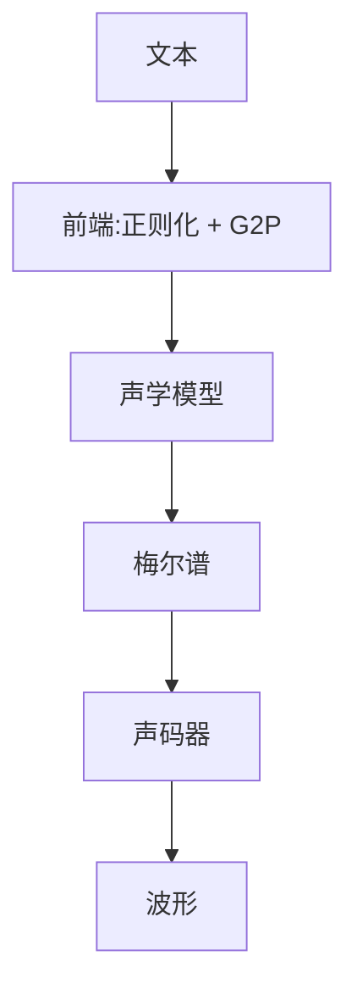

# TTS

一句话:TTS(text-to-speech,语音合成)要把一串文字变成一段能听的波形,难点不在"发得出声",而在**同一句话有无数种合法的读法**——这条"一对多"贯穿了它的建模、训练目标、评测和工程选型,本篇所有内容都从它发问。

## 一、TTS 难在哪:一对多

### 和 ASR 的根本不对称

语音识别(ASR)是**多对一**:一句话不管谁说、快说慢说、带什么口音,正确答案只有那一串字。语音合成反过来是**一对多**:给定"今天天气不错",语速可以快可以慢,重音可以落在"今天"也可以落在"不错",停顿位置、音高走向、情绪、音色、录音环境,每一样都有无数种合法取值,而且**它们都不算错**。

> **类比**:ASR 像批改选择题——答案唯一,对错分明。TTS 像命题作文——题目给死了,合格的作文却有一万篇。

这条不对称立刻带来三个后果,后面几节都是在处理它:

**第一,不能用朴素回归。** 如果拿"这条音频的真实梅尔谱"当唯一标准答案、用 L1/L2 让模型去逼近,模型学到的是**所有合法读法的平均**。平均出来的谱在时间和频率上都被抹平了,听感就是闷、含糊、没有起伏——这正是早期神经 TTS 那股"机器人味"的技术根源,术语叫**过度平滑(over-smoothing)**。因为损失函数逼着模型在"读法 A"和"读法 B"之间取中点,而中点往往两边都不像。

**第二,TTS 天然需要生成式建模。** 自回归采样、GAN、扩散、flow matching 之所以都在 TTS 上出现过,是因为它们建模的是**一个分布**而不是一个均值。ASR 用判别式训练就够,TTS 不够。

**第三,评测没有客观标准答案。** 没有 WER 那样的指标能衡量"好不好听",所以主指标是 **MOS**(mean opinion score,让一群人给每段音频打 1–5 分再求平均)。

### MOS 这个数怎么读

**MOS 跨论文不可直接比大小。** 因为评测人群、句子集、给评测者的指令、有没有给参考音频、播放设备全都不同,同一个系统换一批评测者就能差出零点几分。看 MOS 只能看**同一张表内部的相对关系**。

举个具体的:Tacotron 2 论文自报 MOS 4.53,同一张表里专业录音是 4.58——这个"接近真人"的结论只在那张表的口径内成立,不能拿 4.53 去和另一篇论文的 4.4 比高低。

所以现在的论文普遍会补两个客观指标:

- **WER / CER**:把合成音送进一个 ASR 模型转录,和原文对比。它主要抓的是**可懂度和漏读重复**,不是好听程度
- **说话人相似度**:用说话人验证模型给参考音频和合成音各算一个向量,取余弦相似度,衡量音色克隆得像不像

Voicebox 就是这么报的:它和 VALL-E 比,WER 是 5.9%(VALL-E)对 1.9%(Voicebox),相似度 0.580 对 0.681。这类客观指标至少在同一评测集上是可比的。

## 二、两阶段与端到端:从文本到波形的那条链

一条经典的合成链长这样:

**前端**做两件脏活:文本正则化(把"3.14""2026/9/7""Dr."展开成该念的字)和 G2P(grapheme-to-phoneme,字素转音素,决定多音字念什么)。这一段传统上是规则加词典,今天也常被端到端模型吸收掉,但在中文多音字和数字读法上,规则至今仍然比模型可靠。

**声学模型**把音素序列变成梅尔谱,**声码器**把梅尔谱变成波形。(梅尔谱是什么、还有哪些音频表征,见 音频编解码 篇。)

### 为什么早期非拆两段不可

**因为两端的序列长度差了两个数量级。** 以 24 kHz 采样、12.5 ms 帧移这套常见设定算:一秒音频是 24000 个采样点,但只有 80 帧梅尔谱,**相差 300 倍**;而一秒话大概 10–15 个音素,一个音素平均占 5–10 帧。让一个模型直接从几十个音素跳到几万个采样点,既要管内容对齐、又要管高频波形和相位细节,当年根本训不动。

拆开之后,两段的难度性质也完全不同:

| | 声学模型 | 声码器 |
|---|---|---|
| 管什么 | 读什么、怎么读(内容与韵律) | 怎么发出声(把谱还原成波形) |
| 序列跨度 | 音素 → 帧,约 1:5–10 | 帧 → 采样点,约 1:300 |
| 和文本的关系 | 强相关 | **完全无关** |
| 训练数据要求 | 必须有配对的文本转录 | 只要音频,谁说的都行 |

最后一行是白拿的好处:**声码器和文本无关,可以在海量无标注音频上单独训一个通用的,换发音人、换语言都不用重训。** BigVGAN 走的就是"训一个通吃的通用声码器"这条路。

### 声码器:mel → 波形这一段为什么最先被啃下来

**梅尔谱丢了相位。** 做 STFT 时只留了幅度,相位被扔掉;从幅度谱倒推波形是个欠定问题——同一张谱对应无数条听起来一样、逐点数值却差很多的波形。经典解法 Griffin-Lim 靠迭代猜相位,出来带明显的金属音。

**WaveNet** 第一次证明神经网络能直接建模原始波形:用扩张因果卷积(dilated causal convolution,一层层把卷积核的采样间隔翻倍,少数几层就覆盖上千个采样点的感受野)逐采样点自回归。质量是跨越式的,但**生成一秒音频要跑 24000 次前向**,慢到没法产品化。

于是主流转向 **GAN 声码器**:一次前向并行吐出整段波形。HiFi-GAN 论文自报在单张 V100 上生成 22.05 kHz 音频**比实时快 167.9 倍**,小体积版本在 CPU 上也有 13.4 倍实时——这个量级才让声码器彻底不再是延迟瓶颈。

**为什么这里用 GAN 而不是回归?** 又是一对多:同一张梅尔谱对应无数条合法波形,用 L2 逼一条"平均波形"得到的是接近噪声的东西。GAN 的判别器只要求"听起来像真的",不要求逐点对上,正好绕开了这个问题。

**HiFi-GAN 为什么要堆一组判别器?** 它用了多周期判别器(把一维波形按周期 2、3、5、7、11 折叠成二维再判)加多尺度判别器(在几个下采样率上分别判)。因为**浊音本质是准周期信号**——声带在振动,基频和它的谐波撑起了音色。单个判别器容易只盯住某一类周期结构,漏掉的那些就在合成音里表现为基频抖动或谐波缺失;按不同素数周期切开,等于逼着生成器在多个周期尺度上同时对得上。

> 🖼️ 占位:同一段语音的波形、梅尔谱与音素边界三行对齐图,标出 24000 采样点 / 80 帧 / 十几个音素的长度量级差

### 后来为什么能端到端

两阶段有一条藏得比较深的坑:**接缝处的分布不匹配**。声码器通常在**真实音频提取的梅尔谱**上训,推理时吃到的却是**声学模型预测出来的、偏平滑的谱**。这是典型的 train/test 错位,后果是音质掉一截、带沙沙的伪影。工程上的常规补丁是拿声学模型的预测谱回去微调声码器。

**VITS** 把这道缝直接焊死:单阶段从文本一路出到波形,用条件 VAE 做中间表示、归一化流增强表达力、对抗训练保音质,对齐则在训练中用单调对齐搜索自己找。

**但端到端并没有一统天下。** 代价很实在:训练更重更难调;梅尔谱这个人能看懂的中间量没了,线上出问题时不好定位是"读错字了"还是"发音难听"。所以今天大规模系统里,"预测一种中间表示,再由独立解码器还原波形"的两段结构仍然是主流——只是中间表示从梅尔谱换成了离散音频 token(token 怎么来的见 音频编解码 篇)。

## 三、对齐与时长:漏读和重复是怎么来的

### 自回归靠注意力对齐,坏起来有三种样子

Tacotron 系是 encoder-decoder 加注意力:每要生成一帧梅尔谱,decoder 就用注意力去音素序列上"看现在该读到哪儿了"。**这个对齐没有任何监督,是训练中自己浮现出来的**——正常情况下注意力矩阵会长成一条漂亮的对角线。

一旦它跑飞,失败模式有三种:

| 症状 | 注意力在干什么 | 听起来是什么 |
|---|---|---|
| 漏读 | 一步跨过了某几个音素 | 整个词没发出来 |
| 重复 | 卡在原地或往回退 | 同一个词读两遍 |
| 停不下来 | 停止标志预测不出来 | 读完了还在含糊发声,或结尾拖一段噪音 |

**为什么会跑飞?** 因为标准注意力**没有任何机制保证对齐是单调、连续、全覆盖的**——它可以给任意位置加权。训练时有 teacher forcing 兜着,分布内的句子看不出毛病;一旦遇到长句、绕口的专名、连串数字或重复词,就没有约束能把它拉回正轨。**所以最容易崩的恰恰是分布外的输入**,而线上流量里这种句子并不罕见,这是自回归 TTS 上线时最头疼的一类事故。

> 🖼️ 占位:注意力对齐矩阵对比图,左边是正常的单调对角线,右边是发生漏读(跳段)与重复(横向拖尾)时的样子

### 三类修法,按约束强度排

1. **加软先验**:location-sensitive attention 把上一步的注意力权重也喂进去,鼓励它往前挪。**缓解但不根治**,因为约束是软的,模型仍然可以违反。
2. **训练时做硬单调对齐**:MAS(monotonic alignment search,单调对齐搜索)用动态规划在**所有单调路径**里找似然最高的那条,把它当作每个音素的时长标签。Glow-TTS 提出、VITS 和 Grad-TTS 都在用,好处是不依赖外部强制对齐工具。
3. **推理期干脆不要注意力**:非自回归加时长预测器,见下。

### 非自回归的解法:时长预测器 + 长度调节器

FastSpeech 这条线的做法分三步:

1. 先拿到每个音素的时长标签(FastSpeech 是从一个训好的自回归教师模型的注意力里抽出来的,后来的做法改用 MAS 或外部强制对齐器)
2. 训一个**时长预测器**:输入音素编码,回归它该占多少帧。通常在**对数域**回归,因为时长分布长尾——个别音素能拖很长,直接在线性域回归会被这些大值主导梯度
3. **长度调节器(length regulator)**:按预测时长把每个音素的向量**复制**相应帧数,音素序列就被"撑开"成帧序列,之后整段并行解码

**关键在于对齐从"模型自由发挥"变成了"显式给定"**:只要时长预测器不输出 0 或荒唐的大数,每个音素**必然被读到、且只读一次**——漏读和重复在结构上被消除了,不是被缓解。FastSpeech 论文自报在特别难的句子上几乎消除了漏读和重复问题。

速度上,FastSpeech 论文自报梅尔谱生成快 **270 倍**、端到端快 **38 倍**(对比它的自回归 Transformer TTS 基线)。两个数差这么多,是因为端到端那 38 倍里还压着声码器的开销——被并行化真正吃掉的只有声学模型那一段。

还白拿一个**语速旋钮**:把所有预测时长乘 1.3 就是慢速、乘 0.8 就是快速,而且**音高不变**。因为音高是解码器另外生成的,不像直接对波形重采样那样会把音调一起拉高拉低。只放大标点处的时长,就是"停顿加长"。

### 韵律:把一对多的自由度显式抓出来

光有时长还不够。同一句话读得对不对味,还看基频(音高)走向、能量、重音——这些同样是一对多的自由度,不处理就还是会被平均掉。

**FastSpeech 2 的做法:把这些量显式抽出来当条件。** 训练时从真实音频里提取音高和能量,连同时长一起作为额外输入喂给解码器;推理时由各自的预测器给出。

**为什么这么做管用?** 它把"一对多"改造成了"给定条件之后的一对一"。模型不再需要在损失里对多种读法求平均(那正是过度平滑的来源),而是"你告诉我音高怎么走、能量多大,我照着生成"。**顺带这些量就直接成了可控旋钮**——想让某个词重读,把那几帧的能量和音高调上去就行。

副作用还有一个:因为不再依赖教师模型的输出,FastSpeech 2 可以直接用真实梅尔谱训,论文自报比 FastSpeech **训练快 3 倍**。

**至今仍然做不好的是篇章级韵律。** 一句话内部的语调可以学出来,但"这整段该用什么情绪""哪个词是全篇的信息焦点""上一句是问句、这一句该怎么应"依赖上下文语义,现在主要靠给一段参考音频或一句文本指令去暗示,不是模型自己推理出来的。

## 四、三条路线的选型,以及音色克隆与流式

### 三条路线横向对比

| | 自回归 · 预测梅尔帧 | 自回归 · 预测音频 token | 非自回归 + 时长 | 扩散 / flow matching |
|---|---|---|---|---|
| 代表 | Tacotron 2 | VALL-E、CosyVoice | FastSpeech 2 | Grad-TTS、Voicebox、F5-TTS |
| 中间表示 | 梅尔谱 | 离散音频 token | 梅尔谱 | 梅尔谱或隐变量 |
| 对齐怎么来 | 注意力自己学 | 语言模型隐式学 | 显式时长预测器 | 显式时长,或填充式免时长 |
| 一次合成的网络调用 | 帧数(几百次) | token 数(上千次) | **1 次** | NFE,几步到几十步 |
| 稳定性 | 差:漏读、重复、停不下来 | 中:温度高时同样会跑飞,通常靠重采样加打分兜底 | **好:结构上不会漏读重复** | 好(显式时长时) |
| 韵律多样性 | 好 | **最好**:整段用语言模型采样,自然的犹豫和口音都学得出 | 一般:显式条件之外仍偏平 | 好 |
| 细粒度可控性 | 弱 | 弱:全靠 prompt 暗示 | **强:时长、音高、能量都是数值旋钮** | 中:条件好插,细粒度要额外设计 |
| 流式友好 | 天然(逐帧出) | 天然(逐 token 出) | 差:要先知道整句时长 | 差:整段一起去噪 |

自回归音频 token 这条路值得多说一句 TTS 侧的建模技巧:VALL-E 把参考音频和文本一起当上文,**第一层码本用自回归逐 token 生成**(它承载主要的内容和韵律),**剩下几层用非自回归一次性出**(它们主要补声学细节)。因为如果把所有层展平成一条长序列串行生成,序列长度要乘上层数,自回归的步数直接翻好几倍。

### 扩散与 flow matching 用在 TTS 上,好在哪、贵在哪

机制本身见 Diffusion 篇和 FlowMatching 篇,这里只讲 TTS 侧的账。

**好处**是它天生在建模一个分布而不是均值,正好接住一对多;而且训练目标就是个 MSE 回归,稳,不像 GAN 要平衡两个网络。

**代价一是网络调用次数。** 一次合成要跑 NFE 次网络,比非自回归的一次前向贵得多。Matcha-TTS 走 flow matching 而不是 score matching,冲的正是"更少步数达到同等质量";F5-TTS 自报推理 **RTF 0.15**(RTF = 合成耗时 / 音频时长,小于 1 才算实时)。

**代价二是没有天然的流式。** 扩散在整段上迭代去噪,第一帧的最终值要等最后一步才定下来,所以**首包延迟约等于整段合成时间**。想流式就得专门改造成分块因果的变体,CosyVoice 2 就是把 flow matching 改成 chunk-aware causal,让一个模型同时支持流式和非流式。

这条线内部还有个分叉:**要不要显式时长**。Voicebox 用掩码填充式训练(给一段上下文音频和完整文本,补出被挖掉的那段),对齐由模型自己解决;E2 TTS 和 F5-TTS 更激进,把文本简单填充到和音频等长,连音素时长都不显式建模。代价是**必须在大数据上才学得出对齐**,小数据场景下反而不如显式时长稳。

### 音色克隆:说话人嵌入 vs 参考音频当 prompt

**路线一是说话人嵌入。** 拿一个独立训练的说话人验证模型(它的任务是判断两段音频是不是同一个人)把参考音频压成一个几百维向量,当全局条件喂进声学模型。SV2TTS 那篇的核心论点是:说话人编码器可以在**大量嘈杂、无转录**的语音上训,TTS 那边只需要小规模高质量数据,两边解耦。

好处是轻、快、条件稳定。**天花板也很清楚:一个向量只装得下"这个人的平均音色"**。说话风格、口音、语速习惯、录音环境全被压掉了——因为说话人验证模型的训练目标本来就是要对这些变化保持不变。所以听感往往是"像,但不是那个人",口音重或风格特别的人尤其明显。

**路线二是上下文学习式。** 把参考音频本身当 prompt:VALL-E 把它编成音频 token 放进语言模型的上文,让模型**接着往下续**;Voicebox、F5-TTS 这类填充式模型则把它当已知上下文,补出后面那段。

**为什么几秒钟就够?关键是模型在这几秒上一个参数都没更新。** 真正被学会的能力是在大规模预训练里建立的:见过成千上万个说话人之后,模型掌握了"给一段声音,把同样的音色、同样的录音条件、同样的说话风格接下去"——这在预训练时就是天然的自监督目标(拿音频的前半段预测后半段)。参考音频提供的只是一个**足够区分身份的条件**,不是训练样本。所以门槛只是"够不够认出这是谁",几秒就够了。VALL-E 用的是 3 秒参考录音,代价是它在 60K 小时英文语音上做预训练。

这条路线的好处和坑是同一件事的两面:**它复制的是整段声学条件,不只是音色**。

- 好处:情绪、录音环境、口音一起被带过去,像得多
- 坑一:**你没法只要音色不要环境**。参考音频有回声,输出就有回声;参考音频是激动的,输出就偏激动。想拆开就得做因子化,NaturalSpeech 3 走的就是这条路——把语音拆成内容、韵律、音色、声学细节几个分开的码本
- 坑二:**细粒度可控性变差**。全靠"找一段听起来对的参考音频"来暗示,没有时长预测器那样明确的数值旋钮。用文本指令控情感是现在的补法,但指令到声学的映射是模型自己学的,细粒度上不可靠
- 坑三:几秒录音克隆任意人成了现实,所以主流开源和商用系统普遍要配水印与使用限制

### 实时与流式:首包延迟花在哪

**交互式场景真正在意的不是 RTF,是首包延迟**(从拿到文本到第一段能播的音频)。RTF 0.5 意味着合成 10 秒话要 5 秒;但如果这 5 秒必须全等完才出声,用户感受就是卡 5 秒;如果 200 ms 就出第一个 chunk、后面边播边合成,感受就是"立刻开口"。

首包延迟依次花在:文本前端 → 等上游 LLM 吐够一句话(语音助手里往往这段最长)→ 声学模型出第一块 → 声码器出第一块。三处都要改造:

1. **声学侧要能分块出结果**。自回归天然可以;非自回归和扩散要做成分块因果的,只看有限的右侧上下文。代价是**右上下文变短,块边界处的韵律预测会变差**——模型不知道后面还有什么,语调就不好提前铺垫
2. **声码器要能流式**。卷积声码器的感受野会跨块,硬切会在接缝处出咔哒声。做法是块之间留重叠(多合成一点再交叉淡化),或者把卷积改成因果卷积
3. **切句要按语义而不是按字数**。因为音高和时长在句内是连续演化的,在错误的位置切开,两块之间语调接不上,听起来像换了个人

接缝的不连续有三个层次,补丁各不相同:

| 不连续在哪一层 | 听起来是什么 | 怎么补 |
|---|---|---|
| 波形 | 咔哒声、爆音 | 块间重叠 + 交叉淡化,或改因果卷积 |
| 韵律 | 语调断层,块与块像两句话 | 按标点和句法边界切,把上一块末尾状态作为下一块条件 |
| 音色 | 长文本越往后越漂离参考音色 | 每一块都重新把参考音频作为 prompt 钉住 |

## 五、面试考点串联

本篇题库里暂无同名真题,以下全部是按正文断言补出的问法。

| 高频问法 | 本文哪一节 |
|---|---|
| TTS 和 ASR 最根本的区别是什么?为什么这个区别决定了 TTS 必须用生成模型?(补充题) | 一 |
| 早期神经 TTS 那股机器人味是怎么来的?现在靠什么解决?(补充题) | 一、三(韵律) |
| TTS 为什么主要看 MOS?两篇论文的 MOS 能直接比大小吗?(补充题) | 一 |
| 文本到波形中间为什么要过一层梅尔谱?一步到位不行吗?(补充题) | 二 |
| 声码器解决的是什么问题?为什么这一段能训成和文本无关的通用模型?(补充题) | 二 |
| HiFi-GAN 为什么要堆一组判别器?换成 L2 回归会怎样?(补充题) | 二 |
| 两阶段系统在声学模型和声码器的接缝上会出什么问题?工程上怎么补?(补充题) | 二 |
| VITS 这类端到端方案好在哪?为什么没把两阶段完全取代掉?(补充题) | 二 |
| 自回归 TTS 为什么会漏读、重复、停不下来?什么样的句子最容易触发?(补充题) | 三 |
| 非自回归 TTS 靠什么保证不漏读不重复?它换来的代价是什么?(补充题) | 三、四 |
| 时长预测器是怎么训出来的?有了它还能顺手做成什么功能?(补充题) | 三 |
| FastSpeech 2 为什么要显式预测音高和能量?这和一对多有什么关系?(补充题) | 三 |
| 扩散或 flow matching 用在 TTS 上好在哪?最大的代价是什么?(补充题) | 四 |
| 零样本音色克隆为什么几秒钟录音就够?模型在这几秒上训练了吗?(补充题) | 四 |
| 说话人嵌入和参考音频当 prompt,两种克隆方式差在哪?各自的天花板在哪?(补充题) | 四 |
| 流式 TTS 的首包延迟主要花在哪?非自回归和扩散怎么改造才能流式?(补充题) | 四 |
| 长文本分块合成时,块与块的接缝会出什么问题?(补充题) | 四(三层不连续表) |

相邻篇边界:音频 token 与神经编解码器见 音频编解码 篇;识别侧的流式与幻觉见 语音识别 篇;扩散与流匹配的机制本身见 Diffusion 篇和 FlowMatching 篇;长时音乐结构见 音乐生成 篇。

## 相关文献

- Tacotron: Towards End-to-End Speech Synthesis — [arXiv:1703.10135](https://arxiv.org/abs/1703.10135)
- Natural TTS Synthesis by Conditioning WaveNet on Mel Spectrogram Predictions(Tacotron 2)— [arXiv:1712.05884](https://arxiv.org/abs/1712.05884)
- WaveNet: A Generative Model for Raw Audio — [arXiv:1609.03499](https://arxiv.org/abs/1609.03499)
- Neural Speech Synthesis with Transformer Network — [arXiv:1809.08895](https://arxiv.org/abs/1809.08895)
- FastSpeech: Fast, Robust and Controllable Text to Speech — [arXiv:1905.09263](https://arxiv.org/abs/1905.09263)
- FastSpeech 2: Fast and High-Quality End-to-End Text to Speech — [arXiv:2006.04558](https://arxiv.org/abs/2006.04558)
- HiFi-GAN: Generative Adversarial Networks for Efficient and High Fidelity Speech Synthesis — [arXiv:2010.05646](https://arxiv.org/abs/2010.05646)
- BigVGAN: A Universal Neural Vocoder with Large-Scale Training — [arXiv:2206.04658](https://arxiv.org/abs/2206.04658)
- Glow-TTS: A Generative Flow for Text-to-Speech via Monotonic Alignment Search — [arXiv:2005.11129](https://arxiv.org/abs/2005.11129)
- Conditional Variational Autoencoder with Adversarial Learning for End-to-End Text-to-Speech(VITS)— [arXiv:2106.06103](https://arxiv.org/abs/2106.06103)
- Grad-TTS: A Diffusion Probabilistic Model for Text-to-Speech — [arXiv:2105.06337](https://arxiv.org/abs/2105.06337)
- Matcha-TTS: A fast TTS architecture with conditional flow matching — [arXiv:2309.03199](https://arxiv.org/abs/2309.03199)
- Neural Codec Language Models are Zero-Shot Text to Speech Synthesizers(VALL-E)— [arXiv:2301.02111](https://arxiv.org/abs/2301.02111)
- Voicebox: Text-Guided Multilingual Universal Speech Generation at Scale — [arXiv:2306.15687](https://arxiv.org/abs/2306.15687)
- E2 TTS: Embarrassingly Easy Fully Non-Autoregressive Zero-Shot TTS — [arXiv:2406.18009](https://arxiv.org/abs/2406.18009)
- F5-TTS: A Fairytaler that Fakes Fluent and Faithful Speech with Flow Matching — [arXiv:2410.06885](https://arxiv.org/abs/2410.06885)
- Transfer Learning from Speaker Verification to Multispeaker Text-To-Speech Synthesis(SV2TTS)— [arXiv:1806.04558](https://arxiv.org/abs/1806.04558)
- NaturalSpeech 3: Zero-Shot Speech Synthesis with Factorized Codec and Diffusion Models — [arXiv:2403.03100](https://arxiv.org/abs/2403.03100)
- CosyVoice 2: Scalable Streaming Speech Synthesis with Large Language Models — [arXiv:2412.10117](https://arxiv.org/abs/2412.10117)
