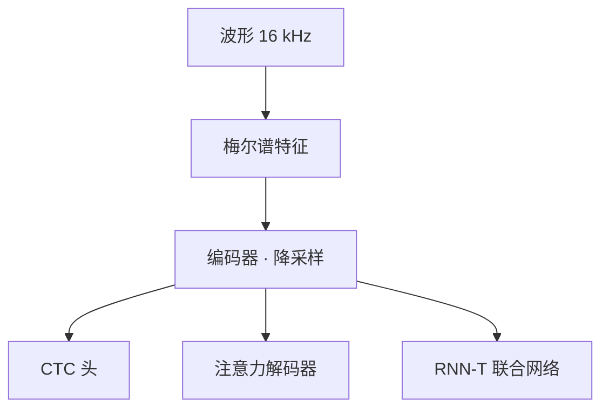

# 语音识别

一句话:语音识别(ASR)要把一段每秒上万个采样点的音频变成几十个字的文本,难点不在"听清",而在**对齐**——输入比输出长一两个数量级,训练数据里又没有"第几帧对应哪个字"这种逐帧标注。本篇讲的三种范式,本质都是在回答"没有逐帧标注怎么训"。

## 一、难在哪:长度差一两个数量级,而且没有逐帧标注

输入侧本篇当成给定的:音频重采样到 16 kHz,按 25 ms 的窗、10 ms 的步长切帧,每帧算一个 80 维的**梅尔谱**向量(这是 Whisper 的口径,业界大同小异),所以 1 秒音频 = 100 帧。波形 / STFT / 梅尔谱 / 离散 token 这一整条表征谱系怎么来的、彼此什么关系,见 音频编解码 篇,本篇不展开。

编码器前面通常还有一层降采样(Whisper 用一层 stride=2 的卷积)。于是一段 30 秒的话:

- 编码器输出 **1500 个位置**(30 秒 ÷ 20 ms)
- 对应的文本大约 **50–100 个 token**

**长度比在十几比一到几十比一,而标注只有"这段音频说了这句话",没有"第 372 帧是'的'"。** 这就是 ASR 和机器翻译最不一样的地方:翻译两侧都是离散 token、长度同量级;ASR 是把一条长而连续的曲线压进一串短而离散的符号。

传统流水线靠 HMM 做**强制对齐**:先用一个已有模型把音频硬切成音素段,把切出来的段当逐帧标注去训声学模型,外面再挂发音词典和 n-gram 语言模型。端到端的三条路——CTC、注意力式 seq2seq、RNN-T——都是在拆掉这套脚手架。

先把一件事摘出去:**编码器用什么结构和这三条路是正交的**。早期用双向 LSTM,现在主流是 Conformer(在 Transformer 层里插一个卷积模块,让同一层既能靠卷积抓局部音素细节、又能靠注意力抓长程上下文)。下面讲的差异全部发生在编码器**之后**,即怎么把帧和字对上。



## 二、三种对齐范式

### CTC:把所有可能的对齐都算一遍再加起来

CTC(Connectionist Temporal Classification,连接主义时序分类)的思路很直白:**既然不知道对齐,那就把所有对齐都试一遍。**

它往词表里加一个特殊符号 **blank**(记作 `-`),意思是"这一帧什么都不输出"。每帧独立预测一个符号,得到一条长度为 $T$ 的**路径**;路径按两步折叠成文本——先合并连续重复的符号,再删掉所有 blank:

```text
帧号   1    2    3    4    5    6
路径   -    -    你   你   -    好
       ↓ 合并连续重复
       -         你   -    好
       ↓ 删 blank
       你  好
```

`你-好---`、`-你好好好-` 也都能折叠出「你好」。blank 的必要性正在这里:**没有 blank 就写不出叠字**,「拜拜」如果不能写成 `拜-拜`,会被重复合并规则吃成一个「拜」。

训练目标是所有合法路径的概率之和:

$$
P(\mathbf{y} \mid \mathbf{x}) = \sum_{\pi \in \mathcal{B}^{-1}(\mathbf{y})} \prod_{t=1}^{T} p_t(\pi_t \mid \mathbf{x})
$$

读作:$\mathcal{B}^{-1}(\mathbf{y})$ 是所有能折叠成目标文本 $\mathbf{y}$ 的路径集合,把每条路径上逐帧概率的乘积加起来,就是这句话的似然。路径数随 $T$ 指数增长,但折叠规则是单调的,可以用前向-后向动态规划在 $O(T \cdot |\mathbf{y}|)$ 内算完——这才是 CTC 实际可用的原因。

**代价就藏在那个连乘里:每一帧的概率只看编码器输出,不看自己前面已经吐了什么。** 这就是 CTC 的**条件独立假设**,后果有三条:

- **建模不了输出之间的依赖**。"今天天气"后面接"不错"还是"不搓",CTC 头没有任何机制偏向前者,因为它看不见自己刚写的字。所以生产里的 CTC 系统几乎都要**外挂语言模型**做带 LM 的 beam search——这不是锦上添花,是补一个结构性的洞
- **输出长度必须 ≤ 输入帧数**。折叠只会让序列变短,一帧最多出一个符号。中文按字、英文按 BPE 通常够用,但编码器降采样倍数开太大就会撞墙
- **尖峰行为**(peaky):收敛后绝大多数帧输出 blank,只在少数几帧爆出一个非 blank 尖峰。好处是顺手给了近似时间戳;坏处是尖峰位置常比真实发音**偏晚**,拿它做强制对齐要留意系统性偏移

好处同样实在:CTC 头是逐帧的、不自回归,**天然并行、天然流式**,编码器算到哪帧就能吐哪帧。第一批真正端到端的系统(如 Deep Speech 2)走的就是这条路:一个大编码器加 CTC 损失,再外挂 n-gram 语言模型做 beam search。

### 注意力式 seq2seq:让交叉注意力自己去找对齐

第二条路干脆不显式建模对齐:标准编码器-解码器 Transformer,解码器每生成一个 token 就用**交叉注意力**在那 1500 个编码器输出上加权求和,**注意力权重就是软对齐**。代表工作是 LAS(Listen, Attend and Spell),Whisper 也属于这一族。编码器-解码器和交叉注意力的通用机制见 Transformer整体架构 篇,这里只讲它在语音上的特殊表现。

它一次解决了 CTC 的两个毛病:解码器自回归,**输出之间的依赖天然被建模**(相当于内置语言模型);输出长度也不再受帧数限制。

新问题是:**注意力没有任何单调性约束**。翻译里跳着看是合理的(语序会变),语音里几乎总是从左到右,可模型并不知道这件事,于是出现两种典型故障:

- **漏字**:注意力一次跨过太多帧,中间内容根本没被读到
- **重复循环**:注意力粘在同一段音频上不动,同一个词反复吐;贪心解码时尤其容易触发,这正是 Whisper 长音频必须开 beam search 的直接原因

还有一条结构性限制:交叉注意力要访问**全部**编码器输出,而编码器通常是双向的,所以**这条路默认不能流式**。要流式就得给注意力加单调约束,例如 MoChA(Monotonic Chunkwise Attention):强制注意力窗口只能单向前移,只在一个小 chunk 内做软注意力。

### RNN-T:补上 CTC 的洞,同时保住流式

RNN-T(RNN Transducer)是 Graves 在 CTC 之后提出的修补方案,思路是**在 CTC 骨架上加一路"看历史"的分支**:

| 部件 | 输入 | 干什么 |
|---|---|---|
| 编码器(转录网络) | 音频帧 | 出声学表示,**只看音频** |
| 预测网络 | 已输出的文本 | 出语言表示,**只看历史 token,不看音频** |
| 联合网络 | 上面两路的组合 | 融合后过 softmax,出下一个符号(含 blank) |

解码在一张 **T × U 的格点**上走(T 是音频帧数,U 是已输出 token 数):吐出非 blank 就向上走一格(时间不动,所以**一帧可以连续吐多个 token**),吐出 blank 就向右走一格(时间前进一帧)。训练同样是对所有格点路径求和,同样用前向-后向动态规划。

关键差别只有一句:**联合网络能看到已输出的 token,输出之间不再条件独立**——CTC 那个必须外挂 LM 的洞被堵上了;同时"每步决策只依赖到当前帧为止的音频加已输出文本"这条性质保住了,**所以它天然流式**。手机端离线听写、实时字幕这类严格流式场景以 RNN-T 为主,原因就在这里。

代价是训练贵:格点是二维的,前向-后向要在 T × U × 词表 这个三维张量上做,显存开销远高于 CTC。工程上常见的应对是把词表分块算,或者用先粗对齐再剪枝的 pruned transducer loss。

> 🖼️ 占位:RNN-T 的 T × U 格点图,标出"向上=吐字、向右=时间前进"两种转移

### 三者放在一起看

| | CTC | 注意力 seq2seq | RNN-T |
|---|---|---|---|
| 输出间依赖 | ❌ 条件独立 | ✅ 解码器自回归 | ✅ 预测网络 |
| 是否要外挂 LM | 基本必须 | 不必须 | 不必须 |
| 单调对齐 | ✅ 结构保证 | ❌ 无约束,会漏字/重复 | ✅ 结构保证 |
| 流式 | ✅ 天然 | ❌ 要改造(MoChA / chunk) | ✅ 天然 |
| 输出长度上限 | ≤ 输入帧数 | 无 | 无 |
| 训练开销 | 最低 | 中 | 最高(T × U 格点) |
| 典型落地 | 辅助头、热词、前端 | Whisper 这类离线大模型 | 端侧实时听写 |

工程上还常见两种拼法:**CTC 与注意力解码器共享同一个编码器联合训练**,用 CTC 的单调性把编码器"拽正",再让注意力解码器出最终结果;以及**两遍解码**——第一遍用流式模型边说边出,整句结束后第二遍用非流式解码器重打分。

## 三、Whisper 路线:用弱监督规模换鲁棒性

Whisper 的架构就是最朴素的注意力式编解码器(论文明说是刻意用现成架构,避免把结论和结构改进混在一起),真正的变量是**数据**:**68 万小时**从网上收集的音频-文本对,其中 11.7 万小时覆盖另外 96 种语言,另有 12.5 万小时是 X→英 的翻译数据。这些标注是"弱"的,来自字幕和自动生成的 caption,质量参差,靠启发式过滤加一轮按错误率排序的人工排查来清洗。

值得对照的是同期另一条路:**自监督预训练**(wav2vec 2.0 那一派)——先在大量无标注音频上做对比学习,再拿少量标注数据微调。Whisper 的选择正相反,**不做自监督,直接把弱标注堆到 68 万小时**,论文的立场就是"弱监督的规模效应被低估了"。

### 多任务标签格式:把整条流水线塞进 token 序列

真正的巧思在标签格式:**所有任务都编码成解码器的 token 序列**,靠特殊 token 切换。顺序是

`<|startoftranscript|>` → 语种 token(99 种之一;整段没有人声时预测 `<|nospeech|>`)→ 任务 token(`<|transcribe|>` 或 `<|translate|>`)→ 要不要时间戳(不要就插 `<|notimestamps|>`)→ 正文。

时间戳本身也是 token,时间量化到 **20 ms** 一格(正好是模型的时间分辨率),每段文本前后各夹一个时间 token。训练时还会以一定概率把上一段的转写文本接在前面当上下文。

**那个 30 秒是训练时切出来的,不是推理时才有的选项**:构建数据时把所有音频切成 30 秒片段,配上落在这个时间窗内的那段字幕,连没有人声的片段也按一定比例保留(拿来训 `<|nospeech|>`)。编码器的位置编码就按这 1500 帧铺死了,所以推理时也只能一次吃 30 秒。

**这样做的好处是:语种识别、有无人声检测、转写、翻译、时间戳,原本是五个独立模块,现在只是同一个模型的五种前缀**。代价是这些能力互相绑定——语种判错会连带把整段转写带偏。

### 买到了什么,付了什么

买到的:

- **零样本鲁棒性**。不在任何单一数据集上微调,却在多个分布上都不差。论文的核心论点是:在 LibriSpeech test-clean 这类干净集上刷到极低 WER 的有监督模型换个分布就明显退化,而 Whisper 的跨分布表现更平
- **一个模型顶一套流水线**,不用再拼 VAD、语种识别、ASR、翻译
- 全家桶从 tiny(3900 万参数)到 large(15.5 亿参数),小档能在端侧跑

付出的:

- **纯注意力式解码,不能流式**,只能"录完再转"
- **弱标注的坏习惯一起学了**。字幕里高频出现的"请订阅本频道""字幕由某某提供"这类模板句,会在模型没听清时被当成合理续写吐出来,这是下一节幻觉的病根之一
- **30 秒定长窗口是硬约束**(位置编码就按 30 秒铺的),长音频必须自己切

## 四、上线要过的四关

### 流式:延迟和准确率是同一个旋钮的两端

离线编码器是**双向**的,第 100 帧的表示里含有第 1000 帧的信息。流式要求还没说完就出字,编码器必须改成**因果**的:第 $t$ 帧只能看 $\le t$ 的帧。代价直接可见——区分"不是"和"不四",后半个字的信息用不上了,准确率必然掉。

折中办法是 **chunk 加前瞻**:不逐帧出结果,攒够一小块(例如 320 ms)一起算,块内允许双向;再允许每块多看未来一小段(例如 160 ms)。理论上用户从说完到看见字的最短延迟约等于 chunk 长度加前瞻窗口,实际还要叠上计算耗时和网络往返。这就是那个旋钮:**两者开大,每帧可见上下文变多、准确率上升,但延迟线性上升**。产品侧常见做法是边说边出临时结果、整句结束再回头修正一遍,把"快"和"准"拆到两个阶段各自满足。

一个容易漏的点:**流式指标不只有平均延迟,还有尾字延迟**——用户说完最后一个字到结果稳定的时间。RNN-T 吐 blank 是"免费"的,不加约束训练就会系统性地晚发射,所以工程上要加惩罚项把发射时刻往前压。

### 长音频切分:切在哪里都不对

Whisper 一口只吃 30 秒,一小时的会议录音靠**滑窗**:转完当前 30 秒,读出模型预测的最后一个时间戳,把窗口移到那里再转下一段。这条链的问题是**没有纠错机制**:

- **边界落在词中间**。一句话跨过 30 秒边界,末尾半个词会被硬切;而窗口往哪移完全依赖模型自己预测的时间戳,时间戳偏了窗口就错位
- **错误沿窗口传播**。前一窗的文本会作为上文条件喂给下一窗(本意是让模型用上下文消歧),所以一旦某窗跑飞,后面几窗跟着跑飞
- **按静音切也不安全**。用 VAD 在静音处切能避开切词,但重叠说话、背景音乐都会让 VAD 判错

Whisper 论文给了一串补丁,并报告每加一条整体 WER 都往下降一点:5 束的 beam search(压重复循环)、温度回退、VAD、上文条件、以及把**第一个时间戳约束在 0.0–1.0 秒之间**(否则模型会漏掉开头几个词)。其中温度回退是 ASR 特有的用法:从温度 0 开始贪心,一旦发现平均对数概率低于 −1 或者生成文本的 gzip 压缩率高于 2.4(压缩率高说明在重复循环),就把温度加 0.2 重来,最高加到 1.0;温度低于 0.5 时才启用上文条件。温度、beam search、重复惩罚这些算法本身见 解码策略 篇,这里只是它们在 ASR 上的特殊调度。要强调的是,这些**是工程补丁不是原理性修复**,论文自己也说这只是绕开噪声预测的 workaround。

### 幻觉:模型在没有语音的地方编出话来

这是编解码器路线最刺眼的失败模式:**输入是静音、音乐或纯噪声时,模型输出一整句语法通顺、和音频毫无关系的话。** 成因是结构性的,三条叠加:

1. **解码器本质就是个语言模型**。交叉注意力只能给出很弱的约束,而自回归先验会一直推着它生成"像话"的东西;**音频信息不足时,语言先验接管**
2. **训练数据里没有"我不知道"这个选项**。数据从字幕对齐来,长静音段对应的往往不是空白,而是字幕里残留的模板句。`<|nospeech|>` 虽然存在,但论文明确说光看它的概率不足以判定无人声,得再配一个平均对数概率阈值(实际用的是 no-speech 概率 0.6 与平均对数概率 −1 的双条件)
3. **长音频的补丁反过来会放大它**。温度回退在检测到输出可疑时调高温度重采样,在本来就没内容的段落上,等于给模型更多自由去编

有一项针对失语症患者录音的第三方研究值得记:约 **1%** 的转写片段出现了音频里根本不存在的整句幻觉,其中 **38%** 带有明确危害(捏造暴力内容、虚构权威身份等);而且幻觉率与说话人**非发声时长占比**正相关,停顿越多的人越容易被编造。这解释了为什么这个问题对口吃、失语和老年人群体格外不公平。

缓解手段全都只是缓解:前置 VAD 直接跳过静音段、卡 no-speech 概率与平均对数概率的双阈值、用 gzip 压缩率识别重复循环、多次解码取一致部分(幻觉常常不可复现,两次跑出来不一样)。

### 评测:WER 怎么算,以及它什么时候骗人

WER(Word Error Rate,词错误率)是把识别结果编辑成参考文本所需的最少操作数除以参考文本词数:

$$
\text{WER} = \frac{S + D + I}{N}
$$

$S$ 是替换、$D$ 是删除、$I$ 是插入,由编辑距离对齐算出,$N$ 是参考文本的词数。注意 **WER 可以超过 100%**,因为插入不受 $N$ 约束,模型陷入重复循环时轻松破百。中文一般改用 CER(按字算),因为分词本身就有歧义。

它骗人的四种情况:

- **标准化口径不同,数字就不可比**。"你好,世界!"和"你好世界"、"23%"和"百分之二十三"、"don't"和"do not",判不判错全看文本标准化规则。Whisper 论文专门写了自己的标准化器,并指出在 WSJ、CallHome、Switchboard 这些集上它比通用标准化器让 WER 降得更多,因为对缩写和书面/口语数字格式更宽容。**看到跨论文的 WER 对比,先问标准化器是谁的**
- **每个词等权,但信息量不等**。"明天下午三点开会"错成"两点"和错成"开慧",WER 一样,下游影响天差地别。专名、数字、时间是高价值词,做语音助手要单独统计
- **平均值盖住尾部**。整体 5% 可能是"九成用户 2%、一成口音用户 20%"。口音、儿童、老人、远场麦克风这些切片必须分开报
- **对幻觉不敏感**。1% 的片段整句编造,对整体 WER 的影响可能不到一个点,但那 1% 才是事故

所以 WER 必要但远远不够:上线前至少还要看分切片 WER、专名与数字准确率,以及静音段的幻觉率。

## 五、面试考点串联

| 高频问法 | 本文哪一节 |
| --- | --- |
| 补充题:语音识别为什么不能当普通 seq2seq 做?难点到底在哪? | 一 |
| 补充题:CTC 里的 blank 是干什么的?没有它会怎样? | 二(叠字折叠不出来) |
| 补充题:CTC 的条件独立假设指什么?为什么它还是能用? | 二(路径求和 + 前向后向 DP) |
| 补充题:为什么 CTC 系统几乎都要外挂一个语言模型? | 二(每帧不看已输出的字) |
| 补充题:注意力式 ASR 为什么会漏字和重复?怎么缓解? | 二(无单调约束)+ 四(beam search / 温度回退) |
| 补充题:RNN-T 比 CTC 多了什么?为什么它能流式而注意力式不能? | 二(预测网络 + 联合网络) |
| 补充题:Whisper 把语种、时间戳、翻译都塞进 token 序列,好处和代价分别是什么? | 三 |
| 补充题:Whisper 用 68 万小时弱标注买到了什么?付出了什么? | 三 |
| 补充题:流式 ASR 的延迟由什么决定?想把延迟砍一半要付什么代价? | 四(因果编码器 + chunk 与前瞻) |
| 补充题:Whisper 一次只吃 30 秒,一小时的录音怎么转?会出什么问题? | 四(滑窗、时间戳错位、错误传播) |
| 补充题:模型在静音段编出一整句话是怎么发生的?怎么缓解? | 四(三条成因 + 缓解手段) |
| 补充题:WER 怎么算?它可能超过 100% 吗? | 四 |
| 补充题:三种范式怎么选?端侧实时听写选哪个,为什么? | 二(对比表) |
| 补充题:两个系统报的 WER 差一个点,能说明谁更好吗? | 四(标准化口径、切片、对幻觉不敏感) |

音频侧的表征与离散化见 音频编解码 篇,反方向的语音合成见 TTS 篇。

## 相关文献

- Connectionist Temporal Classification: Labelling Unsegmented Sequence Data with Recurrent Neural Networks(ICML 2006,非 arXiv 论文)— DOI [10.1145/1143844.1143891](https://dl.acm.org/doi/10.1145/1143844.1143891),作者公开版 http://www.cs.toronto.edu/~graves/icml_2006.pdf
- Sequence Transduction with Recurrent Neural Networks(RNN-T)— [arXiv:1211.3711](https://arxiv.org/abs/1211.3711)
- Listen, Attend and Spell — [arXiv:1508.01211](https://arxiv.org/abs/1508.01211)
- Deep Speech 2: End-to-End Speech Recognition in English and Mandarin — [arXiv:1512.02595](https://arxiv.org/abs/1512.02595)
- Joint CTC-Attention based End-to-End Speech Recognition using Multi-task Learning — [arXiv:1609.06773](https://arxiv.org/abs/1609.06773)
- Monotonic Chunkwise Attention(MoChA)— [arXiv:1712.05382](https://arxiv.org/abs/1712.05382)
- Two-Pass End-to-End Speech Recognition — [arXiv:1908.10992](https://arxiv.org/abs/1908.10992)
- Conformer: Convolution-augmented Transformer for Speech Recognition — [arXiv:2005.08100](https://arxiv.org/abs/2005.08100)
- wav2vec 2.0: A Framework for Self-Supervised Learning of Speech Representations — [arXiv:2006.11477](https://arxiv.org/abs/2006.11477)
- Robust Speech Recognition via Large-Scale Weak Supervision(Whisper)— [arXiv:2212.04356](https://arxiv.org/abs/2212.04356)
- Careless Whisper: Speech-to-Text Hallucination Harms(FAccT 2024)— [arXiv:2402.08021](https://arxiv.org/abs/2402.08021)
