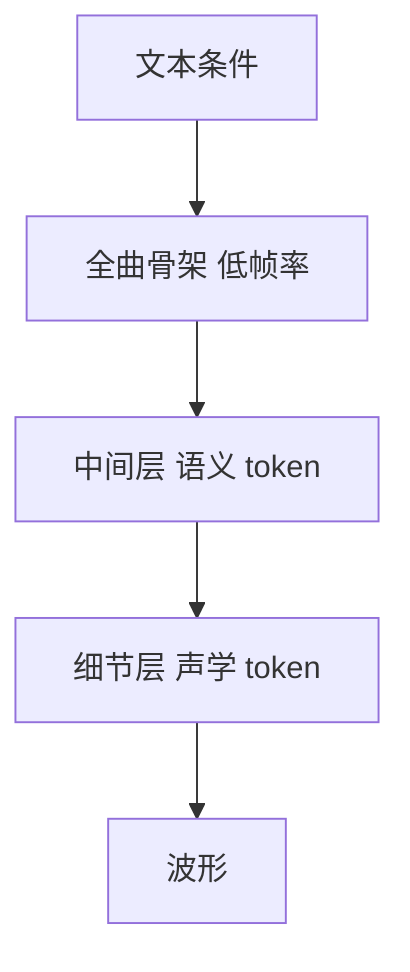

# 音乐生成

一句话:音乐生成要在几分钟的尺度上同时管住**听感**和**结构**——写谱子(符号路线)结构好管但丢掉音色,直接出声(波形路线)听感好但结构难控;而它比语音更难的地方在于,音乐的对错既没有 WER 那样的客观锚点,又确实存在"跑调了"这种人耳一秒就能听出来的硬错误。

## 一、两条路线:写谱子,还是直接出声

两条路线的分歧不在模型结构——都是自回归 Transformer 或扩散——而在**你让模型输出什么**。

### 符号路线:模型输出的是演奏指令

MIDI 不存声音,存的是"什么时候、按哪个键、按多重、按多久"这样的指令,音高和力度各是 0–127 的整数,真正发出声音的是外部的音源或采样器。

> **类比**:MIDI 是菜谱,波形是做好的菜。菜谱可以改一味调料、换一个厨师重做;做好的菜只能整盘倒掉重来。

把一段演奏摊平成 token,经典的两种排法差别很大:

```text
绝对时间事件(Oore 等人那套,示意):
  NOTE_ON<60>  VELOCITY<80>  TIME_SHIFT<496ms>  NOTE_OFF<60>  TIME_SHIFT<8ms> ...

节拍网格事件(REMI 那套,示意):
  Bar  Position<1/16>  Tempo<120>  Chord<C:maj>
  Note_On<60>  Note_Velocity<80>  Note_Duration<1/8>
  Position<5/16>  Note_On<64> ...
```

第一种的词表是 **128 个 NOTE-ON + 128 个 NOTE-OFF + 125 个 TIME-SHIFT + 32 个 VELOCITY,合计 413 个事件**;TIME-SHIFT 一格 8 ms、最多跳 1 秒,长休止靠连着叠几个。**为什么按 8 ms 量化就够?** 因为这个粒度已经低于人耳对节奏偏差的分辨阈,量化误差听不出来;而按固定网格逐格编码会把大量"什么都没发生"的时间步也写进序列,白白拉长。

第二种(Pop Music Transformer 提出的 REMI)把绝对时间位移换成 **Bar 加 Position 的节拍网格**,还额外给了 Tempo 和 Chord 两类 token。**为什么这么改?** 因为按绝对毫秒编码时,模型看不见小节线在哪——"第几拍"这个信息得它自己从数据里推出来,推不准节奏就站不住。改成按拍子编码,等于**把节拍结构直接写进输入格式**,不再指望模型学。这条思路后面第三节还会再出现一次。

序列长度还能再压:Compound Word Transformer 把同一个音符的音高、时值、力度、位置几个 token 打包成一个"复合词",用不同的输出头一步预测多个字段,于是整首歌(最多一万个单 token)也建得动;论文自报比同类模型收敛快 5–10 倍,单张 11 GB 显存的卡上一天内训完。

### 数据量的账:符号路线的红利是三个数量级

一首三分钟 CD 音质立体声是 1411 kbps(这笔账见 音频编解码 篇),约 **31 MB**。同样三分钟的演奏,按上面那套事件词表大约是一两万个事件、每个事件一两个字节,**几十 KB 量级**(这一步是量级估算,不是实测)。

**差了大约三个数量级,这就是符号路线最大的红利**:同样的上下文窗口,能覆盖长得多的真实时间,所以几千万参数的模型就能一次看完整首曲子。

### 两条路线摆在一起

| | 符号(MIDI / 事件序列) | 波形(音频 token / 隐空间) |
|---|---|---|
| 模型输出什么 | 演奏指令:音高、时值、力度、轨道 | 可直接听的声音 |
| 三分钟的序列长度 | 一两万个事件 | 几万到几十万 token(帧率的账见 音频编解码 篇) |
| 音色从哪来 | 外部音源渲染,和模型无关 | 模型自己生成 |
| 能不能改一个音 | 能,拖一下就行 | 不能,改一个音要整段重生成 |
| 乐理结构是显式的吗 | 是:小节、拍号、调号、轨道都是字段 | 否:全部隐含在波形里 |
| 硬约束好不好加 | 好加:解码时屏蔽不合调的音高即可 | 难加:输出空间里没有音高这个变量 |
| 训练数据 | 少,且偏钢琴与流行,风格覆盖窄 | 多,任何录音都能用 |
| 拿不到什么 | 音色、演奏质感、人声、录音空间感 | 可编辑性与乐理可解释性 |

**选型判据是"产物给谁用"**:

- **要给人接着改**的场景(编曲辅助、伴奏生成、旋律补全)走符号,因为输出天然就是可编辑对象。Anticipatory Music Transformer 就是这一类——把控制事件穿插进事件序列,于是同一个模型既能续写也能做填充和配伴奏;更早的 Coconet 干脆放弃从头到尾的生成顺序,用分块 Gibbs 采样反复重写局部,更接近人类作曲那种"改来改去"的过程。
- **直接要成品**的场景(配乐、氛围音乐、带人声的完整歌)走波形,因为音色和演奏质感是听感的大头,而符号路线把这块整个外包给了音源。
- **唱歌基本只能走波形**,因为歌唱的音色和咬字不在 MIDI 的表达范围里。Jukebox 靠"无对齐歌词"当条件让模型唱出来,YuE 把这条推到五分钟的整首歌。人声音色克隆本身见 TTS 篇。
- 中间地带也在长出来:Seed-Music 两条路都留,用自回归出骨架、扩散出音频,并支持在生成结果上直接改歌词和主旋律。

> 🖼️ 占位:同一段音乐的钢琴卷帘(符号)与梅尔谱(波形)上下对照图,在符号侧标出小节线、调号、轨道这些显式字段,在波形侧标出它们如何被"糊"进频谱

## 二、长时结构:音乐和语音最不一样的地方

### 音乐是有层次的,而且听众听得出来

一句十秒的话,结构只有"词序合不合语法"。一首三分钟的歌有四层:**动机**(几个音的小片段)→ **乐句**(几个小节,像句子)→ **段落**(主歌、副歌)→ **全曲布局**(verse-chorus-verse-chorus-bridge-chorus)。

最要命的是**副歌第二次出现要和第一次基本一样**:这是一次跨越一两分钟、上万个 token 的精确重复。Music Transformer 开篇第一句讲的就是这件事——音乐靠重复建立结构和意义,自我指涉发生在从动机到整段的多个时间尺度上。

> 🖼️ 占位:一首流行歌的时间轴层次图,标出动机 / 乐句 / 段落 / verse-chorus 四层,并画出副歌两次出现之间的重复箭头及其跨越的秒数与 token 数

### 自回归为什么容易越写越飘

三条原因叠在一起:

1. **训练窗口比曲子短得多。** 波形侧尤其明显:MusicGen 那套 32 kHz、50 帧/秒、4 层码本的配置,一秒是 200 个 token,三分钟就是 36000 个;而训练通常只在几十秒的片段上做,模型压根没见过"一分钟前的副歌"这个距离的依赖。
2. **误差会累积,而音乐里的漂移是能被听出来的。** 自回归每步都把自己上一步的输出当既成事实,调性和速度这类全局量没有任何机制把它拉回来,于是几十秒后可能悄悄转到别的调、速度也慢慢变。**文本跑题读者还能忍,调跑了人耳立刻不舒服**,因为听觉对音高关系的敏感度远高于对语义连贯的敏感度。
3. **逐 token 的损失在这个尺度上几乎没有信号。** 交叉熵只关心下一个 token 猜得准不准,而"这首歌有没有副歌"是几千步之后才看得出来的性质,单步损失对它几乎不区分。所以**局部好听、整体没形**不是训练不充分,是训练目标本身没在管这件事。

### 三类应对

**第一类,层次化生成:先粗后细。** 先在一个帧率很低、序列很短的表示上把全曲骨架写出来,再逐级补细节。



**为什么这样就管用?** 因为同一个上下文窗口,在低帧率那层覆盖的真实时间长了几倍到几十倍,长程依赖被缩短成了短程依赖。Jukebox 用多尺度 VQ-VAE 把波形压成三级码,先建最粗那级再逐级上采样;MusicLM 是同一思路的 token 版本——MuLan 条件 token(整段只有 12 个)→ 语义 token(w2v-BERT,25 Hz)→ 声学 token(SoundStream,600 个每秒),结构在最粗那层里定下来。

**第二类,先出结构草图再填充。** 显式生成一个"曲式骨架"(段落划分、和弦走向、旋律轮廓),再让下一级把它填成音频。YuE 的 structural progressive conditioning 属于这条——按段落逐步喂歌词,保证长上下文里歌词和曲式对得上。

**第三类,把全局量做成显式条件钉住。** 与其指望模型自己保持速度和调性,不如把 BPM、调号、段落标签当条件输入,推理时由人给定。Stable Audio 的 timing embedding 是这条路上最基础的一个例子:把"这段在整首里的起止位置"和"整首多长"当条件喂进去,模型就知道自己在写开头还是结尾;论文自报能在一张 A100 上 8 秒生成 95 秒的 44.1 kHz 立体声,并强调它和当时的同类不同,能生成带结构的音乐。

**一条把本节和上一节接起来的判据:长时结构难不难,很大程度上就是"多长的真实时间被塞进了多少个 token"的函数。** 符号路线因为序列短,长时结构天然更好做——Music Transformer 把相对注意力的中间显存从随序列长度平方增长降到线性,才做到分钟级(论文说是当时同类工作长度的四倍)。波形路线上的所有层次化设计,本质都是在人工制造一个"更短的序列"出来。

## 三、乐理约束:合不合调是另一种性质的约束

### 和文本流畅度的差别在哪

文本的合法性是**软的、渐变的、由数据统计定义的**:一句话读着别扭和读着通顺之间没有一条线,只有概率高低。

音乐的一部分约束不是这样,它是**硬的、可判定的、由规则定义的**:这个音在不在 C 大调音阶里,是个布尔判断,不需要统计;这一拍落没落在网格上,也是。**能判定,就意味着可以在解码时直接执行,而不必指望模型学会**——这是文本那边根本没有的选项。

但真实的乐理大部分没这么硬:一首歌通常有主调,可转调是合法且常见的手法;功能和声有强偏好(属和弦倾向解决到主和弦),可爵士和现代流行里"违规"进行遍地都是。**所以乐理约束是一条从硬到软的光谱**,不是非黑即白,这也决定了硬约束和软约束各有各的地盘。

### 硬约束:解码时屏蔽,以及它的三条边界

做法很直接:符号路线上,每一步在 softmax 之前,把不合调、不在节拍网格上的音高 token 的 logit 置成负无穷。

三条边界要说清楚:

- **只能用在符号路线上。** 屏蔽要求输出空间里存在"音高"这个可枚举的变量;波形侧的 token 是编解码器学出来的残差码字,**一个 token 不对应任何一个音高**,根本无从屏蔽。
- **约束越硬,采样分布被扭曲得越厉害。** 被屏蔽掉的那部分概率质量会重新分配到剩下的 token 上。模型原本想写的那个经过音被禁掉之后,顶上来的未必更好——所以硬约束适合卡"绝对不能出现"的东西,不适合表达"通常应该这样"。
- **它管不住结构。** 屏蔽保证每个音都合调,却保证不了这段旋律有句子感。**局部合法不等于整体好听**,这和第二节是同一个毛病的两种表现。

### 软约束:与其加惩罚项,不如改表示

软约束最有效的形态不是往损失里加一项,而是**改输入表示**:REMI 把 Bar 和 Position 写进 token,和弦也单独成一类 token,于是节拍与和声结构变成了模型能直接读到的字段,不用它自己从数据里推。**约束被编码进了格式,而不是靠惩罚去教**——这比加损失项稳,因为它不需要在多个目标之间调权重。

波形侧只能走软的,而且更间接。MusicGen 的旋律条件用**色度图**(chromagram,把频谱按 12 个半音类折叠,只看"哪个音级最响");论文明说直接用原始色度图会让模型去重建原样本,所以要**取每帧最响的那个时频 bin 当作信息瓶颈**,把连续的谱信息压成离散的音级序列,模型才被迫去生成而不是照抄。**这个细节值得记:条件给得太细,模型就退化成复制机。**

### 时变控制:文本只能控全局

文本适合控风格、情绪、速度这类全局属性,不适合说"第 12 秒鼓点进来"。Music ControlNet 的做法是从训练音频里**自动抽出旋律、力度、节奏三条时变曲线**配成对,微调一个扩散模型接受这些曲线,并且允许控制只在部分时间段给定;论文自报旋律忠实度比 MusicGen 高 49%,而参数少 35 倍、训练数据少 11 倍。条件注入机制本身(Cross-Attention、ControlNet 这套)见 条件控制 篇,这里只讲音乐侧的条件长什么样。

### 多轨对齐:难的不是多几条序列

多轨的难点在于**几条轨必须共享同一个节拍网格,并且在和声上互相自洽**。

- **符号侧**是排布问题。MuseGAN 把三种排法摆开对比过:各轨各自生成、一个模型统一生成全部轨、以及折中。各轨独立必然对不齐,**因为它们之间没有共享的时间与和声状态**;统一生成又要面对"轨数 × 时间步"的大输出空间。
- **波形侧更麻烦:混音之后各轨的信息是叠在一起的,模型看到的是和,不是各项。** 想让人声和伴奏各自可控,就得先把它们拆开。YuE 的 track-decoupled next-token prediction 正是冲这个来的——把人声轨和伴奏轨分开建模再合起来,避免稠密混合信号把学习目标搅浑。

## 四、文本条件、评测与版权

### 配对数据稀缺到什么程度

拿量级直接对比:图文侧 LAION-5B 有 **58.5 亿**对图文;音乐侧,专家写的 MusicCaps 只有 **5521** 条(取自 AudioSet 的十秒片段,由十位专业音乐人撰写,每条约四句描述加十一项乐理标注),Song Describer 是 **1.1k** 条描述配 706 段录音;连通用音频侧的 LAION-Audio-630K 也只有 **63 万**对,而且不全是音乐。**中间差了五到六个数量级。**

**为什么这么少?** 因为图片的 alt text 是网页里现成的,而**音乐在网上没有对应的现成描述**:歌曲页面上写的是歌名、艺人、流派标签,不是"忧伤的钢琴,带一点房间混响"。

补数据只有两条路,各有代价:

- **弱配对堆规模**:MuLan 拿 4400 万段录音(37 万小时)配网上松散关联的自由文本训双塔;MusicLM 自己的训练集是 500 万段、28 万小时。代价是标注噪声大。
- **让模型写标注**:Noise2Music 用大语言模型给训练音频批量生成配对文本。代价是**标注质量的天花板由那个模型决定**,它写不出的区分度,下游也学不到。

还有一层更根本的模糊:**"史诗感的"到底对应什么声学特征,本身就没有确定答案。** 同一个词在不同流派里指向完全不同的配器和动态;而且它描述的是**听者的感受**,不是信号的属性,不同人给同一段音乐的标签本来就不一致。所以文本到音乐的映射比文本到图像松得多——"红色的猫"有明确的像素级对应,"史诗感"没有。

### CLAP:同一个模型被拿来干三件事

CLAP(Contrastive Language-Audio Pretraining)是音频版的 CLIP:两个塔,一个编音频一个编文本,对比学习把配对的拉近、不配对的推远;LAION 那版用 63 万对音频-文本训出来。它在音乐生成里同时承担三个角色:

| 角色 | 怎么用 | 关键收益 |
|---|---|---|
| 条件编码器 | AudioLDM 直接在 CLAP 隐空间上训扩散:训练喂音频嵌入,推理换成文本嵌入 | **训练完全不需要文本标注**,直接绕开配对数据稀缺 |
| 评测指标 | CLAP score = 生成音频嵌入与输入文本嵌入的余弦相似度 | MusicGen 就是这么报文本对齐度的 |
| 采样打分 | 多次采样后按 CLAP 分挑最好的一条 | 用一次评估换多次生成 |

第一行是真正的巧思:**两个模态已经被对齐到同一个空间,所以条件可以在训练时用音频、推理时换成文本**,配对标注的缺口被对比预训练提前填掉了。

盲区也很直接:**用 CLAP 当条件、又用 CLAP 当指标,等于自己给自己打分。** 分数高只说明生成结果落在 CLAP 认为匹配的那片区域,不代表人听着对;而 CLAP 本身的训练数据带着的正是同一批标注的模糊性。

### 评测为什么比语音更难

语音有客观锚点:ASR 直接有 WER,TTS 至少能拿 ASR 转录去算 WER、拿说话人验证模型算相似度(见 语音识别 篇与 TTS 篇)。**音乐没有这样的锚点**——没有"正确答案文本"可对齐。这和 TTS 的一对多同源,但音乐更极端:**连"内容对不对"这个维度都不存在。**

**FAD 测的是什么。** 把真实音乐集合和生成集合各自过一个音频特征提取器,拿两堆特征的均值与协方差算 Fréchet 距离——**它测的是"生成集合整体的分布像不像真实音乐",不是任何一条单曲好不好。** 原始论文的口径写得很老实:FAD 与人的主观判断相关系数 0.52,而 SDR 是 0.39、余弦距离 −0.15、L2 距离 −0.01。它的卖点从来是"比信号级指标更贴近人耳",不是"绝对准"。

四个盲区必须一起记:

1. **跨论文不可比。** 特征提取器不同、参考集不同、样本量不同,数字就不在一个尺度上。MusicLM 同时报 Trill 版和 VGGish 版的 FAD,MusicGen 报 VGGish 版,Stable Audio Open 报的是 openl3 特征下的 FD——**这三个数放在一起比大小没有意义**,规矩和 MOS 一样(见 TTS 篇),只能看同一张表内部的相对关系。
2. **有系统性偏差。** 已有专门研究指出 FAD 受样本量偏差影响,并提出把分数外推到无穷样本量来修正;同时指出参考集本身低质或有偏时,分数会跟着失真。
3. **高分段会和主观脱钩。** MusicGen 论文自己观察到,在评分最好的那几个模型上,FAD 与主观评分的相关性会崩掉。
4. **对结构完全不敏感。** FAD 比的是特征的一阶二阶统计量,一首"每十秒换个调、没有段落"的曲子,只要每小段的音色统计像真音乐,FAD 照样很好看。**第二节那个最核心的问题,FAD 一点都测不到。**

**主观评测必须拆维度分开问**,因为"好不好"是三件事的混合,而它们经常反向变化——比如把 classifier-free guidance 开大,文本相关性上升、音乐性反而下降:

| 维度 | 问什么 | 为什么要单独问 |
|---|---|---|
| 音质 | 有没有噪声、失真、金属味 | 这一维基本由编解码器和声码器决定,和会不会作曲无关 |
| 音乐性 | 旋律有没有句子感,和声站不站得住,节奏稳不稳 | 这才是作曲能力,和音质完全解耦 |
| 文本相关性 | 结果符不符合提示词 | 和前两维经常此消彼长 |

三条实操:**片段要够长**(十秒听不出结构问题,评长时结构至少给一分钟);**必须盲测并随机化 A/B 顺序**;**要报告评测者的音乐训练程度**,因为外行分不出"和声不对"和"音色不好",两者会被混成一个"不好听"。

### 版权与训练数据

这是音乐生成特有的现实约束,面试真会问。下面只列事实,**法律定性还没有结论,不要替法院下**。

- 2024 年 6 月 24 日,RIAA 宣布 Sony Music、UMG、Warner 等唱片公司分别在马萨诸塞州和纽约南区联邦法院起诉 Suno 与 Udio,核心指控是未经许可复制并使用受版权保护的录音训练模型;新闻稿同时提到两家服务此前都把这种大规模复制说成合理使用(fair use)。
- 此后走向和解与授权:2025 年 10 月 UMG 与 Udio 和解并宣布合作开发获授权的 AI 音乐服务,2025 年 11 月 Warner 分别与 Suno、Udio 达成和解与授权。**"用受版权保护的录音训练是否构成合理使用"这个核心问题,截至目前法院仍未裁决**,Sony 与两家、UMG 与 Suno 的诉讼仍在进行。另一条支线是美国音乐家联合会(AFM)转而起诉 UMG 与 Warner,主张唱片公司拿到了和解与授权收入、而演奏者未获补偿——**和解解决的是厂牌与 AI 公司之间的账,不等于艺人那一侧的账也结清了**。

这件事直接落到技术选型上:

- **数据来源要能说清楚。** MusicGen 的口径写得很明确:2 万小时授权音乐,由内部曲目加 ShutterStock、Pond5 两个授权库构成。Stable Audio Open 干脆只用 Creative Commons 授权的数据训练并开放权重——这不是技术选择,是合规选择,换回来的是可复现与可商用。
- **记忆是可测量的,所以要主动测。** MusicLM 论文做过记忆度研究:拿训练样本的前若干秒当提示、贪心解码续写 5 秒,再和训练数据比对,报告精确匹配始终低于 0.2%,近似匹配约 1%(且多为低多样性片段),同时明确表示当时没有发布模型的计划。**音乐里的记忆比文本更容易被指认**,因为旋律相似性在行业里有成熟的判定实践,所以去重、相似度筛查和输出水印基本是标配。
- **人声克隆是单独一层风险**,机制与水印见 TTS 篇。

## 五、面试考点串联

本篇题库里暂无同名真题,以下全部是按正文断言补出的问法。

| 高频问法 | 本文哪一节 |
|---|---|
| 音乐生成的符号路线和波形路线差在哪?各自适合什么场景?(补充题) | 一(对比表 + 选型判据) |
| 为什么符号路线的序列比波形短这么多?这个差别换来了什么?(补充题) | 一(三个数量级);二(结尾判据) |
| 一段 MIDI 演奏是怎么摊成 token 的?REMI 为什么要改成按拍子编码?(补充题) | 一(两种事件排法) |
| 音乐生成为什么比语音更难保持长时结构?(补充题) | 二(四层层次 + 副歌重复) |
| 自回归模型写着写着就飘了,具体飘在哪?根本原因是什么?(补充题) | 二(三条成因) |
| 层次化生成为什么能帮上长时结构的忙?(补充题) | 二(低帧率那层缩短了长程依赖) |
| 生成的音符合不合调,和文本流不流畅是同一类约束吗?(补充题) | 三(可判定 vs 统计) |
| 想让生成的旋律只用某个调的音,你会怎么做?这招在波形路线上能用吗?(补充题) | 三(解码屏蔽 + 第一条边界) |
| 解码时屏蔽不合调的音,代价是什么?(补充题) | 三(分布扭曲 + 管不住结构) |
| 软约束除了加损失项还能怎么加?(补充题) | 三(改表示:REMI 的 Bar/Position) |
| MusicGen 的旋律条件为什么不能直接喂原始色度图?(补充题) | 三(信息瓶颈,否则退化成复制) |
| 多轨音乐生成难在哪?符号和波形两条路各自怎么处理?(补充题) | 三(共享网格 + 混音后信息叠加) |
| 文本到音乐的配对数据为什么这么稀缺?业界怎么补?(补充题) | 四(数量级对比 + 两条补法) |
| CLAP 在音乐生成里能干几件事?AudioLDM 为什么训练时不需要文本标注?(补充题) | 四(三角色表) |
| FAD 测的是什么?两篇论文的 FAD 能直接比大小吗?(补充题) | 四(四个盲区) |
| 音乐生成的主观评测该怎么设计?为什么三个维度要分开问?(补充题) | 四(维度表 + 三条实操) |
| 音乐生成的训练数据有什么版权争议?工程上怎么应对?(补充题) | 四(事实清单 + 三条落地) |

相邻篇边界:多层码本怎么摊平进一维序列、音频表征谱系、神经编解码器与 RVQ、码率与帧率的账、声学 token 与语义 token 的区别,全部见 音频编解码 篇;声码器、一对多与过度平滑、时长与韵律建模、音色克隆见 TTS 篇;扩散与流匹配的机制本身见 Diffusion 篇和 FlowMatching 篇;条件注入机制本身见 条件控制 篇。

## 相关文献

- Music Transformer — [arXiv:1809.04281](https://arxiv.org/abs/1809.04281)
- This Time with Feeling: Learning Expressive Musical Performance(413 事件词表)— [arXiv:1808.03715](https://arxiv.org/abs/1808.03715)
- Pop Music Transformer: Beat-based Modeling and Generation of Expressive Pop Piano Compositions(REMI)— [arXiv:2002.00212](https://arxiv.org/abs/2002.00212)
- Compound Word Transformer: Learning to Compose Full-Song Music over Dynamic Directed Hypergraphs — [arXiv:2101.02402](https://arxiv.org/abs/2101.02402)
- MuseGAN: Multi-track Sequential Generative Adversarial Networks for Symbolic Music Generation and Accompaniment — [arXiv:1709.06298](https://arxiv.org/abs/1709.06298)
- Counterpoint by Convolution(Coconet)— [arXiv:1903.07227](https://arxiv.org/abs/1903.07227)
- Anticipatory Music Transformer — [arXiv:2306.08620](https://arxiv.org/abs/2306.08620)
- Jukebox: A Generative Model for Music — [arXiv:2005.00341](https://arxiv.org/abs/2005.00341)
- MusicLM: Generating Music From Text — [arXiv:2301.11325](https://arxiv.org/abs/2301.11325)
- MuLan: A Joint Embedding of Music Audio and Natural Language — [arXiv:2208.12415](https://arxiv.org/abs/2208.12415)
- Simple and Controllable Music Generation(MusicGen)— [arXiv:2306.05284](https://arxiv.org/abs/2306.05284)
- Noise2Music: Text-conditioned Music Generation with Diffusion Models — [arXiv:2302.03917](https://arxiv.org/abs/2302.03917)
- AudioLDM: Text-to-Audio Generation with Latent Diffusion Models — [arXiv:2301.12503](https://arxiv.org/abs/2301.12503)
- Fast Timing-Conditioned Latent Audio Diffusion(Stable Audio)— [arXiv:2402.04825](https://arxiv.org/abs/2402.04825)
- Stable Audio Open — [arXiv:2407.14358](https://arxiv.org/abs/2407.14358)
- Music ControlNet: Multiple Time-varying Controls for Music Generation — [arXiv:2311.07069](https://arxiv.org/abs/2311.07069)
- YuE: Scaling Open Foundation Models for Long-Form Music Generation — [arXiv:2503.08638](https://arxiv.org/abs/2503.08638)
- Seed-Music: A Unified Framework for High Quality and Controlled Music Generation — [arXiv:2409.09214](https://arxiv.org/abs/2409.09214)
- Large-scale Contrastive Language-Audio Pretraining with Feature Fusion and Keyword-to-Caption Augmentation(LAION-CLAP)— [arXiv:2211.06687](https://arxiv.org/abs/2211.06687)
- Fréchet Audio Distance: A Metric for Evaluating Music Enhancement Algorithms — [arXiv:1812.08466](https://arxiv.org/abs/1812.08466)
- Adapting Frechet Audio Distance for Generative Music Evaluation — [arXiv:2311.01616](https://arxiv.org/abs/2311.01616)
- The Song Describer Dataset: a Corpus of Audio Captions for Music-and-Language Evaluation — [arXiv:2311.10057](https://arxiv.org/abs/2311.10057)
- LAION-5B: An open large-scale dataset for training next generation image-text models(图文配对数量的对照)— [arXiv:2210.08402](https://arxiv.org/abs/2210.08402)
- Record Companies Bring Landmark Cases for Responsible AI Against Suno and Udio(RIAA 2024-06-24 新闻稿,第四节版权事实的出处)— https://riaa.com/record-companies-bring-landmark-cases-for-responsible-ai-againstsuno-and-udio-in-boston-and-new-york-federal-courts-respectively/
