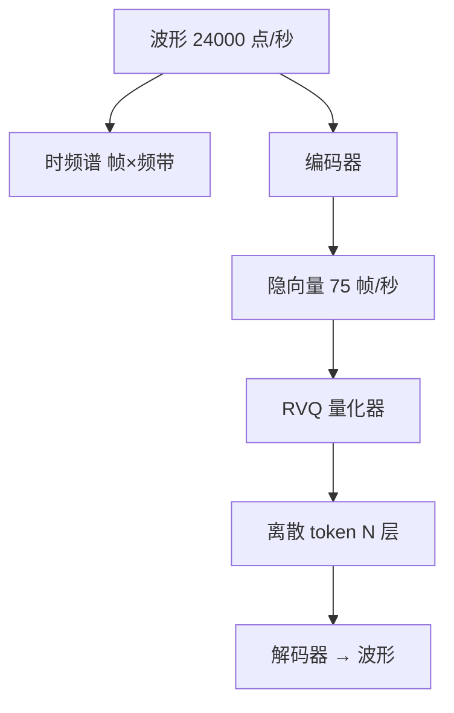

# 音频编解码

一句话:音频编解码讲的是**怎么把一秒钟几万个采样点,压成一串模型吃得下的东西**——压成频谱是给传统信号处理和声学模型用的,压成离散 token 是给 LLM 用的;而神经编解码器(SoundStream、EnCodec 这一类)就是今天负责后者的那个部件。本篇是音频子领域的地基:表征谱系只在这里讲一次,合成、识别、音乐各篇都从这里往下接。

## 一、音频长什么样:波形、时频谱、离散 token

### 原始波形:先把数据量的账算清楚

麦克风采到的东西是一维的:每秒采 $f_s$ 次,每次记一个整数,表示那一瞬间气压偏离静止值多少。两个参数定死了它:

- **采样率**决定能记住多高的频率。奈奎斯特定理说采样率得是最高频率的两倍以上,所以 CD 用的 44.1 kHz 大约能覆盖到 22 kHz,正好包住人耳上限;语音任务常用 16 kHz(只要覆盖到 8 kHz,辅音的擦音信息基本还在),生成类模型多用 24 kHz。
- **位深**决定每个采样点用多少 bit。16 bit 给出约 96 dB 的动态范围,也就是最响和最轻之间能差六个数量级。

一乘就知道原始音频有多贵:CD 立体声是 $44100 \times 16 \times 2 = 1411$ kbps。**这就是为什么直接拿波形做序列建模很难**——不是"点太多"这么笼统,而是三件具体的事:

1. **序列长得离谱**。一秒 24000 个 token 的话,Transformer 的注意力代价按平方涨,十秒音频就已经是二十几万长度。
2. **单个采样点几乎不携带语义**。一个点告诉你的只是某一瞬的气压,音素、音高、说话人这些信息全部藏在**几百到几千个点的相对关系**里。这和文本正好相反,文本一个 token 本身就有意思。
3. **相位不敏感**。同一段声音,把整体波形延迟半个周期,人听起来完全一样,但逐点算 MSE 会得到巨大的误差。**用逐点损失去训波形模型,等于在惩罚人耳根本听不出的差别。**

### 时频表示:STFT 与梅尔谱,以及被丢掉的相位

于是有了第二级台阶:切成短帧做傅里叶变换。**短时傅里叶变换(STFT)** 就是拿一个几十毫秒的窗在波形上滑,每滑一步算一次频谱,得到一张"时间 × 频率"的二维图。

> **类比**:波形是一段录音的逐秒气压流水账,STFT 是把它改写成乐谱——横轴时间,纵轴音高,格子里的数是那个音在那一刻有多响。

STFT 的每个格子其实是**复数**,包含幅度和相位两部分。实践中绝大多数流程只留幅度、扔掉相位,再把线性频率轴压到**梅尔刻度**(低频分得细、高频分得粗,模拟人耳对低频更敏感),得到梅尔谱。这一步把频率维从几百降到 80 左右,信息密度高了一大截。

**丢相位的代价是它不可逆。** 只有幅度谱,你不知道各个频率分量之间的时间对齐关系,硬还原会得到金属味的"机器人音"。经典补救是 Griffin-Lim 这类迭代相位重建算法——反复在"时域"和"频域"之间来回投影,猜一个相位出来,快但音质有损;现代做法是训一个神经网络直接从梅尔谱生成波形,那就是声码器,**归 TTS 篇**。

所以梅尔谱是一条**有损且单向**的路:它适合做识别的输入(识别本来就不需要还原声音),不适合当生成链路的中间表示,除非你愿意在末端再挂一个声码器。

### 为什么 LLM 时代非要把音频离散化

第三级台阶是离散 token。**理由和图像那边完全一样:接口。** 自回归 Transformer 的训练目标是有限词表上的分类,它要的是"第 t 步是几号 token"这种整数标签;而波形和频谱都是连续实数,交叉熵无从谈起。把音频离散成 token,它就能和文本 token 排进同一条序列、共用同一个 softmax、共用同一套已经被验证过的 LLM 训练基建。

这条思路的完整版本见 图像Tokenizer 篇(视觉侧的路线之争在那里)。音频侧的特殊之处是**帧率这一维额外贵**:图像是一次性的二维网格,音频是没有尽头的一维流,帧率高一点,几分钟对话的 token 数就爆了——这条贯穿全篇。

> 🖼️ 占位:同一段两秒语音的波形 / 线性幅度谱 / 梅尔谱 / RVQ 逐层残差能量四联对照图

## 二、神经编解码器:编码器 + 量化器 + 解码器

### 三段各干什么

结构和图像的 VQ 自编码器同构,只是卷积换成一维的:

| 部件 | 干什么 | 关键设计 |
|---|---|---|
| 编码器 | 一维卷积不断下采样,把波形压成低帧率的隐向量序列 | 步长连乘决定压缩倍率;要流式就必须用因果卷积 |
| 量化器 | 把每帧的连续向量换成码本索引 | 单层码本不够,得叠成 RVQ(第三节) |
| 解码器 | 转置卷积逐级上采样,把 token 还原成波形 | 结构基本是编码器的镜像 |

SoundStream 的编码器步长是 $(2,4,5,8)$,连乘等于 **320**,也就是每 320 个采样点出一帧;在 24 kHz 下就是 **每秒 75 帧**。EnCodec 沿用同一套配置,论文原话是编码器在 24 kHz 下每秒输出 75 个隐步。**记住 75 这个数**,后面所有码率账都从它出发。

### 和 MP3、Opus 的分野

传统编解码器和神经编解码器解决的是同一个问题,路子完全不同:

| | 传统编解码器(MP3 / Opus) | 神经编解码器(SoundStream / EnCodec / DAC) |
|---|---|---|
| 表示怎么来 | 人手设计的变换 + 心理声学模型,按"人听不见就扔"分配比特 | 编码器从数据里学出来 |
| 优化目标 | 感知失真的工程近似,不端到端训练 | 端到端最小化重建 + 对抗 + 谱损失 |
| 低码率下的表现 | 到几 kbps 就开始出现明显的"水声"与频带截断 | 在同等码率上明显更好 |
| 输出能不能当 token | 不能,比特流是熵编码后的字节 | 能,量化索引天然就是整数 token |
| 算力 | 极低,手机上可以忽略 | 要跑神经网络,量级高得多 |

Opus 的规格给个参照:它从 6 kbit/s 的窄带语音一路覆盖到 510 kbit/s 的立体声音乐,帧长可选 2.5 到 60 ms,算法延迟在 5 到 65.2 ms 之间。SoundStream 论文报告的对比是**在 3 kbps 上超过 12 kbps 的 Opus,并接近 9.6 kbps 的 EVS**——四倍码率优势,这就是"学出来的表示"值钱的地方。

**为什么能好这么多?** 因为传统编解码器必须保证解码是一个确定的、逐比特可复现的信号重构过程,它只能"少扔一点";神经解码器是个生成模型,**它被允许把丢掉的高频细节重新编出来**,只要听起来对就行。代价也在这里:低码率下神经编解码器会**编造**细节,重建波形和原波形逐点对不上,所以评测不能只看 PSNR/SNR,必须上主观打分或感知指标。

### 训练目标:为什么一定要挂判别器

只用波形上的 MSE 训不出能听的东西,原因就是第一节说的相位不敏感。所以这一类模型的损失至少是三块:**时域重建 + 多尺度频谱重建 + 对抗损失**。EnCodec 的主要贡献之一就是一个多尺度谱判别器(在多个 STFT 分辨率上分别判真假)用来压制人工痕迹,外加一个损失平衡器,自动调各项权重——多目标训练里手调权重是主要的不稳定来源。

DAC 把这条路推得更远:同一个通用模型同时覆盖语音、环境音和音乐,论文口径是**把 44.1 kHz 音频压到 8 kbps,约 90 倍压缩**。

### 流式与前瞻窗口:延迟是怎么来的

想边说边编码,唯一的硬约束是**编码器不能看未来**:所有卷积必须是因果的(只卷当前和过去的采样点),归一化也不能跨整段做统计。付出的代价是同参数下重建质量比非因果版本差一截,因为模型少了后文这一半上下文。

做到因果之后,**架构延迟就等于一帧的长度**:攒够 320 个采样点才能出一个隐向量。EnCodec 报告 24 kHz 流式模型的初始延迟是 **13.3 ms**(不含计算时间),SoundStream 同配置报的是 13 ms。这个数远小于人对对话卡顿的感知阈值,所以**神经编解码器本身不是实时系统的延迟瓶颈**,瓶颈在它后面挂的那个 LLM。

如果放宽因果性、允许看未来 $k$ 帧,质量会回升,但延迟直接加 $k \times 13.3$ ms。**这就是前瞻窗口的汇率**:每多看一帧未来,就多等一帧。

## 三、残差矢量量化:一层码本为什么不够

### 先看单层码本的账根本算不下去

SoundStream 论文里有一笔很值得记的账。24 kHz、每秒 75 帧,想做到 6 kbps,那么每帧能花 $6000 / 75 = 80$ bit。而矢量量化是"$N$ 选 1"的查表,80 bit 意味着码本要有 $2^{80}$ 条向量——**这个码本存不下、更训不出来**。

问题的本质是:**单层 VQ 的码本大小随比特数指数增长**,而码率是一个线性预算。指数对线性,必然算不下去。

### 残差递推:一层不够就叠一层

RVQ 的想法直白得像做减法:第一层量化完之后,把**没量准的那部分**再拿去量化一次,如此叠 $N_q$ 层。

$$
r_1 = z, \qquad c_i = Q_i(r_i), \qquad r_{i+1} = r_i - c_i, \qquad \hat{z} = \sum_{i=1}^{N_q} c_i
$$

读法:$z$ 是编码器输出的这一帧向量;第 $i$ 层拿当前残差 $r_i$ 去自己的码本里查最近邻,得到码字 $c_i$;减掉之后剩下的 $r_{i+1}$ 交给下一层。最终重建是所有层码字之和。**每一层都在修正前面所有层的累计误差**,所以残差的能量是逐层递减的——这一条是后面所有性质的根。

于是码率变成 $f_{\text{帧}} \times N_q \times \log_2 N$:帧率、层数、每层码本大小三者相乘。回到刚才那笔账,6 kbps 的 80 bit 用 $N_q = 8$ 层、每层 $N = 1024$(10 bit)就凑齐了,而 $8 \times 1024$ 条码向量是完全训得动的规模。**指数问题被拆成了线性问题**,这就是 RVQ 唯一但决定性的贡献。

EnCodec 的口径同样清晰:最多 32 个码本、每个 1024 条(10 bit)。在 75 帧/秒下,**每加一层码本就是 750 bps**,所以 32 层正好是 24 kbps,支持的档位是 1.5、3、6、12、24 kbps。

### 各层装的东西不一样

层与层之间地位并不平等,**这是面试最容易被追问的一点**:

| 层 | 量化的是什么 | 承载的信息 | 掉了会怎样 |
|---|---|---|---|
| 第 1 层 | 原始隐向量本身,能量最大 | 骨架:音素内容、大致音高与响度轮廓 | 直接不成话,内容全毁 |
| 中间几层 | 逐渐变小的残差 | 音色、说话人身份、韵律细节 | 内容还听得懂,但音色跑偏、发闷 |
| 最后几层 | 很小的残差 | 高频毛刺、呼吸声、房间混响这类"质感" | 听感略糙,信息基本不丢 |

判据不能靠感觉:实测手段是**逐层残差能量**加**只解码前 $k$ 层的重建结果**。某一层之后残差已经很小、重建也不再变好,那层就只是白白拉长序列。

顺带说明一个常见误会:**这种分工是残差结构自然涌现的,不是设计出来的**,所以第一层里的"语义"并不干净,它同时混着音色。真要让第一层只装内容,得**显式去逼**——SpeechTokenizer 就是拿 HuBERT 当语义教师,把语义蒸馏进第一层 RVQ,让后面几层去补剩下的副语言信息;Moshi 的 Mimi 编解码器同样把 WavLM 的语义蒸馏进 RVQ 第一层。这条线接到第四节。

### 量化器 dropout:一个模型跑多档码率

训练时**随机截断使用的层数**(SoundStream 叫 structured dropout),让模型习惯"只有前 $k$ 层可用"的情况。于是推理时想省带宽就少传几层,想要音质就多传几层,**一个模型覆盖全部码率档位**,论文报告相比各档单独训练质量损失可以忽略。这也顺带保证了低层必须自己扛住主要信息——因为它随时可能是唯一被解码的层。

### 码本坍塌:音频侧同样会发生

大量码字长期没被选中、少数码字吃掉绝大多数命中,这套毛病在音频 RVQ 上和图像上是同一回事。成因诊断(死码 / 利用率失衡 / 表示坍塌)与缓解手段(k-means 初始化、EMA、死码重启、低维查表)**见 VAE 篇**,那里已经写透。这里只强调一条音频特有的操作要求:**RVQ 必须逐层统计利用率**,把各层混起来算一个总数,深层的问题会被第一层的健康数据整个盖住。

## 四、三角权衡,以及音频 token 接进 LLM

### 码率、质量、延迟这个三角

三个量互相拉扯,给定架构下只能挑两个:

| 想改善的 | 代价落在哪 | 判据 |
|---|---|---|
| 降码率 | 先丢高频质感,再丢音色,最后丢内容可懂度 | 主观 MOS 或感知指标,不能只看 SNR |
| 提质量 | 加层数(码率涨)或加帧率(序列涨)或放宽因果性(延迟涨) | 固定码率再比,否则对比不成立 |
| 降延迟 | 因果卷积 + 不留前瞻,质量掉一截 | 报延迟必须说清含不含计算时间 |

**码率为什么不能无限往下压?** 因为解码器再强也是在**猜**丢掉的信息,而猜是有下限的:压到只剩内容骨架时,音色和韵律已经无从恢复,再往下连音素都开始混淆。工程上先坏的顺序恰好是第三节那张层次表的逆序——这不是巧合,少传一层就是砍掉最后一层残差。

### 帧率才是接 LLM 时真正的成本

**这是本节最该记住的一条:对编解码器来说码率是主要指标,对下游 LLM 来说帧率才是。**

算一下就清楚。EnCodec 那套 75 帧/秒、8 层的配置,一秒音频是 $75 \times 8 = 600$ 个 token,一分钟对话就是 36000 个 token,还没算文本那一路。Mimi 走的是另一个极端:**12.5 Hz 帧率、8 个量化器、码本 2048、合计 1.1 kbps**,一秒只有 100 个 token,一分钟 6000 个。同样是给 LLM 供料,序列长度差六倍,而且自回归还得逐帧串行——**帧率同时决定了上下文预算和生成速度**。

所以这两年的编解码器竞赛主线是**在压低帧率的同时保住音质**:Mimi 靠语义蒸馏让低帧率下的第一层足够有信息量;WavTokenizer 更激进,论文自报 24 kHz 下一秒音频只用单个量化器的 40 或 75 个 token。Moshi 全系统实测端到端延迟 200 ms(理论 160 ms),低帧率是这个数字成立的前提。

### 声学 token 与语义 token

两类 token 来源不同、优点正好互补:

| | 声学 token | 语义 token |
|---|---|---|
| 从哪来 | 编解码器的 RVQ 索引 | 自监督语音模型(HuBERT、WavLM)的中间层特征聚类 |
| 训练目标 | 重建波形 | 掩码预测,没有解码器 |
| 装的是什么 | 音色、韵律、环境声,还原度高 | 偏内容,对说话人和录音条件不敏感 |
| 能不能还原成声音 | 能,这是它的本职 | 不能,得再配一个声学模型 |
| 典型毛病 | 长程结构差,几秒后就跑偏 | 听不出是谁在说,细节全无 |

AudioLM 的做法是**两者串联**:先用语义 token 建长时结构,再用编解码器的声学 token 出高保真波形,论文把这叫混合 tokenization。后来的路线更倾向**合并**——SpeechTokenizer 与 Mimi 都把语义蒸馏进 RVQ 第一层,于是同一串 token 的第一层管内容、其余层管声学,下游只需要面对一套词表。

### 多层 token 怎么排进一维序列

RVQ 每帧吐出 $N_q$ 个 token,而 LLM 的输入是一维的,**这个二维网格怎么摊平是个真问题**。MusicGen 系统比较过几种排布:

| 排布 | 怎么排 | 代价 |
|---|---|---|
| 拉平(flatten) | 一帧内 $N_q$ 层依次排完,再排下一帧 | 步数变成 $N_q$ 倍,帧率优势全丢 |
| 并行(parallel) | 一步同时预测同一帧的全部层 | 步数最少,但假设层间条件独立,而它们强相关 |
| 延迟(delay) | 第 $k$ 层整体往后挪 $k-1$ 帧再并行预测 | 保持原帧率,同时让深层能看到浅层的当步结果 |
| 分层预测 | 大模型走时间轴,小模型在每帧内部把 $N_q$ 层建成小自回归 | 多一个模块,但时间步数不变 |

MusicGen 的消融给了一个直观数字:30 秒音频用延迟排布是 1500 步,拉平要 6000 步。**拉平最"正确"却最贵,并行最便宜却最不准,延迟是那个实际好用的折中**——它用一点点时间错位换回了层间依赖。分层预测是另一条主流,Moshi 的 RQ-Transformer 就是这个形状:一个大的时间 Transformer 逐帧走,一个小的深度 Transformer 在帧内把 8 层依次吐出来;它还额外在语义与声学 token 之间留 1 到 2 步延迟,论文说这显著改善生成质量。

### 给下游留下的麻烦

把音频当 token 建模,有几个坑是文本侧不会遇到的:

1. **错一个 token 就是一声爆音**。文本预测错一个词往往还读得通,音频第一层错一帧会直接听出咔哒声,而自回归会把它当成既成事实继续往下编。
2. **词表被层数乘了一遍**。$N_q$ 层各有各的码本,要么开 $N_q$ 套嵌入和输出头,要么把层号编进 token id 让词表膨胀 $N_q$ 倍。
3. **上下文预算被音频吃光**。即便 12.5 Hz,几分钟对话也上万 token,和文本抢同一份上下文。
4. **换编解码器 = 下游重训**。token 的语义完全由那个编解码器定义,换一个就全部作废,和换 VAE 要重训扩散模型是同一回事。

这几条正是 VALL-E 那类系统要拆成两段的原因:它拿 60000 小时英文语音训练,用自回归模型建第一层、非自回归模型一次性出其余层,只需 3 秒提示音就能克隆音色——**自回归只用在最不能出错的那一层上**。合成侧的完整链路归 TTS 篇,识别侧归 语音识别 篇,音乐的长时结构归 音乐生成 篇;视觉特征接进 LLM 的几条接法见 VLM结构 篇,音频的特殊之处就是本节这个"帧率 × 层数"的二维摊平问题。

> 🖼️ 占位:拉平 / 并行 / 延迟三种 token 排布的时序网格对照,横轴为帧、纵轴为 RVQ 层,标出各自的自回归步数

## 五、面试考点串联

| 高频问法 | 本文哪一节 |
| --- | --- |
| 音频进模型前一般怎么表示?为什么不直接拿波形建模?(补充题) | 一 |
| 梅尔谱把什么丢了?丢了之后还能还原成声音吗?(补充题) | 一(相位不可逆;声码器归 TTS 篇) |
| 神经编解码器和 MP3、Opus 差在哪?为什么能在更低码率上更好听?(补充题) | 二(对照表 + 生成式解码器) |
| 编解码器的延迟是怎么来的?要做流式得付什么代价?(补充题) | 二(因果卷积与前瞻窗口) |
| 为什么不能直接用一本大码本,非要叠 RVQ?(补充题) | 三(指数对线性那笔账) |
| RVQ 是怎么一层层逼近的?层数和码率是什么关系?(补充题) | 三(残差递推 + 码率三因子) |
| RVQ 第一层和后面几层各装什么?怎么验证不是拍脑袋?(补充题) | 三(层次表 + 逐层残差能量) |
| 一个编解码器怎么做到既能跑 1.5 kbps 又能跑 24 kbps?(补充题) | 三(量化器 dropout) |
| 码率为什么不能无限往下压?先坏的是什么?(补充题) | 四(三角权衡) |
| 语义 token 和声学 token 差在哪?为什么后来要把它们合进一个量化器?(补充题) | 四(对照表 + 语义蒸馏) |
| 多层 RVQ token 怎么排进一维序列?直接拉平有什么问题?(补充题) | 四(四种排布) |
| 拿编解码器当 LLM 的 tokenizer,选型时最该盯哪个数?(补充题) | 四(帧率而非码率);三 |
| 音频 RVQ 会不会码本坍塌?怎么查?(补充题) | 三(逐层统计);成因与缓解见 VAE 篇 |

## 相关文献

- SoundStream: An End-to-End Neural Audio Codec — [arXiv:2107.03312](https://arxiv.org/abs/2107.03312)
- High Fidelity Neural Audio Compression(EnCodec) — [arXiv:2210.13438](https://arxiv.org/abs/2210.13438)
- High-Fidelity Audio Compression with Improved RVQGAN(DAC) — [arXiv:2306.06546](https://arxiv.org/abs/2306.06546)
- Neural Discrete Representation Learning(VQ-VAE:量化与码本机制的源头) — [arXiv:1711.00937](https://arxiv.org/abs/1711.00937)
- AudioLM: a Language Modeling Approach to Audio Generation — [arXiv:2209.03143](https://arxiv.org/abs/2209.03143)
- SpeechTokenizer: Unified Speech Tokenizer for Speech Large Language Models — [arXiv:2308.16692](https://arxiv.org/abs/2308.16692)
- HuBERT: Self-Supervised Speech Representation Learning by Masked Prediction of Hidden Units — [arXiv:2106.07447](https://arxiv.org/abs/2106.07447)
- Simple and Controllable Music Generation(MusicGen:码本交错排布) — [arXiv:2306.05284](https://arxiv.org/abs/2306.05284)
- Neural Codec Language Models are Zero-Shot Text to Speech Synthesizers(VALL-E) — [arXiv:2301.02111](https://arxiv.org/abs/2301.02111)
- Moshi: a speech-text foundation model for real-time dialogue(Mimi 与 RQ-Transformer) — [arXiv:2410.00037](https://arxiv.org/abs/2410.00037)
- WavTokenizer: an Efficient Acoustic Discrete Codec Tokenizer for Audio Language Modeling — [arXiv:2408.16532](https://arxiv.org/abs/2408.16532)
- Definition of the Opus Audio Codec — https://www.rfc-editor.org/rfc/rfc6716
