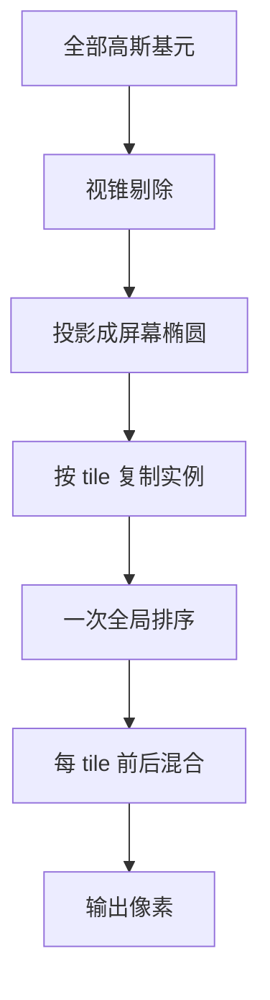

# 3DGS

一句话:3DGS(3D Gaussian Splatting)把场景表示成几百万个带朝向的半透明椭球色斑,渲染时把它们逐个拍扁到屏幕上、按深度混合成图——整条渲染路径里**没有神经网络**,靠的是 GPU 最擅长的光栅化,所以能在 1080p 下跑到一百多帧。

## 一、它要回答的问题:和 NeRF 是同一道题

任务完全一样:给一组标定过位姿的多视角照片,重建出一个能从任意新视角渲染的场景。NeRF 用一个 MLP 隐式地存"空间中任一点的密度和颜色",渲染时沿每条射线步进采样、把采样点按体渲染方程累积起来——**体渲染方程、位置编码、分层采样,以及体素/点云/网格/隐式场这套 3D 表示谱系,全部见 NeRF 篇**,本篇不重复。

这条路线的病根一句话能说清:**渲染一个像素的代价 = 沿射线采几十上百个点 × 每个点跑一次网络前向**。原始 NeRF 每条射线粗采 64 个点、细采 128 个点,共 192 个,每个点过一个 8 层 × 256 宽的 MLP。1080p 有 207 万个像素,一帧就是约 **4 亿次 MLP 前向**;论文自报在 V100 上渲染一帧约 30 秒,训练一个场景 1–2 天。

3DGS 押的注是:**把隐式换成显式**。场景不再藏在网络权重里,而是一张几百万行的基元表,每一行看得见、能直接增删改。这一换,渲染就从"沿射线积分"变成"把基元投影到屏幕",而后者正是显卡三十年来一直在干的事。

### NeRF 与 3DGS 的机制对照

| 维度 | NeRF | 3DGS |
|---|---|---|
| 场景存在哪 | 隐式:MLP 权重里 | 显式:一张定长参数的基元表 |
| 渲染怎么做 | 每像素射一条射线,沿途采样查网络 | 每个基元投影一次,分块排序后混合 |
| 渲染回路里有网络吗 | 有,而且是全部开销 | 没有,只剩矩阵乘和 alpha 混合 |
| 单帧代价正比于 | 像素数 × 每射线采样数 × 网络规模 | 基元数 + 像素数 × 每像素命中的基元数 |
| 空区域怎么处理 | 也得采样(分层采样只能缓解,粗采样绕不开) | 那里压根没有基元,不产生任何工作 |
| 存储 | 小,MLP 几 MB | 大,单场景几百 MB |
| 想改场景 | 难,得动网络权重 | 易,直接删/挪/改某几个椭球 |
| 几何质量 | 是个密度场,可提面但有噪 | 椭球不贴合真实表面,提面更难,见 网格生成 篇 |

## 二、一个高斯基元里存了什么

把每个基元想成**一团有朝向的椭球形雾**:中心最浓,向外按高斯函数衰减,整团可以被拉长、压扁、任意旋转。它带四组参数:

| 参数 | 浮点数个数 | 管什么 |
|---|---|---|
| 均值 $\mu$ | 3 | 椭球中心在哪 |
| 协方差 $\Sigma$,拆成缩放 + 旋转存 | 3 + 4 | 三个半轴多长、整体朝哪个方向 |
| 不透明度 $\alpha$ | 1 | 这团雾有多浓 |
| 球谐系数 | 48 | 从不同角度看,颜色怎么变 |

合计 **59 个浮点数**,约 236 字节。这个数后面算存储时要反复用到。

### 为什么协方差不能直接存成矩阵

协方差矩阵决定椭球的形状和朝向,但它不能当成 6 个(对称阵)自由参数直接丢给优化器,因为**协方差矩阵只有在半正定时才有几何意义**——一旦某个特征值被梯度推成负数,它就不再对应任何椭球,渲染当场失去意义。而普通梯度下降没法把参数约束在半正定锥里面。

3DGS 的办法是换个参数化,让"合法"变成结构上的保证:

$$
\Sigma = R S S^\top R^\top
$$

其中 $S$ 是对角缩放矩阵(实际存成 3 维向量 $s$,即三个半轴长度),$R$ 是旋转矩阵(实际存成 4 维四元数 $q$)。这个式子在说:**先把一个标准球按 $s$ 拉成椭球,再按 $q$ 转到该有的朝向**。因为整体写成了 $MM^\top$ 的形式($M = RS$),不管 $s$ 和 $q$ 被梯度推到什么值,乘出来都天然半正定——**约束被编进了参数化里,优化器怎么走都走不出合法集合**。

代价是每一步都要从 $s, q$ 现算 $\Sigma$,并手写它对 $s, q$ 的导数(交给自动微分太慢),这也是 3DGS 的反向传播是手工 CUDA 实现的原因之一。

> "各向异性(anisotropic)"就是指三个半轴可以不等长。这条比看上去重要:**一根细长椭球能用一个基元描述一根电线或一片叶子边缘**。论文的消融说得很直接,各向异性显著提升了高斯贴合表面的能力,从而在同样点数下拿到高得多的渲染质量。

### 为什么颜色是球谐系数,不是一个 RGB

因为真实物体的颜色**跟看的角度有关**:金属高光换个位置就挪走了,水面反射整个变掉。如果每个基元只存一个固定 RGB,这些效果全丢,优化器只能把高光抹平成一个折中色,场景看起来像塑料。

那"每个方向存一个颜色"呢?方向是连续的,存不下。**球谐(Spherical Harmonics,SH)就是球面上的傅里叶展开**:用少量系数表达一个定义在球面上的函数,低阶项管整体基色和缓慢变化,高阶项管某个方向上的尖锐高光。3DGS 用到 3 阶(论文说的 4 个 band),即每个颜色通道 16 个系数,RGB 三通道共 48 个。**球谐本身的数学不在本篇范围**,记住它在这里的角色就够:一个便宜的、可微的"视角 → 颜色"查表器。

训练上有个配套技巧:**开局只启用 0 阶(等价于一个纯色),之后每 1000 步放开一个 band**。因为高阶系数在几何还没收敛时会拼命去拟合噪声,先把形状定下来再学高光,收敛稳得多。

## 三、可微光栅化:快的根子在这里

### 一帧是怎么画出来的

拆开说:

1. **投影**(splat):把 3D 椭球压成屏幕上的 2D 椭圆。均值走标准相机变换;协方差按 $\Sigma' = J W \Sigma W^\top J^\top$ 变换,$W$ 是视图变换,$J$ 是投影变换的**仿射近似**的雅可比。这套投影来自 2001 年的 EWA volume splatting,不是 3DGS 发明的,3DGS 的贡献是把它做成了可微且能反传的版本。
2. **分块**:屏幕切成 16×16 像素的 tile,每个高斯落在几个 tile 上就复制出几个实例。
3. **排序**:给每个实例造一个 64 位 key,高位放 tile 编号、低位放视图空间深度,然后**对全部实例做一次 GPU radix sort**。排完之后,同一个 tile 的实例天然连续存放,且已按深度排好序。
4. **混合**:每个 tile 交给一个 block,把该 tile 的基元列表批量搬进 shared memory,block 内所有线程沿同一份列表从前往后走做 alpha 合成,累计不透明度接近 1 就提前收工。
5. **反传**:不需要保存前向时每个像素命中了哪些基元。做法是只记下前向结束时的累计不透明度,反传时**从后往前重走一遍**,每步除以当前基元的 $\alpha$ 就能还原出中间的透射率。

第 4 步的 alpha 合成公式,和 NeRF 离散化后的体渲染是**同一个式子**,同源,推导见 NeRF 篇。差别只在采样点从哪来:NeRF 是沿射线采出来的,3DGS 就是恰好盖住这个像素的那几个基元。

> 🖼️ 占位:3D 椭球投影成屏幕 2D 椭圆、屏幕划分 16×16 tile、一个 tile 内基元按深度排成一列的几何示意图

### 为什么能快一到两个数量级

四条根因,按分量排:

1. **每个基元只投影一次,和它盖住多少像素无关**。射线步进是"每个像素独立地把网络跑 192 遍",工作量随像素数线性放大;光栅化是"每个基元算一次投影,再把结果摊到它覆盖的像素上",投影这块的开销只和基元数有关。这是光栅化相对射线追踪的经典优势,不是 3DGS 的新发明;3DGS 的贡献是找到了一种既能被光栅化、又能被梯度优化到 NeRF 级画质的基元。
2. **渲染回路里没有神经网络**。这条最狠:剩下的运算只有几个小矩阵乘、一次指数、一串乘加。**那 4 亿次 MLP 前向是被整个删掉了**,不是被优化了。
3. **排序只做一次,不是每像素一次**。全局 radix sort 是 GPU 上极高效的原语;代价是同一 tile 内所有像素共用一份排序,这是个近似,坑在后面。
4. **访存模式正好对上 GPU 的脾气**。tile 内所有线程读同一份基元列表,合并访存、shared memory 复用、几乎没有 warp divergence,详见 GPU架构与执行模型 篇。

反过来这也解释了训练为什么跟着快:训练的每一步就是渲染一帧 + 反传,渲染便宜了训练自然便宜。

### 论文的数字,注意口径

原论文 Table 1。**渲染 FPS 与训练时长均在单张 A6000 上测得**,唯独 Mip-NeRF360 这一行是在 4 卡 A100 上训 12 小时、折算成 48 GPU 小时:

| Mip-NeRF360 数据集 | PSNR | FPS | 训练 | 存储 |
|---|---|---|---|---|
| Mip-NeRF360 | 27.69 | 0.06 | 48h | 8.6 MB |
| Instant-NGP(Base) | 25.30 | 11.7 | 5m37s | 13 MB |
| 3DGS(30K 步) | 27.21 | **134** | 41m33s | 734 MB |
| 3DGS(7K 步) | 25.60 | **160** | 6m25s | 523 MB |

怎么读这张表:

- 和画质对标的 Mip-NeRF360 比,**渲染快了约 2000 倍,是三个数量级**,PSNR 只差 0.5 dB;换到 Deep Blending 数据集是 29.41 对 29.40 打平,换到 Tanks&Temples 是 23.14 反超 22.22。
- 和已经牺牲画质换速度的 Instant-NGP 比是 11 倍;Deep Blending 上 Instant-NGP 掉到 3.26 FPS,差距拉到 42 倍。**"快一到两个数量级"的出处在这里**,跟谁比不说清楚,这句话就是空的。
- **PSNR 不能跨数据集比**。上面 27.21 / 23.14 / 29.41 是三个不同数据集上的数,横着看没有意义。
- **代价写在最右列**:8.6 MB 的 MLP 换成了 734 MB 的基元表,涨了约 85 倍。

## 四、训练:密度是长出来的,不是给定的

优化本身很朴素:渲染训练视角、和真值算 L1 + D-SSIM、反传更新那 59 个参数。真正特别的是**基元的数量在训练中一直在变**——这套机制叫自适应密度控制。

### 为什么初始化必须用 SfM 点云

三条理由,一条比一条本质:

1. **它是免费的**。要拿到相机位姿本来就得跑一遍 SfM(如 COLMAP),稀疏点云是副产品。
2. **位置一上来就对**。SfM 点落在有纹理的真实表面上,不用优化器从零去找几何在哪。
3. **梯度只流经被光栅化到的基元**。一个初始化在空气里、离所有表面都很远的基元,投影出去要么被前面的基元挡住(透射率已经饱和)、要么贡献极小,拿到的梯度微弱且方向不明,很难自己"走"到该去的地方。隐式场没有这个问题——网络天然覆盖整个空间;显式表示才有,所以初始位置对 3DGS 比对 NeRF 重要得多。

论文的消融也支持这一点:去掉 SfM 点改成随机初始化并不会彻底失败,但**背景区域明显变差,而且会多出优化去不掉的浮空物**。

### 欠重建就克隆,过重建就分裂

两种操作用**同一个触发条件**:某个基元的视图空间位置梯度的平均模长超过阈值 $\tau_{pos}$(论文取 0.0002)。为什么这个梯度是"这里细节不够"的信号:位置梯度大,意味着损失一直在要求把这个基元往某个方向挪——**说明它一个人盖不住这块区域该有的结构,优化器只能来回拉扯它**。

触发之后,按基元自身的尺度分流:

| 情况 | 症状 | 动作 | 效果 |
|---|---|---|---|
| 欠重建 | 基元太小,区域没被盖满 | **克隆**:复制一个同样大小的,沿位置梯度方向挪一点 | 总体积变大,覆盖变全 |
| 过重建 | 一个大基元糊住了一片高频区域 | **分裂**:拆成两个,尺度除以 1.6,新位置用原高斯当概率密度采出来 | 总体积基本不变,分辨率变细 |

> 🖼️ 占位:欠重建时克隆、过重建时分裂的对照示意图(左右各一组,画出操作前后的椭球)

### 定期把不透明度清零:对付浮空物

**浮空物**(floaters)指的是靠近输入相机、悬在空中的一团脏东西:几个半透明基元合谋起来,恰好能在训练视角上拟合出正确的像素,换个视角就露馅。它们因为离相机近、投影面积大,梯度上反而容易被保留下来。

3DGS 的处理很暴力:**每 3000 步把所有基元的 $\alpha$ 拍到接近 0**,让优化重新"申请"不透明度。真正有用的基元会在接下来几百步里被推回去,没用的留在低位,然后按 $\alpha$ 低于阈值统一剪掉;同时剪掉世界空间半径过大、或屏幕投影过大的基元。这一招打断了上面那种合谋——被剪掉之后要重新长回来,而重新长回来的门槛比"苟着不动"高得多。

### 代价与已知的坑

| 坑 | 表现 | 为什么 |
|---|---|---|
| 存储与显存 | 单场景 411–734 MB;论文自报未优化的原型实现训练大场景时峰值显存可超 20 GB | 1–5 M 个基元 × 59 个浮点数;其中 48 个是球谐,占 81%,压缩工作也都从这里下手 |
| 对初始化敏感 | 随机撒点时背景变差、浮空物变多 | 梯度只流经被渲染到的基元,见上 |
| popping | 视角连续移动时基元的前后顺序突然跳变 | tile 内共用一份排序,是个近似;基元越接近单像素大小,近似误差越小 |
| 缩放走样 | 拉近或换焦距时出现锯齿和膨胀 | 缺 3D 频率约束,且用了 2D 膨胀滤波,修法见 Mip-Splatting |
| 几何不是表面 | 椭球是悬在空间里的雾团,不贴面,也没有可靠法向 | 训练目标只有"渲染出来像",没有任何一项约束要求它们贴合表面。想提网格见 网格生成 篇 |

最后一条是最根本的取舍:**3DGS 优化的是外观,不是几何**。这正是 2DGS 把椭球压成有朝向的圆盘、SuGaR 加贴面正则项这类后续工作的动机。

### 在 3D 生成里当输出表示

3DGS 在生成任务里的身份很单纯:**一个又快又可微的输出容器**。只要能给出图像空间的梯度,就能拿来优化一堆高斯。

- **优化式**:DreamGaussian 把逐场景优化的对象从 NeRF 换成高斯,单图生成带纹理网格约 2 分钟,论文自报比此前的 SDS 方法快约 10 倍,并把加速归因于高斯的渐进稠密化比 NeRF 的占据剪枝收敛更快。SDS 与 2D 扩散先验本身见 多视角扩散 篇,扩散过程本身见 Diffusion 篇。
- **前馈式**:LGM 这类工作让网络**直接回归出高斯参数**,不做逐场景优化,论文自报 5 秒内产出 512 分辨率的物体。这条路能成立的前提就是高斯是显式的定长参数——网络可以直接吐;换成 NeRF 就得回归一整套网络权重,难得多。
- **为什么在生成里比 NeRF 顺手**:生成的每一步都要渲染一次去算 loss,渲染便宜等于全流程便宜;而且密度控制天然是从粗到细的,和引导信号从模糊到清晰的节奏对得上。

## 五、面试考点串联

**本篇题库里暂无同名真题**,下表全部为补充题,按"宏观入口 + 往下追一两层"的形状出。

| 高频问法 | 本文哪一节 |
|---|---|
| 3DGS 是干什么的?它和 NeRF 解决的是不是同一个问题? | 一 |
| 都说 3DGS 比 NeRF 快一到两个数量级,快在哪?根子上是什么变了? | 三(四条根因) |
| 一个 3D 高斯里存了哪些东西?为什么协方差要拆成缩放加旋转,不直接存矩阵? | 二 |
| 颜色为什么要用球谐,每个基元存一个 RGB 不行吗? | 二 |
| 从 3D 高斯到屏幕像素中间都发生了什么?排序是怎么做的? | 三(五步) |
| 反向传播时不存中间量怎么算梯度? | 三(第 5 步) |
| 训练时高斯数量是固定的吗?什么时候克隆、什么时候分裂,靠什么判断? | 四(密度控制) |
| 为什么一定要用 SfM 点云初始化?随机撒点会怎样? | 四(三条理由 + 消融) |
| 3DGS 的代价是什么?什么场景下你不会选它? | 三(存储对比)、四(坑表) |
| 浮空物是怎么来的?3DGS 用什么手段压制? | 四(不透明度清零) |
| 3D 生成里为什么大家改用高斯当输出表示? | 四(生成用法) |

## 相关文献

- 3D Gaussian Splatting for Real-Time Radiance Field Rendering — [arXiv:2308.04079](https://arxiv.org/abs/2308.04079)
- NeRF: Representing Scenes as Neural Radiance Fields for View Synthesis — [arXiv:2003.08934](https://arxiv.org/abs/2003.08934)
- Mip-NeRF 360: Unbounded Anti-Aliased Neural Radiance Fields — [arXiv:2111.12077](https://arxiv.org/abs/2111.12077)
- Instant Neural Graphics Primitives with a Multiresolution Hash Encoding — [arXiv:2201.05989](https://arxiv.org/abs/2201.05989)
- EWA Volume Splatting(投影与抗走样的来源,IEEE Visualization 2001)— https://www.cs.umd.edu/~zwicker/publications/EWAVolumeSplatting-VIS01.pdf
- Mip-Splatting: Alias-free 3D Gaussian Splatting — [arXiv:2311.16493](https://arxiv.org/abs/2311.16493)
- Scaffold-GS: Structured 3D Gaussians for View-Adaptive Rendering — [arXiv:2312.00109](https://arxiv.org/abs/2312.00109)
- 2D Gaussian Splatting for Geometrically Accurate Radiance Fields — [arXiv:2403.17888](https://arxiv.org/abs/2403.17888)
- SuGaR: Surface-Aligned Gaussian Splatting for Efficient 3D Mesh Reconstruction and High-Quality Mesh Rendering — [arXiv:2311.12775](https://arxiv.org/abs/2311.12775)
- DreamGaussian: Generative Gaussian Splatting for Efficient 3D Content Creation — [arXiv:2309.16653](https://arxiv.org/abs/2309.16653)
- LGM: Large Multi-View Gaussian Model for High-Resolution 3D Content Creation — [arXiv:2402.05054](https://arxiv.org/abs/2402.05054)
