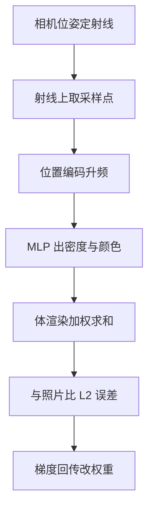

# NeRF

一句话:NeRF 把一个三维场景整个存进一个小神经网络——你告诉它空间里的一个点、以及你从哪个方向看,它回答"那里有多实、看上去什么颜色";再把一条视线上的所有回答按物理规律累积起来,就画出一个像素。本篇是 05-3D生成 子领域的地基:**3D 表示谱系和体渲染方程只在这里讲一次**,邻篇都从这里往下接。

## 一、先摆清 3D 表示谱系:NeRF 到底在反对什么

### 五种表示,五种记形状的方式

三维数据没有像图像那样一统天下的格式,几种表示各有各的账:

| 表示 | 怎么记形状 | 内存随分辨率 | 可微吗 | 擅长 / 短板 |
|---|---|---|---|---|
| 体素网格 | 把空间切成 $n^3$ 个小方块,每格记"占没占""什么颜色" | $O(n^3)$,边长翻倍内存 ×8 | 可微,规则网格能直接上 3D 卷积 | 最直观、最好写;分辨率和内存正面对撞 |
| 点云 | 一堆离散三维点,可带颜色和法向 | $O(N)$,只跟点数走 | 可微(点坐标是连续量) | 激光雷达/深度相机直出、稀疏省内存;**没有连通性**,不知道哪两点之间是面,没法直接渲染出实心表面 |
| 三角网格 | 顶点 + 面片,显式记录谁和谁连着 | $O(V)$ | 顶点位置可微,**拓扑不可微**(增删面片是离散操作) | 图形工业标准件,光栅化极快;拓扑一变就没法梯度优化,自动生成容易破面 |
| 隐式场 · SDF | 一个函数返回该点到表面的**有符号距离**,零等值面就是表面 | 与分辨率**无关**,只跟网络容量走 | 全程可微 | 表面定义干净、任意拓扑;想看见它得先做 ray marching 或提网格 |
| 隐式场 · 占用场 | 函数返回该点"在物体内部"的概率,0.5 等值面是表面 | 同上 | 全程可微 | 训起来比 SDF 容易(就是个二分类);表面精度略糙 |
| 隐式场 · 辐射场 | 函数返回该点的**体密度**和**朝某方向看的颜色** | 同上 | 全程可微 | 直接为"渲染出图"设计,不预设表面存在;换来的是几何不干净 |

### 显式离散网格的死结:内存按立方涨

算一笔账就明白 NeRF 在躲什么。想用体素存一个场景的颜色和密度,每格 4 个 float:$512^3$ 格是 **2 GB**,边长翻到 1024 就是 **17 GB**。而分辨率 512 在真实场景里连桌面上的字都分不清。

**这是一个结构性的问题,不是工程没做好**:显式网格把"空间位置"当成数组下标,下标的个数天生按立方增长,而场景里绝大部分格子是空气。

NeRF 的整个立论就是绕开它:**别把场景存成一张离散的表,存成一个连续函数**。函数的参数量由你定,和你想查多细完全无关——NeRF 论文里一个场景的全部权重是 **5 MB**(原文口径:相比 LLFF 压缩约 3000 倍)。

**为什么隐式场跟分辨率无关?** 因为你查的是 $f(x,y,z)$,$x$ 是实数,想在哪儿采就在哪儿采;网络就那么大,不会因为你查得更密而变大。这条便宜不是白拿的:**每查一个点都要跑一次网络前向**,第四节要还这笔账。

从隐式场里把三角网格提取出来(Marching Cubes)、以及网格的拓扑与 UV 问题,见 网格生成 篇。

> 🖼️ 占位:同一个兔子模型的五种表示对照示意——体素块、点云、三角网格、SDF 等值面切片、辐射场的密度体

## 二、隐式辐射场与体渲染方程

### 一个 MLP,吃 5 维,吐 4 维

NeRF 的网络 $F_\Theta$ 输入是 5 维:空间位置 $(x,y,z)$ 加一个视角方向(用两个角度或一个单位向量表示);输出是 4 维:一个**体密度** $\sigma$ 和一个 RGB 颜色。

体密度不是"透明度",它是**微分意义上的不透明度**:光线走过 $x$ 处一段无穷小距离时被那里的粒子挡住的概率密度。数值上没有上界,大到一定程度就等于实心。

**为什么颜色依赖视角,密度不依赖?** 这是两条方向相反的理由,面试几乎必追:

- **密度不能依赖视角,因为几何必须多视角一致。** 一块木头在那儿就是在那儿,换个角度看它不会消失。反过来说,如果允许密度随视角变,网络就能给每个训练视角各编一套几何去硬背那张照片,**多视角之间的一致性约束当场作废**——而这个约束是 NeRF 唯一的监督来源(它从没见过三维真值)。
- **颜色必须依赖视角,否则镜面高光、金属反光、水面反射全表达不了。** 这些现象的本质就是"同一个点从不同角度看颜色不一样"。

这条先验被**硬编码进了网络结构**,不是靠损失函数劝出来的:8 层、每层 256 宽的 MLP 只吃位置,先输出 $\sigma$ 和一个 256 维特征;之后才把视角方向拼上来,过一层 128 宽的分支输出 RGB。**方向进得晚,是为了让它根本没有机会影响 $\sigma$。**

### 体渲染方程:一条射线怎么变成一个像素

给定相机位姿,每个像素对应一条射线 $\mathbf{r}(t) = \mathbf{o} + t\mathbf{d}$。它的颜色是:

$$
C(\mathbf{r}) = \int_{t_n}^{t_f} T(t)\,\sigma(\mathbf{r}(t))\,\mathbf{c}(\mathbf{r}(t), \mathbf{d})\,\mathrm{d}t, \qquad T(t) = \exp\left(-\int_{t_n}^{t} \sigma(\mathbf{r}(s))\,\mathrm{d}s\right)
$$

人话:沿这条射线从近走到远,把沿途每个点的颜色加起来,每个点的权重是两项相乘——一项是**它自己有多实**($\sigma$),另一项是**光从它那里出发能不能活着走到相机**($T$)。

$T$ 叫**透射率**,它等于前面所有密度的累计衰减,是一个从 1 单调降到 0 的量。**这一项就是"遮挡"的数学写法。** 没有它,墙背后那把椅子的颜色会和墙的颜色直接加在一起,渲出来就是一片鬼影;有了它,一旦射线在墙上把密度积够,后面所有点的权重被压到接近 0,自动被挡住。

实现时这条积分要离散化:在 $[t_n, t_f]$ 上把射线切成 $N$ 段,每段内**随机取一个点**,连续积分变成加权求和,其中每个点的不透明度是 $1 - e^{-\sigma_i \delta_i}$($\delta_i$ 是段长),透射率变成前面各项的累乘。

**为什么每段要随机抖动,不用固定等距?** 因为 MLP 只在被查询过的位置上受到训练。等距采样意味着网络一辈子只在那 64 个固定深度上见过监督,换个视角渲染时采样点落进缝隙,那里就是没学过的空白。随机抖动让整条射线上的连续位置在训练过程中都被覆盖到。

### 为什么它能只靠照片训出几何

上面这一整条链路——查询 MLP、算权重、加权求和——**全部是可微的初等运算**。所以"渲出来的像素"和"真实照片上那个像素"之间的 L2 误差,可以一路反传回 MLP 权重。

**NeRF 全程没有任何三维真值,它只是在拟合一堆二维照片。** 几何是被逼出来的副产品:要让几十张不同角度的照片同时对得上,唯一省力的办法就是在正确的位置长出正确的密度。这也解释了它对输入的苛刻——视角太少、相机参数不准,"同时对得上"这个约束就不够强,网络会退化成一团只在训练视角上成立的雾。

### 分层采样:别把算力花在空气上

均匀采样的浪费是显然的:一条射线上绝大多数区间是空气,$\sigma \approx 0$,算出来的颜色乘上一个接近零的权重就扔掉了。**真正决定像素颜色的常常只是物体表面附近很薄的一层。**

NeRF 的解法是训两个结构相同、参数不共享的网络:

1. **粗网络**:沿射线均匀分层采 $N_c = 64$ 个点,渲一遍。它的副产品是每个采样点的权重,**这串权重归一化之后就是一个"东西大概在哪"的概率分布**。
2. **细网络**:按这个分布做逆变换采样,再抽 $N_f = 128$ 个点,它们会**扎堆落在权重大的地方**;把 64 + 128 = 192 个点合起来送进细网络,算最终颜色。

两个网络一起训,损失是粗、细两路渲染结果各自和照片比的 L2 之和。**代价很实在:一条射线一共要跑 64 + 192 = 256 次 MLP 前向。**

> 🖼️ 占位:一条射线的采样示意——上半部画粗采样的 64 个均匀点与算出的权重曲线,下半部画细采样的 128 个点如何扎堆在表面附近

## 三、位置编码:整篇最反直觉的一条

### 现象:直接喂坐标,只能得到一团糊

把原始的 $(x,y,z)$ 直接送进 MLP,NeRF 渲出来的是**轮廓大致对、但完全没有细节**的模糊物体。这是论文消融里掉分最狠的一项,比去掉视角依赖还狠。

### 原因:MLP 有低频偏好

**谱偏差(spectral bias)**:ReLU 网络天生倾向于先学低频、平滑的函数,高频细节学得极慢甚至学不动。用神经正切核(NTK)的语言说,标准 MLP 对应的核衰减很快,高频分量的有效学习率低到可以忽略。

> **类比**:MLP 像一个只会画平滑渐变的画师。你让它画一堵砖墙,它给你一片均匀的红。

修法是在输入端做一次固定的频率映射,把每个坐标分量升到高维:

$$
\gamma(p) = \left(\sin(2^0 \pi p),\ \cos(2^0 \pi p),\ \ldots,\ \sin(2^{L-1} \pi p),\ \cos(2^{L-1} \pi p)\right)
$$

人话:把一个坐标数值拆成一串**频率成倍增长**的正余弦。最低频那一对只告诉网络"这个点大概在场景的哪半边";最高频那一对在坐标挪动千分之一时就会翻个个儿。**于是空间上挨得极近的两个点,编码之后在向量空间里被拉得很开**,网络这才有能力给它们不同的输出。

理论解释在 Fourier Features 那篇论文里:频率映射把 MLP 的有效 NTK 变成一个**平稳核**,而映射用的频率尺度直接决定这个核的带宽——带宽调宽了,高频才学得动。

### $L$ 怎么选:位置和方向为什么不一样

NeRF 的取值是位置 $L = 10$(3 个分量各升到 20 维,共 60 维),方向 $L = 4$(共 24 维)。

**方向的频率明显低,是因为视角相关的颜色变化本来就平滑**:高光随角度渐变,不会在角度挪动一点点时突变。而空间中的颜色和密度是可以突变的——物体边缘那一侧是实心,另一侧是空气。

$L$ 是个很实在的旋钮,两头都有坑:**开小了细节糊(高频学不动),开大了网络会去拟合噪声**,在训练视角之外冒出高频伪影,因为你给了它表达一切抖动的能力,却没给它足够的视角去约束。

## 四、慢在哪、怎么加速、还有什么解决不了

### 训练慢和渲染慢是两件事

论文口径(单张 NVIDIA V100):一个场景收敛需要 100–300k 次迭代,约 **1–2 天**;渲一帧图约 **30 秒**。这两个数字的成因不同:

| | 慢的根源 | 算一笔账 |
|---|---|---|
| 训练慢 | 一步只喂 4096 条射线的监督,却要**从随机初始化把一整个连续函数拟合出来**;而且梯度是全局的,改一个权重整个场景都跟着动,收敛自然慢 | 30 万迭代 × 4096 射线 × 256 采样点的前向加反向 |
| 渲染慢 | 一个像素一条射线,一条射线 256 次 MLP 前向,而**像素数按分辨率平方涨** | $800 \times 800$ 一帧就是约 **1.6 亿次** MLP 前向;1080p 约 5.3 亿次 |

所以两边的解法方向也不同:**加速训练要让表示更容易拟合**(给它一个带空间局部性的数据结构),**加速渲染要么少查、要么把每次查询变便宜**。

### 加速谱系:各自动了哪一环

| 方法 | 改的是哪一环 | 做法 | 论文口径 |
|---|---|---|---|
| NSVF | 采样 | 用稀疏体素八叉树标出哪里非空,渲染时整块跳过空区 | 比 NeRF 快 10 倍以上 |
| KiloNeRF | 网络容量 | 一个大 MLP 换成**几千个各管一小块空间的小 MLP**,每次查询只跑其中一个;靠蒸馏训练 | 渲染快三个数量级 |
| Instant-NGP | 输入编码 | 频率编码换成**多分辨率哈希查表**,后面只挂一个极小的 MLP | 秒级训练;1920×1080 下渲染几十毫秒(RTX 3090) |
| Plenoxels | 表示本身 | 干脆不要神经网络,直接优化稀疏体素网格加球谐系数 | 比 NeRF 快两个数量级,质量不降 |
| TensoRF | 表示本身 | 把辐射场当成一个 4D 张量做低秩分解 | VM 分解版本 10 分钟内完成重建 |
| Mip-NeRF | 采样几何 | 射线换成**锥体**,按锥台积分 | 误差在 NeRF 数据集上降 17%,多尺度变体上降 60%;比 NeRF 快 7%、模型只有一半大 |

不同论文的 PSNR 口径与数据集不同,上表只列各自原文自报的相对提升,**不可跨行横向比较**。

### Instant-NGP:把容量从网络挪到查找表

原版 NeRF 里"某个位置长什么样"这件事全靠 MLP 权重去记,所以网络必须够大、训练必须够久。Instant-NGP 反过来做:在 $L = 16$ 个分辨率层级上各挂一张哈希表,表里存的是**可训练的特征向量**(每条 2 维,表容量 $T$ 取 $2^{14}$ 到 $2^{24}$)。查询一个点时,在每层找到它所在格子的角点、查表、三线性插值,把 16 层结果拼起来,喂给一个只有一两个隐层、64 宽的小 MLP。

三条好处缺一不可:

1. **梯度变局部了。** 改一个格子的特征只影响它附近那一小块空间,不像 MLP 改一个权重全场景都动——这是训练能压到秒级的**主因**。
2. **查表比跑网络便宜得多**,原本要靠大网络算出来的容量,现在大部分是内存访问。
3. **哈希表大小固定,不随分辨率涨。** 高分辨率层级的格子数远超表容量,**碰撞必然发生**;而论文的做法是**不做任何冲突处理**,不探测、不分桶、不拉链,让碰撞的条目共享同一份特征,靠训练自己去平衡——碰撞条目的梯度会被平均,表面附近的采样点梯度大、空区的梯度小,重要的一方自然占上风。

### Mip-NeRF:改的是采样的几何形状

原版 NeRF 沿一条**无穷细的射线**取点,但一个像素实际覆盖的是一个有张角的锥体:相机凑近时这个锥体打在物体上很粗,离远时很细。**同一个空间点在远近不同的照片里本该被"看成"不同的尺度,而无穷细的射线把这个信息整个丢了。** 后果是训练集里有远有近时,近景糊、远景带锯齿。

Mip-NeRF 把每段射线换成一个**锥台**,并把位置编码换成"对锥台内一个高斯分布求期望"的版本(集成位置编码)。这么一改,**锥台越粗,高频那几对正余弦的期望越接近 0,自动被压掉**——相当于把抗锯齿内建进了编码。Mip-NeRF 360 进一步用非线性场景参数化把它推广到无边界场景。

### 局限:哪些是 NeRF 本身解决不了的

1. **一个场景一个模型,它不是生成模型。** 训好的权重只对那个场景有效,换个场景从头再来——NeRF 本质是**重建**方法,不是"给一句话生成一个物体"。想要前馈泛化得额外做条件化,如 pixelNeRF 把图像特征当条件喂进去。用 2D 扩散先验去驱动 3D 生成(SDS 那条路)见 多视角扩散 篇。
2. **必须有多视角标定图。** 输入不只是照片,还要每张的相机内外参,通常先用 COLMAP 这类 SfM 跑一遍;标定不准,重建直接崩。
3. **动态场景和复杂光学难。** 体渲染方程假设场景静止、光沿直线走、只在介质里被吸收和发射;镜面反射、折射、半透明玻璃都不在这个模型里。光照会变的网络照片得靠 NeRF-W 那样给每张图挂一个可学的外观嵌入来兜底。
4. **编辑困难。** 场景摊在网络权重里,没有"这是椅子那是桌子"的结构;想挪一把椅子,你不知道该改哪几个权重。**这是隐式表示相对网格最实际的劣势**,也是工业管线仍然要网格的原因之一。
5. **渲染速度。** 后来 3DGS 用显式基元加可微光栅化把实时渲染拿了回来,细节与横向对比见 3DGS 篇。

## 五、面试考点串联

本篇题库里暂无同名真题,下表全部是按正文核心断言补出的问法。

| 高频问法 | 本文哪一节 |
| --- | --- |
| 三维数据一般有哪几种表示?各自的内存怎么随分辨率涨?(补充题) | 一(谱系表) |
| NeRF 把场景存成什么?比体素网格那种存法好在哪?(补充题) | 一(立方内存的死结) |
| NeRF 那个网络输入输出是什么?为什么颜色依赖视角、密度不依赖?(补充题) | 二(两条相反的理由 + 结构硬编码) |
| 体渲染那条积分在算什么?里面的透射率项是干什么的,没有它会怎样?(补充题) | 二(遮挡的数学写法) |
| NeRF 训练时并没有三维真值,监督信号从哪来?几何是怎么被逼出来的?(补充题) | 二(全链路可微 + 多视角一致) |
| 为什么要粗细两个网络?沿射线均匀采样有什么问题?(补充题) | 二(分层采样) |
| 直接把 xyz 喂给 MLP 会怎样?为什么非要加位置编码?(补充题) | 三(谱偏差) |
| 位置编码的频率开大开小分别有什么问题?位置和方向为什么用不同的 $L$?(补充题) | 三($L$ 那个旋钮) |
| NeRF 训练慢和渲染慢是一回事吗?各自慢在哪?(补充题) | 四(两笔账) |
| Instant-NGP 靠什么把训练压到秒级?哈希碰撞它怎么处理?(补充题) | 四(容量挪进查找表) |
| Mip-NeRF 想解决什么问题?它改的是哪一环?(补充题) | 四(锥台与集成位置编码) |
| NeRF 能直接拿来做 3D 生成吗?为什么说它本质是重建?(补充题) | 四(局限第 1 条) |
| 训好一个 NeRF 之后想挪动场景里的一个物体,难在哪?(补充题) | 四(局限第 4 条) |

## 相关文献

- NeRF: Representing Scenes as Neural Radiance Fields for View Synthesis — [arXiv:2003.08934](https://arxiv.org/abs/2003.08934)
- Fourier Features Let Networks Learn High Frequency Functions in Low Dimensional Domains — [arXiv:2006.10739](https://arxiv.org/abs/2006.10739)
- On the Spectral Bias of Neural Networks — [arXiv:1806.08734](https://arxiv.org/abs/1806.08734)
- Instant Neural Graphics Primitives with a Multiresolution Hash Encoding — [arXiv:2201.05989](https://arxiv.org/abs/2201.05989)
- Mip-NeRF: A Multiscale Representation for Anti-Aliasing Neural Radiance Fields — [arXiv:2103.13415](https://arxiv.org/abs/2103.13415)
- Mip-NeRF 360: Unbounded Anti-Aliased Neural Radiance Fields — [arXiv:2111.12077](https://arxiv.org/abs/2111.12077)
- DeepSDF: Learning Continuous Signed Distance Functions for Shape Representation — [arXiv:1901.05103](https://arxiv.org/abs/1901.05103)
- Occupancy Networks: Learning 3D Reconstruction in Function Space — [arXiv:1812.03828](https://arxiv.org/abs/1812.03828)
- Neural Sparse Voxel Fields — [arXiv:2007.11571](https://arxiv.org/abs/2007.11571)
- KiloNeRF: Speeding up Neural Radiance Fields with Thousands of Tiny MLPs — [arXiv:2103.13744](https://arxiv.org/abs/2103.13744)
- Plenoxels: Radiance Fields without Neural Networks — [arXiv:2112.05131](https://arxiv.org/abs/2112.05131)
- TensoRF: Tensorial Radiance Fields — [arXiv:2203.09517](https://arxiv.org/abs/2203.09517)
- NeRF in the Wild: Neural Radiance Fields for Unconstrained Photo Collections — [arXiv:2008.02268](https://arxiv.org/abs/2008.02268)
- pixelNeRF: Neural Radiance Fields from One or Few Images — [arXiv:2012.02190](https://arxiv.org/abs/2012.02190)
- 3D Gaussian Splatting for Real-Time Radiance Field Rendering — [arXiv:2308.04079](https://arxiv.org/abs/2308.04079)
