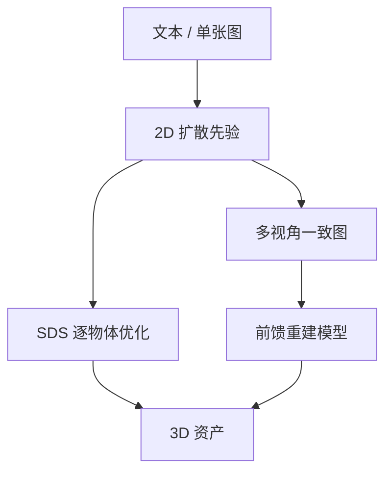

# 多视角扩散

一句话:高质量 3D 资产比互联网图片少三到四个数量级,所以 3D 生成走不通「堆数据训一个 3D 扩散模型」这条路——本篇讲的所有方法,本质上都是**把 2D 扩散模型已经学到的视觉先验搬到 3D 上**的不同解法。

## 一、根本约束:3D 数据稀缺

### 量级差在哪

| 数据 | 公开可用量级 | 口径 |
|---|---|---|
| 2D 图文对 | **58.5 亿** | LAION-5B(2022),其中英文 23.2 亿 |
| 3D 资产(原始爬取) | **80 万** → **1000 万+** | Objaverse(2022)→ Objaverse-XL(2023) |
| 3D 资产(过滤后真正拿来训) | **35 万 / 50 万** | MVDream 从 Objaverse 筛出 35 万;TRELLIS 用 50 万 |

关键不在「3D 少一点」,而在**过滤之后差了约四个数量级**。Objaverse-XL 那 1000 万件里,约 550 万来自 GitHub 上的 3D 文件、约 350 万来自 Thingiverse 的 3D 打印件(大多是无贴图的 STL,渲染时要人为上色),真正带干净几何与材质的 Sketchfab 部分只有约 80 万——也就是 Objaverse 1.0 那一份。**各家论文过滤后落在几十万这一档,和 2D 侧的几十亿比,不是同一个游戏。**

### 为什么 3D 数据这么难拿

三条,一条比一条硬:

- **图片是顺手产生的副产品,3D 资产不是**。任何人拍张照发到网上就贡献了一条训练数据;一件带干净拓扑和 UV 的模型是专业建模师几小时到几天的产出。**供给端的人数和单件成本都差了好几个数量级。**
- **没有「3D 互联网」**。图像有几十年沉淀的网页图文对可爬;3D 资产主要躺在商业素材站和游戏公司内部,不开放、不可爬、授权不清。
- **扫描重建出来的不好用**。绕着物体拍一圈重建出的东西,几何有噪声、拓扑破碎、光照被烘死在贴图里。**做「看起来对」的渲染够用,做「拿去改」的生产资产不够用**(这条标准见 网格生成 篇)。

顺带一件反直觉的事:**多视角图像本身其实不稀缺**——视频、街景、商品多图天然带多个视角,稀缺的是**精确的相机位姿标注**。这就是为什么后面很多工作宁可去渲染合成数据也不硬啃真实数据:**合成渲染的位姿是精确已知的,而位姿标错比没有位姿更糟**。

### 结论:借 2D 的先验

既然自己没数据,就用别人的。2D 扩散模型在几十亿张图上学到了「物体长什么样、材质怎么反光、这个角度的猫是什么形状」,这些先验对 3D 同样有效。三条搬运路线:

| 路线 | 怎么用 2D 先验 | 起点工作 |
|---|---|---|
| **优化式(SDS)** | 冻住 2D 模型当评委,反复渲染 3D 表示去问它像不像 | DreamFusion(2022.09) |
| **视角条件化** | 微调 2D 模型,让它吃相机位姿这个条件 | Zero-1-to-3(2023.03) |
| **前馈式** | 用前两条造训练数据,训一个「一次前向出 3D」的模型 | LRM(2023.11) |

三条是**递进关系而不是并列关系**:后一条要靠前一条产出的数据或先验才立得住。

## 二、优化式:SDS 把冻结的扩散模型当评委

### 机制:渲染 → 挨批 → 改

DreamFusion 提出的 **Score Distillation Sampling(SDS,分数蒸馏采样)** 只有三步,循环几万次:

1. 随机挑一个机位,把当前的 3D 表示渲染成一张 2D 图
2. 给这张图加一档随机噪声,丢给**冻结的** 2D 扩散模型,问它「要变成一张符合提示词的好图,该往哪擦」
3. 把这个「往哪擦」的方向,经渲染器反传回 3D 表示的参数上

> **类比**:你在捏泥人,没有参考模型,只有一位蒙着眼、只在你把泥人举到面前时才睁眼的评委。每次随机换个角度举给他看,他说一句「这里该更像猫」,你就照着改。角度举得够多、次数够多,泥人从任何角度看都像猫了。

### 那一行梯度在说什么

$$
\nabla_\theta \mathcal{L}_{\text{SDS}} = \mathbb{E}_{t,\epsilon}\Big[\, w(t)\big(\hat{\epsilon}_\phi(z_t, y, t) - \epsilon\big)\frac{\partial x}{\partial \theta} \Big]
$$

逐块读:$\theta$ 是 3D 表示的参数,$x$ 是从随机机位渲染出的那张图。括号里是**评委认为图里多出来的噪声,减去我们实际掺进去的噪声**——这个差就是「这张图离一张好图差在哪」的方向。乘上渲染器的雅可比 $\partial x/\partial \theta$,把这条二维的修改意见摊回三维参数上。

最该记住的是**式子里没有扩散模型自己的雅可比**。DreamFusion 把那一项整个删掉了,理由有两条:反传穿过 U-Net 很贵;而且它在小噪声档位上条件数很差(它近似的是边缘密度的缩放海森)。删掉之后梯度反而好用——**这正是 2D 模型能被整个冻住、只当一个只读评委的原因**。(加噪去噪与 $\epsilon$ 参数化本身见 Diffusion 篇。)

### 为什么它一份 3D 数据都不需要

因为**整条链路里没有任何一处需要「这个物体真实的 3D 长什么样」当监督**。评委只看 2D 渲染图,而好坏判据完全来自它在几十亿张图上学到的东西。3D 一致性不是被数据教出来的,是**被「同一套参数要同时讨好所有机位」这个约束逼出来的**。

代价也从同一处来:这是**逐物体的优化,不是推理**。每要一个新物体,就得从头跑几万步。

### 三笔代价

- **慢**。DreamFusion 论文口径:15,000 步、一台 4 芯片 TPUv4 机器上约 1.5 小时,渲染分辨率只有 64×64(对齐 Imagen 的 64×64 基模)。Magic3D(2022.11)压到 40 分钟(8 卡 A100),自报比 DreamFusion 快 2 倍。**仍是分钟到小时级的单件成本,做不成交互式产品。**
- **过饱和、发糊**。DreamFusion 自己写明 SDS 相对祖先采样「常产生过饱和、过平滑的结果」。根子在引导权重:它用 $\omega = 100$,而普通文生图常用 5–30。为什么必须开这么大?**因为 SDS 的目标是寻峰的**——权重小的时候,同一个提示词下多种可能的外观会被平均掉,直接糊成一团;开到 100 又把颜色推出正常区间,于是过饱和。**这是一个旋钮上的两难,不是调参没调好**(CFG 机制见 Diffusion 篇)。
- **多样性低**。同一提示词反复跑,结果高度雷同,同样是寻峰的后果。ProlificDreamer(2023.05)的 **VSD(Variational Score Distillation)** 正是针对这三条:把 3D 参数当成随机变量而不是定值来优化,论文自报在常用的 CFG 7.5 下就能同时改善多样性和质量。

被优化的那个 3D 表示,早期是 NeRF,后来常换成 3DGS——因为优化循环里每步都要渲染,渲染快就是全局提速。两种表示怎么工作,见 NeRF 篇和 3DGS 篇。

## 三、Janus 问题与视角条件化

### Janus 问题:评委不知道自己在看背面

SDS 出来的物体经常**正面有脸、背面又长一张脸**,或者一只狗顶着两三个头。这叫 **Janus 问题**(得名于罗马双面神,也叫多面/多头问题),DreamFusion 论文里就承认基础模型几何很差、狗有多个头。

原因一句话说得清:**2D 扩散模型没有「背面」这个概念**。它在互联网图片上训出来,而「一只柯基」的图绝大多数是正脸照——**没人拍狗屁股**。于是不管你把泥人转到哪个角度举给它看,它都说「这个角度该有一张脸」。你照办,转一圈之后每一面都有脸。

**这不是 SDS 算法的 bug,是视角先验缺失的直接后果**:评委手里既没有「当前机位是哪一面」这个信息,也没有「不同机位应该看到不同东西」这个知识;训练数据里正面照远多于背面照,又让它进一步倒向正面。

> 🖼️ 占位:同一个 SDS 优化结果绕 360° 的四张渲染图,圈出正面与背面各长出一张脸的位置

### 三档缓解手段,各自的边界

| 手段 | 做法 | 为什么能缓解 | 边界 |
|---|---|---|---|
| **视角文本提示** | 按机位往提示词后拼 front view / side view / back view / overhead view(DreamFusion 的做法) | 让文本条件带上一点方位信息 | **最弱**。方位只是几个词,模型响应很不可靠;正背面照片数量本就不平衡,一个 back view 压不过分布 |
| **负提示的几何修正** | Perp-Neg:把负提示在正提示方向上的分量投影掉,只保留垂直分量 | 正负提示语义重叠时,朴素负提示会把想要的内容一起减掉;去掉平行分量才只压「不想要的那一面」 | 仍是在文本条件上打补丁,治标 |
| **换一个带视角先验的评委** | 用吃相机位姿、或一次出多视角的扩散模型来做 SDS 的评委 | **把方位从几个词变成连续的相机参数,而且是在带位姿标注的渲染数据上学的** | 治本,但要回头依赖 3D 数据;模型能力被那几十万件资产的分布框住 |

分档很重要,面试常追这一层:**前两条是在提示词层面打补丁,第三条是换先验**。MVDream(2023.08)把第三条做到了头——直接训一个一次出 4 张视角图的扩散模型再拿它当评委,论文口径是这样生成的 NeRF 不再有多视角一致性问题。代价写在训练配方里:它要用 Objaverse(筛后 35 万件)和 LAION 按 70%/30% 混着训,**多视角一致性是拿泛化性换来的**——3D 那部分数据全是白底单物体,所以这类模型面对复杂场景时明显弱于原始 2D 基模。

### 把相机位姿写成条件:Zero-1-to-3

Zero-1-to-3(2023.03)是另一条路的起点:**不碰 3D,只做「换个角度重画一张」**。给一张图和一个相对相机变换,输出同一物体在新角度下的样子。

这个条件长什么样值得记住,因为它和文本、边缘图都不同:**它是几个连续标量,既不是序列也不是空间图**。Zero-1-to-3 用相对球坐标 $(\Delta\theta, \Delta\phi, \Delta r)$——极角差、方位角差(拆成 sin/cos 两个分量喂,避开 360°→0° 的跳变)、半径差,再拼上输入图的 CLIP 图像嵌入送进模型(条件注入机制见 条件控制 篇)。

难在哪:**这个条件不携带任何空间对齐信息**。深度图、边缘图是逐像素对齐的,模型照着描就行;相机位姿只说「转了 30 度」,至于转过去之后哪个像素该出现在哪,得模型自己想明白——**它必须真的建立起对物体的三维理解,才能正确响应这个条件**。这也是为什么这类模型只能靠渲染数据学:**监督信号必须是「同一个物体、已知位姿差、两张图」这样的三元组**,而这在真实照片里几乎拿不到。

**它靠什么学会的**:Objaverse 的 80 万件模型,每件随机渲 12 个视角、位姿精确已知,合起来约 1000 万张图。论文自列的局限也很直白——复杂背景和多物体场景明显退化,因为训练数据全是白底单物体。

### 独立生成为什么必然不一致

Zero-1-to-3 一次只出一张,要重建就得要好几张。**如果各张独立采样,不一致是必然的,不是概率问题**:

扩散是从随机噪声出发的随机采样。提示词和位姿只约束了「大概长什么样」,**没有被条件约束住的自由度,全部由那份初始噪声定夺**——背面 logo 是什么图案、杯把多粗、褶皱往哪走。这些自由度在正面那张图里被随机定死一种,在侧面那张图里又被独立地定死另一种。**两张图各自都合法,但描述的不是同一个物体。** 下游重建拿到互相矛盾的观测,只能糊成一团或长出鬼影。

> 🖼️ 占位:独立采样与联合采样的对比——同一物体的四个视角,上排各画各的(背面花纹三种版本),下排一次生成互相对齐

### 让它们互相看得见:跨视角注意力

解法只有一个方向:**别独立生成,一次生成一组,并让这组图在去噪的每一步互相注意**。那些没被条件约束的自由度,就会在组内被协商成同一个答案。几种具体形态:

| 做法 | 代表 | 要点 |
|---|---|---|
| **拼成一张图** | Zero123++ 把 6 个视角平铺成一张 3×2 大图 | 最省事——一张图内部本来就有全局自注意力,一致性白捡;代价是单视角分辨率被摊薄 |
| **打通自注意力** | MVDream 把 4 个视角的 token 展平成一条序列做 3D 自注意力 | 论文明确说按帧的时序注意力学不出多视角一致,必须让所有视角的所有位置互相可见 |
| **参考注意力** | Zero123++ 让输入图过一遍网络,把它的 K/V 接到生成分支上 | 把「和输入图保持同一个物体」也做成注意力 |
| **几何先验剪枝** | Era3D 只让同一行之间做注意力(极线先验) | 全图跨视角注意力随分辨率爆炸,行内注意力自报省 12 倍,才做得到 512×512 |
| **显式几何对齐** | SyncDreamer 用 3D 感知的特征注意力,按几何对应关系关联跨视角特征 | 一致性更硬,代价是要额外维护一套 3D 感知特征 |
| **多域联合** | Wonder3D 同时出 6 个视角的彩色图和法线图,两个域之间也做注意力 | 法线直接约束几何,重建更稳;论文自报约 2 分钟出带贴图网格 |

一条常被追问的设计细节:Zero123++ 的 6 个机位是**仰角交替**的(一档俯视 30°、一档仰视 20°,方位角从 30° 起每次 +60°)。为什么不取均匀一圈?因为**均匀一圈存在朝向歧义**——转一圈处处等价,模型分不清哪张是正面;交替仰角把这个歧义破掉,下游也就不用再单独估计仰角。

### 和视频的时间一致性是两个问题

容易混,面试也常拿来对照:

| | 多视角(本篇) | 长视频(见 长视频一致性 篇) |
|---|---|---|
| 一致什么 | **同一时刻,不同机位** | **同一个东西,不同时刻** |
| 约束的性质 | 硬:同一个点在不同视角的位置由相机参数唯一确定 | 软:物体本来就会动会变,「该变多少」没有客观答案 |
| 主要坏法 | 视角互相矛盾、Janus | 缓慢漂移、接缝跳变 |
| 规模 | 少(4–8 张),一次前向装得下 | 多(几百帧),一次装不下,必须分段 |

**所以手段的形状也不同**:多视角靠「一次全出 + 组内全连接注意力」基本就解决了,因为张数少、装得下;长视频的麻烦恰恰始于「装不下」,才需要记忆、分层关键帧、误差累积那一整套。两边也在互相借力——SV3D(2024.03)直接把图生视频模型改造成绕物体一圈的轨道视频生成器,**用视频模型天然的帧间一致性来换多视角一致性**。

## 四、优化式 vs 前馈式:为什么前馈后来居上

### 横向对比

| 维度 | 优化式(SDS 一路) | 前馈式(大型重建模型一路) |
|---|---|---|
| 单件耗时 | **分钟到小时**:DreamFusion 约 1.5 h(TPUv4×4),Magic3D 约 40 min(8×A100) | **秒级**:LRM 约 5 s(单张 A100),TripoSR 约 0.5 s(A100),InstantMesh 约 10 s |
| 训练成本 | **零**,不训新模型 | 高:LRM 用 128 张 A100 训约 3 天 |
| 对输入的要求 | 一句文本就够 | 要一张图,或先用多视角扩散生成几张图 |
| 质量上限 | 纹理可以很细(反复优化),但几何常糊、多样性低、过饱和 | 几何更稳、更少 Janus;细节受重建模型容量与训练数据分布限制 |
| 可控性 | 差:每次重跑结果不同,失败只能整件重来 | 好:确定性前向,可以在多视角图那一层介入、重采、挑选 |
| 典型失败 | Janus、飘絮状浮空物、不收敛 | 分布外物体直接崩、薄结构丢失 |

### 前馈式为什么能起来

**关键不是架构变了,是数据问题被前两条路解决了。** 前馈式的老大难一直是「没有足够的(图,3D)配对数据」,而:

- Objaverse / Objaverse-XL 把可渲染的 3D 资产从零变成了几十万到千万件;
- 更重要的是,**多视角扩散模型本身就能批量造训练数据**——把单图变成一组一致的多视角图,前馈重建模型就有了源源不断的监督。这是一条闭环:**2D 先验 → 多视角扩散 → 造数据 → 训前馈模型**。

于是主流管线定型成两段:**多视角扩散出图,稀疏视角重建模型出 3D**。One-2-3-45(2023.06)是早期形态(45 秒出网格);Instant3D(2023.11)把它写清楚成「一次出 4 张结构化视角 + Transformer 稀疏重建出 NeRF」,自报约 20 秒,比优化式方法(1–10 小时)快两个数量级;LGM(2024.02,出高斯)、InstantMesh(2024.04,出网格)都是这个骨架的变体。

到 2024 年底出现第三种形态:**跳过多视角图,直接在 3D 隐空间上做扩散**。TRELLIS(2024.12)用结构化 3D 隐表示(稀疏 3D 网格 + 多视角特征),最大 20 亿参数、50 万件资产训练,同一份隐表示可解码成辐射场、高斯或网格;Hunyuan3D 2.0(2025.01)则把「先出几何、再出贴图」拆成两个模型。截至 2026 年中,这类结构化稀疏隐表示已经是高质量几何的主流骨干,而多视角扩散更多退回到「外观先验」和「造数据」的位置。**注意这条路的前提仍是那几十万件资产——数据稀缺没有被解决,只是被绕开了一部分。**

### 现状与边界

这个方向迭代极快,下面是**截至 2026 年中的口径,不是永恒结论**:

- **做得好的**:白底单物体、几秒出一个带贴图的网格,质量够进「概念草模」这一档;绕一圈看不崩、大形准。
- **还不行的**:
  - **复杂场景**:多物体、带背景、有遮挡关系的场景基本还做不了。当前主流尝试是把场景当成「多视角补全」来做(CAT3D,2024.05,自报一分钟出一个场景),但可控性和几何精度都远不如单物体。
  - **精确几何**:薄板、细杆、镂空、螺纹这类结构经常丢;尺寸不带真实量纲,拿去做装配件不能用。
  - **材质分解**:出来的贴图是**光照被烘死的颜色**,不是可重新打光的 PBR 材质,换个环境光立刻露馅。
  - **拓扑与可编辑性**:自动提出的网格面数高、拓扑乱、UV 不可用,离进生产管线还差一道(归 网格生成 篇)。
- **评测本身也是短板**:没有公认的 3D 生成指标。常见做法是渲染多个视角算 CLIP 分或做人工偏好,但**渲染出来好看不等于几何对**——这和长视频里「把画面冻住就能刷高一致性分」是同一类漏洞。

## 五、面试考点串联

本篇题库里暂无同名真题,下表全部是补充题。

| 高频问法 | 本文哪一节 |
|---|---|
| 3D 生成为什么不直接堆数据训一个 3D 扩散模型? | 一 |
| SDS 在做什么?它为什么一份 3D 数据都不需要? | 二 |
| SDS 出来的东西为什么过饱和、发糊?调小引导权重行不行? | 二(寻峰与 $\omega=100$ 的两难) |
| Janus 问题是怎么回事?根子在哪? | 三 |
| 提示词里加一句 back view 就能治好 Janus 吗?为什么不行? | 三(三档手段表) |
| 相机位姿这个条件和文本、深度图条件有什么不一样?难在哪? | 三(Zero-1-to-3) |
| 各视角分别生成再拿去重建会出什么问题?为什么是必然的? | 三(独立生成) |
| 多视角一致性靠什么保证?几种跨视角注意力差在哪? | 三(做法对照表) |
| 多视角一致性和视频的时间一致性是同一个问题吗? | 三(对照表);时间侧见 长视频一致性 篇 |
| 优化式和前馈式怎么选?各自的代价是什么? | 四(横向对比) |
| 前馈式后来为什么能压过优化式?数据是从哪来的? | 四(闭环) |
| 现在的 3D 生成还有哪些明确做不了的? | 四(现状与边界) |

## 相关文献

- DreamFusion: Text-to-3D using 2D Diffusion(SDS)— [arXiv:2209.14988](https://arxiv.org/abs/2209.14988)
- Score Jacobian Chaining: Lifting Pretrained 2D Diffusion Models for 3D Generation — [arXiv:2212.00774](https://arxiv.org/abs/2212.00774)
- Magic3D: High-Resolution Text-to-3D Content Creation — [arXiv:2211.10440](https://arxiv.org/abs/2211.10440)
- ProlificDreamer: High-Fidelity and Diverse Text-to-3D Generation with Variational Score Distillation — [arXiv:2305.16213](https://arxiv.org/abs/2305.16213)
- Re-imagine the Negative Prompt Algorithm: Transform 2D Diffusion into 3D, alleviate Janus problem and Beyond(Perp-Neg)— [arXiv:2304.04968](https://arxiv.org/abs/2304.04968)
- Zero-1-to-3: Zero-shot One Image to 3D Object — [arXiv:2303.11328](https://arxiv.org/abs/2303.11328)
- Zero123++: a Single Image to Consistent Multi-view Diffusion Base Model — [arXiv:2310.15110](https://arxiv.org/abs/2310.15110)
- MVDream: Multi-view Diffusion for 3D Generation — [arXiv:2308.16512](https://arxiv.org/abs/2308.16512)
- SyncDreamer: Generating Multiview-consistent Images from a Single-view Image — [arXiv:2309.03453](https://arxiv.org/abs/2309.03453)
- Wonder3D: Single Image to 3D using Cross-Domain Diffusion — [arXiv:2310.15008](https://arxiv.org/abs/2310.15008)
- Era3D: High-Resolution Multiview Diffusion using Efficient Row-wise Attention — [arXiv:2405.11616](https://arxiv.org/abs/2405.11616)
- SV3D: Novel Multi-view Synthesis and 3D Generation from a Single Image using Latent Video Diffusion — [arXiv:2403.12008](https://arxiv.org/abs/2403.12008)
- One-2-3-45: Any Single Image to 3D Mesh in 45 Seconds without Per-Shape Optimization — [arXiv:2306.16928](https://arxiv.org/abs/2306.16928)
- LRM: Large Reconstruction Model for Single Image to 3D — [arXiv:2311.04400](https://arxiv.org/abs/2311.04400)
- Instant3D: Fast Text-to-3D with Sparse-View Generation and Large Reconstruction Model — [arXiv:2311.06214](https://arxiv.org/abs/2311.06214)
- LGM: Large Multi-View Gaussian Model for High-Resolution 3D Content Creation — [arXiv:2402.05054](https://arxiv.org/abs/2402.05054)
- TripoSR: Fast 3D Object Reconstruction from a Single Image — [arXiv:2403.02151](https://arxiv.org/abs/2403.02151)
- InstantMesh: Efficient 3D Mesh Generation from a Single Image with Sparse-view Large Reconstruction Models — [arXiv:2404.07191](https://arxiv.org/abs/2404.07191)
- CAT3D: Create Anything in 3D with Multi-View Diffusion Models — [arXiv:2405.10314](https://arxiv.org/abs/2405.10314)
- Structured 3D Latents for Scalable and Versatile 3D Generation(TRELLIS)— [arXiv:2412.01506](https://arxiv.org/abs/2412.01506)
- Hunyuan3D 2.0: Scaling Diffusion Models for High Resolution Textured 3D Assets Generation — [arXiv:2501.12202](https://arxiv.org/abs/2501.12202)
- Objaverse: A Universe of Annotated 3D Objects — [arXiv:2212.08051](https://arxiv.org/abs/2212.08051)
- Objaverse-XL: A Universe of 10M+ 3D Objects — [arXiv:2307.05663](https://arxiv.org/abs/2307.05663)
- LAION-5B: An open large-scale dataset for training next generation image-text models — [arXiv:2210.08402](https://arxiv.org/abs/2210.08402)
